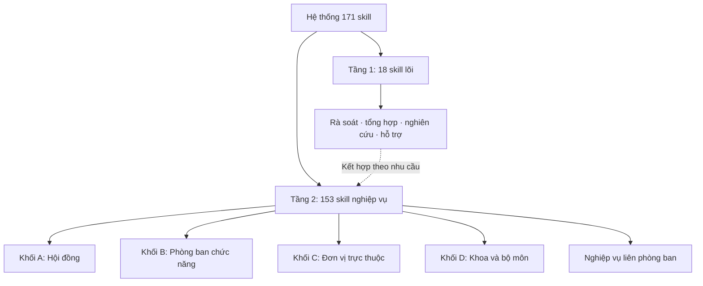
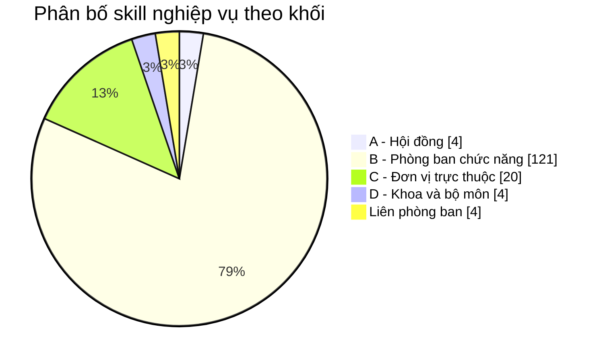
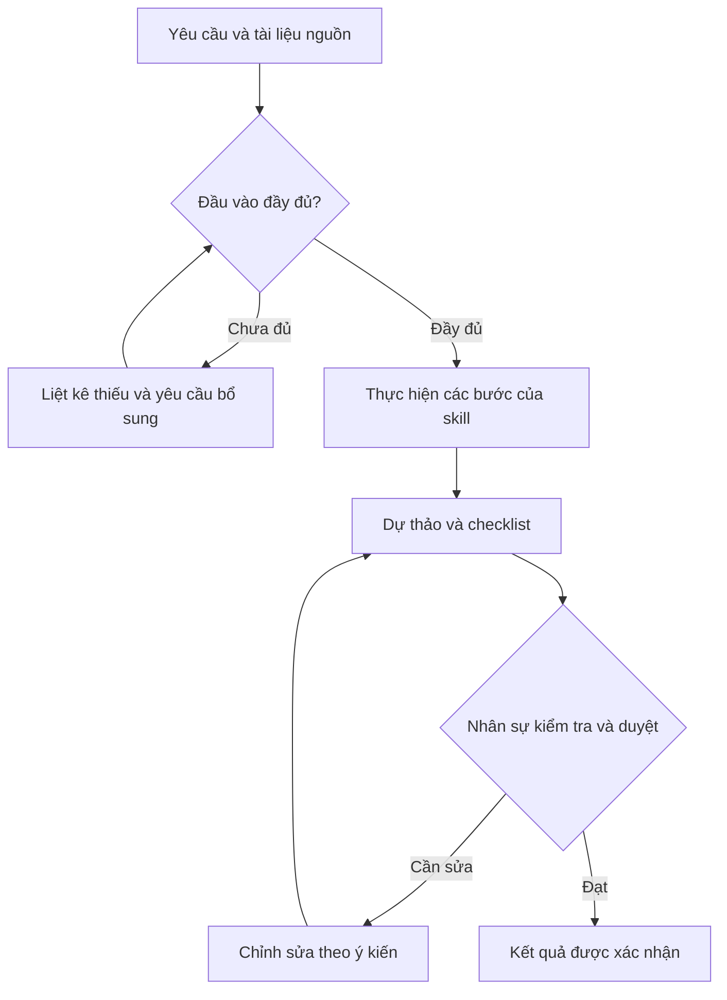
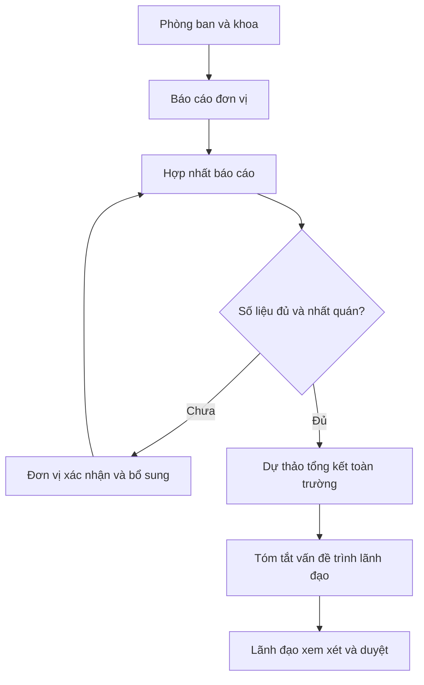

# 🎓 University AI Skills Framework

## Hệ thống Skill AI cho phòng ban trường đại học Việt Nam

**171 skill giúp chuẩn hóa cách chuẩn bị văn bản, xử lý hồ sơ, nghiên cứu và tổng hợp báo cáo — với nhân sự nghiệp vụ kiểm tra và phê duyệt kết quả.**

| Tổng số skill | Skill lõi dùng chung | Skill nghiệp vụ | Định dạng |
| :---: | :---: | :---: | :---: |
| **171** | **18** | **153** | **Markdown · SKILL.md** |

[📚 Danh mục 171 skill](skills/README.md) · [🧭 Khung phòng ban](khung-phong-ban-chuan.md) · [📐 Chuẩn đóng gói](khung-skill-tong-the.md) · [🗺️ Sơ đồ tương tác](so-do-case-phong-ban.html)

> **Skill là gì?** Một bộ hướng dẫn thực hiện công việc có thể tái sử dụng: nêu khi nào dùng, cần dữ liệu gì, thực hiện những bước nào, tạo sản phẩm gì và ai kiểm duyệt. Ví dụ: skill soạn công văn nhận yêu cầu và thông tin nơi nhận để tạo dự thảo kèm checklist kiểm tra.

## Mục lục

- [1. Hệ thống giải quyết công việc gì?](#1-hệ-thống-giải-quyết-công-việc-gì)
- [2. Kiến trúc hai tầng](#2-kiến-trúc-hai-tầng)
- [3. Bản đồ skill theo phòng ban](#3-bản-đồ-skill-theo-phòng-ban)
- [4. Một skill hoạt động như thế nào?](#4-một-skill-hoạt-động-như-thế-nào)
- [5. Ví dụ kết hợp skill liên phòng ban](#5-ví-dụ-kết-hợp-skill-liên-phòng-ban)
- [6. Bắt đầu sử dụng](#6-bắt-đầu-sử-dụng)
- [7. Cấu trúc tài liệu trong repository](#7-cấu-trúc-tài-liệu-trong-repository)
- [8. Gợi ý triển khai tại một trường](#8-gợi-ý-triển-khai-tại-một-trường)
- [9. Mở rộng và đóng góp](#9-mở-rộng-và-đóng-góp)
- [10. Giấy phép](#10-giấy-phép)

## 1. Hệ thống giải quyết công việc gì?

Bộ skill dành cho cán bộ phòng ban, giảng viên, lãnh đạo và nhóm triển khai AI trong trường đại học. Các trường có thể đối chiếu khung với cơ cấu tổ chức thực tế, rồi điều chỉnh biểu mẫu, thẩm quyền và quy trình nội bộ.

| Nhóm công việc | AI hỗ trợ | Sản phẩm điển hình |
| --- | --- | --- |
| Văn bản hành chính | Dự thảo, kiểm tra nội dung, chuẩn hóa cách trình bày | Công văn, tờ trình, thông báo, biên bản, phiếu trình ký |
| Hồ sơ nghiệp vụ | Đối chiếu thành phần, phát hiện thiếu, lập danh sách bổ sung | Checklist hồ sơ, bảng đủ/thiếu, dự thảo hướng dẫn |
| Kế hoạch và điều phối | Chia đầu việc, tổng hợp tiến độ, xác định người phụ trách | Kế hoạch, lịch công tác, bảng theo dõi công việc |
| Báo cáo và phân tích | Hợp nhất nguồn, đối chiếu số liệu, tóm tắt vấn đề | Báo cáo đơn vị, báo cáo toàn trường, bản tóm tắt trình lãnh đạo |
| Nghiên cứu và giảng dạy | Tổng quan tài liệu, so sánh nghiên cứu, chuẩn bị học liệu | Ma trận tài liệu, kế hoạch nghiên cứu, dự thảo bài giảng |
| Truyền thông và hỗ trợ | Chuẩn bị nội dung, hỏi đáp theo nguồn, phân loại yêu cầu | Lịch nội dung, FAQ, kịch bản tư vấn, dự thảo phản hồi |

**Nhân sự nghiệp vụ chịu trách nhiệm về dữ liệu và quyết định; AI hỗ trợ chuẩn bị sản phẩm.** Repository cung cấp nội dung hướng dẫn. Việc tự động lấy dữ liệu, xuất file, gửi thông báo hoặc cập nhật phần mềm cần được triển khai riêng trên nền tảng sử dụng.

## 2. Kiến trúc hai tầng

### Sơ đồ kiến trúc



| Tầng | Vai trò | Ví dụ |
| --- | --- | --- |
| **Tầng 1 — Lõi dùng chung** | Các năng lực có thể tái sử dụng ở nhiều đơn vị | Rà soát dự thảo, kiểm tra hồ sơ, hợp nhất báo cáo, dịch thuật, tổng quan tài liệu |
| **Tầng 2 — Nghiệp vụ** | Hướng dẫn công việc cụ thể gắn với chức năng đơn vị | Tuyển dụng, tuyển sinh, đào tạo, học bổng, tài chính, mua sắm, kiểm định |

Ví dụ: Phòng Hành chính dùng **soạn công văn** để tạo dự thảo, sau đó kết hợp **rà soát dự thảo văn bản** để kiểm tra trước khi trình ký. Sơ đồ mô tả cách kết hợp nghiệp vụ; việc lựa chọn và chuyển kết quả giữa các skill do người dùng hoặc nền tảng triển khai điều phối.

### Phân bố 153 skill nghiệp vụ



### 18 skill lõi theo mục đích sử dụng

| Mục đích | Skill |
| --- | --- |
| Chất lượng văn bản và hồ sơ | [Rà soát dự thảo](skills/ra-soat-du-thao-van-ban/SKILL.md) · [Kiểm tra hồ sơ](skills/kiem-tra-day-du-ho-so/SKILL.md) · [Dịch song ngữ](skills/dich-thuat-song-ngu-va-thuat-ngu/SKILL.md) · [Quản lý phiên bản](skills/quan-ly-phien-ban-tai-lieu/SKILL.md) |
| Tổng hợp và điều hành | [Hợp nhất báo cáo](skills/hop-nhat-bao-cao-don-vi/SKILL.md) · [Tóm tắt trình lãnh đạo](skills/executive-brief-trinh-lanh-dao/SKILL.md) · [Chuẩn bị họp và theo dõi công việc](skills/chuan-bi-hop-va-action-tracker/SKILL.md) · [Tổ chức sự kiện](skills/ke-hoach-to-chuc-su-kien/SKILL.md) |
| Chính sách và tuân thủ | [FAQ có trích nguồn](skills/faq-chinh-sach-co-trich-nguon/SKILL.md) · [Theo dõi thay đổi văn bản](skills/theo-doi-thay-doi-van-ban-phap-quy/SKILL.md) |
| Sinh viên và giảng dạy | [Phân loại yêu cầu sinh viên](skills/triage-case-sinh-vien/SKILL.md) · [Rà soát tiến độ tốt nghiệp](skills/audit-tien-do-tot-nghiep/SKILL.md) · [Trợ lý giảng dạy](skills/tro-ly-giang-day/SKILL.md) |
| Nghiên cứu | [Tổng quan tài liệu](skills/tong-quan-tai-lieu-khoa-hoc/SKILL.md) · [Theo dõi tài trợ nghiên cứu](skills/theo-doi-grant-nghien-cuu/SKILL.md) |
| Tài chính, CNTT và mở rộng | [Phân tích chênh lệch ngân sách](skills/phan-tich-chenh-lech-ngan-sach/SKILL.md) · [Phân loại yêu cầu hỗ trợ CNTT](skills/helpdesk-cntt-triage/SKILL.md) · [Đóng gói skill từ quy trình](skills/dong-goi-skill-tu-quy-trinh/SKILL.md) |

Các nhóm trên giúp tìm nhanh theo nhu cầu; vẫn thuộc cùng Tầng 1.

## 3. Bản đồ skill theo phòng ban

Số lượng dưới đây được đối chiếu với chỉ mục hiện có. Mỗi hàng có một skill đại diện để mở xem ngay; toàn bộ skill của từng nhóm nằm trong [chỉ mục chi tiết](skills/README.md).

| Đơn vị / nhóm nghiệp vụ | Số skill | Mở skill đại diện |
| --- | :---: | --- |
| A1. Văn phòng Hội đồng trường | 1 | [chuan-bi-hop-hoi-dong-truong](skills/chuan-bi-hop-hoi-dong-truong/SKILL.md) |
| A3. Hội đồng Khoa học và Đào tạo | 3 | [bien-ban-hop-hoi-dong-khdt](skills/bien-ban-hop-hoi-dong-khdt/SKILL.md) |
| B1. Phòng Hành chính – Tổng hợp | 12 | [soan-cong-van](skills/soan-cong-van/SKILL.md) |
| B2. Phòng Tổ chức – Cán bộ | 16 | [quy-trinh-tuyen-dung](skills/quy-trinh-tuyen-dung/SKILL.md) |
| B3. Phòng Đào tạo | 14 | [de-an-tuyen-sinh](skills/de-an-tuyen-sinh/SKILL.md) |
| B4. Phòng Đào tạo Sau đại học | 5 | [thong-bao-tuyen-sinh-sdh](skills/thong-bao-tuyen-sinh-sdh/SKILL.md) |
| B5. Phòng Khảo thí & Đảm bảo chất lượng | 12 | [quy-trinh-ngan-hang-de-thi](skills/quy-trinh-ngan-hang-de-thi/SKILL.md) |
| B6. Phòng KHCN và Hợp tác quốc tế | 16 | [thong-bao-dang-ky-de-tai](skills/thong-bao-dang-ky-de-tai/SKILL.md) |
| B7. Phòng Công tác sinh viên | 12 | [thong-bao-hoc-bong](skills/thong-bao-hoc-bong/SKILL.md) |
| B8. Phòng Tài chính – Kế toán | 6 | [thong-bao-muc-thu-hoc-phi](skills/thong-bao-muc-thu-hoc-phi/SKILL.md) |
| B9. Phòng Quản trị – Thiết bị | 6 | [ke-hoach-mua-sam](skills/ke-hoach-mua-sam/SKILL.md) |
| B10. Phòng Thanh tra và Pháp chế (+ kiểm toán nội bộ) | 6 | [ke-hoach-thanh-tra-nam](skills/ke-hoach-thanh-tra-nam/SKILL.md) |
| B11. Phòng Truyền thông và Tuyển sinh | 10 | [ke-hoach-truyen-thong-nam](skills/ke-hoach-truyen-thong-nam/SKILL.md) |
| B12. Trung tâm CNTT / Chuyển đổi số | 3 | [ke-hoach-phat-trien-cntt](skills/ke-hoach-phat-trien-cntt/SKILL.md) |
| B13. Ban Xúc tiến đầu tư và Phát triển hạ tầng | 3 | [ke-hoach-xuc-tien-dau-tu](skills/ke-hoach-xuc-tien-dau-tu/SKILL.md) |
| C1. Viện ĐMST & Chuyển giao công nghệ | 6 | [pmo-quan-tri-du-an](skills/pmo-quan-tri-du-an/SKILL.md) |
| C2. Thư viện – Trung tâm học liệu | 2 | [ke-hoach-bo-sung-hoc-lieu](skills/ke-hoach-bo-sung-hoc-lieu/SKILL.md) |
| C3. Trung tâm thực hành nghề nghiệp | 1 | [ke-hoach-hoat-dong-trung-tam-thuc-hanh](skills/ke-hoach-hoat-dong-trung-tam-thuc-hanh/SKILL.md) |
| C4. Trạm Y tế | 3 | [ke-hoach-y-te-hoc-duong](skills/ke-hoach-y-te-hoc-duong/SKILL.md) |
| C5. Trung tâm Nội trú | 1 | [ke-hoach-tiep-nhan-quan-ly-noi-tru](skills/ke-hoach-tiep-nhan-quan-ly-noi-tru/SKILL.md) |
| C6. Cơ quan báo chí – Xuất bản | 2 | [ke-hoach-hoat-dong-bao-chi](skills/ke-hoach-hoat-dong-bao-chi/SKILL.md) |
| C7. Phân hiệu / Cơ sở đào tạo | 2 | [ke-hoach-hoat-dong-phan-hieu](skills/ke-hoach-hoat-dong-phan-hieu/SKILL.md) |
| C9. Trung tâm Đào tạo liên tục / Trường bồi dưỡng | 3 | [ke-hoach-dao-tao-lien-tuc](skills/ke-hoach-dao-tao-lien-tuc/SKILL.md) |
| D1. Khoa / Bộ môn | 4 | [phan-cong-giang-day](skills/phan-cong-giang-day/SKILL.md) |
| Dùng chung liên phòng ban | 4 | [bao-cao-3-cong-khai](skills/bao-cao-3-cong-khai/SKILL.md) |
| **Tổng Tầng 2** | **153** | |

**Tên phòng ban có thể khác nhau giữa các trường.** Nếu trường gộp Đào tạo và Công tác sinh viên, một đầu mối có thể sử dụng skill của cả B3 và B7. Các mã A/B/C/D phục vụ đối chiếu chức năng. Khung tổ chức còn có những mã chưa có nhóm skill riêng trong chỉ mục này; xem [khung phòng ban chuẩn](khung-phong-ban-chuan.md) để xác định đơn vị phù hợp.

## 4. Một skill hoạt động như thế nào?

### Luồng thực hiện và kiểm duyệt



**Human gate** là điểm bắt buộc người có trách nhiệm kiểm tra hoặc phê duyệt. Ví dụ: AI chuẩn bị dự thảo công văn; chuyên viên kiểm tra, người có thẩm quyền duyệt trước khi phát hành.

### Thành phần của một skill

| Thành phần | Câu hỏi cần trả lời |
| --- | --- |
| Định danh: `name`, `description` | Skill tên gì và xử lý việc gì? |
| Khi nào dùng | Tình huống nào phù hợp? |
| Đầu vào — Input | Cần tài liệu và dữ liệu nào? Trường nào bắt buộc? |
| Quy trình | Mỗi bước làm gì, dùng dữ liệu nào, ai phụ trách và AI hỗ trợ ra sao? |
| Sơ đồ quy trình — Workflow | Các bước nối với nhau thế nào? Điểm kiểm tra ở đâu? |
| Đầu ra — Output | Cần giao sản phẩm gì và theo bố cục nào? |
| Checklist nghiệm thu | Tiêu chí nào xác định kết quả đạt yêu cầu? |
| Ví dụ mô phỏng | Đầu vào và đầu ra mẫu trông như thế nào? |
| Kiểm duyệt và giới hạn | Ai duyệt? AI được thực hiện đến đâu? |
| Căn cứ và lưu ý | Cần đối chiếu văn bản, quy chế hoặc nguồn nào? |

Cách đặt tiêu đề và vị trí phần kiểm duyệt có thể khác nhau giữa các file. Khi thực hiện, đọc đầy đủ file `SKILL.md` và kiểm tra yêu cầu của chính skill được chọn.

### Nguyên tắc chất lượng

- Dữ liệu, số liệu và trích dẫn phải truy được về tài liệu nguồn.
- Thiếu thông tin thì ghi rõ phần thiếu và hỏi bổ sung.
- Dự thảo và kết quả được duyệt phải được phân biệt rõ.
- Nhân sự xác nhận thẩm quyền, căn cứ và quy chế áp dụng tại trường trước khi dùng chính thức.
- Ví dụ trong bộ skill sử dụng dữ liệu giả lập như **Trường Đại học A**, **Nguyễn Văn A**; thay bằng dữ liệu đã được phép sử dụng khi triển khai.

## 5. Ví dụ kết hợp skill liên phòng ban

### Báo cáo tổng kết năm học toàn trường



| Công đoạn | Skill có thể sử dụng | Kết quả |
| --- | --- | --- |
| Chuẩn bị báo cáo đơn vị | [Tổng kết khoa](skills/bao-cao-tong-ket-khoa/SKILL.md), [Tổng kết văn phòng](skills/bao-cao-tong-ket-vp/SKILL.md) và skill báo cáo tương ứng | Báo cáo từng đơn vị |
| Gộp và kiểm tra nguồn | [Hợp nhất báo cáo đơn vị](skills/hop-nhat-bao-cao-don-vi/SKILL.md) | Bảng tổng hợp, danh sách dữ liệu cần xác nhận |
| Soạn báo cáo toàn trường | [Tổng kết năm học toàn trường](skills/bao-cao-tong-ket-nam-truong/SKILL.md) | Dự thảo báo cáo theo các mảng công tác |
| Chuẩn bị nội dung điều hành | [Tóm tắt trình lãnh đạo](skills/executive-brief-trinh-lanh-dao/SKILL.md) | Bản tóm tắt và vấn đề cần quyết định |

### Một số chuỗi công việc khác

| Tình huống | Cách kết hợp skill | Người xác nhận kết quả |
| --- | --- | --- |
| Chuẩn bị công văn trình ký | Soạn công văn → rà soát dự thảo → phiếu trình ký | Chuyên viên, đầu mối kiểm tra và người ký |
| Tổ chức tuyển dụng | Quy trình tuyển dụng + thông báo tuyển dụng + kiểm tra hồ sơ | Phòng Tổ chức – Cán bộ và cấp có thẩm quyền |
| Triển khai truyền thông tuyển sinh | Brief chiến dịch + lịch nội dung + bài viết + FAQ tuyển sinh | Đơn vị tuyển sinh và truyền thông |
| Quản trị dự án chuyển giao | Quản trị dự án + báo cáo định kỳ + hồ sơ chuyển giao | Đầu mối dự án và cấp phê duyệt |

Đây là **gợi ý phối hợp các skill hiện có**. Trình tự thực tế cần bám quy trình và phân công của từng trường.

## 6. Bắt đầu sử dụng

### Bước 1 — Chọn đúng skill

Mở [danh mục skill](skills/README.md), chọn nhóm phòng ban hoặc công việc. Đọc phần **Khi nào dùng** và **Đầu vào** của skill trước khi bắt đầu.

### Bước 2 — Chuẩn bị dữ liệu và biểu mẫu

Cung cấp yêu cầu, tài liệu nguồn, mẫu của trường và quy định nội bộ liên quan. Xác định người thực hiện và người kiểm duyệt.

### Bước 3 — Cung cấp hướng dẫn skill cho công cụ AI

Đưa nội dung `SKILL.md` cùng dữ liệu vào công cụ AI đang sử dụng. Có thể dùng như hướng dẫn cho một tác vụ hoặc đóng gói vào nền tảng có hỗ trợ skill; cách nạp và cấu hình phụ thuộc nền tảng.

**Mẫu yêu cầu chung:**

```text
Thực hiện công việc theo nội dung SKILL.md tôi cung cấp.

Mục tiêu: [kết quả cần đạt]
Đơn vị thực hiện: [tên đơn vị]
Đầu vào: [dữ liệu và tài liệu đính kèm]
Biểu mẫu/quy chế của trường: [nguồn áp dụng]
Người kiểm duyệt: [vai trò hoặc chức danh]

Trước khi soạn, kiểm tra các trường bắt buộc.
Nếu thiếu, liệt kê và hỏi bổ sung.
Thực hiện theo từng bước của skill.
Trả kết quả theo cấu trúc đầu ra, kèm checklist và vấn đề cần xác nhận.
```

**Ví dụ với skill [soạn công văn](skills/soan-cong-van/SKILL.md):**

```text
Dữ liệu giả lập để thử nghiệm:

loai_cong_van: Đề nghị
trich_yeu: phối hợp tổ chức hội thảo khoa học sinh viên
noi_dung:
- Đề nghị Học viện B phối hợp tổ chức hội thảo.
- Đề nghị phản hồi trước 20/11/2026.
noi_nhan: Học viện B; Lưu: VT, HCTH
nguoi_ky: Hiệu trưởng, theo thẩm quyền được xác nhận trong tài liệu đính kèm
do_khan: Thường

Tài liệu kèm theo: mẫu công văn, thông tin cơ quan ban hành,
địa danh, ngày dự kiến ban hành và quy chế phân cấp ký.

Tạo dự thảo cùng checklist. Số văn bản chưa được cấp thì để
[CHỜ VĂN THƯ CẤP SỐ]; không tự điền số hoặc ghi “đã ký”.
```

### Bước 4 — Kiểm tra và hoàn thiện

Nhân sự đối chiếu kết quả với tài liệu nguồn, kiểm tra checklist, sửa các điểm chưa đạt và thực hiện bước phê duyệt theo quy trình.

### Tải repository về máy

```bash
git clone https://github.com/phamtruong91/dh-skills.git
cd dh-skills
```

Hoặc chọn **Code → Download ZIP** trên GitHub. Đây là bộ tài liệu Markdown; người đọc có thể mở trực tiếp từng file.

## 7. Cấu trúc tài liệu trong repository

| Đường dẫn | Nội dung | Khi nên đọc |
| --- | --- | --- |
| [README.md](README.md) | Tổng quan, kiến trúc, cách sử dụng | Lần đầu tiếp cận |
| [skills/README.md](skills/README.md) | Chỉ mục và mô tả 171 skill | Tìm skill theo phòng ban |
| `skills/<ma-skill>/SKILL.md` | Hướng dẫn một công việc cụ thể | Khi thực hiện tác vụ |
| [khung-skill-tong-the.md](khung-skill-tong-the.md) | Chuẩn đóng gói và khung thiết kế | Khi tùy chỉnh, xây thêm skill |
| [khung-phong-ban-chuan.md](khung-phong-ban-chuan.md) | Mã đơn vị và đối chiếu mô hình tổ chức | Khi phân công đầu mối tại trường |
| [danh-muc-skill-phong-ban-dh.md](danh-muc-skill-phong-ban-dh.md) | Danh mục tổng hợp nghiệp vụ ban đầu | Khi tham khảo quá trình xây dựng khung |
| [so-do-case-phong-ban.html](so-do-case-phong-ban.html) | Sơ đồ tương tác các phòng ban | Khi xem quan hệ nghiệp vụ |
| [Tài liệu Word](docs/Khung_Skill_AI_phong_ban_truong_dai_hoc.docx) | Tài liệu giới thiệu chi tiết | Khi trao đổi, trình bày nội bộ |
| [LICENSE](LICENSE) | Điều khoản giấy phép | Khi sử dụng và phân phối lại |

**Xem sơ đồ HTML:** tải file về rồi mở bằng trình duyệt. Liên kết trên GitHub mở mã nguồn của file. Các sơ đồ Mermaid trong README có thể xem ngay trên GitHub.

**Nguồn đối chiếu:** số lượng trong README này phản ánh 171 file skill hiện có và chỉ mục tương ứng. Một số tài liệu khung còn chứa số lượng hoặc trạng thái từ giai đoạn xây dựng trước; dùng chỉ mục và từng file skill để xác định nội dung hiện có.

## 8. Gợi ý triển khai tại một trường

Các bước sau là lộ trình đề xuất, có thể điều chỉnh theo nguồn lực của trường.

| Giai đoạn | Việc cần làm | Kết quả cần có |
| --- | --- | --- |
| 1. Khảo sát | Đối chiếu phòng ban, liệt kê công việc lặp lại, thu thập mẫu | Danh sách nghiệp vụ ưu tiên và đầu mối |
| 2. Tùy chỉnh | Chọn skill, bổ sung mẫu, quy chế, nguồn dữ liệu và người duyệt | Bộ skill phù hợp với trường |
| 3. Thử nghiệm | Dùng dữ liệu giả lập rồi thử trên hồ sơ được phép sử dụng | Kết quả được đánh giá theo checklist |
| 4. Vận hành | Hướng dẫn cán bộ, phân công hỗ trợ, quản lý phiên bản | Quy trình sử dụng có người chịu trách nhiệm |
| 5. Mở rộng | Đo kết quả, điều chỉnh, bổ sung nghiệp vụ | Bộ skill cải tiến theo phản hồi |

Có thể khởi đầu bằng công văn, biên bản họp, kiểm tra hồ sơ và báo cáo đơn vị. Đánh giá bằng **thời gian hoàn thành**, **mức độ phải chỉnh sửa**, **tỷ lệ đạt checklist** và **khả năng đối chiếu nguồn**, rồi lựa chọn các skill tiếp theo dựa trên kết quả thực tế.

## 9. Mở rộng và đóng góp

1. Tìm trong [chỉ mục](skills/README.md) để tránh tạo skill trùng.
2. Xác định Tầng 1 hoặc Tầng 2 và đơn vị chịu trách nhiệm.
3. Tạo thư mục `skills/<ma-skill>/` với file `SKILL.md`.
4. Bổ sung đầu vào, quy trình, đầu ra, ví dụ, checklist và điểm kiểm duyệt.
5. Thử với dữ liệu đầy đủ, dữ liệu thiếu và dữ liệu mâu thuẫn.
6. Cập nhật chỉ mục, số lượng và tài liệu khung liên quan.
7. Gửi pull request mô tả công việc được hỗ trợ, thay đổi và kết quả kiểm tra.

Có thể tham khảo [skill đóng gói từ quy trình](skills/dong-goi-skill-tu-quy-trinh/SKILL.md) để chuyển một quy trình thực tế thành hướng dẫn có thể tái sử dụng.

## 10. Giấy phép

Theo [LICENSE](LICENSE), bộ tài liệu thuộc bản quyền **CES Global, 2026** và được phân phối theo giấy phép kép:

| Hình thức | Nội dung |
| --- | --- |
| **Cộng đồng — CC BY-SA 4.0** | Cho phép chia sẻ và chuyển thể, kể cả thương mại, với yêu cầu ghi công và chia sẻ bản chuyển thể theo cùng giấy phép |
| **Thương mại** | CES Global có thể phân phối cùng nội dung theo điều khoản thương mại riêng, bao gồm đóng gói vào CES Agent Workspace |

Xem [toàn văn giấy phép CC BY-SA 4.0](https://creativecommons.org/licenses/by-sa/4.0/legalcode) và file LICENSE để biết điều khoản đầy đủ.
