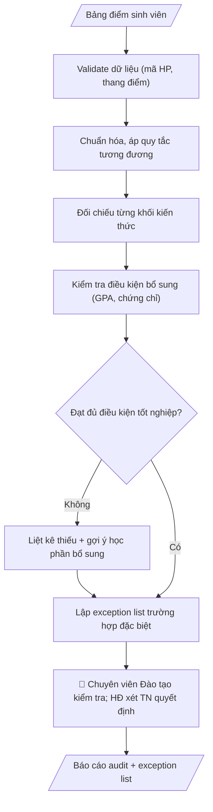

# Audit tiến độ tốt nghiệp

## Kiểm soát áp dụng và phê duyệt

Trước khi chạy quy trình, xác định `ngay_ap_dung`, `loai_hinh_truong`, `quy_che_noi_bo`, `nguon_du_lieu` và `nguoi_kiem_duyet`. Chỉ yêu cầu thông tin có liên quan đến nghiệp vụ; không dùng giá trị giả định thay dữ liệu bắt buộc. Hồ sơ có yếu tố pháp lý phải kèm văn bản gốc, tình trạng hiệu lực, điều khoản áp dụng và chuyển tiếp.

## Giới hạn và human gate

AI hỗ trợ chuẩn bị và đối chiếu. Cán bộ phụ trách kiểm tra dữ liệu/căn cứ, người có thẩm quyền duyệt và ký. Mọi đầu ra mặc định là **DỰ THẢO – CHỜ KIỂM DUYỆT**; không đánh dấu đã ký, đã duyệt hoặc đã công bố nếu chưa có chứng cứ. Dữ liệu sinh viên, sức khỏe, nhân sự và tài chính phải hạn chế theo mục đích, phân quyền và che thông tin định danh khi dùng ví dụ. Không tải dữ liệu lên dịch vụ ngoài khi chưa có quyền. Kiểm tra Luật 91/2025/QH15 về bảo vệ dữ liệu cá nhân (hiệu lực 01/01/2026) và quy định áp dụng trước xử lý/chia sẻ dữ liệu cá nhân.


## Khi nào dùng
Cuối mỗi học kỳ hoặc trước đợt xét tốt nghiệp, khi cần rà soát nhanh sinh viên đã đủ điều kiện
tốt nghiệp chưa, còn thiếu học phần/điều kiện gì. Dùng chung cho Phòng Đào tạo, các khoa,
cố vấn học tập — không phụ thuộc tên đơn vị.

## Đầu vào (Input)

| Trường | Mô tả | Bắt buộc |
|---|---|---|
| `bang_diem` | Danh sách học phần đã học: mã HP, tên HP, số tín chỉ, điểm, học kỳ (mã SV ẩn danh, VD: SV-0847) | Có |
| `khung_ctdt` | Khung chương trình đào tạo: các khối kiến thức, số tín chỉ yêu cầu mỗi khối, danh mục HP bắt buộc/tự chọn | Có |
| `dieu_kien_bo_sung` | Điều kiện tốt nghiệp ngoài tín chỉ: GPA tối thiểu, chứng chỉ ngoại ngữ/tin học, không nợ học phí... | Không |
| `quy_tac_tuong_duong` | Bảng quy đổi học phần tương đương / học phần thay thế | Không |
| `phien_ban_quy_tac` | Phiên bản quy tắc áp dụng (ghi rõ để truy vết) | Có |

## Quy trình

**Bước 1. Validate dữ liệu đầu vào**
- Làm gì: Kiểm tra `bang_diem`: đủ các trường (mã HP, tên HP, số tín chỉ, điểm, học kỳ); mã HP đúng định dạng; điểm nằm trong thang cho phép; phát hiện dòng trùng lặp, dòng thiếu trường; kiểm tra `khung_ctdt` có đầy đủ các khối kiến thức và chỉ tiêu; nếu phát hiện lỗi → dừng và báo danh sách lỗi, không audit tiếp.
- Dùng input: `bang_diem`, `khung_ctdt`, `phien_ban_quy_tac`.
- Vai trò: Chuyên viên Phòng Đào tạo · AI hỗ trợ: kiểm tra định dạng, thang điểm, dòng trùng/thiếu; dừng khi có lỗi · ⏱ ~10–20 phút (ước tính)
- Lưu ý nghiệp vụ: dữ liệu rác cho ra kết luận rác — validate là bắt buộc; điểm nằm ngoài thang (VD: 11/10) phải báo lỗi, không tự sửa.
- → Kết quả bước: Báo cáo validate (đạt/không đạt + danh sách lỗi nếu có).

**Bước 2. Chuẩn hóa và áp quy tắc tương đương**
- Làm gì: Gộp các lần học lại cùng mã HP, giữ điểm cao nhất theo quy định; quy đổi HP cũ sang HP tương đương theo `quy_tac_tuong_duong`; loại các HP không thuộc chương trình ra khỏi phép tính; ghi lại mọi lần quy đổi vào nhật ký để truy vết.
- Dùng input: `bang_diem`, `quy_tac_tuong_duong`.
- Vai trò: Chuyên viên Phòng Đào tạo · AI hỗ trợ: gộp lần học lại, áp quy tắc tương đương chính thức, ghi nhật ký quy đổi · ⏱ ~15–30 phút (ước tính)
- Lưu ý nghiệp vụ: chỉ áp quy tắc tương đương có trong bảng chính thức — không tự suy "môn này giống môn kia"; học lại lấy điểm cao nhất theo đúng quy định của trường.
- → Kết quả bước: Bảng điểm đã chuẩn hóa + nhật ký quy đổi.

**Bước 3. Đối chiếu từng khối kiến thức**
- Làm gì: Tính tín chỉ tích lũy (chỉ tính HP đạt) cho từng khối trong `khung_ctdt` (đại cương, cơ sở ngành, chuyên ngành, tự chọn); so sánh với chỉ tiêu từng khối; đánh dấu ĐẠT/CHƯA ĐẠT cho từng khối kèm số tín chỉ còn thiếu.
- Dùng input: `khung_ctdt` (bảng điểm chuẩn hóa từ bước 2).
- Vai trò: Chuyên viên Phòng Đào tạo · AI hỗ trợ: tính tín chỉ tích lũy từng khối, so chỉ tiêu, đánh dấu ĐẠT/CHƯA ĐẠT · ⏱ ~10–20 phút (ước tính)
- Lưu ý nghiệp vụ: HP đạt nhưng thuộc sai khối không được tính sang khối khác; khối tự chọn chỉ tính trong hạn mức quy định.
- → Kết quả bước: Bảng đối chiếu từng khối (tích lũy/yêu cầu/trạng thái).

**Bước 4. Kiểm tra điều kiện bổ sung**
- Làm gì: Tính GPA tích lũy so với mức tối thiểu; kiểm tra chứng chỉ ngoại ngữ/tin học; kiểm tra tình trạng nợ học phí/kỷ luật nếu có dữ liệu; mỗi điều kiện trong `dieu_kien_bo_sung` đánh dấu ĐẠT / CHƯA ĐẠT / KHÔNG CÓ DỮ LIỆU.
- Dùng input: `bang_diem`, `dieu_kien_bo_sung`.
- Vai trò: Chuyên viên Phòng Đào tạo · AI hỗ trợ: kiểm tra GPA, chứng chỉ, học phí; thiếu dữ liệu ghi "không có dữ liệu" · ⏱ ~10–15 phút (ước tính)
- Lưu ý nghiệp vụ: thiếu dữ liệu thì ghi "không có dữ liệu", không suy đoán là đạt; GPA tính theo đúng thang quy chế (thang 4 hay thang 10).
- → Kết quả bước: Bảng điều kiện bổ sung (từng điều kiện + trạng thái).

**Bước 5. Liệt kê thiếu và gợi ý bổ sung**
- Làm gì: Với mỗi khối/điều kiện CHƯA ĐẠT: nêu rõ thiếu bao nhiêu tín chỉ hoặc còn thiếu điều kiện gì; gợi ý học phần cụ thể có thể đăng ký bổ sung dựa trên danh mục HP trong `khung_ctdt`; sắp xếp gợi ý theo thứ tự ưu tiên.
- Dùng input: `khung_ctdt` (kết quả đối chiếu từ bước 3–4).
- Vai trò: Chuyên viên Phòng Đào tạo · AI hỗ trợ: liệt kê thiếu và gợi ý học phần bổ sung khả thi, sắp xếp ưu tiên · ⏱ ~10–20 phút (ước tính)
- Lưu ý nghiệp vụ: gợi ý phải khả thi (HP còn mở trong học kỳ tới, không trùng lịch) — nếu không chắc thì ghi "cần cố vấn học tập xác nhận"; không hứa "đăng ký là đủ điều kiện".
- → Kết quả bước: Danh sách thiếu + gợi ý học phần bổ sung.

**Bước 6. Xuất báo cáo audit và lập exception list**
- Làm gì: Gộp kết quả các bước thành báo cáo audit từng sinh viên theo Cấu trúc output chuẩn, ghi rõ `phien_ban_quy_tac` áp dụng và kết luận "đạt/chưa đạt THEO QUY TẮC"; tách các trường hợp đặc biệt (bảo lưu, chuyển ngành, miễn trừ) vào exception list để hội đồng xem xét thủ công.
- Dùng input: `phien_ban_quy_tac` (kết quả các bước 1–5).
- Vai trò: Chuyên viên Phòng Đào tạo · AI hỗ trợ: xuất báo cáo audit + exception list theo cấu trúc chuẩn để trình hội đồng xét tốt nghiệp · ⏱ ~15–25 phút + ~1–2 giờ duyệt (ước tính)
- Lưu ý nghiệp vụ: không bao giờ kết luận "đủ điều kiện tốt nghiệp" thay hội đồng — chỉ nêu trạng thái theo quy tắc; exception list ghi rõ lý do cần xem xét thủ công.
- → Kết quả bước: Báo cáo audit từng sinh viên + exception list — sản phẩm cuối.
## Luồng quy trình (Workflow)


## Đầu ra (Output)
- Báo cáo audit từng sinh viên: trạng thái (đạt/chưa đạt theo quy tắc), chi tiết thiếu, gợi ý bổ sung.
- Bảng tổng hợp theo khóa/ngành: tỷ lệ đạt, các khối kiến thức thường thiếu.
- Exception list: trường hợp cần hội đồng xem xét thủ công.

**Cấu trúc output chuẩn:** khung mẫu CỐ ĐỊNH của sản phẩm chính (Báo cáo audit từng sinh viên):
1. Thông tin sinh viên + ngành + phiên bản quy tắc áp dụng.
2. Đối chiếu từng khối kiến thức: tín chỉ tích lũy/yêu cầu — trạng thái ĐẠT/CHƯA ĐẠT.
3. Điều kiện bổ sung: GPA, chứng chỉ, học phí — trạng thái từng điều kiện.
4. Kết luận theo quy tắc: đạt/chưa đạt THEO QUY TẮC phiên bản X (không thay hội đồng kết luận).
5. Học phần còn thiếu + gợi ý học phần bổ sung.
6. Chuyển hội đồng xem xét: có/không + lý do.

## Checklist nghiệm thu

- [ ] Báo cáo audit đầy đủ 6 phần theo Cấu trúc output chuẩn: thông tin SV + ngành + phiên bản quy tắc áp dụng; đối chiếu từng khối; điều kiện bổ sung; kết luận theo quy tắc; học phần thiếu + gợi ý; chuyển hội đồng (có/không + lý do).
- [ ] Phiên bản quy tắc áp dụng được ghi rõ trong báo cáo để truy vết.
- [ ] Số liệu trong output khớp với bảng điểm Input; tính toán đúng thang quy chế (thang 4 hay thang 10).
- [ ] Chỉ áp quy tắc tương đương có trong bảng chính thức — không tự suy "môn này giống môn kia"; mọi lần quy đổi có nhật ký truy vết.
- [ ] Điều kiện thiếu dữ liệu ghi "không có dữ liệu", không suy đoán là đạt.
- [ ] Kết luận là "đạt/chưa đạt THEO QUY TẮC phiên bản X" — không thay hội đồng kết luận tốt nghiệp; exception list ghi rõ lý do cần xem xét thủ công.
- [ ] Dữ liệu sinh viên được ẩn danh (mã hóa) khi xử lý; không cập nhật/sửa đổi dữ liệu trên hệ thống quản lý đào tạo.
- [ ] Đã qua Human gate: chuyên viên Phòng Đào tạo đã kiểm tra báo cáo audit và danh sách ngoại lệ trước khi trình.

> Tiêu chí đạt: tất cả các ô được đánh dấu.

## Ví dụ mô phỏng (dữ liệu giả lập)

> Tất cả tên trường, cá nhân, số liệu dưới đây đều là **giả lập**.

### Input mẫu

| Trường | Giá trị |
|---|---|
| `bang_diem` | SV-0847: 38 học phần, 118/130 tín chỉ; GPA 2.87; thiếu chứng chỉ ngoại ngữ |
| `khung_ctdt` | Ngành Công nghệ thông tin: 130 tín chỉ (Đại cương 32, Cơ sở ngành 40, Chuyên ngành 46, Tự chọn 12); GPA ≥ 2.0; chứng chỉ ngoại ngữ B1 |
| `dieu_kien_bo_sung` | Chứng chỉ ngoại ngữ B1; không nợ học phí |
| `quy_tac_tuong_duong` | HP "Lập trình Python" tương đương "Nhập môn lập trình" (cũ) |
| `phien_ban_quy_tac` | Quy tắc audit v2026.1 |

### Output mẫu

```
BÁO CÁO AUDIT TIẾN ĐỘ TỐT NGHIỆP (giả lập)
1. Thông tin: Sinh viên SV-0847 | Ngành: Công nghệ thông tin | Quy tắc áp dụng: v2026.1

2. Đối chiếu từng khối kiến thức:
   - Khối Đại cương: 32/32 tín chỉ — ĐẠT
   - Khối Cơ sở ngành: 40/40 tín chỉ — ĐẠT
   - Khối Chuyên ngành: 46/46 tín chỉ — ĐẠT
   - Khối Tự chọn: 0/12 tín chỉ — CHƯA ĐẠT (thiếu 12 tín chỉ)

3. Điều kiện bổ sung:
   - GPA tích lũy: 2.87 (yêu cầu ≥ 2.0) — ĐẠT
   - Chứng chỉ ngoại ngữ B1: CHƯA CÓ — CHƯA ĐẠT
   - Học phí: không nợ — ĐẠT

4. KẾT LUẬN THEO QUY TẮC v2026.1: CHƯA ĐẠT (chưa đủ điều kiện tốt nghiệp theo quy tắc).

5. Học phần còn thiếu + gợi ý: thiếu 12 tín chỉ tự chọn — đăng ký 4 học phần tự chọn
   trong học kỳ tới; hoàn thành chứng chỉ ngoại ngữ B1.

6. Chuyển hội đồng xem xét: KHÔNG (không thuộc trường hợp ngoại lệ).
```

## Human gate (người kiểm duyệt)
- **Chuyên viên Phòng Đào tạo** kiểm tra báo cáo audit và danh sách ngoại lệ trước khi trình.
- **Hội đồng xét tốt nghiệp** là đơn vị duy nhất ra quyết định công nhận tốt nghiệp; kết quả audit chỉ là tài liệu tham khảo.
- Không công bố danh sách audit rộng rãi khi chưa được duyệt.

## Giới hạn (guardrails)
- Không cập nhật, sửa đổi hay ghi đè dữ liệu trên hệ thống quản lý đào tạo.
- Dữ liệu sinh viên phải được ẩn danh (mã hóa) khi đưa vào xử lý.
- Không tự kết luận "đủ điều kiện tốt nghiệp" thay hội đồng — chỉ nêu "đạt/chưa đạt THEO QUY TẮC phiên bản X".
- Không suy đoán lý do thiếu (bỏ học, hoàn cảnh...) ngoài dữ liệu.

## Căn cứ & lưu ý
- Áp dụng theo quy chế đào tạo của từng trường (phiên bản quy tắc phải được ghi rõ trong báo cáo).
- Không dùng tên thật của trường/cá nhân khi mô phỏng.

## Quản trị phiên bản

- Phiên bản gói: `1.1.0`; ngày cập nhật: `2026-10-09`.
- Kho nguồn: https://github.com/phamtruong91/dh-skills
- Người duy trì trên GitHub: `phamtruong91` (Phạm Văn Trường). Người phê duyệt nghiệp vụ: **chưa chỉ định**.
- Commit nguồn trước cập nhật: `78fd1d51b8acd1a724d9b9af6c488460bc7551ad`. Commit chứa phiên bản này xem bằng `git log -1 -- skills/audit-tien-do-tot-nghiep`; không tự gán SHA chưa tạo.
- Giấy phép: theo LICENSE của kho; bản quyền CES Global.
- Lịch sử 1.1.0: bổ sung metadata giao diện, kiểm soát áp dụng, quản trị phiên bản.
- Trạng thái: dự thảo nghiệp vụ; kiểm tra pháp lý trước thực thi. Ngày cập nhật không đồng nghĩa mọi văn bản đã được rà soát toàn văn.
