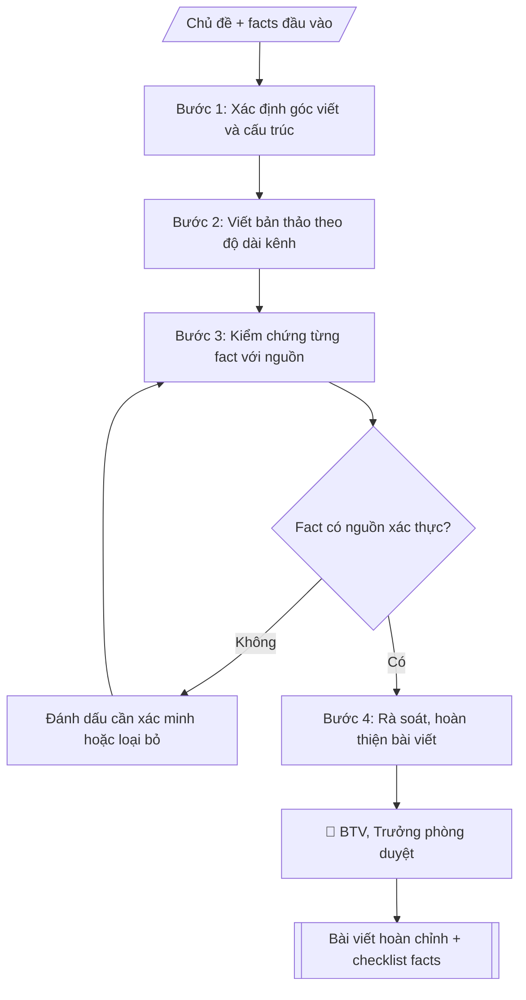

# Skill: Bài viết truyền thông

## Khi nào dùng
Khi cần bài viết cho website, fanpage, bản tin: tin sự kiện, gương sinh viên/giảng viên tiêu biểu,
giới thiệu ngành học, thông tin tuyển sinh, thành tựu nghiên cứu.

## Đầu vào (Input)

| Trường | Mô tả | Bắt buộc |
|---|---|---|
| `chu_de` | Chủ đề bài viết | Có |
| `dinh_dang` | Tin ngắn / bài phỏng vấn / bài giới thiệu / bài PR | Có |
| `kenh` | Website / fanpage (quyết định độ dài, giọng văn) | Có |
| `thong_tin` | Facts đầu vào: sự kiện, nhân vật, số liệu, trích dẫn (dạng gạch đầu dòng) | Có |
| `muc_dich` | Thông tin / tuyển sinh / xây dựng thương hiệu | Có |
| `do_dai` | Số từ mong muốn (website 600–900, fanpage 150–300) | Không |
| `cta` | Lời kêu gọi hành động cuối bài (đăng ký tư vấn, xem thêm...) | Không |

## Quy trình

**Bước 1. Xác định góc viết và cấu trúc**
- Làm gì: chọn góc viết phù hợp brand voice (trẻ trung + học thuật) và mục đích bài (thông tin / tuyển sinh / xây dựng thương hiệu); dựng cấu trúc: tiêu đề thu hút → mở bài (hook) → thân bài (facts sắp xếp theo logic) → kết + CTA.
- Dùng input: `chu_de`, `dinh_dang`, `muc_dich`, `kenh` (quyết định độ dài, giọng văn).
- Vai trò: Chuyên viên Phòng Truyền thông – Tuyển sinh · AI hỗ trợ: soạn dự thảo, lập bảng biểu, định dạng · ⏱ ~30–60 phút (ước tính)
- Lưu ý nghiệp vụ: góc viết phải phục vụ đúng mục đích; fanpage ưu tiên cảm xúc và hook nhanh, website ưu tiên đầy đủ 5W1H.
- → Kết quả bước: Dàn ý bài viết (góc viết + cấu trúc các phần).

**Bước 2. Viết bản thảo**
- Làm gì: viết bài theo dàn ý: câu ngắn, đoạn ngắn cho fanpage (150–300 từ); đầy đủ 5W1H cho website (600–900 từ); trích dẫn giữ nguyên văn lời nhân vật; chèn CTA cuối bài.
- Dùng input: `thong_tin`, `do_dai`, `cta`, `kenh`.
- Vai trò: Chuyên viên Phòng Truyền thông – Tuyển sinh · AI hỗ trợ: soạn dự thảo · ⏱ ~30–60 phút (ước tính)
- Lưu ý nghiệp vụ: không thêm số liệu, thành tích, trích dẫn ngoài input; không dùng từ ngữ tuyệt đối hóa ("nhất", "duy nhất") khi chưa có căn cứ; không so sánh với trường khác.
- → Kết quả bước: Bản thảo bài viết.

**Bước 3. Kiểm chứng facts**
- Làm gì: đối chiếu từng tên người/chức danh/số liệu/ngày tháng/trích dẫn trong bản thảo với nguồn đầu vào; fact nào thiếu nguồn thì đánh dấu [cần xác minh] hoặc loại bỏ; lập checklist kiểm chứng.
- Dùng input: `thong_tin`.
- Vai trò: Chuyên viên Phòng Truyền thông – Tuyển sinh · AI hỗ trợ: đối chiếu tự động, cảnh báo sai lệch · ⏱ ~1–2 giờ (ước tính)
- Lưu ý nghiệp vụ: trích dẫn phải được nhân vật xác nhận; ảnh phải được đồng ý sử dụng; mọi số liệu tuyển sinh phải khớp với đề án tuyển sinh đã ban hành.
- → Kết quả bước: Checklist kiểm chứng facts (từng fact: đã có nguồn / cần xác minh).

**Bước 4. Rà soát và hoàn thiện**
- Làm gì: rà soát bản thảo theo checklist: loại bỏ fact chưa xác minh (hoặc giữ dấu [cần xác minh]), kiểm tra brand voice, chính tả, hashtag/CTA; hoàn thiện bài viết cuối cùng kèm checklist.
- Dùng input: (kết quả Bước 2, 3).
- Vai trò: Chuyên viên Phòng Truyền thông – Tuyển sinh · AI hỗ trợ: soạn dự thảo, đối chiếu tự động, cảnh báo sai lệch · ⏱ ~1–2 giờ (ước tính)
- Lưu ý nghiệp vụ: không trình duyệt/bàn giao bài khi còn fact [cần xác minh] liên quan đến số liệu hoặc trích dẫn quan trọng.
- → Kết quả bước: Bài viết hoàn chỉnh + checklist kiểm chứng facts.

## Luồng quy trình (Workflow)


```

## Đầu ra (Output)
- Bài viết hoàn chỉnh theo độ dài kênh.
- Checklist kiểm chứng facts (đánh dấu từng fact đã có nguồn/chưa).

**Cấu trúc output chuẩn:** Bài viết truyền thông gồm các phần bắt buộc theo đúng thứ tự sau:
1. Tiêu đề bài viết (dòng hook, có thể kèm tag chuyên mục).
2. Mở bài (hook 1–2 câu).
3. Thân bài (facts sắp xếp theo logic, trích dẫn giữ nguyên văn).
4. Kết bài + CTA.
5. Hashtag (nếu đăng fanpage).
6. Checklist kiểm chứng facts (phần kèm theo).

## Checklist nghiệm thu

- [ ] Đủ các phần theo "Cấu trúc output chuẩn": Tiêu đề bài viết (dòng hook, có thể kèm tag…; Mở bài (hook 1; Thân bài (facts sắp xếp theo logic, trích…; Kết bài + CTA.; Hashtag (nếu đăng fanpage).; Checklist kiểm chứng facts (phần kèm theo).
- [ ] Có đầy đủ sản phẩm: Bài viết hoàn chỉnh theo độ dài kênh
- [ ] Có đầy đủ sản phẩm: Checklist kiểm chứng facts (đánh dấu từng fact đã có nguồn/chưa)
- [ ] Mọi số liệu, tên, ngày tháng trong output khớp với Input đã cung cấp (không thêm bớt, không suy đoán)
- [ ] Không bịa đặt số liệu, minh chứng, trích dẫn hay căn cứ
- [ ] Đúng thể thức, định dạng văn bản theo quy định hiện hành
- [ ] Căn cứ pháp lý nêu đầy đủ, còn hiệu lực tại thời điểm lập
- [ ] Đã qua Human gate: người có thẩm quyền đã kiểm tra/ký duyệt trước khi phát hành
- [ ] Góc viết phải phục vụ đúng mục đích
- [ ] Không thêm số liệu, thành tích, trích dẫn ngoài input

> Tiêu chí đạt: tất cả các ô đều được đánh dấu.

## Ví dụ mô phỏng (dữ liệu giả lập)

> Tất cả tên trường, cá nhân, số liệu dưới đây đều là **giả lập**.

### Input mẫu

| Trường | Giá trị |
|---|---|
| `chu_de` | Gương sinh viên đạt học bổng toàn phần |
| `dinh_dang` | Bài phỏng vấn |
| `kenh` | Fanpage |
| `thong_tin` | SV Nguyễn Thảo Vy, năm 3 ngành Marketing; GPA 3.8/4.0; trưởng CLB Truyền thông; học bổng toàn phần năm 2026; câu nói: "Mình học cách kể câu chuyện của chính mình." |
| `muc_dich` | Xây dựng thương hiệu + tuyển sinh |
| `cta` | Đăng ký tư vấn tuyển sinh tại link bio |

### Output mẫu

```
[GƯƠNG SINH VIÊN A]

Từ cô tân sinh viên rụt rè đến chủ nhân học bổng toàn phần ✨

Nguyễn Thảo Vy — sinh viên năm 3 ngành Marketing, GPA 3.8/4.0, Trưởng CLB
Truyền thông — vừa xuất sắc giành học bổng toàn phần năm 2026 của Trường
Đại học A.

"Năm nhất mình rụt rè lắm. Nhưng ở A, mình được thử — thử dẫn
chương trình, thử làm dự án thật với doanh nghiệp, thử kể câu chuyện của
chính mình. Và mình đã làm được." — Thảo Vy chia sẻ.

📌 Bạn cũng muốn viết câu chuyện của mình tại A?
👉 Đăng ký tư vấn tuyển sinh tại link bio nhé!

#DaiHocA #GuongSinhVien #HocBongToanPhan
```

### Checklist kiểm chứng facts (output kèm theo)
- [x] Tên SV, ngành, năm học — có nguồn (phòng CTSV)
- [x] GPA 3.8/4.0 — có nguồn (bảng điểm)
- [x] Học bổng toàn phần 2026 — có nguồn (quyết định)
- [x] Trích dẫn — đã được nhân vật xác nhận
- [ ] Ảnh chân dung — [cần xác minh] chưa có ảnh đã được đồng ý sử dụng

## Human gate (người kiểm duyệt)
- Biên tập viên kiểm chứng facts theo checklist trước khi trình.
- Trưởng phòng duyệt bài cuối cùng trước khi đăng.
- Nhân vật trong bài phải xác nhận trích dẫn và đồng ý sử dụng hình ảnh.

## Giới hạn (guardrails)
- Không bịa số liệu, thành tích, trích dẫn.
- Không tự đăng bài lên bất kỳ kênh nào.
- Không dùng hình ảnh chưa được nhân vật đồng ý hoặc không rõ bản quyền.
- Không dùng ngôn từ tuyệt đối hóa, so sánh thiếu căn cứ với trường khác.

## Căn cứ & lưu ý
- Brand voice: trẻ trung, học thuật — thống nhất mọi bài viết.
- Mọi thông tin tuyển sinh phải khớp đề án tuyển sinh đã ban hành.
- Không dùng tên thật của trường/cá nhân khi mô phỏng.
