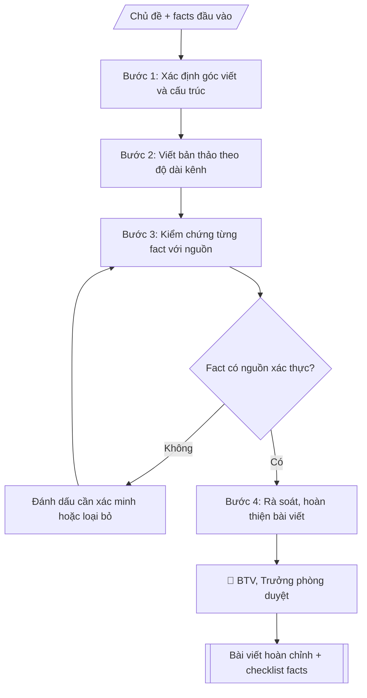

# Bài viết truyền thông

## Định dạng và file đầu ra

Định dạng đầu ra có thể chọn theo sản phẩm/yêu cầu: .docx, .pdf, .txt, .md, .html. Đọc mục “Định dạng bổ sung” trong quy cách đầu ra trước khi chọn.

**Phải tạo file thực tế để tải xuống, không chỉ trả nội dung trong chat.** Định dạng mặc định của skill: **.docx**. Nếu có bảng số liệu nghiệp vụ yêu cầu file bảng tính riêng, tạo thêm Excel theo yêu cầu; không tự tạo file kiểm tra. Không chờ người dùng yêu cầu xuất file lần nữa. Ưu tiên định dạng người dùng chỉ định; đọc quy tắc xuất file tại references/quy-cach-dau-ra.md.

## Quy cách đầu ra và thông tin thiếu

Đọc [quy cách và cấu trúc sản phẩm](references/quy-cach-dau-ra.md) trước khi soạn/xuất. File giao chỉ gồm văn bản hoặc sản phẩm nghiệp vụ được yêu cầu; kiểm tra nội bộ không xuất kèm. Thiếu thông tin giữ nguyên trường/mục và chỗ điền theo mẫu gốc (dòng dấu chấm, dấu gạch hoặc ô trống); không tự điền dữ liệu mẫu, số 0, mã chờ xác minh hoặc dòng chờ ký. Mẫu chuyên ngành còn áp dụng được ưu tiên về cấu trúc, mã biểu và người ký. Các trường “bắt buộc” là điều kiện hoàn thiện hồ sơ, không ngăn việc soạn bản có chỗ chừa để điền. Mọi chỉ dẫn “để trống” trong skill được hiểu là không điền dữ liệu và giữ cách chừa chỗ của mẫu gốc, không phải xóa dấu chấm của mẫu.


## Kiểm soát áp dụng và phê duyệt

Trước khi chạy quy trình, xác định `ngay_ap_dung`, `loai_hinh_truong`, `quy_che_noi_bo`, `nguon_du_lieu` và `nguoi_kiem_duyet`. Chỉ yêu cầu thông tin có liên quan đến nghiệp vụ; không dùng giá trị giả định thay dữ liệu bắt buộc. Đối chiếu nội bộ hồ sơ có yếu tố pháp lý với văn bản gốc, hiệu lực, điều khoản áp dụng và chuyển tiếp; không tự đính kèm bảng kiểm tra vào file giao.

## Giới hạn và human gate

AI hỗ trợ chuẩn bị và đối chiếu. Cán bộ phụ trách kiểm tra dữ liệu/căn cứ, người có thẩm quyền duyệt và ký. Văn bản soạn chưa được coi là đã ban hành; không tự chèn nhãn trạng thái kiểm duyệt vào file giao; không đánh dấu đã ký, đã duyệt hoặc đã công bố nếu chưa có chứng cứ. Dữ liệu sinh viên, sức khỏe, nhân sự và tài chính phải hạn chế theo mục đích, phân quyền và che thông tin định danh khi dùng ví dụ. Không tải dữ liệu lên dịch vụ ngoài khi chưa có quyền. Kiểm tra Luật 91/2025/QH15 về bảo vệ dữ liệu cá nhân (hiệu lực 01/01/2026) và quy định áp dụng trước xử lý/chia sẻ dữ liệu cá nhân.

## Khi nào dùng
Khi cần bài viết cho website, fanpage, bản tin: tin sự kiện, gương sinh viên/giảng viên tiêu biểu,
giới thiệu ngành học, thông tin tuyển sinh, thành tựu nghiên cứu.

## Đầu vào (Input)

| Trường | Mô tả | Bắt buộc |
|---|---|---|
| `chu_de` | Chủ đề bài viết | Có |
| `dinh_dang` | Tin ngắn / bài phỏng vấn / bài giới thiệu / bài PR | Có |
| `kenh` | Website / fanpage (quyết định độ dài, giọng văn) | Có |
| `thong_tin` | Facts đầu vào: sự kiện, nhân vật, số liệu, trích dẫn (dạng gạch đầu dòng) | Có |
| `muc_dich` | Thông tin / tuyển sinh / xây dựng thương hiệu | Có |
| `do_dai` | Số từ mong muốn (website 600–900, fanpage 150–300) | Không |
| `cta` | Lời kêu gọi hành động cuối bài (đăng ký tư vấn, xem thêm...) | Không |

## Quy trình

**Bước 1. Xác định góc viết và cấu trúc**
- Làm gì: chọn góc viết phù hợp brand voice (trẻ trung + học thuật) và mục đích bài (thông tin / tuyển sinh / xây dựng thương hiệu); dựng cấu trúc: tiêu đề thu hút → mở bài (hook) → thân bài (facts sắp xếp theo logic) → kết + CTA.
- Dùng input: `chu_de`, `dinh_dang`, `muc_dich`, `kenh` (quyết định độ dài, giọng văn).
- Vai trò: Chuyên viên Phòng Truyền thông – Tuyển sinh · AI hỗ trợ: soạn dự thảo, lập bảng biểu, định dạng · ⏱ ~30–60 phút (ước tính)
- Lưu ý nghiệp vụ: góc viết phải phục vụ đúng mục đích; fanpage ưu tiên cảm xúc và hook nhanh, website ưu tiên đầy đủ 5W1H.
- → Kết quả bước: Dàn ý bài viết (góc viết + cấu trúc các phần).

**Bước 2. Viết bản thảo**
- Làm gì: viết bài theo dàn ý: câu ngắn, đoạn ngắn cho fanpage (150–300 từ); đầy đủ 5W1H cho website (600–900 từ); trích dẫn giữ nguyên văn lời nhân vật; chèn CTA cuối bài.
- Dùng input: `thong_tin`, `do_dai`, `cta`, `kenh`.
- Vai trò: Chuyên viên Phòng Truyền thông – Tuyển sinh · AI hỗ trợ: soạn dự thảo · ⏱ ~30–60 phút (ước tính)
- Lưu ý nghiệp vụ: không thêm số liệu, thành tích, trích dẫn ngoài input; không dùng từ ngữ tuyệt đối hóa ("nhất", "duy nhất") khi chưa có căn cứ; không so sánh với trường khác.
- → Kết quả bước: Bản thảo bài viết.

**Bước 3. Kiểm chứng facts**
- Làm gì: đối chiếu từng tên người/chức danh/số liệu/ngày tháng/trích dẫn trong bản thảo với nguồn đầu vào; fact nào thiếu nguồn thì đánh dấu [cần xác minh] hoặc loại bỏ; lập checklist kiểm chứng.
- Dùng input: `thong_tin`.
- Vai trò: Chuyên viên Phòng Truyền thông – Tuyển sinh · AI hỗ trợ: đối chiếu tự động, cảnh báo sai lệch · ⏱ ~1–2 giờ (ước tính)
- Lưu ý nghiệp vụ: trích dẫn phải được nhân vật xác nhận; ảnh phải được đồng ý sử dụng; mọi số liệu tuyển sinh phải khớp với đề án tuyển sinh đã ban hành.
- → Kết quả bước: Checklist kiểm chứng facts (từng fact: đã có nguồn / cần xác minh).

**Bước 4. Rà soát và hoàn thiện**
- Làm gì: rà soát bản thảo theo checklist: loại bỏ fact chưa xác minh (hoặc giữ dấu [cần xác minh]), kiểm tra brand voice, chính tả, hashtag/CTA; hoàn thiện bài viết cuối cùng; checklist chỉ dùng nội bộ.
- Dùng input: (kết quả Bước 2, 3).
- Vai trò: Chuyên viên Phòng Truyền thông – Tuyển sinh · AI hỗ trợ: soạn dự thảo, đối chiếu tự động, cảnh báo sai lệch · ⏱ ~1–2 giờ (ước tính)
- Lưu ý nghiệp vụ: không trình duyệt/bàn giao bài khi còn fact [cần xác minh] liên quan đến số liệu hoặc trích dẫn quan trọng.
- → Kết quả bước: Bài viết hoàn chỉnh + checklist kiểm chứng facts.

## Luồng quy trình (Workflow)


```

## Đầu ra

File nghiệp vụ thực tế theo định dạng mặc định ở đầu skill hoặc định dạng người dùng yêu cầu, kèm liên kết tải trong phản hồi cuối.

Sản phẩm nghiệp vụ hoàn chỉnh theo [quy cách và cấu trúc](references/quy-cach-dau-ra.md), giữ các trường chưa có dữ liệu ở trạng thái trống. Không xuất kèm checklist/phụ lục kiểm tra đầu ra.

## Kiểm tra nội bộ trước khi giao

- [ ] Bố cục khớp mẫu áp dụng và cấu trúc tại references/quy-cach-dau-ra.md.
- [ ] Có đầy đủ sản phẩm: Bài viết hoàn chỉnh theo độ dài kênh
- [ ] Bố cục khớp mẫu áp dụng và cấu trúc tại references/quy-cach-dau-ra.md.
- [ ] Mọi số liệu, tên, ngày tháng trong output khớp với Input đã cung cấp (không thêm bớt, không suy đoán)
- [ ] Không bịa đặt số liệu, minh chứng, trích dẫn hay căn cứ
- [ ] Đúng thể thức, định dạng văn bản theo quy định hiện hành
- [ ] Căn cứ pháp lý nêu đầy đủ, còn hiệu lực tại thời điểm lập
- [ ] Đã qua Human gate: người có thẩm quyền đã kiểm tra/ký duyệt trước khi phát hành
- [ ] Góc viết phải phục vụ đúng mục đích
- [ ] Không thêm số liệu, thành tích, trích dẫn ngoài input

> Tiêu chí đạt: tất cả các ô đều được đánh dấu.

## Human gate (người kiểm duyệt)
- Biên tập viên kiểm chứng facts theo checklist trước khi trình.
- Trưởng phòng duyệt bài cuối cùng trước khi đăng.
- Nhân vật trong bài phải xác nhận trích dẫn và đồng ý sử dụng hình ảnh.

## Giới hạn (guardrails)
- Không bịa số liệu, thành tích, trích dẫn.
- Không tự đăng bài lên bất kỳ kênh nào.
- Không dùng hình ảnh chưa được nhân vật đồng ý hoặc không rõ bản quyền.
- Không dùng ngôn từ tuyệt đối hóa, so sánh thiếu căn cứ với trường khác.

## Căn cứ & lưu ý
- Brand voice: trẻ trung, học thuật — thống nhất mọi bài viết.
- Mọi thông tin tuyển sinh phải khớp đề án tuyển sinh đã ban hành.
- Không dùng tên thật của trường/cá nhân khi mô phỏng.

## Quản trị phiên bản

- Phiên bản gói: `1.3.1`; ngày cập nhật: `2026-10-10`.
- Kho nguồn: https://github.com/phamtruong91/university-skills-framework
- Người duy trì trên GitHub: `phamtruong91` (Phạm Văn Trường). Người phê duyệt nghiệp vụ: **chưa chỉ định**.
- Commit nguồn trước cập nhật: `346719e6b0318ed034b4b016703f79733aa575e7`. Commit chứa phiên bản này xem bằng `git log -1 -- skills/bai-viet-truyen-thong`; không tự gán SHA chưa tạo.
- Giấy phép: theo LICENSE của kho; bản quyền CES Global.
- Lịch sử 1.1.0: bổ sung metadata giao diện, kiểm soát áp dụng, quản trị phiên bản.
- Trạng thái: dự thảo nghiệp vụ; kiểm tra pháp lý trước thực thi. Ngày cập nhật không đồng nghĩa mọi văn bản đã được rà soát toàn văn.
