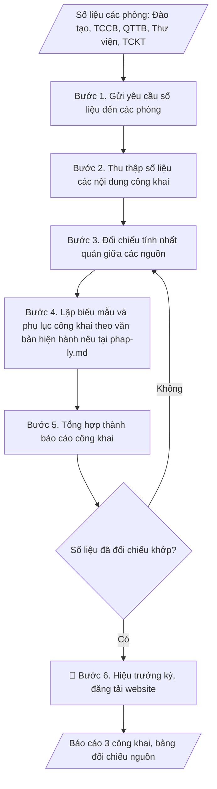

# Soạn báo cáo 3 công khai

## Định dạng và file đầu ra
Định dạng đầu ra có thể chọn theo sản phẩm/yêu cầu: .docx, .pdf. Đọc mục “Định dạng bổ sung” trong quy cách đầu ra trước khi chọn.

**Phải tạo file thực tế để tải xuống, không chỉ trả nội dung trong chat.** Định dạng mặc định của skill: **.docx**. Nếu có bảng số liệu nghiệp vụ yêu cầu file bảng tính riêng, tạo thêm Excel theo yêu cầu; không tự tạo file kiểm tra. Không chờ người dùng yêu cầu xuất file lần nữa. Ưu tiên định dạng người dùng chỉ định; đọc quy tắc xuất file tại references/quy-cach-dau-ra.md.

## Quy cách đầu ra và thông tin thiếu
Khi dựng file Word/Excel, áp dụng mục “Thể thức và bảng biểu khi dựng file” trong quy cách đầu ra (cỡ chữ từng thành phần, bảng nhiều trang, số trang, phụ lục). Đọc [quy cách và cấu trúc sản phẩm](references/quy-cach-dau-ra.md) trước khi soạn/xuất. File giao chỉ gồm sản phẩm nghiệp vụ được yêu cầu; kiểm tra nội bộ không xuất kèm. Thiếu thông tin thì giữ nguyên trường/mục và chỗ điền theo mẫu gốc (dòng dấu chấm, dấu gạch hoặc ô trống); không tự điền dữ liệu mẫu, số 0, mã chờ xác minh hay dòng chờ ký. Mẫu chuyên ngành còn áp dụng được ưu tiên về cấu trúc, mã biểu và người ký. Bản đầy đủ: [quy tắc chung](references/quy-tac-chung.md).

## Kiểm soát áp dụng và phê duyệt
Trước khi chạy, xác định `ngay_ap_dung`, `loai_hinh_truong`, `quy_che_noi_bo`, `nguon_du_lieu`, `nguoi_kiem_duyet`; chỉ hỏi thông tin liên quan nghiệp vụ, không dùng giá trị giả định thay dữ liệu bắt buộc. Đối chiếu căn cứ pháp lý với văn bản gốc, hiệu lực, điều khoản áp dụng và chuyển tiếp. Bản đầy đủ: [quy tắc chung](references/quy-tac-chung.md).

Nếu có cập nhật pháp lý dưới đây, đọc [căn cứ và điều kiện áp dụng](references/phap-ly.md) trước khi làm. Quy trình dưới đây giữ nghiệp vụ từ bản gốc; mọi viện dẫn văn bản, mẫu biểu, điều khoản phải theo căn cứ đã chọn trong phap-ly.md, không theo văn bản cũ.

## Giới hạn và human gate
AI hỗ trợ chuẩn bị và đối chiếu; cán bộ phụ trách kiểm tra dữ liệu/căn cứ, người có thẩm quyền duyệt và ký. Không đánh dấu đã ký, đã duyệt, đã công bố khi chưa có chứng cứ. Dữ liệu sinh viên, sức khỏe, nhân sự, tài chính chỉ dùng theo mục đích và phân quyền, che thông tin định danh khi dùng ví dụ (Luật 91/2025/QH15, hiệu lực 01/01/2026); không tải dữ liệu lên dịch vụ ngoài khi chưa có quyền. Bản đầy đủ: [quy tắc chung](references/quy-tac-chung.md).

## Khi nào dùng
Khi tổng hợp báo cáo 3 công khai năm học để đăng tải trên website của trường theo
quy định của Bộ GD&ĐT (thường đầu năm học).

## Đầu vào (Input)
| Trường | Mô tả | Bắt buộc |
|---|---|---|
| `nam_hoc` | Năm học báo cáo (VD: 2025–2026) | Có |
| `cam_ket_chat_luong` | Số liệu đào tạo: ngành đào tạo, chỉ tiêu, quy mô SV, tỷ lệ tốt nghiệp, việc làm | Có |
| `dieu_kien_dam_bao` | Đội ngũ (số lượng, trình độ GV), cơ sở vật chất, học liệu | Có |
| `thu_chi_tai_chinh` | Tổng thu, tổng chi, học phí bình quân, các khoản thu khác | Có |
| `don_vi_cung_cap` | Phòng ban cung cấp số liệu từng phần (Đào tạo, TCCB, QTTB, TCKT) | Không |

## Quy trình
**Ràng buộc pháp lý khi thực hiện** (trích references/phap-ly.md; đối chiếu toàn văn và hiệu lực tại ngày nghiệp vụ):
- Thông tư 09/2024/TT-BGDĐT, hiệu lực 19/07/2024, thay 36/2017: Chuyển từ mẫu ba công khai cũ sang nội dung công khai và báo cáo thường niên theo 09/2024. Đối chiếu phần thông tin chung, phần giáo dục đại học và phụ lục báo cáo thường niên; lưu nội dung trên website tối thiểu 5 năm. Ghi thời điểm, đường dẫn công bố, người duyệt và bằng chứng cập nhật. Không tự thêm số liệu hoặc tự công bố; không coi báo cáo gửi cơ quan quản lý là nghĩa vụ định kỳ nếu không có căn cứ/yêu cầu bằng văn bản.
- Trước Bước 1: chọn căn cứ theo đối tượng, loại hình trường và chuyển tiếp; lập bảng văn bản / điều khoản / lý do áp dụng / bằng chứng. Thiếu văn bản gốc hoặc điều khoản thì ghi nhận nội bộ [CẦN XÁC MINH] (không đưa vào file giao), để trống phần tương ứng, chưa kết luận tuân thủ.
- Các con số, thời hạn, số điều, số mức xếp loại, hệ số và mẫu biểu nêu trong các bước dưới đây được giữ từ quy trình gốc (trước cập nhật pháp lý); chỉ dùng khi đã đối chiếu đúng với căn cứ đã chọn, khác thì theo căn cứ. Danh sách điểm cần đối chiếu: docs/DIEM_CAN_DOI_CHIEU_PHAP_LY.md.

Báo cáo công khai của trường gồm các nội dung công khai và báo cáo thường niên theo văn bản hiện hành nêu tại phap-ly.md. Tên gọi "3 công khai" là cách gọi theo quy định cũ; danh mục nội dung, số biểu và phụ lục phải lấy từ văn bản gốc đã chọn, không mặc định là 3 biểu.

**Bước 1. Gửi yêu cầu số liệu đến các phòng**
- Làm gì: Lập danh sách đầu mối từng phòng (Đào tạo, TCCB, QTTB, Thư viện, TCKT);
  gửi công văn yêu cầu cung cấp số liệu phục vụ 3 công khai kèm biểu mẫu thống nhất theo
  danh mục nội dung công khai của căn cứ đã chọn và thời hạn nộp; xác nhận các phòng đã nhận và hiểu đúng yêu cầu.
- Dùng input: `nam_hoc`, `don_vi_cung_cap`
- Vai trò: Chuyên viên các phòng chức năng · AI hỗ trợ: soạn công văn yêu cầu số liệu và biểu mẫu theo văn bản hiện hành nêu tại phap-ly.md · ⏱ 1–2 ngày làm việc (ước tính)
- Lưu ý nghiệp vụ: Biểu mẫu phải bám đúng danh mục nội dung của văn bản hiện hành nêu tại phap-ly.md —
  yêu cầu thừa/thiếu mục sẽ phải xin bổ sung, mất thời gian; thời hạn nộp phải trước
  ít nhất 15 ngày so với hạn đăng tải công khai.
- → Kết quả bước: Công văn yêu cầu số liệu + danh sách đầu mối các phòng + bảng theo
  dõi tiến độ nộp.

**Bước 2. Thu thập số liệu các nội dung công khai**
- Làm gì: Thu số liệu từng nội dung; nhóm số liệu dưới đây là nghiệp vụ gốc, đối chiếu với danh mục của căn cứ đã chọn, mục nào văn bản mới không yêu cầu thì bỏ, mục nào yêu cầu thêm thì bổ sung: (1) Cam kết chất lượng đào tạo — từ Phòng Đào
  tạo: ngành đào tạo, trình độ, chỉ tiêu tuyển sinh, quy mô đào tạo, tỷ lệ tốt nghiệp,
  tỷ lệ có việc làm sau 12 tháng; (2) Điều kiện đảm bảo chất lượng — từ Phòng TCCB
  (đội ngũ: tổng số, cơ hữu/thỉnh giảng, trình độ GS/PGS/TS/ThS), Phòng QTTB (CSVC:
  diện tích sàn, phòng học, PTN, KTX), Thư viện (học liệu); (3) Thu chi tài chính —
  từ Phòng TCKT: tổng thu, tổng chi, học phí bình quân/SV/năm, các khoản thu dịch vụ
  khác.
- Dùng input: `cam_ket_chat_luong`, `dieu_kien_dam_bao`, `thu_chi_tai_chinh`
- Vai trò: Chuyên viên các phòng chức năng · AI hỗ trợ: tổng hợp các bộ số liệu thô theo nội dung công khai, các phòng cung cấp số liệu gốc · ⏱ 3–5 ngày làm việc (chờ các phòng nộp) (ước tính)
- Lưu ý nghiệp vụ: Số liệu đội ngũ phải phân biệt rõ "cơ hữu" và "thỉnh giảng" — gộp
  chung là lỗi vi phạm biểu mẫu công khai; tỷ lệ việc làm phải ghi rõ mốc đo (sau 12
  tháng tốt nghiệp) và phương pháp khảo sát; học phí bình quân tính theo thực thu,
  không lấy mức niêm yết.
- → Kết quả bước: Các bộ số liệu thô theo nội dung công khai (có ghi nguồn phòng
  cung cấp).

**Bước 3. Đối chiếu tính nhất quán giữa các nguồn**
- Làm gì: Đối chiếu chéo các số liệu liên quan giữa các phòng (VD: quy mô SV của
  Phòng Đào tạo với số liệu tính học phí bình quân của Phòng TCKT; số GV cơ hữu của
  TCCB với số liệu đội ngũ trong báo cáo tổng kết); lập bảng đối chiếu nguồn số liệu;
  liệt kê các chênh lệch, yêu cầu phòng liên quan xác nhận lại.
- Dùng input: `cam_ket_chat_luong`, `dieu_kien_dam_bao`, `thu_chi_tai_chinh`
- Vai trò: Chuyên viên các phòng chức năng · AI hỗ trợ: đối chiếu chéo các số liệu liên quan và lập bảng đối chiếu · ⏱ 1–2 ngày làm việc (ước tính)
- Lưu ý nghiệp vụ: Chênh lệch số liệu giữa các phòng là bình thường (khác mốc thời
  gian thống kê) — phải thống nhất một mốc thời gian chung trước khi đối chiếu; mọi
  chênh lệch chưa giải trình được thì không đưa vào báo cáo.
- → Kết quả bước: Bảng đối chiếu nguồn số liệu từng phòng ban + danh sách chênh lệch
  đã xử lý.

**Bước 4. Lập biểu mẫu và phụ lục công khai**
- Làm gì: Điền số liệu đã đối chiếu vào đúng biểu mẫu và phụ lục của văn bản hiện hành nêu tại phap-ly.md (nội dung về cam kết/chất lượng đào tạo, điều kiện đảm bảo chất lượng, tài chính chỉ đưa vào khi căn cứ yêu cầu);
  kiểm tra từng ô số liệu khớp với bảng đối chiếu.
- Dùng input: (xử lý trên số liệu đã đối chiếu từ Bước 3)
- Vai trò: Chuyên viên các phòng chức năng · AI hỗ trợ: điền số liệu vào đúng biểu mẫu theo văn bản hiện hành nêu tại phap-ly.md · ⏱ 2–3 giờ (ước tính)
- Lưu ý nghiệp vụ: Không tự ý thêm/bớt dòng trong biểu mẫu — biểu mẫu công khai theo
  mẫu chuẩn của văn bản đã chọn; đơn vị tính phải ghi rõ trong từng biểu (người, %, tỷ đồng); số
  liệu tài chính làm tròn thống nhất (đến 0,1 tỷ hoặc triệu đồng).
- → Kết quả bước: Bộ biểu mẫu/phụ lục công khai (đã điền số liệu, ô thiếu để trống).

**Bước 5. Tổng hợp thành báo cáo công khai**
- Làm gì: Gộp các biểu mẫu thành một văn bản báo cáo thống nhất theo bố cục của căn cứ đã chọn (không mặc định Phần I, II, III); viết
  phần mở đầu (căn cứ văn bản hiện hành nêu tại phap-ly.md, năm học báo cáo); rà soát thể thức, chính tả; đính
  kèm bảng đối chiếu nguồn số liệu làm phụ lục nội bộ.
- Dùng input: `nam_hoc`
- Vai trò: Chuyên viên các phòng chức năng · AI hỗ trợ: soạn dự thảo báo cáo thống nhất · ⏱ 2–3 giờ (ước tính)
- Lưu ý nghiệp vụ: Báo cáo đăng website là văn bản công khai — mọi con số đều có thể
  bị báo chí/cơ quan quản lý đối chiếu, nên độ chính xác phải tuyệt đối; giữ bảng đối
  chiếu nguồn làm hồ sơ nội bộ để giải trình khi cần.
- → Kết quả bước: Bản thảo báo cáo công khai (đủ phần theo căn cứ + phụ lục đối chiếu nội bộ, không đưa vào file giao).

**Bước 6. Trình Hiệu trưởng ký và đăng tải công khai**
- Làm gì: Trình Hiệu trưởng kiểm tra, ký duyệt; đăng tải báo cáo đã ký lên website
  của trường tại mục công khai (đúng vị trí quy định, dễ tìm); kiểm tra file hiển thị
  đúng, tải được; lưu hồ sơ (bản ký, file đăng tải, ảnh chụp màn hình trang công khai).
- Dùng input: (không dùng trường input mới)
- Vai trò: Hiệu trưởng · AI hỗ trợ: soạn dự thảo văn bản trình ký, kiểm tra thể thức · ⏱ 1–2 ngày làm việc (ước tính)
- Lưu ý nghiệp vụ: Phải đăng đúng mục công khai theo quy định trên
  website, lưu nội dung theo thời hạn tối thiểu của căn cứ (theo tóm tắt nguồn thứ cấp là 5 năm, đối chiếu toàn văn) — đăng nhầm mục tin tức sẽ bị coi là chưa công khai khi thanh tra; kiểm tra
  lại sau 24h để chắc chắn file không bị lỗi/gỡ; lưu bằng chứng đăng tải vì thanh tra
  có thể hỏi thời điểm công khai.
- → Kết quả bước: Báo cáo 3 công khai đã ký + đường dẫn đăng tải trên website + hồ
  sơ lưu.

## Luồng quy trình (Workflow)

## Đầu ra
- Báo cáo công khai hoàn chỉnh (biểu mẫu/phụ lục theo căn cứ đã chọn).
- Bảng đối chiếu nguồn số liệu từng phòng ban.

File nghiệp vụ thực tế theo định dạng mặc định ở đầu skill hoặc định dạng người dùng yêu cầu, kèm liên kết tải trong phản hồi cuối.

Sản phẩm nghiệp vụ hoàn chỉnh theo [quy cách và cấu trúc](references/quy-cach-dau-ra.md), giữ các trường chưa có dữ liệu ở trạng thái trống. Không xuất kèm checklist/phụ lục kiểm tra đầu ra.

## Kiểm tra nội bộ trước khi giao
Các tiêu chí sau dùng để tự đối chiếu; không sao chép vào file xuất. Mục thiếu dữ liệu được để trống, không đánh dấu đã đạt hoặc đã duyệt.

- [ ] Đủ các phần và đúng bố cục theo cấu trúc tại references/quy-cach-dau-ra.md (không theo cấu trúc của bản gốc).
- [ ] Số liệu khớp với Input và điền đúng biểu mẫu chuẩn của văn bản hiện hành nêu tại phap-ly.md (không tự ý thêm/bớt dòng).
- [ ] Số liệu nhất quán giữa các nguồn: đội ngũ phân rõ cơ hữu/thỉnh giảng; tỷ lệ việc làm ghi rõ mốc 12 tháng và phương pháp khảo sát; học phí bình quân tính theo thực thu.
- [ ] Không bịa đặt số liệu; chênh lệch chưa giải trình được đã loại khỏi báo cáo.
- [ ] Đơn vị tính ghi rõ trong từng biểu; số liệu tài chính làm tròn thống nhất.
- [ ] Đúng thể thức: địa danh, ngày tháng năm, chữ ký Hiệu trưởng.
- [ ] Đã qua Human gate: Hiệu trưởng đã ký duyệt; báo cáo đã đăng đúng mục công khai trên website.
- [ ] Đã kiểm tra sau đăng 24h: file hiển thị đúng, tải được; đã lưu bằng chứng đăng tải.

## Căn cứ & lưu ý
- Căn cứ hiện hành: xem [căn cứ và điều kiện áp dụng](references/phap-ly.md); phải đối chiếu văn bản gốc, hiệu lực và chuyển tiếp tại ngày nghiệp vụ.
- Báo cáo phải đăng tải công khai trên website của trường.
- Số liệu các đơn vị cung cấp phải nhất quán, có đối chiếu trước khi tổng hợp.
- Không dùng tên thật của trường/cá nhân khi mô phỏng.

## Tư liệu đối chiếu
Bản gốc trước cập nhật pháp lý (kèm ví dụ giả lập) lưu tại `references/quy-trinh-lich-su.md`, chỉ để đối chiếu hồ sơ lịch sử; không dùng căn cứ, mẫu hay số liệu trong đó làm chỉ dẫn hiện hành.

## Quản trị phiên bản
- Phiên bản gói `1.3.2` (cập nhật 2026-10-10); hồ sơ đầy đủ tại [references/version.json](references/version.json).
- Người phê duyệt nghiệp vụ: **chưa chỉ định**. Trạng thái: dự thảo nghiệp vụ; kiểm tra pháp lý trước thực thi. Ngày cập nhật không đồng nghĩa mọi văn bản đã được rà soát toàn văn.
- Giấy phép theo LICENSE của kho (bản quyền CES Global). Lịch sử thay đổi: CHANGELOG.md.
