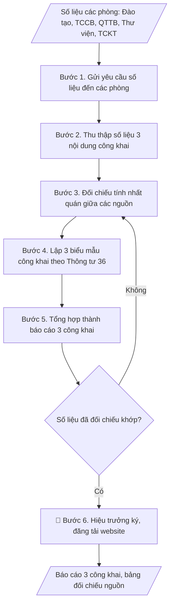

# Skill: Soạn báo cáo 3 công khai

## Khi nào dùng
Khi tổng hợp báo cáo 3 công khai năm học để đăng tải trên website của trường theo
quy định của Bộ GD&ĐT (thường đầu năm học).

## Đầu vào (Input)

| Trường | Mô tả | Bắt buộc |
|---|---|---|
| `nam_hoc` | Năm học báo cáo (VD: 2025–2026) | Có |
| `cam_ket_chat_luong` | Số liệu đào tạo: ngành đào tạo, chỉ tiêu, quy mô SV, tỷ lệ tốt nghiệp, việc làm | Có |
| `dieu_kien_dam_bao` | Đội ngũ (số lượng, trình độ GV), cơ sở vật chất, học liệu | Có |
| `thu_chi_tai_chinh` | Tổng thu, tổng chi, học phí bình quân, các khoản thu khác | Có |
| `don_vi_cung_cap` | Phòng ban cung cấp số liệu từng phần (Đào tạo, TCCB, QTTB, TCKT) | Không |

## Quy trình

Báo cáo 3 công khai gồm đúng **3 nội dung** theo Thông tư 36/2017/TT-BGDĐT.

**Bước 1. Gửi yêu cầu số liệu đến các phòng**
- Làm gì: Lập danh sách đầu mối từng phòng (Đào tạo, TCCB, QTTB, Thư viện, TCKT);
  gửi công văn yêu cầu cung cấp số liệu phục vụ 3 công khai kèm biểu mẫu thống nhất
  và thời hạn nộp; xác nhận các phòng đã nhận và hiểu đúng yêu cầu.
- Dùng input: `nam_hoc`, `don_vi_cung_cap`
- Vai trò: Chuyên viên các phòng chức năng · AI hỗ trợ: soạn công văn yêu cầu số liệu và biểu mẫu theo Thông tư 36 · ⏱ 1–2 ngày làm việc (ước tính)
- Lưu ý nghiệp vụ: Biểu mẫu phải bám đúng 3 nội dung của Thông tư 36/2017/TT-BGDĐT —
  yêu cầu thừa/thiếu mục sẽ phải xin bổ sung, mất thời gian; thời hạn nộp phải trước
  ít nhất 15 ngày so với hạn đăng tải công khai.
- → Kết quả bước: Công văn yêu cầu số liệu + danh sách đầu mối các phòng + bảng theo
  dõi tiến độ nộp.

**Bước 2. Thu thập số liệu 3 nội dung công khai**
- Làm gì: Thu số liệu từng nội dung: (1) Cam kết chất lượng đào tạo — từ Phòng Đào
  tạo: ngành đào tạo, trình độ, chỉ tiêu tuyển sinh, quy mô đào tạo, tỷ lệ tốt nghiệp,
  tỷ lệ có việc làm sau 12 tháng; (2) Điều kiện đảm bảo chất lượng — từ Phòng TCCB
  (đội ngũ: tổng số, cơ hữu/thỉnh giảng, trình độ GS/PGS/TS/ThS), Phòng QTTB (CSVC:
  diện tích sàn, phòng học, PTN, KTX), Thư viện (học liệu); (3) Thu chi tài chính —
  từ Phòng TCKT: tổng thu, tổng chi, học phí bình quân/SV/năm, các khoản thu dịch vụ
  khác.
- Dùng input: `cam_ket_chat_luong`, `dieu_kien_dam_bao`, `thu_chi_tai_chinh`
- Vai trò: Chuyên viên các phòng chức năng · AI hỗ trợ: tổng hợp 03 bộ số liệu thô theo 3 nội dung, các phòng cung cấp số liệu gốc · ⏱ 3–5 ngày làm việc (chờ các phòng nộp) (ước tính)
- Lưu ý nghiệp vụ: Số liệu đội ngũ phải phân biệt rõ "cơ hữu" và "thỉnh giảng" — gộp
  chung là lỗi vi phạm biểu mẫu công khai; tỷ lệ việc làm phải ghi rõ mốc đo (sau 12
  tháng tốt nghiệp) và phương pháp khảo sát; học phí bình quân tính theo thực thu,
  không lấy mức niêm yết.
- → Kết quả bước: 03 bộ số liệu thô theo 3 nội dung công khai (có ghi nguồn phòng
  cung cấp).

**Bước 3. Đối chiếu tính nhất quán giữa các nguồn**
- Làm gì: Đối chiếu chéo các số liệu liên quan giữa các phòng (VD: quy mô SV của
  Phòng Đào tạo với số liệu tính học phí bình quân của Phòng TCKT; số GV cơ hữu của
  TCCB với số liệu đội ngũ trong báo cáo tổng kết); lập bảng đối chiếu nguồn số liệu;
  liệt kê các chênh lệch, yêu cầu phòng liên quan xác nhận lại.
- Dùng input: `cam_ket_chat_luong`, `dieu_kien_dam_bao`, `thu_chi_tai_chinh`
- Vai trò: Chuyên viên các phòng chức năng · AI hỗ trợ: đối chiếu chéo các số liệu liên quan và lập bảng đối chiếu · ⏱ 1–2 ngày làm việc (ước tính)
- Lưu ý nghiệp vụ: Chênh lệch số liệu giữa các phòng là bình thường (khác mốc thời
  gian thống kê) — phải thống nhất một mốc thời gian chung trước khi đối chiếu; mọi
  chênh lệch chưa giải trình được thì không đưa vào báo cáo.
- → Kết quả bước: Bảng đối chiếu nguồn số liệu từng phòng ban + danh sách chênh lệch
  đã xử lý.

**Bước 4. Lập 3 biểu mẫu công khai**
- Làm gì: Điền số liệu đã đối chiếu vào đúng 3 biểu mẫu theo Thông tư
  36/2017/TT-BGDĐT: Biểu mẫu 1 — công khai cam kết chất lượng đào tạo; Biểu mẫu 2 —
  công khai điều kiện đảm bảo chất lượng; Biểu mẫu 3 — công khai thu chi tài chính;
  kiểm tra từng ô số liệu khớp với bảng đối chiếu.
- Dùng input: (xử lý trên số liệu đã đối chiếu từ Bước 3)
- Vai trò: Chuyên viên các phòng chức năng · AI hỗ trợ: điền số liệu vào đúng 3 biểu mẫu theo Thông tư 36 · ⏱ 2–3 giờ (ước tính)
- Lưu ý nghiệp vụ: Không tự ý thêm/bớt dòng trong biểu mẫu — biểu mẫu 3 công khai có
  mẫu chuẩn của Bộ; đơn vị tính phải ghi rõ trong từng biểu (người, %, tỷ đồng); số
  liệu tài chính làm tròn thống nhất (đến 0,1 tỷ hoặc triệu đồng).
- → Kết quả bước: 03 biểu mẫu công khai hoàn chỉnh (đã điền số liệu).

**Bước 5. Tổng hợp thành báo cáo 3 công khai**
- Làm gì: Gộp 3 biểu mẫu thành một văn bản báo cáo thống nhất (Phần I, II, III); viết
  phần mở đầu (căn cứ Thông tư 36, năm học báo cáo); rà soát thể thức, chính tả; đính
  kèm bảng đối chiếu nguồn số liệu làm phụ lục nội bộ.
- Dùng input: `nam_hoc`
- Vai trò: Chuyên viên các phòng chức năng · AI hỗ trợ: soạn dự thảo báo cáo thống nhất 3 phần · ⏱ 2–3 giờ (ước tính)
- Lưu ý nghiệp vụ: Báo cáo đăng website là văn bản công khai — mọi con số đều có thể
  bị báo chí/cơ quan quản lý đối chiếu, nên độ chính xác phải tuyệt đối; giữ bảng đối
  chiếu nguồn làm hồ sơ nội bộ để giải trình khi cần.
- → Kết quả bước: Bản thảo báo cáo 3 công khai (3 phần + phụ lục đối chiếu nội bộ).

**Bước 6. Trình Hiệu trưởng ký và đăng tải công khai**
- Làm gì: Trình Hiệu trưởng kiểm tra, ký duyệt; đăng tải báo cáo đã ký lên website
  của trường tại mục công khai (đúng vị trí quy định, dễ tìm); kiểm tra file hiển thị
  đúng, tải được; lưu hồ sơ (bản ký, file đăng tải, ảnh chụp màn hình trang công khai).
- Dùng input: (không dùng trường input mới)
- Vai trò: Hiệu trưởng · AI hỗ trợ: soạn dự thảo văn bản trình ký, kiểm tra thể thức · ⏱ 1–2 ngày làm việc (ước tính)
- Lưu ý nghiệp vụ: Phải đăng đúng mục "3 công khai"/"Công khai chất lượng" trên
  website — đăng nhầm mục tin tức sẽ bị coi là chưa công khai khi thanh tra; kiểm tra
  lại sau 24h để chắc chắn file không bị lỗi/gỡ; lưu bằng chứng đăng tải vì thanh tra
  có thể hỏi thời điểm công khai.
- → Kết quả bước: Báo cáo 3 công khai đã ký + đường dẫn đăng tải trên website + hồ
  sơ lưu.

## Luồng quy trình (Workflow)


## Đầu ra (Output)
- Báo cáo 3 công khai hoàn chỉnh (3 biểu mẫu).
- Bảng đối chiếu nguồn số liệu từng phòng ban.

**Cấu trúc output chuẩn** (sản phẩm chính: Báo cáo 3 công khai) — các phần bắt buộc
theo đúng thứ tự:
1. Tên trường (tiêu đề).
2. Tên báo cáo: BÁO CÁO THỰC HIỆN 3 CÔNG KHAI – NĂM HỌC ...
3. Phần I. CÔNG KHAI CAM KẾT CHẤT LƯỢNG ĐÀO TẠO (ngành đào tạo, chỉ tiêu, quy mô,
   tỷ lệ tốt nghiệp, tỷ lệ việc làm sau 12 tháng).
4. Phần II. CÔNG KHAI ĐIỀU KIỆN ĐẢM BẢO CHẤT LƯỢNG (đội ngũ: tổng số, cơ hữu/thỉnh
   giảng, trình độ; cơ sở vật chất; học liệu, thư viện).
5. Phần III. CÔNG KHAI THU CHI TÀI CHÍNH (tổng thu, tổng chi, học phí bình quân/SV/
   năm, các khoản thu dịch vụ khác).
6. Địa danh, ngày tháng năm.
7. Chữ ký Hiệu trưởng (họ tên, học hàm/học vị).

## Checklist nghiệm thu

- [ ] Đủ 3 phần của "Cấu trúc output chuẩn": Phần I (cam kết chất lượng đào tạo), Phần II (điều kiện đảm bảo chất lượng), Phần III (thu chi tài chính).
- [ ] Số liệu khớp với Input và điền đúng biểu mẫu chuẩn của Thông tư 36/2017/TT-BGDĐT (không tự ý thêm/bớt dòng).
- [ ] Số liệu nhất quán giữa các nguồn: đội ngũ phân rõ cơ hữu/thỉnh giảng; tỷ lệ việc làm ghi rõ mốc 12 tháng và phương pháp khảo sát; học phí bình quân tính theo thực thu.
- [ ] Không bịa đặt số liệu; chênh lệch chưa giải trình được đã loại khỏi báo cáo.
- [ ] Đơn vị tính ghi rõ trong từng biểu; số liệu tài chính làm tròn thống nhất.
- [ ] Đúng thể thức: địa danh, ngày tháng năm, chữ ký Hiệu trưởng.
- [ ] Đã qua Human gate: Hiệu trưởng đã ký duyệt; báo cáo đã đăng đúng mục "3 công khai" trên website.
- [ ] Đã kiểm tra sau đăng 24h: file hiển thị đúng, tải được; đã lưu bằng chứng đăng tải.

Tiêu chí đạt = tất cả các ô được đánh dấu.

## Ví dụ mô phỏng (dữ liệu giả lập)

> Tất cả tên trường, cá nhân, số liệu dưới đây đều là **giả lập**, không liên quan tổ chức/cá nhân có thật.

### Input mẫu

| Trường | Giá trị |
|---|---|
| `nam_hoc` | 2025–2026 |
| `cam_ket_chat_luong` | 18 ngành ĐH; chỉ tiêu 2.500; quy mô 8.200 SV; tỷ lệ tốt nghiệp đúng hạn 78%; có việc làm sau 12 tháng 89% |
| `dieu_kien_dam_bao` | 420 GV (380 cơ hữu): 12 GS/PGS, 95 TS, 273 ThS; 120 phòng học, 35 PTN; thư viện 60.000 đầu sách |
| `thu_chi_tai_chinh` | Tổng thu 210 tỷ; tổng chi 198 tỷ; học phí bình quân 18,5 triệu/SV/năm |

### Output mẫu (trích)

```
TRƯỜNG ĐẠI HỌC A
BÁO CÁO THỰC HIỆN 3 CÔNG KHAI – NĂM HỌC 2025–2026
(Dữ liệu giả lập)

I. CÔNG KHAI CAM KẾT CHẤT LƯỢNG ĐÀO TẠO
1. Ngành đào tạo trình độ đại học: 18 ngành.
2. Chỉ tiêu tuyển sinh: 2.500; quy mô đào tạo: 8.200 sinh viên.
3. Tỷ lệ sinh viên tốt nghiệp đúng hạn: 78%.
4. Tỷ lệ sinh viên có việc làm sau 12 tháng tốt nghiệp: 89%.

II. CÔNG KHAI ĐIỀU KIỆN ĐẢM BẢO CHẤT LƯỢNG
1. Đội ngũ giảng viên: 420 người (380 cơ hữu), trong đó 12 GS/PGS,
   95 tiến sĩ, 273 thạc sĩ.
2. Cơ sở vật chất: 120 phòng học, 35 phòng thí nghiệm / thực hành,
   ký túc xá 800 chỗ.
3. Học liệu: thư viện 60.000 đầu sách, 12 cơ sở dữ liệu điện tử.

III. CÔNG KHAI THU CHI TÀI CHÍNH
1. Tổng thu năm 2025: 210 tỷ đồng; tổng chi: 198 tỷ đồng.
2. Mức thu học phí bình quân: 18,5 triệu đồng/sinh viên/năm.
3. Các khoản thu dịch vụ khác: thực hiện theo quy định, niêm yết công khai.

Thành phố C, ngày 05 tháng 09 năm 2026
HIỆU TRƯỞNG (đã ký)
PGS.TS. Phạm Văn A
```

## Căn cứ & lưu ý
- Thông tư 36/2017/TT-BGDĐT về thực hiện công khai đối với cơ sở giáo dục.
- Báo cáo phải đăng tải công khai trên website của trường.
- Số liệu các đơn vị cung cấp phải nhất quán, có đối chiếu trước khi tổng hợp.
- Không dùng tên thật của trường/cá nhân khi mô phỏng.
