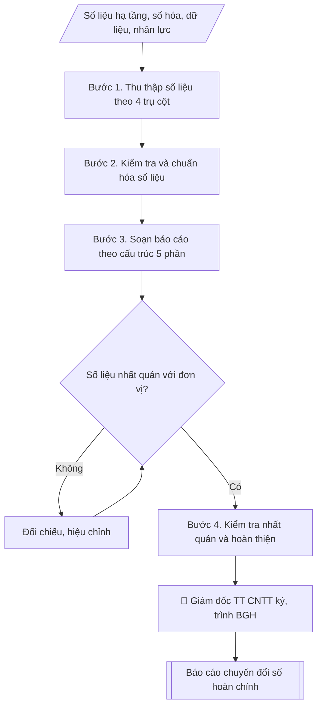

# Báo cáo hiện trạng & kết quả chuyển đổi số

## Định dạng và file đầu ra

Định dạng đầu ra có thể chọn theo sản phẩm/yêu cầu: .docx, .pdf, .pptx. Đọc mục “Định dạng bổ sung” trong quy cách đầu ra trước khi chọn.

**Phải tạo file thực tế để tải xuống, không chỉ trả nội dung trong chat.** Định dạng mặc định của skill: **.docx**. Nếu có bảng số liệu nghiệp vụ yêu cầu file bảng tính riêng, tạo thêm Excel theo yêu cầu; không tự tạo file kiểm tra. Không chờ người dùng yêu cầu xuất file lần nữa. Ưu tiên định dạng người dùng chỉ định; đọc quy tắc xuất file tại references/quy-cach-dau-ra.md.

## Quy cách đầu ra và thông tin thiếu
Khi dựng file Word/Excel, áp dụng mục “Thể thức và bảng biểu khi dựng file” trong quy cách đầu ra (cỡ chữ từng thành phần, bảng nhiều trang, số trang, phụ lục). Đọc [quy cách và cấu trúc sản phẩm](references/quy-cach-dau-ra.md) trước khi soạn/xuất. File giao chỉ gồm sản phẩm nghiệp vụ được yêu cầu; kiểm tra nội bộ không xuất kèm. Thiếu thông tin thì giữ nguyên trường/mục và chỗ điền theo mẫu gốc (dòng dấu chấm, dấu gạch hoặc ô trống); không tự điền dữ liệu mẫu, số 0, mã chờ xác minh hay dòng chờ ký. Mẫu chuyên ngành còn áp dụng được ưu tiên về cấu trúc, mã biểu và người ký. Bản đầy đủ: [quy tắc chung](references/quy-tac-chung.md).

Khi báo cáo có số liệu cần so sánh hoặc nêu xu hướng, đọc mục “Biểu đồ và hình trong báo cáo số liệu” trong quy cách đầu ra trước khi vẽ.

## Kiểm soát áp dụng và phê duyệt
Trước khi chạy, xác định `ngay_ap_dung`, `loai_hinh_truong`, `quy_che_noi_bo`, `nguon_du_lieu`, `nguoi_kiem_duyet`; chỉ hỏi thông tin liên quan nghiệp vụ, không dùng giá trị giả định thay dữ liệu bắt buộc. Đối chiếu căn cứ pháp lý với văn bản gốc, hiệu lực, điều khoản áp dụng và chuyển tiếp. Bản đầy đủ: [quy tắc chung](references/quy-tac-chung.md).

## Giới hạn và human gate
AI hỗ trợ chuẩn bị và đối chiếu; cán bộ phụ trách kiểm tra dữ liệu/căn cứ, người có thẩm quyền duyệt và ký. Không đánh dấu đã ký, đã duyệt, đã công bố khi chưa có chứng cứ. Dữ liệu sinh viên, sức khỏe, nhân sự, tài chính chỉ dùng theo mục đích và phân quyền, che thông tin định danh khi dùng ví dụ (Luật 91/2025/QH15, hiệu lực 01/01/2026); không tải dữ liệu lên dịch vụ ngoài khi chưa có quyền. Bản đầy đủ: [quy tắc chung](references/quy-tac-chung.md).

## Khi nào dùng
Khi cần tổng hợp, đánh giá tiến độ chuyển đổi số của trường để báo cáo Ban Giám hiệu
hoặc cơ quan quản lý (Bộ GD&ĐT, bộ chủ quản).

## Đầu vào (Input)

| Trường | Mô tả | Bắt buộc |
|---|---|---|
| `nam_bao_cao` | Năm báo cáo | Có |
| `so_lieu_ha_tang` | Băng thông, phủ wifi, phòng máy, máy chủ | Có |
| `so_lieu_so_hoa` | Số quy trình đã số hóa / tổng số quy trình; hệ thống đã triển khai (SIS, LMS, tuyển sinh online...) | Có |
| `so_lieu_du_lieu` | Tình trạng kho dữ liệu dùng chung, dashboard quản trị | Có |
| `so_lieu_nhan_luc` | Tỷ lệ CB/GV/SV được tập huấn kỹ năng số | Có |
| `ke_hoach_tham_chieu` | Kế hoạch phát triển CNTT / CĐS để đối chiếu tiến độ | Không |

## Quy trình

**Bước 1. Thu thập số liệu theo 4 trụ cột**
- Làm gì: gửi đề cương thu thập số liệu cho Trung tâm CNTT và các phòng ban theo 4 trụ cột: hạ tầng số (`so_lieu_ha_tang`), số hóa quy trình (`so_lieu_so_hoa`), dữ liệu số (`so_lieu_du_lieu`), nhân lực số (`so_lieu_nhan_luc`); yêu cầu mỗi số liệu kèm minh chứng (log hệ thống, biên bản nghiệm thu, danh sách tập huấn).
- Dùng input: `so_lieu_ha_tang`, `so_lieu_so_hoa`, `so_lieu_du_lieu`, `so_lieu_nhan_luc`.
- Vai trò: Chuyên viên Trung tâm CNTT · AI hỗ trợ: tổng hợp, chuẩn hóa dữ liệu, chuẩn bị hồ sơ trình đầy đủ · ⏱ ~1–2 giờ (ước tính)
- Lưu ý nghiệp vụ: số liệu không có minh chứng được đưa vào diện "chờ xác minh", không đưa vào báo cáo chính thức; chốt thời điểm cắt số liệu (VD: 31/12 của `nam_bao_cao`).
- → Kết quả bước: Bộ số liệu thô 4 trụ cột kèm minh chứng.

**Bước 2. Kiểm tra và chuẩn hóa số liệu**
- Làm gì: đối chiếu số liệu các đơn vị gửi về, phát hiện mâu thuẫn (VD: số quy trình số hóa khác nhau giữa 2 phòng); chuẩn hóa đơn vị tính và công thức tính %; lập danh sách số liệu cần xác minh lại với đơn vị cung cấp.
- Dùng input: bộ số liệu thô (Bước 1).
- Vai trò: Chuyên viên Trung tâm CNTT · AI hỗ trợ: đối chiếu tự động, cảnh báo sai lệch, tính toán, phân tích số liệu · ⏱ ~1–2 giờ (ước tính)
- Lưu ý nghiệp vụ: cùng một chỉ số nhưng 2 đơn vị tính khác công thức là lỗi phổ biến — phải thống nhất công thức trước khi đưa vào báo cáo.
- → Kết quả bước: Bộ số liệu đã chuẩn hóa + danh sách xác minh (nếu có).

**Bước 3. Soạn báo cáo theo cấu trúc 5 phần**
- Làm gì: viết báo cáo 5 phần: 1. Hiện trạng (hạ tầng, hệ thống, dữ liệu, nhân lực — trình bày bằng bảng, chỉ số %); 2. Kết quả nổi bật trong năm (hệ thống mới đưa vào, quy trình mới số hóa); 3. Đối chiếu tiến độ với `ke_hoach_tham_chieu` (hoàn thành/đúng tiến độ/chậm tiến độ từng hạng mục); 4. Khó khăn, tồn tại; 5. Phương hướng năm tiếp theo.
- Dùng input: bộ số liệu đã chuẩn hóa (Bước 2) + `ke_hoach_tham_chieu` + `nam_bao_cao`.
- Vai trò: Chuyên viên Trung tâm CNTT · AI hỗ trợ: soạn dự thảo, đối chiếu tự động, cảnh báo sai lệch · ⏱ ~30–60 phút (ước tính)
- Lưu ý nghiệp vụ: phần đối chiếu tiến độ phải trung thực — hạng mục chậm phải nêu rõ nguyên nhân, không "làm đẹp" số liệu.
- → Kết quả bước: Dự thảo báo cáo 5 phần.

**Bước 4. Kiểm tra nhất quán và hoàn thiện**
- Làm gì: đọc soát: số liệu trong bảng ↔ số liệu trong văn bản phải khớp; tổng các nhóm con khớp tổng chung; kiểm tra thể thức văn bản hành chính (số ký hiệu, nơi nhận); Giám đốc Trung tâm CNTT ký.
- Dùng input: dự thảo báo cáo (Bước 3).
- Vai trò: Giám đốc Trung tâm CNTT (kiểm tra, ký duyệt) · AI hỗ trợ: đối chiếu tự động, cảnh báo sai lệch · ⏱ ~1–2 giờ (ước tính)
- Lưu ý nghiệp vụ: lỗi phổ biến là % trong bảng không khớp với số tuyệt đối — kiểm tra bằng máy tính, không nhẩm.
- → Kết quả bước: Báo cáo chuyển đổi số hoàn chỉnh (sẵn sàng trình Ban Giám hiệu).

## Luồng quy trình (Workflow)

## Đầu ra

File nghiệp vụ thực tế theo định dạng mặc định ở đầu skill hoặc định dạng người dùng yêu cầu, kèm liên kết tải trong phản hồi cuối.

Sản phẩm nghiệp vụ hoàn chỉnh theo [quy cách và cấu trúc](references/quy-cach-dau-ra.md), giữ các trường chưa có dữ liệu ở trạng thái trống. Không xuất kèm checklist/phụ lục kiểm tra đầu ra.

## Kiểm tra nội bộ trước khi giao

- [ ] Bố cục khớp mẫu áp dụng và cấu trúc tại references/quy-cach-dau-ra.md.
- [ ] Có đầy đủ sản phẩm: Báo cáo hiện trạng & kết quả chuyển đổi số hoàn chỉnh
- [ ] Mọi số liệu, tên, ngày tháng trong output khớp với Input đã cung cấp (không thêm bớt, không suy đoán)
- [ ] Không bịa đặt số liệu, minh chứng, trích dẫn hay căn cứ
- [ ] Đúng thể thức, định dạng văn bản theo quy định hiện hành
- [ ] Căn cứ pháp lý nêu đầy đủ, còn hiệu lực tại thời điểm lập
- [ ] Đã qua Human gate: người có thẩm quyền đã kiểm tra/ký duyệt trước khi phát hành
- [ ] Số liệu không có minh chứng được đưa vào diện "chờ xác minh", không đưa vào báo cáo chính thức
- [ ] Cùng một chỉ số nhưng 2 đơn vị tính khác công thức là lỗi phổ biến — phải thống nhất công thức trước khi đưa vào báo cáo.
- [ ] Phần đối chiếu tiến độ phải trung thực — hạng mục chậm phải nêu rõ nguyên nhân, không "làm đẹp" số liệu.

> Tiêu chí đạt: tất cả các ô đều được đánh dấu.

## Căn cứ & lưu ý
- Kế hoạch phát triển CNTT / chuyển đổi số của Trường Đại học A (giả lập).
- Chương trình chuyển đổi số quốc gia; bộ chỉ số đánh giá chuyển đổi số (tham khảo).
- Số liệu phải có thể kiểm chứng (log hệ thống, biên bản nghiệm thu, danh sách tập huấn).
- Không dùng tên thật của trường/cá nhân khi mô phỏng.

## Quản trị phiên bản
- Phiên bản gói `1.3.2` (cập nhật 2026-10-10); hồ sơ đầy đủ tại [references/version.json](references/version.json).
- Người phê duyệt nghiệp vụ: **chưa chỉ định**. Trạng thái: dự thảo nghiệp vụ; kiểm tra pháp lý trước thực thi. Ngày cập nhật không đồng nghĩa mọi văn bản đã được rà soát toàn văn.
- Giấy phép theo LICENSE của kho (bản quyền CES Global). Lịch sử thay đổi: CHANGELOG.md.
