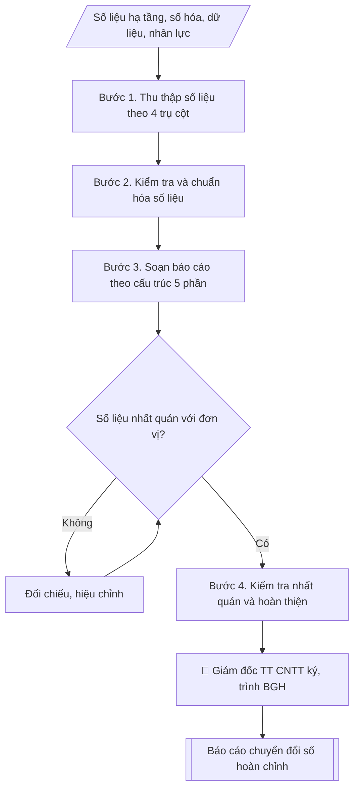

# Báo cáo hiện trạng & kết quả chuyển đổi số

## Kiểm soát áp dụng và phê duyệt

Trước khi chạy quy trình, xác định `ngay_ap_dung`, `loai_hinh_truong`, `quy_che_noi_bo`, `nguon_du_lieu` và `nguoi_kiem_duyet`. Chỉ yêu cầu thông tin có liên quan đến nghiệp vụ; không dùng giá trị giả định thay dữ liệu bắt buộc. Hồ sơ có yếu tố pháp lý phải kèm văn bản gốc, tình trạng hiệu lực, điều khoản áp dụng và chuyển tiếp.

## Giới hạn và human gate

AI hỗ trợ chuẩn bị và đối chiếu. Cán bộ phụ trách kiểm tra dữ liệu/căn cứ, người có thẩm quyền duyệt và ký. Mọi đầu ra mặc định là **DỰ THẢO – CHỜ KIỂM DUYỆT**; không đánh dấu đã ký, đã duyệt hoặc đã công bố nếu chưa có chứng cứ. Dữ liệu sinh viên, sức khỏe, nhân sự và tài chính phải hạn chế theo mục đích, phân quyền và che thông tin định danh khi dùng ví dụ. Không tải dữ liệu lên dịch vụ ngoài khi chưa có quyền. Kiểm tra Luật 91/2025/QH15 về bảo vệ dữ liệu cá nhân (hiệu lực 01/01/2026) và quy định áp dụng trước xử lý/chia sẻ dữ liệu cá nhân.


## Khi nào dùng
Khi cần tổng hợp, đánh giá tiến độ chuyển đổi số của trường để báo cáo Ban Giám hiệu
hoặc cơ quan quản lý (Bộ GD&ĐT, bộ chủ quản).

## Đầu vào (Input)

| Trường | Mô tả | Bắt buộc |
|---|---|---|
| `nam_bao_cao` | Năm báo cáo | Có |
| `so_lieu_ha_tang` | Băng thông, phủ wifi, phòng máy, máy chủ | Có |
| `so_lieu_so_hoa` | Số quy trình đã số hóa / tổng số quy trình; hệ thống đã triển khai (SIS, LMS, tuyển sinh online...) | Có |
| `so_lieu_du_lieu` | Tình trạng kho dữ liệu dùng chung, dashboard quản trị | Có |
| `so_lieu_nhan_luc` | Tỷ lệ CB/GV/SV được tập huấn kỹ năng số | Có |
| `ke_hoach_tham_chieu` | Kế hoạch phát triển CNTT / CĐS để đối chiếu tiến độ | Không |

## Quy trình

**Bước 1. Thu thập số liệu theo 4 trụ cột**
- Làm gì: gửi đề cương thu thập số liệu cho Trung tâm CNTT và các phòng ban theo 4 trụ cột: hạ tầng số (`so_lieu_ha_tang`), số hóa quy trình (`so_lieu_so_hoa`), dữ liệu số (`so_lieu_du_lieu`), nhân lực số (`so_lieu_nhan_luc`); yêu cầu mỗi số liệu kèm minh chứng (log hệ thống, biên bản nghiệm thu, danh sách tập huấn).
- Dùng input: `so_lieu_ha_tang`, `so_lieu_so_hoa`, `so_lieu_du_lieu`, `so_lieu_nhan_luc`.
- Vai trò: Chuyên viên Trung tâm CNTT · AI hỗ trợ: tổng hợp, chuẩn hóa dữ liệu, chuẩn bị hồ sơ trình đầy đủ · ⏱ ~1–2 giờ (ước tính)
- Lưu ý nghiệp vụ: số liệu không có minh chứng được đưa vào diện "chờ xác minh", không đưa vào báo cáo chính thức; chốt thời điểm cắt số liệu (VD: 31/12 của `nam_bao_cao`).
- → Kết quả bước: Bộ số liệu thô 4 trụ cột kèm minh chứng.

**Bước 2. Kiểm tra và chuẩn hóa số liệu**
- Làm gì: đối chiếu số liệu các đơn vị gửi về, phát hiện mâu thuẫn (VD: số quy trình số hóa khác nhau giữa 2 phòng); chuẩn hóa đơn vị tính và công thức tính %; lập danh sách số liệu cần xác minh lại với đơn vị cung cấp.
- Dùng input: bộ số liệu thô (Bước 1).
- Vai trò: Chuyên viên Trung tâm CNTT · AI hỗ trợ: đối chiếu tự động, cảnh báo sai lệch, tính toán, phân tích số liệu · ⏱ ~1–2 giờ (ước tính)
- Lưu ý nghiệp vụ: cùng một chỉ số nhưng 2 đơn vị tính khác công thức là lỗi phổ biến — phải thống nhất công thức trước khi đưa vào báo cáo.
- → Kết quả bước: Bộ số liệu đã chuẩn hóa + danh sách xác minh (nếu có).

**Bước 3. Soạn báo cáo theo cấu trúc 5 phần**
- Làm gì: viết báo cáo 5 phần: 1. Hiện trạng (hạ tầng, hệ thống, dữ liệu, nhân lực — trình bày bằng bảng, chỉ số %); 2. Kết quả nổi bật trong năm (hệ thống mới đưa vào, quy trình mới số hóa); 3. Đối chiếu tiến độ với `ke_hoach_tham_chieu` (hoàn thành/đúng tiến độ/chậm tiến độ từng hạng mục); 4. Khó khăn, tồn tại; 5. Phương hướng năm tiếp theo.
- Dùng input: bộ số liệu đã chuẩn hóa (Bước 2) + `ke_hoach_tham_chieu` + `nam_bao_cao`.
- Vai trò: Chuyên viên Trung tâm CNTT · AI hỗ trợ: soạn dự thảo, đối chiếu tự động, cảnh báo sai lệch · ⏱ ~30–60 phút (ước tính)
- Lưu ý nghiệp vụ: phần đối chiếu tiến độ phải trung thực — hạng mục chậm phải nêu rõ nguyên nhân, không "làm đẹp" số liệu.
- → Kết quả bước: Dự thảo báo cáo 5 phần.

**Bước 4. Kiểm tra nhất quán và hoàn thiện**
- Làm gì: đọc soát: số liệu trong bảng ↔ số liệu trong văn bản phải khớp; tổng các nhóm con khớp tổng chung; kiểm tra thể thức văn bản hành chính (số ký hiệu, nơi nhận); Giám đốc Trung tâm CNTT ký.
- Dùng input: dự thảo báo cáo (Bước 3).
- Vai trò: Giám đốc Trung tâm CNTT (kiểm tra, ký duyệt) · AI hỗ trợ: đối chiếu tự động, cảnh báo sai lệch · ⏱ ~1–2 giờ (ước tính)
- Lưu ý nghiệp vụ: lỗi phổ biến là % trong bảng không khớp với số tuyệt đối — kiểm tra bằng máy tính, không nhẩm.
- → Kết quả bước: Báo cáo chuyển đổi số hoàn chỉnh (sẵn sàng trình Ban Giám hiệu).

## Luồng quy trình (Workflow)



## Đầu ra (Output)
- Báo cáo hiện trạng & kết quả chuyển đổi số hoàn chỉnh.

**Cấu trúc output chuẩn** (khung mẫu cố định của sản phẩm chính — Báo cáo chuyển đổi số):
1. Phần mở đầu hành chính (tên trường, đơn vị, số ký hiệu, ngày tháng).
2. Tên báo cáo + năm báo cáo.
3. Phần I. Hiện trạng (hạ tầng số; số hóa quy trình kèm bảng %; hệ thống đã vận hành; dữ liệu số; nhân lực số).
4. Phần II. Kết quả nổi bật trong năm.
5. Phần III. Đối chiếu tiến độ với kế hoạch (đúng tiến độ / chậm tiến độ + nguyên nhân).
6. Phần IV. Khó khăn, tồn tại.
7. Phần V. Phương hướng năm tiếp theo.
8. Nơi nhận, chữ ký.

## Checklist nghiệm thu

- [ ] Đủ các phần theo "Cấu trúc output chuẩn": Phần mở đầu hành chính (tên trường, đơn vị,…; Tên báo cáo + năm báo cáo.; Phần I. Hiện trạng (hạ tầng số; số hóa quy…; Phần II. Kết quả nổi bật trong năm.; Phần III. Đối chiếu tiến độ với kế hoạch…; Phần IV. Khó khăn, tồn tại.; …
- [ ] Có đầy đủ sản phẩm: Báo cáo hiện trạng & kết quả chuyển đổi số hoàn chỉnh
- [ ] Mọi số liệu, tên, ngày tháng trong output khớp với Input đã cung cấp (không thêm bớt, không suy đoán)
- [ ] Không bịa đặt số liệu, minh chứng, trích dẫn hay căn cứ
- [ ] Đúng thể thức, định dạng văn bản theo quy định hiện hành
- [ ] Căn cứ pháp lý nêu đầy đủ, còn hiệu lực tại thời điểm lập
- [ ] Đã qua Human gate: người có thẩm quyền đã kiểm tra/ký duyệt trước khi phát hành
- [ ] Số liệu không có minh chứng được đưa vào diện "chờ xác minh", không đưa vào báo cáo chính thức
- [ ] Cùng một chỉ số nhưng 2 đơn vị tính khác công thức là lỗi phổ biến — phải thống nhất công thức trước khi đưa vào báo cáo.
- [ ] Phần đối chiếu tiến độ phải trung thực — hạng mục chậm phải nêu rõ nguyên nhân, không "làm đẹp" số liệu.

> Tiêu chí đạt: tất cả các ô đều được đánh dấu.

## Ví dụ mô phỏng (dữ liệu giả lập)

> Tất cả tên trường, cá nhân, số liệu dưới đây đều là **giả lập**, không liên quan tổ chức/cá nhân có thật.

### Input mẫu

| Trường | Giá trị |
|---|---|
| `nam_bao_cao` | 2026 |
| `so_lieu_ha_tang` | LAN 10Gbps phủ 100%; wifi 6 phủ 95% giảng đường; 03 phòng máy chủ |
| `so_lieu_so_hoa` | 32/45 quy trình số hóa (71%); SIS, LMS (60% HP), tuyển sinh online đã vận hành |
| `so_lieu_du_lieu` | Kho dữ liệu dùng chung giai đoạn 1 hoàn thành; 05 dashboard quản trị |
| `so_lieu_nhan_luc` | 85% giảng viên được tập huấn LMS; 100% SV năm nhất tập huấn kỹ năng số |

### Output mẫu

```
TRƯỜNG ĐẠI HỌC A            CỘNG HÒA XÃ HỘI CHỦ NGHĨA VIỆT NAM
TRUNG TÂM CNTT                                Độc lập – Tự do – Hạnh phúc
      Số: 28/BC-ĐHA-CNTT
                                                 Thành phố C, ngày 09 tháng 10 năm 2026

BÁO CÁO
Hiện trạng và kết quả chuyển đổi số năm 2026

I. HIỆN TRẠNG

1. Hạ tầng số
- Mạng LAN 10Gbps phủ 100% khu vực làm việc; wifi 6 phủ 95% giảng đường.
- 03 phòng máy chủ vận hành ổn định, uptime đạt 99,5%.

2. Số hóa quy trình: 32/45 quy trình đã số hóa (đạt 71%), gồm:

| Nhóm quy trình | Đã số hóa | Tổng số | Tỷ lệ |
|---|---|---|---|
| Đào tạo – học vụ | 12 | 15 | 80% |
| Khảo thí | 6 | 8 | 75% |
| Văn thư – hành chính | 8 | 12 | 67% |
| Tài chính – nhân sự | 6 | 10 | 60% |

3. Hệ thống đã vận hành: SIS (quản lý đào tạo), LMS (phủ 60% học phần),
   tuyển sinh trực tuyến toàn trình, văn thư điện tử.
4. Dữ liệu số: kho dữ liệu dùng chung giai đoạn 1 hoàn thành; 05 dashboard
   phục vụ công tác quản trị (tuyển sinh, đào tạo, tài chính, NCKH, CTSV).
5. Nhân lực số: 85% giảng viên được tập huấn sử dụng LMS; 100% sinh viên năm nhất
   được tập huấn kỹ năng số đầu khóa.

II. KẾT QUẢ NỔI BẬT NĂM 2026
- Đưa vào vận hành hệ thống tuyển sinh trực tuyến: 100% hồ sơ nộp online,
  giảm 60% thời gian xử lý.
- LMS phủ thêm 40% học phần so với năm 2025.

III. ĐỐI CHIẾU TIẾN ĐỘ KẾ HOẠCH 2026–2030
- Đúng tiến độ: hạ tầng mạng, tuyển sinh online, kho dữ liệu giai đoạn 1.
- Chậm tiến độ: số hóa quy trình văn thư (đạt 67%, kế hoạch 80%) do thiếu nhân sự.

IV. KHÓ KHĂN, TỒN TẠI
- Kinh phí đầu tư CNTT mới đạt 70% kế hoạch; nhân sự an toàn thông tin còn mỏng.

V. PHƯƠNG HƯỚNG NĂM 2027
- Hoàn thành số hóa 100% quy trình văn thư; LMS phủ 85% học phần.
- Triển khai trung tâm điều hành an toàn thông tin (SOC).

Nơi nhận:                                        GIÁM ĐỐC TRUNG TÂM
- Ban Giám hiệu (báo cáo);                            [CHỜ KÝ]
- Lưu: VT, CNTT.

                                                  TS. Ngô Văn B
```

## Căn cứ & lưu ý
- Kế hoạch phát triển CNTT / chuyển đổi số của Trường Đại học A (giả lập).
- Chương trình chuyển đổi số quốc gia; bộ chỉ số đánh giá chuyển đổi số (tham khảo).
- Số liệu phải có thể kiểm chứng (log hệ thống, biên bản nghiệm thu, danh sách tập huấn).
- Không dùng tên thật của trường/cá nhân khi mô phỏng.

## Quản trị phiên bản

- Phiên bản gói: `1.1.0`; ngày cập nhật: `2026-10-09`.
- Kho nguồn: https://github.com/phamtruong91/dh-skills
- Người duy trì trên GitHub: `phamtruong91` (Phạm Văn Trường). Người phê duyệt nghiệp vụ: **chưa chỉ định**.
- Commit nguồn trước cập nhật: `78fd1d51b8acd1a724d9b9af6c488460bc7551ad`. Commit chứa phiên bản này xem bằng `git log -1 -- skills/bao-cao-chuyen-doi-so`; không tự gán SHA chưa tạo.
- Giấy phép: theo LICENSE của kho; bản quyền CES Global.
- Lịch sử 1.1.0: bổ sung metadata giao diện, kiểm soát áp dụng, quản trị phiên bản.
- Trạng thái: dự thảo nghiệp vụ; kiểm tra pháp lý trước thực thi. Ngày cập nhật không đồng nghĩa mọi văn bản đã được rà soát toàn văn.
