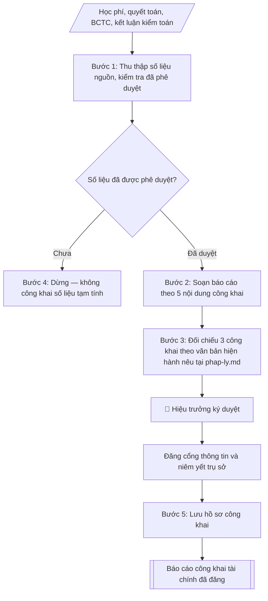

# Soạn báo cáo công khai tài chính

## Định dạng và file đầu ra
Định dạng đầu ra có thể chọn theo sản phẩm/yêu cầu: .docx, .pdf. Đọc mục “Định dạng bổ sung” trong quy cách đầu ra trước khi chọn.

**Phải tạo file thực tế để tải xuống, không chỉ trả nội dung trong chat.** Định dạng mặc định của skill: **.docx**. Nếu có bảng số liệu nghiệp vụ yêu cầu file bảng tính riêng, tạo thêm Excel theo yêu cầu; không tự tạo file kiểm tra. Không chờ người dùng yêu cầu xuất file lần nữa. Ưu tiên định dạng người dùng chỉ định; đọc quy tắc xuất file tại references/quy-cach-dau-ra.md.

## Quy cách đầu ra và thông tin thiếu
Khi dựng file Word/Excel, áp dụng mục “Thể thức và bảng biểu khi dựng file” trong quy cách đầu ra (cỡ chữ từng thành phần, bảng nhiều trang, số trang, phụ lục). Đọc [quy cách và cấu trúc sản phẩm](references/quy-cach-dau-ra.md) trước khi soạn/xuất. File giao chỉ gồm sản phẩm nghiệp vụ được yêu cầu; kiểm tra nội bộ không xuất kèm. Thiếu thông tin thì giữ nguyên trường/mục và chỗ điền theo mẫu gốc (dòng dấu chấm, dấu gạch hoặc ô trống); không tự điền dữ liệu mẫu, số 0, mã chờ xác minh hay dòng chờ ký. Mẫu chuyên ngành còn áp dụng được ưu tiên về cấu trúc, mã biểu và người ký. Bản đầy đủ: [quy tắc chung](references/quy-tac-chung.md).

Khi người dùng yêu cầu bộ slide (.pptx), đọc mục “Xuất PowerPoint (.pptx) khi được yêu cầu” trong quy cách đầu ra.

Khi báo cáo có số liệu cần so sánh hoặc nêu xu hướng, đọc mục “Biểu đồ và hình trong báo cáo số liệu” trong quy cách đầu ra trước khi vẽ.

## Kiểm soát áp dụng và phê duyệt
Trước khi chạy, xác định `ngay_ap_dung`, `loai_hinh_truong`, `quy_che_noi_bo`, `nguon_du_lieu`, `nguoi_kiem_duyet`; chỉ hỏi thông tin liên quan nghiệp vụ, không dùng giá trị giả định thay dữ liệu bắt buộc. Đối chiếu căn cứ pháp lý với văn bản gốc, hiệu lực, điều khoản áp dụng và chuyển tiếp. Bản đầy đủ: [quy tắc chung](references/quy-tac-chung.md).

Nếu có cập nhật pháp lý dưới đây, đọc [căn cứ và điều kiện áp dụng](references/phap-ly.md) trước khi làm. Quy trình dưới đây giữ nghiệp vụ từ bản gốc; mọi viện dẫn văn bản, mẫu biểu, điều khoản phải theo căn cứ đã chọn trong phap-ly.md, không theo văn bản cũ.

## Giới hạn và human gate
AI hỗ trợ chuẩn bị và đối chiếu; cán bộ phụ trách kiểm tra dữ liệu/căn cứ, người có thẩm quyền duyệt và ký. Không đánh dấu đã ký, đã duyệt, đã công bố khi chưa có chứng cứ. Dữ liệu sinh viên, sức khỏe, nhân sự, tài chính chỉ dùng theo mục đích và phân quyền, che thông tin định danh khi dùng ví dụ (Luật 91/2025/QH15, hiệu lực 01/01/2026); không tải dữ liệu lên dịch vụ ngoài khi chưa có quyền. Bản đầy đủ: [quy tắc chung](references/quy-tac-chung.md).

## Khi nào dùng
Khi thực hiện nghĩa vụ công khai tài chính của cơ sở giáo dục đại học: công bố mức thu học
phí các ngành, tổng thu – chi ngân sách, các khoản chi cho người học (học bổng, hỗ trợ sinh
viên), kết quả kiểm toán, theo hình thức công khai quy định.

## Đầu vào (Input)
| Trường | Mô tả | Bắt buộc |
|---|---|---|
| `nam_hoc` | Năm học công khai (khi công khai theo năm học) | Có (một trong hai) |
| `nam_tai_chinh` | Năm tài chính công khai (khi công khai theo năm tài chính) | Có (một trong hai) |
| `hoc_phi_cac_nganh` | Bảng học phí theo từng ngành/khối ngành đào tạo | Có |
| `tong_thu_chi` | Tổng thu, tổng chi ngân sách năm (theo số liệu quyết toán/BCTC) | Có |
| `chi_cho_nguoi_hoc` | Học bổng khuyến khích học tập, hỗ trợ sinh viên khó khăn, miễn giảm học phí... | Có |
| `ket_qua_kiem_toan` | Kết luận kiểm toán (đơn vị kiểm toán, ý kiến kiểm toán, kiến nghị chính) | Không |
| `hinh_thuc_cong_khai` | Cổng thông tin điện tử / niêm yết tại trụ sở / hội nghị CBVC... | Có |
| `thoi_gian_cong_khai` | Thời gian thực hiện công khai | Có |
| `nguoi_ky` | Hiệu trưởng | Có |

## Quy trình
**Ràng buộc pháp lý khi thực hiện** (trích references/phap-ly.md; đối chiếu toàn văn và hiệu lực tại ngày nghiệp vụ):
- Thông tư 09/2024/TT-BGDĐT, hiệu lực 19/07/2024, thay 36/2017: Chuyển từ mẫu ba công khai cũ sang nội dung công khai và báo cáo thường niên theo 09/2024. Đối chiếu phần thông tin chung, phần giáo dục đại học và phụ lục báo cáo thường niên; lưu nội dung trên website tối thiểu 5 năm. Ghi thời điểm, đường dẫn công bố, người duyệt và bằng chứng cập nhật. Không tự thêm số liệu hoặc tự công bố; không coi báo cáo gửi cơ quan quản lý là nghĩa vụ định kỳ nếu không có căn cứ/yêu cầu bằng văn bản.
- Nghị định 238/2025/NĐ-CP, hiệu lực 03/09/2025: Yêu cầu năm học, trình độ, ngành, loại hình trường, mức tự chủ, quyết định học phí được duyệt và đối tượng miễn/giảm/hỗ trợ. Đối chiếu 238/2025 và chuyển tiếp; không lấy mức trần, tỷ lệ tăng hoặc đối tượng từ 81/2021/97/2023 làm mặc định hiện hành. Chỉ tính khi đủ căn cứ và dữ liệu từng người học.
- Trước Bước 1: chọn căn cứ theo đối tượng, loại hình trường và chuyển tiếp; lập bảng văn bản / điều khoản / lý do áp dụng / bằng chứng. Thiếu văn bản gốc hoặc điều khoản thì ghi nhận nội bộ [CẦN XÁC MINH] (không đưa vào file giao), để trống phần tương ứng, chưa kết luận tuân thủ.
- Các con số, thời hạn, số điều, số mức xếp loại, hệ số và mẫu biểu nêu trong các bước dưới đây được giữ từ quy trình gốc (trước cập nhật pháp lý); chỉ dùng khi đã đối chiếu đúng với căn cứ đã chọn, khác thì theo căn cứ. Danh sách điểm cần đối chiếu: docs/DIEM_CAN_DOI_CHIEU_PHAP_LY.md.

**Bước 1. Thu thập số liệu nguồn và kiểm tra tính phê duyệt**
- Làm gì: lấy mức học phí các ngành từ thông báo mức thu đã ban hành (`hoc_phi_cac_nganh`);
  lấy tổng thu – chi từ báo cáo quyết toán / báo cáo tài chính đã được phê duyệt
  (`tong_thu_chi`); lấy chi cho người học từ sổ kế toán và các quyết định cấp học bổng,
  miễn giảm (`chi_cho_nguoi_hoc`); lấy kết luận kiểm toán từ báo cáo kiểm toán gần nhất
  (`ket_qua_kiem_toan`). Với mỗi nguồn số liệu, xác nhận đã có phê duyệt của cấp có
  thẩm quyền.
- Dùng input: `hoc_phi_cac_nganh`, `tong_thu_chi`, `chi_cho_nguoi_hoc`, `ket_qua_kiem_toan`,
  `nam_hoc` / `nam_tai_chinh`.
- Vai trò: Chuyên viên Phòng TCKT · AI hỗ trợ: tổng hợp, chuẩn hóa dữ liệu, đối chiếu tự động, cảnh báo sai lệch · ⏱ ~1–3 giờ (ước tính)
- Lưu ý nghiệp vụ: chỉ công khai số liệu đã được phê duyệt — tuyệt đối không dùng số liệu
  tạm tính hay số liệu nội bộ chưa duyệt; ghi lại nguồn và văn bản phê duyệt của từng số
  liệu để đối chiếu khi bị chất vấn.
- → Kết quả bước: bảng số liệu nguồn đã kiểm tra phê duyệt (từng chỉ tiêu + văn bản phê
  duyệt tương ứng).

**Bước 2. Soạn báo cáo theo 5 nội dung công khai**
- Làm gì: viết báo cáo gồm đúng 5 nội dung: (1) mức thu học phí và các khoản thu khác của
  từng ngành đào tạo (dạng bảng); (2) tổng thu – chi ngân sách năm ở mức tổng hợp, không đi
  sâu chi tiết nhạy cảm; (3) các khoản chi cho người học: học bổng, hỗ trợ, miễn giảm
  (kèm số suất/số sinh viên); (4) kết quả kiểm toán (đơn vị kiểm toán, ý kiến kiểm toán,
  kiến nghị chính và tình trạng khắc phục); (5) hình thức và thời gian công khai
  (`hinh_thuc_cong_khai`, `thoi_gian_cong_khai`).
- Dùng input: kết quả Bước 1, `hinh_thuc_cong_khai`, `thoi_gian_cong_khai`.
- Vai trò: Chuyên viên Phòng TCKT · AI hỗ trợ: soạn dự thảo, tổng hợp, chuẩn hóa dữ liệu · ⏱ ~30–60 phút (ước tính)
- Lưu ý nghiệp vụ: nội dung (2) chỉ công khai ở mức tổng hợp; nội dung (4) nếu ý kiến kiểm
  toán không phải chấp nhận toàn phần thì phải trình bày trung thực kèm kế hoạch khắc phục.
- → Kết quả bước: dự thảo báo cáo công khai tài chính (đủ 5 nội dung).

**Bước 3. Đối chiếu với 3 công khai theo văn bản hiện hành nêu tại phap-ly.md**
- Làm gì: đối chiếu nội dung tài chính trong dự thảo với hai nội dung công khai còn lại
  (công khai chất lượng đào tạo; công khai đội ngũ, cơ sở vật chất) sẽ đăng đồng bộ: số
  liệu học phí, quy mô sinh viên, số suất học bổng phải nhất quán giữa các báo cáo.
- Dùng input: dự thảo Bước 2.
- Vai trò: Chuyên viên Phòng TCKT · AI hỗ trợ: soạn dự thảo, đối chiếu tự động, cảnh báo sai lệch · ⏱ ~1–2 giờ (ước tính)
- Lưu ý nghiệp vụ: mâu thuẫn số liệu giữa các báo cáo công khai là lỗi dễ bị thanh tra
  phát hiện nhất — kiểm tra chéo từng con số chung.
- → Kết quả bước: dự thảo báo cáo đã đối chiếu, nhất quán với 2 nội dung công khai còn lại.

**Bước 4. Trình ký và đăng công khai**
- Làm gì: trình Hiệu trưởng (`nguoi_ky`) ký duyệt; đăng tải trên cổng thông tin điện tử của
  trường tại chuyên mục công khai; đồng thời niêm yết bản giấy tại trụ sở theo quy định.
- Dùng input: `nguoi_ky`, kết quả Bước 3.
- Vai trò: Chuyên viên Phòng TCKT (chuẩn bị hồ sơ trình); Hiệu trưởng (người ký) ban hành · AI hỗ trợ: chuẩn bị hồ sơ trình đầy đủ, chuẩn bị bản phát hành · ⏱ ~1–3 giờ (ước tính)
- Lưu ý nghiệp vụ: thời hạn công khai thực hiện vào đầu năm học và duy trì trong suốt năm
  học — ghi rõ thời gian bắt đầu công khai trong báo cáo.
- → Kết quả bước: báo cáo công khai tài chính đã ký và đăng tải.

**Bước 5. Lưu hồ sơ công khai**
- Làm gì: lưu bản báo cáo đã đăng, ảnh chụp màn hình trang đăng tải, biên bản/ảnh niêm yết
  tại trụ sở; lưu theo hồ sơ để phục vụ thanh tra, kiểm tra của cơ quan quản lý.
- Dùng input: kết quả Bước 4.
- Vai trò: Chuyên viên Phòng TCKT · AI hỗ trợ: đối chiếu tự động, cảnh báo sai lệch, chuẩn bị bản phát hành · ⏱ ~1–2 giờ (ước tính)
- Lưu ý nghiệp vụ: bằng chứng đăng tải (screenshot có ngày) là căn cứ chứng minh đã thực
  hiện nghĩa vụ công khai đúng hạn.
- → Kết quả bước: hồ sơ lưu trữ công khai đầy đủ bằng chứng.

## Luồng quy trình (Workflow)

## Đầu ra
- Báo cáo công khai tài chính hoàn chỉnh, sẵn sàng đăng cổng thông tin.
- Bảng học phí các ngành + bảng tổng hợp thu – chi + bảng chi cho người học.

File nghiệp vụ thực tế theo định dạng mặc định ở đầu skill hoặc định dạng người dùng yêu cầu, kèm liên kết tải trong phản hồi cuối.

Sản phẩm nghiệp vụ hoàn chỉnh theo [quy cách và cấu trúc](references/quy-cach-dau-ra.md), giữ các trường chưa có dữ liệu ở trạng thái trống. Không xuất kèm checklist/phụ lục kiểm tra đầu ra.

## Kiểm tra nội bộ trước khi giao
Các tiêu chí sau dùng để tự đối chiếu; không sao chép vào file xuất. Mục thiếu dữ liệu được để trống, không đánh dấu đã đạt hoặc đã duyệt.

- [ ] Đủ các phần và đúng bố cục theo cấu trúc tại references/quy-cach-dau-ra.md (không theo cấu trúc của bản gốc).
- [ ] Có đầy đủ sản phẩm: Báo cáo công khai tài chính hoàn chỉnh, sẵn sàng đăng cổng thông tin
- [ ] Có đầy đủ sản phẩm: Bảng học phí các ngành + bảng tổng hợp thu – chi + bảng chi cho người học
- [ ] Mọi số liệu, tên, ngày tháng trong output khớp với Input đã cung cấp (không thêm bớt, không suy đoán)
- [ ] Không bịa đặt số liệu, minh chứng, trích dẫn hay căn cứ
- [ ] Đúng thể thức, định dạng văn bản theo quy định hiện hành
- [ ] Căn cứ pháp lý nêu đầy đủ, còn hiệu lực tại thời điểm lập
- [ ] Đã qua Human gate: người có thẩm quyền đã kiểm tra/ký duyệt trước khi phát hành
- [ ] Chỉ công khai số liệu đã được phê duyệt — tuyệt đối không dùng số liệu
- [ ] Nội dung (2) chỉ công khai ở mức tổng hợp

## Căn cứ & lưu ý
- Căn cứ hiện hành: xem [căn cứ và điều kiện áp dụng](references/phap-ly.md); phải đối chiếu văn bản gốc, hiệu lực và chuyển tiếp tại ngày nghiệp vụ.
- Nghị định 81/2021/NĐ-CP và Nghị định 97/2023/NĐ-CP về cơ chế thu, quản lý học phí.
- Chỉ công khai số liệu đã được cấp có thẩm quyền phê duyệt (quyết toán, BCTC, kết luận
  kiểm toán); không công khai số liệu tạm tính, số liệu nội bộ chưa duyệt.
- Thời hạn công khai: thực hiện vào đầu năm học và duy trì công khai trong suốt năm học.
- Không dùng tên thật của trường/cá nhân khi mô phỏng.

## Tư liệu đối chiếu
Bản gốc trước cập nhật pháp lý (kèm ví dụ giả lập) lưu tại `references/quy-trinh-lich-su.md`, chỉ để đối chiếu hồ sơ lịch sử; không dùng căn cứ, mẫu hay số liệu trong đó làm chỉ dẫn hiện hành.

## Quản trị phiên bản
- Phiên bản gói `1.3.2` (cập nhật 2026-10-10); hồ sơ đầy đủ tại [references/version.json](references/version.json).
- Người phê duyệt nghiệp vụ: **chưa chỉ định**. Trạng thái: dự thảo nghiệp vụ; kiểm tra pháp lý trước thực thi. Ngày cập nhật không đồng nghĩa mọi văn bản đã được rà soát toàn văn.
- Giấy phép theo LICENSE của kho (bản quyền CES Global). Lịch sử thay đổi: CHANGELOG.md.
