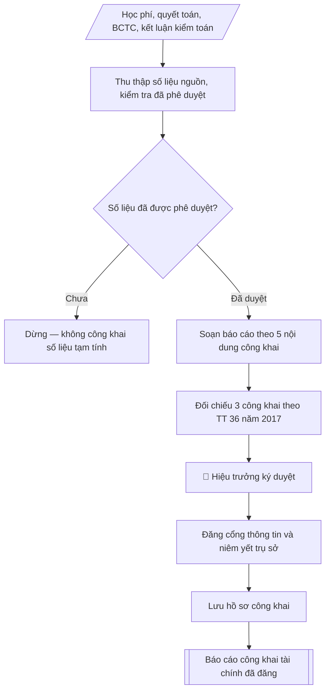

# Skill: Soạn báo cáo công khai tài chính

## Khi nào dùng
Khi thực hiện nghĩa vụ công khai tài chính của cơ sở giáo dục đại học: công bố mức thu học
phí các ngành, tổng thu – chi ngân sách, các khoản chi cho người học (học bổng, hỗ trợ sinh
viên), kết quả kiểm toán, theo hình thức công khai quy định.

## Đầu vào (Input)

| Trường | Mô tả | Bắt buộc |
|---|---|---|
| `nam_hoc` / `nam_tai_chinh` | Năm học / năm tài chính công khai | Có |
| `hoc_phi_cac_nganh` | Bảng học phí theo từng ngành/khối ngành đào tạo | Có |
| `tong_thu_chi` | Tổng thu, tổng chi ngân sách năm (theo số liệu quyết toán/BCTC) | Có |
| `chi_cho_nguoi_hoc` | Học bổng khuyến khích học tập, hỗ trợ sinh viên khó khăn, miễn giảm học phí... | Có |
| `ket_qua_kiem_toan` | Kết luận kiểm toán (đơn vị kiểm toán, ý kiến kiểm toán, kiến nghị chính) | Không |
| `hinh_thuc_cong_khai` | Cổng thông tin điện tử / niêm yết tại trụ sở / hội nghị CBVC... | Có |
| `thoi_gian_cong_khai` | Thời gian thực hiện công khai | Có |
| `nguoi_ky` | Hiệu trưởng | Có |

## Quy trình

**Bước 1. Thu thập số liệu nguồn và kiểm tra tính phê duyệt**
- Làm gì: lấy mức học phí các ngành từ thông báo mức thu đã ban hành (`hoc_phi_cac_nganh`);
  lấy tổng thu – chi từ báo cáo quyết toán / báo cáo tài chính đã được phê duyệt
  (`tong_thu_chi`); lấy chi cho người học từ sổ kế toán và các quyết định cấp học bổng,
  miễn giảm (`chi_cho_nguoi_hoc`); lấy kết luận kiểm toán từ báo cáo kiểm toán gần nhất
  (`ket_qua_kiem_toan`). Với mỗi nguồn số liệu, xác nhận đã có phê duyệt của cấp có
  thẩm quyền.
- Dùng input: `hoc_phi_cac_nganh`, `tong_thu_chi`, `chi_cho_nguoi_hoc`, `ket_qua_kiem_toan`,
  `nam_hoc` / `nam_tai_chinh`.
- Vai trò: Chuyên viên Phòng TCKT · AI hỗ trợ: tổng hợp, chuẩn hóa dữ liệu, đối chiếu tự động, cảnh báo sai lệch · ⏱ ~1–3 giờ (ước tính)
- Lưu ý nghiệp vụ: chỉ công khai số liệu đã được phê duyệt — tuyệt đối không dùng số liệu
  tạm tính hay số liệu nội bộ chưa duyệt; ghi lại nguồn và văn bản phê duyệt của từng số
  liệu để đối chiếu khi bị chất vấn.
- → Kết quả bước: bảng số liệu nguồn đã kiểm tra phê duyệt (từng chỉ tiêu + văn bản phê
  duyệt tương ứng).

**Bước 2. Soạn báo cáo theo 5 nội dung công khai**
- Làm gì: viết báo cáo gồm đúng 5 nội dung: (1) mức thu học phí và các khoản thu khác của
  từng ngành đào tạo (dạng bảng); (2) tổng thu – chi ngân sách năm ở mức tổng hợp, không đi
  sâu chi tiết nhạy cảm; (3) các khoản chi cho người học: học bổng, hỗ trợ, miễn giảm
  (kèm số suất/số sinh viên); (4) kết quả kiểm toán (đơn vị kiểm toán, ý kiến kiểm toán,
  kiến nghị chính và tình trạng khắc phục); (5) hình thức và thời gian công khai
  (`hinh_thuc_cong_khai`, `thoi_gian_cong_khai`).
- Dùng input: kết quả Bước 1, `hinh_thuc_cong_khai`, `thoi_gian_cong_khai`.
- Vai trò: Chuyên viên Phòng TCKT · AI hỗ trợ: soạn dự thảo, tổng hợp, chuẩn hóa dữ liệu · ⏱ ~30–60 phút (ước tính)
- Lưu ý nghiệp vụ: nội dung (2) chỉ công khai ở mức tổng hợp; nội dung (4) nếu ý kiến kiểm
  toán không phải chấp nhận toàn phần thì phải trình bày trung thực kèm kế hoạch khắc phục.
- → Kết quả bước: dự thảo báo cáo công khai tài chính (đủ 5 nội dung).

**Bước 3. Đối chiếu với 3 công khai theo Thông tư 36/2017/TT-BGDĐT**
- Làm gì: đối chiếu nội dung tài chính trong dự thảo với hai nội dung công khai còn lại
  (công khai chất lượng đào tạo; công khai đội ngũ, cơ sở vật chất) sẽ đăng đồng bộ: số
  liệu học phí, quy mô sinh viên, số suất học bổng phải nhất quán giữa các báo cáo.
- Dùng input: dự thảo Bước 2.
- Vai trò: Chuyên viên Phòng TCKT · AI hỗ trợ: soạn dự thảo, đối chiếu tự động, cảnh báo sai lệch · ⏱ ~1–2 giờ (ước tính)
- Lưu ý nghiệp vụ: mâu thuẫn số liệu giữa các báo cáo công khai là lỗi dễ bị thanh tra
  phát hiện nhất — kiểm tra chéo từng con số chung.
- → Kết quả bước: dự thảo báo cáo đã đối chiếu, nhất quán với 2 nội dung công khai còn lại.

**Bước 4. Trình ký và đăng công khai**
- Làm gì: trình Hiệu trưởng (`nguoi_ky`) ký duyệt; đăng tải trên cổng thông tin điện tử của
  trường tại chuyên mục công khai; đồng thời niêm yết bản giấy tại trụ sở theo quy định.
- Dùng input: `nguoi_ky`, kết quả Bước 3.
- Vai trò: Chuyên viên Phòng TCKT (chuẩn bị hồ sơ trình); Hiệu trưởng (người ký) ban hành · AI hỗ trợ: chuẩn bị hồ sơ trình đầy đủ, chuẩn bị bản phát hành · ⏱ ~1–3 giờ (ước tính)
- Lưu ý nghiệp vụ: thời hạn công khai thực hiện vào đầu năm học và duy trì trong suốt năm
  học — ghi rõ thời gian bắt đầu công khai trong báo cáo.
- → Kết quả bước: báo cáo công khai tài chính đã ký và đăng tải.

**Bước 5. Lưu hồ sơ công khai**
- Làm gì: lưu bản báo cáo đã đăng, ảnh chụp màn hình trang đăng tải, biên bản/ảnh niêm yết
  tại trụ sở; lưu theo hồ sơ để phục vụ thanh tra, kiểm tra của cơ quan quản lý.
- Dùng input: kết quả Bước 4.
- Vai trò: Chuyên viên Phòng TCKT · AI hỗ trợ: đối chiếu tự động, cảnh báo sai lệch, chuẩn bị bản phát hành · ⏱ ~1–2 giờ (ước tính)
- Lưu ý nghiệp vụ: bằng chứng đăng tải (screenshot có ngày) là căn cứ chứng minh đã thực
  hiện nghĩa vụ công khai đúng hạn.
- → Kết quả bước: hồ sơ lưu trữ công khai đầy đủ bằng chứng.

## Luồng quy trình (Workflow)



## Đầu ra (Output)
- Báo cáo công khai tài chính hoàn chỉnh, sẵn sàng đăng cổng thông tin.
- Bảng học phí các ngành + bảng tổng hợp thu – chi + bảng chi cho người học.

**Cấu trúc output chuẩn:** khung mẫu cố định của báo cáo công khai tài chính, các phần
theo đúng thứ tự xuất hiện:
1. Tiêu đề văn bản (tên đơn vị, số ký hiệu, địa danh ngày tháng, tên báo cáo, năm học /
   năm tài chính, căn cứ Thông tư 36/2017/TT-BGDĐT);
2. Nội dung 1: Mức thu học phí các ngành (bảng: khối ngành, đồng/tín chỉ, đồng/năm;
   ghi chú các khoản thu khác);
3. Nội dung 2: Tổng thu – chi ngân sách năm (bảng tổng hợp: tổng thu, tổng chi, chênh lệch);
4. Nội dung 3: Các khoản chi cho người học (bảng: nội dung, số tiền, số suất/số sinh viên;
   dòng tổng cộng);
5. Nội dung 4: Kết quả kiểm toán (đơn vị kiểm toán, ý kiến kiểm toán, kiến nghị và tình
   trạng khắc phục);
6. Nội dung 5: Hình thức và thời gian công khai;
7. Thông tin liên hệ giải đáp (đơn vị đầu mối);
8. Nơi nhận – chữ ký Hiệu trưởng (ghi rõ họ tên).

## Checklist nghiệm thu

- [ ] Đủ các phần theo "Cấu trúc output chuẩn": Tiêu đề văn bản (tên đơn vị, số ký hiệu, địa…; Nội dung 1; Nội dung 2; Nội dung 3; Nội dung 4; Nội dung 5; …
- [ ] Có đầy đủ sản phẩm: Báo cáo công khai tài chính hoàn chỉnh, sẵn sàng đăng cổng thông tin
- [ ] Có đầy đủ sản phẩm: Bảng học phí các ngành + bảng tổng hợp thu – chi + bảng chi cho người học
- [ ] Mọi số liệu, tên, ngày tháng trong output khớp với Input đã cung cấp (không thêm bớt, không suy đoán)
- [ ] Không bịa đặt số liệu, minh chứng, trích dẫn hay căn cứ
- [ ] Đúng thể thức, định dạng văn bản theo quy định hiện hành
- [ ] Căn cứ pháp lý nêu đầy đủ, còn hiệu lực tại thời điểm lập
- [ ] Đã qua Human gate: người có thẩm quyền đã kiểm tra/ký duyệt trước khi phát hành
- [ ] Chỉ công khai số liệu đã được phê duyệt — tuyệt đối không dùng số liệu
- [ ] Nội dung (2) chỉ công khai ở mức tổng hợp

> Tiêu chí đạt: tất cả các ô đều được đánh dấu.

## Ví dụ mô phỏng (dữ liệu giả lập)

> Tất cả tên trường, cá nhân, số liệu dưới đây đều là **giả lập**, không liên quan tổ chức/cá nhân có thật.

### Input mẫu

| Trường | Giá trị |
|---|---|
| `nam_hoc` / `nam_tai_chinh` | Năm học 2026–2027 / Năm tài chính 2026 |
| `hoc_phi_cac_nganh` | Xem bảng 1 Output mẫu |
| `tong_thu_chi` | Tổng thu 171.500 triệu đồng; tổng chi 169.800 triệu đồng |
| `chi_cho_nguoi_hoc` | Học bổng KKHT 7.200; hỗ trợ SV khó khăn 1.800; miễn giảm học phí 2.400 (triệu đồng) |
| `ket_qua_kiem_toan` | Kiểm toán độc lập năm 2025: ý kiến chấp nhận toàn phần; 02 kiến nghị về quản lý công nợ đã khắc phục xong |
| `hinh_thuc_cong_khai` | Cổng thông tin điện tử của Trường (chuyên mục Ba công khai) + niêm yết tại trụ sở chính |
| `thoi_gian_cong_khai` | Từ ngày 15/10/2026 |
| `nguoi_ky` | Hiệu trưởng |

### Output mẫu

```
TRƯỜNG ĐẠI HỌC A             CỘNG HÒA XÃ HỘI CHỦ NGHĨA VIỆT NAM
PHÒNG TÀI CHÍNH – KẾ TOÁN                 Độc lập – Tự do – Hạnh phúc
      Số: 92/BC-ĐHA-TCKT
                                                 Thành phố C, ngày 09 tháng 10 năm 2026

BÁO CÁO CÔNG KHAI TÀI CHÍNH
Năm học 2026–2027 (năm tài chính 2026)

Thực hiện Thông tư số 36/2017/TT-BGDĐT ngày 28/12/2017 của Bộ Giáo dục và Đào tạo
quy định thực hiện công khai trong hoạt động của các cơ sở giáo dục, Trường Đại học
A công khai tài chính như sau:

1. Mức thu học phí năm học 2026–2027 (hệ chính quy)

| TT | Khối ngành | Mức thu (đồng/tín chỉ) | Mức bình quân (đồng/năm) |
|----|-----------|------------------------|--------------------------|
| 1 | Kỹ thuật | 580.000 | 17.400.000 |
| 2 | Kinh tế | 480.000 | 14.400.000 |
| 3 | Xã hội | 430.000 | 12.900.000 |

(Các khoản thu khác: lệ phí nhập học 200.000 đồng/SV; lệ phí thi lại 150.000 đồng/học phần.)

2. Tổng thu – chi ngân sách năm tài chính 2026 (đơn vị: triệu đồng)

| Chỉ tiêu | Số tiền |
|---|---:|
| Tổng thu | 171.500 |
| Tổng chi | 169.800 |
| Chênh lệch thu – chi | +1.700 |

3. Các khoản chi cho người học năm 2026 (đơn vị: triệu đồng)

| Nội dung | Số tiền | Ghi chú |
|---|---|---|
| Học bổng khuyến khích học tập | 7.200 | 1.850 suất |
| Hỗ trợ sinh viên có hoàn cảnh khó khăn | 1.800 | 620 sinh viên |
| Miễn, giảm học phí theo quy định | 2.400 | 410 sinh viên |
| **Tổng cộng** | **11.400** | |

4. Kết quả kiểm toán
- Đơn vị kiểm toán độc lập đã kiểm toán báo cáo tài chính năm 2025 của Trường,
  đưa ra ý kiến **chấp nhận toàn phần**.
- 02 kiến nghị về quản lý, đối chiếu công nợ phải thu đã được Trường khắc phục
  hoàn toàn trong quý I/2026.

5. Hình thức và thời gian công khai
- Đăng tải trên cổng thông tin điện tử của Trường tại chuyên mục "Ba công khai";
- Niêm yết bản giấy tại trụ sở chính của Trường;
- Thời gian công khai: từ ngày 15/10/2026, duy trì trong suốt năm học 2026–2027.

Mọi thắc mắc liên quan đến nội dung công khai, đề nghị liên hệ Phòng Tài chính –
Kế toán, Trường Đại học A./.

Nơi nhận:                                          HIỆU TRƯỞNG
- Cổng thông tin điện tử Trường (đăng tải);            (đã ký)
- Niêm yết tại trụ sở chính;
- Lưu: VT, TCKT.

                                         PGS.TS. Trần Văn D
```

## Căn cứ & lưu ý
- Thông tư 36/2017/TT-BGDĐT ngày 28/12/2017 của Bộ GD&ĐT quy định thực hiện công khai
  đối với cơ sở giáo dục (3 công khai: chất lượng đào tạo; đội ngũ, cơ sở vật chất; tài chính).
- Nghị định 81/2021/NĐ-CP và Nghị định 97/2023/NĐ-CP về cơ chế thu, quản lý học phí.
- Chỉ công khai số liệu đã được cấp có thẩm quyền phê duyệt (quyết toán, BCTC, kết luận
  kiểm toán); không công khai số liệu tạm tính, số liệu nội bộ chưa duyệt.
- Thời hạn công khai: thực hiện vào đầu năm học và duy trì công khai trong suốt năm học.
- Không dùng tên thật của trường/cá nhân khi mô phỏng.
