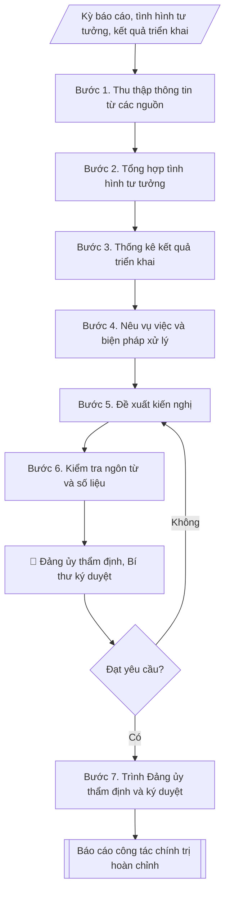

# Soạn báo cáo công tác chính trị

## Định dạng và file đầu ra

Định dạng đầu ra có thể chọn theo sản phẩm/yêu cầu: .docx, .pdf. Đọc mục “Định dạng bổ sung” trong quy cách đầu ra trước khi chọn.

**Phải tạo file thực tế để tải xuống, không chỉ trả nội dung trong chat.** Định dạng mặc định của skill: **.docx**. Nếu có bảng số liệu nghiệp vụ yêu cầu file bảng tính riêng, tạo thêm Excel theo yêu cầu; không tự tạo file kiểm tra. Không chờ người dùng yêu cầu xuất file lần nữa. Ưu tiên định dạng người dùng chỉ định; đọc quy tắc xuất file tại references/quy-cach-dau-ra.md.

## Quy cách đầu ra và thông tin thiếu
Đọc [quy cách và cấu trúc sản phẩm](references/quy-cach-dau-ra.md) trước khi soạn/xuất. File giao chỉ gồm sản phẩm nghiệp vụ được yêu cầu; kiểm tra nội bộ không xuất kèm. Thiếu thông tin thì giữ nguyên trường/mục và chỗ điền theo mẫu gốc (dòng dấu chấm, dấu gạch hoặc ô trống); không tự điền dữ liệu mẫu, số 0, mã chờ xác minh hay dòng chờ ký. Mẫu chuyên ngành còn áp dụng được ưu tiên về cấu trúc, mã biểu và người ký. Bản đầy đủ: [quy tắc chung](references/quy-tac-chung.md).

## Kiểm soát áp dụng và phê duyệt
Trước khi chạy, xác định `ngay_ap_dung`, `loai_hinh_truong`, `quy_che_noi_bo`, `nguon_du_lieu`, `nguoi_kiem_duyet`; chỉ hỏi thông tin liên quan nghiệp vụ, không dùng giá trị giả định thay dữ liệu bắt buộc. Đối chiếu căn cứ pháp lý với văn bản gốc, hiệu lực, điều khoản áp dụng và chuyển tiếp. Bản đầy đủ: [quy tắc chung](references/quy-tac-chung.md).

## Giới hạn và human gate
AI hỗ trợ chuẩn bị và đối chiếu; cán bộ phụ trách kiểm tra dữ liệu/căn cứ, người có thẩm quyền duyệt và ký. Không đánh dấu đã ký, đã duyệt, đã công bố khi chưa có chứng cứ. Dữ liệu sinh viên, sức khỏe, nhân sự, tài chính chỉ dùng theo mục đích và phân quyền, che thông tin định danh khi dùng ví dụ (Luật 91/2025/QH15, hiệu lực 01/01/2026); không tải dữ liệu lên dịch vụ ngoài khi chưa có quyền. Bản đầy đủ: [quy tắc chung](references/quy-tac-chung.md).

## Khi nào dùng
Khi đơn vị phụ trách công tác chính trị cần báo cáo định kỳ (quý, năm học) hoặc sau đợt
sinh hoạt chính trị, gửi Đảng ủy trường và Đảng ủy cấp trên.

## Đầu vào (Input)

| Trường | Mô tả | Bắt buộc |
|---|---|---|
| `ky_bao_cao` | Quý / Năm học / Đợt + thời gian | Có |
| `tinh_hinh_tu_tuong` | Đánh giá chung tình hình tư tưởng CBVC, sinh viên (tổng hợp, không nêu tên cá nhân) | Có |
| `ket_qua_trien_khai` | Các hoạt động đã làm: số hội nghị, buổi sinh hoạt, lượt người tham gia | Có |
| `vu_viec_noi_bat` | Vụ việc tư tưởng phát sinh và cách xử lý (mô tả ẩn danh, khách quan) | Không |
| `ton_tai_kien_nghi` | Tồn tại và kiến nghị | Có |

## Quy trình

**Bước 1. Thu thập thông tin từ các nguồn**
- Làm gì: thu thập thông tin về tình hình tư tưởng và kết quả triển khai từ các chi bộ, Đoàn
  Thanh niên, Hội Sinh viên, các khoa; tổng hợp theo từng nguồn.
- Dùng input: `ky_bao_cao`.
- Vai trò: Văn phòng Đảng ủy · AI hỗ trợ: tổng hợp và đối chiếu dữ liệu thu thập được · ⏱ ~2–3 ngày làm việc (ước tính)
- Lưu ý nghiệp vụ: thông tin về tư tưởng cá nhân chỉ thu thập ở mức tổng hợp, không ghi tên
  cá nhân vào tài liệu thu thập.
- → Kết quả bước: tập thông tin đầu vào phân theo nguồn (chi bộ, Đoàn, Hội, khoa).

**Bước 2. Tổng hợp tình hình tư tưởng**
- Làm gì: đánh giá chung tình hình tư tưởng theo nhóm đối tượng (CBVC, sinh viên); nêu mặt
  tích cực và biểu hiện cần lưu ý.
- Dùng input: `tinh_hinh_tu_tuong`, tập thông tin (kết quả bước 1).
- Vai trò: Văn phòng Đảng ủy · AI hỗ trợ: tổng hợp dự thảo · ⏱ ~2–3 giờ (ước tính)
- Lưu ý nghiệp vụ: tuyệt đối không nêu tên cá nhân cụ thể; không suy đoán, quy chụp động cơ
  tư tưởng của cá nhân.
- → Kết quả bước: dự thảo phần I. Tình hình tư tưởng (đánh giá tổng hợp theo nhóm đối tượng).

**Bước 3. Thống kê kết quả triển khai**
- Làm gì: thống kê số lượng hoạt động (hội nghị, buổi sinh hoạt), lượt người tham gia; so
  sánh với kế hoạch đề ra.
- Dùng input: `ket_qua_trien_khai`.
- Vai trò: Văn phòng Đảng ủy · AI hỗ trợ: thống kê số liệu hoạt động, đối chiếu với kế hoạch · ⏱ ~1–2 giờ (ước tính)
- Lưu ý nghiệp vụ: số liệu phải có nguồn (biên bản, danh sách điểm danh); nêu rõ đạt/vượt/
  chưa đạt so với kế hoạch.
- → Kết quả bước: bảng thống kê kết quả triển khai so với kế hoạch.

**Bước 4. Nêu vụ việc và biện pháp xử lý**
- Làm gì: mô tả vụ việc tư tưởng phát sinh (nếu có) một cách khách quan, ẩn danh; nêu biện
  pháp đã xử lý và kết quả.
- Dùng input: `vu_viec_noi_bat`.
- Vai trò: Văn phòng Đảng ủy · AI hỗ trợ: soạn khung · ⏱ ~1–2 giờ (ước tính)
- Lưu ý nghiệp vụ: mô tả khách quan, ẩn danh tuyệt đối; không có vụ việc thì ghi rõ "không
  phát sinh vụ việc nghiêm trọng".
- → Kết quả bước: dự thảo phần vụ việc (mô tả ẩn danh + biện pháp xử lý).

**Bước 5. Đề xuất kiến nghị**
- Làm gì: tổng hợp tồn tại và đề xuất với Đảng ủy về nội dung, hình thức giáo dục chính trị,
  tư tưởng thời gian tới.
- Dùng input: `ton_tai_kien_nghi`, kết quả bước 2–4.
- Vai trò: Đảng ủy · AI hỗ trợ: soạn dự thảo · ⏱ ~1–2 giờ (ước tính)
- Lưu ý nghiệp vụ: kiến nghị cụ thể, khả thi, gắn với đối tượng và hình thức triển khai.
- → Kết quả bước: dự thảo phần III. Tồn tại, kiến nghị.

**Bước 6. Kiểm tra ngôn từ và số liệu**
- Làm gì: kiểm tra ngôn từ chuẩn mực, thận trọng; đối chiếu số liệu có nguồn; rà soát không
  để lọt tên cá nhân, suy đoán chủ quan.
- Dùng input: dự thảo các phần (kết quả bước 2–5).
- Vai trò: Văn phòng Đảng ủy · AI hỗ trợ: rà soát ngôn từ và số liệu · ⏱ ~1–2 giờ (ước tính)
- Lưu ý nghiệp vụ: chưa đạt thì quay lại chỉnh sửa phần tương ứng; đây là cửa kiểm soát chất
  lượng cuối trước khi trình Đảng ủy.
- → Kết quả bước: dự thảo báo cáo hoàn chỉnh, đạt yêu cầu ngôn từ và số liệu.

**Bước 7. Trình Đảng ủy thẩm định và ký duyệt**
- Làm gì: trình Đảng ủy thẩm định nội dung, số liệu; sau khi Bí thư ký duyệt mới gửi cấp trên
  (Human gate).
- Dùng input: dự thảo báo cáo (kết quả bước 6).
- Vai trò: Bí thư Đảng ủy · AI hỗ trợ: chuẩn bị hồ sơ trình ký, nhắc lịch và theo dõi tiến độ · ⏱ ~3–7 ngày làm việc (ước tính)
- Lưu ý nghiệp vụ: báo cáo gửi cấp trên bắt buộc qua Bí thư Đảng ủy ký duyệt; chưa đạt thì
  quay lại chỉnh sửa.
- → Kết quả bước: báo cáo công tác chính trị hoàn chỉnh, đã ký duyệt.

## Luồng quy trình (Workflow)

## Đầu ra

File nghiệp vụ thực tế theo định dạng mặc định ở đầu skill hoặc định dạng người dùng yêu cầu, kèm liên kết tải trong phản hồi cuối.

Sản phẩm nghiệp vụ hoàn chỉnh theo [quy cách và cấu trúc](references/quy-cach-dau-ra.md), giữ các trường chưa có dữ liệu ở trạng thái trống. Không xuất kèm checklist/phụ lục kiểm tra đầu ra.

## Kiểm tra nội bộ trước khi giao

- [ ] Bố cục khớp mẫu áp dụng và cấu trúc tại references/quy-cach-dau-ra.md.
- [ ] Kỳ báo cáo, tình hình tư tưởng, kết quả triển khai, tồn tại/kiến nghị trong output khớp với Input đã cho.
- [ ] Không bịa đặt số liệu; số liệu hoạt động có nguồn (biên bản, danh sách điểm danh); nêu rõ đạt/vượt/chưa đạt so với kế hoạch.
- [ ] Đúng thể thức văn bản báo cáo của Đảng ủy: ký tên theo thẩm quyền (T/M Đảng ủy, Bí thư).
- [ ] Căn cứ (văn kiện, nghị quyết của Đảng; hướng dẫn công tác tư tưởng của cấp trên) còn hiệu lực.
- [ ] Đã qua Human gate: Đảng ủy thẩm định nội dung, số liệu; Bí thư ký duyệt trước khi gửi cấp trên.
- [ ] Tuyệt đối không nêu tên cá nhân trong đánh giá tư tưởng; không suy đoán, quy chụp động cơ của cá nhân; vụ việc (nếu có) mô tả khách quan, ẩn danh; ngôn từ thận trọng, chuẩn mực; không dùng AI "sáng tác" trích dẫn văn kiện.
- [ ] Kiến nghị cụ thể, khả thi, gắn với đối tượng và hình thức triển khai thời gian tới.

Tiêu chí đạt = tất cả các ô được đánh dấu.

## Human gate (người kiểm duyệt)
- Đảng ủy trường thẩm định nội dung, số liệu trước khi ký ban hành.
- Báo cáo gửi cấp trên phải qua Bí thư Đảng ủy ký duyệt.

## Giới hạn (guardrails)
- **Tuyệt đối không** nêu tên cá nhân cụ thể trong đánh giá tư tưởng; chỉ đánh giá
  ở mức tổng hợp nhóm đối tượng.
- **Tuyệt đối không** suy đoán, quy chụp động cơ tư tưởng của cá nhân; mô tả vụ việc
  (nếu có) phải khách quan, ẩn danh.
- Ngôn từ thận trọng, chuẩn mực; không dùng AI để "sáng tác" trích dẫn văn kiện.
- Mọi dữ liệu trong ví dụ đều giả lập.

## Căn cứ & lưu ý
- Văn kiện, nghị quyết của Đảng; hướng dẫn công tác tư tưởng của cấp ủy cấp trên.
- Không dùng tên thật của trường/cá nhân khi mô phỏng.

## Quản trị phiên bản
- Phiên bản gói `1.3.2` (cập nhật 2026-10-10); hồ sơ đầy đủ tại [references/version.json](references/version.json).
- Người phê duyệt nghiệp vụ: **chưa chỉ định**. Trạng thái: dự thảo nghiệp vụ; kiểm tra pháp lý trước thực thi. Ngày cập nhật không đồng nghĩa mọi văn bản đã được rà soát toàn văn.
- Giấy phép theo LICENSE của kho (bản quyền CES Global). Lịch sử thay đổi: CHANGELOG.md.
