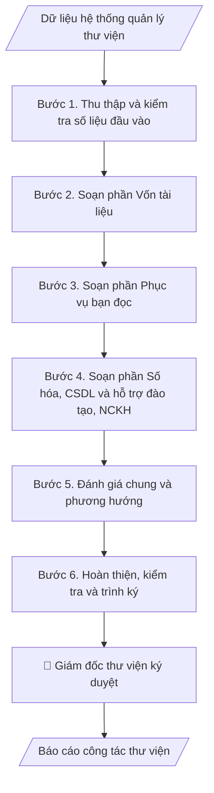

# Skill: Báo cáo công tác thư viện

## Khi nào dùng
Khi kết thúc năm học / năm công tác, thư viện cần tổng hợp hoạt động phục vụ
bạn đọc và phát triển vốn tài liệu thành báo cáo.

## Đầu vào (Input)

| Trường | Mô tả | Bắt buộc |
|---|---|---|
| `nam_bao_cao` | Năm học / năm công tác | Có |
| `so_lieu_von_tai_lieu` | Tổng đầu sách, bản sách, CSDL, tài liệu số hóa (tăng thêm trong năm) | Có |
| `so_lieu_phuc_vu` | Số bạn đọc, lượt mượn/trả, lượt truy cập CSDL, lượt vào thư viện | Có |
| `hoat_dong_noi_bat` | Các hoạt động, sự kiện trong năm (tập huấn, triển lãm sách...) | Không |
| `nguoi_ky` | Giám đốc thư viện | Có |

## Quy trình

**Bước 1. Thu thập và kiểm tra số liệu đầu vào**
- Làm gì: trích xuất từ hệ thống quản lý thư viện (ILS): vốn tài liệu phân theo loại hình
  (sách, giáo trình, luận văn/luận án, tạp chí), bạn đọc phân theo đối tượng (SV/GV/CB),
  lượt mượn–trả, lượt truy cập từng CSDL điện tử, lượt sử dụng không gian học tập.
  Đối chiếu: đầu sách đầu năm + bổ sung trong năm − thanh lý = đầu sách cuối năm;
  kiểm tra lượt truy cập CSDL không vượt giới hạn của gói license đã mua.
- Dùng input: `so_lieu_von_tai_lieu`, `so_lieu_phuc_vu`, `nam_bao_cao`.
- Vai trò: Cán bộ Thư viện · AI hỗ trợ: trích xuất và đối chiếu số liệu từ hệ thống ILS, thủ thư xác minh nguồn số liệu · ⏱ 1–2 giờ (ước tính)
- Lưu ý nghiệp vụ: phân biệt rõ "đầu sách" và "bản sách" — không cộng gộp hai đơn vị
  khác nhau; mức tăng/giảm phải tính so với cùng kỳ năm trước; số liệu truy cập CSDL
  lấy từ báo cáo thống kê của nhà cung cấp, không ước lượng thủ công.
- → Kết quả bước: bảng số liệu gốc đã đối chiếu, có cột so sánh với năm trước và
  ghi chú nguồn số liệu.

**Bước 2. Soạn phần Vốn tài liệu**
- Làm gì: viết mục I của báo cáo — tổng vốn tài liệu hiện có, số bổ sung trong năm
  theo từng hình thức (mua mới, tặng/biếu, số hóa), tỷ lệ tăng trưởng; đối chiếu với
  danh mục học phần để khẳng định mức độ đáp ứng tài liệu học tập.
- Dùng input: `so_lieu_von_tai_lieu` (kết quả đã đối chiếu ở Bước 1).
- Vai trò: Cán bộ Thư viện · AI hỗ trợ: viết dự thảo mục I “Vốn tài liệu” từ số liệu đã đối chiếu · ⏱ 30–60 phút (ước tính)
- Lưu ý nghiệp vụ: nêu cả số tuyệt đối và tỷ lệ % tăng; tài liệu thanh lý phải được
  trừ khỏi tổng trước khi tính tăng trưởng; đây là minh chứng kiểm định nên số liệu
  phải khớp với sổ sách kho.
- → Kết quả bước: dự thảo mục I "Vốn tài liệu" (văn bản + số liệu).

**Bước 3. Soạn phần Phục vụ bạn đọc**
- Làm gì: viết mục II — số bạn đọc đăng ký theo đối tượng, lượt mượn/trả tài liệu in,
  lượt truy cập CSDL điện tử, lượt sử dụng không gian học tập; so sánh với năm trước
  để nêu xu hướng (VD: chuyển dịch từ mượn in sang truy cập số).
- Dùng input: `so_lieu_phuc_vu` (kết quả đã đối chiếu ở Bước 1).
- Vai trò: Cán bộ Thư viện · AI hỗ trợ: viết dự thảo mục II “Phục vụ bạn đọc” từ số liệu đã đối chiếu · ⏱ 30–60 phút (ước tính)
- Lưu ý nghiệp vụ: lượt "truy cập" và "tải về" là hai chỉ số khác nhau — ghi đúng tên
  chỉ số nhà cung cấp CSDL cung cấp; không suy diễn nguyên nhân tăng/giảm khi chưa
  có khảo sát (chỉ nêu số liệu và xu hướng).
- → Kết quả bước: dự thảo mục II "Phục vụ bạn đọc" (văn bản + số liệu).

**Bước 4. Soạn phần Số hóa, CSDL và Hỗ trợ đào tạo – NCKH**
- Làm gì: viết mục III (kết quả số hóa tài liệu, CSDL mới bổ sung trong năm) và mục IV
  (các lớp tập huấn kỹ năng tra cứu, hỗ trợ luận văn/luận án, sự kiện văn hóa đọc);
  mỗi hoạt động ghi rõ thời gian, quy mô, đơn vị phối hợp.
- Dùng input: `so_lieu_von_tai_lieu` (phần số hóa, CSDL), `hoat_dong_noi_bat`.
- Vai trò: Cán bộ Thư viện · AI hỗ trợ: soạn dự thảo mục III và IV, thư viện bổ sung minh chứng hoạt động · ⏱ 30–60 phút (ước tính)
- Lưu ý nghiệp vụ: số hóa luận văn/luận án phải tuân thủ quy định về quyền tác giả
  và mức độ công khai; hoạt động không có minh chứng (ảnh, danh sách, quyết định)
  thì không đưa vào báo cáo kiểm định.
- → Kết quả bước: dự thảo mục III "Số hóa và cơ sở dữ liệu" và mục IV
  "Hỗ trợ đào tạo – NCKH".

**Bước 5. Đánh giá chung và phương hướng**
- Làm gì: viết mục V — tổng hợp ưu điểm (dựa trên xu hướng tăng ở các mục I–IV),
  chỉ ra tồn tại cụ thể có số liệu (VD: kho sách đạt 90% công suất, CSDL ít khai thác),
  đề xuất phương hướng năm tới gắn với từng tồn tại.
- Dùng input: toàn bộ dự thảo các mục I–IV, `nam_bao_cao`.
- Vai trò: Giám đốc Thư viện · AI hỗ trợ: soạn dự thảo mục V · ⏱ 1–2 giờ (ước tính)
- Lưu ý nghiệp vụ: mỗi tồn tại phải đi kèm nguyên nhân và giải pháp đề xuất —
  không nêu tồn tại chung chung kiểu "còn hạn chế"; phương hướng phải đo được
  (có chỉ tiêu, thời hạn).
- → Kết quả bước: dự thảo mục V "Đánh giá chung và phương hướng".

**Bước 6. Hoàn thiện, kiểm tra và trình ký**
- Làm gì: gộp 5 mục thành văn bản hành chính đúng thể thức (số văn bản, ngày tháng,
  chữ ký, nơi nhận); kiểm tra chéo: số liệu trong các mục không mâu thuẫn nhau,
  tổng các thành phần khớp với tổng đã nêu; trình Giám đốc thư viện ký duyệt;
  lưu hồ sơ theo mã minh chứng kiểm định của trường.
- Dùng input: `nguoi_ky`, `nam_bao_cao`.
- Vai trò: Giám đốc Thư viện · AI hỗ trợ: kiểm tra chéo số liệu và thể thức văn bản · ⏱ 30–60 phút (ước tính)
- Lưu ý nghiệp vụ: kiểm tra lần cuối lỗi chính tả tên CSDL, tên đơn vị; số văn bản
  lấy theo sổ văn bản đi của thư viện, không tự đặt số tùy ý.
- → Kết quả bước: báo cáo công tác thư viện hoàn chỉnh, đã ký duyệt và lưu hồ sơ.

## Luồng quy trình (Workflow)


## Đầu ra (Output)
- Báo cáo công tác thư viện hoàn chỉnh.

**Cấu trúc output chuẩn:** khung mẫu cố định của báo cáo, các phần theo đúng thứ tự:
1. Quốc hiệu – tiêu ngữ (căn giữa, phía phải).
2. Tên đơn vị ban hành + số văn bản (phía trái).
3. Địa danh, ngày/tháng/năm ban hành (phía phải).
4. Tên loại văn bản "BÁO CÁO" + trích yếu nội dung (căn giữa).
5. Kính gửi: đơn vị nhận báo cáo.
6. Đoạn mở đầu: căn cứ lập báo cáo, phạm vi năm báo cáo, nguồn số liệu.
7. Nội dung chính theo 5 mục: I. Vốn tài liệu; II. Phục vụ bạn đọc;
   III. Số hóa và cơ sở dữ liệu; IV. Hỗ trợ đào tạo – NCKH;
   V. Đánh giá chung và phương hướng (ưu điểm, tồn tại, phương hướng năm tới).
8. Chữ ký: chức danh + họ tên người ký (kèm "(đã ký)" khi là bản mô phỏng).
9. Nơi nhận + nơi lưu hồ sơ.

## Checklist nghiệm thu

- [ ] Đủ 9 phần theo "Cấu trúc output chuẩn": quốc hiệu – tiêu ngữ, tên đơn vị + số văn bản, địa danh ngày ban hành, tên loại văn bản + trích yếu, kính gửi, mở đầu, nội dung 5 mục, chữ ký, nơi nhận + lưu hồ sơ.
- [ ] Số liệu vốn tài liệu, bạn đọc, lượt mượn/truy cập khớp với Input và số liệu hệ thống ILS; phân biệt đúng "đầu sách" và "bản sách".
- [ ] Không bịa đặt số liệu truy cập CSDL, hoạt động hay minh chứng không có thật; hoạt động không có minh chứng không đưa vào báo cáo kiểm định.
- [ ] Công thức đối chiếu đúng: đầu sách đầu năm + bổ sung − thanh lý = đầu sách cuối năm; mức tăng/giảm tính so với cùng kỳ.
- [ ] Chỉ số "truy cập" và "tải về" ghi đúng tên chỉ số nhà cung cấp CSDL cung cấp; không suy diễn nguyên nhân khi chưa có khảo sát.
- [ ] Số hóa luận văn/luận án tuân thủ quy định về quyền tác giả và mức độ công khai.
- [ ] Tồn tại gắn nguyên nhân và giải pháp đề xuất; phương hướng có chỉ tiêu và thời hạn đo được.
- [ ] Số liệu các mục không mâu thuẫn nhau; số văn bản lấy theo sổ văn bản đi của thư viện.
- [ ] Đã qua Human gate: giám đốc thư viện ký duyệt; lưu hồ sơ theo mã minh chứng kiểm định của trường.

Tiêu chí đạt = tất cả các ô được đánh dấu.

## Ví dụ mô phỏng (dữ liệu giả lập)

> Tất cả tên trường, cá nhân, số liệu dưới đây đều là **giả lập**, không liên quan tổ chức/cá nhân có thật.

### Input mẫu

| Trường | Giá trị |
|---|---|
| `nam_bao_cao` | Năm học 2026–2027 |
| `so_lieu_von_tai_lieu` | 85.000 đầu sách (tăng 4.200); 12 CSDL điện tử; 3.500 tài liệu số hóa (tăng 500) |
| `so_lieu_phuc_vu` | 9.800 bạn đọc; 62.000 lượt mượn; 145.000 lượt truy cập CSDL |
| `hoat_dong_noi_bat` | 08 lớp tập huấn kỹ năng tra cứu; Tuần lễ sách và văn hóa đọc |

### Output mẫu

```
TRƯỜNG ĐẠI HỌC A            CỘNG HÒA XÃ HỘI CHỦ NGHĨA VIỆT NAM
THƯ VIỆN                                        Độc lập – Tự do – Hạnh phúc
      Số: 15/BC-ĐHA-TV
                                                 Thành phố C, ngày 09 tháng 10 năm 2026

BÁO CÁO
Công tác thư viện năm học 2026–2027

Kính gửi: Ban Giám hiệu Trường Đại học A

Căn cứ kế hoạch công tác năm học 2026–2027 và số liệu tổng hợp từ hệ thống
quản lý thư viện, Thư viện báo cáo kết quả công tác thư viện năm học 2026–2027
như sau:

I. VỐN TÀI LIỆU
- Tổng vốn tài liệu: 85.000 đầu sách (tăng 4.200 đầu so với năm trước, +5,2%).
- Cơ sở dữ liệu điện tử: 12 CSDL (10 quốc tế, 02 trong nước).
- Tài liệu số hóa: 3.500 tài liệu (tăng 500 luận văn, luận án trong năm).
- 100% học phần có ít nhất 01 giáo trình/tài liệu tham khảo chính.

II. PHỤC VỤ BẠN ĐỌC
- Số bạn đọc đăng ký: 9.800 (SV: 9.200; GV/CB: 600).
- Lượt mượn/trả tài liệu in: 62.000 lượt (+8% so với năm trước).
- Lượt truy cập CSDL điện tử: 145.000 lượt (+22%).
- Lượt sử dụng không gian học tập: 88.000 lượt.

III. SỐ HÓA VÀ CƠ SỞ DỮ LIỆU
- Hoàn thành số hóa 500 luận văn, luận án bảo vệ năm 2024–2026.
- Bổ sung 03 CSDL tạp chí quốc tế mới theo đề xuất của các khoa.

IV. HỖ TRỢ ĐÀO TẠO – NCKH
- Tổ chức 08 lớp tập huấn kỹ năng tra cứu, trích dẫn tài liệu cho 1.600 SV năm nhất.
- Phối hợp tổ chức Tuần lễ sách và văn hóa đọc, thu hút 3.000 lượt tham gia.

V. ĐÁNH GIÁ CHUNG VÀ PHƯƠNG HƯỚNG
1. Ưu điểm: vốn tài liệu tăng trưởng tốt; truy cập số tăng mạnh (+22%).
2. Tồn tại: diện tích kho sách gần đầy (đạt 90% công suất); một số CSDL ít được
   khai thác (dưới 1.000 lượt/năm).
3. Phương hướng 2027–2028: mở rộng kho số; thanh lý tài liệu lạc hậu; tăng cường
   hướng dẫn khai thác CSDL cho giảng viên.

Nơi nhận:                                        GIÁM ĐỐC THƯ VIỆN
- Ban Giám hiệu (báo cáo);                            (đã ký)
- Lưu: VT, TV.

                                                  ThS. Hoàng Thị D
```

## Căn cứ & lưu ý
- Quy định về công tác thư viện trường đại học; bộ tiêu chuẩn kiểm định CSGD
  (tiêu chí về thư viện, học liệu).
- Báo cáo thư viện là minh chứng quan trọng cho tiêu chí về cơ sở vật chất, học liệu
  trong kiểm định — cần lưu trữ đầy đủ, mã hóa theo quy tắc của trường.
- Không dùng tên thật của trường/cá nhân khi mô phỏng.
