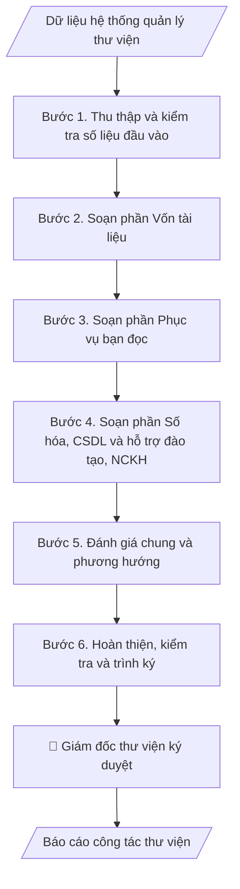

# Báo cáo công tác thư viện

## Định dạng và file đầu ra

Định dạng đầu ra có thể chọn theo sản phẩm/yêu cầu: .docx, .pdf. Đọc mục “Định dạng bổ sung” trong quy cách đầu ra trước khi chọn.

**Phải tạo file thực tế để tải xuống, không chỉ trả nội dung trong chat.** Định dạng mặc định của skill: **.docx**. Nếu có bảng số liệu nghiệp vụ yêu cầu file bảng tính riêng, tạo thêm Excel theo yêu cầu; không tự tạo file kiểm tra. Không chờ người dùng yêu cầu xuất file lần nữa. Ưu tiên định dạng người dùng chỉ định; đọc quy tắc xuất file tại references/quy-cach-dau-ra.md.

## Quy cách đầu ra và thông tin thiếu
Khi dựng file Word/Excel, áp dụng mục “Thể thức và bảng biểu khi dựng file” trong quy cách đầu ra (cỡ chữ từng thành phần, bảng nhiều trang, số trang, phụ lục). Đọc [quy cách và cấu trúc sản phẩm](references/quy-cach-dau-ra.md) trước khi soạn/xuất. File giao chỉ gồm sản phẩm nghiệp vụ được yêu cầu; kiểm tra nội bộ không xuất kèm. Thiếu thông tin thì giữ nguyên trường/mục và chỗ điền theo mẫu gốc (dòng dấu chấm, dấu gạch hoặc ô trống); không tự điền dữ liệu mẫu, số 0, mã chờ xác minh hay dòng chờ ký. Mẫu chuyên ngành còn áp dụng được ưu tiên về cấu trúc, mã biểu và người ký. Bản đầy đủ: [quy tắc chung](references/quy-tac-chung.md).

## Kiểm soát áp dụng và phê duyệt
Trước khi chạy, xác định `ngay_ap_dung`, `loai_hinh_truong`, `quy_che_noi_bo`, `nguon_du_lieu`, `nguoi_kiem_duyet`; chỉ hỏi thông tin liên quan nghiệp vụ, không dùng giá trị giả định thay dữ liệu bắt buộc. Đối chiếu căn cứ pháp lý với văn bản gốc, hiệu lực, điều khoản áp dụng và chuyển tiếp. Bản đầy đủ: [quy tắc chung](references/quy-tac-chung.md).

## Giới hạn và human gate
AI hỗ trợ chuẩn bị và đối chiếu; cán bộ phụ trách kiểm tra dữ liệu/căn cứ, người có thẩm quyền duyệt và ký. Không đánh dấu đã ký, đã duyệt, đã công bố khi chưa có chứng cứ. Dữ liệu sinh viên, sức khỏe, nhân sự, tài chính chỉ dùng theo mục đích và phân quyền, che thông tin định danh khi dùng ví dụ (Luật 91/2025/QH15, hiệu lực 01/01/2026); không tải dữ liệu lên dịch vụ ngoài khi chưa có quyền. Bản đầy đủ: [quy tắc chung](references/quy-tac-chung.md).

## Khi nào dùng
Khi kết thúc năm học / năm công tác, thư viện cần tổng hợp hoạt động phục vụ
bạn đọc và phát triển vốn tài liệu thành báo cáo.

## Đầu vào (Input)

| Trường | Mô tả | Bắt buộc |
|---|---|---|
| `nam_bao_cao` | Năm học / năm công tác | Có |
| `so_lieu_von_tai_lieu` | Tổng đầu sách, bản sách, CSDL, tài liệu số hóa (tăng thêm trong năm) | Có |
| `so_lieu_phuc_vu` | Số bạn đọc, lượt mượn/trả, lượt truy cập CSDL, lượt vào thư viện | Có |
| `hoat_dong_noi_bat` | Các hoạt động, sự kiện trong năm (tập huấn, triển lãm sách...) | Không |
| `nguoi_ky` | Giám đốc thư viện | Có |

## Quy trình

**Bước 1. Thu thập và kiểm tra số liệu đầu vào**
- Làm gì: trích xuất từ hệ thống quản lý thư viện (ILS): vốn tài liệu phân theo loại hình
  (sách, giáo trình, luận văn/luận án, tạp chí), bạn đọc phân theo đối tượng (SV/GV/CB),
  lượt mượn–trả, lượt truy cập từng CSDL điện tử, lượt sử dụng không gian học tập.
  Đối chiếu: đầu sách đầu năm + bổ sung trong năm − thanh lý = đầu sách cuối năm;
  kiểm tra lượt truy cập CSDL không vượt giới hạn của gói license đã mua.
- Dùng input: `so_lieu_von_tai_lieu`, `so_lieu_phuc_vu`, `nam_bao_cao`.
- Vai trò: Cán bộ Thư viện · AI hỗ trợ: trích xuất và đối chiếu số liệu từ hệ thống ILS, thủ thư xác minh nguồn số liệu · ⏱ 1–2 giờ (ước tính)
- Lưu ý nghiệp vụ: phân biệt rõ "đầu sách" và "bản sách" — không cộng gộp hai đơn vị
  khác nhau; mức tăng/giảm phải tính so với cùng kỳ năm trước; số liệu truy cập CSDL
  lấy từ báo cáo thống kê của nhà cung cấp, không ước lượng thủ công.
- → Kết quả bước: bảng số liệu gốc đã đối chiếu, có cột so sánh với năm trước và
  ghi chú nguồn số liệu.

**Bước 2. Soạn phần Vốn tài liệu**
- Làm gì: viết mục I của báo cáo — tổng vốn tài liệu hiện có, số bổ sung trong năm
  theo từng hình thức (mua mới, tặng/biếu, số hóa), tỷ lệ tăng trưởng; đối chiếu với
  danh mục học phần để khẳng định mức độ đáp ứng tài liệu học tập.
- Dùng input: `so_lieu_von_tai_lieu` (kết quả đã đối chiếu ở Bước 1).
- Vai trò: Cán bộ Thư viện · AI hỗ trợ: viết dự thảo mục I “Vốn tài liệu” từ số liệu đã đối chiếu · ⏱ 30–60 phút (ước tính)
- Lưu ý nghiệp vụ: nêu cả số tuyệt đối và tỷ lệ % tăng; tài liệu thanh lý phải được
  trừ khỏi tổng trước khi tính tăng trưởng; đây là minh chứng kiểm định nên số liệu
  phải khớp với sổ sách kho.
- → Kết quả bước: dự thảo mục I "Vốn tài liệu" (văn bản + số liệu).

**Bước 3. Soạn phần Phục vụ bạn đọc**
- Làm gì: viết mục II — số bạn đọc đăng ký theo đối tượng, lượt mượn/trả tài liệu in,
  lượt truy cập CSDL điện tử, lượt sử dụng không gian học tập; so sánh với năm trước
  để nêu xu hướng (VD: chuyển dịch từ mượn in sang truy cập số).
- Dùng input: `so_lieu_phuc_vu` (kết quả đã đối chiếu ở Bước 1).
- Vai trò: Cán bộ Thư viện · AI hỗ trợ: viết dự thảo mục II “Phục vụ bạn đọc” từ số liệu đã đối chiếu · ⏱ 30–60 phút (ước tính)
- Lưu ý nghiệp vụ: lượt "truy cập" và "tải về" là hai chỉ số khác nhau — ghi đúng tên
  chỉ số nhà cung cấp CSDL cung cấp; không suy diễn nguyên nhân tăng/giảm khi chưa
  có khảo sát (chỉ nêu số liệu và xu hướng).
- → Kết quả bước: dự thảo mục II "Phục vụ bạn đọc" (văn bản + số liệu).

**Bước 4. Soạn phần Số hóa, CSDL và Hỗ trợ đào tạo – NCKH**
- Làm gì: viết mục III (kết quả số hóa tài liệu, CSDL mới bổ sung trong năm) và mục IV
  (các lớp tập huấn kỹ năng tra cứu, hỗ trợ luận văn/luận án, sự kiện văn hóa đọc);
  mỗi hoạt động ghi rõ thời gian, quy mô, đơn vị phối hợp.
- Dùng input: `so_lieu_von_tai_lieu` (phần số hóa, CSDL), `hoat_dong_noi_bat`.
- Vai trò: Cán bộ Thư viện · AI hỗ trợ: soạn dự thảo mục III và IV, thư viện bổ sung minh chứng hoạt động · ⏱ 30–60 phút (ước tính)
- Lưu ý nghiệp vụ: số hóa luận văn/luận án phải tuân thủ quy định về quyền tác giả
  và mức độ công khai; hoạt động không có minh chứng (ảnh, danh sách, quyết định)
  thì không đưa vào báo cáo kiểm định.
- → Kết quả bước: dự thảo mục III "Số hóa và cơ sở dữ liệu" và mục IV
  "Hỗ trợ đào tạo – NCKH".

**Bước 5. Đánh giá chung và phương hướng**
- Làm gì: viết mục V — tổng hợp ưu điểm (dựa trên xu hướng tăng ở các mục I–IV),
  chỉ ra tồn tại cụ thể có số liệu (VD: kho sách đạt 90% công suất, CSDL ít khai thác),
  đề xuất phương hướng năm tới gắn với từng tồn tại.
- Dùng input: toàn bộ dự thảo các mục I–IV, `nam_bao_cao`.
- Vai trò: Giám đốc Thư viện · AI hỗ trợ: soạn dự thảo mục V · ⏱ 1–2 giờ (ước tính)
- Lưu ý nghiệp vụ: mỗi tồn tại phải đi kèm nguyên nhân và giải pháp đề xuất —
  không nêu tồn tại chung chung kiểu "còn hạn chế"; phương hướng phải đo được
  (có chỉ tiêu, thời hạn).
- → Kết quả bước: dự thảo mục V "Đánh giá chung và phương hướng".

**Bước 6. Hoàn thiện, kiểm tra và trình ký**
- Làm gì: gộp 5 mục thành văn bản hành chính đúng thể thức (số văn bản, ngày tháng,
  chữ ký, nơi nhận); kiểm tra chéo: số liệu trong các mục không mâu thuẫn nhau,
  tổng các thành phần khớp với tổng đã nêu; trình Giám đốc thư viện ký duyệt;
  lưu hồ sơ theo mã minh chứng kiểm định của trường.
- Dùng input: `nguoi_ky`, `nam_bao_cao`.
- Vai trò: Giám đốc Thư viện · AI hỗ trợ: kiểm tra chéo số liệu và thể thức văn bản · ⏱ 30–60 phút (ước tính)
- Lưu ý nghiệp vụ: kiểm tra lần cuối lỗi chính tả tên CSDL, tên đơn vị; số văn bản
  lấy theo sổ văn bản đi của thư viện, không tự đặt số tùy ý.
- → Kết quả bước: báo cáo công tác thư viện hoàn chỉnh, đã ký duyệt và lưu hồ sơ.

## Luồng quy trình (Workflow)

## Đầu ra

File nghiệp vụ thực tế theo định dạng mặc định ở đầu skill hoặc định dạng người dùng yêu cầu, kèm liên kết tải trong phản hồi cuối.

Sản phẩm nghiệp vụ hoàn chỉnh theo [quy cách và cấu trúc](references/quy-cach-dau-ra.md), giữ các trường chưa có dữ liệu ở trạng thái trống. Không xuất kèm checklist/phụ lục kiểm tra đầu ra.

## Kiểm tra nội bộ trước khi giao

- [ ] Bố cục khớp mẫu áp dụng và cấu trúc tại references/quy-cach-dau-ra.md.
- [ ] Số liệu vốn tài liệu, bạn đọc, lượt mượn/truy cập khớp với Input và số liệu hệ thống ILS; phân biệt đúng "đầu sách" và "bản sách".
- [ ] Không bịa đặt số liệu truy cập CSDL, hoạt động hay minh chứng không có thật; hoạt động không có minh chứng không đưa vào báo cáo kiểm định.
- [ ] Công thức đối chiếu đúng: đầu sách đầu năm + bổ sung − thanh lý = đầu sách cuối năm; mức tăng/giảm tính so với cùng kỳ.
- [ ] Chỉ số "truy cập" và "tải về" ghi đúng tên chỉ số nhà cung cấp CSDL cung cấp; không suy diễn nguyên nhân khi chưa có khảo sát.
- [ ] Số hóa luận văn/luận án tuân thủ quy định về quyền tác giả và mức độ công khai.
- [ ] Tồn tại gắn nguyên nhân và giải pháp đề xuất; phương hướng có chỉ tiêu và thời hạn đo được.
- [ ] Số liệu các mục không mâu thuẫn nhau; số văn bản lấy theo sổ văn bản đi của thư viện.
- [ ] Đã qua Human gate: giám đốc thư viện ký duyệt; lưu hồ sơ theo mã minh chứng kiểm định của trường.

Tiêu chí đạt = tất cả các ô được đánh dấu.

## Căn cứ & lưu ý
- Quy định về công tác thư viện trường đại học; bộ tiêu chuẩn kiểm định CSGD
  (tiêu chí về thư viện, học liệu).
- Báo cáo thư viện là minh chứng quan trọng cho tiêu chí về cơ sở vật chất, học liệu
  trong kiểm định — cần lưu trữ đầy đủ, mã hóa theo quy tắc của trường.
- Không dùng tên thật của trường/cá nhân khi mô phỏng.

## Quản trị phiên bản
- Phiên bản gói `1.3.2` (cập nhật 2026-10-10); hồ sơ đầy đủ tại [references/version.json](references/version.json).
- Người phê duyệt nghiệp vụ: **chưa chỉ định**. Trạng thái: dự thảo nghiệp vụ; kiểm tra pháp lý trước thực thi. Ngày cập nhật không đồng nghĩa mọi văn bản đã được rà soát toàn văn.
- Giấy phép theo LICENSE của kho (bản quyền CES Global). Lịch sử thay đổi: CHANGELOG.md.
