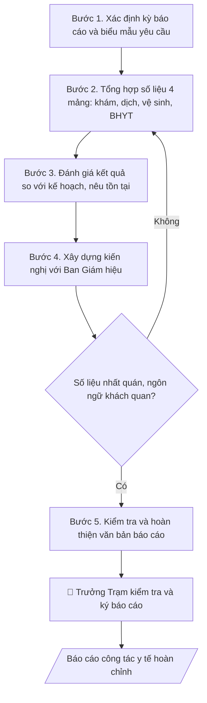

# Skill: Soạn báo cáo công tác y tế

## Khi nào dùng
Khi Trạm Y tế cần báo cáo định kỳ (học kỳ, năm học) hoặc đột xuất (có dịch bệnh, sự cố y tế)
gửi Ban Giám hiệu, Phòng CTSV và cơ quan y tế địa phương.

## Đầu vào (Input)

| Trường | Mô tả | Bắt buộc |
|---|---|---|
| `ky_bao_cao` | Học kỳ I / Học kỳ II / Năm học / Đột xuất + thời gian | Có |
| `so_lieu_kham` | Số lượt khám sức khỏe, khám bệnh ban đầu (tổng hợp, không nêu tên cá nhân) | Có |
| `so_lieu_dich` | Tình hình dịch bệnh: số ca theo loại (tổng hợp ẩn danh) | Có |
| `so_lieu_vsmt` | Kết quả kiểm tra vệ sinh: số đợt kiểm tra, số cơ sở đạt/không đạt | Có |
| `so_lieu_bhyt` | Tỷ lệ CBVC/SV tham gia BHYT | Có |
| `ton_tai_kien_nghi` | Tồn tại, khó khăn và kiến nghị | Có |

## Quy trình

**Bước 1. Xác định kỳ báo cáo và biểu mẫu yêu cầu**
- Làm gì: chốt kỳ báo cáo (`ky_bao_cao`: học kỳ I/II, năm học hay đột xuất kèm mốc thời gian);
  kiểm tra biểu mẫu báo cáo mà Ban Giám hiệu hoặc cơ quan y tế địa phương yêu cầu
  (nếu có) để dùng đúng khung, đúng chỉ tiêu.
- Dùng input: `ky_bao_cao`.
- Vai trò: Cán bộ Trạm Y tế · AI hỗ trợ: chốt kỳ báo cáo và đối chiếu biểu mẫu theo danh sách yêu cầu · ⏱ 15–30 phút (ước tính)
- Lưu ý nghiệp vụ: báo cáo đột xuất (dịch bệnh, sự cố) có thời hạn gửi riêng, ngắn hơn
  báo cáo định kỳ — ghi rõ mốc thời gian sự kiện trong trích yếu; không gộp số liệu
  của hai kỳ khác nhau vào một báo cáo.
- → Kết quả bước: khung kỳ báo cáo đã chốt + biểu mẫu áp dụng (nếu có).

**Bước 2. Tổng hợp số liệu theo 4 mảng**
- Làm gì: tổng hợp từ sổ khám bệnh, sổ theo dõi dịch, biên bản kiểm tra vệ sinh, danh sách
  BHYT thành 4 bảng: (1) khám sức khỏe, khám chữa bệnh ban đầu (tổng lượt, số chuyển tuyến);
  (2) phòng chống dịch (số ca theo loại bệnh, số ca khỏi, biện pháp đã xử lý);
  (3) vệ sinh môi trường (số đợt kiểm tra, số cơ sở đạt/không đạt); (4) BHYT
  (tỷ lệ tham gia của CBVC và SV). Đối chiếu chéo với sổ gốc để loại số liệu trùng/lệch.
- Dùng input: `so_lieu_kham`, `so_lieu_dich`, `so_lieu_vsmt`, `so_lieu_bhyt`, `ky_bao_cao`.
- Vai trò: Cán bộ Trạm Y tế · AI hỗ trợ: tổng hợp, đối chiếu bảng số liệu ẩn danh; cán bộ y tế cung cấp và xác nhận số liệu gốc từ sổ · ⏱ 2–3 giờ (ước tính)
- Lưu ý nghiệp vụ: **chỉ dùng số liệu tổng hợp, ẩn danh — tuyệt đối không nêu tên, mã SV,
  mã CBVC hay thông tin nhận dạng cá nhân**; số ca dịch ghi đúng phân loại của y tế
  địa phương, không tự chẩn đoán nguyên nhân.
- → Kết quả bước: 4 bảng số liệu tổng hợp đã đối chiếu với sổ gốc, không chứa
  thông tin cá nhân.

**Bước 3. Đánh giá kết quả và tồn tại**
- Làm gì: so sánh kết quả 4 mảng với kế hoạch y tế học đường của kỳ (tỷ lệ hoàn thành
  từng chỉ tiêu); nêu tồn tại cụ thể có số liệu và nguyên nhân (VD: thiếu 01 y sĩ
  so với định biên → ảnh hưởng tiến độ khám).
- Dùng input: `ton_tai_kien_nghi`, 4 bảng số liệu (Bước 2).
- Vai trò: Cán bộ Trạm Y tế · AI hỗ trợ: soạn dự thảo so sánh chỉ tiêu với kế hoạch · ⏱ 1–2 giờ (ước tính)
- Lưu ý nghiệp vụ: đánh giá bằng số liệu, không dùng ngôn từ định tính chung chung;
  tồn tại nào không có nguyên nhân rõ thì ghi "đang làm rõ", không suy đoán.
- → Kết quả bước: dự thảo phần đánh giá — kết quả đạt được so với kế hoạch,
  tồn tại và nguyên nhân.

**Bước 4. Xây dựng kiến nghị**
- Làm gì: cụ thể hóa `ton_tai_kien_nghi` thành danh mục kiến nghị gửi Ban Giám hiệu:
  mỗi kiến nghị nêu rõ nội dung (nhân sự, kinh phí, trang thiết bị), lý do, mức độ
  ưu tiên và thời hạn đề xuất.
- Dùng input: `ton_tai_kien_nghi`, phần tồn tại (Bước 3).
- Vai trò: Trưởng Trạm Y tế và Ban Giám hiệu · AI hỗ trợ: cụ thể hóa thành danh mục kiến nghị, Trưởng Trạm rà soát tính khả thi và mức ưu tiên · ⏱ 1–2 giờ (ước tính)
- Lưu ý nghiệp vụ: kiến nghị phải khả thi trong thẩm quyền của trường (việc vượt thẩm
  quyền thì đề xuất "kiến nghị cấp trên xem xét"); không đưa kiến nghị không gắn với
  tồn tại đã nêu.
- → Kết quả bước: danh mục kiến nghị có mức ưu tiên và thời hạn đề xuất.

**Bước 5. Kiểm tra và hoàn thiện văn bản**
- Làm gì: gộp các phần thành văn bản hành chính đúng thể thức (quốc hiệu, số văn bản,
  kính gửi, chữ ký, nơi nhận); kiểm tra: số liệu giữa các bảng và phần đánh giá không
  mâu thuẫn, tổng các thành phần khớp tổng đã nêu; ngôn ngữ khách quan, không kết luận
  y khoa.
- Dùng input: toàn bộ dự thảo các bước 1–4.
- Vai trò: Cán bộ Trạm Y tế · AI hỗ trợ: kiểm tra nhất quán số liệu và thể thức văn bản · ⏱ 1–2 giờ (ước tính)
- Lưu ý nghiệp vụ: **tuyệt đối không** đưa chẩn đoán, kết luận nguyên nhân bệnh hay
  khuyến nghị điều trị vào báo cáo hành chính; đọc soát lần cuối trước khi trình ký.
- → Kết quả bước: dự thảo báo cáo công tác y tế hoàn chỉnh, đúng thể thức.

**Bước 6. Trình ký và phát hành**
- Làm gì: trình Trưởng Trạm Y tế kiểm tra số liệu và ký báo cáo; gửi Ban Giám hiệu
  (báo cáo), Phòng CTSV (phối hợp), cơ quan y tế địa phương (bản sao khi có yêu cầu);
  lưu hồ sơ tại Trạm theo quy định lưu trữ.
- Dùng input: `ky_bao_cao` (để ghi sổ văn bản đi đúng kỳ).
- Vai trò: Trưởng Trạm Y tế và Ban Giám hiệu · AI hỗ trợ: soạn dự thảo văn bản trình ký, kiểm tra thể thức · ⏱ 0,5–1 ngày làm việc (ước tính)
- Lưu ý nghiệp vụ: số văn bản lấy theo sổ văn bản đi của Trạm; bản gửi cơ quan y tế
  địa phương phải đúng biểu mẫu và thời hạn của ngành y tế.
- → Kết quả bước: báo cáo công tác y tế hoàn chỉnh, đã ký và phát hành đúng nơi nhận.

## Luồng quy trình (Workflow)



## Đầu ra (Output)
- Báo cáo công tác y tế hoàn chỉnh (markdown) kèm các bảng số liệu tổng hợp.

**Cấu trúc output chuẩn:** khung mẫu cố định của báo cáo, các phần theo đúng thứ tự:
1. Quốc hiệu – tiêu ngữ (căn giữa, phía phải).
2. Tên đơn vị ban hành + số văn bản (phía trái).
3. Địa danh, ngày/tháng/năm ban hành (phía phải).
4. Tên loại văn bản "BÁO CÁO" + trích yếu nội dung (căn giữa).
5. Kính gửi: Ban Giám hiệu (và các đơn vị liên quan).
6. Đoạn mở đầu: kỳ báo cáo, phạm vi, nguồn số liệu.
7. I. Kết quả thực hiện: 4 mảng — khám sức khỏe/khám chữa bệnh ban đầu;
   phòng chống dịch bệnh; vệ sinh môi trường; BHYT (kèm bảng số liệu tổng hợp,
   ẩn danh).
8. II. Tồn tại, kiến nghị: tồn tại có số liệu + nguyên nhân; kiến nghị cụ thể
   có mức ưu tiên.
9. Đoạn kết: kính trình Ban Giám hiệu xem xét.
10. Chữ ký: Trưởng Trạm Y tế (kèm "(đã ký)" khi là bản mô phỏng).
11. Nơi nhận + nơi lưu hồ sơ.

## Checklist nghiệm thu

- [ ] Đủ 11 phần theo "Cấu trúc output chuẩn": quốc hiệu – tiêu ngữ, tên đơn vị + số văn bản, địa danh ngày tháng, "BÁO CÁO" + trích yếu, kính gửi, đoạn mở đầu, I. Kết quả thực hiện (4 mảng), II. Tồn tại kiến nghị, đoạn kết, chữ ký Trưởng Trạm, nơi nhận + lưu hồ sơ.
- [ ] Số liệu trong output khớp với Input đã cho (số lượt khám, số ca dịch, kết quả kiểm tra vệ sinh, tỷ lệ BHYT).
- [ ] Không bịa đặt số liệu, minh chứng, trích dẫn; không tự chẩn đoán nguyên nhân bệnh.
- [ ] Đúng thể thức văn bản hành chính: quốc hiệu, số văn bản, kính gửi, chữ ký, nơi nhận.
- [ ] Căn cứ pháp lý đầy đủ, còn hiệu lực (quy định y tế trường học, chế độ báo cáo của ngành y tế).
- [ ] Đã qua Human gate: Trưởng Trạm Y tế kiểm tra số liệu và ký báo cáo.
- [ ] Không nêu tên, mã SV/CBVC hay thông tin nhận dạng cá nhân — chỉ dùng số liệu tổng hợp, ẩn danh.
- [ ] Không đưa chẩn đoán, kết luận nguyên nhân bệnh hay khuyến nghị điều trị vào báo cáo.
- [ ] Số liệu giữa các bảng và phần đánh giá nhất quán, tổng các thành phần khớp tổng đã nêu.

Tiêu chí đạt = tất cả các ô được đánh dấu.

## Ví dụ mô phỏng (dữ liệu giả lập)

> Tất cả tên trường, cá nhân, số liệu dưới đây đều là **giả lập**, không liên quan tổ chức/cá nhân có thật.

### Input mẫu

| Trường | Giá trị |
|---|---|
| `ky_bao_cao` | Học kỳ I, năm học 2026–2027 |
| `so_lieu_kham` | 3.850 lượt khám sức khỏe tân sinh viên; 620 lượt khám bệnh ban đầu |
| `so_lieu_dich` | 12 ca sốt xuất huyết (đã khỏi), 0 ca lây lan trong KTX |
| `so_lieu_vsmt` | 2 đợt kiểm tra căn tin: 2/2 đạt; kiểm tra nguồn nước: đạt |
| `so_lieu_bhyt` | CBVC 100%, sinh viên 97,5% |
| `ton_tai_kien_nghi` | Thiếu 01 y sĩ; đề nghị bổ sung tủ thuốc cấp cứu tại khu giảng đường C |

### Output mẫu

```
TRƯỜNG ĐẠI HỌC A            CỘNG HÒA XÃ HỘI CHỦ NGHĨA VIỆT NAM
TRẠM Y TẾ                                 Độc lập – Tự do – Hạnh phúc
      Số: 28/BC-ĐHA-TYT
                                                 Thành phố C, ngày 10 tháng 1 năm 2027

                          BÁO CÁO
              Công tác y tế học kỳ I, năm học 2026–2027

Kính gửi: Ban Giám hiệu Trường Đại học A

Trạm Y tế báo cáo kết quả công tác y tế học kỳ I, năm học 2026–2027 như sau:

I. KẾT QUẢ THỰC HIỆN
1. Khám sức khỏe, khám chữa bệnh ban đầu:
   - Khám sức khỏe cho 3.850 tân sinh viên, đạt 100% kế hoạch;
   - Khám bệnh ban đầu 620 lượt, chuyển tuyến trên 18 trường hợp.
2. Phòng chống dịch bệnh: ghi nhận 12 ca sốt xuất huyết (đều đã khỏi bệnh),
   không có lây lan trong ký túc xá; đã phun khử khuẩn 2 đợt.
3. Vệ sinh môi trường: kiểm tra VSATTP căn tin 2 đợt (2/2 đạt yêu cầu);
   kiểm tra chất lượng nguồn nước: đạt.
4. BHYT: CBVC tham gia 100%; sinh viên tham gia 97,5%.

II. TỒN TẠI, KIẾN NGHỊ
- Tồn tại: Trạm hiện thiếu 01 y sĩ so với định biên.
- Kiến nghị: bổ sung 01 y sĩ; trang bị thêm 01 tủ thuốc cấp cứu đặt tại
khu giảng đường C.

Trên đây là báo cáo công tác y tế học kỳ I, kính trình Ban Giám hiệu xem xét./.

Nơi nhận:                                          TRƯỞNG TRẠM Y TẾ
- Ban Giám hiệu;                                        (đã ký)
- Phòng CTSV (p/h);
- Lưu: VT, TYT.                                   BS. Hoàng Thị B
```

## Human gate (người kiểm duyệt)
- Trưởng Trạm Y tế kiểm tra số liệu và ký báo cáo.
- Ban Giám hiệu tiếp nhận; cơ quan y tế địa phương tiếp nhận bản sao khi có yêu cầu.

## Giới hạn (guardrails)
- **Tuyệt đối không** nêu tên, mã số sinh viên, mã CBVC hay bất kỳ thông tin nhận dạng
  cá nhân nào trong báo cáo; chỉ dùng số liệu tổng hợp, ẩn danh.
- **Tuyệt đối không** chẩn đoán, kết luận nguyên nhân bệnh hay đưa khuyến nghị điều trị
  trong báo cáo hành chính.
- Mọi số liệu trong ví dụ đều giả lập.

## Căn cứ & lưu ý
- Quy định về y tế trường học; chế độ báo cáo của ngành y tế địa phương.
- Không dùng tên thật của trường/cá nhân khi mô phỏng.
