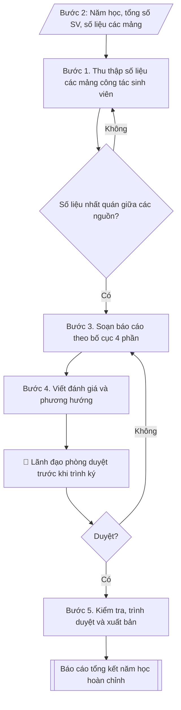

# Soạn báo cáo công tác sinh viên năm học

## Định dạng và file đầu ra

Định dạng đầu ra có thể chọn theo sản phẩm/yêu cầu: .docx, .pdf. Đọc mục “Định dạng bổ sung” trong quy cách đầu ra trước khi chọn.

**Phải tạo file thực tế để tải xuống, không chỉ trả nội dung trong chat.** Định dạng mặc định của skill: **.docx**. Nếu có bảng số liệu nghiệp vụ yêu cầu file bảng tính riêng, tạo thêm Excel theo yêu cầu; không tự tạo file kiểm tra. Không chờ người dùng yêu cầu xuất file lần nữa. Ưu tiên định dạng người dùng chỉ định; đọc quy tắc xuất file tại references/quy-cach-dau-ra.md.

## Quy cách đầu ra và thông tin thiếu
Khi dựng file Word/Excel, áp dụng mục “Thể thức và bảng biểu khi dựng file” trong quy cách đầu ra (cỡ chữ từng thành phần, bảng nhiều trang, số trang, phụ lục). Đọc [quy cách và cấu trúc sản phẩm](references/quy-cach-dau-ra.md) trước khi soạn/xuất. File giao chỉ gồm sản phẩm nghiệp vụ được yêu cầu; kiểm tra nội bộ không xuất kèm. Thiếu thông tin thì giữ nguyên trường/mục và chỗ điền theo mẫu gốc (dòng dấu chấm, dấu gạch hoặc ô trống); không tự điền dữ liệu mẫu, số 0, mã chờ xác minh hay dòng chờ ký. Mẫu chuyên ngành còn áp dụng được ưu tiên về cấu trúc, mã biểu và người ký. Bản đầy đủ: [quy tắc chung](references/quy-tac-chung.md).

Khi người dùng yêu cầu bộ slide (.pptx), đọc mục “Xuất PowerPoint (.pptx) khi được yêu cầu” trong quy cách đầu ra.

Khi báo cáo có số liệu cần so sánh hoặc nêu xu hướng, đọc mục “Biểu đồ và hình trong báo cáo số liệu” trong quy cách đầu ra trước khi vẽ.

## Kiểm soát áp dụng và phê duyệt
Trước khi chạy, xác định `ngay_ap_dung`, `loai_hinh_truong`, `quy_che_noi_bo`, `nguon_du_lieu`, `nguoi_kiem_duyet`; chỉ hỏi thông tin liên quan nghiệp vụ, không dùng giá trị giả định thay dữ liệu bắt buộc. Đối chiếu căn cứ pháp lý với văn bản gốc, hiệu lực, điều khoản áp dụng và chuyển tiếp. Bản đầy đủ: [quy tắc chung](references/quy-tac-chung.md).

## Giới hạn và human gate
AI hỗ trợ chuẩn bị và đối chiếu; cán bộ phụ trách kiểm tra dữ liệu/căn cứ, người có thẩm quyền duyệt và ký. Không đánh dấu đã ký, đã duyệt, đã công bố khi chưa có chứng cứ. Dữ liệu sinh viên, sức khỏe, nhân sự, tài chính chỉ dùng theo mục đích và phân quyền, che thông tin định danh khi dùng ví dụ (Luật 91/2025/QH15, hiệu lực 01/01/2026); không tải dữ liệu lên dịch vụ ngoài khi chưa có quyền. Bản đầy đủ: [quy tắc chung](references/quy-tac-chung.md).

## Khi nào dùng
Khi Phòng Công tác sinh viên cần soạn báo cáo tổng kết năm học: tổng hợp kết quả thực hiện các nhiệm vụ công tác sinh viên trong năm, đánh giá ưu điểm/khuyết điểm, đề xuất phương hướng năm học tiếp theo để trình Ban Giám hiệu và báo cáo cấp trên.

## Đầu vào (Input)

| Trường | Mô tả | Bắt buộc |
|---|---|---|
| `nam_hoc` | Năm học báo cáo (ví dụ: 2025–2026) | Có |
| `tong_sv` | Tổng số sinh viên toàn trường trong năm học | Có |
| `so_lieu_mang` | Số liệu các mảng: học bổng, phân loại rèn luyện, ký túc xá, hoạt động phong trào, hỗ trợ việc làm, y tế – bảo hiểm | Có |
| `su_kien_noi_bat` | Các sự kiện, thành tích nổi bật trong năm | Không |
| `han_che_ton_tai` | Các hạn chế, tồn tại cần nêu trong báo cáo | Không |
| `phuong_huong_nam_sau` | Định hướng, nhiệm vụ trọng tâm năm học tiếp theo | Không |
| `nguoi_ky` | Người ký báo cáo (thường là Trưởng phòng CTSV) | Không (mặc định: Trưởng phòng CTSV) |

## Quy trình

**Bước 1. Thu thập số liệu các mảng công tác sinh viên**
- Làm gì: thu thập số liệu 7 mảng trong năm học: (1) tuyển sinh đầu vào liên quan (số SV nhập
  học, tân sinh viên); (2) học bổng, trợ cấp xã hội, miễn giảm học phí; (3) đánh giá kết quả
  rèn luyện (6 mức: Xuất sắc/Giỏi/Khá/Trung bình/Yếu/Kém); (4) ký túc xá (số SV nội trú, công
  suất, công tác quản lý); (5) hoạt động phong trào, văn hóa – văn nghệ – TDTT, tình nguyện;
  (6) hỗ trợ việc làm, tư vấn hướng nghiệp; (7) y tế học đường, BHYT, an ninh trật tự, phòng
  chống tệ nạn xã hội.
- Dùng input: `nam_hoc`, `tong_sv`, `so_lieu_mang`.
- Vai trò: Chuyên viên Phòng Công tác sinh viên · AI hỗ trợ: chuẩn bị hồ sơ trình ký, nhắc lịch và theo dõi tiến độ · ⏱ ~3–5 ngày làm việc (ước tính)
- Lưu ý nghiệp vụ: ghi rõ nguồn số liệu từng mảng (phòng Đào tạo, phòng Tài chính, ban quản
  lý KTX...); số liệu phải chốt tại thời điểm cuối năm học.
- → Kết quả bước: bộ số liệu thô theo 7 mảng (kèm nguồn từng mảng).

**Bước 2. Đối chiếu, thống nhất số liệu**
- Làm gì: đối chiếu tính nhất quán giữa các nguồn (tổng số SV, số suất học bổng, số SV nội
  trú...); loại bỏ trùng lặp; thống nhất con số cuối cùng đưa vào báo cáo.
- Dùng input: bộ số liệu thô (kết quả bước 1).
- Vai trò: Trưởng Phòng Công tác sinh viên · AI hỗ trợ: đối chiếu tính toán · ⏱ ~2–4 giờ (ước tính)
- Lưu ý nghiệp vụ: chênh lệch giữa các nguồn phải làm rõ và chốt một con số thống nhất; chưa
  thống nhất thì quay lại thu thập bổ sung.
- → Kết quả bước: bảng số liệu các mảng đã đối chiếu, thống nhất.

**Bước 3. Soạn báo cáo theo bố cục 4 phần**
- Làm gì: soạn theo bố cục chuẩn: Phần I – Đặc điểm tình hình (tổng số SV, cơ cấu khóa/ngành/
  hệ đào tạo); Phần II – Kết quả thực hiện từng mảng (số liệu + nhận xét); Phần III – Đánh giá
  chung (ưu điểm, hạn chế và nguyên nhân); Phần IV – Phương hướng, nhiệm vụ năm học tiếp theo.
- Dùng input: `nam_hoc`, `tong_sv`, `su_kien_noi_bat`, bảng số liệu đã thống nhất (kết quả
  bước 2).
- Vai trò: Chuyên viên Phòng Công tác sinh viên · AI hỗ trợ: soạn dự thảo báo cáo theo bố cục 4 phần · ⏱ ~4–6 giờ (ước tính)
- Lưu ý nghiệp vụ: mỗi mảng ở Phần II trình bày số liệu trước, nhận xét sau; số liệu phải
  khớp tuyệt đối với bảng đã thống nhất ở bước 2.
- → Kết quả bước: dự thảo báo cáo đủ 4 phần.

**Bước 4. Viết đánh giá và phương hướng**
- Làm gì: viết ưu điểm (nêu cụ thể kèm số liệu minh chứng, sự kiện nổi bật); viết hạn chế
  thẳng thắn, phân tích nguyên nhân khách quan/chủ quan; xây dựng phương hướng năm sau với
  chỉ tiêu cụ thể, đo lường được.
- Dùng input: `su_kien_noi_bat`, `han_che_ton_tai`, `phuong_huong_nam_sau`, dự thảo báo cáo
  (kết quả bước 3).
- Vai trò: Trưởng Phòng Công tác sinh viên · AI hỗ trợ: soạn dự thảo · ⏱ ~2–4 giờ (ước tính)
- Lưu ý nghiệp vụ: hạn chế không né tránh, nguyên nhân phân rõ chủ quan/khách quan; phương
  hướng phải gắn chỉ tiêu số (tỷ lệ %, số lượng).
- → Kết quả bước: Phần III–IV hoàn chỉnh (đánh giá chung + phương hướng năm học tiếp theo).

**Bước 5. Kiểm tra, trình duyệt và xuất bản**
- Làm gì: kiểm tra số liệu, chính tả, thể thức văn bản hành chính; trình lãnh đạo phòng duyệt
  trước khi trình ký (Human gate); xuất báo cáo hoàn chỉnh file theo định dạng đầu ra của skill, sẵn sàng trình
  ký/xuất file Word.
- Dùng input: `nguoi_ky`, dự thảo báo cáo (kết quả bước 3–4).
- Vai trò: Trưởng Phòng Công tác sinh viên · AI hỗ trợ: rà soát thể thức văn bản · ⏱ ~2–3 giờ (ước tính, chưa kể thời gian chờ duyệt)
- Lưu ý nghiệp vụ: lãnh đạo phòng duyệt chưa đạt thì quay lại chỉnh sửa; chỉ trình ký khi đã
  được duyệt.
- → Kết quả bước: báo cáo tổng kết năm học hoàn chỉnh, sẵn sàng trình ký.

## Luồng quy trình (Workflow)

## Đầu ra

File nghiệp vụ thực tế theo định dạng mặc định ở đầu skill hoặc định dạng người dùng yêu cầu, kèm liên kết tải trong phản hồi cuối.

Sản phẩm nghiệp vụ hoàn chỉnh theo [quy cách và cấu trúc](references/quy-cach-dau-ra.md), giữ các trường chưa có dữ liệu ở trạng thái trống. Không xuất kèm checklist/phụ lục kiểm tra đầu ra.

## Kiểm tra nội bộ trước khi giao

- [ ] Bố cục khớp mẫu áp dụng và cấu trúc tại references/quy-cach-dau-ra.md.
- [ ] Phần II đầy đủ 7 mảng: học bổng/chính sách; đánh giá rèn luyện; ký túc xá; hoạt động phong trào; hỗ trợ việc làm; y tế – bảo hiểm – an ninh (mỗi mảng số liệu trước, nhận xét sau).
- [ ] Năm học, tổng số sinh viên, số liệu các mảng khớp với Input đã cho.
- [ ] Không bịa đặt số liệu, thành tích, sự kiện nổi bật.
- [ ] Đúng thể thức văn bản hành chính: số/ký hiệu, địa danh, ngày tháng năm, chữ ký người ký.
- [ ] Căn cứ pháp lý (Thông tư 10/2016/TT-BGDĐT, quy chế công tác sinh viên của nhà trường) còn hiệu lực.
- [ ] Đã qua Human gate: lãnh đạo phòng duyệt trước khi trình ký; chưa duyệt thì chưa trình ký.
- [ ] Hạn chế nêu thẳng thắn, phân rõ nguyên nhân chủ quan/khách quan; phương hướng có chỉ tiêu số cụ thể, đo lường được; số liệu khớp tuyệt đối với bảng đã đối chiếu, thống nhất.

Tiêu chí đạt = tất cả các ô được đánh dấu.

## Căn cứ & lưu ý
- Báo cáo tổng kết năm học thực hiện theo hướng dẫn của Bộ Giáo dục và Đào tạo và quy chế công tác sinh viên của nhà trường (Thông tư 10/2016/TT-BGDĐT ban hành Quy chế công tác sinh viên đối với chương trình đào tạo đại học hệ chính quy).
- Số liệu các mảng phải được đối chiếu, thống nhất với các đơn vị liên quan trước khi đưa vào báo cáo.
- Không dùng tên thật của trường/cá nhân khi mô phỏng; mọi số liệu trong ví dụ đều giả lập.

## Quản trị phiên bản
- Phiên bản gói `1.3.2` (cập nhật 2026-10-10); hồ sơ đầy đủ tại [references/version.json](references/version.json).
- Người phê duyệt nghiệp vụ: **chưa chỉ định**. Trạng thái: dự thảo nghiệp vụ; kiểm tra pháp lý trước thực thi. Ngày cập nhật không đồng nghĩa mọi văn bản đã được rà soát toàn văn.
- Giấy phép theo LICENSE của kho (bản quyền CES Global). Lịch sử thay đổi: CHANGELOG.md.
