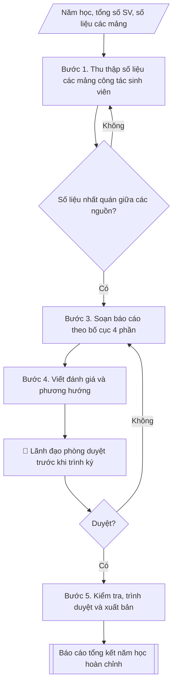

# Skill: Soạn báo cáo công tác sinh viên năm học

## Khi nào dùng
Khi Phòng Công tác sinh viên cần soạn báo cáo tổng kết năm học: tổng hợp kết quả thực hiện các nhiệm vụ công tác sinh viên trong năm, đánh giá ưu điểm/khuyết điểm, đề xuất phương hướng năm học tiếp theo để trình Ban Giám hiệu và báo cáo cấp trên.

## Đầu vào (Input)

| Trường | Mô tả | Bắt buộc |
|---|---|---|
| `nam_hoc` | Năm học báo cáo (ví dụ: 2025–2026) | Có |
| `tong_sv` | Tổng số sinh viên toàn trường trong năm học | Có |
| `so_lieu_mang` | Số liệu các mảng: học bổng, phân loại rèn luyện, ký túc xá, hoạt động phong trào, hỗ trợ việc làm, y tế – bảo hiểm | Có |
| `su_kien_noi_bat` | Các sự kiện, thành tích nổi bật trong năm | Không |
| `han_che_ton_tai` | Các hạn chế, tồn tại cần nêu trong báo cáo | Không |
| `phuong_huong_nam_sau` | Định hướng, nhiệm vụ trọng tâm năm học tiếp theo | Không |
| `nguoi_ky` | Người ký báo cáo (thường là Trưởng phòng CTSV) | Không (mặc định: Trưởng phòng CTSV) |

## Quy trình

**Bước 1. Thu thập số liệu các mảng công tác sinh viên**
- Làm gì: thu thập số liệu 7 mảng trong năm học: (1) tuyển sinh đầu vào liên quan (số SV nhập
  học, tân sinh viên); (2) học bổng, trợ cấp xã hội, miễn giảm học phí; (3) đánh giá kết quả
  rèn luyện (6 mức: Xuất sắc/Giỏi/Khá/Trung bình/Yếu/Kém); (4) ký túc xá (số SV nội trú, công
  suất, công tác quản lý); (5) hoạt động phong trào, văn hóa – văn nghệ – TDTT, tình nguyện;
  (6) hỗ trợ việc làm, tư vấn hướng nghiệp; (7) y tế học đường, BHYT, an ninh trật tự, phòng
  chống tệ nạn xã hội.
- Dùng input: `nam_hoc`, `tong_sv`, `so_lieu_mang`.
- Vai trò: Chuyên viên Phòng Công tác sinh viên · AI hỗ trợ: chuẩn bị hồ sơ trình ký, nhắc lịch và theo dõi tiến độ · ⏱ ~3–5 ngày làm việc (ước tính)
- Lưu ý nghiệp vụ: ghi rõ nguồn số liệu từng mảng (phòng Đào tạo, phòng Tài chính, ban quản
  lý KTX...); số liệu phải chốt tại thời điểm cuối năm học.
- → Kết quả bước: bộ số liệu thô theo 7 mảng (kèm nguồn từng mảng).

**Bước 2. Đối chiếu, thống nhất số liệu**
- Làm gì: đối chiếu tính nhất quán giữa các nguồn (tổng số SV, số suất học bổng, số SV nội
  trú...); loại bỏ trùng lặp; thống nhất con số cuối cùng đưa vào báo cáo.
- Dùng input: bộ số liệu thô (kết quả bước 1).
- Vai trò: Trưởng Phòng Công tác sinh viên · AI hỗ trợ: đối chiếu tính toán · ⏱ ~2–4 giờ (ước tính)
- Lưu ý nghiệp vụ: chênh lệch giữa các nguồn phải làm rõ và chốt một con số thống nhất; chưa
  thống nhất thì quay lại thu thập bổ sung.
- → Kết quả bước: bảng số liệu các mảng đã đối chiếu, thống nhất.

**Bước 3. Soạn báo cáo theo bố cục 4 phần**
- Làm gì: soạn theo bố cục chuẩn: Phần I – Đặc điểm tình hình (tổng số SV, cơ cấu khóa/ngành/
  hệ đào tạo); Phần II – Kết quả thực hiện từng mảng (số liệu + nhận xét); Phần III – Đánh giá
  chung (ưu điểm, hạn chế và nguyên nhân); Phần IV – Phương hướng, nhiệm vụ năm học tiếp theo.
- Dùng input: `nam_hoc`, `tong_sv`, `su_kien_noi_bat`, bảng số liệu đã thống nhất (kết quả
  bước 2).
- Vai trò: Chuyên viên Phòng Công tác sinh viên · AI hỗ trợ: soạn dự thảo báo cáo theo bố cục 4 phần · ⏱ ~4–6 giờ (ước tính)
- Lưu ý nghiệp vụ: mỗi mảng ở Phần II trình bày số liệu trước, nhận xét sau; số liệu phải
  khớp tuyệt đối với bảng đã thống nhất ở bước 2.
- → Kết quả bước: dự thảo báo cáo đủ 4 phần.

**Bước 4. Viết đánh giá và phương hướng**
- Làm gì: viết ưu điểm (nêu cụ thể kèm số liệu minh chứng, sự kiện nổi bật); viết hạn chế
  thẳng thắn, phân tích nguyên nhân khách quan/chủ quan; xây dựng phương hướng năm sau với
  chỉ tiêu cụ thể, đo lường được.
- Dùng input: `su_kien_noi_bat`, `han_che_ton_tai`, `phuong_huong_nam_sau`, dự thảo báo cáo
  (kết quả bước 3).
- Vai trò: Trưởng Phòng Công tác sinh viên · AI hỗ trợ: soạn dự thảo · ⏱ ~2–4 giờ (ước tính)
- Lưu ý nghiệp vụ: hạn chế không né tránh, nguyên nhân phân rõ chủ quan/khách quan; phương
  hướng phải gắn chỉ tiêu số (tỷ lệ %, số lượng).
- → Kết quả bước: Phần III–IV hoàn chỉnh (đánh giá chung + phương hướng năm học tiếp theo).

**Bước 5. Kiểm tra, trình duyệt và xuất bản**
- Làm gì: kiểm tra số liệu, chính tả, thể thức văn bản hành chính; trình lãnh đạo phòng duyệt
  trước khi trình ký (Human gate); xuất báo cáo hoàn chỉnh định dạng markdown, sẵn sàng trình
  ký/chuyển Word.
- Dùng input: `nguoi_ky`, dự thảo báo cáo (kết quả bước 3–4).
- Vai trò: Trưởng Phòng Công tác sinh viên · AI hỗ trợ: rà soát thể thức văn bản · ⏱ ~2–3 giờ (ước tính, chưa kể thời gian chờ duyệt)
- Lưu ý nghiệp vụ: lãnh đạo phòng duyệt chưa đạt thì quay lại chỉnh sửa; chỉ trình ký khi đã
  được duyệt.
- → Kết quả bước: báo cáo tổng kết năm học hoàn chỉnh, sẵn sàng trình ký.

## Luồng quy trình (Workflow)


## Đầu ra (Output)
- Báo cáo tổng kết công tác sinh viên năm học hoàn chỉnh (định dạng markdown, sẵn sàng trình ký/chuyển Word), gồm đầy đủ số liệu các mảng, đánh giá ưu/khuyết điểm và phương hướng năm sau.

**Cấu trúc output chuẩn:** khung cố định của Báo cáo tổng kết công tác sinh viên năm học:
1. Tiêu đề hành chính: Quốc hiệu – Tiêu ngữ; tên đơn vị; số, ký hiệu; địa danh, ngày tháng
   năm.
2. Tên báo cáo: "BÁO CÁO" + "Tổng kết công tác sinh viên năm học ..." (`nam_hoc`) + Kính gửi
   Ban Giám hiệu.
3. I. Đặc điểm tình hình (tổng số SV, cơ cấu khóa/ngành/hệ đào tạo, biến động so với năm trước).
4. II. Kết quả thực hiện (từng mảng: số liệu + nhận xét — học bổng/chính sách; rèn luyện;
   ký túc xá; phong trào; hỗ trợ việc làm; y tế – bảo hiểm – an ninh).
5. III. Đánh giá chung (1. Ưu điểm kèm số liệu minh chứng; 2. Hạn chế và nguyên nhân khách
   quan/chủ quan).
6. IV. Phương hướng, nhiệm vụ năm học tiếp theo (từng nhiệm vụ kèm chỉ tiêu cụ thể).
7. Đoạn kết (kính trình Ban Giám hiệu xem xét) + Nơi nhận + chữ ký (`nguoi_ky`).

## Checklist nghiệm thu

- [ ] Đủ 7 phần theo "Cấu trúc output chuẩn": tiêu đề hành chính; tên báo cáo + Kính gửi; I. Đặc điểm tình hình; II. Kết quả thực hiện; III. Đánh giá chung; IV. Phương hướng; đoạn kết + Nơi nhận + chữ ký.
- [ ] Phần II đầy đủ 7 mảng: học bổng/chính sách; đánh giá rèn luyện; ký túc xá; hoạt động phong trào; hỗ trợ việc làm; y tế – bảo hiểm – an ninh (mỗi mảng số liệu trước, nhận xét sau).
- [ ] Năm học, tổng số sinh viên, số liệu các mảng khớp với Input đã cho.
- [ ] Không bịa đặt số liệu, thành tích, sự kiện nổi bật.
- [ ] Đúng thể thức văn bản hành chính: số/ký hiệu, địa danh, ngày tháng năm, chữ ký người ký.
- [ ] Căn cứ pháp lý (Thông tư 10/2016/TT-BGDĐT, quy chế công tác sinh viên của nhà trường) còn hiệu lực.
- [ ] Đã qua Human gate: lãnh đạo phòng duyệt trước khi trình ký; chưa duyệt thì chưa trình ký.
- [ ] Hạn chế nêu thẳng thắn, phân rõ nguyên nhân chủ quan/khách quan; phương hướng có chỉ tiêu số cụ thể, đo lường được; số liệu khớp tuyệt đối với bảng đã đối chiếu, thống nhất.

Tiêu chí đạt = tất cả các ô được đánh dấu.


## Ví dụ mô phỏng (dữ liệu giả lập)

> Tất cả tên trường, cá nhân, số liệu dưới đây đều là **giả lập**, không liên quan tổ chức/cá nhân có thật.

### Input mẫu

| Trường | Giá trị |
|---|---|
| `nam_hoc` | 2025–2026 |
| `tong_sv` | 12.800 sinh viên |
| `so_lieu_mang` | Học bổng: 1.240 suất; Rèn luyện: Xuất sắc 8,5%, Giỏi 32%, Khá 41%, TB 15%, Yếu/Kém 3,5%; KTX: 3.150 SV nội trú; Phong trào: 46 hoạt động cấp trường; Việc làm: 82,4% SV tốt nghiệp có việc sau 12 tháng; BHYT: 98,6% SV tham gia |
| `su_kien_noi_bat` | Đội tuyển Olympic Tin học đạt giải Nhất toàn quốc; 02 SV đạt danh hiệu "Sinh viên 5 tốt" cấp Trung ương |

### Output mẫu

```
TRƯỜNG ĐẠI HỌC A               CỘNG HÒA XÃ HỘI CHỦ NGHĨA VIỆT NAM
PHÒNG CÔNG TÁC SINH VIÊN                    Độc lập – Tự do – Hạnh phúc
      Số: 215/BC-ĐHA-CTSV
                                                              Thành phố C, ngày 20 tháng 8 năm 2026

                     BÁO CÁO
   Tổng kết công tác sinh viên năm học 2025–2026
             (Số liệu trong báo cáo này là dữ liệu giả lập)

Kính gửi: Ban Giám hiệu Trường Đại học A

I. ĐẶC ĐIỂM TÌNH HÌNH
Năm học 2025–2026, toàn trường có 12.800 sinh viên (giả lập), gồm 3.250 tân sinh viên
khóa 2025 và 9.550 sinh viên các khóa trước, đào tạo 12 ngành thuộc 04 khoa.
Số lượng sinh viên tăng 4,1% so với năm học trước, đặt ra yêu cầu cao hơn đối với
công tác quản lý, hỗ trợ và phục vụ sinh viên.

II. KẾT QUẢ THỰC HIỆN

1. Công tác học bổng, chính sách sinh viên
- Cấp 1.240 suất học bổng khuyến khích học tập với tổng kinh phí 4,96 tỷ đồng (giả lập);
  100% sinh viên thuộc diện chính sách được miễn, giảm học phí và hưởng trợ cấp xã hội
  đúng quy định, đúng thời hạn.
- Hỗ trợ đột xuất cho 86 sinh viên có hoàn cảnh khó khăn với tổng số tiền 258 triệu
  đồng (giả lập).

2. Đánh giá kết quả rèn luyện sinh viên
- Xuất sắc: 8,5%; Giỏi: 32,0%; Khá: 41,0%; Trung bình: 15,0%; Yếu/Kém: 3,5% (giả lập).
- Tỷ lệ sinh viên xếp loại rèn luyện từ Khá trở lên đạt 81,5%, tăng 2,3% so với năm trước.

3. Công tác ký túc xá
- Ký túc xá tiếp nhận 3.150 sinh viên nội trú (giả lập), đạt 96,8% công suất thiết kế;
  100% sinh viên năm thứ nhất có nhu cầu được bố trí chỗ ở.
- Triển khai đăng ký chỗ ở trực tuyến, rút ngắn thời gian xét duyệt còn 05 ngày làm việc.
- Không xảy ra vụ việc mất an ninh trật tự nghiêm trọng trong khu nội trú.

4. Hoạt động phong trào sinh viên
- Tổ chức 46 hoạt động văn hóa – văn nghệ – thể dục thể thao cấp trường (giả lập),
  thu hút trên 9.000 lượt sinh viên tham gia.
- Nổi bật: Đội tuyển Olympic Tin học đạt giải Nhất toàn quốc; 02 sinh viên đạt danh
  hiệu "Sinh viên 5 tốt" cấp Trung ương (giả lập).
- Chiến dịch tình nguyện hè huy động 620 sinh viên tham gia tại 04 địa bàn.

5. Hỗ trợ việc làm, tư vấn hướng nghiệp
- Tổ chức 02 ngày hội việc làm với 85 doanh nghiệp tham gia, trên 3.800 lượt sinh viên
  tham dự (giả lập).
- Kết quả khảo sát: 82,4% sinh viên tốt nghiệp năm 2025 có việc làm sau 12 tháng;
  88,0% làm đúng hoặc gần ngành đào tạo (giả lập).

6. Y tế học đường, bảo hiểm và an ninh trật tự
- 98,6% sinh viên tham gia bảo hiểm y tế (giả lập); trạm y tế khám, sơ cấp cứu
  1.120 lượt sinh viên trong năm.
- Phối hợp tuyên truyền phòng chống ma túy, tệ nạn xã hội cho 100% tân sinh viên;
  không phát sinh sinh viên vi phạm pháp luật bị xử lý hình sự.

III. ĐÁNH GIÁ CHUNG

1. Ưu điểm
- Các chế độ chính sách cho sinh viên được thực hiện đầy đủ, kịp thời, đúng đối tượng.
- Công tác quản lý ký túc xá có nhiều cải tiến (đăng ký trực tuyến, rút ngắn thời gian
  xét duyệt); an ninh trật tự được giữ vững.
- Hoạt động phong trào đa dạng, đạt nhiều thành tích cấp quốc gia, tạo môi trường
  rèn luyện toàn diện cho sinh viên.

2. Hạn chế và nguyên nhân
- Tỷ lệ sinh viên xếp loại rèn luyện Yếu/Kém (3,5%) còn cao; nguyên nhân chủ quan là
  một bộ phận sinh viên chưa chủ động trong học tập và rèn luyện.
- Công suất ký túc xá gần kín (96,8%), chưa đáp ứng hết nhu cầu của sinh viên năm
  thứ hai trở lên; nguyên nhân khách quan do quỹ phòng có hạn.

IV. PHƯƠNG HƯỚNG NĂM HỌC 2026–2027
1. Phấn đấu tỷ lệ sinh viên xếp loại rèn luyện từ Khá trở lên đạt 84%; giảm tỷ lệ
   Yếu/Kém xuống dưới 3%.
2. Nâng tỷ lệ sinh viên tham gia bảo hiểm y tế lên 99,5%; duy trì 100% sinh viên
   diện chính sách được hưởng đầy đủ chế độ.
3. Mở rộng quy mô ngày hội việc làm, phấn đấu tỷ lệ có việc làm sau 12 tháng tốt
   nghiệp đạt 85%.
4. Triển khai giai đoạn 2 hệ thống quản lý ký túc xá trực tuyến, nghiên cứu phương án
   tăng công suất chỗ ở nội trú.

Trên đây là báo cáo tổng kết công tác sinh viên năm học 2025–2026 của Phòng Công tác
sinh viên, kính trình Ban Giám hiệu xem xét./.

Nơi nhận:                                           TRƯỞNG PHÒNG
- Ban Giám hiệu (báo cáo);                             (đã ký)
- Lưu: VT, CTSV.

                                             ThS. Đỗ Thị A
                                   (Tên cá nhân trong ví dụ là giả lập)
```

## Căn cứ & lưu ý
- Báo cáo tổng kết năm học thực hiện theo hướng dẫn của Bộ Giáo dục và Đào tạo và quy chế công tác sinh viên của nhà trường (Thông tư 10/2016/TT-BGDĐT ban hành Quy chế công tác sinh viên đối với chương trình đào tạo đại học hệ chính quy).
- Số liệu các mảng phải được đối chiếu, thống nhất với các đơn vị liên quan trước khi đưa vào báo cáo.
- Không dùng tên thật của trường/cá nhân khi mô phỏng; mọi số liệu trong ví dụ đều giả lập.
