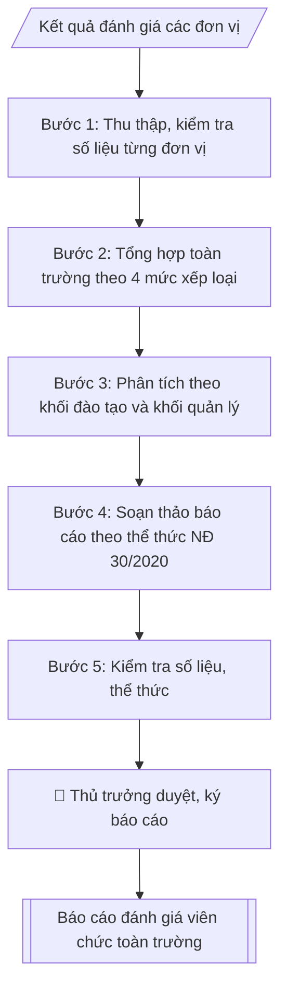

# Tổng hợp kết quả đánh giá viên chức toàn trường

## Định dạng và file đầu ra
Định dạng đầu ra có thể chọn theo sản phẩm/yêu cầu: .docx, .pdf. Đọc mục “Định dạng bổ sung” trong quy cách đầu ra trước khi chọn.

**Phải tạo file thực tế để tải xuống, không chỉ trả nội dung trong chat.** Định dạng mặc định của skill: **.docx**. Nếu có bảng số liệu nghiệp vụ yêu cầu file bảng tính riêng, tạo thêm Excel theo yêu cầu; không tự tạo file kiểm tra. Không chờ người dùng yêu cầu xuất file lần nữa. Ưu tiên định dạng người dùng chỉ định; đọc quy tắc xuất file tại references/quy-cach-dau-ra.md.

## Quy cách đầu ra và thông tin thiếu
Đọc [quy cách và cấu trúc sản phẩm](references/quy-cach-dau-ra.md) trước khi soạn/xuất. File giao chỉ gồm sản phẩm nghiệp vụ được yêu cầu; kiểm tra nội bộ không xuất kèm. Thiếu thông tin thì giữ nguyên trường/mục và chỗ điền theo mẫu gốc (dòng dấu chấm, dấu gạch hoặc ô trống); không tự điền dữ liệu mẫu, số 0, mã chờ xác minh hay dòng chờ ký. Mẫu chuyên ngành còn áp dụng được ưu tiên về cấu trúc, mã biểu và người ký. Bản đầy đủ: [quy tắc chung](references/quy-tac-chung.md).

## Kiểm soát áp dụng và phê duyệt
Trước khi chạy, xác định `ngay_ap_dung`, `loai_hinh_truong`, `quy_che_noi_bo`, `nguon_du_lieu`, `nguoi_kiem_duyet`; chỉ hỏi thông tin liên quan nghiệp vụ, không dùng giá trị giả định thay dữ liệu bắt buộc. Đối chiếu căn cứ pháp lý với văn bản gốc, hiệu lực, điều khoản áp dụng và chuyển tiếp. Bản đầy đủ: [quy tắc chung](references/quy-tac-chung.md).

Nếu có cập nhật pháp lý dưới đây, đọc [căn cứ và điều kiện áp dụng](references/phap-ly.md) trước khi làm. Quy trình dưới đây giữ nghiệp vụ từ bản gốc; mọi viện dẫn văn bản, mẫu biểu, điều khoản phải theo căn cứ đã chọn trong phap-ly.md, không theo văn bản cũ.

## Giới hạn và human gate
AI hỗ trợ chuẩn bị và đối chiếu; cán bộ phụ trách kiểm tra dữ liệu/căn cứ, người có thẩm quyền duyệt và ký. Không đánh dấu đã ký, đã duyệt, đã công bố khi chưa có chứng cứ. Dữ liệu sinh viên, sức khỏe, nhân sự, tài chính chỉ dùng theo mục đích và phân quyền, che thông tin định danh khi dùng ví dụ (Luật 91/2025/QH15, hiệu lực 01/01/2026); không tải dữ liệu lên dịch vụ ngoài khi chưa có quyền. Bản đầy đủ: [quy tắc chung](references/quy-tac-chung.md).

## Khi nào dùng
Sau khi các đơn vị hoàn thành đánh giá viên chức (tháng 11–12), Phòng Tổ chức – Cán bộ
tổng hợp toàn trường để báo cáo Hiệu trưởng, Hội đồng trường và gửi cơ quan chủ quản
(nếu có yêu cầu), phục vụ công tác quy hoạch, bổ nhiệm, nâng lương, khen thưởng.

## Đầu vào (Input)
| Trường | Mô tả | Bắt buộc |
|---|---|---|
| `nam_danh_gia` | Năm đánh giá | Có |
| `ket_qua_don_vi` | Bảng kết quả từng đơn vị: tổng số VC, số lượng theo 4 mức xếp loại (Xuất sắc / Tốt / Hoàn thành / Không hoàn thành) | Có |
| `tong_so_vc` | Tổng số viên chức toàn trường trong diện đánh giá | Có |
| `so_vc_mien_dg` | Số viên chức được miễn/không đánh giá (nghỉ thai sản, nghỉ dài ngày...) + lý do | Không |
| `diem_noi_bat` | Các trường hợp xuất sắc tiêu biểu, đơn vị làm tốt | Không |
| `ton_tai` | Tồn tại, hạn chế trong đợt đánh giá | Không |
| `kien_nghi` | Kiến nghị của Phòng TCCB | Không |
| `nguoi_ky` | Hiệu trưởng / Trưởng phòng TCCB (thừa lệnh) | Có |

## Quy trình
**Ràng buộc pháp lý khi thực hiện** (trích references/phap-ly.md; đối chiếu toàn văn và hiệu lực tại ngày nghiệp vụ):
- Luật 129/2025/QH15; Nghị định 259/2026/NĐ-CP; phạm vi: Viên chức đơn vị sự nghiệp công lập; kiểm tra chuyển tiếp và quy định riêng về nhà giáo: Cập nhật căn cứ tuyển dụng, hợp đồng làm việc, bổ nhiệm, điều động và đào tạo viên chức. Không tái sử dụng số điều hoặc mẫu phiếu của NĐ 115. Phải yêu cầu ngày tuyển dụng, ngày phê duyệt kế hoạch, loại hợp đồng, trạng thái hồ sơ và bản văn NĐ 259 để chọn điều khoản chuyển tiếp; không tự áp dụng điều22 Luật Viên chức2010. Các văn bản cũ chỉ là căn cứ lịch sử khi chuyển tiếp cho phép.
- Nghị định 233/2026/NĐ-CP; phạm vi: Đánh giá đơn vị sự nghiệp công lập và viên chức: Dùng khung tiêu chí và quy chế đánh giá của đơn vị; bổ sung dữ liệu theo dõi/chấm điểm tháng hoặc quý, nhiệm vụ được giao, sản phẩm công việc, minh chứng, kết quả giám sát. Không tạo thang điểm từ trí nhớ, không tiếp tục ghi Mẫu03 của NĐ 90 là mẫu hiện hành. Tính điểm và xếp loại phải từ tiêu chí được phê duyệt; báo cáo liệt kê thiếu minh chứng.
- Luật Nhà giáo; Nghị định 93/2026/NĐ-CP; khoản 9 Điều 62 NĐ 259/2026; phạm vi: Viên chức là nhà giáo: Thêm input đối tượng là nhà giáo hay viên chức khác. Nếu pháp luật nhà giáo có quy định khác về thẩm quyền, tiêu chuẩn, điều kiện, trình tự, thủ tục tuyển dụng/sử dụng/quản lý, áp dụng quy định nhà giáo và hướng dẫn Bộ GDĐT thay vì quy tắc chung NĐ 259.
- Trước Bước 1: chọn căn cứ theo đối tượng, loại hình trường và chuyển tiếp; lập bảng văn bản / điều khoản / lý do áp dụng / bằng chứng. Thiếu văn bản gốc hoặc điều khoản thì ghi nhận nội bộ [CẦN XÁC MINH] (không đưa vào file giao), để trống phần tương ứng, chưa kết luận tuân thủ.
- Các con số, thời hạn, số điều, số mức xếp loại, hệ số và mẫu biểu nêu trong các bước dưới đây được giữ từ quy trình gốc (trước cập nhật pháp lý); chỉ dùng khi đã đối chiếu đúng với căn cứ đã chọn, khác thì theo căn cứ. Danh sách điểm cần đối chiếu: docs/DIEM_CAN_DOI_CHIEU_PHAP_LY.md.

**Bước 1. Thu thập và kiểm tra số liệu từng đơn vị**
- Làm gì: thu thập bảng kết quả đánh giá của từng đơn vị (tổng số VC, số lượng theo 4 mức xếp loại); đối chiếu tổng số viên chức của đơn vị với danh sách quản lý biên chế; kiểm tra tổng 4 mức xếp loại phải bằng tổng số VC được đánh giá của đơn vị (không tính số được miễn đánh giá); ghi rõ lý do miễn đánh giá từng trường hợp (nghỉ thai sản, nghỉ ốm dài ngày...).
- Dùng input: `ket_qua_don_vi`, `tong_so_vc`, `so_vc_mien_dg`.
- Vai trò: Chuyên viên Phòng TCCB (Trưởng phòng kiểm tra lại) · AI hỗ trợ: quét lỗi theo checklist · ⏱ ~15–30 phút (ước tính)
- Lưu ý nghiệp vụ: số liệu chênh lệch thì trả về đơn vị đối chiếu lại trước khi tổng hợp — không "vá" số liệu cho khớp; trường hợp miễn đánh giá phải có lý do cụ thể, không gộp chung.
- → Kết quả bước: bộ số liệu từng đơn vị đã kiểm tra khớp.

**Bước 2. Tổng hợp toàn trường theo 4 mức xếp loại**
- Làm gì: cộng dồn số liệu các đơn vị theo 4 mức xếp loại (Xuất sắc / Tốt / Hoàn thành / Không hoàn thành); tính tỷ lệ % từng mức trên tổng số VC được đánh giá; kiểm tra tổng tỷ lệ cộng đủ 100%; tách riêng số liệu viên chức quản lý và viên chức không quản lý (nếu có số liệu).
- Dùng input: `ket_qua_don_vi`, `tong_so_vc`, `so_vc_mien_dg`.
- Vai trò: Chuyên viên Phòng TCCB · AI hỗ trợ: tổng hợp và chuẩn hóa dữ liệu · ⏱ ~20–45 phút (ước tính)
- Lưu ý nghiệp vụ: tỷ lệ làm tròn 1 chữ số thập phân; sai số do làm tròn phải điều chỉnh để tổng đúng 100%; mẫu số tính tỷ lệ là số VC được đánh giá (đã trừ số miễn đánh giá).
- → Kết quả bước: bảng tổng hợp toàn trường (số lượng + tỷ lệ theo 4 mức xếp loại).

**Bước 3. Phân tích theo khối đơn vị**
- Làm gì: chia số liệu thành khối đào tạo (các khoa) và khối quản lý – phục vụ (phòng, ban, trung tâm); tính tỷ lệ từng mức trong mỗi khối; chỉ ra đơn vị có tỷ lệ Xuất sắc/Tốt cao nhất, đơn vị có trường hợp Không hoàn thành (ghi rõ lý do: vi phạm kỷ luật / hoàn thành dưới 80% nhiệm vụ); ghi nhận các điểm nổi bật (danh hiệu thi đua, đơn vị làm tốt).
- Dùng input: `ket_qua_don_vi`, `diem_noi_bat`.
- Vai trò: Chuyên viên Phòng TCCB · AI hỗ trợ: tính toán, kiểm tra số học · ⏱ ~20–30 phút (ước tính)
- Lưu ý nghiệp vụ: trường hợp Không hoàn thành nhiệm vụ phải ghi rõ lý do; không nêu tên cá nhân cụ thể trong báo cáo tổng hợp.
- → Kết quả bước: bảng phân tích theo khối + nhận xét điểm nổi bật.

**Bước 4. Soạn thảo báo cáo theo thể thức NĐ 30/2020**
- Làm gì: soạn báo cáo hành chính đầy đủ các phần: mở đầu (căn cứ văn bản hiện hành nêu tại phap-ly.md, kế hoạch đánh giá của trường; mục đích báo cáo); nội dung: I. Kết quả tổng hợp (tổng số VC trong diện/miễn đánh giá, bảng 4 mức xếp loại, kết quả theo khối đơn vị), II. Đánh giá chung, III. Tồn tại, hạn chế, IV. Kiến nghị; nơi nhận; chữ ký.
- Dùng input: `nam_danh_gia`, `diem_noi_bat`, `ton_tai`, `kien_nghi`, `nguoi_ky` và kết quả các bước 1–3.
- Vai trò: Chuyên viên Phòng TCCB · AI hỗ trợ: soạn dự thảo đúng thể thức · ⏱ ~20–45 phút (ước tính)
- Lưu ý nghiệp vụ: kiến nghị phải cụ thể, gắn trách nhiệm thực hiện và thời hạn áp dụng (VD: ban hành hướng dẫn chấm điểm kèm minh chứng bắt buộc từ đợt đánh giá năm sau).
- → Kết quả bước: dự thảo báo cáo.

**Bước 5. Kiểm tra và chuẩn bị trình duyệt**
- Làm gì: đối chiếu số liệu trong bảng tổng hợp với chi tiết từng đơn vị (khớp 100%); kiểm tra tỷ lệ % cộng đủ 100%; kiểm tra thể thức, chính tả, số/ký hiệu văn bản; hoàn thiện để trình thủ trưởng duyệt, ký.
- Dùng input: `nguoi_ky`.
- Vai trò: Chuyên viên Phòng TCCB chuẩn bị, Hiệu trưởng phê duyệt · AI hỗ trợ: tổng hợp hồ sơ, soạn phiếu trình/tờ trình đầy đủ · ⏱ ~15–30 phút chuẩn bị + chờ duyệt (ước tính)
- Lưu ý nghiệp vụ: báo cáo phải hoàn thành trước 31/12 để làm căn cứ nâng lương, khen thưởng năm sau; sai một con số trong bảng tổng hợp thì phải sửa đồng thời cả bảng chi tiết.
- → Kết quả bước: báo cáo đã kiểm tra + bảng tổng hợp số liệu (trình duyệt tại Human gate; sau khi ký: gửi các đơn vị liên quan, lưu hồ sơ).

## Luồng quy trình (Workflow)

## Đầu ra
- Báo cáo tổng hợp kết quả đánh giá viên chức toàn trường (đúng thể thức báo cáo).
- Bảng tổng hợp số liệu theo đơn vị và theo 4 mức xếp loại.

File nghiệp vụ thực tế theo định dạng mặc định ở đầu skill hoặc định dạng người dùng yêu cầu, kèm liên kết tải trong phản hồi cuối.

Sản phẩm nghiệp vụ hoàn chỉnh theo [quy cách và cấu trúc](references/quy-cach-dau-ra.md), giữ các trường chưa có dữ liệu ở trạng thái trống. Không xuất kèm checklist/phụ lục kiểm tra đầu ra.

## Kiểm tra nội bộ trước khi giao
Các tiêu chí sau dùng để tự đối chiếu; không sao chép vào file xuất. Mục thiếu dữ liệu được để trống, không đánh dấu đã đạt hoặc đã duyệt.

- [ ] Đủ các phần và đúng bố cục theo cấu trúc tại references/quy-cach-dau-ra.md (không theo cấu trúc của bản gốc).
- [ ] Nội dung và số liệu trong output khớp đúng với Input đã cho (không thêm, bớt hay suy diễn)
- [ ] Không bịa đặt số liệu, minh chứng, trích dẫn hay căn cứ
- [ ] Đúng thể thức và cấu trúc theo references/quy-cach-dau-ra.md và căn cứ đã chọn tại references/phap-ly.md.
- [ ] Căn cứ pháp lý được trích dẫn đầy đủ và còn hiệu lực
- [ ] Đã qua Human gate: người có thẩm quyền đã kiểm tra/duyệt trước khi phát hành
- [ ] Trường hợp miễn đánh giá phải có lý do cụ thể, không gộp chung
- [ ] Sai số do làm tròn phải điều chỉnh để tổng đúng 100%
- [ ] Trường hợp Không hoàn thành nhiệm vụ phải ghi rõ lý do

## Căn cứ & lưu ý
- Căn cứ hiện hành: xem [căn cứ và điều kiện áp dụng](references/phap-ly.md); phải đối chiếu văn bản gốc, hiệu lực và chuyển tiếp tại ngày nghiệp vụ.
- Nghị định 30/2020/NĐ-CP về thể thức văn bản (áp dụng cho báo cáo hành chính).
- Lưu ý: số liệu 4 mức xếp loại của từng đơn vị cộng lại phải khớp tổng số VC được đánh giá;
  trường hợp Không hoàn thành nhiệm vụ phải ghi rõ lý do; báo cáo hoàn thành trước 31/12
  để làm căn cứ nâng lương, khen thưởng năm sau.
- Không dùng tên thật của trường/cá nhân khi mô phỏng.

## Tư liệu đối chiếu
Bản gốc trước cập nhật pháp lý (kèm ví dụ giả lập) lưu tại `references/quy-trinh-lich-su.md`, chỉ để đối chiếu hồ sơ lịch sử; không dùng căn cứ, mẫu hay số liệu trong đó làm chỉ dẫn hiện hành.

## Quản trị phiên bản
- Phiên bản gói `1.3.2` (cập nhật 2026-10-10); hồ sơ đầy đủ tại [references/version.json](references/version.json).
- Người phê duyệt nghiệp vụ: **chưa chỉ định**. Trạng thái: dự thảo nghiệp vụ; kiểm tra pháp lý trước thực thi. Ngày cập nhật không đồng nghĩa mọi văn bản đã được rà soát toàn văn.
- Giấy phép theo LICENSE của kho (bản quyền CES Global). Lịch sử thay đổi: CHANGELOG.md.
