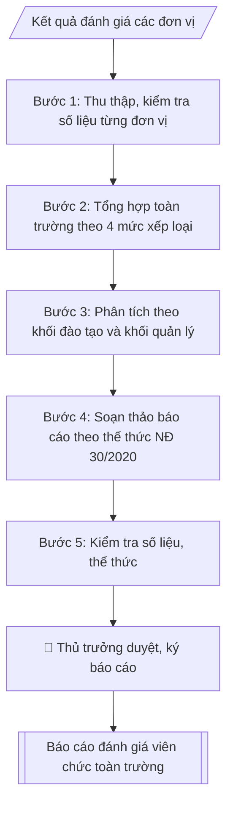

# Tư liệu lịch sử – không phải quy trình hiện hành

Nội dung từ phiên bản nguồn trước 1.1.0, giữ để đối chiếu dữ liệu đầu vào và thay đổi; căn cứ, điều kiện, mẫu và ví dụ có thể đã lỗi thời. Không dùng để thực hiện nghiệp vụ hiện tại.

## Khi nào dùng
Sau khi các đơn vị hoàn thành đánh giá viên chức (tháng 11–12), Phòng Tổ chức – Cán bộ
tổng hợp toàn trường để báo cáo Hiệu trưởng, Hội đồng trường và gửi cơ quan chủ quản
(nếu có yêu cầu), phục vụ công tác quy hoạch, bổ nhiệm, nâng lương, khen thưởng.

## Đầu vào (Input)

| Trường | Mô tả | Bắt buộc |
|---|---|---|
| `nam_danh_gia` | Năm đánh giá | Có |
| `ket_qua_don_vi` | Bảng kết quả từng đơn vị: tổng số VC, số lượng theo 4 mức xếp loại (Xuất sắc / Tốt / Hoàn thành / Không hoàn thành) | Có |
| `tong_so_vc` | Tổng số viên chức toàn trường trong diện đánh giá | Có |
| `so_vc_mien_dg` | Số viên chức được miễn/không đánh giá (nghỉ thai sản, nghỉ dài ngày...) + lý do | Không |
| `diem_noi_bat` | Các trường hợp xuất sắc tiêu biểu, đơn vị làm tốt | Không |
| `ton_tai` | Tồn tại, hạn chế trong đợt đánh giá | Không |
| `kien_nghi` | Kiến nghị của Phòng TCCB | Không |
| `nguoi_ky` | Hiệu trưởng / Trưởng phòng TCCB (thừa lệnh) | Có |

## Quy trình

**Bước 1. Thu thập và kiểm tra số liệu từng đơn vị**
- Làm gì: thu thập bảng kết quả đánh giá của từng đơn vị (tổng số VC, số lượng theo 4 mức xếp loại); đối chiếu tổng số viên chức của đơn vị với danh sách quản lý biên chế; kiểm tra tổng 4 mức xếp loại phải bằng tổng số VC được đánh giá của đơn vị (không tính số được miễn đánh giá); ghi rõ lý do miễn đánh giá từng trường hợp (nghỉ thai sản, nghỉ ốm dài ngày...).
- Dùng input: `ket_qua_don_vi`, `tong_so_vc`, `so_vc_mien_dg`.
- Vai trò: Chuyên viên Phòng TCCB (Trưởng phòng kiểm tra lại) · AI hỗ trợ: quét lỗi theo checklist · ⏱ ~15–30 phút (ước tính)
- Lưu ý nghiệp vụ: số liệu chênh lệch thì trả về đơn vị đối chiếu lại trước khi tổng hợp — không "vá" số liệu cho khớp; trường hợp miễn đánh giá phải có lý do cụ thể, không gộp chung.
- → Kết quả bước: bộ số liệu từng đơn vị đã kiểm tra khớp.

**Bước 2. Tổng hợp toàn trường theo 4 mức xếp loại**
- Làm gì: cộng dồn số liệu các đơn vị theo 4 mức xếp loại (Xuất sắc / Tốt / Hoàn thành / Không hoàn thành); tính tỷ lệ % từng mức trên tổng số VC được đánh giá; kiểm tra tổng tỷ lệ cộng đủ 100%; tách riêng số liệu viên chức quản lý và viên chức không quản lý (nếu có số liệu).
- Dùng input: `ket_qua_don_vi`, `tong_so_vc`, `so_vc_mien_dg`.
- Vai trò: Chuyên viên Phòng TCCB · AI hỗ trợ: tổng hợp và chuẩn hóa dữ liệu · ⏱ ~20–45 phút (ước tính)
- Lưu ý nghiệp vụ: tỷ lệ làm tròn 1 chữ số thập phân; sai số do làm tròn phải điều chỉnh để tổng đúng 100%; mẫu số tính tỷ lệ là số VC được đánh giá (đã trừ số miễn đánh giá).
- → Kết quả bước: bảng tổng hợp toàn trường (số lượng + tỷ lệ theo 4 mức xếp loại).

**Bước 3. Phân tích theo khối đơn vị**
- Làm gì: chia số liệu thành khối đào tạo (các khoa) và khối quản lý – phục vụ (phòng, ban, trung tâm); tính tỷ lệ từng mức trong mỗi khối; chỉ ra đơn vị có tỷ lệ Xuất sắc/Tốt cao nhất, đơn vị có trường hợp Không hoàn thành (ghi rõ lý do: vi phạm kỷ luật / hoàn thành dưới 80% nhiệm vụ); ghi nhận các điểm nổi bật (danh hiệu thi đua, đơn vị làm tốt).
- Dùng input: `ket_qua_don_vi`, `diem_noi_bat`.
- Vai trò: Chuyên viên Phòng TCCB · AI hỗ trợ: tính toán, kiểm tra số học · ⏱ ~20–30 phút (ước tính)
- Lưu ý nghiệp vụ: trường hợp Không hoàn thành nhiệm vụ phải ghi rõ lý do; không nêu tên cá nhân cụ thể trong báo cáo tổng hợp.
- → Kết quả bước: bảng phân tích theo khối + nhận xét điểm nổi bật.

**Bước 4. Soạn thảo báo cáo theo thể thức NĐ 30/2020**
- Làm gì: soạn báo cáo hành chính đầy đủ các phần: mở đầu (căn cứ NĐ 90/2020, kế hoạch đánh giá của trường; mục đích báo cáo); nội dung: I. Kết quả tổng hợp (tổng số VC trong diện/miễn đánh giá, bảng 4 mức xếp loại, kết quả theo khối đơn vị), II. Đánh giá chung, III. Tồn tại, hạn chế, IV. Kiến nghị; nơi nhận; chữ ký.
- Dùng input: `nam_danh_gia`, `diem_noi_bat`, `ton_tai`, `kien_nghi`, `nguoi_ky` và kết quả các bước 1–3.
- Vai trò: Chuyên viên Phòng TCCB · AI hỗ trợ: soạn dự thảo đúng thể thức · ⏱ ~20–45 phút (ước tính)
- Lưu ý nghiệp vụ: kiến nghị phải cụ thể, gắn trách nhiệm thực hiện và thời hạn áp dụng (VD: ban hành hướng dẫn chấm điểm kèm minh chứng bắt buộc từ đợt đánh giá năm sau).
- → Kết quả bước: dự thảo báo cáo.

**Bước 5. Kiểm tra và chuẩn bị trình duyệt**
- Làm gì: đối chiếu số liệu trong bảng tổng hợp với chi tiết từng đơn vị (khớp 100%); kiểm tra tỷ lệ % cộng đủ 100%; kiểm tra thể thức, chính tả, số/ký hiệu văn bản; hoàn thiện để trình thủ trưởng duyệt, ký.
- Dùng input: `nguoi_ky`.
- Vai trò: Chuyên viên Phòng TCCB chuẩn bị, Hiệu trưởng phê duyệt · AI hỗ trợ: tổng hợp hồ sơ, soạn phiếu trình/tờ trình đầy đủ · ⏱ ~15–30 phút chuẩn bị + chờ duyệt (ước tính)
- Lưu ý nghiệp vụ: báo cáo phải hoàn thành trước 31/12 để làm căn cứ nâng lương, khen thưởng năm sau; sai một con số trong bảng tổng hợp thì phải sửa đồng thời cả bảng chi tiết.
- → Kết quả bước: báo cáo đã kiểm tra + bảng tổng hợp số liệu (trình duyệt tại Human gate; sau khi ký: gửi các đơn vị liên quan, lưu hồ sơ).

## Luồng quy trình (Workflow)



## Đầu ra (Output)
- Báo cáo tổng hợp kết quả đánh giá viên chức toàn trường (đúng thể thức báo cáo).
- Bảng tổng hợp số liệu theo đơn vị và theo 4 mức xếp loại.

**Cấu trúc output chuẩn** (Báo cáo tổng hợp kết quả đánh giá viên chức):
1. Quốc hiệu – Tiêu ngữ;
2. Tên cơ quan (Phòng Tổ chức – Cán bộ), số/ký hiệu báo cáo;
3. Địa danh, ngày tháng năm;
4. Tên loại "BÁO CÁO" + trích yếu (tổng hợp kết quả đánh giá, xếp loại viên chức năm...);
5. Kính gửi (Hiệu trưởng);
6. Phần căn cứ (NĐ 90/2020, kế hoạch đánh giá của trường);
7. Nội dung: I. Kết quả tổng hợp (tổng số VC trong diện đánh giá / miễn đánh giá + lý do;
   bảng 4 mức xếp loại: số lượng + tỷ lệ; kết quả theo khối đơn vị); II. Đánh giá chung;
   III. Tồn tại, hạn chế; IV. Kiến nghị;
8. Nơi nhận;
9. Chữ ký (thủ trưởng hoặc thừa lệnh).

## Checklist nghiệm thu

Tiêu chí đạt: tất cả các ô dưới đây được đánh dấu.

- [ ] Đủ các phần theo Cấu trúc output chuẩn: Quốc hiệu – Tiêu ngữ; Tên cơ quan (Phòng Tổ chức – Cán bộ), số/ký hiệu báo cáo; Địa danh, ngày tháng năm; Tên loại "BÁO CÁO" + trích yếu (tổng hợp kết quả đánh giá, xếp loại…; … (đủ 9 phần)
- [ ] Nội dung và số liệu trong output khớp đúng với Input đã cho (không thêm, bớt hay suy diễn)
- [ ] Không bịa đặt số liệu, minh chứng, trích dẫn hay căn cứ
- [ ] Đúng thể thức và định dạng theo Nghị định 90/2020/NĐ-CP về đánh giá, xếp loại chất lượng cán bộ, cô…
- [ ] Căn cứ pháp lý được trích dẫn đầy đủ và còn hiệu lực
- [ ] Đã qua Human gate: người có thẩm quyền đã kiểm tra/duyệt trước khi phát hành
- [ ] Trường hợp miễn đánh giá phải có lý do cụ thể, không gộp chung
- [ ] Sai số do làm tròn phải điều chỉnh để tổng đúng 100%
- [ ] Trường hợp Không hoàn thành nhiệm vụ phải ghi rõ lý do

## Ví dụ mô phỏng (dữ liệu giả lập)

> Tất cả tên trường, cá nhân, số liệu dưới đây đều là **giả lập**, không liên quan tổ chức/cá nhân có thật.

### Input mẫu

| Trường | Giá trị |
|---|---|
| `nam_danh_gia` | 2026 |
| `tong_so_vc` | 412 |
| `so_vc_mien_dg` | 8 (06 nghỉ thai sản, 02 nghỉ ốm dài ngày trên 3 tháng) |
| `ket_qua_don_vi` | Khoa CNTT: 48 VC (XS 6, Tốt 38, HT 4, KHT 0); Khoa Kinh tế: 52 VC (XS 7, Tốt 40, HT 5, KHT 0); Khoa Luật: 30 VC (XS 3, Tốt 24, HT 3, KHT 0); Phòng TCCB: 12 VC (XS 2, Tốt 9, HT 1, KHT 0); Phòng Đào tạo: 18 VC (XS 2, Tốt 14, HT 2, KHT 0); các đơn vị còn lại: 244 VC (XS 25, Tốt 196, HT 22, KHT 1) |
| `diem_noi_bat` | Khoa CNTT có 02 giảng viên đạt danh hiệu Chiến sĩ thi đua cấp trường; 01 trường hợp Không hoàn thành nhiệm vụ tại Trung tâm Thư viện (vi phạm kỷ luật khiển trách trong năm) |
| `ton_tai` | Một số đơn vị chấm mức Xuất sắc còn cảm tính, thiếu minh chứng định lượng |
| `kien_nghi` | Ban hành hướng dẫn chấm điểm chi tiết kèm minh chứng bắt buộc từ năm 2027 |
| `nguoi_ky` | Trưởng phòng TCCB (thừa lệnh Hiệu trưởng) |

### Output mẫu

```
TRƯỜNG ĐẠI HỌC A              CỘNG HÒA XÃ HỘI CHỦ NGHĨA VIỆT NAM
PHÒNG TỔ CHỨC – CÁN BỘ                    Độc lập – Tự do – Hạnh phúc
      Số: 96/BC-ĐHA-TCCB
                                                  Thành phố C, ngày 18 tháng 12 năm 2026

BÁO CÁO
Tổng hợp kết quả đánh giá, xếp loại viên chức năm 2026

Kính gửi: Hiệu trưởng Trường Đại học A

Căn cứ Nghị định số 90/2020/NĐ-CP ngày 13/8/2020 của Chính phủ về đánh giá,
xếp loại chất lượng cán bộ, công chức, viên chức;
Căn cứ Kế hoạch số 58/KH-ĐHA ngày 02/11/2026 của Hiệu trưởng về đánh giá,
xếp loại viên chức năm 2026,
Phòng Tổ chức – Cán bộ báo cáo tổng hợp kết quả đánh giá viên chức toàn
trường năm 2026 như sau:

I. KẾT QUẢ TỔNG HỢP

1. Tổng số viên chức trong diện đánh giá: 404/412 người (08 người được miễn
đánh giá: 06 nghỉ thai sản, 02 nghỉ ốm dài ngày trên 3 tháng).

2. Kết quả xếp loại:

| Mức xếp loại | Số lượng | Tỷ lệ |
|---|---|---|
| Hoàn thành xuất sắc nhiệm vụ | 45 | 11,1% |
| Hoàn thành tốt nhiệm vụ | 321 | 79,5% |
| Hoàn thành nhiệm vụ | 37 | 9,2% |
| Không hoàn thành nhiệm vụ | 1 | 0,2% |
| **Tổng cộng** | **404** | **100%** |

3. Kết quả theo khối đơn vị:
- Khối đào tạo (các khoa): 318 VC, trong đó Xuất sắc 38 (11,9%), Tốt 254 (79,9%).
- Khối quản lý – phục vụ (phòng, ban, trung tâm): 86 VC, trong đó Xuất sắc 7
(8,1%), Tốt 67 (77,9%), 01 trường hợp Không hoàn thành nhiệm vụ (Trung tâm
Thư viện – bị kỷ luật khiển trách trong năm).

II. ĐÁNH GIÁ CHUNG
- Các đơn vị đã tổ chức đánh giá nghiêm túc, đúng quy trình, đúng thời gian quy định.
- Tỷ lệ Hoàn thành tốt nhiệm vụ trở lên đạt 90,6%, phản ánh mặt bằng chất lượng
đội ngũ ổn định.
- Điểm nổi bật: Khoa Công nghệ thông tin có 02 giảng viên đạt danh hiệu Chiến sĩ
thi đua cấp trường.

III. TỒN TẠI, HẠN CHẾ
- Một số đơn vị chấm mức Hoàn thành xuất sắc nhiệm vụ còn cảm tính, thiếu minh
chứng định lượng rõ ràng.

IV. KIẾN NGHỊ
- Ban hành hướng dẫn chấm điểm chi tiết kèm yêu cầu minh chứng bắt buộc,
áp dụng từ đợt đánh giá năm 2027.

Trên đây là báo cáo tổng hợp kết quả đánh giá viên chức năm 2026, Phòng Tổ chức –
Cán bộ kính trình Hiệu trưởng xem xét, quyết định./.

Nơi nhận:                                        TL. HIỆU TRƯỞNG
- Như trên;                              TRƯỞNG PHÒNG TỔ CHỨC – CÁN BỘ
- Lưu: VT, TCCB.
                                                [CHỜ KÝ]

                                          TS. Trần Văn D
```

## Căn cứ & lưu ý
- Nghị định 90/2020/NĐ-CP về đánh giá, xếp loại chất lượng cán bộ, công chức, viên chức.
- Nghị định 115/2020/NĐ-CP về tuyển dụng, sử dụng và quản lý viên chức.
- Nghị định 30/2020/NĐ-CP về thể thức văn bản (áp dụng cho báo cáo hành chính).
- Lưu ý: số liệu 4 mức xếp loại của từng đơn vị cộng lại phải khớp tổng số VC được đánh giá;
  trường hợp Không hoàn thành nhiệm vụ phải ghi rõ lý do; báo cáo hoàn thành trước 31/12
  để làm căn cứ nâng lương, khen thưởng năm sau.
- Không dùng tên thật của trường/cá nhân khi mô phỏng.
