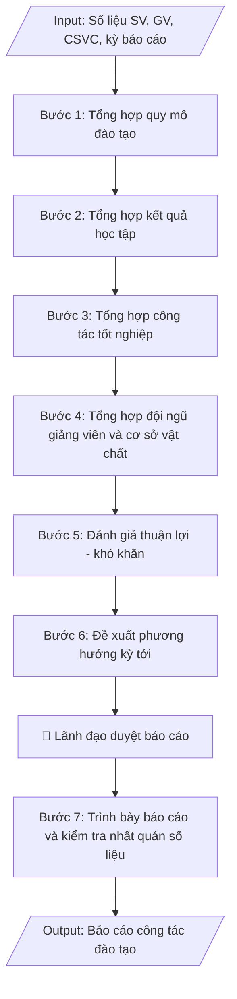

# Báo cáo công tác đào tạo định kỳ

## Định dạng và file đầu ra
Định dạng đầu ra có thể chọn theo sản phẩm/yêu cầu: .docx, .pdf. Đọc mục “Định dạng bổ sung” trong quy cách đầu ra trước khi chọn.

**Phải tạo file thực tế để tải xuống, không chỉ trả nội dung trong chat.** Định dạng mặc định của skill: **.docx**. Nếu có bảng số liệu nghiệp vụ yêu cầu file bảng tính riêng, tạo thêm Excel theo yêu cầu; không tự tạo file kiểm tra. Không chờ người dùng yêu cầu xuất file lần nữa. Ưu tiên định dạng người dùng chỉ định; đọc quy tắc xuất file tại references/quy-cach-dau-ra.md.

## Quy cách đầu ra và thông tin thiếu
Đọc [quy cách và cấu trúc sản phẩm](references/quy-cach-dau-ra.md) trước khi soạn/xuất. File giao chỉ gồm sản phẩm nghiệp vụ được yêu cầu; kiểm tra nội bộ không xuất kèm. Thiếu thông tin thì giữ nguyên trường/mục và chỗ điền theo mẫu gốc (dòng dấu chấm, dấu gạch hoặc ô trống); không tự điền dữ liệu mẫu, số 0, mã chờ xác minh hay dòng chờ ký. Mẫu chuyên ngành còn áp dụng được ưu tiên về cấu trúc, mã biểu và người ký. Bản đầy đủ: [quy tắc chung](references/quy-tac-chung.md).

## Kiểm soát áp dụng và phê duyệt
Trước khi chạy, xác định `ngay_ap_dung`, `loai_hinh_truong`, `quy_che_noi_bo`, `nguon_du_lieu`, `nguoi_kiem_duyet`; chỉ hỏi thông tin liên quan nghiệp vụ, không dùng giá trị giả định thay dữ liệu bắt buộc. Đối chiếu căn cứ pháp lý với văn bản gốc, hiệu lực, điều khoản áp dụng và chuyển tiếp. Bản đầy đủ: [quy tắc chung](references/quy-tac-chung.md).

Nếu có cập nhật pháp lý dưới đây, đọc [căn cứ và điều kiện áp dụng](references/phap-ly.md) trước khi làm. Quy trình dưới đây giữ nghiệp vụ từ bản gốc; mọi viện dẫn văn bản, mẫu biểu, điều khoản phải theo căn cứ đã chọn trong phap-ly.md, không theo văn bản cũ.

## Giới hạn và human gate
AI hỗ trợ chuẩn bị và đối chiếu; cán bộ phụ trách kiểm tra dữ liệu/căn cứ, người có thẩm quyền duyệt và ký. Không đánh dấu đã ký, đã duyệt, đã công bố khi chưa có chứng cứ. Dữ liệu sinh viên, sức khỏe, nhân sự, tài chính chỉ dùng theo mục đích và phân quyền, che thông tin định danh khi dùng ví dụ (Luật 91/2025/QH15, hiệu lực 01/01/2026); không tải dữ liệu lên dịch vụ ngoài khi chưa có quyền. Bản đầy đủ: [quy tắc chung](references/quy-tac-chung.md).

## Khi nào dùng
Khi cần tổng hợp và báo cáo công tác đào tạo theo định kỳ: sơ kết học kỳ, tổng kết năm học,
hoặc báo cáo gửi cơ quan chủ quản / Bộ GD&ĐT. Báo cáo phản ánh đầy đủ quy mô đào tạo, chất lượng,
đội ngũ, cơ sở vật chất, những thuận lợi – khó khăn và phương hướng nhiệm vụ kỳ tiếp theo.

## Đầu vào (Input)
| Trường | Mô tả | Bắt buộc |
|---|---|---|
| `ky_bao_cao` | Học kỳ / năm học báo cáo (ví dụ: Học kỳ 1 năm học 2026–2027) | Có |
| `quy_mo_sv` | Số liệu SV theo khóa, ngành, hệ đào tạo | Có |
| `ket_qua_hoc_tap` | Tỷ lệ SV đạt loại khá/giỏi, số SV bị cảnh báo học vụ, thôi học | Có |
| `tot_nghiep` | Số SV tốt nghiệp trong kỳ, tỷ lệ theo xếp loại | Có |
| `doi_ngu_gv` | Số lượng, trình độ giảng viên (GS/PGS/TS/ThS), tỷ lệ GV/SV | Có |
| `co_so_vat_chat` | Phòng học, phòng thí nghiệm, thư viện, học liệu phục vụ đào tạo | Không |
| `thuan_loi_kho_khan` | Đánh giá thuận lợi, khó khăn, tồn tại trong kỳ | Không |
| `phuong_huong` | Nhiệm vụ, giải pháp trọng tâm kỳ tiếp theo | Không |
| `nguoi_ky` | Hiệu trưởng / Phó Hiệu trưởng phụ trách đào tạo | Không (mặc định: Phó Hiệu trưởng) |

## Quy trình
**Ràng buộc pháp lý khi thực hiện** (trích references/phap-ly.md; đối chiếu toàn văn và hiệu lực tại ngày nghiệp vụ):
- Thông tư 56/2026/TT-BGDĐT, hiệu lực 07/07/2026: Yêu cầu khóa tuyển sinh, chương trình, ngày áp dụng và quy chế đào tạo nội bộ. Đối chiếu điều khoản chuyển tiếp trong toàn văn trước khi chọn quy tắc; không tự áp dụng quy định mới hồi tố cho mọi khóa. Không dùng điều/khoản, thang điểm hoặc điều kiện tốt nghiệp cũ như quy định hiện hành nếu chưa đối chiếu.
- Trước Bước 1: chọn căn cứ theo đối tượng, loại hình trường và chuyển tiếp; lập bảng văn bản / điều khoản / lý do áp dụng / bằng chứng. Thiếu văn bản gốc hoặc điều khoản thì ghi nhận nội bộ [CẦN XÁC MINH] (không đưa vào file giao), để trống phần tương ứng, chưa kết luận tuân thủ.
- Các con số, thời hạn, số điều, số mức xếp loại, hệ số và mẫu biểu nêu trong các bước dưới đây được giữ từ quy trình gốc (trước cập nhật pháp lý); chỉ dùng khi đã đối chiếu đúng với căn cứ đã chọn, khác thì theo căn cứ. Danh sách điểm cần đối chiếu: docs/DIEM_CAN_DOI_CHIEU_PHAP_LY.md.

**Bước 1. Tổng hợp quy mô đào tạo**
- Làm gì: lấy từ hệ thống quản lý đào tạo: tổng số SV theo khóa, ngành, hệ đào tạo; số lớp học phần
  đã mở trong kỳ; tính tỷ lệ tăng/giảm (%) so với kỳ trước và so với cùng kỳ năm trước.
- Dùng input: `ky_bao_cao`, `quy_mo_sv`
- Vai trò: Chuyên viên Phòng Đào tạo · AI hỗ trợ: tổng hợp số liệu quy mô đào tạo từ hệ thống quản lý · ⏱ ~1 giờ (ước tính)
- Lưu ý nghiệp vụ: chốt số liệu tại cùng một thời điểm cho mọi ngành để so sánh được; tách riêng
  SV chính quy và các hệ đào tạo khác (nếu có); ghi rõ thời điểm chốt số liệu.
- → Kết quả bước: bảng quy mô SV theo khóa, ngành, hệ đào tạo kèm tỷ lệ biến động so với kỳ trước.

**Bước 2. Tổng hợp kết quả học tập**
- Làm gì: phân loại kết quả học tập toàn trường theo các mức (xuất sắc/giỏi/khá/trung bình/yếu)
  tính theo %; thống kê số SV bị cảnh báo học vụ, buộc thôi học trong kỳ; phân tích nguyên nhân
  chính (năm nhất chưa thích nghi, nợ học phí, vắng học...).
- Dùng input: `ky_bao_cao`, `ket_qua_hoc_tap`
- Vai trò: Chuyên viên Phòng Đào tạo · AI hỗ trợ: phân loại kết quả học tập theo các mức, tính toán tỷ lệ · ⏱ ~1 giờ (ước tính)
- Lưu ý nghiệp vụ: tỷ lệ phân loại phải cộng đủ 100%; nguyên nhân phân tích phải dựa trên số liệu
  cụ thể (số trường hợp), không nêu chung chung.
- → Kết quả bước: bảng phân loại kết quả học tập theo % + danh sách số liệu cảnh báo/thôi học
  và phân tích nguyên nhân chính.

**Bước 3. Tổng hợp công tác tốt nghiệp**
- Làm gì: thống kê số SV tốt nghiệp trong kỳ theo từng ngành và theo xếp loại; tính tỷ lệ tốt
  nghiệp đúng hạn của các khóa đến hạn tốt nghiệp.
- Dùng input: `ky_bao_cao`, `tot_nghiep`
- Vai trò: Chuyên viên Phòng Đào tạo · AI hỗ trợ: thống kê số SV tốt nghiệp theo ngành và xếp loại · ⏱ ~30 phút (ước tính)
- Lưu ý nghiệp vụ: "tốt nghiệp đúng hạn" tính theo thời gian đào tạo chuẩn của khóa, không tính
  các trường hợp gia hạn; đối chiếu với quyết định công nhận tốt nghiệp của kỳ.
- → Kết quả bước: bảng tốt nghiệp theo ngành và xếp loại + tỷ lệ tốt nghiệp đúng hạn các khóa.

**Bước 4. Tổng hợp đội ngũ giảng viên và cơ sở vật chất**
- Làm gì: lấy từ Phòng TCCB: tổng số GV cơ hữu, cơ cấu trình độ (GS/PGS/TS/ThS), tính tỷ lệ SV/GV;
  lấy từ Phòng QTTB: số phòng học lý thuyết, phòng máy, phòng thí nghiệm, số đầu sách thư viện
  và tình trạng đáp ứng đào tạo.
- Dùng input: `ky_bao_cao`, `doi_ngu_gv`, `co_so_vat_chat`
- Vai trò: Chuyên viên Phòng Đào tạo (số liệu từ Phòng TCCB và đơn vị CSVC) · AI hỗ trợ: tổng hợp bảng số liệu đội ngũ và cơ sở vật chất · ⏱ ~1 giờ (ước tính)
- Lưu ý nghiệp vụ: tỷ lệ GV có trình độ tiến sĩ trở lên là chỉ tiêu quan trọng cần nêu rõ; CSVC
  nêu cả số lượng và tình trạng (đáp ứng / xuống cấp cần nâng cấp).
- → Kết quả bước: bảng đội ngũ GV (số lượng, trình độ, tỷ lệ SV/GV) + bảng CSVC phục vụ đào tạo.

**Bước 5. Đánh giá thuận lợi – khó khăn**
- Làm gì: dựa trên số liệu 4 bước trên, nêu rõ: (a) thuận lợi và kết quả đạt được trong kỳ;
  (b) khó khăn, tồn tại, hạn chế; (c) nguyên nhân của từng tồn tại — phân biệt nguyên nhân khách
  quan và chủ quan.
- Dùng input: `thuan_loi_kho_khan`
- Vai trò: Trưởng phòng Đào tạo · AI hỗ trợ: phác thảo nội dung đánh giá thuận lợi và hạn chế · ⏱ ~2 giờ (ước tính)
- Lưu ý nghiệp vụ: mỗi tồn tại nêu ra phải gắn với số liệu cụ thể (không đánh giá định tính suông);
  nguyên nhân chủ quan phải đi kèm trách nhiệm đơn vị liên quan để làm cơ sở cho phương hướng.
- → Kết quả bước: phần đánh giá thuận lợi/khó khăn có số liệu minh chứng và phân tích nguyên nhân.

**Bước 6. Đề xuất phương hướng kỳ tới**
- Làm gì: từ các tồn tại ở Bước 5, đề xuất nhiệm vụ trọng tâm, giải pháp khắc phục cụ thể và chỉ
  tiêu phấn đấu định lượng cho kỳ tiếp theo (ví dụ: giảm x% SV bị cảnh báo, nâng tỷ lệ tốt nghiệp
  đúng hạn lên y%).
- Dùng input: `phuong_huong`
- Vai trò: Lãnh đạo phụ trách đào tạo · AI hỗ trợ: gợi ý phương hướng, giải pháp khắc phục để chốt · ⏱ ~2 giờ (ước tính)
- Lưu ý nghiệp vụ: mỗi giải pháp phải gắn với đơn vị chịu trách nhiệm và mốc thời gian; chỉ tiêu
  phấn đấu phải khả thi, có cơ sở từ số liệu kỳ này.
- → Kết quả bước: danh mục nhiệm vụ trọng tâm, giải pháp và chỉ tiêu phấn đấu kỳ tới.

**Bước 7. Trình bày báo cáo và kiểm tra nhất quán số liệu**
- Làm gì: trình bày báo cáo theo cấu trúc chuẩn (mở đầu – nội dung theo từng mảng – đánh giá –
  phương hướng) kèm bảng số liệu tổng hợp; kiểm tra chéo: mọi con số trong văn bản phải khớp với
  bảng tổng hợp và với số liệu gốc từ các bước 1–4; rà chính tả, thể thức trước khi trình ký.
- Dùng input: `ky_bao_cao`, `nguoi_ky`
- Vai trò: Chuyên viên Phòng Đào tạo · AI hỗ trợ: kiểm tra chéo tính nhất quán số liệu toàn báo cáo · ⏱ ~1 giờ (ước tính)
- Lưu ý nghiệp vụ: bẫy thường gặp nhất là số liệu trong văn bản và trong bảng không khớp nhau
  (do cập nhật một nơi, quên nơi kia); kiểm tra lần cuối sau khi đã chốt toàn bộ nội dung.
- → Kết quả bước: báo cáo công tác đào tạo hoàn chỉnh, số liệu nhất quán giữa văn bản và bảng,
  sẵn sàng trình ký.

## Luồng quy trình (Workflow)

## Đầu ra
- Báo cáo công tác đào tạo hoàn chỉnh (dạng văn bản hành chính).
- Bảng số liệu tổng hợp: quy mô SV, kết quả học tập, tốt nghiệp, đội ngũ GV.
- Phần đánh giá thuận lợi/khó khăn và phương hướng kỳ tới.

File nghiệp vụ thực tế theo định dạng mặc định ở đầu skill hoặc định dạng người dùng yêu cầu, kèm liên kết tải trong phản hồi cuối.

Sản phẩm nghiệp vụ hoàn chỉnh theo [quy cách và cấu trúc](references/quy-cach-dau-ra.md), giữ các trường chưa có dữ liệu ở trạng thái trống. Không xuất kèm checklist/phụ lục kiểm tra đầu ra.

## Kiểm tra nội bộ trước khi giao
Các tiêu chí sau dùng để tự đối chiếu; không sao chép vào file xuất. Mục thiếu dữ liệu được để trống, không đánh dấu đã đạt hoặc đã duyệt.

- [ ] Đủ các phần và đúng bố cục theo cấu trúc tại references/quy-cach-dau-ra.md (không theo cấu trúc của bản gốc).
- [ ] Số liệu/nội dung trong output khớp với Input đã cho (kỳ báo cáo, quy mô SV, kết quả học tập, tốt nghiệp, đội ngũ GV, CSVC).
- [ ] Không bịa đặt số liệu, minh chứng, trích dẫn.
- [ ] Đúng bố cục văn bản hành chính chuẩn của báo cáo định kỳ.
- [ ] Căn cứ pháp lý đầy đủ, còn hiệu lực (văn bản hiện hành nêu tại phap-ly.md, chế độ báo cáo thống kê giáo dục của Bộ GD&ĐT); ghi rõ nguồn và thời điểm chốt số liệu.
- [ ] Đã qua Human gate: lãnh đạo (Hiệu trưởng/Phó Hiệu trưởng phụ trách đào tạo) đã duyệt báo cáo.
- [ ] Mọi con số trong phần văn bản khớp với bảng số liệu tổng hợp và số liệu gốc; tỷ lệ phân loại kết quả học tập cộng đủ 100%.
- [ ] Mỗi tồn tại nêu ra gắn với số liệu cụ thể, phân biệt nguyên nhân khách quan/chủ quan kèm trách nhiệm đơn vị liên quan.
- [ ] Giải pháp gắn đơn vị chịu trách nhiệm và mốc thời gian; chỉ tiêu phấn đấu khả thi, có cơ sở từ số liệu kỳ này.

## Căn cứ & lưu ý
- Căn cứ hiện hành: xem [căn cứ và điều kiện áp dụng](references/phap-ly.md); phải đối chiếu văn bản gốc, hiệu lực và chuyển tiếp tại ngày nghiệp vụ.
- Chế độ báo cáo thống kê giáo dục theo quy định của Bộ GD&ĐT.
- Số liệu trong báo cáo phải nhất quán giữa phần văn bản và bảng tổng hợp; ghi rõ nguồn số liệu
  (hệ thống quản lý đào tạo, phòng ban cung cấp) và thời điểm chốt số liệu.
- Khi mô phỏng không dùng tên thật của trường/cá nhân.

## Tư liệu đối chiếu
Bản gốc trước cập nhật pháp lý (kèm ví dụ giả lập) lưu tại `references/quy-trinh-lich-su.md`, chỉ để đối chiếu hồ sơ lịch sử; không dùng căn cứ, mẫu hay số liệu trong đó làm chỉ dẫn hiện hành.

## Quản trị phiên bản
- Phiên bản gói `1.3.2` (cập nhật 2026-10-10); hồ sơ đầy đủ tại [references/version.json](references/version.json).
- Người phê duyệt nghiệp vụ: **chưa chỉ định**. Trạng thái: dự thảo nghiệp vụ; kiểm tra pháp lý trước thực thi. Ngày cập nhật không đồng nghĩa mọi văn bản đã được rà soát toàn văn.
- Giấy phép theo LICENSE của kho (bản quyền CES Global). Lịch sử thay đổi: CHANGELOG.md.
