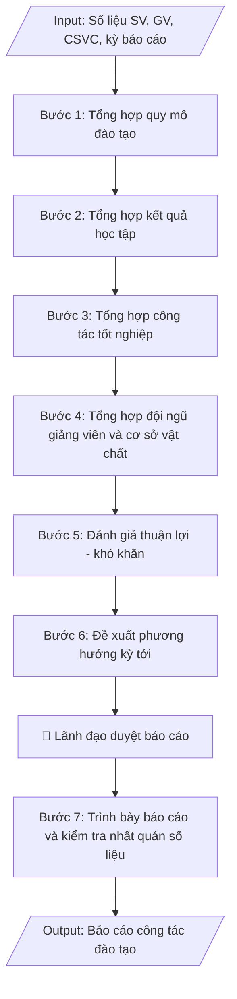

# Tư liệu lịch sử – không phải quy trình hiện hành

Nội dung từ phiên bản nguồn trước 1.1.0, giữ để đối chiếu dữ liệu đầu vào và thay đổi; căn cứ, điều kiện, mẫu và ví dụ có thể đã lỗi thời. Không dùng để thực hiện nghiệp vụ hiện tại.

## Khi nào dùng
Khi cần tổng hợp và báo cáo công tác đào tạo theo định kỳ: sơ kết học kỳ, tổng kết năm học,
hoặc báo cáo gửi cơ quan chủ quản / Bộ GD&ĐT. Báo cáo phản ánh đầy đủ quy mô đào tạo, chất lượng,
đội ngũ, cơ sở vật chất, những thuận lợi – khó khăn và phương hướng nhiệm vụ kỳ tiếp theo.

## Đầu vào (Input)

| Trường | Mô tả | Bắt buộc |
|---|---|---|
| `ky_bao_cao` | Học kỳ / năm học báo cáo (ví dụ: Học kỳ 1 năm học 2026–2027) | Có |
| `quy_mo_sv` | Số liệu SV theo khóa, ngành, hệ đào tạo | Có |
| `ket_qua_hoc_tap` | Tỷ lệ SV đạt loại khá/giỏi, số SV bị cảnh báo học vụ, thôi học | Có |
| `tot_nghiep` | Số SV tốt nghiệp trong kỳ, tỷ lệ theo xếp loại | Có |
| `doi_ngu_gv` | Số lượng, trình độ giảng viên (GS/PGS/TS/ThS), tỷ lệ GV/SV | Có |
| `co_so_vat_chat` | Phòng học, phòng thí nghiệm, thư viện, học liệu phục vụ đào tạo | Không |
| `thuan_loi_kho_khan` | Đánh giá thuận lợi, khó khăn, tồn tại trong kỳ | Không |
| `phuong_huong` | Nhiệm vụ, giải pháp trọng tâm kỳ tiếp theo | Không |
| `nguoi_ky` | Hiệu trưởng / Phó Hiệu trưởng phụ trách đào tạo | Không (mặc định: Phó Hiệu trưởng) |

## Quy trình

**Bước 1. Tổng hợp quy mô đào tạo**
- Làm gì: lấy từ hệ thống quản lý đào tạo: tổng số SV theo khóa, ngành, hệ đào tạo; số lớp học phần
  đã mở trong kỳ; tính tỷ lệ tăng/giảm (%) so với kỳ trước và so với cùng kỳ năm trước.
- Dùng input: `ky_bao_cao`, `quy_mo_sv`
- Vai trò: Chuyên viên Phòng Đào tạo · AI hỗ trợ: tổng hợp số liệu quy mô đào tạo từ hệ thống quản lý · ⏱ ~1 giờ (ước tính)
- Lưu ý nghiệp vụ: chốt số liệu tại cùng một thời điểm cho mọi ngành để so sánh được; tách riêng
  SV chính quy và các hệ đào tạo khác (nếu có); ghi rõ thời điểm chốt số liệu.
- → Kết quả bước: bảng quy mô SV theo khóa, ngành, hệ đào tạo kèm tỷ lệ biến động so với kỳ trước.

**Bước 2. Tổng hợp kết quả học tập**
- Làm gì: phân loại kết quả học tập toàn trường theo các mức (xuất sắc/giỏi/khá/trung bình/yếu)
  tính theo %; thống kê số SV bị cảnh báo học vụ, buộc thôi học trong kỳ; phân tích nguyên nhân
  chính (năm nhất chưa thích nghi, nợ học phí, vắng học...).
- Dùng input: `ky_bao_cao`, `ket_qua_hoc_tap`
- Vai trò: Chuyên viên Phòng Đào tạo · AI hỗ trợ: phân loại kết quả học tập theo các mức, tính toán tỷ lệ · ⏱ ~1 giờ (ước tính)
- Lưu ý nghiệp vụ: tỷ lệ phân loại phải cộng đủ 100%; nguyên nhân phân tích phải dựa trên số liệu
  cụ thể (số trường hợp), không nêu chung chung.
- → Kết quả bước: bảng phân loại kết quả học tập theo % + danh sách số liệu cảnh báo/thôi học
  và phân tích nguyên nhân chính.

**Bước 3. Tổng hợp công tác tốt nghiệp**
- Làm gì: thống kê số SV tốt nghiệp trong kỳ theo từng ngành và theo xếp loại; tính tỷ lệ tốt
  nghiệp đúng hạn của các khóa đến hạn tốt nghiệp.
- Dùng input: `ky_bao_cao`, `tot_nghiep`
- Vai trò: Chuyên viên Phòng Đào tạo · AI hỗ trợ: thống kê số SV tốt nghiệp theo ngành và xếp loại · ⏱ ~30 phút (ước tính)
- Lưu ý nghiệp vụ: "tốt nghiệp đúng hạn" tính theo thời gian đào tạo chuẩn của khóa, không tính
  các trường hợp gia hạn; đối chiếu với quyết định công nhận tốt nghiệp của kỳ.
- → Kết quả bước: bảng tốt nghiệp theo ngành và xếp loại + tỷ lệ tốt nghiệp đúng hạn các khóa.

**Bước 4. Tổng hợp đội ngũ giảng viên và cơ sở vật chất**
- Làm gì: lấy từ Phòng TCCB: tổng số GV cơ hữu, cơ cấu trình độ (GS/PGS/TS/ThS), tính tỷ lệ SV/GV;
  lấy từ Phòng QTTB: số phòng học lý thuyết, phòng máy, phòng thí nghiệm, số đầu sách thư viện
  và tình trạng đáp ứng đào tạo.
- Dùng input: `ky_bao_cao`, `doi_ngu_gv`, `co_so_vat_chat`
- Vai trò: Chuyên viên Phòng Đào tạo (số liệu từ Phòng TCCB và đơn vị CSVC) · AI hỗ trợ: tổng hợp bảng số liệu đội ngũ và cơ sở vật chất · ⏱ ~1 giờ (ước tính)
- Lưu ý nghiệp vụ: tỷ lệ GV có trình độ tiến sĩ trở lên là chỉ tiêu quan trọng cần nêu rõ; CSVC
  nêu cả số lượng và tình trạng (đáp ứng / xuống cấp cần nâng cấp).
- → Kết quả bước: bảng đội ngũ GV (số lượng, trình độ, tỷ lệ SV/GV) + bảng CSVC phục vụ đào tạo.

**Bước 5. Đánh giá thuận lợi – khó khăn**
- Làm gì: dựa trên số liệu 4 bước trên, nêu rõ: (a) thuận lợi và kết quả đạt được trong kỳ;
  (b) khó khăn, tồn tại, hạn chế; (c) nguyên nhân của từng tồn tại — phân biệt nguyên nhân khách
  quan và chủ quan.
- Dùng input: `thuan_loi_kho_khan`
- Vai trò: Trưởng phòng Đào tạo · AI hỗ trợ: phác thảo nội dung đánh giá thuận lợi và hạn chế · ⏱ ~2 giờ (ước tính)
- Lưu ý nghiệp vụ: mỗi tồn tại nêu ra phải gắn với số liệu cụ thể (không đánh giá định tính suông);
  nguyên nhân chủ quan phải đi kèm trách nhiệm đơn vị liên quan để làm cơ sở cho phương hướng.
- → Kết quả bước: phần đánh giá thuận lợi/khó khăn có số liệu minh chứng và phân tích nguyên nhân.

**Bước 6. Đề xuất phương hướng kỳ tới**
- Làm gì: từ các tồn tại ở Bước 5, đề xuất nhiệm vụ trọng tâm, giải pháp khắc phục cụ thể và chỉ
  tiêu phấn đấu định lượng cho kỳ tiếp theo (ví dụ: giảm x% SV bị cảnh báo, nâng tỷ lệ tốt nghiệp
  đúng hạn lên y%).
- Dùng input: `phuong_huong`
- Vai trò: Lãnh đạo phụ trách đào tạo · AI hỗ trợ: gợi ý phương hướng, giải pháp khắc phục để chốt · ⏱ ~2 giờ (ước tính)
- Lưu ý nghiệp vụ: mỗi giải pháp phải gắn với đơn vị chịu trách nhiệm và mốc thời gian; chỉ tiêu
  phấn đấu phải khả thi, có cơ sở từ số liệu kỳ này.
- → Kết quả bước: danh mục nhiệm vụ trọng tâm, giải pháp và chỉ tiêu phấn đấu kỳ tới.

**Bước 7. Trình bày báo cáo và kiểm tra nhất quán số liệu**
- Làm gì: trình bày báo cáo theo cấu trúc chuẩn (mở đầu – nội dung theo từng mảng – đánh giá –
  phương hướng) kèm bảng số liệu tổng hợp; kiểm tra chéo: mọi con số trong văn bản phải khớp với
  bảng tổng hợp và với số liệu gốc từ các bước 1–4; rà chính tả, thể thức trước khi trình ký.
- Dùng input: `ky_bao_cao`, `nguoi_ky`
- Vai trò: Chuyên viên Phòng Đào tạo · AI hỗ trợ: kiểm tra chéo tính nhất quán số liệu toàn báo cáo · ⏱ ~1 giờ (ước tính)
- Lưu ý nghiệp vụ: bẫy thường gặp nhất là số liệu trong văn bản và trong bảng không khớp nhau
  (do cập nhật một nơi, quên nơi kia); kiểm tra lần cuối sau khi đã chốt toàn bộ nội dung.
- → Kết quả bước: báo cáo công tác đào tạo hoàn chỉnh, số liệu nhất quán giữa văn bản và bảng,
  sẵn sàng trình ký.

## Luồng quy trình (Workflow)

## Đầu ra (Output)
- Báo cáo công tác đào tạo hoàn chỉnh (dạng văn bản hành chính).
- Bảng số liệu tổng hợp: quy mô SV, kết quả học tập, tốt nghiệp, đội ngũ GV.
- Phần đánh giá thuận lợi/khó khăn và phương hướng kỳ tới.

**Cấu trúc output chuẩn:** khung mẫu cố định của báo cáo công tác đào tạo định kỳ, các phần theo đúng thứ tự:
1. Tiêu đề báo cáo: tên báo cáo + kỳ báo cáo (học kỳ/năm học) + tên trường.
2. Phần I. Quy mô đào tạo: tổng số SV theo khóa, ngành, hệ đào tạo; số lớp học phần đã mở;
   so sánh với kỳ trước/cùng kỳ năm trước.
3. Phần II. Kết quả học tập: phân loại kết quả theo %; số SV bị cảnh báo học vụ, buộc thôi học;
   phân tích nguyên nhân chính.
4. Phần III. Công tác tốt nghiệp: số SV tốt nghiệp trong kỳ theo ngành và xếp loại;
   tỷ lệ tốt nghiệp đúng hạn các khóa.
5. Phần IV. Đội ngũ giảng viên và cơ sở vật chất: số lượng, cơ cấu trình độ GV, tỷ lệ SV/GV;
   phòng học, phòng thí nghiệm, thư viện.
6. Phần V. Đánh giá chung: thuận lợi, kết quả đạt được; khó khăn, tồn tại và nguyên nhân
   (khách quan, chủ quan).
7. Phần VI. Phương hướng kỳ tới: nhiệm vụ trọng tâm, giải pháp khắc phục, chỉ tiêu phấn đấu.
8. Phụ lục: bảng số liệu tổng hợp chi tiết (các chỉ tiêu của kỳ này và kỳ so sánh).

## Checklist nghiệm thu
- [ ] Đủ các phần theo "Cấu trúc output chuẩn": tiêu đề báo cáo + kỳ báo cáo; Phần I–VI (quy mô; kết quả học tập; tốt nghiệp; đội ngũ và CSVC; đánh giá chung; phương hướng); phụ lục bảng số liệu tổng hợp.
- [ ] Số liệu/nội dung trong output khớp với Input đã cho (kỳ báo cáo, quy mô SV, kết quả học tập, tốt nghiệp, đội ngũ GV, CSVC).
- [ ] Không bịa đặt số liệu, minh chứng, trích dẫn.
- [ ] Đúng bố cục văn bản hành chính chuẩn của báo cáo định kỳ.
- [ ] Căn cứ pháp lý đầy đủ, còn hiệu lực (Thông tư 08/2021/TT-BGDĐT, chế độ báo cáo thống kê giáo dục của Bộ GD&ĐT); ghi rõ nguồn và thời điểm chốt số liệu.
- [ ] Đã qua Human gate: lãnh đạo (Hiệu trưởng/Phó Hiệu trưởng phụ trách đào tạo) đã duyệt báo cáo.
- [ ] Mọi con số trong phần văn bản khớp với bảng số liệu tổng hợp và số liệu gốc; tỷ lệ phân loại kết quả học tập cộng đủ 100%.
- [ ] Mỗi tồn tại nêu ra gắn với số liệu cụ thể, phân biệt nguyên nhân khách quan/chủ quan kèm trách nhiệm đơn vị liên quan.
- [ ] Giải pháp gắn đơn vị chịu trách nhiệm và mốc thời gian; chỉ tiêu phấn đấu khả thi, có cơ sở từ số liệu kỳ này.
Tiêu chí đạt = tất cả các ô được đánh dấu.

## Ví dụ mô phỏng (dữ liệu giả lập)

> Tất cả tên trường, cá nhân, số liệu dưới đây đều là **giả lập**, không liên quan tổ chức/cá nhân có thật.

### Input mẫu

| Trường | Giá trị |
|---|---|
| `ky_bao_cao` | Học kỳ 1 năm học 2026–2027 |
| `quy_mo_sv` | Tổng 4.850 SV chính quy: CNTT 1.900, QTKD 1.650, Kế toán 1.300; khóa 2026: 1.420 SV |
| `ket_qua_hoc_tap` | Khá/giỏi: 62%; cảnh báo học vụ: 48 SV; buộc thôi học: 6 SV |
| `tot_nghiep` | Đợt 1 (01/2027): 210 SV (Giỏi 45, Khá 120, TB 45) |
| `doi_ngu_gv` | 186 GV cơ hữu: 2 GS, 8 PGS, 52 TS, 124 ThS; tỷ lệ SV/GV: 26/1 |
| `co_so_vat_chat` | 68 phòng học lý thuyết, 12 phòng máy, 6 phòng thí nghiệm; thư viện 45.000 đầu sách |

### Output mẫu

**BÁO CÁO CÔNG TÁC ĐÀO TẠO HỌC KỲ 1 NĂM HỌC 2026–2027**
*(Trường Đại học A)*

**I. Quy mô đào tạo**

Học kỳ 1 năm học 2026–2027, toàn trường có 4.850 sinh viên hệ chính quy, tăng 6,2% so với
cùng kỳ năm trước. Cơ cấu theo ngành: Công nghệ thông tin 1.900 SV (39,2%), Quản trị kinh
doanh 1.650 SV (34,0%), Kế toán 1.300 SV (26,8%). Khóa tuyển sinh 2026 nhập học 1.420 SV,
đạt 101,4% chỉ tiêu. Trong học kỳ đã tổ chức 312 lớp học phần.

**II. Kết quả học tập**

Tỷ lệ sinh viên đạt kết quả học tập từ Khá trở lên đạt 62%, tăng 3 điểm % so với học kỳ
trước. Số sinh viên bị cảnh báo học vụ: 48 SV (chiếm 0,99%); số sinh viên bị buộc thôi học:
6 SV. Nguyên nhân chủ yếu: sinh viên năm nhất chưa thích nghi phương pháp học đại học
(31 trường hợp), nợ học phí kéo dài ảnh hưởng đăng ký học (9 trường hợp).

**III. Công tác tốt nghiệp**

Đợt xét tốt nghiệp tháng 01/2027 có 210 SV được công nhận tốt nghiệp, trong đó xếp loại
Giỏi 45 SV (21,4%), Khá 120 SV (57,1%), Trung bình 45 SV (21,4%). Tỷ lệ tốt nghiệp đúng hạn
của khóa 2022 đạt 78%.

**IV. Đội ngũ giảng viên và cơ sở vật chất**

Toàn trường có 186 giảng viên cơ hữu, gồm 2 GS, 8 PGS, 52 TS, 124 ThS; tỷ lệ GV có trình độ
tiến sĩ trở lên đạt 33,3%. Tỷ lệ sinh viên/giảng viên: 26/1. Cơ sở vật chất phục vụ đào tạo:
68 phòng học lý thuyết, 12 phòng máy, 6 phòng thí nghiệm; thư viện có 45.000 đầu sách,
đáp ứng cơ bản nhu cầu học tập.

**V. Đánh giá chung**

1. *Thuận lợi, kết quả đạt được:* tuyển sinh vượt chỉ tiêu; tỷ lệ khá/giỏi tăng; công tác
xét tốt nghiệp đúng tiến độ; đội ngũ GV đạt chuẩn theo quy định.

2. *Khó khăn, tồn tại:* tỷ lệ SV năm nhất bị cảnh báo học vụ còn cao; một số phòng máy
xuống cấp cần nâng cấp; tỷ lệ tốt nghiệp đúng hạn khóa 2022 chưa đạt chỉ tiêu 80%.

**VI. Phương hướng học kỳ 2**

1. Tăng cường cố vấn học tập cho SV năm nhất, mục tiêu giảm 30% số SV bị cảnh báo học vụ.
2. Nâng cấp 4 phòng máy phục vụ các học phần thực hành CNTT.
3. Rà soát, hỗ trợ SV khóa 2022 còn nợ tín chỉ để nâng tỷ lệ tốt nghiệp đúng hạn lên 82%.

**Bảng số liệu tổng hợp:**

| Chỉ tiêu | Học kỳ 1/2026–2027 | Cùng kỳ năm trước |
|---|---|---|
| Tổng số SV chính quy | 4.850 | 4.566 |
| — Ngành CNTT | 1.900 | 1.780 |
| — Ngành QTKD | 1.650 | 1.556 |
| — Ngành Kế toán | 1.300 | 1.230 |
| Số lớp học phần đã mở | 312 | 295 |
| Tỷ lệ SV đạt Khá trở lên | 62% | 59% |
| SV bị cảnh báo học vụ | 48 | 55 |
| SV bị buộc thôi học | 6 | 8 |
| SV tốt nghiệp trong kỳ | 210 | 195 |
| GV cơ hữu (GS/PGS/TS/ThS) | 186 (2/8/52/124) | 178 (2/7/48/121) |
| Tỷ lệ SV/GV | 26/1 | 25,6/1 |

## Căn cứ & lưu ý
- Quy chế đào tạo trình độ đại học (Thông tư 08/2021/TT-BGDĐT).
- Chế độ báo cáo thống kê giáo dục theo quy định của Bộ GD&ĐT.
- Số liệu trong báo cáo phải nhất quán giữa phần văn bản và bảng tổng hợp; ghi rõ nguồn số liệu
  (hệ thống quản lý đào tạo, phòng ban cung cấp) và thời điểm chốt số liệu.
- Khi mô phỏng không dùng tên thật của trường/cá nhân.
