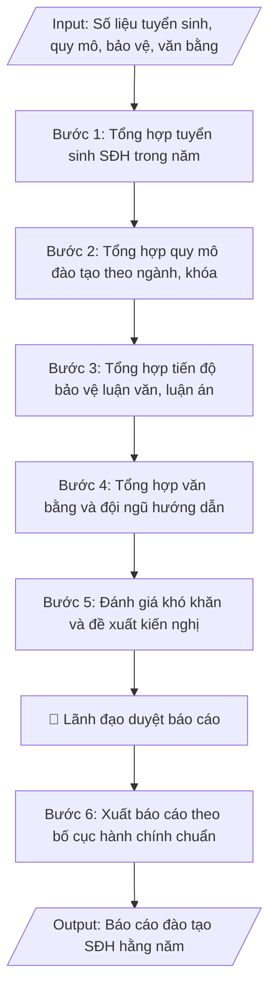

# Báo cáo đào tạo sau đại học hằng năm

## Định dạng và file đầu ra

Định dạng đầu ra có thể chọn theo sản phẩm/yêu cầu: .docx, .pdf. Đọc mục “Định dạng bổ sung” trong quy cách đầu ra trước khi chọn.

**Phải tạo file thực tế để tải xuống, không chỉ trả nội dung trong chat.** Định dạng mặc định của skill: **.docx**. Nếu có bảng số liệu nghiệp vụ yêu cầu file bảng tính riêng, tạo thêm Excel theo yêu cầu; không tự tạo file kiểm tra. Không chờ người dùng yêu cầu xuất file lần nữa. Ưu tiên định dạng người dùng chỉ định; đọc quy tắc xuất file tại references/quy-cach-dau-ra.md.

## Quy cách đầu ra và thông tin thiếu
Khi dựng file Word/Excel, áp dụng mục “Thể thức và bảng biểu khi dựng file” trong quy cách đầu ra (cỡ chữ từng thành phần, bảng nhiều trang, số trang, phụ lục). Đọc [quy cách và cấu trúc sản phẩm](references/quy-cach-dau-ra.md) trước khi soạn/xuất. File giao chỉ gồm sản phẩm nghiệp vụ được yêu cầu; kiểm tra nội bộ không xuất kèm. Thiếu thông tin thì giữ nguyên trường/mục và chỗ điền theo mẫu gốc (dòng dấu chấm, dấu gạch hoặc ô trống); không tự điền dữ liệu mẫu, số 0, mã chờ xác minh hay dòng chờ ký. Mẫu chuyên ngành còn áp dụng được ưu tiên về cấu trúc, mã biểu và người ký. Bản đầy đủ: [quy tắc chung](references/quy-tac-chung.md).

## Kiểm soát áp dụng và phê duyệt
Trước khi chạy, xác định `ngay_ap_dung`, `loai_hinh_truong`, `quy_che_noi_bo`, `nguon_du_lieu`, `nguoi_kiem_duyet`; chỉ hỏi thông tin liên quan nghiệp vụ, không dùng giá trị giả định thay dữ liệu bắt buộc. Đối chiếu căn cứ pháp lý với văn bản gốc, hiệu lực, điều khoản áp dụng và chuyển tiếp. Bản đầy đủ: [quy tắc chung](references/quy-tac-chung.md).

## Giới hạn và human gate
AI hỗ trợ chuẩn bị và đối chiếu; cán bộ phụ trách kiểm tra dữ liệu/căn cứ, người có thẩm quyền duyệt và ký. Không đánh dấu đã ký, đã duyệt, đã công bố khi chưa có chứng cứ. Dữ liệu sinh viên, sức khỏe, nhân sự, tài chính chỉ dùng theo mục đích và phân quyền, che thông tin định danh khi dùng ví dụ (Luật 91/2025/QH15, hiệu lực 01/01/2026); không tải dữ liệu lên dịch vụ ngoài khi chưa có quyền. Bản đầy đủ: [quy tắc chung](references/quy-tac-chung.md).

## Khi nào dùng
Cuối mỗi năm học / năm dương lịch, khi Phòng Đào tạo Sau đại học cần tổng hợp toàn bộ hoạt động
đào tạo thạc sĩ, tiến sĩ trong năm: tuyển sinh, quy mô đào tạo, tiến độ học tập và bảo vệ,
văn bằng cấp, đội ngũ giảng viên hướng dẫn — để báo cáo Ban Giám hiệu, Hội đồng trường
và gửi Bộ GD&ĐT theo yêu cầu thống kê.

## Đầu vào (Input)

| Trường | Mô tả | Bắt buộc |
|---|---|---|
| `nam_bao_cao` | Năm báo cáo, vd: 2026 | Có |
| `tuyen_sinh` | Chỉ tiêu, số trúng tuyển, số nhập học thạc sĩ/tiến sĩ theo đợt và theo ngành | Có |
| `quy_mo` | Số học viên cao học, NCS đang đào tạo theo ngành, khóa | Có |
| `tien_do_bao_ve` | Số luận văn thạc sĩ / luận án tiến sĩ đã bảo vệ, đang chờ bảo vệ, quá hạn | Có |
| `van_bang` | Số văn bằng thạc sĩ / tiến sĩ đã cấp trong năm | Có |
| `doi_ngu_hd` | Số giảng viên đủ tiêu chuẩn hướng dẫn SĐH (GS/PGS/TS), số lượng HV/NCS đang hướng dẫn bình quân | Có |
| `bai_bao_ncs` | Số bài báo khoa học của NCS công bố trong năm (trong nước / quốc tế) | Không |
| `kho_khan_kien_nghi` | Khó khăn, tồn tại và kiến nghị, đề xuất | Có |

## Quy trình

**Bước 1. Tổng hợp tuyển sinh SĐH trong năm**
- Làm gì: lấy số liệu từng đợt tuyển trong năm: chỉ tiêu được giao/phê duyệt, số hồ sơ, số trúng
  tuyển, số nhập học — tách riêng thạc sĩ và tiến sĩ, chi tiết theo từng đợt tuyển và từng ngành;
  tính tỷ lệ hoàn thành chỉ tiêu (trúng tuyển/chỉ tiêu, nhập học/chỉ tiêu).
- Dùng input: `nam_bao_cao`, `tuyen_sinh`
- Vai trò: Chuyên viên Phòng Sau đại học · AI hỗ trợ: tổng hợp số liệu từng đợt tuyển (chỉ tiêu, hồ sơ, trúng tuyển) · ⏱ ~1 giờ (ước tính)
- Lưu ý nghiệp vụ: số nhập học (thực học) mới là con số phản ánh đúng quy mô, không dùng số trúng
  tuyển để báo cáo quy mô; ghi rõ ngành nào không đạt chỉ tiêu và mức độ.
- → Kết quả bước: bảng tuyển sinh SĐH trong năm (đợt – ngành – trình độ: chỉ tiêu, trúng tuyển,
  nhập học, tỷ lệ hoàn thành).

**Bước 2. Tổng hợp quy mô đào tạo theo ngành, khóa**
- Làm gì: thống kê số học viên cao học và NCS đang theo học theo ngành và khóa; thống kê số bảo
  lưu, thôi học, chuyển ngành (nếu có) trong năm; so sánh với năm trước để thấy xu hướng tăng/giảm.
- Dùng input: `nam_bao_cao`, `quy_mo`
- Vai trò: Chuyên viên Phòng Sau đại học · AI hỗ trợ: thống kê số học viên cao học và NCS theo ngành, khóa · ⏱ ~1 giờ (ước tính)
- Lưu ý nghiệp vụ: số liệu chốt thống nhất đến 30/9 hằng năm; đối chiếu với Phòng Đào tạo (đại học)
  để tránh trùng lặp khi tổng hợp báo cáo toàn trường.
- → Kết quả bước: bảng quy mô đào tạo (ngành – khóa: số HV cao học, số NCS) + số liệu bảo lưu/
  thôi học + so sánh với năm trước.

**Bước 3. Tổng hợp tiến độ bảo vệ luận văn, luận án**
- Làm gì: thống kê 3 nhóm: (a) số luận văn thạc sĩ / luận án tiến sĩ đã bảo vệ thành công trong
  năm; (b) số đang trong quy trình (đã nộp, chờ phản biện, chờ lịch bảo vệ); (c) số quá hạn đào
  tạo — ghi rõ nguyên nhân chính của từng nhóm quá hạn.
- Dùng input: `nam_bao_cao`, `tien_do_bao_ve`
- Vai trò: Chuyên viên Phòng Sau đại học · AI hỗ trợ: thống kê luận văn/luận án đã bảo vệ thành công · ⏱ ~45 phút (ước tính)
- Lưu ý nghiệp vụ: "quá hạn" tính theo thời gian đào tạo tối đa của quy chế (đã trừ thời gian được
  gia hạn hợp lệ); nguyên nhân quá hạn phải cụ thể để làm cơ sở cho kiến nghị.
- → Kết quả bước: bảng tiến độ bảo vệ (đã bảo vệ / đang chờ / quá hạn theo trình độ) + phân tích
  nguyên nhân quá hạn.

**Bước 4. Tổng hợp văn bằng và đội ngũ hướng dẫn**
- Làm gì: thống kê số văn bằng thạc sĩ/tiến sĩ đã cấp trong năm; lập danh sách giảng viên đủ tiêu
  chuẩn hướng dẫn SĐH (theo TT 23/2021, TT 18/2021: trình độ TS trở lên, có bài báo khoa học);
  tính tỷ lệ NCS/giảng viên hướng dẫn; thống kê số bài báo khoa học của NCS công bố trong năm
  (trong nước / quốc tế).
- Dùng input: `nam_bao_cao`, `van_bang`, `doi_ngu_hd`, `bai_bao_ncs`
- Vai trò: Chuyên viên Phòng Sau đại học · AI hỗ trợ: thống kê văn bằng đã cấp, lập danh sách GV đủ tiêu chuẩn hướng dẫn · ⏱ ~1 giờ (ước tính)
- Lưu ý nghiệp vụ: "đủ tiêu chuẩn hướng dẫn" phải kiểm tra cả tiêu chí bài báo khoa học, không chỉ
  học vị; số văn bằng đã cấp đối chiếu với quyết định công nhận tốt nghiệp trong năm.
- → Kết quả bước: số liệu văn bằng đã cấp + danh sách GV đủ tiêu chuẩn hướng dẫn + tỷ lệ
  NCS/GV + số bài báo khoa học của NCS.

**Bước 5. Đánh giá khó khăn và đề xuất kiến nghị**
- Làm gì: phân tích tồn tại từ số liệu 4 bước trên (ngành nào tuyển sinh chưa đạt chỉ tiêu, tỷ lệ
  quá hạn, thiếu giảng viên hướng dẫn ngành mới...); đề xuất giải pháp khắc phục và kiến nghị cụ
  thể gửi Ban Giám hiệu / Bộ GD&ĐT.
- Dùng input: `kho_khan_kien_nghi`
- Vai trò: Lãnh đạo phụ trách đào tạo sau đại học · AI hỗ trợ: phân tích tồn tại từ số liệu, phác thảo kiến nghị · ⏱ ~2 giờ (ước tính)
- Lưu ý nghiệp vụ: mỗi kiến nghị phải gắn với số liệu minh chứng và đơn vị có thẩm quyền giải
  quyết; phân biệt kiến nghị thuộc thẩm quyền trường và kiến nghị vượt thẩm quyền (gửi Bộ).
- → Kết quả bước: phần đánh giá khó khăn, tồn tại + danh mục kiến nghị có căn cứ số liệu.

**Bước 6. Xuất báo cáo theo bố cục hành chính chuẩn**
- Làm gì: trình bày báo cáo theo bố cục: tiêu đề + kính gửi + căn cứ (kế hoạch công tác, yêu cầu
  thống kê) → I. Kết quả thực hiện (đánh số 1–5 theo từng nội dung, kèm bảng số liệu chi tiết) →
  II. Đánh giá chung → III. Kiến nghị → phần kết → nơi nhận, chữ ký; kiểm tra nhất quán số liệu
  giữa văn bản và bảng trước khi trình ký.
- Dùng input: `nam_bao_cao`
- Vai trò: Chuyên viên Phòng Sau đại học · AI hỗ trợ: trình bày báo cáo theo bố cục chuẩn, kiểm tra nhất quán số liệu · ⏱ ~1 giờ (ước tính)
- Lưu ý nghiệp vụ: bẫy thường gặp là số liệu trong văn bản và bảng tổng hợp không khớp sau nhiều
  lần chỉnh sửa — kiểm tra chéo lần cuối; báo cáo gửi Bộ phải đúng mẫu và thời hạn thống kê.
- → Kết quả bước: báo cáo đào tạo SĐH hằng năm hoàn chỉnh, số liệu nhất quán, sẵn sàng trình ký
  và gửi.

## Luồng quy trình (Workflow)

## Đầu ra

File nghiệp vụ thực tế theo định dạng mặc định ở đầu skill hoặc định dạng người dùng yêu cầu, kèm liên kết tải trong phản hồi cuối.

Sản phẩm nghiệp vụ hoàn chỉnh theo [quy cách và cấu trúc](references/quy-cach-dau-ra.md), giữ các trường chưa có dữ liệu ở trạng thái trống. Không xuất kèm checklist/phụ lục kiểm tra đầu ra.

## Kiểm tra nội bộ trước khi giao
- [ ] Bố cục khớp mẫu áp dụng và cấu trúc tại references/quy-cach-dau-ra.md.
- [ ] Số liệu/nội dung trong output khớp với Input đã cho (năm báo cáo, tuyển sinh, quy mô, tiến độ bảo vệ, văn bằng, đội ngũ hướng dẫn, bài báo NCS, khó khăn – kiến nghị).
- [ ] Không bịa đặt số liệu, minh chứng, trích dẫn.
- [ ] Đúng bố cục văn bản hành chính chuẩn của báo cáo hằng năm.
- [ ] Căn cứ pháp lý đầy đủ, còn hiệu lực (Thông tư 23/2021/TT-BGDĐT, Thông tư 18/2021/TT-BGDĐT, kế hoạch công tác và yêu cầu thống kê của Bộ GD&ĐT).
- [ ] Đã qua Human gate: lãnh đạo (Ban Giám hiệu) đã duyệt báo cáo.
- [ ] Số liệu chốt thống nhất đến 30/9 hằng năm; đã đối chiếu với Phòng Đào tạo (đại học) để tránh trùng lặp; số nhập học (thực học) dùng cho quy mô, không dùng số trúng tuyển.
- [ ] "Quá hạn" tính đúng thời gian đào tạo tối đa của quy chế (đã trừ thời gian gia hạn hợp lệ); nguyên nhân quá hạn cụ thể; "đủ tiêu chuẩn hướng dẫn" kiểm tra cả tiêu chí bài báo khoa học, không chỉ học vị.
- [ ] Mỗi kiến nghị gắn số liệu minh chứng và đơn vị có thẩm quyền giải quyết; phân biệt kiến nghị thuộc thẩm quyền trường và kiến nghị vượt thẩm quyền (gửi Bộ).
Tiêu chí đạt = tất cả các ô được đánh dấu.

## Căn cứ & lưu ý
- Thông tư 23/2021/TT-BGDĐT (Quy chế đào tạo trình độ thạc sĩ); Thông tư 18/2021/TT-BGDĐT
  (Quy chế tuyển sinh và đào tạo trình độ tiến sĩ).
- Số liệu chốt thống nhất đến 30/9 hằng năm; đối chiếu với Phòng Đào tạo (đại học) để tránh
  trùng lặp số liệu khi tổng hợp báo cáo toàn trường.
- Không dùng tên thật của trường/cá nhân khi mô phỏng.

## Quản trị phiên bản
- Phiên bản gói `1.3.2` (cập nhật 2026-10-10); hồ sơ đầy đủ tại [references/version.json](references/version.json).
- Người phê duyệt nghiệp vụ: **chưa chỉ định**. Trạng thái: dự thảo nghiệp vụ; kiểm tra pháp lý trước thực thi. Ngày cập nhật không đồng nghĩa mọi văn bản đã được rà soát toàn văn.
- Giấy phép theo LICENSE của kho (bản quyền CES Global). Lịch sử thay đổi: CHANGELOG.md.
