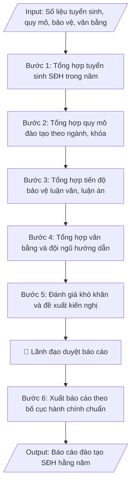

# Báo cáo đào tạo sau đại học hằng năm

## Kiểm soát áp dụng và phê duyệt

Trước khi chạy quy trình, xác định `ngay_ap_dung`, `loai_hinh_truong`, `quy_che_noi_bo`, `nguon_du_lieu` và `nguoi_kiem_duyet`. Chỉ yêu cầu thông tin có liên quan đến nghiệp vụ; không dùng giá trị giả định thay dữ liệu bắt buộc. Hồ sơ có yếu tố pháp lý phải kèm văn bản gốc, tình trạng hiệu lực, điều khoản áp dụng và chuyển tiếp.

## Giới hạn và human gate

AI hỗ trợ chuẩn bị và đối chiếu. Cán bộ phụ trách kiểm tra dữ liệu/căn cứ, người có thẩm quyền duyệt và ký. Mọi đầu ra mặc định là **DỰ THẢO – CHỜ KIỂM DUYỆT**; không đánh dấu đã ký, đã duyệt hoặc đã công bố nếu chưa có chứng cứ. Dữ liệu sinh viên, sức khỏe, nhân sự và tài chính phải hạn chế theo mục đích, phân quyền và che thông tin định danh khi dùng ví dụ. Không tải dữ liệu lên dịch vụ ngoài khi chưa có quyền. Kiểm tra Luật 91/2025/QH15 về bảo vệ dữ liệu cá nhân (hiệu lực 01/01/2026) và quy định áp dụng trước xử lý/chia sẻ dữ liệu cá nhân.


## Khi nào dùng
Cuối mỗi năm học / năm dương lịch, khi Phòng Đào tạo Sau đại học cần tổng hợp toàn bộ hoạt động
đào tạo thạc sĩ, tiến sĩ trong năm: tuyển sinh, quy mô đào tạo, tiến độ học tập và bảo vệ,
văn bằng cấp, đội ngũ giảng viên hướng dẫn — để báo cáo Ban Giám hiệu, Hội đồng trường
và gửi Bộ GD&ĐT theo yêu cầu thống kê.

## Đầu vào (Input)

| Trường | Mô tả | Bắt buộc |
|---|---|---|
| `nam_bao_cao` | Năm báo cáo, vd: 2026 | Có |
| `tuyen_sinh` | Chỉ tiêu, số trúng tuyển, số nhập học thạc sĩ/tiến sĩ theo đợt và theo ngành | Có |
| `quy_mo` | Số học viên cao học, NCS đang đào tạo theo ngành, khóa | Có |
| `tien_do_bao_ve` | Số luận văn thạc sĩ / luận án tiến sĩ đã bảo vệ, đang chờ bảo vệ, quá hạn | Có |
| `van_bang` | Số văn bằng thạc sĩ / tiến sĩ đã cấp trong năm | Có |
| `doi_ngu_hd` | Số giảng viên đủ tiêu chuẩn hướng dẫn SĐH (GS/PGS/TS), số lượng HV/NCS đang hướng dẫn bình quân | Có |
| `bai_bao_ncs` | Số bài báo khoa học của NCS công bố trong năm (trong nước / quốc tế) | Không |
| `kho_khan_kien_nghi` | Khó khăn, tồn tại và kiến nghị, đề xuất | Có |

## Quy trình

**Bước 1. Tổng hợp tuyển sinh SĐH trong năm**
- Làm gì: lấy số liệu từng đợt tuyển trong năm: chỉ tiêu được giao/phê duyệt, số hồ sơ, số trúng
  tuyển, số nhập học — tách riêng thạc sĩ và tiến sĩ, chi tiết theo từng đợt tuyển và từng ngành;
  tính tỷ lệ hoàn thành chỉ tiêu (trúng tuyển/chỉ tiêu, nhập học/chỉ tiêu).
- Dùng input: `nam_bao_cao`, `tuyen_sinh`
- Vai trò: Chuyên viên Phòng Sau đại học · AI hỗ trợ: tổng hợp số liệu từng đợt tuyển (chỉ tiêu, hồ sơ, trúng tuyển) · ⏱ ~1 giờ (ước tính)
- Lưu ý nghiệp vụ: số nhập học (thực học) mới là con số phản ánh đúng quy mô, không dùng số trúng
  tuyển để báo cáo quy mô; ghi rõ ngành nào không đạt chỉ tiêu và mức độ.
- → Kết quả bước: bảng tuyển sinh SĐH trong năm (đợt – ngành – trình độ: chỉ tiêu, trúng tuyển,
  nhập học, tỷ lệ hoàn thành).

**Bước 2. Tổng hợp quy mô đào tạo theo ngành, khóa**
- Làm gì: thống kê số học viên cao học và NCS đang theo học theo ngành và khóa; thống kê số bảo
  lưu, thôi học, chuyển ngành (nếu có) trong năm; so sánh với năm trước để thấy xu hướng tăng/giảm.
- Dùng input: `nam_bao_cao`, `quy_mo`
- Vai trò: Chuyên viên Phòng Sau đại học · AI hỗ trợ: thống kê số học viên cao học và NCS theo ngành, khóa · ⏱ ~1 giờ (ước tính)
- Lưu ý nghiệp vụ: số liệu chốt thống nhất đến 30/9 hằng năm; đối chiếu với Phòng Đào tạo (đại học)
  để tránh trùng lặp khi tổng hợp báo cáo toàn trường.
- → Kết quả bước: bảng quy mô đào tạo (ngành – khóa: số HV cao học, số NCS) + số liệu bảo lưu/
  thôi học + so sánh với năm trước.

**Bước 3. Tổng hợp tiến độ bảo vệ luận văn, luận án**
- Làm gì: thống kê 3 nhóm: (a) số luận văn thạc sĩ / luận án tiến sĩ đã bảo vệ thành công trong
  năm; (b) số đang trong quy trình (đã nộp, chờ phản biện, chờ lịch bảo vệ); (c) số quá hạn đào
  tạo — ghi rõ nguyên nhân chính của từng nhóm quá hạn.
- Dùng input: `nam_bao_cao`, `tien_do_bao_ve`
- Vai trò: Chuyên viên Phòng Sau đại học · AI hỗ trợ: thống kê luận văn/luận án đã bảo vệ thành công · ⏱ ~45 phút (ước tính)
- Lưu ý nghiệp vụ: "quá hạn" tính theo thời gian đào tạo tối đa của quy chế (đã trừ thời gian được
  gia hạn hợp lệ); nguyên nhân quá hạn phải cụ thể để làm cơ sở cho kiến nghị.
- → Kết quả bước: bảng tiến độ bảo vệ (đã bảo vệ / đang chờ / quá hạn theo trình độ) + phân tích
  nguyên nhân quá hạn.

**Bước 4. Tổng hợp văn bằng và đội ngũ hướng dẫn**
- Làm gì: thống kê số văn bằng thạc sĩ/tiến sĩ đã cấp trong năm; lập danh sách giảng viên đủ tiêu
  chuẩn hướng dẫn SĐH (theo TT 23/2021, TT 18/2021: trình độ TS trở lên, có bài báo khoa học);
  tính tỷ lệ NCS/giảng viên hướng dẫn; thống kê số bài báo khoa học của NCS công bố trong năm
  (trong nước / quốc tế).
- Dùng input: `nam_bao_cao`, `van_bang`, `doi_ngu_hd`, `bai_bao_ncs`
- Vai trò: Chuyên viên Phòng Sau đại học · AI hỗ trợ: thống kê văn bằng đã cấp, lập danh sách GV đủ tiêu chuẩn hướng dẫn · ⏱ ~1 giờ (ước tính)
- Lưu ý nghiệp vụ: "đủ tiêu chuẩn hướng dẫn" phải kiểm tra cả tiêu chí bài báo khoa học, không chỉ
  học vị; số văn bằng đã cấp đối chiếu với quyết định công nhận tốt nghiệp trong năm.
- → Kết quả bước: số liệu văn bằng đã cấp + danh sách GV đủ tiêu chuẩn hướng dẫn + tỷ lệ
  NCS/GV + số bài báo khoa học của NCS.

**Bước 5. Đánh giá khó khăn và đề xuất kiến nghị**
- Làm gì: phân tích tồn tại từ số liệu 4 bước trên (ngành nào tuyển sinh chưa đạt chỉ tiêu, tỷ lệ
  quá hạn, thiếu giảng viên hướng dẫn ngành mới...); đề xuất giải pháp khắc phục và kiến nghị cụ
  thể gửi Ban Giám hiệu / Bộ GD&ĐT.
- Dùng input: `kho_khan_kien_nghi`
- Vai trò: Lãnh đạo phụ trách đào tạo sau đại học · AI hỗ trợ: phân tích tồn tại từ số liệu, phác thảo kiến nghị · ⏱ ~2 giờ (ước tính)
- Lưu ý nghiệp vụ: mỗi kiến nghị phải gắn với số liệu minh chứng và đơn vị có thẩm quyền giải
  quyết; phân biệt kiến nghị thuộc thẩm quyền trường và kiến nghị vượt thẩm quyền (gửi Bộ).
- → Kết quả bước: phần đánh giá khó khăn, tồn tại + danh mục kiến nghị có căn cứ số liệu.

**Bước 6. Xuất báo cáo theo bố cục hành chính chuẩn**
- Làm gì: trình bày báo cáo theo bố cục: tiêu đề + kính gửi + căn cứ (kế hoạch công tác, yêu cầu
  thống kê) → I. Kết quả thực hiện (đánh số 1–5 theo từng nội dung, kèm bảng số liệu chi tiết) →
  II. Đánh giá chung → III. Kiến nghị → phần kết → nơi nhận, chữ ký; kiểm tra nhất quán số liệu
  giữa văn bản và bảng trước khi trình ký.
- Dùng input: `nam_bao_cao`
- Vai trò: Chuyên viên Phòng Sau đại học · AI hỗ trợ: trình bày báo cáo theo bố cục chuẩn, kiểm tra nhất quán số liệu · ⏱ ~1 giờ (ước tính)
- Lưu ý nghiệp vụ: bẫy thường gặp là số liệu trong văn bản và bảng tổng hợp không khớp sau nhiều
  lần chỉnh sửa — kiểm tra chéo lần cuối; báo cáo gửi Bộ phải đúng mẫu và thời hạn thống kê.
- → Kết quả bước: báo cáo đào tạo SĐH hằng năm hoàn chỉnh, số liệu nhất quán, sẵn sàng trình ký
  và gửi.

## Luồng quy trình (Workflow)


## Đầu ra (Output)
- Báo cáo đào tạo sau đại học hằng năm hoàn chỉnh.
- Bảng số liệu chi tiết: tuyển sinh, quy mô, bảo vệ, văn bằng, đội ngũ (theo ngành).

**Cấu trúc output chuẩn:** khung mẫu cố định của báo cáo đào tạo sau đại học hằng năm, các phần theo đúng thứ tự:
1. Phần đầu văn bản: tên trường + đơn vị (Phòng Đào tạo Sau đại học); quốc hiệu – tiêu ngữ;
   số, ký hiệu báo cáo; địa danh, ngày tháng năm ban hành.
2. Tên báo cáo + năm báo cáo: "BÁO CÁO" + "Công tác đào tạo sau đại học năm…".
3. Kính gửi + phần căn cứ: kính gửi Ban Giám hiệu; căn cứ kế hoạch công tác và yêu cầu thống kê
   của Bộ GD&ĐT.
4. Nội dung chính theo thứ tự: I. Kết quả thực hiện — đánh số 1–5 (1. Công tác tuyển sinh;
   2. Quy mô đào tạo — kèm bảng theo ngành; 3. Tiến độ bảo vệ luận văn, luận án; 4. Cấp văn bằng;
   5. Đội ngũ giảng viên hướng dẫn — kèm số bài báo khoa học của NCS); II. Đánh giá chung;
   III. Kiến nghị (đánh số từng kiến nghị).
5. Phần kết: câu kết báo cáo, kính báo cáo Ban Giám hiệu xem xét, chỉ đạo.
6. Phần cuối: nơi nhận; chữ ký, họ tên người ký.
7. Sản phẩm kèm theo: bảng số liệu chi tiết (tuyển sinh, quy mô, bảo vệ, văn bằng, đội ngũ
   theo ngành).


## Checklist nghiệm thu
- [ ] Đủ các phần theo "Cấu trúc output chuẩn": phần đầu văn bản; tên báo cáo + năm báo cáo; kính gửi + phần căn cứ; nội dung I (kết quả thực hiện, 5 mục đánh số), II (đánh giá chung), III (kiến nghị đánh số); phần kết; nơi nhận, chữ ký; bảng số liệu chi tiết theo ngành.
- [ ] Số liệu/nội dung trong output khớp với Input đã cho (năm báo cáo, tuyển sinh, quy mô, tiến độ bảo vệ, văn bằng, đội ngũ hướng dẫn, bài báo NCS, khó khăn – kiến nghị).
- [ ] Không bịa đặt số liệu, minh chứng, trích dẫn.
- [ ] Đúng bố cục văn bản hành chính chuẩn của báo cáo hằng năm.
- [ ] Căn cứ pháp lý đầy đủ, còn hiệu lực (Thông tư 23/2021/TT-BGDĐT, Thông tư 18/2021/TT-BGDĐT, kế hoạch công tác và yêu cầu thống kê của Bộ GD&ĐT).
- [ ] Đã qua Human gate: lãnh đạo (Ban Giám hiệu) đã duyệt báo cáo.
- [ ] Số liệu chốt thống nhất đến 30/9 hằng năm; đã đối chiếu với Phòng Đào tạo (đại học) để tránh trùng lặp; số nhập học (thực học) dùng cho quy mô, không dùng số trúng tuyển.
- [ ] "Quá hạn" tính đúng thời gian đào tạo tối đa của quy chế (đã trừ thời gian gia hạn hợp lệ); nguyên nhân quá hạn cụ thể; "đủ tiêu chuẩn hướng dẫn" kiểm tra cả tiêu chí bài báo khoa học, không chỉ học vị.
- [ ] Mỗi kiến nghị gắn số liệu minh chứng và đơn vị có thẩm quyền giải quyết; phân biệt kiến nghị thuộc thẩm quyền trường và kiến nghị vượt thẩm quyền (gửi Bộ).
Tiêu chí đạt = tất cả các ô được đánh dấu.

## Ví dụ mô phỏng (dữ liệu giả lập)

> Tất cả tên trường, cá nhân, số liệu dưới đây đều là **giả lập**, không liên quan tổ chức/cá nhân có thật.

### Input mẫu

| Trường | Giá trị |
|---|---|
| `nam_bao_cao` | 2026 |
| `tuyen_sinh` | Thạc sĩ: chỉ tiêu 420, trúng tuyển 385, nhập học 362 (đợt 1: 210; đợt 2: 152). Tiến sĩ: chỉ tiêu 25, trúng tuyển 18, nhập học 17. |
| `quy_mo` | 812 học viên cao học (CNTT: 342; QTKD: 310; Kế toán: 160); 63 NCS (CNTT: 28; QTKD: 22; Kế toán: 13). Bảo lưu: 24 HV; thôi học: 9 HV, 2 NCS. |
| `tien_do_bao_ve` | Đã bảo vệ: 296 luận văn ThS, 11 luận án TS. Chờ bảo vệ: 45 ThS, 6 TS. Quá hạn: 18 HV (chủ yếu khóa 2023), 4 NCS. |
| `van_bang` | Đã cấp 289 bằng thạc sĩ, 10 bằng tiến sĩ. |
| `doi_ngu_hd` | 96 giảng viên đủ tiêu chuẩn HD SĐH (12 GS/PGS, 84 TS). Bình quân 3,2 NCS/GV hướng dẫn chính. |
| `bai_bao_ncs` | 34 bài (12 quốc tế Scopus/ISI, 22 trong nước). |
| `kho_khan_kien_nghi` | Tuyển sinh TS ngành Kế toán chỉ đạt 40% chỉ tiêu; 18 HV quá hạn do vướng công việc; thiếu GV hướng dẫn ngành Kế toán. Kiến nghị: tăng cường truyền thông tuyển sinh TS; siết tiến độ qua seminar định kỳ. |

### Output mẫu

```
TRƯỜNG ĐẠI HỌC A            CỘNG HÒA XÃ HỘI CHỦ NGHĨA VIỆT NAM
PHÒNG ĐÀO TẠO SAU ĐẠI HỌC                Độc lập – Tự do – Hạnh phúc
      Số: 148/BC-SĐH
                                                   Thành phố C, ngày 09 tháng 10 năm 2026

                          BÁO CÁO
         Công tác đào tạo sau đại học năm 2026

Kính gửi: Ban Giám hiệu Trường Đại học A

Căn cứ kế hoạch công tác năm học 2025–2026 và yêu cầu thống kê của
Bộ Giáo dục và Đào tạo, Phòng Đào tạo Sau đại học báo cáo kết quả
công tác đào tạo sau đại học năm 2026 như sau:

I. KẾT QUẢ THỰC HIỆN

1. Công tác tuyển sinh
Năm 2026, Nhà trường tổ chức 02 đợt tuyển sinh sau đại học. Kết quả:
- Trình độ thạc sĩ: chỉ tiêu 420; trúng tuyển 385 (đạt 91,7%); nhập học 362,
  trong đó đợt 1: 210, đợt 2: 152.
- Trình độ tiến sĩ: chỉ tiêu 25; trúng tuyển 18 (đạt 72%); nhập học 17.
Tuyển sinh thạc sĩ đạt tốt; tuyển sinh tiến sĩ ngành Kế toán chỉ đạt 40%
chỉ tiêu (04/10).

2. Quy mô đào tạo
Tính đến 30/9/2026, toàn trường có 812 học viên cao học và 63 nghiên cứu sinh
đang đào tạo:
| Ngành               | Học viên cao học | NCS |
|---------------------|------------------|-----|
| Công nghệ thông tin | 342              | 28  |
| Quản trị kinh doanh | 310              | 22  |
| Kế toán             | 160              | 13  |
| TỔNG                | 812              | 63  |
Trong năm có 24 học viên bảo lưu, 09 học viên và 02 NCS thôi học.

3. Tiến độ bảo vệ luận văn, luận án
- Đã tổ chức bảo vệ thành công: 296 luận văn thạc sĩ, 11 luận án tiến sĩ.
- Đang trong quy trình bảo vệ: 45 luận văn thạc sĩ, 06 luận án tiến sĩ.
- Quá hạn đào tạo: 18 học viên (chủ yếu khóa 2023, nguyên nhân: vướng công
  việc cơ quan) và 04 NCS (chậm tiến độ chuyên đề và bài báo).

4. Cấp văn bằng
Trong năm đã cấp 289 bằng thạc sĩ và 10 bằng tiến sĩ, 100% đúng thời hạn
quy định sau khi học viên hoàn thành nghĩa vụ.

5. Đội ngũ giảng viên hướng dẫn
Toàn trường có 96 giảng viên đủ tiêu chuẩn hướng dẫn SĐH (12 GS/PGS, 84 TS),
bình quân 3,2 NCS/giảng viên hướng dẫn chính. NCS đã công bố 34 bài báo
khoa học trong năm (12 bài quốc tế thuộc danh mục Scopus/ISI, 22 bài
trong nước).

II. ĐÁNH GIÁ CHUNG
Công tác đào tạo SĐH năm 2026 cơ bản hoàn thành kế hoạch: tuyển sinh thạc sĩ
đạt 91,7% chỉ tiêu; 307 lượt bảo vệ thành công; văn bằng cấp đúng hạn.
Tồn tại chính: tuyển sinh tiến sĩ một số ngành chưa đạt chỉ tiêu; còn 22
trường hợp quá hạn đào tạo; thiếu giảng viên hướng dẫn ngành Kế toán.

III. KIẾN NGHỊ
1. Tăng cường truyền thông tuyển sinh tiến sĩ, nhất là ngành Kế toán;
   đề nghị Ban Giám hiệu phê duyệt chính sách học bổng NCS.
2. Siết tiến độ đào tạo: tổ chức seminar tiến độ định kỳ mỗi 06 tháng đối với
   học viên/NCS có nguy cơ quá hạn; gắn trách nhiệm người hướng dẫn.
3. Đề nghị Khoa Kế toán – Kiểm toán xây dựng kế hoạch phát triển đội ngũ
   giảng viên đủ tiêu chuẩn hướng dẫn SĐH giai đoạn 2027–2030.

Trên đây là báo cáo công tác đào tạo sau đại học năm 2026, Phòng Đào tạo
Sau đại học kính báo cáo Ban Giám hiệu xem xét, chỉ đạo./.

Nơi nhận:                                     TRƯỞNG PHÒNG
- Ban Giám hiệu (báo cáo);                         [CHỜ KÝ]
- Lưu: VT, SĐH.

                                            TS. Trần Văn D
```

## Căn cứ & lưu ý
- Thông tư 23/2021/TT-BGDĐT (Quy chế đào tạo trình độ thạc sĩ); Thông tư 18/2021/TT-BGDĐT
  (Quy chế tuyển sinh và đào tạo trình độ tiến sĩ).
- Số liệu chốt thống nhất đến 30/9 hằng năm; đối chiếu với Phòng Đào tạo (đại học) để tránh
  trùng lặp số liệu khi tổng hợp báo cáo toàn trường.
- Không dùng tên thật của trường/cá nhân khi mô phỏng.

## Quản trị phiên bản

- Phiên bản gói: `1.1.0`; ngày cập nhật: `2026-10-09`.
- Kho nguồn: https://github.com/phamtruong91/dh-skills
- Người duy trì trên GitHub: `phamtruong91` (Phạm Văn Trường). Người phê duyệt nghiệp vụ: **chưa chỉ định**.
- Commit nguồn trước cập nhật: `78fd1d51b8acd1a724d9b9af6c488460bc7551ad`. Commit chứa phiên bản này xem bằng `git log -1 -- skills/bao-cao-dao-tao-sdh`; không tự gán SHA chưa tạo.
- Giấy phép: theo LICENSE của kho; bản quyền CES Global.
- Lịch sử 1.1.0: bổ sung metadata giao diện, kiểm soát áp dụng, quản trị phiên bản.
- Trạng thái: dự thảo nghiệp vụ; kiểm tra pháp lý trước thực thi. Ngày cập nhật không đồng nghĩa mọi văn bản đã được rà soát toàn văn.
