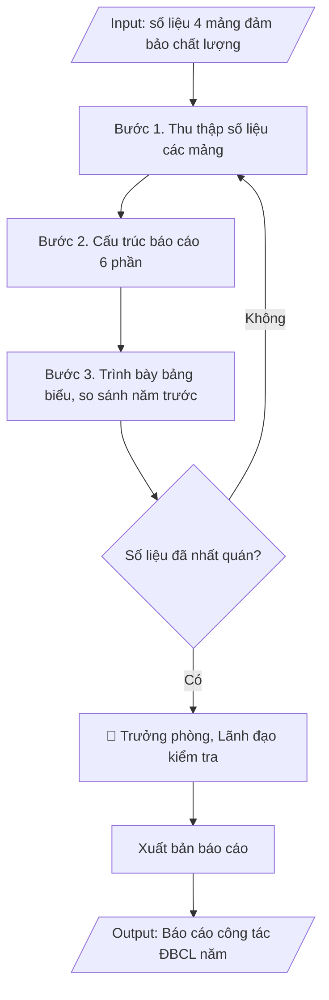

# Skill: Báo cáo công tác đảm bảo chất lượng năm

## Khi nào dùng
Khi kết thúc năm học, Phòng Khảo thí & ĐBCL cần tổng hợp toàn bộ hoạt động đảm bảo
chất lượng thành báo cáo chung.

## Đầu vào (Input)

| Trường | Mô tả | Bắt buộc |
|---|---|---|
| `nam_hoc` | Năm học báo cáo (VD: 2026–2027) | Có |
| `so_lieu_khao_thi` | Số kỳ thi, số lượt SV dự thi, tỷ lệ vi phạm, số đơn phúc khảo | Có |
| `so_lieu_tdg_kiem_dinh` | Tiến độ tự đánh giá / kiểm định CSGD, CTĐT trong năm | Có |
| `so_lieu_khao_sat` | Các đợt khảo sát đã thực hiện + kết quả chính | Có |
| `tien_do_cai_tien` | Tiến độ thực hiện kế hoạch cải tiến chất lượng | Có |
| `nguoi_ky` | Trưởng phòng KT&ĐBCL / Phó Hiệu trưởng | Có |

## Quy trình

**Bước 1. Thu thập số liệu**
- Làm gì: Thu thập số liệu năm học từ 04 mảng: (a) Khảo thí — số kỳ thi, số lượt SV dự thi, số trường hợp vi phạm, số đơn phúc khảo, kết quả phân tích đề thi (từ `so_lieu_khao_thi`); (b) Tự đánh giá/kiểm định — tiến độ TĐG các CTĐT/CSGD, số CTĐT được công nhận, tình trạng minh chứng (từ `so_lieu_tdg_kiem_dinh`); (c) Khảo sát — các đợt khảo sát đã thực hiện, số phiếu hợp lệ, kết quả chính (từ `so_lieu_khao_sat`); (d) Cải tiến — số giải pháp hoàn thành/tổng số, các nội dung chuyển tiếp (từ `tien_do_cai_tien`).
- Dùng input: `nam_hoc`, `so_lieu_khao_thi`, `so_lieu_tdg_kiem_dinh`, `so_lieu_khao_sat`, `tien_do_cai_tien`.
- Vai trò: Các đơn vị (cung cấp số liệu chính thức từ báo cáo của đơn vị mình) · AI hỗ trợ: tổng hợp số liệu 04 mảng theo khung, cảnh báo số liệu thiếu/khác nhau giữa các nguồn · ⏱ ~1 tuần (ước tính)
- Lưu ý nghiệp vụ: số liệu phải lấy từ báo cáo chính thức của các đơn vị, không dùng số liệu ước tính; ghi rõ nguồn số liệu từng mảng để tiện đối chiếu.
- → Kết quả bước: Bộ số liệu thô 04 mảng đã có nguồn rõ ràng.

**Bước 2. Cấu trúc báo cáo**
- Làm gì: Sắp xếp số liệu vào khung báo cáo 06 phần cố định: Phần 1 – Khái quát tình hình chung; Phần 2 – Công tác khảo thí (số kỳ thi, quy mô, kỷ luật thi, phúc khảo, phân tích đề thi); Phần 3 – Tự đánh giá và kiểm định (tiến độ, kết quả, minh chứng); Phần 4 – Khảo sát các bên liên quan (đợt khảo sát, kết quả chính); Phần 5 – Cải tiến chất lượng (tiến độ kế hoạch cải tiến); Phần 6 – Đánh giá chung (ưu điểm, tồn tại) và phương hướng năm học tới; viết dự thảo từng phần.
- Dùng input: `nam_hoc`, `so_lieu_khao_thi`, `so_lieu_tdg_kiem_dinh`, `so_lieu_khao_sat`, `tien_do_cai_tien`.
- Vai trò: Chuyên viên Phòng Khảo thí & ĐBCL · AI hỗ trợ: soạn dự thảo từng phần từ số liệu, sắp xếp vào khung báo cáo 06 phần · ⏱ ~2 ngày làm việc (ước tính)
- Lưu ý nghiệp vụ: Phần 6 phải rút ra từ số liệu 05 phần trước, không viết nhận định chung chung; phương hướng năm tới phải gắn với các tồn tại đã nêu.
- → Kết quả bước: Dự thảo báo cáo đầy đủ 06 phần.

**Bước 3. Trình bày số liệu bằng bảng biểu**
- Làm gì: Chuyển các số liệu chính thành bảng biểu trong từng phần; bổ sung cột so sánh với năm học trước để thấy xu hướng tăng/giảm (VD: số vi phạm thi, tỷ lệ minh chứng đầy đủ, điểm hài lòng); vẽ biểu đồ cho các chỉ số xu hướng quan trọng.
- Dùng input: `so_lieu_khao_thi`, `so_lieu_tdg_kiem_dinh`, `so_lieu_khao_sat`, `tien_do_cai_tien`.
- Vai trò: Chuyên viên Phòng Khảo thí & ĐBCL · AI hỗ trợ: lập bảng biểu, biểu đồ so sánh với năm học trước · ⏱ ~2 giờ (ước tính)
- Lưu ý nghiệp vụ: mọi con số so sánh phải cùng phương pháp tính với năm trước; ghi chú rõ đơn vị tính và kỳ so sánh dưới mỗi bảng.
- → Kết quả bước: Các bảng biểu, biểu đồ so sánh với năm học trước đã chèn vào báo cáo.

**Bước 4. Kiểm tra**
- Làm gì: Rà soát tính nhất quán số liệu giữa các phần của báo cáo (VD: số kỳ thi ở Phần 2 phải khớp số liệu gốc ở Bước 1); đối chiếu với báo cáo của các đơn vị nguồn; kiểm tra đầy đủ thể thức văn bản: số/ký hiệu, ngày tháng, chữ ký `nguoi_ky`, nơi nhận; hiệu đính trước khi trình.
- Dùng input: `nguoi_ky`, `nam_hoc`.
- Vai trò: Trưởng phòng Khảo thí & ĐBCL (rà soát, kiểm tra) · AI hỗ trợ: đối chiếu tính nhất quán số liệu giữa các phần, kiểm tra thể thức văn bản · ⏱ ~4 giờ (ước tính)
- Lưu ý nghiệp vụ: bẫy thường gặp — cùng một chỉ số nhưng số liệu khác nhau giữa các phần do lấy từ 02 nguồn khác nhau; mọi số liệu trong báo cáo phải kiểm chứng được bằng minh chứng.
- → Kết quả bước: Dự thảo báo cáo đã kiểm tra nhất quán số liệu và thể thức.

**Bước 5. Xuất bản**
- Làm gì: Trình `nguoi_ky` (Trưởng phòng KT&ĐBCL / Phó Hiệu trưởng) ký ban hành; gửi báo cáo đến Ban Giám hiệu và các đơn vị liên quan theo nơi nhận; lưu 01 bản vào hồ sơ công tác ĐBCL năm học.
- Dùng input: `nguoi_ky`, `nam_hoc`.
- Vai trò: Trưởng phòng KT&ĐBCL / Phó Hiệu trưởng ký ban hành, Văn thư phát hành và lưu hồ sơ · AI hỗ trợ: kiểm tra nơi nhận và thể thức trước khi ban hành · ⏱ ~2 ngày làm việc (ước tính)
- Lưu ý nghiệp vụ: báo cáo ĐBCL năm là đầu vào cho báo cáo tổng kết năm học toàn trường và báo cáo 3 công khai — phải ban hành đúng tiến độ để các đơn vị khác sử dụng.
- → Kết quả bước: Báo cáo công tác đảm bảo chất lượng năm học đã ban hành.

## Luồng quy trình (Workflow)


## Đầu ra (Output)
- Báo cáo công tác đảm bảo chất lượng năm học hoàn chỉnh.

**Cấu trúc output chuẩn:** báo cáo hành chính gồm các phần bắt buộc theo đúng thứ tự:
1. Quốc hiệu, tên cơ quan ban hành (Phòng Khảo thí & ĐBCL), số/ký hiệu văn bản, địa danh và ngày tháng năm ban hành;
2. Tên loại văn bản (BÁO CÁO) + trích yếu (công tác đảm bảo chất lượng năm học...);
3. Phần I – Khái quát chung (các mảng công tác ĐBCL triển khai trong năm);
4. Phần II – Công tác khảo thí (số kỳ thi, quy mô, kỷ luật thi, phúc khảo, phân tích chất lượng đề thi);
5. Phần III – Tự đánh giá và kiểm định (tiến độ TĐG, kết quả kiểm định, tình trạng minh chứng);
6. Phần IV – Khảo sát các bên liên quan (các đợt khảo sát, số phiếu, kết quả nổi bật);
7. Phần V – Cải tiến chất lượng (tiến độ kế hoạch cải tiến, nội dung chuyển tiếp);
8. Phần VI – Đánh giá chung và phương hướng (ưu điểm, tồn tại, phương hướng năm học tới);
9. Nơi nhận;
10. Chức vụ người ký, chữ ký, họ tên người ký.

## Checklist nghiệm thu

- [ ] Đủ 10 phần theo "Cấu trúc output chuẩn": quốc hiệu + số/ký hiệu + địa danh, ngày tháng; BÁO CÁO + trích yếu; Phần I – Khái quát chung; Phần II – Công tác khảo thí; Phần III – Tự đánh giá và kiểm định; Phần IV – Khảo sát các bên liên quan; Phần V – Cải tiến chất lượng; Phần VI – Đánh giá chung và phương hướng; Nơi nhận; chức vụ/chữ ký/họ tên người ký.
- [ ] Số liệu 04 mảng (khảo thí, tự đánh giá/kiểm định, khảo sát, cải tiến) lấy từ báo cáo chính thức của các đơn vị (không dùng số liệu ước tính), khớp với Input, ghi rõ nguồn số liệu từng mảng.
- [ ] Không bịa đặt số liệu năm học.
- [ ] Đúng thể thức văn bản hành chính theo Nghị định 30/2020/NĐ-CP.
- [ ] Số liệu so sánh với năm học trước dùng cùng phương pháp tính; ghi chú rõ đơn vị tính và kỳ so sánh dưới mỗi bảng.
- [ ] Đã qua Human gate: người có thẩm quyền theo quy trình đã duyệt.
- [ ] Số liệu nhất quán giữa các phần của báo cáo; mọi số liệu trong báo cáo kiểm chứng được bằng minh chứng.
- [ ] Phần VI rút ra từ số liệu 05 phần trước (không nhận định chung chung); phương hướng năm tới gắn với các tồn tại đã nêu.
- [ ] Đã ban hành đúng tiến độ để phục vụ báo cáo tổng kết năm học toàn trường và báo cáo 3 công khai.

Tiêu chí đạt = tất cả các ô được đánh dấu.

## Ví dụ mô phỏng (dữ liệu giả lập)

> Tất cả tên trường, cá nhân, số liệu dưới đây đều là **giả lập**, không liên quan tổ chức/cá nhân có thật.

### Input mẫu

| Trường | Giá trị |
|---|---|
| `nam_hoc` | 2026–2027 |
| `so_lieu_khao_thi` | 04 kỳ thi; 18.200 lượt SV dự thi; 12 trường hợp vi phạm; 86 đơn phúc khảo |
| `so_lieu_tdg_kiem_dinh` | Hoàn thành TĐG 03 CTĐT; 01 CTĐT được công nhận kiểm định |
| `so_lieu_khao_sat` | 03 đợt (SV, cựu SV, NTD); 1.250 phiếu hợp lệ |
| `tien_do_cai_tien` | 18/22 giải pháp hoàn thành (81,8%) |

### Output mẫu

```
TRƯỜNG ĐẠI HỌC A            CỘNG HÒA XÃ HỘI CHỦ NGHĨA VIỆT NAM
PHÒNG KHẢO THÍ & ĐBCL                    Độc lập – Tự do – Hạnh phúc
      Số: 95/BC-ĐHA-KTĐBCL
                                                 Thành phố C, ngày 09 tháng 10 năm 2026

BÁO CÁO
Công tác đảm bảo chất lượng năm học 2026–2027

I. KHÁI QUÁT CHUNG
Năm học 2026–2027, công tác đảm bảo chất lượng được triển khai đồng bộ trên
04 mảng: khảo thí, tự đánh giá/kiểm định, khảo sát các bên liên quan và cải tiến
chất lượng.

II. CÔNG TÁC KHẢO THÍ
- Tổ chức 04 kỳ thi với 18.200 lượt sinh viên dự thi, đảm bảo nghiêm túc, đúng quy chế.
- Xử lý 12 trường hợp vi phạm quy chế thi (giảm 04 trường hợp so với năm trước).
- Tiếp nhận và giải quyết 86 đơn phúc khảo, đúng thời hạn 100%.
- Phân tích chất lượng đề thi 120 học phần: 82% số câu hỏi đạt yêu cầu.

III. TỰ ĐÁNH GIÁ VÀ KIỂM ĐỊNH
- Hoàn thành báo cáo tự đánh giá 03 CTĐT (CNTT, Kế toán, Ngôn ngữ Anh).
- 01 CTĐT ngành Kế toán được công nhận đạt chuẩn kiểm định chất lượng.
- Hệ thống minh chứng: 96% minh chứng đã đầy đủ, mã hóa thống nhất.

IV. KHẢO SÁT CÁC BÊN LIÊN QUAN
- Thực hiện 03 đợt khảo sát (sinh viên, cựu sinh viên, nhà tuyển dụng)
  với 1.250 phiếu hợp lệ.
- Kết quả nổi bật: 78% cựu SV có việc làm trong 6 tháng sau tốt nghiệp;
  điểm hài lòng chung của SV đạt 3.9/5.

V. CẢI TIẾN CHẤT LƯỢNG
- Triển khai kế hoạch cải tiến với 22 giải pháp; đã hoàn thành 18/22 (81,8%).
- 04 giải pháp chuyển tiếp sang năm học 2027–2028 (đầu tư lab, tuyển TS).

VI. ĐÁNH GIÁ CHUNG VÀ PHƯƠNG HƯỚNG
1. Ưu điểm: kỷ luật thi được giữ vững; công tác kiểm định đúng tiến độ.
2. Tồn tại: tỷ lệ giảng viên tiến sĩ chưa đạt mục tiêu; một số phòng thí nghiệm
   chưa đáp ứng yêu cầu đào tạo.
3. Phương hướng năm 2027–2028: hoàn thành TĐG 02 CTĐT còn lại; nâng tỷ lệ
   giảng viên tiến sĩ lên 35%; số hóa 100% quy trình khảo thí.

Nơi nhận:                                     TRƯỞNG PHÒNG
- Ban Giám hiệu (báo cáo);                        (đã ký)
- Các phòng, khoa (phối hợp);
- Lưu: VT, KTĐBCL.

                                              TS. Đỗ Thị C
```

## Căn cứ & lưu ý
- Thông tư 12/2017/TT-BGDĐT; Thông tư 04/2016/TT-BGDĐT.
- Số liệu trong báo cáo phải nhất quán với báo cáo của các đơn vị và có thể kiểm chứng
  bằng minh chứng.
- Báo cáo ĐBCL năm là đầu vào cho báo cáo tổng kết năm học toàn trường và báo cáo
  3 công khai.
- Không dùng tên thật của trường/cá nhân khi mô phỏng.
