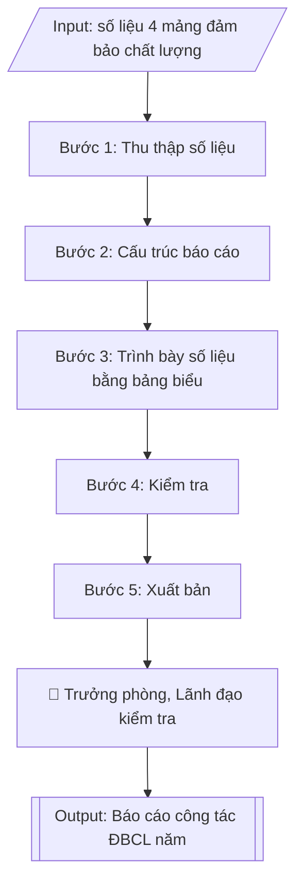

# Báo cáo công tác đảm bảo chất lượng năm

## Định dạng và file đầu ra
Định dạng đầu ra có thể chọn theo sản phẩm/yêu cầu: .docx, .pdf. Đọc mục “Định dạng bổ sung” trong quy cách đầu ra trước khi chọn.

**Phải tạo file thực tế để tải xuống, không chỉ trả nội dung trong chat.** Định dạng mặc định của skill: **.docx**. Nếu có bảng số liệu nghiệp vụ yêu cầu file bảng tính riêng, tạo thêm Excel theo yêu cầu; không tự tạo file kiểm tra. Không chờ người dùng yêu cầu xuất file lần nữa. Ưu tiên định dạng người dùng chỉ định; đọc quy tắc xuất file tại references/quy-cach-dau-ra.md.

## Quy cách đầu ra và thông tin thiếu
Đọc [quy cách và cấu trúc sản phẩm](references/quy-cach-dau-ra.md) trước khi soạn/xuất. File giao chỉ gồm sản phẩm nghiệp vụ được yêu cầu; kiểm tra nội bộ không xuất kèm. Thiếu thông tin thì giữ nguyên trường/mục và chỗ điền theo mẫu gốc (dòng dấu chấm, dấu gạch hoặc ô trống); không tự điền dữ liệu mẫu, số 0, mã chờ xác minh hay dòng chờ ký. Mẫu chuyên ngành còn áp dụng được ưu tiên về cấu trúc, mã biểu và người ký. Bản đầy đủ: [quy tắc chung](references/quy-tac-chung.md).

## Kiểm soát áp dụng và phê duyệt
Trước khi chạy, xác định `ngay_ap_dung`, `loai_hinh_truong`, `quy_che_noi_bo`, `nguon_du_lieu`, `nguoi_kiem_duyet`; chỉ hỏi thông tin liên quan nghiệp vụ, không dùng giá trị giả định thay dữ liệu bắt buộc. Đối chiếu căn cứ pháp lý với văn bản gốc, hiệu lực, điều khoản áp dụng và chuyển tiếp. Bản đầy đủ: [quy tắc chung](references/quy-tac-chung.md).

Nếu có cập nhật pháp lý dưới đây, đọc [căn cứ và điều kiện áp dụng](references/phap-ly.md) trước khi làm. Quy trình dưới đây giữ nghiệp vụ từ bản gốc; mọi viện dẫn văn bản, mẫu biểu, điều khoản phải theo căn cứ đã chọn trong phap-ly.md, không theo văn bản cũ.

## Giới hạn và human gate
AI hỗ trợ chuẩn bị và đối chiếu; cán bộ phụ trách kiểm tra dữ liệu/căn cứ, người có thẩm quyền duyệt và ký. Không đánh dấu đã ký, đã duyệt, đã công bố khi chưa có chứng cứ. Dữ liệu sinh viên, sức khỏe, nhân sự, tài chính chỉ dùng theo mục đích và phân quyền, che thông tin định danh khi dùng ví dụ (Luật 91/2025/QH15, hiệu lực 01/01/2026); không tải dữ liệu lên dịch vụ ngoài khi chưa có quyền. Bản đầy đủ: [quy tắc chung](references/quy-tac-chung.md).

## Khi nào dùng
Khi kết thúc năm học, Phòng Khảo thí & ĐBCL cần tổng hợp toàn bộ hoạt động đảm bảo
chất lượng thành báo cáo chung.

## Đầu vào (Input)
| Trường | Mô tả | Bắt buộc |
|---|---|---|
| `nam_hoc` | Năm học báo cáo (VD: 2026–2027) | Có |
| `so_lieu_khao_thi` | Số kỳ thi, số lượt SV dự thi, tỷ lệ vi phạm, số đơn phúc khảo | Có |
| `so_lieu_tdg_kiem_dinh` | Tiến độ tự đánh giá / kiểm định CSGD, CTĐT trong năm | Có |
| `so_lieu_khao_sat` | Các đợt khảo sát đã thực hiện + kết quả chính | Có |
| `tien_do_cai_tien` | Tiến độ thực hiện kế hoạch cải tiến chất lượng | Có |
| `nguoi_ky` | Trưởng phòng KT&ĐBCL / Phó Hiệu trưởng | Có |

## Quy trình
**Ràng buộc pháp lý khi thực hiện** (trích references/phap-ly.md; đối chiếu toàn văn và hiệu lực tại ngày nghiệp vụ):
- Thông tư 20/2026/TT-BGDĐT, hiệu lực 15/05/2026: Yêu cầu ngày hoàn tất tự đánh giá, ngày đăng ký đánh giá ngoài, khung tiêu chuẩn và minh chứng. Điều 51: chỉ cơ sở đã tự đánh giá VÀ đăng ký đánh giá ngoài trước 15/05/2026 được tiếp tục khung 12/2017, hoàn tất chậm nhất 31/12/2026. Ngoài chuyển tiếp dùng 20/2026; không chuyển thang điểm cơ học.
- Thông tư 04/2025/TT-BGDĐT, hiệu lực 04/04/2025: Tách kiểm định chương trình khỏi kiểm định cơ sở. Yêu cầu phiên bản tiêu chuẩn, ngày đăng ký và bộ minh chứng; trích tiêu chí từ phụ lục hiện hành. Không mặc định khung 11 tiêu chuẩn của 04/2016 là khung hiện hành; đối chiếu chuyển tiếp trước khi tiếp tục hồ sơ cũ.
- Trước Bước 1: chọn căn cứ theo đối tượng, loại hình trường và chuyển tiếp; lập bảng văn bản / điều khoản / lý do áp dụng / bằng chứng. Thiếu văn bản gốc hoặc điều khoản thì ghi nhận nội bộ [CẦN XÁC MINH] (không đưa vào file giao), để trống phần tương ứng, chưa kết luận tuân thủ.
- Các con số, thời hạn, số điều, số mức xếp loại, hệ số và mẫu biểu nêu trong các bước dưới đây được giữ từ quy trình gốc (trước cập nhật pháp lý); chỉ dùng khi đã đối chiếu đúng với căn cứ đã chọn, khác thì theo căn cứ. Danh sách điểm cần đối chiếu: docs/DIEM_CAN_DOI_CHIEU_PHAP_LY.md.

**Bước 1. Thu thập số liệu**
- Làm gì: Thu thập số liệu năm học từ 04 mảng: (a) Khảo thí — số kỳ thi, số lượt SV dự thi, số trường hợp vi phạm, số đơn phúc khảo, kết quả phân tích đề thi (từ `so_lieu_khao_thi`); (b) Tự đánh giá/kiểm định — tiến độ TĐG các CTĐT/CSGD, số CTĐT được công nhận, tình trạng minh chứng (từ `so_lieu_tdg_kiem_dinh`); (c) Khảo sát — các đợt khảo sát đã thực hiện, số phiếu hợp lệ, kết quả chính (từ `so_lieu_khao_sat`); (d) Cải tiến — số giải pháp hoàn thành/tổng số, các nội dung chuyển tiếp (từ `tien_do_cai_tien`).
- Dùng input: `nam_hoc`, `so_lieu_khao_thi`, `so_lieu_tdg_kiem_dinh`, `so_lieu_khao_sat`, `tien_do_cai_tien`.
- Vai trò: Các đơn vị (cung cấp số liệu chính thức từ báo cáo của đơn vị mình) · AI hỗ trợ: tổng hợp số liệu 04 mảng theo khung, cảnh báo số liệu thiếu/khác nhau giữa các nguồn · ⏱ ~1 tuần (ước tính)
- Lưu ý nghiệp vụ: số liệu phải lấy từ báo cáo chính thức của các đơn vị, không dùng số liệu ước tính; ghi rõ nguồn số liệu từng mảng để tiện đối chiếu.
- → Kết quả bước: Bộ số liệu thô 04 mảng đã có nguồn rõ ràng.

**Bước 2. Cấu trúc báo cáo**
- Làm gì: Sắp xếp số liệu vào khung báo cáo 06 phần cố định: Phần 1 – Khái quát tình hình chung; Phần 2 – Công tác khảo thí (số kỳ thi, quy mô, kỷ luật thi, phúc khảo, phân tích đề thi); Phần 3 – Tự đánh giá và kiểm định (tiến độ, kết quả, minh chứng); Phần 4 – Khảo sát các bên liên quan (đợt khảo sát, kết quả chính); Phần 5 – Cải tiến chất lượng (tiến độ kế hoạch cải tiến); Phần 6 – Đánh giá chung (ưu điểm, tồn tại) và phương hướng năm học tới; viết dự thảo từng phần.
- Dùng input: `nam_hoc`, `so_lieu_khao_thi`, `so_lieu_tdg_kiem_dinh`, `so_lieu_khao_sat`, `tien_do_cai_tien`.
- Vai trò: Chuyên viên Phòng Khảo thí & ĐBCL · AI hỗ trợ: soạn dự thảo từng phần từ số liệu, sắp xếp vào khung báo cáo 06 phần · ⏱ ~2 ngày làm việc (ước tính)
- Lưu ý nghiệp vụ: Phần 6 phải rút ra từ số liệu 05 phần trước, không viết nhận định chung chung; phương hướng năm tới phải gắn với các tồn tại đã nêu.
- → Kết quả bước: Dự thảo báo cáo đầy đủ 06 phần.

**Bước 3. Trình bày số liệu bằng bảng biểu**
- Làm gì: Chuyển các số liệu chính thành bảng biểu trong từng phần; bổ sung cột so sánh với năm học trước để thấy xu hướng tăng/giảm (VD: số vi phạm thi, tỷ lệ minh chứng đầy đủ, điểm hài lòng); vẽ biểu đồ cho các chỉ số xu hướng quan trọng.
- Dùng input: `so_lieu_khao_thi`, `so_lieu_tdg_kiem_dinh`, `so_lieu_khao_sat`, `tien_do_cai_tien`.
- Vai trò: Chuyên viên Phòng Khảo thí & ĐBCL · AI hỗ trợ: lập bảng biểu, biểu đồ so sánh với năm học trước · ⏱ ~2 giờ (ước tính)
- Lưu ý nghiệp vụ: mọi con số so sánh phải cùng phương pháp tính với năm trước; ghi chú rõ đơn vị tính và kỳ so sánh dưới mỗi bảng.
- → Kết quả bước: Các bảng biểu, biểu đồ so sánh với năm học trước đã chèn vào báo cáo.

**Bước 4. Kiểm tra**
- Làm gì: Rà soát tính nhất quán số liệu giữa các phần của báo cáo (VD: số kỳ thi ở Phần 2 phải khớp số liệu gốc ở Bước 1); đối chiếu với báo cáo của các đơn vị nguồn; kiểm tra đầy đủ thể thức văn bản: số/ký hiệu, ngày tháng, chữ ký `nguoi_ky`, nơi nhận; hiệu đính trước khi trình.
- Dùng input: `nguoi_ky`, `nam_hoc`.
- Vai trò: Trưởng phòng Khảo thí & ĐBCL (rà soát, kiểm tra) · AI hỗ trợ: đối chiếu tính nhất quán số liệu giữa các phần, kiểm tra thể thức văn bản · ⏱ ~4 giờ (ước tính)
- Lưu ý nghiệp vụ: bẫy thường gặp — cùng một chỉ số nhưng số liệu khác nhau giữa các phần do lấy từ 02 nguồn khác nhau; mọi số liệu trong báo cáo phải kiểm chứng được bằng minh chứng.
- → Kết quả bước: Dự thảo báo cáo đã kiểm tra nhất quán số liệu và thể thức.

**Bước 5. Xuất bản**
- Làm gì: Trình `nguoi_ky` (Trưởng phòng KT&ĐBCL / Phó Hiệu trưởng) ký ban hành; gửi báo cáo đến Ban Giám hiệu và các đơn vị liên quan theo nơi nhận; lưu 01 bản vào hồ sơ công tác ĐBCL năm học.
- Dùng input: `nguoi_ky`, `nam_hoc`.
- Vai trò: Trưởng phòng KT&ĐBCL / Phó Hiệu trưởng ký ban hành, Văn thư phát hành và lưu hồ sơ · AI hỗ trợ: kiểm tra nơi nhận và thể thức trước khi ban hành · ⏱ ~2 ngày làm việc (ước tính)
- Lưu ý nghiệp vụ: báo cáo ĐBCL năm là đầu vào cho báo cáo tổng kết năm học toàn trường và báo cáo 3 công khai — phải ban hành đúng tiến độ để các đơn vị khác sử dụng.
- → Kết quả bước: Báo cáo công tác đảm bảo chất lượng năm học đã ban hành.

## Luồng quy trình (Workflow)

## Đầu ra
- Báo cáo công tác đảm bảo chất lượng năm học hoàn chỉnh.

File nghiệp vụ thực tế theo định dạng mặc định ở đầu skill hoặc định dạng người dùng yêu cầu, kèm liên kết tải trong phản hồi cuối.

Sản phẩm nghiệp vụ hoàn chỉnh theo [quy cách và cấu trúc](references/quy-cach-dau-ra.md), giữ các trường chưa có dữ liệu ở trạng thái trống. Không xuất kèm checklist/phụ lục kiểm tra đầu ra.

## Kiểm tra nội bộ trước khi giao
Các tiêu chí sau dùng để tự đối chiếu; không sao chép vào file xuất. Mục thiếu dữ liệu được để trống, không đánh dấu đã đạt hoặc đã duyệt.

- [ ] Đủ các phần và đúng bố cục theo cấu trúc tại references/quy-cach-dau-ra.md (không theo cấu trúc của bản gốc).
- [ ] Số liệu 04 mảng (khảo thí, tự đánh giá/kiểm định, khảo sát, cải tiến) lấy từ báo cáo chính thức của các đơn vị (không dùng số liệu ước tính), khớp với Input, ghi rõ nguồn số liệu từng mảng.
- [ ] Không bịa đặt số liệu năm học.
- [ ] Đúng thể thức văn bản hành chính theo Nghị định 30/2020/NĐ-CP.
- [ ] Số liệu so sánh với năm học trước dùng cùng phương pháp tính; ghi chú rõ đơn vị tính và kỳ so sánh dưới mỗi bảng.
- [ ] Đã qua Human gate: người có thẩm quyền theo quy trình đã duyệt.
- [ ] Số liệu nhất quán giữa các phần của báo cáo; mọi số liệu trong báo cáo kiểm chứng được bằng minh chứng.
- [ ] Phần VI rút ra từ số liệu 05 phần trước (không nhận định chung chung); phương hướng năm tới gắn với các tồn tại đã nêu.
- [ ] Đã ban hành đúng tiến độ để phục vụ báo cáo tổng kết năm học toàn trường và báo cáo 3 công khai.

## Căn cứ & lưu ý
- Căn cứ hiện hành: xem [căn cứ và điều kiện áp dụng](references/phap-ly.md); phải đối chiếu văn bản gốc, hiệu lực và chuyển tiếp tại ngày nghiệp vụ.
- Số liệu trong báo cáo phải nhất quán với báo cáo của các đơn vị và có thể kiểm chứng
  bằng minh chứng.
- Báo cáo ĐBCL năm là đầu vào cho báo cáo tổng kết năm học toàn trường và báo cáo
  3 công khai.
- Không dùng tên thật của trường/cá nhân khi mô phỏng.

## Tư liệu đối chiếu
Bản gốc trước cập nhật pháp lý (kèm ví dụ giả lập) lưu tại `references/quy-trinh-lich-su.md`, chỉ để đối chiếu hồ sơ lịch sử; không dùng căn cứ, mẫu hay số liệu trong đó làm chỉ dẫn hiện hành.

## Quản trị phiên bản
- Phiên bản gói `1.3.2` (cập nhật 2026-10-10); hồ sơ đầy đủ tại [references/version.json](references/version.json).
- Người phê duyệt nghiệp vụ: **chưa chỉ định**. Trạng thái: dự thảo nghiệp vụ; kiểm tra pháp lý trước thực thi. Ngày cập nhật không đồng nghĩa mọi văn bản đã được rà soát toàn văn.
- Giấy phép theo LICENSE của kho (bản quyền CES Global). Lịch sử thay đổi: CHANGELOG.md.
