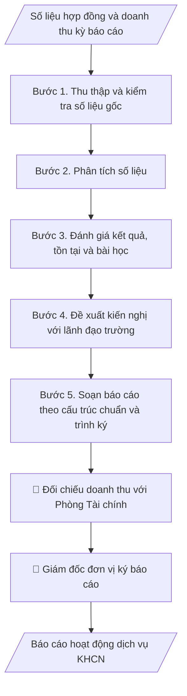

# Báo cáo dịch vụ KHCN

## Kiểm soát áp dụng và phê duyệt

Trước khi chạy quy trình, xác định `ngay_ap_dung`, `loai_hinh_truong`, `quy_che_noi_bo`, `nguon_du_lieu` và `nguoi_kiem_duyet`. Chỉ yêu cầu thông tin có liên quan đến nghiệp vụ; không dùng giá trị giả định thay dữ liệu bắt buộc. Hồ sơ có yếu tố pháp lý phải kèm văn bản gốc, tình trạng hiệu lực, điều khoản áp dụng và chuyển tiếp.

## Giới hạn và human gate

AI hỗ trợ chuẩn bị và đối chiếu. Cán bộ phụ trách kiểm tra dữ liệu/căn cứ, người có thẩm quyền duyệt và ký. Mọi đầu ra mặc định là **DỰ THẢO – CHỜ KIỂM DUYỆT**; không đánh dấu đã ký, đã duyệt hoặc đã công bố nếu chưa có chứng cứ. Dữ liệu sinh viên, sức khỏe, nhân sự và tài chính phải hạn chế theo mục đích, phân quyền và che thông tin định danh khi dùng ví dụ. Không tải dữ liệu lên dịch vụ ngoài khi chưa có quyền. Kiểm tra Luật 91/2025/QH15 về bảo vệ dữ liệu cá nhân (hiệu lực 01/01/2026) và quy định áp dụng trước xử lý/chia sẻ dữ liệu cá nhân.


## Khi nào dùng
Cuối mỗi quý/năm, đơn vị làm dịch vụ KHCN (trung tâm, viện, phòng KHCN) cần tổng hợp báo cáo
hoạt động dịch vụ: hợp đồng đã ký, doanh thu, khách hàng, tiến độ dự án, khó khăn và kế hoạch
kỳ tiếp theo để báo cáo lãnh đạo trường.

## Đầu vào (Input)

| Trường | Mô tả | Bắt buộc |
|---|---|---|
| `ky_bao_cao` | Quý/năm báo cáo (VD: Quý III/2026, năm 2026) | Có |
| `don_vi` | Đơn vị lập báo cáo | Có |
| `hop_dong` | Danh sách hợp đồng dịch vụ trong kỳ: tên, khách hàng, giá trị, trạng thái | Có |
| `doanh_thu` | Doanh thu thực hiện, đã thu, còn phải thu | Có |
| `khach_hang_moi` | Khách hàng mới phát sinh trong kỳ | Không |
| `kho_khan` | Khó khăn, vướng mắc | Không |
| `ke_hoach_ky_toi` | Kế hoạch, chỉ tiêu kỳ tiếp theo | Có |

## Quy trình

**Bước 1. Thu thập và kiểm tra số liệu gốc**
- Làm gì: Thu thập từ sổ theo dõi hợp đồng của đơn vị: danh sách hợp đồng trong kỳ
  (`hop_dong`: tên, khách hàng, giá trị, trạng thái ký/đang thực hiện/đã nghiệm thu);
  số liệu doanh thu (`doanh_thu`: kế hoạch, thực hiện, đã thu, còn phải thu) và đối chiếu
  với phòng Tài chính; danh sách khách hàng mới (`khach_hang_moi`).
- Dùng input: `ky_bao_cao`, `don_vi`, `hop_dong`, `doanh_thu`, `khach_hang_moi`.
- Vai trò: Chuyên viên dịch vụ KHCN · AI hỗ trợ: tổng hợp và đối chiếu số liệu với phòng Tài chính · ⏱ 1–2 giờ (ước tính)
- Lưu ý nghiệp vụ: số liệu doanh thu phải khớp sổ kế toán — chênh lệch phải giải trình
  trước khi đưa vào báo cáo; hợp đồng "đang thực hiện" chưa nghiệm thu không tính vào
  doanh thu đã thực hiện.
- → Kết quả bước: Bảng số liệu gốc đã đối chiếu (hợp đồng + doanh thu + khách hàng mới).

**Bước 2. Phân tích số liệu**
- Làm gì: Tính % hoàn thành chỉ tiêu kế hoạch, so sánh với cùng kỳ năm trước; phân nhóm
  doanh thu theo loại dịch vụ (tư vấn, phân tích mẫu, chuyển giao, đào tạo); phân tích cơ
  cấu khách hàng (doanh nghiệp/cơ quan nhà nước/cá nhân); tính tỷ lệ hợp đồng nghiệm thu
  đúng tiến độ.
- Dùng input: `hop_dong`, `doanh_thu`, `khach_hang_moi`.
- Vai trò: Chuyên viên dịch vụ KHCN · AI hỗ trợ: tính chỉ tiêu, so sánh cùng kỳ và phân nhóm cơ cấu · ⏱ 1–2 giờ (ước tính)
- Lưu ý nghiệp vụ: phân tích phải chỉ ra "tăng/giảm do đâu" (VD: tăng nhờ 2 khách hàng
  mới, giảm do 1 hợp đồng lớn chậm tiến độ) — không dừng ở việc nêu con số.
- → Kết quả bước: Bảng phân tích (chỉ tiêu vs thực hiện vs cùng kỳ; cơ cấu dịch vụ;
  cơ cấu khách hàng; tỷ lệ đúng tiến độ).

**Bước 3. Đánh giá kết quả, tồn tại và bài học**
- Làm gì: Nêu 3–5 kết quả nổi bật nhất trong kỳ; liệt kê tồn tại (`kho_khan`): mô tả,
  nguyên nhân gốc (chủ quan/khách quan), ảnh hưởng đến chỉ tiêu; rút bài học kinh nghiệm
  cho kỳ sau.
- Dùng input: `kho_khan` + bảng phân tích (kết quả bước 2).
- Vai trò: Chuyên viên dịch vụ KHCN · AI hỗ trợ: soạn dự thảo phần đánh giá · ⏱ 1–2 giờ (ước tính)
- Lưu ý nghiệp vụ: tồn tại phải gắn nguyên nhân cụ thể và số liệu minh họa; tránh liệt kê
  khó khăn chung chung không kèm giải pháp; ghi cả điểm sáng để nhân rộng.
- → Kết quả bước: Phần đánh giá (kết quả nổi bật, tồn tại–nguyên nhân, bài học kinh nghiệm).

**Bước 4. Đề xuất kiến nghị với lãnh đạo trường**
- Làm gì: Từ tồn tại ở bước 3, đề xuất kiến nghị cụ thể: nội dung đề xuất, lý do, kinh phí
  dự kiến (nếu có), đơn vị phối hợp, thời hạn mong muốn; đồng thời phác thảo chỉ tiêu và
  định hướng cho kỳ tiếp theo.
- Dùng input: `ke_hoach_ky_toi` + phần đánh giá (kết quả bước 3).
- Vai trò: Chuyên viên dịch vụ KHCN · AI hỗ trợ: soạn dự thảo kiến nghị theo mẫu, lãnh đạo đơn vị chốt nội dung và dự toán · ⏱ 30–60 phút (ước tính)
- Lưu ý nghiệp vụ: mỗi kiến nghị phải nêu rõ "đề nghị ai, làm gì, khi nào"; kiến nghị về
  kinh phí/đầu tư phải có dự toán sơ bộ; không kiến nghị vượt thẩm quyền của lãnh đạo trường.
- → Kết quả bước: Danh sách kiến nghị (nội dung, lý do, dự toán, thời hạn) + định hướng
  kỳ tới.

**Bước 5. Soạn báo cáo theo cấu trúc chuẩn và trình ký**
- Làm gì: Ghép kết quả các bước 1–4 vào khung báo cáo chuẩn; lập bảng tổng hợp hợp đồng
  đính kèm; kiểm tra nhất quán số liệu giữa các phần; trình giám đốc đơn vị ký sau khi
  đối chiếu số liệu với phòng Tài chính/KHCN.
- Dùng input: `ky_bao_cao`, `don_vi` (tiêu đề, đơn vị lập báo cáo).
- Vai trò: Viện trưởng · AI hỗ trợ: ghép báo cáo và kiểm tra chéo số liệu · ⏱ 1–2 giờ (ước tính)
- Lưu ý nghiệp vụ: kiểm tra chéo — tổng doanh thu trong bảng hợp đồng phải khớp số liệu
  phần kết quả; số thứ tự mục, ngày tháng, tên đơn vị chính xác tuyệt đối.
- → Kết quả bước: Báo cáo hoạt động dịch vụ KHCN hoàn chỉnh (trình ký).

## Luồng quy trình (Workflow)


## Đầu ra (Output)
- Báo cáo hoạt động dịch vụ KHCN kỳ báo cáo (markdown), kèm bảng tổng hợp hợp đồng.

**Cấu trúc output chuẩn** (báo cáo hoạt động dịch vụ KHCN — các phần theo đúng thứ tự):
1. Tiêu đề: tên đơn vị lập báo cáo, tên báo cáo, kỳ báo cáo.
2. Kết quả thực hiện: hợp đồng (số lượng, phân loại, trạng thái) + bảng tổng hợp hợp
   đồng; doanh thu (kế hoạch/thực hiện/đã thu/phải thu); khách hàng (mới, cũ).
3. Đánh giá: kết quả nổi bật, tồn tại, nguyên nhân, bài học kinh nghiệm.
4. Kiến nghị với lãnh đạo trường (nội dung, lý do, dự toán, thời hạn).
5. Kế hoạch kỳ tiếp theo: chỉ tiêu, nhiệm vụ chính, dịch vụ mới (nếu có).
6. Chữ ký: giám đốc đơn vị (ký, ghi rõ họ tên).

## Checklist nghiệm thu

- [ ] Đủ 6 phần theo "Cấu trúc output chuẩn": tiêu đề, kết quả thực hiện, đánh giá, kiến nghị, kế hoạch kỳ tiếp theo, chữ ký giám đốc đơn vị.
- [ ] Số liệu doanh thu, hợp đồng khớp với Input và sổ sách; đã đối chiếu với phòng Tài chính.
- [ ] Không bịa đặt hợp đồng, doanh thu, khách hàng; hợp đồng chưa nghiệm thu không tính vào doanh thu đã thực hiện.
- [ ] Phân tích nêu được "tăng/giảm do đâu", có so sánh cùng kỳ; không dừng ở việc nêu con số.
- [ ] Tồn tại gắn nguyên nhân cụ thể và số liệu minh họa; mỗi kiến nghị nêu rõ "đề nghị ai, làm gì, khi nào" kèm dự toán sơ bộ.
- [ ] Tổng doanh thu trong bảng hợp đồng khớp số liệu phần kết quả; số thứ tự mục, ngày tháng, tên đơn vị chính xác tuyệt đối.
- [ ] Đúng thể thức văn bản hành chính: số hiệu, chữ ký, nơi nhận đầy đủ.
- [ ] Đã qua Human gate: giám đốc đơn vị ký, phòng KHCN/phòng Tài chính đối chiếu số liệu trước khi trình lãnh đạo trường.

Tiêu chí đạt = tất cả các ô được đánh dấu.

## Ví dụ mô phỏng (dữ liệu giả lập)

> Tất cả tên trường, tổ chức, cá nhân, số liệu dưới đây đều là **giả lập**, không liên quan tổ chức/cá nhân có thật.

### Input mẫu

| Trường | Giá trị |
|---|---|
| `ky_bao_cao` | Quý III/2026 |
| `don_vi` | Trung tâm Phân tích – Môi trường, Trường Đại học A |
| `hop_dong` | 06 hợp đồng: 04 phân tích mẫu (48 trđ), 01 tư vấn (60 trđ), 01 đào tạo (36 trđ); 05 đã nghiệm thu, 01 đang thực hiện |
| `doanh_thu` | Kế hoạch quý: 150 trđ; thực hiện: 144 trđ (đạt 96%); đã thu: 120 trđ |
| `khach_hang_moi` | 02 doanh nghiệp mới (giả lập) |
| `ke_hoach_ky_toi` | Quý IV/2026: 160 trđ; mở thêm dịch vụ quan trắc tự động |

### Output mẫu

```
TRUNG TÂM PHÂN TÍCH – MÔI TRƯỜNG
BÁO CÁO HOẠT ĐỘNG DỊCH VỤ KHCN QUÝ III/2026

I. KẾT QUẢ THỰC HIỆN
1. Hợp đồng: ký mới 06 hợp đồng (04 phân tích mẫu, 01 tư vấn kỹ thuật, 01 đào tạo
theo nhu cầu); 05/06 hợp đồng đã nghiệm thu đúng tiến độ.
   Bảng tổng hợp hợp đồng:

   | # | Hợp đồng | Khách hàng | Giá trị (tr.đ) | Trạng thái |
   |---|---|---|---|---|
   | 1 | Phân tích mẫu nước thải (đợt 1) | DN A (giả lập) | 12 | Đã nghiệm thu |
   | 2 | Phân tích mẫu nước thải (đợt 2) | DN A (giả lập) | 12 | Đã nghiệm thu |
   | 3 | Phân tích mẫu khí thải | DN B (giả lập) | 12 | Đã nghiệm thu |
   | 4 | Phân tích mẫu đất | Cơ quan C (giả lập) | 12 | Đã nghiệm thu |
   | 5 | Tư vấn xử lý nước thải | DN D (giả lập) | 60 | Đang thực hiện |
   | 6 | Đào tạo an toàn môi trường | DN E (giả lập) | 36 | Đã nghiệm thu |
2. Doanh thu: thực hiện 144/150 triệu đồng, đạt 96% kế hoạch quý; đã thu 120 triệu
đồng, còn phải thu 24 triệu đồng.
3. Khách hàng: phát sinh 02 khách hàng doanh nghiệp mới; 100% khách hàng cũ tiếp
tục sử dụng dịch vụ.

II. ĐÁNH GIÁ
- Tồn tại: 01 hợp đồng tư vấn chậm tiến độ 10 ngày do thiếu thiết bị đo hiện trường.
- Nguyên nhân: thiết bị đã hết khấu hao, chưa được đầu tư thay thế.

III. KIẾN NGHỊ
Đề nghị Nhà trường xem xét đầu tư 01 bộ thiết bị đo hiện trường (dự kiến 180 triệu
đồng) trong kế hoạch mua sắm năm 2027.

IV. KẾ HOẠCH QUÝ IV/2026
- Chỉ tiêu doanh thu: 160 triệu đồng.
- Triển khai dịch vụ mới: quan trắc môi trường tự động.

                              GIÁM ĐỐC TRUNG TÂM
                                   [CHỜ KÝ]
                              TS. Đỗ Thị A
```

## Human gate
- **Giám đốc đơn vị** ký báo cáo, chịu trách nhiệm về tính chính xác số liệu.
- **Phòng KHCN / Phòng Tài chính – Kế toán** đối chiếu số liệu doanh thu trước khi trình
  lãnh đạo trường.

## Giới hạn
- AI không tự ý điều chỉnh số liệu doanh thu; mọi con số phải từ sổ sách, hợp đồng thực tế.
- Không công khai thông tin khách hàng khi chưa được phép.

## Căn cứ & lưu ý
- Quy định nội bộ về hoạt động dịch vụ KHCN và quản lý tài chính của trường.
- Không dùng tên thật của trường/tổ chức/cá nhân khi mô phỏng.

## Quản trị phiên bản

- Phiên bản gói: `1.1.0`; ngày cập nhật: `2026-10-09`.
- Kho nguồn: https://github.com/phamtruong91/dh-skills
- Người duy trì trên GitHub: `phamtruong91` (Phạm Văn Trường). Người phê duyệt nghiệp vụ: **chưa chỉ định**.
- Commit nguồn trước cập nhật: `78fd1d51b8acd1a724d9b9af6c488460bc7551ad`. Commit chứa phiên bản này xem bằng `git log -1 -- skills/bao-cao-dich-vu-khcn`; không tự gán SHA chưa tạo.
- Giấy phép: theo LICENSE của kho; bản quyền CES Global.
- Lịch sử 1.1.0: bổ sung metadata giao diện, kiểm soát áp dụng, quản trị phiên bản.
- Trạng thái: dự thảo nghiệp vụ; kiểm tra pháp lý trước thực thi. Ngày cập nhật không đồng nghĩa mọi văn bản đã được rà soát toàn văn.
