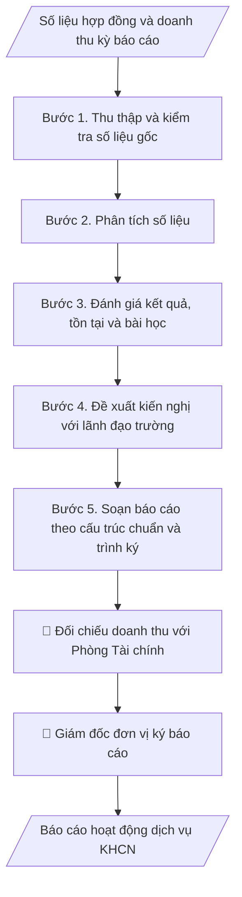

# Báo cáo dịch vụ KHCN

## Định dạng và file đầu ra

Định dạng đầu ra có thể chọn theo sản phẩm/yêu cầu: .docx, .pdf. Đọc mục “Định dạng bổ sung” trong quy cách đầu ra trước khi chọn.

**Phải tạo file thực tế để tải xuống, không chỉ trả nội dung trong chat.** Định dạng mặc định của skill: **.docx**. Nếu có bảng số liệu nghiệp vụ yêu cầu file bảng tính riêng, tạo thêm Excel theo yêu cầu; không tự tạo file kiểm tra. Không chờ người dùng yêu cầu xuất file lần nữa. Ưu tiên định dạng người dùng chỉ định; đọc quy tắc xuất file tại references/quy-cach-dau-ra.md.

## Quy cách đầu ra và thông tin thiếu
Khi dựng file Word/Excel, áp dụng mục “Thể thức và bảng biểu khi dựng file” trong quy cách đầu ra (cỡ chữ từng thành phần, bảng nhiều trang, số trang, phụ lục). Đọc [quy cách và cấu trúc sản phẩm](references/quy-cach-dau-ra.md) trước khi soạn/xuất. File giao chỉ gồm sản phẩm nghiệp vụ được yêu cầu; kiểm tra nội bộ không xuất kèm. Thiếu thông tin thì giữ nguyên trường/mục và chỗ điền theo mẫu gốc (dòng dấu chấm, dấu gạch hoặc ô trống); không tự điền dữ liệu mẫu, số 0, mã chờ xác minh hay dòng chờ ký. Mẫu chuyên ngành còn áp dụng được ưu tiên về cấu trúc, mã biểu và người ký. Bản đầy đủ: [quy tắc chung](references/quy-tac-chung.md).

## Kiểm soát áp dụng và phê duyệt
Trước khi chạy, xác định `ngay_ap_dung`, `loai_hinh_truong`, `quy_che_noi_bo`, `nguon_du_lieu`, `nguoi_kiem_duyet`; chỉ hỏi thông tin liên quan nghiệp vụ, không dùng giá trị giả định thay dữ liệu bắt buộc. Đối chiếu căn cứ pháp lý với văn bản gốc, hiệu lực, điều khoản áp dụng và chuyển tiếp. Bản đầy đủ: [quy tắc chung](references/quy-tac-chung.md).

## Giới hạn và human gate
AI hỗ trợ chuẩn bị và đối chiếu; cán bộ phụ trách kiểm tra dữ liệu/căn cứ, người có thẩm quyền duyệt và ký. Không đánh dấu đã ký, đã duyệt, đã công bố khi chưa có chứng cứ. Dữ liệu sinh viên, sức khỏe, nhân sự, tài chính chỉ dùng theo mục đích và phân quyền, che thông tin định danh khi dùng ví dụ (Luật 91/2025/QH15, hiệu lực 01/01/2026); không tải dữ liệu lên dịch vụ ngoài khi chưa có quyền. Bản đầy đủ: [quy tắc chung](references/quy-tac-chung.md).

## Khi nào dùng
Cuối mỗi quý/năm, đơn vị làm dịch vụ KHCN (trung tâm, viện, phòng KHCN) cần tổng hợp báo cáo
hoạt động dịch vụ: hợp đồng đã ký, doanh thu, khách hàng, tiến độ dự án, khó khăn và kế hoạch
kỳ tiếp theo để báo cáo lãnh đạo trường.

## Đầu vào (Input)

| Trường | Mô tả | Bắt buộc |
|---|---|---|
| `ky_bao_cao` | Quý/năm báo cáo (VD: Quý III/2026, năm 2026) | Có |
| `don_vi` | Đơn vị lập báo cáo | Có |
| `hop_dong` | Danh sách hợp đồng dịch vụ trong kỳ: tên, khách hàng, giá trị, trạng thái | Có |
| `doanh_thu` | Doanh thu thực hiện, đã thu, còn phải thu | Có |
| `khach_hang_moi` | Khách hàng mới phát sinh trong kỳ | Không |
| `kho_khan` | Khó khăn, vướng mắc | Không |
| `ke_hoach_ky_toi` | Kế hoạch, chỉ tiêu kỳ tiếp theo | Có |

## Quy trình

**Bước 1. Thu thập và kiểm tra số liệu gốc**
- Làm gì: Thu thập từ sổ theo dõi hợp đồng của đơn vị: danh sách hợp đồng trong kỳ
  (`hop_dong`: tên, khách hàng, giá trị, trạng thái ký/đang thực hiện/đã nghiệm thu);
  số liệu doanh thu (`doanh_thu`: kế hoạch, thực hiện, đã thu, còn phải thu) và đối chiếu
  với phòng Tài chính; danh sách khách hàng mới (`khach_hang_moi`).
- Dùng input: `ky_bao_cao`, `don_vi`, `hop_dong`, `doanh_thu`, `khach_hang_moi`.
- Vai trò: Chuyên viên dịch vụ KHCN · AI hỗ trợ: tổng hợp và đối chiếu số liệu với phòng Tài chính · ⏱ 1–2 giờ (ước tính)
- Lưu ý nghiệp vụ: số liệu doanh thu phải khớp sổ kế toán — chênh lệch phải giải trình
  trước khi đưa vào báo cáo; hợp đồng "đang thực hiện" chưa nghiệm thu không tính vào
  doanh thu đã thực hiện.
- → Kết quả bước: Bảng số liệu gốc đã đối chiếu (hợp đồng + doanh thu + khách hàng mới).

**Bước 2. Phân tích số liệu**
- Làm gì: Tính % hoàn thành chỉ tiêu kế hoạch, so sánh với cùng kỳ năm trước; phân nhóm
  doanh thu theo loại dịch vụ (tư vấn, phân tích mẫu, chuyển giao, đào tạo); phân tích cơ
  cấu khách hàng (doanh nghiệp/cơ quan nhà nước/cá nhân); tính tỷ lệ hợp đồng nghiệm thu
  đúng tiến độ.
- Dùng input: `hop_dong`, `doanh_thu`, `khach_hang_moi`.
- Vai trò: Chuyên viên dịch vụ KHCN · AI hỗ trợ: tính chỉ tiêu, so sánh cùng kỳ và phân nhóm cơ cấu · ⏱ 1–2 giờ (ước tính)
- Lưu ý nghiệp vụ: phân tích phải chỉ ra "tăng/giảm do đâu" (VD: tăng nhờ 2 khách hàng
  mới, giảm do 1 hợp đồng lớn chậm tiến độ) — không dừng ở việc nêu con số.
- → Kết quả bước: Bảng phân tích (chỉ tiêu vs thực hiện vs cùng kỳ; cơ cấu dịch vụ;
  cơ cấu khách hàng; tỷ lệ đúng tiến độ).

**Bước 3. Đánh giá kết quả, tồn tại và bài học**
- Làm gì: Nêu 3–5 kết quả nổi bật nhất trong kỳ; liệt kê tồn tại (`kho_khan`): mô tả,
  nguyên nhân gốc (chủ quan/khách quan), ảnh hưởng đến chỉ tiêu; rút bài học kinh nghiệm
  cho kỳ sau.
- Dùng input: `kho_khan` + bảng phân tích (kết quả bước 2).
- Vai trò: Chuyên viên dịch vụ KHCN · AI hỗ trợ: soạn dự thảo phần đánh giá · ⏱ 1–2 giờ (ước tính)
- Lưu ý nghiệp vụ: tồn tại phải gắn nguyên nhân cụ thể và số liệu minh họa; tránh liệt kê
  khó khăn chung chung không kèm giải pháp; ghi cả điểm sáng để nhân rộng.
- → Kết quả bước: Phần đánh giá (kết quả nổi bật, tồn tại–nguyên nhân, bài học kinh nghiệm).

**Bước 4. Đề xuất kiến nghị với lãnh đạo trường**
- Làm gì: Từ tồn tại ở bước 3, đề xuất kiến nghị cụ thể: nội dung đề xuất, lý do, kinh phí
  dự kiến (nếu có), đơn vị phối hợp, thời hạn mong muốn; đồng thời phác thảo chỉ tiêu và
  định hướng cho kỳ tiếp theo.
- Dùng input: `ke_hoach_ky_toi` + phần đánh giá (kết quả bước 3).
- Vai trò: Chuyên viên dịch vụ KHCN · AI hỗ trợ: soạn dự thảo kiến nghị theo mẫu, lãnh đạo đơn vị chốt nội dung và dự toán · ⏱ 30–60 phút (ước tính)
- Lưu ý nghiệp vụ: mỗi kiến nghị phải nêu rõ "đề nghị ai, làm gì, khi nào"; kiến nghị về
  kinh phí/đầu tư phải có dự toán sơ bộ; không kiến nghị vượt thẩm quyền của lãnh đạo trường.
- → Kết quả bước: Danh sách kiến nghị (nội dung, lý do, dự toán, thời hạn) + định hướng
  kỳ tới.

**Bước 5. Soạn báo cáo theo cấu trúc chuẩn và trình ký**
- Làm gì: Ghép kết quả các bước 1–4 vào khung báo cáo chuẩn; lập bảng tổng hợp hợp đồng
  đính kèm; kiểm tra nhất quán số liệu giữa các phần; trình giám đốc đơn vị ký sau khi
  đối chiếu số liệu với phòng Tài chính/KHCN.
- Dùng input: `ky_bao_cao`, `don_vi` (tiêu đề, đơn vị lập báo cáo).
- Vai trò: Viện trưởng · AI hỗ trợ: ghép báo cáo và kiểm tra chéo số liệu · ⏱ 1–2 giờ (ước tính)
- Lưu ý nghiệp vụ: kiểm tra chéo — tổng doanh thu trong bảng hợp đồng phải khớp số liệu
  phần kết quả; số thứ tự mục, ngày tháng, tên đơn vị chính xác tuyệt đối.
- → Kết quả bước: Báo cáo hoạt động dịch vụ KHCN hoàn chỉnh (trình ký).

## Luồng quy trình (Workflow)

## Đầu ra

File nghiệp vụ thực tế theo định dạng mặc định ở đầu skill hoặc định dạng người dùng yêu cầu, kèm liên kết tải trong phản hồi cuối.

Sản phẩm nghiệp vụ hoàn chỉnh theo [quy cách và cấu trúc](references/quy-cach-dau-ra.md), giữ các trường chưa có dữ liệu ở trạng thái trống. Không xuất kèm checklist/phụ lục kiểm tra đầu ra.

## Kiểm tra nội bộ trước khi giao

- [ ] Bố cục khớp mẫu áp dụng và cấu trúc tại references/quy-cach-dau-ra.md.
- [ ] Số liệu doanh thu, hợp đồng khớp với Input và sổ sách; đã đối chiếu với phòng Tài chính.
- [ ] Không bịa đặt hợp đồng, doanh thu, khách hàng; hợp đồng chưa nghiệm thu không tính vào doanh thu đã thực hiện.
- [ ] Phân tích nêu được "tăng/giảm do đâu", có so sánh cùng kỳ; không dừng ở việc nêu con số.
- [ ] Tồn tại gắn nguyên nhân cụ thể và số liệu minh họa; mỗi kiến nghị nêu rõ "đề nghị ai, làm gì, khi nào" kèm dự toán sơ bộ.
- [ ] Tổng doanh thu trong bảng hợp đồng khớp số liệu phần kết quả; số thứ tự mục, ngày tháng, tên đơn vị chính xác tuyệt đối.
- [ ] Đúng thể thức văn bản hành chính: số hiệu, chữ ký, nơi nhận đầy đủ.
- [ ] Đã qua Human gate: giám đốc đơn vị ký, phòng KHCN/phòng Tài chính đối chiếu số liệu trước khi trình lãnh đạo trường.

Tiêu chí đạt = tất cả các ô được đánh dấu.

## Human gate
- **Giám đốc đơn vị** ký báo cáo, chịu trách nhiệm về tính chính xác số liệu.
- **Phòng KHCN / Phòng Tài chính – Kế toán** đối chiếu số liệu doanh thu trước khi trình
  lãnh đạo trường.

## Giới hạn
- AI không tự ý điều chỉnh số liệu doanh thu; mọi con số phải từ sổ sách, hợp đồng thực tế.
- Không công khai thông tin khách hàng khi chưa được phép.

## Căn cứ & lưu ý
- Quy định nội bộ về hoạt động dịch vụ KHCN và quản lý tài chính của trường.
- Không dùng tên thật của trường/tổ chức/cá nhân khi mô phỏng.

## Quản trị phiên bản
- Phiên bản gói `1.3.2` (cập nhật 2026-10-10); hồ sơ đầy đủ tại [references/version.json](references/version.json).
- Người phê duyệt nghiệp vụ: **chưa chỉ định**. Trạng thái: dự thảo nghiệp vụ; kiểm tra pháp lý trước thực thi. Ngày cập nhật không đồng nghĩa mọi văn bản đã được rà soát toàn văn.
- Giấy phép theo LICENSE của kho (bản quyền CES Global). Lịch sử thay đổi: CHANGELOG.md.
