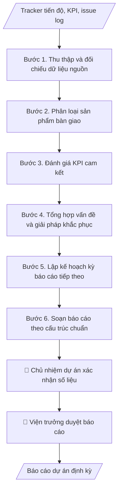

# Báo cáo dự án định kỳ

## Kiểm soát áp dụng và phê duyệt

Trước khi chạy quy trình, xác định `ngay_ap_dung`, `loai_hinh_truong`, `quy_che_noi_bo`, `nguon_du_lieu` và `nguoi_kiem_duyet`. Chỉ yêu cầu thông tin có liên quan đến nghiệp vụ; không dùng giá trị giả định thay dữ liệu bắt buộc. Hồ sơ có yếu tố pháp lý phải kèm văn bản gốc, tình trạng hiệu lực, điều khoản áp dụng và chuyển tiếp.

## Giới hạn và human gate

AI hỗ trợ chuẩn bị và đối chiếu. Cán bộ phụ trách kiểm tra dữ liệu/căn cứ, người có thẩm quyền duyệt và ký. Mọi đầu ra mặc định là **DỰ THẢO – CHỜ KIỂM DUYỆT**; không đánh dấu đã ký, đã duyệt hoặc đã công bố nếu chưa có chứng cứ. Dữ liệu sinh viên, sức khỏe, nhân sự và tài chính phải hạn chế theo mục đích, phân quyền và che thông tin định danh khi dùng ví dụ. Không tải dữ liệu lên dịch vụ ngoài khi chưa có quyền. Kiểm tra Luật 91/2025/QH15 về bảo vệ dữ liệu cá nhân (hiệu lực 01/01/2026) và quy định áp dụng trước xử lý/chia sẻ dữ liệu cá nhân.


## Khi nào dùng
Khi dự án của Viện đến kỳ báo cáo (tháng/quý/giai đoạn) cho khách hàng, đối tác, cơ quan quản lý:
tổng hợp tiến độ, sản phẩm bàn giao, chỉ số KPI, vấn đề tồn tại và kế hoạch tiếp theo.

## Đầu vào (Input)

| Trường | Mô tả | Bắt buộc |
|---|---|---|
| `ten_du_an` | Tên + mã dự án, khách hàng/đối tác | Có |
| `ky_bao_cao` | Kỳ báo cáo (VD: Quý II/2026) và thời gian bao phủ | Có |
| `tien_do` | % hoàn thành tổng thể và từng gói việc so với kế hoạch | Có |
| `deliverables` | Sản phẩm đã bàn giao / đang thực hiện trong kỳ | Có |
| `kpi` | Các chỉ số KPI cam kết và giá trị đạt được | Có |
| `van_de` | Vấn đề tồn tại, nguyên nhân, giải pháp đang triển khai | Không |
| `ke_hoach_tiep` | Kế hoạch kỳ báo cáo tiếp theo | Có |

## Quy trình

**Bước 1. Thu thập và đối chiếu dữ liệu nguồn**
- Làm gì: Thu thập tracker tiến độ PMO, issue log, biên bản bàn giao phát sinh trong kỳ;
  đối chiếu % thực hiện từng gói việc với kế hoạch; ghi chênh lệch và nguyên nhân sơ bộ.
- Dùng input: `ten_du_an`, `ky_bao_cao`, `tien_do`, `deliverables`.
- Vai trò: Chủ nhiệm dự án · AI hỗ trợ: đối chiếu số liệu từ tracker PMO · ⏱ 1–2 giờ (ước tính)
- Lưu ý nghiệp vụ: số liệu lấy từ tracker PMO đã được chủ nhiệm xác nhận, không tự ước
  tính; nếu thiếu biên bản bàn giao thì ghi rõ "chưa có biên bản", không ghi "đã bàn giao".
- → Kết quả bước: Bảng đối chiếu tiến độ thực tế/kế hoạch theo từng gói việc.

**Bước 2. Phân loại sản phẩm bàn giao**
- Làm gì: Chia deliverable thành 2 nhóm: (a) đã bàn giao — ghi ngày bàn giao, số biên bản,
  bên nhận; (b) đang thực hiện — ghi % tiến độ, ngày dự kiến hoàn thành. Kiểm tra tính
  đầy đủ, hợp lệ của biên bản.
- Dùng input: `deliverables`.
- Vai trò: Chủ nhiệm dự án · AI hỗ trợ: phân loại deliverable và lập danh sách · ⏱ 30–60 phút (ước tính)
- Lưu ý nghiệp vụ: chỉ ghi "đã bàn giao" khi có biên bản 2 bên ký; sản phẩm bàn giao
  muộn phải nêu lý do và ngày bàn giao thực tế.
- → Kết quả bước: Danh sách deliverable phân loại (đã bàn giao / đang thực hiện) kèm
  minh chứng.

**Bước 3. Đánh giá KPI cam kết**
- Làm gì: Lập bảng KPI: chỉ tiêu cam kết (trong hợp đồng/thỏa thuận) so với giá trị thực
  đạt; tính % đạt được; với chỉ số chưa đạt: phân tích nguyên nhân và ghi rõ có ảnh hưởng
  đến cam kết hợp đồng không.
- Dùng input: `kpi`.
- Vai trò: Chủ nhiệm dự án · AI hỗ trợ: tính % đạt KPI và lập bảng so sánh · ⏱ 30–60 phút (ước tính)
- Lưu ý nghiệp vụ: không làm tròn số liệu có lợi cho mình; KPI chưa đạt phải có giải
  pháp khắc phục và thời hạn cụ thể, không chỉ giải thích nguyên nhân.
- → Kết quả bước: Bảng đánh giá KPI (cam kết / thực đạt / % đạt / giải thích).

**Bước 4. Tổng hợp vấn đề và giải pháp khắc phục**
- Làm gì: Từ issue log, chọn các vấn đề còn tồn tại ảnh hưởng đến dự án; mỗi vấn đề ghi:
  mô tả, nguyên nhân (khách quan/chủ quan), giải pháp đang triển khai, tiến độ khắc phục,
  người chịu trách nhiệm. Phân biệt vấn đề nội bộ (đơn vị tự xử lý) và vấn đề cần phía
  đối tác phối hợp.
- Dùng input: `van_de`.
- Vai trò: Chủ nhiệm dự án · AI hỗ trợ: tổng hợp vấn đề từ issue log · ⏱ 30–60 phút (ước tính)
- Lưu ý nghiệp vụ: nêu trung thực, không giấu vấn đề; không đổ lỗi cho đối tác bằng ngôn
  từ thiếu chuyên nghiệp; vấn đề đã đóng trong kỳ thì không đưa vào báo cáo.
- → Kết quả bước: Bảng vấn đề tồn tại (mô tả, nguyên nhân, giải pháp, tiến độ khắc phục).

**Bước 5. Lập kế hoạch kỳ báo cáo tiếp theo**
- Làm gì: Liệt kê công việc chính kỳ tới, các mốc quan trọng, sản phẩm dự kiến bàn giao;
  nêu rõ đề nghị phối hợp từ phía khách hàng/đối tác (nội dung cần hỗ trợ, thời hạn cần
  phản hồi).
- Dùng input: `ke_hoach_tiep`.
- Vai trò: Chủ nhiệm dự án · AI hỗ trợ: soạn dự thảo kế hoạch kỳ tới · ⏱ 30–60 phút (ước tính)
- Lưu ý nghiệp vụ: đề nghị phối hợp phải cụ thể (ai làm, làm gì, trước ngày nào); không
  đưa cam kết mới về phạm vi/tiến độ vượt thẩm quyền khi chưa được phê duyệt.
- → Kết quả bước: Kế hoạch kỳ tới (việc chính, mốc quan trọng, đề nghị phối hợp).

**Bước 6. Soạn báo cáo theo cấu trúc chuẩn**
- Làm gì: Ghép kết quả các bước 1–5 vào khung báo cáo chuẩn; kiểm tra: số liệu nhất quán
  giữa các phần (tiến độ ↔ KPI ↔ deliverable), văn phong chuyên nghiệp, đầy đủ thông tin
  người lập/ngày lập.
- Dùng input: `ten_du_an`, `ky_bao_cao` (tiêu đề, kỳ báo cáo, đối tác).
- Vai trò: Viện trưởng · AI hỗ trợ: ghép khung báo cáo và kiểm tra chéo số liệu · ⏱ 1–2 giờ (ước tính)
- Lưu ý nghiệp vụ: kiểm tra chéo số liệu giữa các phần — không được mâu thuẫn (VD: tiến
  độ 41% nhưng KPI đạt 90% phải giải thích được); rà chính tả, định dạng trước khi trình.
- → Kết quả bước: Dự thảo báo cáo dự án định kỳ hoàn chỉnh (sẵn sàng trình duyệt).

## Luồng quy trình (Workflow)


## Đầu ra (Output)
- Báo cáo dự án định kỳ hoàn chỉnh (markdown), sẵn sàng trình duyệt trước khi gửi.

**Cấu trúc output chuẩn** (báo cáo dự án định kỳ — các phần theo đúng thứ tự):
1. Tiêu đề + thông tin dự án: tên, mã dự án, đối tác/khách hàng, đơn vị thực hiện,
   kỳ báo cáo (thời gian bao phủ).
2. Tiến độ tổng thể: % thực hiện so với kế hoạch, đánh giá chung (đúng tiến độ/chậm).
3. Sản phẩm bàn giao: đã bàn giao (ngày bàn giao, biên bản) / đang thực hiện (tiến độ,
   dự kiến xong).
4. KPI: bảng chỉ tiêu cam kết so với thực đạt, giải thích chỉ số chưa đạt.
5. Vấn đề tồn tại: mô tả, nguyên nhân, giải pháp đang triển khai, tiến độ khắc phục.
6. Kế hoạch kỳ tiếp theo: việc chính, mốc quan trọng, đề nghị phối hợp từ phía
   khách hàng/đối tác (nếu có).

## Checklist nghiệm thu

- [ ] Đủ 6 phần theo "Cấu trúc output chuẩn": thông tin dự án, tiến độ tổng thể, sản phẩm bàn giao, KPI, vấn đề tồn tại, kế hoạch kỳ tiếp theo.
- [ ] Số liệu tiến độ, KPI, deliverable khớp với Input (tracker PMO, biên bản bàn giao) đã cho.
- [ ] Không bịa đặt biên bản bàn giao, KPI hay minh chứng không có thật; mục "chưa có biên bản" ghi đúng là chưa có.
- [ ] Số liệu nhất quán giữa các phần (tiến độ ↔ KPI ↔ deliverable) hoặc đã giải thích được chênh lệch.
- [ ] Vấn đề nêu trung thực, không giấu, không đổ lỗi cho đối tác bằng ngôn từ thiếu chuyên nghiệp.
- [ ] KPI chưa đạt có giải pháp khắc phục và thời hạn cụ thể, không chỉ giải thích nguyên nhân.
- [ ] Đúng thể thức: có người lập, ngày lập, văn phong chuyên nghiệp, không lỗi chính tả, định dạng chuẩn.
- [ ] Đã qua Human gate: chủ nhiệm xác nhận số liệu, viện trưởng duyệt trước khi gửi khách hàng/đối tác.

Tiêu chí đạt = tất cả các ô được đánh dấu.

## Ví dụ mô phỏng (dữ liệu giả lập)

> Tất cả tên trường, cá nhân, tổ chức, số liệu dưới đây đều là **giả lập**.

### Input mẫu

| Trường | Giá trị |
|---|---|
| `ten_du_an` | Nền tảng số hóa di sản văn hóa (ĐHA-DMST-2026-03) — Đối tác: Bảo tàng B |
| `ky_bao_cao` | Quý II/2026 (01/04–30/06/2026) |
| `tien_do` | Tổng thể 41% (kế hoạch 40%): WP1 100%, WP2 45%, WP3 20% |
| `deliverables` | Đã bàn giao: Báo cáo khảo sát + Thiết kế hệ thống (BB ngày 28/03/2026). Đang thực hiện: số hóa 225/500 hiện vật; module tra cứu cơ bản |
| `kpi` | Số hiện vật số hóa: 225/250 (đạt 90% chỉ tiêu quý); uptime hệ thống thử nghiệm: 98,5% |
| `van_de` | Máy scan 3D hỏng từ 10/06, đang chờ linh kiện; đã bố trí scan 2D tạm thời nên WP2 không bị gián đoạn |
| `ke_hoach_tiep` | Quý III: hoàn thành số hóa 500 hiện vật; xong module tra cứu; chạy thử nghiệm nội bộ tháng 9 |

### Output mẫu

```
BÁO CÁO TIẾN ĐỘ DỰ ÁN — QUÝ II/2026
Dự án: Nền tảng số hóa di sản văn hóa (ĐHA-DMST-2026-03)
Đối tác: Bảo tàng B
Đơn vị thực hiện: Viện Đổi mới sáng tạo và Chuyển giao công nghệ — Trường Đại học A
Kỳ báo cáo: 01/04/2026 – 30/06/2026

1. TIẾN ĐỘ TỔNG THỂ
   Đạt 41% so với kế hoạch 40% — đúng tiến độ.

2. SẢN PHẨM BÀN GIAO
   - Đã bàn giao: Báo cáo khảo sát + Thiết kế hệ thống (biên bản ngày 28/03/2026).
   - Đang thực hiện: số hóa 225/500 hiện vật; module tra cứu cơ bản (20%).

3. KPI
   - Số hiện vật số hóa trong quý: 225/250 (đạt 90%).
   - Uptime hệ thống thử nghiệm: 98,5%.

4. VẤN ĐỀ TỒN TẠI
   - Máy scan 3D hỏng từ 10/06/2026, đang chờ linh kiện thay thế (dự kiến 15/07).
   - Giải pháp tạm thời: chuyển sang scan 2D, WP2 không bị gián đoạn.

5. KẾ HOẠCH QUÝ III/2026
   - Hoàn thành số hóa 500 hiện vật; hoàn thiện module tra cứu; chạy thử nghiệm nội bộ tháng 9/2026.
   - Đề nghị phía Bảo tàng: cử cán bộ kiểm tra chất lượng dữ liệu số hóa đợt 1 trước 31/07/2026.
```

## Human gate (người kiểm duyệt)
- **Chủ nhiệm dự án** xác nhận số liệu tiến độ, KPI, vấn đề trước khi soạn báo cáo.
- **Viện trưởng** duyệt nội dung báo cáo trước khi gửi cho khách hàng/đối tác.

## Giới hạn (guardrails)
- KHÔNG tự động gửi báo cáo cho khách hàng/đối tác dưới mọi hình thức.
- KHÔNG che giấu, làm nhẹ vấn đề/rủi ro trong báo cáo.
- KHÔNG cam kết mốc tiến độ, phạm vi mới vượt thẩm quyền khi chưa được phê duyệt.

## Căn cứ & lưu ý
- Hợp đồng/thỏa thuận dự án (điều khoản báo cáo định kỳ); quy chế quản lý dự án của Viện.
- Số liệu báo cáo phải nhất quán với tracker PMO (`pmo-quan-tri-du-an`).
- Không dùng tên thật của trường/cá nhân/tổ chức khi mô phỏng.

## Quản trị phiên bản

- Phiên bản gói: `1.1.0`; ngày cập nhật: `2026-10-09`.
- Kho nguồn: https://github.com/phamtruong91/dh-skills
- Người duy trì trên GitHub: `phamtruong91` (Phạm Văn Trường). Người phê duyệt nghiệp vụ: **chưa chỉ định**.
- Commit nguồn trước cập nhật: `78fd1d51b8acd1a724d9b9af6c488460bc7551ad`. Commit chứa phiên bản này xem bằng `git log -1 -- skills/bao-cao-du-an-dinh-ky`; không tự gán SHA chưa tạo.
- Giấy phép: theo LICENSE của kho; bản quyền CES Global.
- Lịch sử 1.1.0: bổ sung metadata giao diện, kiểm soát áp dụng, quản trị phiên bản.
- Trạng thái: dự thảo nghiệp vụ; kiểm tra pháp lý trước thực thi. Ngày cập nhật không đồng nghĩa mọi văn bản đã được rà soát toàn văn.
