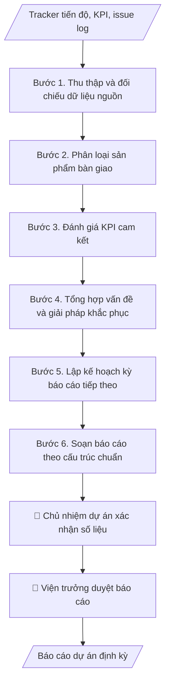

# Báo cáo dự án định kỳ

## Định dạng và file đầu ra

Định dạng đầu ra có thể chọn theo sản phẩm/yêu cầu: .docx, .pdf. Đọc mục “Định dạng bổ sung” trong quy cách đầu ra trước khi chọn.

**Phải tạo file thực tế để tải xuống, không chỉ trả nội dung trong chat.** Định dạng mặc định của skill: **.docx**. Nếu có bảng số liệu nghiệp vụ yêu cầu file bảng tính riêng, tạo thêm Excel theo yêu cầu; không tự tạo file kiểm tra. Không chờ người dùng yêu cầu xuất file lần nữa. Ưu tiên định dạng người dùng chỉ định; đọc quy tắc xuất file tại references/quy-cach-dau-ra.md.

## Quy cách đầu ra và thông tin thiếu
Đọc [quy cách và cấu trúc sản phẩm](references/quy-cach-dau-ra.md) trước khi soạn/xuất. File giao chỉ gồm sản phẩm nghiệp vụ được yêu cầu; kiểm tra nội bộ không xuất kèm. Thiếu thông tin thì giữ nguyên trường/mục và chỗ điền theo mẫu gốc (dòng dấu chấm, dấu gạch hoặc ô trống); không tự điền dữ liệu mẫu, số 0, mã chờ xác minh hay dòng chờ ký. Mẫu chuyên ngành còn áp dụng được ưu tiên về cấu trúc, mã biểu và người ký. Bản đầy đủ: [quy tắc chung](references/quy-tac-chung.md).

## Kiểm soát áp dụng và phê duyệt
Trước khi chạy, xác định `ngay_ap_dung`, `loai_hinh_truong`, `quy_che_noi_bo`, `nguon_du_lieu`, `nguoi_kiem_duyet`; chỉ hỏi thông tin liên quan nghiệp vụ, không dùng giá trị giả định thay dữ liệu bắt buộc. Đối chiếu căn cứ pháp lý với văn bản gốc, hiệu lực, điều khoản áp dụng và chuyển tiếp. Bản đầy đủ: [quy tắc chung](references/quy-tac-chung.md).

## Giới hạn và human gate
AI hỗ trợ chuẩn bị và đối chiếu; cán bộ phụ trách kiểm tra dữ liệu/căn cứ, người có thẩm quyền duyệt và ký. Không đánh dấu đã ký, đã duyệt, đã công bố khi chưa có chứng cứ. Dữ liệu sinh viên, sức khỏe, nhân sự, tài chính chỉ dùng theo mục đích và phân quyền, che thông tin định danh khi dùng ví dụ (Luật 91/2025/QH15, hiệu lực 01/01/2026); không tải dữ liệu lên dịch vụ ngoài khi chưa có quyền. Bản đầy đủ: [quy tắc chung](references/quy-tac-chung.md).

## Khi nào dùng
Khi dự án của Viện đến kỳ báo cáo (tháng/quý/giai đoạn) cho khách hàng, đối tác, cơ quan quản lý:
tổng hợp tiến độ, sản phẩm bàn giao, chỉ số KPI, vấn đề tồn tại và kế hoạch tiếp theo.

## Đầu vào (Input)

| Trường | Mô tả | Bắt buộc |
|---|---|---|
| `ten_du_an` | Tên + mã dự án, khách hàng/đối tác | Có |
| `ky_bao_cao` | Kỳ báo cáo (VD: Quý II/2026) và thời gian bao phủ | Có |
| `tien_do` | % hoàn thành tổng thể và từng gói việc so với kế hoạch | Có |
| `deliverables` | Sản phẩm đã bàn giao / đang thực hiện trong kỳ | Có |
| `kpi` | Các chỉ số KPI cam kết và giá trị đạt được | Có |
| `van_de` | Vấn đề tồn tại, nguyên nhân, giải pháp đang triển khai | Không |
| `ke_hoach_tiep` | Kế hoạch kỳ báo cáo tiếp theo | Có |

## Quy trình

**Bước 1. Thu thập và đối chiếu dữ liệu nguồn**
- Làm gì: Thu thập tracker tiến độ PMO, issue log, biên bản bàn giao phát sinh trong kỳ;
  đối chiếu % thực hiện từng gói việc với kế hoạch; ghi chênh lệch và nguyên nhân sơ bộ.
- Dùng input: `ten_du_an`, `ky_bao_cao`, `tien_do`, `deliverables`.
- Vai trò: Chủ nhiệm dự án · AI hỗ trợ: đối chiếu số liệu từ tracker PMO · ⏱ 1–2 giờ (ước tính)
- Lưu ý nghiệp vụ: số liệu lấy từ tracker PMO đã được chủ nhiệm xác nhận, không tự ước
  tính; nếu thiếu biên bản bàn giao thì ghi rõ "chưa có biên bản", không ghi "đã bàn giao".
- → Kết quả bước: Bảng đối chiếu tiến độ thực tế/kế hoạch theo từng gói việc.

**Bước 2. Phân loại sản phẩm bàn giao**
- Làm gì: Chia deliverable thành 2 nhóm: (a) đã bàn giao — ghi ngày bàn giao, số biên bản,
  bên nhận; (b) đang thực hiện — ghi % tiến độ, ngày dự kiến hoàn thành. Kiểm tra tính
  đầy đủ, hợp lệ của biên bản.
- Dùng input: `deliverables`.
- Vai trò: Chủ nhiệm dự án · AI hỗ trợ: phân loại deliverable và lập danh sách · ⏱ 30–60 phút (ước tính)
- Lưu ý nghiệp vụ: chỉ ghi "đã bàn giao" khi có biên bản 2 bên ký; sản phẩm bàn giao
  muộn phải nêu lý do và ngày bàn giao thực tế.
- → Kết quả bước: Danh sách deliverable phân loại (đã bàn giao / đang thực hiện) kèm
  minh chứng.

**Bước 3. Đánh giá KPI cam kết**
- Làm gì: Lập bảng KPI: chỉ tiêu cam kết (trong hợp đồng/thỏa thuận) so với giá trị thực
  đạt; tính % đạt được; với chỉ số chưa đạt: phân tích nguyên nhân và ghi rõ có ảnh hưởng
  đến cam kết hợp đồng không.
- Dùng input: `kpi`.
- Vai trò: Chủ nhiệm dự án · AI hỗ trợ: tính % đạt KPI và lập bảng so sánh · ⏱ 30–60 phút (ước tính)
- Lưu ý nghiệp vụ: không làm tròn số liệu có lợi cho mình; KPI chưa đạt phải có giải
  pháp khắc phục và thời hạn cụ thể, không chỉ giải thích nguyên nhân.
- → Kết quả bước: Bảng đánh giá KPI (cam kết / thực đạt / % đạt / giải thích).

**Bước 4. Tổng hợp vấn đề và giải pháp khắc phục**
- Làm gì: Từ issue log, chọn các vấn đề còn tồn tại ảnh hưởng đến dự án; mỗi vấn đề ghi:
  mô tả, nguyên nhân (khách quan/chủ quan), giải pháp đang triển khai, tiến độ khắc phục,
  người chịu trách nhiệm. Phân biệt vấn đề nội bộ (đơn vị tự xử lý) và vấn đề cần phía
  đối tác phối hợp.
- Dùng input: `van_de`.
- Vai trò: Chủ nhiệm dự án · AI hỗ trợ: tổng hợp vấn đề từ issue log · ⏱ 30–60 phút (ước tính)
- Lưu ý nghiệp vụ: nêu trung thực, không giấu vấn đề; không đổ lỗi cho đối tác bằng ngôn
  từ thiếu chuyên nghiệp; vấn đề đã đóng trong kỳ thì không đưa vào báo cáo.
- → Kết quả bước: Bảng vấn đề tồn tại (mô tả, nguyên nhân, giải pháp, tiến độ khắc phục).

**Bước 5. Lập kế hoạch kỳ báo cáo tiếp theo**
- Làm gì: Liệt kê công việc chính kỳ tới, các mốc quan trọng, sản phẩm dự kiến bàn giao;
  nêu rõ đề nghị phối hợp từ phía khách hàng/đối tác (nội dung cần hỗ trợ, thời hạn cần
  phản hồi).
- Dùng input: `ke_hoach_tiep`.
- Vai trò: Chủ nhiệm dự án · AI hỗ trợ: soạn dự thảo kế hoạch kỳ tới · ⏱ 30–60 phút (ước tính)
- Lưu ý nghiệp vụ: đề nghị phối hợp phải cụ thể (ai làm, làm gì, trước ngày nào); không
  đưa cam kết mới về phạm vi/tiến độ vượt thẩm quyền khi chưa được phê duyệt.
- → Kết quả bước: Kế hoạch kỳ tới (việc chính, mốc quan trọng, đề nghị phối hợp).

**Bước 6. Soạn báo cáo theo cấu trúc chuẩn**
- Làm gì: Ghép kết quả các bước 1–5 vào khung báo cáo chuẩn; kiểm tra: số liệu nhất quán
  giữa các phần (tiến độ ↔ KPI ↔ deliverable), văn phong chuyên nghiệp, đầy đủ thông tin
  người lập/ngày lập.
- Dùng input: `ten_du_an`, `ky_bao_cao` (tiêu đề, kỳ báo cáo, đối tác).
- Vai trò: Viện trưởng · AI hỗ trợ: ghép khung báo cáo và kiểm tra chéo số liệu · ⏱ 1–2 giờ (ước tính)
- Lưu ý nghiệp vụ: kiểm tra chéo số liệu giữa các phần — không được mâu thuẫn (VD: tiến
  độ 41% nhưng KPI đạt 90% phải giải thích được); rà chính tả, định dạng trước khi trình.
- → Kết quả bước: Dự thảo báo cáo dự án định kỳ hoàn chỉnh (sẵn sàng trình duyệt).

## Luồng quy trình (Workflow)

## Đầu ra

File nghiệp vụ thực tế theo định dạng mặc định ở đầu skill hoặc định dạng người dùng yêu cầu, kèm liên kết tải trong phản hồi cuối.

Sản phẩm nghiệp vụ hoàn chỉnh theo [quy cách và cấu trúc](references/quy-cach-dau-ra.md), giữ các trường chưa có dữ liệu ở trạng thái trống. Không xuất kèm checklist/phụ lục kiểm tra đầu ra.

## Kiểm tra nội bộ trước khi giao

- [ ] Bố cục khớp mẫu áp dụng và cấu trúc tại references/quy-cach-dau-ra.md.
- [ ] Số liệu tiến độ, KPI, deliverable khớp với Input (tracker PMO, biên bản bàn giao) đã cho.
- [ ] Không bịa đặt biên bản bàn giao, KPI hay minh chứng không có thật; mục "chưa có biên bản" ghi đúng là chưa có.
- [ ] Số liệu nhất quán giữa các phần (tiến độ ↔ KPI ↔ deliverable) hoặc đã giải thích được chênh lệch.
- [ ] Vấn đề nêu trung thực, không giấu, không đổ lỗi cho đối tác bằng ngôn từ thiếu chuyên nghiệp.
- [ ] KPI chưa đạt có giải pháp khắc phục và thời hạn cụ thể, không chỉ giải thích nguyên nhân.
- [ ] Đúng thể thức: có người lập, ngày lập, văn phong chuyên nghiệp, không lỗi chính tả, định dạng chuẩn.
- [ ] Đã qua Human gate: chủ nhiệm xác nhận số liệu, viện trưởng duyệt trước khi gửi khách hàng/đối tác.

Tiêu chí đạt = tất cả các ô được đánh dấu.

## Human gate (người kiểm duyệt)
- **Chủ nhiệm dự án** xác nhận số liệu tiến độ, KPI, vấn đề trước khi soạn báo cáo.
- **Viện trưởng** duyệt nội dung báo cáo trước khi gửi cho khách hàng/đối tác.

## Giới hạn (guardrails)
- KHÔNG tự động gửi báo cáo cho khách hàng/đối tác dưới mọi hình thức.
- KHÔNG che giấu, làm nhẹ vấn đề/rủi ro trong báo cáo.
- KHÔNG cam kết mốc tiến độ, phạm vi mới vượt thẩm quyền khi chưa được phê duyệt.

## Căn cứ & lưu ý
- Hợp đồng/thỏa thuận dự án (điều khoản báo cáo định kỳ); quy chế quản lý dự án của Viện.
- Số liệu báo cáo phải nhất quán với tracker PMO (`pmo-quan-tri-du-an`).
- Không dùng tên thật của trường/cá nhân/tổ chức khi mô phỏng.

## Quản trị phiên bản
- Phiên bản gói `1.3.2` (cập nhật 2026-10-10); hồ sơ đầy đủ tại [references/version.json](references/version.json).
- Người phê duyệt nghiệp vụ: **chưa chỉ định**. Trạng thái: dự thảo nghiệp vụ; kiểm tra pháp lý trước thực thi. Ngày cập nhật không đồng nghĩa mọi văn bản đã được rà soát toàn văn.
- Giấy phép theo LICENSE của kho (bản quyền CES Global). Lịch sử thay đổi: CHANGELOG.md.
