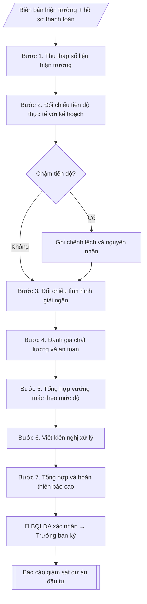

# Báo cáo giám sát dự án đầu tư

## Kiểm soát áp dụng và phê duyệt

Trước khi chạy quy trình, xác định `ngay_ap_dung`, `loai_hinh_truong`, `quy_che_noi_bo`, `nguon_du_lieu` và `nguoi_kiem_duyet`. Chỉ yêu cầu thông tin có liên quan đến nghiệp vụ; không dùng giá trị giả định thay dữ liệu bắt buộc. Hồ sơ có yếu tố pháp lý phải kèm văn bản gốc, tình trạng hiệu lực, điều khoản áp dụng và chuyển tiếp.

## Giới hạn và human gate

AI hỗ trợ chuẩn bị và đối chiếu. Cán bộ phụ trách kiểm tra dữ liệu/căn cứ, người có thẩm quyền duyệt và ký. Mọi đầu ra mặc định là **DỰ THẢO – CHỜ KIỂM DUYỆT**; không đánh dấu đã ký, đã duyệt hoặc đã công bố nếu chưa có chứng cứ. Dữ liệu sinh viên, sức khỏe, nhân sự và tài chính phải hạn chế theo mục đích, phân quyền và che thông tin định danh khi dùng ví dụ. Không tải dữ liệu lên dịch vụ ngoài khi chưa có quyền. Kiểm tra Luật 91/2025/QH15 về bảo vệ dữ liệu cá nhân (hiệu lực 01/01/2026) và quy định áp dụng trước xử lý/chia sẻ dữ liệu cá nhân.


## Khi nào dùng
Khi dự án đầu tư hạ tầng đang triển khai cần báo cáo định kỳ cho lãnh đạo/Hội đồng trường:
tiến độ so với kế hoạch, tình hình giải ngân, vướng mắc và đề xuất xử lý.

## Đầu vào (Input)

| Trường | Mô tả | Bắt buộc |
|---|---|---|
| `ten_du_an` | Tên dự án, quyết định phê duyệt | Có |
| `ky_bao_cao` | Quý/năm, thời gian báo cáo | Có |
| `tien_do_ke_hoach` | Tiến độ theo kế hoạch đến thời điểm báo cáo | Có |
| `tien_do_thuc_te` | Tiến độ thực tế (hạng mục hoàn thành, % khối lượng) | Có |
| `giai_ngan` | Kế hoạch vốn và giá trị đã giải ngân | Có |
| `vuong_mac` | Vướng mắc phát sinh (nếu có) | Không |
| `kien_nghi` | Kiến nghị xử lý | Không |

## Quy trình

**Bước 1. Thu thập số liệu hiện trường**
- Làm gì: thu thập từ Ban QLDA, tư vấn giám sát, nhà thầu: biên bản nghiệm thu hiện trường, nhật ký thi công, hồ sơ thanh toán/khối lượng; ghi rõ nguồn và thời điểm của từng số liệu.
- Dùng input: `ten_du_an`, `ky_bao_cao`.
- Vai trò: Cán bộ Ban Xúc tiến đầu tư (thực hiện trực tiếp) · AI hỗ trợ: tổng hợp, chuẩn hóa dữ liệu · ⏱ ~1–2 giờ (ước tính)
- Lưu ý nghiệp vụ: số liệu tiến độ/giải ngân phải có nguồn (biên bản, hồ sơ thanh toán) — không ước lượng cảm tính; số liệu do BQLDA/tư vấn giám sát xác nhận.
- → Kết quả bước: Bộ số liệu hiện trường đã thu thập (có nguồn, có xác nhận).

**Bước 2. Đối chiếu tiến độ thực tế với kế hoạch**
- Làm gì: so `tien_do_thuc_te` với `tien_do_ke_hoach`: tính chênh lệch % khối lượng; liệt kê hạng mục hoàn thành/chưa hoàn thành; xác định nguyên nhân chênh lệch (nếu chậm).
- Dùng input: `tien_do_ke_hoach`, `tien_do_thuc_te` + số liệu hiện trường (Bước 1).
- Vai trò: Chuyên viên Ban Xúc tiến đầu tư · AI hỗ trợ: đối chiếu tự động, cảnh báo sai lệch, tính toán, phân tích số liệu · ⏱ ~1–2 giờ (ước tính)
- Lưu ý nghiệp vụ: % khối lượng phải tính theo cùng một phương pháp với kế hoạch; chậm tiến độ phải nêu nguyên nhân cụ thể, không viết chung chung.
- → Kết quả bước: Bảng đối chiếu tiến độ (kế hoạch – thực tế – chênh lệch – nguyên nhân).

**Bước 3. Đối chiếu tình hình giải ngân**
- Làm gì: từ `giai_ngan`, so vốn kế hoạch bố trí với giá trị đã giải ngân: tính tỷ lệ %; xác định tồn đọng (vốn đã bố trí chưa giải ngân, khối lượng đã làm chưa thanh toán); nêu nguyên nhân tồn đọng.
- Dùng input: `giai_ngan` + hồ sơ thanh toán (Bước 1).
- Vai trò: Chuyên viên Ban Xúc tiến đầu tư · AI hỗ trợ: đối chiếu tự động, cảnh báo sai lệch, tính toán, phân tích số liệu · ⏱ ~1–2 giờ (ước tính)
- Lưu ý nghiệp vụ: giải ngân chậm có thể do thủ tục hoặc do khối lượng chưa đủ điều kiện thanh toán — phải phân biệt rõ.
- → Kết quả bước: Bảng đối chiếu giải ngân (kế hoạch – thực tế – tỷ lệ – tồn đọng).

**Bước 4. Đánh giá chất lượng và an toàn**
- Làm gì: tổng hợp kết quả nghiệm thu các hạng mục hoàn thành (đạt/không đạt); ghi nhận sự cố chất lượng/an toàn (nếu có) kèm biện pháp đã xử lý; đánh giá công tác đảm bảo an toàn lao động trên công trường.
- Dùng input: biên bản nghiệm thu (Bước 1).
- Vai trò: Chuyên viên Ban Xúc tiến đầu tư · AI hỗ trợ: tổng hợp, chuẩn hóa dữ liệu · ⏱ ~1–2 giờ (ước tính)
- Lưu ý nghiệp vụ: không che giấu sự cố chất lượng/an toàn; hạng mục chưa nghiệm thu thì ghi rõ "chưa nghiệm thu".
- → Kết quả bước: Bản đánh giá chất lượng – an toàn (kết quả nghiệm thu + sự cố nếu có).

**Bước 5. Tổng hợp vướng mắc theo mức độ**
- Làm gì: từ `vuong_mac`, phân loại vướng mắc: mặt bằng, vốn, thủ tục, nhà thầu, nhân sự...; đánh giá mức độ ảnh hưởng (cao/trung bình/thấp) và đơn vị liên quan.
- Dùng input: `vuong_mac` + bảng đối chiếu tiến độ/giải ngân (Bước 2–3).
- Vai trò: Chuyên viên Ban Xúc tiến đầu tư · AI hỗ trợ: tổng hợp, chuẩn hóa dữ liệu · ⏱ ~30–60 phút (ước tính)
- Lưu ý nghiệp vụ: vướng mắc phải mô tả cụ thể (cái gì – ở đâu – ảnh hưởng thế nào), không liệt kê chung chung.
- → Kết quả bước: Bảng vướng mắc (nội dung – phân loại – mức độ – đơn vị liên quan).

**Bước 6. Viết kiến nghị xử lý**
- Làm gì: từ `kien_nghi`, mỗi vướng mắc viết giải pháp cụ thể + đầu mối thực hiện + thời hạn; với kiến nghị điều chỉnh tổng mức/tiến độ: ghi rõ "trình cấp có thẩm quyền phê duyệt", không tự quyết trong báo cáo.
- Dùng input: `kien_nghi` + bảng vướng mắc (Bước 5).
- Vai trò: Chuyên viên Ban Xúc tiến đầu tư · AI hỗ trợ: soạn dự thảo, chuẩn bị hồ sơ trình đầy đủ · ⏱ ~30–60 phút (ước tính)
- Lưu ý nghiệp vụ: kiến nghị phải khả thi và có thời hạn; tránh kiến nghị chung chung kiểu "đề nghị quan tâm chỉ đạo".
- → Kết quả bước: Bảng kiến nghị (vướng mắc – giải pháp – đầu mối – thời hạn).

**Bước 7. Tổng hợp và hoàn thiện báo cáo**
- Làm gì: ghép các bán thành phẩm Bước 2–6 thành báo cáo theo thể thức (số ký hiệu, nơi nhận, chữ ký Trưởng ban); kiểm tra số liệu giữa các phần khớp nhau; BQLDA xác nhận số liệu hiện trường trước khi ký.
- Dùng input: toàn bộ bán thành phẩm Bước 1–6 + `ten_du_an` + `ky_bao_cao`.
- Vai trò: Chuyên viên Ban Xúc tiến đầu tư · AI hỗ trợ: tổng hợp, chuẩn hóa dữ liệu, đối chiếu tự động, cảnh báo sai lệch · ⏱ ~30–60 phút (ước tính)
- Lưu ý nghiệp vụ: báo cáo ký xong gửi Ban Giám hiệu đúng kỳ (quý/năm); lưu hồ sơ đầy đủ để phục vụ kiểm toán sau này.
- → Kết quả bước: Báo cáo giám sát dự án đầu tư hoàn chỉnh.

## Luồng quy trình (Workflow)



## Đầu ra (Output)
- Báo cáo giám sát dự án (tiến độ, giải ngân, vướng mắc, kiến nghị) + phụ lục số liệu.

**Cấu trúc output chuẩn** (khung mẫu cố định của sản phẩm chính — Báo cáo giám sát dự án):
1. Phần mở đầu hành chính (tên trường, đơn vị, số ký hiệu, ngày tháng).
2. Tên báo cáo + kỳ báo cáo + tên dự án (kèm quyết định phê duyệt).
3. Phần I. Tiến độ thực hiện (kế hoạch – thực tế – chênh lệch – nguyên nhân).
4. Phần II. Tình hình giải ngân (kế hoạch vốn – đã giải ngân – tỷ lệ – tồn đọng).
5. Phần III. Chất lượng – an toàn (kết quả nghiệm thu, sự cố nếu có).
6. Phần IV. Vướng mắc (bảng: nội dung – phân loại – mức độ).
7. Phần V. Kiến nghị (bảng: vướng mắc – giải pháp – đầu mối – thời hạn).
8. Nơi nhận, chữ ký.
- Phụ lục: Bảng số liệu chi tiết (tiến độ, giải ngân).

## Checklist nghiệm thu

- [ ] Đủ các phần theo "Cấu trúc output chuẩn": Phần mở đầu hành chính (tên trường, đơn vị,…; Tên báo cáo + kỳ báo cáo + tên dự án (kèm…; Phần I. Tiến độ thực hiện (kế hoạch; Phần II. Tình hình giải ngân (kế hoạch vốn; Phần III. Chất lượng; Phần IV. Vướng mắc (bảng; …
- [ ] Có đầy đủ sản phẩm: Báo cáo giám sát dự án (tiến độ, giải ngân, vướng mắc, kiến nghị) + phụ lục số liệu
- [ ] Mọi số liệu, tên, ngày tháng trong output khớp với Input đã cung cấp (không thêm bớt, không suy đoán)
- [ ] Không bịa đặt số liệu, minh chứng, trích dẫn hay căn cứ
- [ ] Đúng thể thức, định dạng văn bản theo quy định hiện hành
- [ ] Căn cứ pháp lý nêu đầy đủ, còn hiệu lực tại thời điểm lập
- [ ] Đã qua Human gate: người có thẩm quyền đã kiểm tra/ký duyệt trước khi phát hành
- [ ] Số liệu tiến độ/giải ngân phải có nguồn (biên bản, hồ sơ thanh toán) — không ước lượng cảm tính
- [ ] % khối lượng phải tính theo cùng một phương pháp với kế hoạch
- [ ] Giải ngân chậm có thể do thủ tục hoặc do khối lượng chưa đủ điều kiện thanh toán — phải phân biệt rõ.

> Tiêu chí đạt: tất cả các ô đều được đánh dấu.

## Ví dụ mô phỏng (dữ liệu giả lập)

> Tất cả tên trường, cá nhân, số liệu dưới đây đều là **giả lập**, không liên quan tổ chức/cá nhân có thật.

### Input mẫu

| Trường | Giá trị |
|---|---|
| `ten_du_an` | Ký túc xá sinh viên 2.000 chỗ (QĐ phê duyệt số 120/QĐ-ĐHA ngày 15/03/2027) |
| `ky_bao_cao` | Quý III/2028 |
| `tien_do_ke_hoach` | Hoàn thành 55% khối lượng (xong phần thô 02 tòa) |
| `tien_do_thuc_te` | Hoàn thành 48% (tòa A xong phần thô, tòa B đạt 80% phần thô) |
| `giai_ngan` | Kế hoạch năm 2028: 60 tỷ; đã giải ngân 41 tỷ (68%) |
| `vuong_mac` | Chậm vật liệu thép 3 tuần do nhà cung cấp; thiếu 02 kỹ sư giám sát hiện trường |
| `kien_nghi` | Đổi nhà cung cấp thép dự phòng; bổ sung kỹ sư giám sát trong tháng 10/2028 |

### Output mẫu

```
TRƯỜNG ĐẠI HỌC A            CỘNG HÒA XÃ HỘI CHỦ NGHĨA VIỆT NAM
BAN XÚC TIẾN ĐẦU TƯ & PT HẠ TẦNG         Độc lập – Tự do – Hạnh phúc
      Số: 22/BC-ĐHA-XTĐT
                                                 Thành phố C, ngày 05 tháng 10 năm 2028

              BÁO CÁO GIÁM SÁT DỰ ÁN ĐẦU TƯ
        Quý III/2028 — Dự án: Ký túc xá sinh viên 2.000 chỗ
        (QĐ phê duyệt số 120/QĐ-ĐHA ngày 15/03/2027)

I. TIẾN ĐỘ THỰC HIỆN
- Kế hoạch đến hết Quý III/2028: hoàn thành 55% khối lượng.
- Thực tế: 48% (tòa A hoàn thành phần thô; tòa B đạt 80% phần thô).
- Chênh lệch: chậm 7% so với kế hoạch.

II. TÌNH HÌNH GIẢI NGÂN
- Kế hoạch vốn năm 2028: 60 tỷ đồng; đã giải ngân 41 tỷ đồng (68%).

III. CHẤT LƯỢNG – AN TOÀN
- Các hạng mục hoàn thành đã nghiệm thu đạt yêu cầu; không có sự cố mất an toàn.

IV. VƯỚNG MẮC
1. Chậm cung ứng thép 3 tuần do nhà cung cấp chính.
2. Thiếu 02 kỹ sư giám sát hiện trường.

V. KIẾN NGHỊ
1. Chuyển sang nhà cung cấp thép dự phòng đã khảo sát — Ban QLDA thực hiện trong tháng 10/2028.
2. Bổ sung 02 kỹ sư giám sát — Phòng TCCB phối hợp tuyển trong tháng 10/2028.

Kính báo cáo Ban Giám hiệu./.

Nơi nhận:                                        TRƯỞNG BAN
- Ban Giám hiệu;                                     [CHỜ KÝ]
- Lưu: VT, XTĐT.
                                              TS. Phạm Văn D
```

## Human gate
- Ban quản lý dự án/tư vấn giám sát xác nhận số liệu hiện trường.
- Trưởng Ban XTĐT ký báo cáo; Ban Giám hiệu chỉ đạo xử lý vướng mắc.

## Giới hạn
- Số liệu tiến độ/giải ngân phải có nguồn (biên bản, hồ sơ thanh toán); không ước lượng cảm tính.
- Không che giấu chậm tiến độ, sự cố chất lượng/an toàn.
- Kiến nghị điều chỉnh tổng mức/tiến độ phải trình cấp phê duyệt, không tự quyết trong báo cáo.

## Căn cứ & lưu ý
- Luật Đầu tư công, Luật Xây dựng, quy định về giám sát, đánh giá đầu tư và quy chế nội bộ.
- Không dùng tên thật của trường/cá nhân khi mô phỏng.

## Quản trị phiên bản

- Phiên bản gói: `1.1.0`; ngày cập nhật: `2026-10-09`.
- Kho nguồn: https://github.com/phamtruong91/dh-skills
- Người duy trì trên GitHub: `phamtruong91` (Phạm Văn Trường). Người phê duyệt nghiệp vụ: **chưa chỉ định**.
- Commit nguồn trước cập nhật: `78fd1d51b8acd1a724d9b9af6c488460bc7551ad`. Commit chứa phiên bản này xem bằng `git log -1 -- skills/bao-cao-giam-sat-du-an-dau-tu`; không tự gán SHA chưa tạo.
- Giấy phép: theo LICENSE của kho; bản quyền CES Global.
- Lịch sử 1.1.0: bổ sung metadata giao diện, kiểm soát áp dụng, quản trị phiên bản.
- Trạng thái: dự thảo nghiệp vụ; kiểm tra pháp lý trước thực thi. Ngày cập nhật không đồng nghĩa mọi văn bản đã được rà soát toàn văn.
