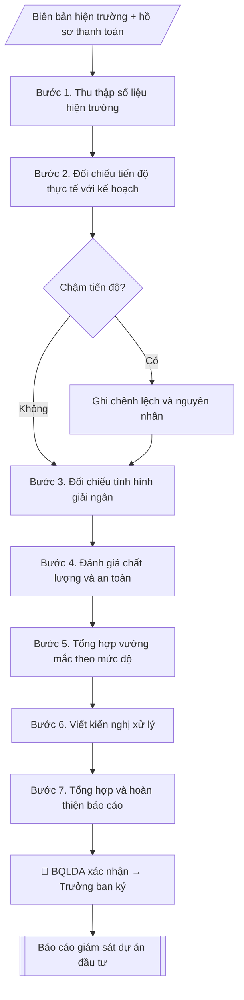

# Báo cáo giám sát dự án đầu tư

## Định dạng và file đầu ra

Định dạng đầu ra có thể chọn theo sản phẩm/yêu cầu: .docx, .pdf. Đọc mục “Định dạng bổ sung” trong quy cách đầu ra trước khi chọn.

**Phải tạo file thực tế để tải xuống, không chỉ trả nội dung trong chat.** Định dạng mặc định của skill: **.docx**. Nếu có bảng số liệu nghiệp vụ yêu cầu file bảng tính riêng, tạo thêm Excel theo yêu cầu; không tự tạo file kiểm tra. Không chờ người dùng yêu cầu xuất file lần nữa. Ưu tiên định dạng người dùng chỉ định; đọc quy tắc xuất file tại references/quy-cach-dau-ra.md.

## Quy cách đầu ra và thông tin thiếu
Đọc [quy cách và cấu trúc sản phẩm](references/quy-cach-dau-ra.md) trước khi soạn/xuất. File giao chỉ gồm sản phẩm nghiệp vụ được yêu cầu; kiểm tra nội bộ không xuất kèm. Thiếu thông tin thì giữ nguyên trường/mục và chỗ điền theo mẫu gốc (dòng dấu chấm, dấu gạch hoặc ô trống); không tự điền dữ liệu mẫu, số 0, mã chờ xác minh hay dòng chờ ký. Mẫu chuyên ngành còn áp dụng được ưu tiên về cấu trúc, mã biểu và người ký. Bản đầy đủ: [quy tắc chung](references/quy-tac-chung.md).

## Kiểm soát áp dụng và phê duyệt
Trước khi chạy, xác định `ngay_ap_dung`, `loai_hinh_truong`, `quy_che_noi_bo`, `nguon_du_lieu`, `nguoi_kiem_duyet`; chỉ hỏi thông tin liên quan nghiệp vụ, không dùng giá trị giả định thay dữ liệu bắt buộc. Đối chiếu căn cứ pháp lý với văn bản gốc, hiệu lực, điều khoản áp dụng và chuyển tiếp. Bản đầy đủ: [quy tắc chung](references/quy-tac-chung.md).

## Giới hạn và human gate
AI hỗ trợ chuẩn bị và đối chiếu; cán bộ phụ trách kiểm tra dữ liệu/căn cứ, người có thẩm quyền duyệt và ký. Không đánh dấu đã ký, đã duyệt, đã công bố khi chưa có chứng cứ. Dữ liệu sinh viên, sức khỏe, nhân sự, tài chính chỉ dùng theo mục đích và phân quyền, che thông tin định danh khi dùng ví dụ (Luật 91/2025/QH15, hiệu lực 01/01/2026); không tải dữ liệu lên dịch vụ ngoài khi chưa có quyền. Bản đầy đủ: [quy tắc chung](references/quy-tac-chung.md).

## Khi nào dùng
Khi dự án đầu tư hạ tầng đang triển khai cần báo cáo định kỳ cho lãnh đạo/Hội đồng trường:
tiến độ so với kế hoạch, tình hình giải ngân, vướng mắc và đề xuất xử lý.

## Đầu vào (Input)

| Trường | Mô tả | Bắt buộc |
|---|---|---|
| `ten_du_an` | Tên dự án, quyết định phê duyệt | Có |
| `ky_bao_cao` | Quý/năm, thời gian báo cáo | Có |
| `tien_do_ke_hoach` | Tiến độ theo kế hoạch đến thời điểm báo cáo | Có |
| `tien_do_thuc_te` | Tiến độ thực tế (hạng mục hoàn thành, % khối lượng) | Có |
| `giai_ngan` | Kế hoạch vốn và giá trị đã giải ngân | Có |
| `vuong_mac` | Vướng mắc phát sinh (nếu có) | Không |
| `kien_nghi` | Kiến nghị xử lý | Không |

## Quy trình

**Bước 1. Thu thập số liệu hiện trường**
- Làm gì: thu thập từ Ban QLDA, tư vấn giám sát, nhà thầu: biên bản nghiệm thu hiện trường, nhật ký thi công, hồ sơ thanh toán/khối lượng; ghi rõ nguồn và thời điểm của từng số liệu.
- Dùng input: `ten_du_an`, `ky_bao_cao`.
- Vai trò: Cán bộ Ban Xúc tiến đầu tư (thực hiện trực tiếp) · AI hỗ trợ: tổng hợp, chuẩn hóa dữ liệu · ⏱ ~1–2 giờ (ước tính)
- Lưu ý nghiệp vụ: số liệu tiến độ/giải ngân phải có nguồn (biên bản, hồ sơ thanh toán) — không ước lượng cảm tính; số liệu do BQLDA/tư vấn giám sát xác nhận.
- → Kết quả bước: Bộ số liệu hiện trường đã thu thập (có nguồn, có xác nhận).

**Bước 2. Đối chiếu tiến độ thực tế với kế hoạch**
- Làm gì: so `tien_do_thuc_te` với `tien_do_ke_hoach`: tính chênh lệch % khối lượng; liệt kê hạng mục hoàn thành/chưa hoàn thành; xác định nguyên nhân chênh lệch (nếu chậm).
- Dùng input: `tien_do_ke_hoach`, `tien_do_thuc_te` + số liệu hiện trường (Bước 1).
- Vai trò: Chuyên viên Ban Xúc tiến đầu tư · AI hỗ trợ: đối chiếu tự động, cảnh báo sai lệch, tính toán, phân tích số liệu · ⏱ ~1–2 giờ (ước tính)
- Lưu ý nghiệp vụ: % khối lượng phải tính theo cùng một phương pháp với kế hoạch; chậm tiến độ phải nêu nguyên nhân cụ thể, không viết chung chung.
- → Kết quả bước: Bảng đối chiếu tiến độ (kế hoạch – thực tế – chênh lệch – nguyên nhân).

**Bước 3. Đối chiếu tình hình giải ngân**
- Làm gì: từ `giai_ngan`, so vốn kế hoạch bố trí với giá trị đã giải ngân: tính tỷ lệ %; xác định tồn đọng (vốn đã bố trí chưa giải ngân, khối lượng đã làm chưa thanh toán); nêu nguyên nhân tồn đọng.
- Dùng input: `giai_ngan` + hồ sơ thanh toán (Bước 1).
- Vai trò: Chuyên viên Ban Xúc tiến đầu tư · AI hỗ trợ: đối chiếu tự động, cảnh báo sai lệch, tính toán, phân tích số liệu · ⏱ ~1–2 giờ (ước tính)
- Lưu ý nghiệp vụ: giải ngân chậm có thể do thủ tục hoặc do khối lượng chưa đủ điều kiện thanh toán — phải phân biệt rõ.
- → Kết quả bước: Bảng đối chiếu giải ngân (kế hoạch – thực tế – tỷ lệ – tồn đọng).

**Bước 4. Đánh giá chất lượng và an toàn**
- Làm gì: tổng hợp kết quả nghiệm thu các hạng mục hoàn thành (đạt/không đạt); ghi nhận sự cố chất lượng/an toàn (nếu có) kèm biện pháp đã xử lý; đánh giá công tác đảm bảo an toàn lao động trên công trường.
- Dùng input: biên bản nghiệm thu (Bước 1).
- Vai trò: Chuyên viên Ban Xúc tiến đầu tư · AI hỗ trợ: tổng hợp, chuẩn hóa dữ liệu · ⏱ ~1–2 giờ (ước tính)
- Lưu ý nghiệp vụ: không che giấu sự cố chất lượng/an toàn; hạng mục chưa nghiệm thu thì ghi rõ "chưa nghiệm thu".
- → Kết quả bước: Bản đánh giá chất lượng – an toàn (kết quả nghiệm thu + sự cố nếu có).

**Bước 5. Tổng hợp vướng mắc theo mức độ**
- Làm gì: từ `vuong_mac`, phân loại vướng mắc: mặt bằng, vốn, thủ tục, nhà thầu, nhân sự...; đánh giá mức độ ảnh hưởng (cao/trung bình/thấp) và đơn vị liên quan.
- Dùng input: `vuong_mac` + bảng đối chiếu tiến độ/giải ngân (Bước 2–3).
- Vai trò: Chuyên viên Ban Xúc tiến đầu tư · AI hỗ trợ: tổng hợp, chuẩn hóa dữ liệu · ⏱ ~30–60 phút (ước tính)
- Lưu ý nghiệp vụ: vướng mắc phải mô tả cụ thể (cái gì – ở đâu – ảnh hưởng thế nào), không liệt kê chung chung.
- → Kết quả bước: Bảng vướng mắc (nội dung – phân loại – mức độ – đơn vị liên quan).

**Bước 6. Viết kiến nghị xử lý**
- Làm gì: từ `kien_nghi`, mỗi vướng mắc viết giải pháp cụ thể + đầu mối thực hiện + thời hạn; với kiến nghị điều chỉnh tổng mức/tiến độ: ghi rõ "trình cấp có thẩm quyền phê duyệt", không tự quyết trong báo cáo.
- Dùng input: `kien_nghi` + bảng vướng mắc (Bước 5).
- Vai trò: Chuyên viên Ban Xúc tiến đầu tư · AI hỗ trợ: soạn dự thảo, chuẩn bị hồ sơ trình đầy đủ · ⏱ ~30–60 phút (ước tính)
- Lưu ý nghiệp vụ: kiến nghị phải khả thi và có thời hạn; tránh kiến nghị chung chung kiểu "đề nghị quan tâm chỉ đạo".
- → Kết quả bước: Bảng kiến nghị (vướng mắc – giải pháp – đầu mối – thời hạn).

**Bước 7. Tổng hợp và hoàn thiện báo cáo**
- Làm gì: ghép các bán thành phẩm Bước 2–6 thành báo cáo theo thể thức (số ký hiệu, nơi nhận, chữ ký Trưởng ban); kiểm tra số liệu giữa các phần khớp nhau; BQLDA xác nhận số liệu hiện trường trước khi ký.
- Dùng input: toàn bộ bán thành phẩm Bước 1–6 + `ten_du_an` + `ky_bao_cao`.
- Vai trò: Chuyên viên Ban Xúc tiến đầu tư · AI hỗ trợ: tổng hợp, chuẩn hóa dữ liệu, đối chiếu tự động, cảnh báo sai lệch · ⏱ ~30–60 phút (ước tính)
- Lưu ý nghiệp vụ: báo cáo ký xong gửi Ban Giám hiệu đúng kỳ (quý/năm); lưu hồ sơ đầy đủ để phục vụ kiểm toán sau này.
- → Kết quả bước: Báo cáo giám sát dự án đầu tư hoàn chỉnh.

## Luồng quy trình (Workflow)

## Đầu ra

File nghiệp vụ thực tế theo định dạng mặc định ở đầu skill hoặc định dạng người dùng yêu cầu, kèm liên kết tải trong phản hồi cuối.

Sản phẩm nghiệp vụ hoàn chỉnh theo [quy cách và cấu trúc](references/quy-cach-dau-ra.md), giữ các trường chưa có dữ liệu ở trạng thái trống. Không xuất kèm checklist/phụ lục kiểm tra đầu ra.

## Kiểm tra nội bộ trước khi giao

- [ ] Bố cục khớp mẫu áp dụng và cấu trúc tại references/quy-cach-dau-ra.md.
- [ ] Có đầy đủ sản phẩm: Báo cáo giám sát dự án (tiến độ, giải ngân, vướng mắc, kiến nghị) + phụ lục số liệu
- [ ] Mọi số liệu, tên, ngày tháng trong output khớp với Input đã cung cấp (không thêm bớt, không suy đoán)
- [ ] Không bịa đặt số liệu, minh chứng, trích dẫn hay căn cứ
- [ ] Đúng thể thức, định dạng văn bản theo quy định hiện hành
- [ ] Căn cứ pháp lý nêu đầy đủ, còn hiệu lực tại thời điểm lập
- [ ] Đã qua Human gate: người có thẩm quyền đã kiểm tra/ký duyệt trước khi phát hành
- [ ] Số liệu tiến độ/giải ngân phải có nguồn (biên bản, hồ sơ thanh toán) — không ước lượng cảm tính
- [ ] % khối lượng phải tính theo cùng một phương pháp với kế hoạch
- [ ] Giải ngân chậm có thể do thủ tục hoặc do khối lượng chưa đủ điều kiện thanh toán — phải phân biệt rõ.

> Tiêu chí đạt: tất cả các ô đều được đánh dấu.

## Human gate
- Ban quản lý dự án/tư vấn giám sát xác nhận số liệu hiện trường.
- Trưởng Ban XTĐT ký báo cáo; Ban Giám hiệu chỉ đạo xử lý vướng mắc.

## Giới hạn
- Số liệu tiến độ/giải ngân phải có nguồn (biên bản, hồ sơ thanh toán); không ước lượng cảm tính.
- Không che giấu chậm tiến độ, sự cố chất lượng/an toàn.
- Kiến nghị điều chỉnh tổng mức/tiến độ phải trình cấp phê duyệt, không tự quyết trong báo cáo.

## Căn cứ & lưu ý
- Luật Đầu tư công, Luật Xây dựng, quy định về giám sát, đánh giá đầu tư và quy chế nội bộ.
- Không dùng tên thật của trường/cá nhân khi mô phỏng.

## Quản trị phiên bản
- Phiên bản gói `1.3.2` (cập nhật 2026-10-10); hồ sơ đầy đủ tại [references/version.json](references/version.json).
- Người phê duyệt nghiệp vụ: **chưa chỉ định**. Trạng thái: dự thảo nghiệp vụ; kiểm tra pháp lý trước thực thi. Ngày cập nhật không đồng nghĩa mọi văn bản đã được rà soát toàn văn.
- Giấy phép theo LICENSE của kho (bản quyền CES Global). Lịch sử thay đổi: CHANGELOG.md.
