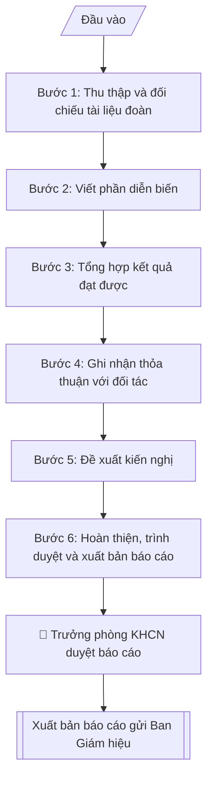

# Báo cáo kết quả đoàn công tác

## Định dạng và file đầu ra

Định dạng đầu ra có thể chọn theo sản phẩm/yêu cầu: .docx, .pdf. Đọc mục “Định dạng bổ sung” trong quy cách đầu ra trước khi chọn.

**Phải tạo file thực tế để tải xuống, không chỉ trả nội dung trong chat.** Định dạng mặc định của skill: **.docx**. Nếu có bảng số liệu nghiệp vụ yêu cầu file bảng tính riêng, tạo thêm Excel theo yêu cầu; không tự tạo file kiểm tra. Không chờ người dùng yêu cầu xuất file lần nữa. Ưu tiên định dạng người dùng chỉ định; đọc quy tắc xuất file tại references/quy-cach-dau-ra.md.

## Quy cách đầu ra và thông tin thiếu
Khi dựng file Word/Excel, áp dụng mục “Thể thức và bảng biểu khi dựng file” trong quy cách đầu ra (cỡ chữ từng thành phần, bảng nhiều trang, số trang, phụ lục). Đọc [quy cách và cấu trúc sản phẩm](references/quy-cach-dau-ra.md) trước khi soạn/xuất. File giao chỉ gồm sản phẩm nghiệp vụ được yêu cầu; kiểm tra nội bộ không xuất kèm. Thiếu thông tin thì giữ nguyên trường/mục và chỗ điền theo mẫu gốc (dòng dấu chấm, dấu gạch hoặc ô trống); không tự điền dữ liệu mẫu, số 0, mã chờ xác minh hay dòng chờ ký. Mẫu chuyên ngành còn áp dụng được ưu tiên về cấu trúc, mã biểu và người ký. Bản đầy đủ: [quy tắc chung](references/quy-tac-chung.md).

## Kiểm soát áp dụng và phê duyệt
Trước khi chạy, xác định `ngay_ap_dung`, `loai_hinh_truong`, `quy_che_noi_bo`, `nguon_du_lieu`, `nguoi_kiem_duyet`; chỉ hỏi thông tin liên quan nghiệp vụ, không dùng giá trị giả định thay dữ liệu bắt buộc. Đối chiếu căn cứ pháp lý với văn bản gốc, hiệu lực, điều khoản áp dụng và chuyển tiếp. Bản đầy đủ: [quy tắc chung](references/quy-tac-chung.md).

## Giới hạn và human gate
AI hỗ trợ chuẩn bị và đối chiếu; cán bộ phụ trách kiểm tra dữ liệu/căn cứ, người có thẩm quyền duyệt và ký. Không đánh dấu đã ký, đã duyệt, đã công bố khi chưa có chứng cứ. Dữ liệu sinh viên, sức khỏe, nhân sự, tài chính chỉ dùng theo mục đích và phân quyền, che thông tin định danh khi dùng ví dụ (Luật 91/2025/QH15, hiệu lực 01/01/2026); không tải dữ liệu lên dịch vụ ngoài khi chưa có quyền. Bản đầy đủ: [quy tắc chung](references/quy-tac-chung.md).

## Khi nào dùng
Khi cần tổng hợp, báo cáo Ban Giám hiệu về kết quả một đoàn công tác đã hoàn thành:
đoàn ra (cán bộ đi nước ngoài về) hoặc đoàn vào (đã đón và tiễn đoàn đối tác),
làm cơ sở triển khai các thỏa thuận và kiến nghị tiếp theo.

## Đầu vào (Input)

| Trường | Mô tả | Bắt buộc |
|---|---|---|
| `loai_doan` | Đoàn ra / Đoàn vào | Có |
| `ten_doan` | Tên đoàn, đối tác, quốc gia | Có |
| `thoi_gian` | Thời gian thực tế diễn ra | Có |
| `thanh_phan` | Thành phần đoàn (trưởng đoàn, thành viên, chức danh) | Có |
| `dien_bien` | Diễn biến chính theo ngày: các buổi làm việc, nội dung trao đổi | Có |
| `ket_qua` | Kết quả đạt được: văn bản đã ký, nội dung thống nhất, số liệu cụ thể | Có |
| `thoa_thuan` | Các thỏa thuận / cam kết với đối tác (nếu có) | Không |
| `kien_nghi` | Kiến nghị, đề xuất bước tiếp theo và đơn vị thực hiện | Có |
| `kinh_phi_thuc_te` | Kinh phí thực tế đã chi (để đối chiếu dự toán) | Không |

## Quy trình

**Bước 1. Thu thập và đối chiếu tài liệu đoàn**
- Làm gì: tổng hợp nhật ký đoàn, biên bản các buổi làm việc, ảnh tư liệu, văn bản đã ký kết; đối chiếu từng nội dung với kế hoạch đã được phê duyệt để xác định nội dung thực hiện đúng và nội dung đã điều chỉnh.
- Dùng input: `loai_doan`, `ten_doan`, `thoi_gian`, `thanh_phan`, `dien_bien`.
- Vai trò: Trưởng đoàn · AI hỗ trợ: tổng hợp · ⏱ ~1–2 giờ (ước tính)
- Lưu ý nghiệp vụ: báo cáo phải nộp trong vòng 07 ngày làm việc sau khi đoàn kết thúc; nội dung điều chỉnh so với kế hoạch phải ghi rõ lý do, không được "làm đẹp" thành thực hiện đúng kế hoạch.
- → Kết quả bước: bộ hồ sơ tài liệu đoàn + bảng đối chiếu thực hiện đúng / điều chỉnh so với kế hoạch đã duyệt.

**Bước 2. Viết phần diễn biến**
- Làm gì: trình bày theo trình tự thời gian từng ngày: thời gian, địa điểm, thành phần hai bên, nội dung trao đổi chính của mỗi buổi làm việc; viết ngắn gọn, đúng sự thật.
- Dùng input: `dien_bien`, `thoi_gian`, `thanh_phan`.
- Vai trò: Trưởng đoàn · AI hỗ trợ: viết dự thảo · ⏱ ~45–60 phút (ước tính)
- Lưu ý nghiệp vụ: chỉ ghi những nội dung có biên bản hoặc nhật ký đoàn làm bằng chứng; không đưa cảm nhận chủ quan, không ghi chi tiết hậu cần rườm rà (ăn ở, đi lại) vào phần diễn biến chính.
- → Kết quả bước: dự thảo phần I. Diễn biến (theo trình tự thời gian).

**Bước 3. Tổng hợp kết quả đạt được**
- Làm gì: liệt kê cụ thể từng kết quả; nội dung nào định lượng được thì ghi số liệu (số văn bản đã ký, số suất học bổng, số lượng trao đổi dự kiến...); phân biệt rõ kết quả đã hoàn thành và nội dung đang tiếp tục đàm phán.
- Dùng input: `ket_qua`.
- Vai trò: Trưởng đoàn · AI hỗ trợ: tổng hợp · ⏱ ~30–45 phút (ước tính)
- Lưu ý nghiệp vụ: không ghi kết quả "dự kiến" thành kết quả "đã đạt"; mỗi kết quả nên gắn với bằng chứng (văn bản ký, biên bản thống nhất) để Ban Giám hiệu kiểm chứng được.
- → Kết quả bước: dự thảo phần II. Kết quả đạt được (danh sách có số liệu, phân loại hoàn thành / đang đàm phán).

**Bước 4. Ghi nhận thỏa thuận với đối tác**
- Làm gì: trích nguyên văn hoặc tóm tắt chính xác các thỏa thuận, cam kết với đối tác; mỗi thỏa thuận ghi rõ trách nhiệm và thời hạn thực hiện của mỗi bên.
- Dùng input: `thoa_thuan`, `ket_qua`.
- Vai trò: Trưởng đoàn · AI hỗ trợ: trích thỏa thuận · ⏱ ~30–45 phút (ước tính)
- Lưu ý nghiệp vụ: thỏa thuận ghi đúng nội dung đã thống nhất, không suy diễn thêm; thỏa thuận miệng chưa có văn bản thì ghi rõ "đã thống nhất về nguyên tắc, chờ văn bản chính thức".
- → Kết quả bước: dự thảo phần III. Thỏa thuận với đối tác (thỏa thuận – trách nhiệm – thời hạn mỗi bên).

**Bước 5. Đề xuất kiến nghị**
- Làm gì: mỗi kiến nghị ghi rõ nội dung, đơn vị chủ trì, đơn vị phối hợp, thời hạn hoàn thành; kiến nghị phải khả thi và gắn trực tiếp với kết quả của đoàn.
- Dùng input: `kien_nghi`, `ket_qua`, `thoa_thuan`.
- Vai trò: Trưởng đoàn · AI hỗ trợ: đề xuất khung · ⏱ ~30–45 phút (ước tính)
- Lưu ý nghiệp vụ: kiến nghị không gắn với kết quả đoàn (ví dụ kiến nghị chung chung về chính sách) sẽ bị trả về; mỗi kiến nghị cần một đơn vị chủ trì duy nhất để tránh đùn đẩy.
- → Kết quả bước: dự thảo phần IV. Kiến nghị (bảng: nội dung – đơn vị chủ trì – đơn vị phối hợp – thời hạn).

**Bước 6. Hoàn thiện, trình duyệt và xuất bản báo cáo**
- Làm gì: ráp các phần theo bố cục Diễn biến → Kết quả → Thỏa thuận → Kiến nghị; đối chiếu `kinh_phi_thuc_te` với dự toán đã duyệt nếu có; kèm phụ lục (văn bản đã ký, ảnh tư liệu, danh sách); trình Trưởng phòng KHCN&HTQT ký duyệt trước khi gửi Ban Giám hiệu.
- Dùng input: `kinh_phi_thuc_te`, kết quả các Bước 1–5.
- Vai trò: Trưởng Phòng KHCN và HTQT · AI hỗ trợ: ráp và đối chiếu kinh phí · ⏱ ~1–2 ngày làm việc (ước tính)
- Lưu ý nghiệp vụ: đây là Human gate bắt buộc — báo cáo chưa qua Trưởng phòng KHCN&HTQT ký duyệt thì không gửi Ban Giám hiệu; kiểm tra lần cuối tên đối tác, chức danh, số liệu đã thống nhất.
- → Kết quả bước: báo cáo kết quả đoàn công tác hoàn chỉnh + phụ lục, đã ký duyệt, sẵn sàng gửi Ban Giám hiệu.

## Luồng quy trình (Workflow)

## Đầu ra

File nghiệp vụ thực tế theo định dạng mặc định ở đầu skill hoặc định dạng người dùng yêu cầu, kèm liên kết tải trong phản hồi cuối.

Sản phẩm nghiệp vụ hoàn chỉnh theo [quy cách và cấu trúc](references/quy-cach-dau-ra.md), giữ các trường chưa có dữ liệu ở trạng thái trống. Không xuất kèm checklist/phụ lục kiểm tra đầu ra.

## Kiểm tra nội bộ trước khi giao
- [ ] Bố cục khớp mẫu áp dụng và cấu trúc tại references/quy-cach-dau-ra.md.
- [ ] Nội dung khớp với Input: thời gian, địa điểm, thành phần hai bên, kết quả, thỏa thuận, kiến nghị.
- [ ] Không bịa đặt kết quả, số liệu, thỏa thuận; không ghi kết quả "dự kiến" thành "đã đạt".
- [ ] Đúng thể thức báo cáo hành chính; mỗi kiến nghị ghi rõ đơn vị chủ trì duy nhất, đơn vị phối hợp, thời hạn.
- [ ] Căn cứ đầy đủ: kế hoạch đoàn đã được phê duyệt; báo cáo nộp trong 07 ngày làm việc sau khi đoàn kết thúc.
- [ ] Đã qua Human gate: Trưởng phòng KHCN&HTQT ký duyệt trước khi gửi Ban Giám hiệu.
- [ ] Nội dung điều chỉnh so với kế hoạch ghi rõ lý do, không "làm đẹp" thành thực hiện đúng kế hoạch.
- [ ] Mỗi thỏa thuận ghi rõ trách nhiệm và thời hạn của mỗi bên; thỏa thuận miệng ghi rõ "chờ văn bản chính thức".
- [ ] Kinh phí thực tế đã đối chiếu với dự toán được duyệt (nếu có).

Tiêu chí đạt = tất cả các ô được đánh dấu.

## Căn cứ & lưu ý
- Quy chế quản lý đoàn ra, đoàn vào của Trường Đại học A: đoàn phải báo cáo
  kết quả trong vòng 07 ngày làm việc sau khi kết thúc.
- Báo cáo phải trung thực, khách quan; các thỏa thuận ghi đúng nội dung đã thống nhất.
- Văn bản ký kết với đối tác nước ngoài lưu 01 bản tại Phòng KHCN&HTQT để theo dõi thực hiện.
- Không dùng tên thật của trường/cá nhân khi mô phỏng.

## Quản trị phiên bản
- Phiên bản gói `1.3.2` (cập nhật 2026-10-10); hồ sơ đầy đủ tại [references/version.json](references/version.json).
- Người phê duyệt nghiệp vụ: **chưa chỉ định**. Trạng thái: dự thảo nghiệp vụ; kiểm tra pháp lý trước thực thi. Ngày cập nhật không đồng nghĩa mọi văn bản đã được rà soát toàn văn.
- Giấy phép theo LICENSE của kho (bản quyền CES Global). Lịch sử thay đổi: CHANGELOG.md.
