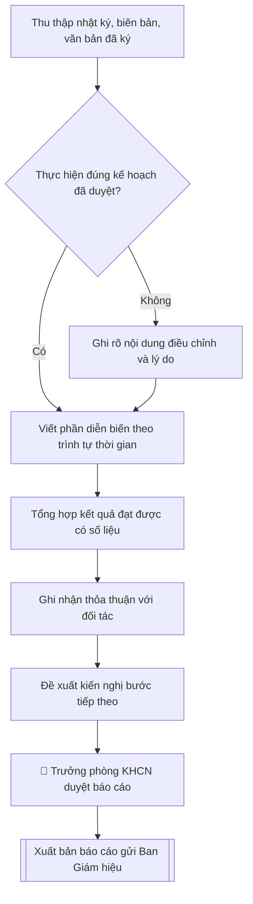

# Skill: Báo cáo kết quả đoàn công tác

## Khi nào dùng
Khi cần tổng hợp, báo cáo Ban Giám hiệu về kết quả một đoàn công tác đã hoàn thành:
đoàn ra (cán bộ đi nước ngoài về) hoặc đoàn vào (đã đón và tiễn đoàn đối tác),
làm cơ sở triển khai các thỏa thuận và kiến nghị tiếp theo.

## Đầu vào (Input)

| Trường | Mô tả | Bắt buộc |
|---|---|---|
| `loai_doan` | Đoàn ra / Đoàn vào | Có |
| `ten_doan` | Tên đoàn, đối tác, quốc gia | Có |
| `thoi_gian` | Thời gian thực tế diễn ra | Có |
| `thanh_phan` | Thành phần đoàn (trưởng đoàn, thành viên, chức danh) | Có |
| `dien_bien` | Diễn biến chính theo ngày: các buổi làm việc, nội dung trao đổi | Có |
| `ket_qua` | Kết quả đạt được: văn bản đã ký, nội dung thống nhất, số liệu cụ thể | Có |
| `thoa_thuan` | Các thỏa thuận / cam kết với đối tác (nếu có) | Không |
| `kien_nghi` | Kiến nghị, đề xuất bước tiếp theo và đơn vị thực hiện | Có |
| `kinh_phi_thuc_te` | Kinh phí thực tế đã chi (để đối chiếu dự toán) | Không |

## Quy trình

**Bước 1. Thu thập và đối chiếu tài liệu đoàn**
- Làm gì: tổng hợp nhật ký đoàn, biên bản các buổi làm việc, ảnh tư liệu, văn bản đã ký kết; đối chiếu từng nội dung với kế hoạch đã được phê duyệt để xác định nội dung thực hiện đúng và nội dung đã điều chỉnh.
- Dùng input: `loai_doan`, `ten_doan`, `thoi_gian`, `thanh_phan`, `dien_bien`.
- Vai trò: Trưởng đoàn · AI hỗ trợ: tổng hợp · ⏱ ~1–2 giờ (ước tính)
- Lưu ý nghiệp vụ: báo cáo phải nộp trong vòng 07 ngày làm việc sau khi đoàn kết thúc; nội dung điều chỉnh so với kế hoạch phải ghi rõ lý do, không được "làm đẹp" thành thực hiện đúng kế hoạch.
- → Kết quả bước: bộ hồ sơ tài liệu đoàn + bảng đối chiếu thực hiện đúng / điều chỉnh so với kế hoạch đã duyệt.

**Bước 2. Viết phần diễn biến**
- Làm gì: trình bày theo trình tự thời gian từng ngày: thời gian, địa điểm, thành phần hai bên, nội dung trao đổi chính của mỗi buổi làm việc; viết ngắn gọn, đúng sự thật.
- Dùng input: `dien_bien`, `thoi_gian`, `thanh_phan`.
- Vai trò: Trưởng đoàn · AI hỗ trợ: viết dự thảo · ⏱ ~45–60 phút (ước tính)
- Lưu ý nghiệp vụ: chỉ ghi những nội dung có biên bản hoặc nhật ký đoàn làm bằng chứng; không đưa cảm nhận chủ quan, không ghi chi tiết hậu cần rườm rà (ăn ở, đi lại) vào phần diễn biến chính.
- → Kết quả bước: dự thảo phần I. Diễn biến (theo trình tự thời gian).

**Bước 3. Tổng hợp kết quả đạt được**
- Làm gì: liệt kê cụ thể từng kết quả; nội dung nào định lượng được thì ghi số liệu (số văn bản đã ký, số suất học bổng, số lượng trao đổi dự kiến...); phân biệt rõ kết quả đã hoàn thành và nội dung đang tiếp tục đàm phán.
- Dùng input: `ket_qua`.
- Vai trò: Trưởng đoàn · AI hỗ trợ: tổng hợp · ⏱ ~30–45 phút (ước tính)
- Lưu ý nghiệp vụ: không ghi kết quả "dự kiến" thành kết quả "đã đạt"; mỗi kết quả nên gắn với bằng chứng (văn bản ký, biên bản thống nhất) để Ban Giám hiệu kiểm chứng được.
- → Kết quả bước: dự thảo phần II. Kết quả đạt được (danh sách có số liệu, phân loại hoàn thành / đang đàm phán).

**Bước 4. Ghi nhận thỏa thuận với đối tác**
- Làm gì: trích nguyên văn hoặc tóm tắt chính xác các thỏa thuận, cam kết với đối tác; mỗi thỏa thuận ghi rõ trách nhiệm và thời hạn thực hiện của mỗi bên.
- Dùng input: `thoa_thuan`, `ket_qua`.
- Vai trò: Trưởng đoàn · AI hỗ trợ: trích thỏa thuận · ⏱ ~30–45 phút (ước tính)
- Lưu ý nghiệp vụ: thỏa thuận ghi đúng nội dung đã thống nhất, không suy diễn thêm; thỏa thuận miệng chưa có văn bản thì ghi rõ "đã thống nhất về nguyên tắc, chờ văn bản chính thức".
- → Kết quả bước: dự thảo phần III. Thỏa thuận với đối tác (thỏa thuận – trách nhiệm – thời hạn mỗi bên).

**Bước 5. Đề xuất kiến nghị**
- Làm gì: mỗi kiến nghị ghi rõ nội dung, đơn vị chủ trì, đơn vị phối hợp, thời hạn hoàn thành; kiến nghị phải khả thi và gắn trực tiếp với kết quả của đoàn.
- Dùng input: `kien_nghi`, `ket_qua`, `thoa_thuan`.
- Vai trò: Trưởng đoàn · AI hỗ trợ: đề xuất khung · ⏱ ~30–45 phút (ước tính)
- Lưu ý nghiệp vụ: kiến nghị không gắn với kết quả đoàn (ví dụ kiến nghị chung chung về chính sách) sẽ bị trả về; mỗi kiến nghị cần một đơn vị chủ trì duy nhất để tránh đùn đẩy.
- → Kết quả bước: dự thảo phần IV. Kiến nghị (bảng: nội dung – đơn vị chủ trì – đơn vị phối hợp – thời hạn).

**Bước 6. Hoàn thiện, trình duyệt và xuất bản báo cáo**
- Làm gì: ráp các phần theo bố cục Diễn biến → Kết quả → Thỏa thuận → Kiến nghị; đối chiếu `kinh_phi_thuc_te` với dự toán đã duyệt nếu có; kèm phụ lục (văn bản đã ký, ảnh tư liệu, danh sách); trình Trưởng phòng KHCN&HTQT ký duyệt trước khi gửi Ban Giám hiệu.
- Dùng input: `kinh_phi_thuc_te`, kết quả các Bước 1–5.
- Vai trò: Trưởng Phòng KHCN và HTQT · AI hỗ trợ: ráp và đối chiếu kinh phí · ⏱ ~1–2 ngày làm việc (ước tính)
- Lưu ý nghiệp vụ: đây là Human gate bắt buộc — báo cáo chưa qua Trưởng phòng KHCN&HTQT ký duyệt thì không gửi Ban Giám hiệu; kiểm tra lần cuối tên đối tác, chức danh, số liệu đã thống nhất.
- → Kết quả bước: báo cáo kết quả đoàn công tác hoàn chỉnh + phụ lục, đã ký duyệt, sẵn sàng gửi Ban Giám hiệu.

## Luồng quy trình (Workflow)


## Đầu ra (Output)
- Báo cáo kết quả đoàn công tác hoàn chỉnh.
- Phụ lục kèm theo (văn bản ký kết, ảnh tư liệu – nếu có).

**Cấu trúc output chuẩn:** khung mẫu cố định của sản phẩm chính — Báo cáo kết quả đoàn công tác,
các phần bắt buộc theo đúng thứ tự:
1. Tiêu đề cơ quan ban hành + tên báo cáo (kết quả đoàn nào, đối tác, quốc gia).
2. Kính gửi (Hiệu trưởng).
3. Phần mở đầu: căn cứ kế hoạch đã được phê duyệt, thời gian và đối tác của đoàn.
4. I. Diễn biến (theo trình tự thời gian: thời gian – địa điểm – thành phần hai bên – nội dung trao đổi).
5. II. Kết quả đạt được (liệt kê cụ thể, có số liệu; phân biệt hoàn thành / đang đàm phán).
6. III. Thỏa thuận với đối tác (thỏa thuận – trách nhiệm – thời hạn thực hiện mỗi bên).
7. IV. Kiến nghị (nội dung – đơn vị chủ trì – đơn vị phối hợp – thời hạn).
8. Phần kết: trình Hiệu trưởng xem xét, cho ý kiến chỉ đạo.
9. Địa danh, ngày tháng năm; chức danh, chữ ký, họ tên người ký.
10. Phụ lục kèm theo (văn bản ký kết, ảnh tư liệu, danh sách — nếu có).

## Checklist nghiệm thu
- [ ] Đủ các phần theo "Cấu trúc output chuẩn": tiêu đề, kính gửi, mở đầu, I. Diễn biến, II. Kết quả, III. Thỏa thuận, IV. Kiến nghị, phần kết, chữ ký, phụ lục.
- [ ] Nội dung khớp với Input: thời gian, địa điểm, thành phần hai bên, kết quả, thỏa thuận, kiến nghị.
- [ ] Không bịa đặt kết quả, số liệu, thỏa thuận; không ghi kết quả "dự kiến" thành "đã đạt".
- [ ] Đúng thể thức báo cáo hành chính; mỗi kiến nghị ghi rõ đơn vị chủ trì duy nhất, đơn vị phối hợp, thời hạn.
- [ ] Căn cứ đầy đủ: kế hoạch đoàn đã được phê duyệt; báo cáo nộp trong 07 ngày làm việc sau khi đoàn kết thúc.
- [ ] Đã qua Human gate: Trưởng phòng KHCN&HTQT ký duyệt trước khi gửi Ban Giám hiệu.
- [ ] Nội dung điều chỉnh so với kế hoạch ghi rõ lý do, không "làm đẹp" thành thực hiện đúng kế hoạch.
- [ ] Mỗi thỏa thuận ghi rõ trách nhiệm và thời hạn của mỗi bên; thỏa thuận miệng ghi rõ "chờ văn bản chính thức".
- [ ] Kinh phí thực tế đã đối chiếu với dự toán được duyệt (nếu có).

Tiêu chí đạt = tất cả các ô được đánh dấu.

## Ví dụ mô phỏng (dữ liệu giả lập)

> Tất cả tên trường, cá nhân, số liệu dưới đây đều là **giả lập**, không liên quan tổ chức/cá nhân có thật.

### Input mẫu

| Trường | Giá trị |
|---|---|
| `loai_doan` | Đoàn vào |
| `ten_doan` | Đoàn Trường Đại học C thăm và làm việc |
| `thoi_gian` | 18/11/2026 – 20/11/2026 |
| `thanh_phan` | Đoàn khách 04 người do GS. Willem Janssen (Hiệu trưởng) làm trưởng đoàn; phía Trường do PGS.TS. Trần Văn B (Phó Hiệu trưởng) làm trưởng đoàn đón tiếp |
| `dien_bien` | Ngày 18/11: đón sân bay, chào xã giao Ban Giám hiệu, tham quan Lab AI. Ngày 19/11: hội đàm chính thức, lễ ký MOU, tọa đàm với 80 GV-SV Khoa CNTT. Ngày 20/11: tham quan Khu CNC Hòa Lạc, tiễn đoàn |
| `ket_qua` | Ký MOU hợp tác 5 năm; thống nhất 10 suất trao đổi sinh viên/năm; đối tác cam kết 05 suất học bổng bán phần thạc sĩ; thống nhất đồng tổ chức hội thảo quốc tế năm 2027 |
| `kien_nghi` | 1. Phòng KHCN&HTQT xây dựng kế hoạch triển khai MOU trong tháng 12/2026. 2. Khoa CNTT tuyển chọn sinh viên trao đổi đợt 1 (hạn 02/2027). 3. Giao Phòng Đào tạo phối hợp công nhận tín chỉ sinh viên trao đổi |

### Output mẫu

```
TRƯỜNG ĐẠI HỌC A
PHÒNG KHCN & HTQT

BÁO CÁO
Kết quả đón tiếp đoàn Trường Đại học C

Kính gửi: Hiệu trưởng Trường Đại học A

Thực hiện Kế hoạch đón tiếp đã được phê duyệt, Phòng KHCN&HTQT báo cáo kết
quả đón đoàn Trường Đại học Khoa học Ứng dụng C (Vương quốc Hà Lan)
sang thăm và làm việc tại Trường từ ngày 18/11/2026 đến ngày 20/11/2026
như sau:

I. DIỄN BIẾN
1. Ngày 18/11/2026: Đoàn đến Sân bay quốc tế Nội Bài lúc 10h30, được đón
tiếp trọng thị. Buổi chiều, đoàn chào xã giao Ban Giám hiệu và tham quan
phòng Lab AI, Trung tâm dữ liệu của Khoa Công nghệ thông tin.
2. Ngày 19/11/2026: Hai bên tiến hành hội đàm chính thức về các nội dung
hợp tác; tổ chức Lễ ký kết Biên bản ghi nhớ hợp tác (MOU). Buổi chiều, đoàn
dự tọa đàm "AI trong giáo dục đại học" với 80 giảng viên, sinh viên Khoa CNTT.
3. Ngày 20/11/2026: Đoàn tham quan thực tế tại Khu Công nghệ cao Hòa Lạc;
buổi chiều tổng kết chuyến thăm, trao quà lưu niệm và tiễn đoàn tại sân bay.

II. KẾT QUẢ ĐẠT ĐƯỢC
1. Hai bên đã ký kết Biên bản ghi nhớ hợp tác (MOU) thời hạn 05 năm về đào
tạo và nghiên cứu khoa học trong lĩnh vực công nghệ thông tin và trí tuệ
nhân tạo.
2. Thống nhất chỉ tiêu trao đổi sinh viên: 10 suất/năm theo hình thức học
tập 01 học kỳ tại trường đối tác, được công nhận tín chỉ tương đương.
3. Phía đối tác cam kết dành 05 suất học bổng bán phần (50% học phí) chương
trình thạc sĩ cho sinh viên tốt nghiệp Trường Đại học A, áp dụng từ
năm học 2027–2028.
4. Hai bên thống nhất đồng tổ chức Hội thảo khoa học quốc tế về AI trong
giáo dục vào quý III/2027 tại thành phố C.

III. THỎA THUẬN VỚI ĐỐI TÁC
- Trường Đại học A cử đầu mối (Phòng KHCN&HTQT) triển khai các nội
dung MOU, báo cáo tiến độ 06 tháng/lần.
- Trường Đại học C gửi quy định chi tiết về học bổng và tiếp nhận
sinh viên trao đổi trước ngày 31/01/2027.

IV. KIẾN NGHỊ
1. Giao Phòng KHCN&HTQT xây dựng Kế hoạch triển khai MOU, trình Hiệu trưởng
trong tháng 12/2026.
2. Giao Khoa Công nghệ thông tin chủ trì tuyển chọn sinh viên tham gia
chương trình trao đổi đợt 1, hoàn thành trước tháng 02/2027.
3. Giao Phòng Đào tạo phối hợp xây dựng cơ chế công nhận tín chỉ đối với
sinh viên tham gia trao đổi, trình phê duyệt trong quý I/2027.

Trên đây là báo cáo kết quả đón tiếp đoàn, kính trình Hiệu trưởng xem xét,
cho ý kiến chỉ đạo./.

                                                Thành phố C, ngày 24 tháng 11 năm 2026
                                                TRƯỞNG PHÒNG KHCN&HTQT

                                                TS. Nguyễn Thị A

Phụ lục: 01 Biên bản ghi nhớ hợp tác (MOU) đã ký; ảnh tư liệu chuyến thăm.
```

## Căn cứ & lưu ý
- Quy chế quản lý đoàn ra, đoàn vào của Trường Đại học A: đoàn phải báo cáo
  kết quả trong vòng 07 ngày làm việc sau khi kết thúc.
- Báo cáo phải trung thực, khách quan; các thỏa thuận ghi đúng nội dung đã thống nhất.
- Văn bản ký kết với đối tác nước ngoài lưu 01 bản tại Phòng KHCN&HTQT để theo dõi thực hiện.
- Không dùng tên thật của trường/cá nhân khi mô phỏng.
