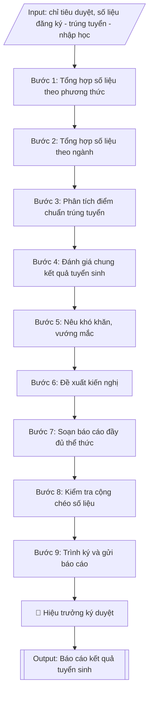

# Báo cáo kết quả tuyển sinh gửi Bộ GD&ĐT

## Định dạng và file đầu ra
Định dạng đầu ra có thể chọn theo sản phẩm/yêu cầu: .docx, .pdf. Đọc mục “Định dạng bổ sung” trong quy cách đầu ra trước khi chọn.

**Phải tạo file thực tế để tải xuống, không chỉ trả nội dung trong chat.** Định dạng mặc định của skill: **.docx**. Nếu có bảng số liệu nghiệp vụ yêu cầu file bảng tính riêng, tạo thêm Excel theo yêu cầu; không tự tạo file kiểm tra. Không chờ người dùng yêu cầu xuất file lần nữa. Ưu tiên định dạng người dùng chỉ định; đọc quy tắc xuất file tại references/quy-cach-dau-ra.md.

## Quy cách đầu ra và thông tin thiếu
Đọc [quy cách và cấu trúc sản phẩm](references/quy-cach-dau-ra.md) trước khi soạn/xuất. File giao chỉ gồm sản phẩm nghiệp vụ được yêu cầu; kiểm tra nội bộ không xuất kèm. Thiếu thông tin thì giữ nguyên trường/mục và chỗ điền theo mẫu gốc (dòng dấu chấm, dấu gạch hoặc ô trống); không tự điền dữ liệu mẫu, số 0, mã chờ xác minh hay dòng chờ ký. Mẫu chuyên ngành còn áp dụng được ưu tiên về cấu trúc, mã biểu và người ký. Bản đầy đủ: [quy tắc chung](references/quy-tac-chung.md).

## Kiểm soát áp dụng và phê duyệt
Trước khi chạy, xác định `ngay_ap_dung`, `loai_hinh_truong`, `quy_che_noi_bo`, `nguon_du_lieu`, `nguoi_kiem_duyet`; chỉ hỏi thông tin liên quan nghiệp vụ, không dùng giá trị giả định thay dữ liệu bắt buộc. Đối chiếu căn cứ pháp lý với văn bản gốc, hiệu lực, điều khoản áp dụng và chuyển tiếp. Bản đầy đủ: [quy tắc chung](references/quy-tac-chung.md).

Nếu có cập nhật pháp lý dưới đây, đọc [căn cứ và điều kiện áp dụng](references/phap-ly.md) trước khi làm. Quy trình dưới đây giữ nghiệp vụ từ bản gốc; mọi viện dẫn văn bản, mẫu biểu, điều khoản phải theo căn cứ đã chọn trong phap-ly.md, không theo văn bản cũ.

## Giới hạn và human gate
AI hỗ trợ chuẩn bị và đối chiếu; cán bộ phụ trách kiểm tra dữ liệu/căn cứ, người có thẩm quyền duyệt và ký. Không đánh dấu đã ký, đã duyệt, đã công bố khi chưa có chứng cứ. Dữ liệu sinh viên, sức khỏe, nhân sự, tài chính chỉ dùng theo mục đích và phân quyền, che thông tin định danh khi dùng ví dụ (Luật 91/2025/QH15, hiệu lực 01/01/2026); không tải dữ liệu lên dịch vụ ngoài khi chưa có quyền. Bản đầy đủ: [quy tắc chung](references/quy-tac-chung.md).

## Khi nào dùng
Sau khi kết thúc đợt tuyển sinh (đợt chính và các đợt bổ sung), khi Phòng Đào tạo cần tổng
hợp số liệu và soạn báo cáo kết quả tuyển sinh gửi Bộ Giáo dục và Đào tạo (Vụ Giáo dục Đại
học) và cơ quan chủ quản theo yêu cầu.

## Đầu vào (Input)
| Trường | Mô tả | Bắt buộc |
|---|---|---|
| `nam_tuyen_sinh` | Năm tuyển sinh báo cáo | Có |
| `chi_tieu_duyet` | Chỉ tiêu từng ngành theo đề án đã duyệt | Có |
| `so_lieu_dang_ky` | Số hồ sơ đăng ký theo từng phương thức, từng ngành | Có |
| `so_lieu_trung_tuyen` | Số thí sinh trúng tuyển theo từng phương thức, từng ngành | Có |
| `so_lieu_nhap_hoc` | Số thí sinh nhập học thực tế theo từng ngành | Có |
| `diem_chuan` | Điểm chuẩn (điểm trúng tuyển) từng ngành, từng phương thức | Có |
| `dot_bo_sung` | Có/không tổ chức xét tuyển bổ sung; số liệu đợt bổ sung | Không |
| `kho_khan` | Khó khăn, vướng mắc trong quá trình tuyển sinh | Không |
| `kien_nghi` | Kiến nghị, đề xuất với Bộ GD&ĐT | Không |
| `nguoi_ky` | Người ký báo cáo | Không (mặc định: Hiệu trưởng) |

## Quy trình
**Ràng buộc pháp lý khi thực hiện** (trích references/phap-ly.md; đối chiếu toàn văn và hiệu lực tại ngày nghiệp vụ):
- Thông tư 06/2026/TT-BGDĐT, hiệu lực 15/02/2026: Yêu cầu năm tuyển sinh, phương thức, trình độ và đề án đã duyệt. Đối chiếu quy chế 06/2026 và hướng dẫn năm tuyển sinh về điều kiện, quy đổi điểm, điểm cộng, thứ tự nguyện vọng; không giữ công thức cũ hoặc cộng hai lần chứng chỉ. Không tự đặt chỉ tiêu/ngưỡng khi chưa có quyết định và căn cứ.
- Trước Bước 1: chọn căn cứ theo đối tượng, loại hình trường và chuyển tiếp; lập bảng văn bản / điều khoản / lý do áp dụng / bằng chứng. Thiếu văn bản gốc hoặc điều khoản thì ghi nhận nội bộ [CẦN XÁC MINH] (không đưa vào file giao), để trống phần tương ứng, chưa kết luận tuân thủ.
- Các con số, thời hạn, số điều, số mức xếp loại, hệ số và mẫu biểu nêu trong các bước dưới đây được giữ từ quy trình gốc (trước cập nhật pháp lý); chỉ dùng khi đã đối chiếu đúng với căn cứ đã chọn, khác thì theo căn cứ. Danh sách điểm cần đối chiếu: docs/DIEM_CAN_DOI_CHIEU_PHAP_LY.md.

**Bước 1. Tổng hợp số liệu theo phương thức**
- Làm gì: với mỗi phương thức xét tuyển, thu thập từ `so_lieu_dang_ky` và `so_lieu_trung_tuyen`:
  số hồ sơ đăng ký, số trúng tuyển; tính tỷ lệ chọi (đăng ký/chỉ tiêu của phương thức) để đánh
  giá sức hút; kiểm tra số trúng tuyển mỗi phương thức không vượt chỉ tiêu phân bổ cho
  phương thức đó trong đề án.
- Dùng input: `nam_tuyen_sinh`, `so_lieu_dang_ky`, `so_lieu_trung_tuyen`, `chi_tieu_duyet`.
- Vai trò: Chuyên viên Phòng Đào tạo · AI hỗ trợ: tổng hợp số liệu, tính tỷ lệ chọi theo phương thức · ⏱ ~45 phút (ước tính)
- Lưu ý nghiệp vụ: số liệu phải lấy từ hệ thống xét tuyển chung của Bộ và sổ sách lưu tại
  Phòng Đào tạo — hai nguồn phải khớp nhau trước khi dùng; thí sinh trúng tuyển nhiều phương
  thức chỉ tính một lần ở phương thức thí sinh xác nhận nhập học.
- → Kết quả bước: bảng tổng hợp theo phương thức (hồ sơ đăng ký, trúng tuyển, tỷ lệ chọi).

**Bước 2. Tổng hợp số liệu theo ngành**
- Làm gì: với mỗi ngành trong `chi_tieu_duyet`, ghép 4 con số: chỉ tiêu duyệt – hồ sơ đăng ký –
  trúng tuyển – nhập học thực tế (từ `so_lieu_dang_ky`, `so_lieu_trung_tuyen`, `so_lieu_nhap_hoc`);
  tính tỷ lệ đạt chỉ tiêu (nhập học/chỉ tiêu × 100%); cộng tổng toàn trường.
- Dùng input: `chi_tieu_duyet`, `so_lieu_dang_ky`, `so_lieu_trung_tuyen`, `so_lieu_nhap_hoc`.
- Vai trò: Chuyên viên Phòng Đào tạo · AI hỗ trợ: lập bảng tổng hợp theo ngành, kiểm tra cộng chéo · ⏱ ~45 phút (ước tính)
- Lưu ý nghiệp vụ: kiểm tra cộng chéo ngay tại bước này — tổng trúng tuyển theo ngành phải
  bằng tổng trúng tuyển theo phương thức ở Bước 1; số nhập học không được lớn hơn số trúng
  tuyển; số liệu đợt bổ sung tách riêng, không cộng dồn vào đợt chính.
- → Kết quả bước: bảng tổng hợp theo ngành (chỉ tiêu, đăng ký, trúng tuyển, nhập học,
  tỷ lệ đạt chỉ tiêu) có dòng tổng cộng.

**Bước 3. Phân tích điểm chuẩn trúng tuyển**
- Làm gì: liệt kê `diem_chuan` của từng ngành theo từng phương thức vào bảng; so sánh với
  điểm chuẩn năm trước (tăng/giảm bao nhiêu điểm); nhận xét xu hướng: ngành "hot" (điểm
  chuẩn cao, tỷ lệ chọi lớn), ngành khó tuyển (không đủ chỉ tiêu đợt chính).
- Dùng input: `diem_chuan`, `so_lieu_dang_ky` (để tính tỷ lệ chọi minh họa).
- Vai trò: Chuyên viên Phòng Đào tạo · AI hỗ trợ: soạn bảng điểm chuẩn và nhận xét sơ bộ xu hướng · ⏱ ~30 phút (ước tính)
- Lưu ý nghiệp vụ: điểm chuẩn phải ghi đúng thang điểm của từng phương thức (thang 30 cho
  thi THPT, thang 10 cho học bạ, hệ số môn theo quy định); so sánh với năm trước phải dùng
  cùng phương thức, cùng cách tính — không so điểm thang 30 với thang 10.
- → Kết quả bước: bảng điểm chuẩn theo ngành × phương thức kèm nhận xét xu hướng.

**Bước 4. Đánh giá chung kết quả tuyển sinh**
- Làm gì: tổng hợp từ kết quả Bước 1–3: tổng tỷ lệ nhập học so với chỉ tiêu toàn trường;
  nêu những điểm mới trong công tác tuyển sinh năm nay (phương thức mới, công nghệ hỗ trợ,
  hoạt động tư vấn); so sánh một số chỉ số chính với năm trước (số hồ sơ, tỷ lệ đạt chỉ tiêu).
- Dùng input: kết quả tổng hợp Bước 1–3, `dot_bo_sung`, `nam_tuyen_sinh`.
- Vai trò: Chuyên viên Phòng Đào tạo · AI hỗ trợ: soạn dự thảo đánh giá theo số liệu tổng hợp · ⏱ ~30 phút (ước tính)
- Lưu ý nghiệp vụ: đánh giá phải dựa trên số liệu, tránh cảm tính; số liệu đợt bổ sung
  (`dot_bo_sung`) trình bày riêng thành một gạch đầu dòng, không hòa vào kết quả đợt chính.
- → Kết quả bước: phần đánh giá chung hoàn chỉnh (kết quả đạt được, điểm mới, so sánh
  với năm trước).

**Bước 5. Nêu khó khăn, vướng mắc**
- Làm gì: liệt kê các khó khăn thực tế từ `kho_khan`: ngành tuyển không đủ chỉ tiêu, tỷ lệ
  thí sinh ảo, sự cố hệ thống đăng ký, vướng mắc xác minh ưu tiên...; mỗi khó khăn ghi kèm
  số liệu hoặc ví dụ minh họa cụ thể.
- Dùng input: `kho_khan`.
- Vai trò: Chuyên viên Phòng Đào tạo · AI hỗ trợ: soạn mục khó khăn kèm số liệu, minh chứng · ⏱ ~20 phút (ước tính)
- Lưu ý nghiệp vụ: khó khăn phải là sự thật có minh chứng, không đổ lỗi chung chung; phân
  biệt khó khăn do khách quan (chính sách, hệ thống chung) và khó khăn nội tại (công tác tổ
  chức của trường) để kiến nghị đúng địa chỉ ở Bước 6.
- → Kết quả bước: mục khó khăn hoàn chỉnh, mỗi nội dung có số liệu/ví dụ minh họa.

**Bước 6. Đề xuất kiến nghị**
- Làm gì: từ các khó khăn ở Bước 5, viết kiến nghị cụ thể trong `kien_nghi` gửi Bộ GD&ĐT
  (điều chỉnh lịch xét tuyển, hoàn thiện phần mềm, hướng dẫn xử lý tình huống...); mỗi kiến
  nghị gắn với một khó khăn đã nêu và đề xuất giải pháp rõ ràng.
- Dùng input: `kien_nghi`, kết quả Bước 5.
- Vai trò: Chuyên viên Phòng Đào tạo · AI hỗ trợ: soạn dự thảo kiến nghị, kiểm tra tính khả thi và thẩm quyền · ⏱ ~20 phút (ước tính)
- Lưu ý nghiệp vụ: kiến nghị phải cụ thể, khả thi, đúng thẩm quyền của Bộ — tránh kiến nghị
  chung chung kiểu "đề nghị quan tâm hơn"; không kiến nghị nội dung thuộc thẩm quyền nội bộ
  của trường.
- → Kết quả bước: mục kiến nghị hoàn chỉnh, mỗi kiến nghị gắn với khó khăn và giải pháp.

**Bước 7. Soạn báo cáo đầy đủ thể thức**
- Làm gì: ráp kết quả Bước 1–6 thành văn bản hành chính hoàn chỉnh: tiêu đề (quốc hiệu, tiêu
  ngữ, số ký hiệu, địa điểm – ngày tháng), tên báo cáo, kính gửi Bộ GD&ĐT (Vụ Giáo dục Đại
  học), các mục I–VI, nơi nhận, chữ ký; phần số liệu trình bày dạng bảng, có dòng tổng cộng.
- Dùng input: toàn bộ các trường input và kết quả các bước trên, `nguoi_ky`.
- Vai trò: Chuyên viên Phòng Đào tạo · AI hỗ trợ: ráp văn bản đầy đủ thể thức hành chính, định dạng bảng biểu · ⏱ ~30 phút (ước tính)
- Lưu ý nghiệp vụ: thứ tự các mục trong báo cáo phải theo logic số liệu → phân tích →
  đánh giá → khó khăn → kiến nghị; bảng biểu đánh số thứ tự, ghi rõ đơn vị tính.
- → Kết quả bước: dự thảo báo cáo kết quả tuyển sinh đầy đủ thể thức văn bản hành chính.

**Bước 8. Kiểm tra cộng chéo số liệu**
- Làm gì: cộng chéo toàn bộ số liệu trong dự thảo: tổng trúng tuyển theo phương thức phải
  bằng tổng trúng tuyển theo ngành; tỷ lệ phần trăm tính đúng công thức; điểm chuẩn khớp
  với bảng Bước 3; rà chính tả, thể thức văn bản; lập checklist đánh dấu từng nội dung.
- Dùng input: toàn bộ các trường số liệu (đối chiếu chéo).
- Vai trò: Chuyên viên Phòng Đào tạo (người thứ hai kiểm tra độc lập) · AI hỗ trợ: tính lại sơ bộ, kiểm tra cộng chéo toàn bộ số liệu · ⏱ ~45 phút (ước tính)
- Lưu ý nghiệp vụ: đây là cổng chặn lỗi cuối — sai một con số trong báo cáo gửi Bộ là lỗi
  nghiêm trọng về tính chính xác; nên có người thứ hai kiểm tra độc lập bằng máy tính tay
  hoặc bảng tính riêng.
- → Kết quả bước: checklist kiểm tra số liệu có đánh dấu đạt từng nội dung; dự thảo đã
  sửa lỗi (nếu có).

**Bước 9. Trình ký và gửi báo cáo**
- Làm gì: trình `nguoi_ky` (mặc định Hiệu trưởng) ký báo cáo; gửi đúng thời hạn theo yêu cầu
  của Vụ Giáo dục Đại học; lưu bản ký vào hồ sơ Phòng Đào tạo.
- Dùng input: `nguoi_ky`, `nam_tuyen_sinh`.
- Vai trò: Hiệu trưởng ký báo cáo; chuyên viên Phòng Đào tạo gửi đúng thời hạn · AI hỗ trợ: chuẩn bị tài liệu trình ký · ⏱ ~20 phút (ước tính)
- Lưu ý nghiệp vụ: báo cáo phải gửi đúng thời hạn Bộ yêu cầu hằng năm; giữ biên nhận/bằng
  chứng đã gửi (email, công văn đi).
- → Kết quả bước: báo cáo kết quả tuyển sinh hoàn chỉnh đã ký, đã gửi Bộ GD&ĐT.

## Luồng quy trình (Workflow)

## Đầu ra
- Báo cáo kết quả tuyển sinh hoàn chỉnh (văn bản + bảng số liệu).
- Checklist kiểm tra số liệu.

File nghiệp vụ thực tế theo định dạng mặc định ở đầu skill hoặc định dạng người dùng yêu cầu, kèm liên kết tải trong phản hồi cuối.

Sản phẩm nghiệp vụ hoàn chỉnh theo [quy cách và cấu trúc](references/quy-cach-dau-ra.md), giữ các trường chưa có dữ liệu ở trạng thái trống. Không xuất kèm checklist/phụ lục kiểm tra đầu ra.

## Kiểm tra nội bộ trước khi giao
Các tiêu chí sau dùng để tự đối chiếu; không sao chép vào file xuất. Mục thiếu dữ liệu được để trống, không đánh dấu đã đạt hoặc đã duyệt.

- [ ] Đủ các phần và đúng bố cục theo cấu trúc tại references/quy-cach-dau-ra.md (không theo cấu trúc của bản gốc).
- [ ] Tổng trúng tuyển theo phương thức bằng tổng trúng tuyển theo ngành; tỷ lệ phần trăm tính đúng công thức.
- [ ] Số nhập học không lớn hơn số trúng tuyển; số liệu đợt bổ sung tách riêng, không cộng dồn vào đợt chính.
- [ ] Số liệu khớp với Input và với hệ thống xét tuyển chung của Bộ + sổ sách lưu tại Phòng Đào tạo.
- [ ] Điểm chuẩn ghi đúng thang điểm từng phương thức; so sánh với năm trước dùng cùng phương thức, cùng cách tính.
- [ ] Khó khăn có số liệu/ví dụ minh họa; kiến nghị cụ thể, khả thi, đúng thẩm quyền của Bộ.
- [ ] Không bịa đặt số liệu, điểm chuẩn, khó khăn hay kiến nghị.
- [ ] Đúng thể thức văn bản hành chính theo NĐ 30/2020/NĐ-CP; bảng biểu đánh số thứ tự, ghi rõ đơn vị tính.
- [ ] Căn cứ pháp lý đầy đủ, còn hiệu lực; báo cáo gửi đúng thời hạn Bộ yêu cầu.
- [ ] Đã qua Human gate: Hiệu trưởng đã ký duyệt.

## Căn cứ & lưu ý
- Căn cứ hiện hành: xem [căn cứ và điều kiện áp dụng](references/phap-ly.md); phải đối chiếu văn bản gốc, hiệu lực và chuyển tiếp tại ngày nghiệp vụ.
- Báo cáo gửi Bộ GD&ĐT đúng thời hạn theo yêu cầu của Vụ Giáo dục Đại học hằng năm.
- Số liệu trong báo cáo phải khớp với dữ liệu trên hệ thống xét tuyển chung của
  Bộ GD&ĐT và sổ sách lưu tại Phòng Đào tạo.
- Không dùng tên thật của trường/cá nhân khi mô phỏng.

## Tư liệu đối chiếu
Bản gốc trước cập nhật pháp lý (kèm ví dụ giả lập) lưu tại `references/quy-trinh-lich-su.md`, chỉ để đối chiếu hồ sơ lịch sử; không dùng căn cứ, mẫu hay số liệu trong đó làm chỉ dẫn hiện hành.

## Quản trị phiên bản
- Phiên bản gói `1.3.2` (cập nhật 2026-10-10); hồ sơ đầy đủ tại [references/version.json](references/version.json).
- Người phê duyệt nghiệp vụ: **chưa chỉ định**. Trạng thái: dự thảo nghiệp vụ; kiểm tra pháp lý trước thực thi. Ngày cập nhật không đồng nghĩa mọi văn bản đã được rà soát toàn văn.
- Giấy phép theo LICENSE của kho (bản quyền CES Global). Lịch sử thay đổi: CHANGELOG.md.
