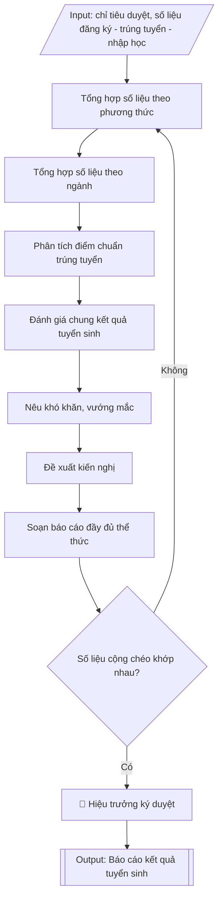

# Tư liệu lịch sử – không phải quy trình hiện hành

Nội dung từ phiên bản nguồn trước 1.1.0, giữ để đối chiếu dữ liệu đầu vào và thay đổi; căn cứ, điều kiện, mẫu và ví dụ có thể đã lỗi thời. Không dùng để thực hiện nghiệp vụ hiện tại.

## Khi nào dùng
Sau khi kết thúc đợt tuyển sinh (đợt chính và các đợt bổ sung), khi Phòng Đào tạo cần tổng
hợp số liệu và soạn báo cáo kết quả tuyển sinh gửi Bộ Giáo dục và Đào tạo (Vụ Giáo dục Đại
học) và cơ quan chủ quản theo yêu cầu.

## Đầu vào (Input)

| Trường | Mô tả | Bắt buộc |
|---|---|---|
| `nam_tuyen_sinh` | Năm tuyển sinh báo cáo | Có |
| `chi_tieu_duyet` | Chỉ tiêu từng ngành theo đề án đã duyệt | Có |
| `so_lieu_dang_ky` | Số hồ sơ đăng ký theo từng phương thức, từng ngành | Có |
| `so_lieu_trung_tuyen` | Số thí sinh trúng tuyển theo từng phương thức, từng ngành | Có |
| `so_lieu_nhap_hoc` | Số thí sinh nhập học thực tế theo từng ngành | Có |
| `diem_chuan` | Điểm chuẩn (điểm trúng tuyển) từng ngành, từng phương thức | Có |
| `dot_bo_sung` | Có/không tổ chức xét tuyển bổ sung; số liệu đợt bổ sung | Không |
| `kho_khan` | Khó khăn, vướng mắc trong quá trình tuyển sinh | Không |
| `kien_nghi` | Kiến nghị, đề xuất với Bộ GD&ĐT | Không |
| `nguoi_ky` | Người ký báo cáo | Không (mặc định: Hiệu trưởng) |

## Quy trình

**Bước 1. Tổng hợp số liệu theo phương thức**
- Làm gì: với mỗi phương thức xét tuyển, thu thập từ `so_lieu_dang_ky` và `so_lieu_trung_tuyen`:
  số hồ sơ đăng ký, số trúng tuyển; tính tỷ lệ chọi (đăng ký/chỉ tiêu của phương thức) để đánh
  giá sức hút; kiểm tra số trúng tuyển mỗi phương thức không vượt chỉ tiêu phân bổ cho
  phương thức đó trong đề án.
- Dùng input: `nam_tuyen_sinh`, `so_lieu_dang_ky`, `so_lieu_trung_tuyen`, `chi_tieu_duyet`.
- Vai trò: Chuyên viên Phòng Đào tạo · AI hỗ trợ: tổng hợp số liệu, tính tỷ lệ chọi theo phương thức · ⏱ ~45 phút (ước tính)
- Lưu ý nghiệp vụ: số liệu phải lấy từ hệ thống xét tuyển chung của Bộ và sổ sách lưu tại
  Phòng Đào tạo — hai nguồn phải khớp nhau trước khi dùng; thí sinh trúng tuyển nhiều phương
  thức chỉ tính một lần ở phương thức thí sinh xác nhận nhập học.
- → Kết quả bước: bảng tổng hợp theo phương thức (hồ sơ đăng ký, trúng tuyển, tỷ lệ chọi).

**Bước 2. Tổng hợp số liệu theo ngành**
- Làm gì: với mỗi ngành trong `chi_tieu_duyet`, ghép 4 con số: chỉ tiêu duyệt – hồ sơ đăng ký –
  trúng tuyển – nhập học thực tế (từ `so_lieu_dang_ky`, `so_lieu_trung_tuyen`, `so_lieu_nhap_hoc`);
  tính tỷ lệ đạt chỉ tiêu (nhập học/chỉ tiêu × 100%); cộng tổng toàn trường.
- Dùng input: `chi_tieu_duyet`, `so_lieu_dang_ky`, `so_lieu_trung_tuyen`, `so_lieu_nhap_hoc`.
- Vai trò: Chuyên viên Phòng Đào tạo · AI hỗ trợ: lập bảng tổng hợp theo ngành, kiểm tra cộng chéo · ⏱ ~45 phút (ước tính)
- Lưu ý nghiệp vụ: kiểm tra cộng chéo ngay tại bước này — tổng trúng tuyển theo ngành phải
  bằng tổng trúng tuyển theo phương thức ở Bước 1; số nhập học không được lớn hơn số trúng
  tuyển; số liệu đợt bổ sung tách riêng, không cộng dồn vào đợt chính.
- → Kết quả bước: bảng tổng hợp theo ngành (chỉ tiêu, đăng ký, trúng tuyển, nhập học,
  tỷ lệ đạt chỉ tiêu) có dòng tổng cộng.

**Bước 3. Phân tích điểm chuẩn trúng tuyển**
- Làm gì: liệt kê `diem_chuan` của từng ngành theo từng phương thức vào bảng; so sánh với
  điểm chuẩn năm trước (tăng/giảm bao nhiêu điểm); nhận xét xu hướng: ngành "hot" (điểm
  chuẩn cao, tỷ lệ chọi lớn), ngành khó tuyển (không đủ chỉ tiêu đợt chính).
- Dùng input: `diem_chuan`, `so_lieu_dang_ky` (để tính tỷ lệ chọi minh họa).
- Vai trò: Chuyên viên Phòng Đào tạo · AI hỗ trợ: soạn bảng điểm chuẩn và nhận xét sơ bộ xu hướng · ⏱ ~30 phút (ước tính)
- Lưu ý nghiệp vụ: điểm chuẩn phải ghi đúng thang điểm của từng phương thức (thang 30 cho
  thi THPT, thang 10 cho học bạ, hệ số môn theo quy định); so sánh với năm trước phải dùng
  cùng phương thức, cùng cách tính — không so điểm thang 30 với thang 10.
- → Kết quả bước: bảng điểm chuẩn theo ngành × phương thức kèm nhận xét xu hướng.

**Bước 4. Đánh giá chung kết quả tuyển sinh**
- Làm gì: tổng hợp từ kết quả Bước 1–3: tổng tỷ lệ nhập học so với chỉ tiêu toàn trường;
  nêu những điểm mới trong công tác tuyển sinh năm nay (phương thức mới, công nghệ hỗ trợ,
  hoạt động tư vấn); so sánh một số chỉ số chính với năm trước (số hồ sơ, tỷ lệ đạt chỉ tiêu).
- Dùng input: kết quả tổng hợp Bước 1–3, `dot_bo_sung`, `nam_tuyen_sinh`.
- Vai trò: Chuyên viên Phòng Đào tạo · AI hỗ trợ: soạn dự thảo đánh giá theo số liệu tổng hợp · ⏱ ~30 phút (ước tính)
- Lưu ý nghiệp vụ: đánh giá phải dựa trên số liệu, tránh cảm tính; số liệu đợt bổ sung
  (`dot_bo_sung`) trình bày riêng thành một gạch đầu dòng, không hòa vào kết quả đợt chính.
- → Kết quả bước: phần đánh giá chung hoàn chỉnh (kết quả đạt được, điểm mới, so sánh
  với năm trước).

**Bước 5. Nêu khó khăn, vướng mắc**
- Làm gì: liệt kê các khó khăn thực tế từ `kho_khan`: ngành tuyển không đủ chỉ tiêu, tỷ lệ
  thí sinh ảo, sự cố hệ thống đăng ký, vướng mắc xác minh ưu tiên...; mỗi khó khăn ghi kèm
  số liệu hoặc ví dụ minh họa cụ thể.
- Dùng input: `kho_khan`.
- Vai trò: Chuyên viên Phòng Đào tạo · AI hỗ trợ: soạn mục khó khăn kèm số liệu, minh chứng · ⏱ ~20 phút (ước tính)
- Lưu ý nghiệp vụ: khó khăn phải là sự thật có minh chứng, không đổ lỗi chung chung; phân
  biệt khó khăn do khách quan (chính sách, hệ thống chung) và khó khăn nội tại (công tác tổ
  chức của trường) để kiến nghị đúng địa chỉ ở Bước 6.
- → Kết quả bước: mục khó khăn hoàn chỉnh, mỗi nội dung có số liệu/ví dụ minh họa.

**Bước 6. Đề xuất kiến nghị**
- Làm gì: từ các khó khăn ở Bước 5, viết kiến nghị cụ thể trong `kien_nghi` gửi Bộ GD&ĐT
  (điều chỉnh lịch xét tuyển, hoàn thiện phần mềm, hướng dẫn xử lý tình huống...); mỗi kiến
  nghị gắn với một khó khăn đã nêu và đề xuất giải pháp rõ ràng.
- Dùng input: `kien_nghi`, kết quả Bước 5.
- Vai trò: Chuyên viên Phòng Đào tạo · AI hỗ trợ: soạn dự thảo kiến nghị, kiểm tra tính khả thi và thẩm quyền · ⏱ ~20 phút (ước tính)
- Lưu ý nghiệp vụ: kiến nghị phải cụ thể, khả thi, đúng thẩm quyền của Bộ — tránh kiến nghị
  chung chung kiểu "đề nghị quan tâm hơn"; không kiến nghị nội dung thuộc thẩm quyền nội bộ
  của trường.
- → Kết quả bước: mục kiến nghị hoàn chỉnh, mỗi kiến nghị gắn với khó khăn và giải pháp.

**Bước 7. Soạn báo cáo đầy đủ thể thức**
- Làm gì: ráp kết quả Bước 1–6 thành văn bản hành chính hoàn chỉnh: tiêu đề (quốc hiệu, tiêu
  ngữ, số ký hiệu, địa điểm – ngày tháng), tên báo cáo, kính gửi Bộ GD&ĐT (Vụ Giáo dục Đại
  học), các mục I–VI, nơi nhận, chữ ký; phần số liệu trình bày dạng bảng, có dòng tổng cộng.
- Dùng input: toàn bộ các trường input và kết quả các bước trên, `nguoi_ky`.
- Vai trò: Chuyên viên Phòng Đào tạo · AI hỗ trợ: ráp văn bản đầy đủ thể thức hành chính, định dạng bảng biểu · ⏱ ~30 phút (ước tính)
- Lưu ý nghiệp vụ: thứ tự các mục trong báo cáo phải theo logic số liệu → phân tích →
  đánh giá → khó khăn → kiến nghị; bảng biểu đánh số thứ tự, ghi rõ đơn vị tính.
- → Kết quả bước: dự thảo báo cáo kết quả tuyển sinh đầy đủ thể thức văn bản hành chính.

**Bước 8. Kiểm tra cộng chéo số liệu**
- Làm gì: cộng chéo toàn bộ số liệu trong dự thảo: tổng trúng tuyển theo phương thức phải
  bằng tổng trúng tuyển theo ngành; tỷ lệ phần trăm tính đúng công thức; điểm chuẩn khớp
  với bảng Bước 3; rà chính tả, thể thức văn bản; lập checklist đánh dấu từng nội dung.
- Dùng input: toàn bộ các trường số liệu (đối chiếu chéo).
- Vai trò: Chuyên viên Phòng Đào tạo (người thứ hai kiểm tra độc lập) · AI hỗ trợ: tính lại sơ bộ, kiểm tra cộng chéo toàn bộ số liệu · ⏱ ~45 phút (ước tính)
- Lưu ý nghiệp vụ: đây là cổng chặn lỗi cuối — sai một con số trong báo cáo gửi Bộ là lỗi
  nghiêm trọng về tính chính xác; nên có người thứ hai kiểm tra độc lập bằng máy tính tay
  hoặc bảng tính riêng.
- → Kết quả bước: checklist kiểm tra số liệu có đánh dấu đạt từng nội dung; dự thảo đã
  sửa lỗi (nếu có).

**Bước 9. Trình ký và gửi báo cáo**
- Làm gì: trình `nguoi_ky` (mặc định Hiệu trưởng) ký báo cáo; gửi đúng thời hạn theo yêu cầu
  của Vụ Giáo dục Đại học; lưu bản ký vào hồ sơ Phòng Đào tạo.
- Dùng input: `nguoi_ky`, `nam_tuyen_sinh`.
- Vai trò: Hiệu trưởng ký báo cáo; chuyên viên Phòng Đào tạo gửi đúng thời hạn · AI hỗ trợ: chuẩn bị tài liệu trình ký · ⏱ ~20 phút (ước tính)
- Lưu ý nghiệp vụ: báo cáo phải gửi đúng thời hạn Bộ yêu cầu hằng năm; giữ biên nhận/bằng
  chứng đã gửi (email, công văn đi).
- → Kết quả bước: báo cáo kết quả tuyển sinh hoàn chỉnh đã ký, đã gửi Bộ GD&ĐT.

## Luồng quy trình (Workflow)


## Đầu ra (Output)
- Báo cáo kết quả tuyển sinh hoàn chỉnh (văn bản + bảng số liệu).
- Checklist kiểm tra số liệu.

**Cấu trúc output chuẩn:** khung mẫu CỐ ĐỊNH của sản phẩm chính (Báo cáo kết quả tuyển sinh
gửi Bộ GD&ĐT), các phần bắt buộc theo đúng thứ tự xuất hiện:
1. Tiêu đề hành chính: quốc hiệu, tiêu ngữ, số ký hiệu, địa điểm – ngày tháng.
2. Tên văn bản: BÁO CÁO KẾT QUẢ TUYỂN SINH ĐẠI HỌC NĂM ...
3. Kính gửi: Bộ Giáo dục và Đào tạo (Vụ Giáo dục Đại học); đoạn mở đầu nêu căn cứ báo cáo.
4. Mục I – Kết quả tuyển sinh theo phương thức: bảng (phương thức, hồ sơ đăng ký, trúng
   tuyển, tỷ lệ chọi) kèm dòng tổng.
5. Mục II – Kết quả theo ngành đào tạo: bảng (ngành, chỉ tiêu, đăng ký, trúng tuyển, nhập
   học, tỷ lệ đạt chỉ tiêu) kèm dòng tổng.
6. Mục III – Điểm chuẩn trúng tuyển: bảng theo ngành × phương thức kèm nhận xét so sánh
   với năm trước.
7. Mục IV – Đánh giá chung: tỷ lệ nhập học/chỉ tiêu, điểm mới, số liệu đợt bổ sung (nếu có).
8. Mục V – Khó khăn: liệt kê có số liệu minh họa.
9. Mục VI – Kiến nghị: đề xuất cụ thể gửi Bộ GD&ĐT.
10. Nơi nhận, chữ ký người ký và con dấu.
11. Phụ lục kèm theo: Checklist kiểm tra số liệu (cộng chéo các bảng).

## Checklist nghiệm thu

- [ ] Đủ 11 phần theo "Cấu trúc output chuẩn": tiêu đề hành chính, tên báo cáo, kính gửi Bộ GD&ĐT (Vụ Giáo dục Đại học), Mục I kết quả theo phương thức, Mục II kết quả theo ngành, Mục III điểm chuẩn, Mục IV đánh giá chung, Mục V khó khăn, Mục VI kiến nghị, nơi nhận và chữ ký, phụ lục checklist cộng chéo.
- [ ] Tổng trúng tuyển theo phương thức bằng tổng trúng tuyển theo ngành; tỷ lệ phần trăm tính đúng công thức.
- [ ] Số nhập học không lớn hơn số trúng tuyển; số liệu đợt bổ sung tách riêng, không cộng dồn vào đợt chính.
- [ ] Số liệu khớp với Input và với hệ thống xét tuyển chung của Bộ + sổ sách lưu tại Phòng Đào tạo.
- [ ] Điểm chuẩn ghi đúng thang điểm từng phương thức; so sánh với năm trước dùng cùng phương thức, cùng cách tính.
- [ ] Khó khăn có số liệu/ví dụ minh họa; kiến nghị cụ thể, khả thi, đúng thẩm quyền của Bộ.
- [ ] Không bịa đặt số liệu, điểm chuẩn, khó khăn hay kiến nghị.
- [ ] Đúng thể thức văn bản hành chính theo NĐ 30/2020/NĐ-CP; bảng biểu đánh số thứ tự, ghi rõ đơn vị tính.
- [ ] Căn cứ pháp lý đầy đủ, còn hiệu lực; báo cáo gửi đúng thời hạn Bộ yêu cầu.
- [ ] Đã qua Human gate: Hiệu trưởng đã ký duyệt.

Tiêu chí đạt = tất cả các ô được đánh dấu.

## Ví dụ mô phỏng (dữ liệu giả lập)

> Tất cả tên trường, cá nhân, số liệu dưới đây đều là **giả lập**, không liên quan tổ chức/cá nhân có thật.

### Input mẫu

| Trường | Giá trị |
|---|---|
| `nam_tuyen_sinh` | 2026 |
| `chi_tieu_duyet` | CNTT: 500; QTKD: 450; Kế toán: 400; Ngôn ngữ Anh: 300; KTĐ-ĐT: 350 (tổng 2.000) |
| `so_lieu_dang_ky` | Thi THPT: 8.450 hồ sơ; Học bạ: 3.200; Tuyển thẳng: 98; ĐGNL: 1.150 |
| `so_lieu_trung_tuyen` | Thi THPT: 1.150; Học bạ: 480; Tuyển thẳng: 95; ĐGNL: 190 (tổng 1.915) |
| `so_lieu_nhap_hoc` | CNTT: 470; QTKD: 415; Kế toán: 360; Ngôn ngữ Anh: 255; KTĐ-ĐT: 300 (tổng 1.800) |
| `diem_chuan` | CNTT: 24,5 (THPT) / 8,2 (học bạ); QTKD: 23,0 / 7,9; Kế toán: 22,5 / 7,8; NNA: 23,5 (Anh ×2) / 8,0; KTĐ-ĐT: 21,0 / 7,5 |
| `dot_bo_sung` | Có xét tuyển bổ sung đợt 1: 120 chỉ tiêu còn lại, trúng tuyển 85, nhập học 72 |
| `kho_khan` | Tỷ lệ thí sinh ảo cao ở phương thức học bạ; một số ngành kỹ thuật tuyển chưa đủ chỉ tiêu đợt chính |
| `kien_nghi` | Đề nghị Bộ GD&ĐT xem xét kéo dài thời gian xác nhận nhập học trực tuyến |
| `nguoi_ky` | Hiệu trưởng |

### Output mẫu

```
TRƯỜNG ĐẠI HỌC A            CỘNG HÒA XÃ HỘI CHỦ NGHĨA VIỆT NAM
      Số: 210/BC-ĐHA-ĐT                       Độc lập – Tự do – Hạnh phúc
                                                 Thành phố C, ngày 20 tháng 10 năm 2026

                    BÁO CÁO KẾT QUẢ TUYỂN SINH ĐẠI HỌC NĂM 2026

Kính gửi: Bộ Giáo dục và Đào tạo (Vụ Giáo dục Đại học)

Thực hiện Quy chế tuyển sinh ban hành kèm theo Thông tư số 08/2022/TT-BGDĐT,
Trường Đại học A báo cáo kết quả tuyển sinh đại học hệ chính quy năm
2026 như sau:

I. KẾT QUẢ TUYỂN SINH THEO PHƯƠNG THỨC

| TT | Phương thức              | Hồ sơ đăng ký | Trúng tuyển | Tỷ lệ chọi |
|----|--------------------------|---------------|-------------|------------|
| 1  | Xét điểm thi TN THPT     | 8.450         | 1.150       | 7,3        |
| 2  | Xét học bạ THPT          | 3.200         | 480         | 6,7        |
| 3  | Xét tuyển thẳng          | 98            | 95          | 1,0        |
| 4  | Xét kết quả thi ĐGNL     | 1.150         | 190         | 6,1        |
|    | TỔNG                     | 12.898        | 1.915       |            |

II. KẾT QUẢ THEO NGÀNH ĐÀO TẠO

| TT | Ngành               | Chỉ tiêu | Đăng ký | Trúng tuyển | Nhập học | Tỷ lệ đạt CT |
|----|---------------------|----------|---------|-------------|----------|--------------|
| 1  | Công nghệ thông tin | 500      | 3.850   | 490         | 470      | 94,0%        |
| 2  | Quản trị kinh doanh | 450      | 3.120   | 435         | 415      | 92,2%        |
| 3  | Kế toán             | 400      | 2.340   | 390         | 360      | 90,0%        |
| 4  | Ngôn ngữ Anh        | 300      | 1.980   | 290         | 255      | 85,0%        |
| 5  | Kỹ thuật điện – điện tử | 350   | 1.608   | 310         | 300      | 85,7%        |
|    | TỔNG                | 2.000    | 12.898  | 1.915       | 1.800    | 90,0%        |

III. ĐIỂM CHUẨN TRÚNG TUYỂN

| Ngành               | Điểm chuẩn phương thức thi THPT | Điểm chuẩn phương thức học bạ |
|---------------------|----------------------------------|-------------------------------|
| Công nghệ thông tin | 24,5                             | 8,2                           |
| Quản trị kinh doanh | 23,0                             | 7,9                           |
| Kế toán             | 22,5                             | 7,8                           |
| Ngôn ngữ Anh        | 23,5 (môn Tiếng Anh hệ số 2)     | 8,0                           |
| Kỹ thuật điện – điện tử | 21,0                         | 7,5                           |

So với năm 2025, điểm chuẩn các ngành tăng bình quân 0,5 – 1,0 điểm; ngành Công
nghệ thông tin tiếp tục có điểm chuẩn cao nhất.

IV. ĐÁNH GIÁ CHUNG
- Tổng số thí sinh nhập học đạt 1.800/2.000 chỉ tiêu, tỷ lệ 90,0%.
- Nhà trường đã tổ chức 01 đợt xét tuyển bổ sung với 120 chỉ tiêu còn lại,
  trúng tuyển 85 thí sinh, nhập học 72 thí sinh.
- Công tác tư vấn tuyển sinh trực tuyến được đẩy mạnh, số hồ sơ đăng ký tăng
  12% so với năm 2025.

V. KHÓ KHĂN
- Tỷ lệ thí sinh ảo ở phương thức xét học bạ còn cao (khoảng 15% trúng tuyển
  không xác nhận nhập học).
- Một số ngành khối kỹ thuật tuyển chưa đủ chỉ tiêu trong đợt chính, phải tổ
  chức xét tuyển bổ sung.

VI. KIẾN NGHỊ
- Đề nghị Bộ Giáo dục và Đào tạo xem xét kéo dài thời gian xác nhận nhập học
  trực tuyến để giảm tỷ lệ thí sinh ảo.
- Đề nghị tiếp tục hoàn thiện phần mềm xét tuyển chung, bổ sung chức năng cảnh
  báo trùng nguyện vọng giữa các phương thức.

Nơi nhận:                                            HIỆU TRƯỞNG
- Như trên;
- Lưu: VT, ĐT.                                           [CHỜ KÝ]

                                                     PGS.TS. Trần Văn B
                                               (KT. Hiệu trưởng – Phó Hiệu trưởng
                                                phụ trách đào tạo ký thay)
```

### Checklist kiểm tra số liệu (output kèm theo)
- [x] Tổng trúng tuyển theo phương thức = tổng trúng tuyển theo ngành (1.915)
- [x] Tỷ lệ đạt chỉ tiêu tính đúng (nhập học / chỉ tiêu)
- [x] Điểm chuẩn liệt kê đủ ngành, đủ phương thức
- [x] Số liệu đợt bổ sung tách riêng, không cộng dồn vào đợt chính
- [x] Thể thức văn bản, chính tả đã rà soát

## Căn cứ & lưu ý
- Thông tư 08/2022/TT-BGDĐT về Quy chế tuyển sinh đại học; tuyển sinh cao đẳng
  ngành Giáo dục Mầm non.
- Báo cáo gửi Bộ GD&ĐT đúng thời hạn theo yêu cầu của Vụ Giáo dục Đại học hằng năm.
- Số liệu trong báo cáo phải khớp với dữ liệu trên hệ thống xét tuyển chung của
  Bộ GD&ĐT và sổ sách lưu tại Phòng Đào tạo.
- Không dùng tên thật của trường/cá nhân khi mô phỏng.
