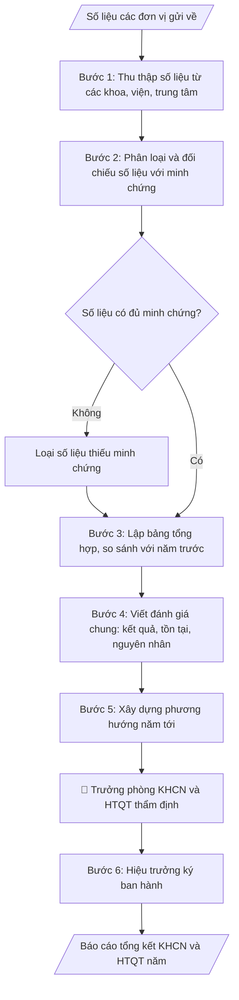

# Báo cáo KHCN & HTQT hằng năm

## Định dạng và file đầu ra
Định dạng đầu ra có thể chọn theo sản phẩm/yêu cầu: .docx, .pdf. Đọc mục “Định dạng bổ sung” trong quy cách đầu ra trước khi chọn.

**Phải tạo file thực tế để tải xuống, không chỉ trả nội dung trong chat.** Định dạng mặc định của skill: **.docx**. Nếu có bảng số liệu nghiệp vụ yêu cầu file bảng tính riêng, tạo thêm Excel theo yêu cầu; không tự tạo file kiểm tra. Không chờ người dùng yêu cầu xuất file lần nữa. Ưu tiên định dạng người dùng chỉ định; đọc quy tắc xuất file tại references/quy-cach-dau-ra.md.

## Quy cách đầu ra và thông tin thiếu
Đọc [quy cách và cấu trúc sản phẩm](references/quy-cach-dau-ra.md) trước khi soạn/xuất. File giao chỉ gồm sản phẩm nghiệp vụ được yêu cầu; kiểm tra nội bộ không xuất kèm. Thiếu thông tin thì giữ nguyên trường/mục và chỗ điền theo mẫu gốc (dòng dấu chấm, dấu gạch hoặc ô trống); không tự điền dữ liệu mẫu, số 0, mã chờ xác minh hay dòng chờ ký. Mẫu chuyên ngành còn áp dụng được ưu tiên về cấu trúc, mã biểu và người ký. Bản đầy đủ: [quy tắc chung](references/quy-tac-chung.md).

## Kiểm soát áp dụng và phê duyệt
Trước khi chạy, xác định `ngay_ap_dung`, `loai_hinh_truong`, `quy_che_noi_bo`, `nguon_du_lieu`, `nguoi_kiem_duyet`; chỉ hỏi thông tin liên quan nghiệp vụ, không dùng giá trị giả định thay dữ liệu bắt buộc. Đối chiếu căn cứ pháp lý với văn bản gốc, hiệu lực, điều khoản áp dụng và chuyển tiếp. Bản đầy đủ: [quy tắc chung](references/quy-tac-chung.md).

Nếu có cập nhật pháp lý dưới đây, đọc [căn cứ và điều kiện áp dụng](references/phap-ly.md) trước khi làm. Quy trình dưới đây giữ nghiệp vụ từ bản gốc; mọi viện dẫn văn bản, mẫu biểu, điều khoản phải theo căn cứ đã chọn trong phap-ly.md, không theo văn bản cũ.

## Giới hạn và human gate
AI hỗ trợ chuẩn bị và đối chiếu; cán bộ phụ trách kiểm tra dữ liệu/căn cứ, người có thẩm quyền duyệt và ký. Không đánh dấu đã ký, đã duyệt, đã công bố khi chưa có chứng cứ. Dữ liệu sinh viên, sức khỏe, nhân sự, tài chính chỉ dùng theo mục đích và phân quyền, che thông tin định danh khi dùng ví dụ (Luật 91/2025/QH15, hiệu lực 01/01/2026); không tải dữ liệu lên dịch vụ ngoài khi chưa có quyền. Bản đầy đủ: [quy tắc chung](references/quy-tac-chung.md).

## Khi nào dùng
Khi cần tổng kết công tác khoa học công nghệ (KHCN) và hợp tác quốc tế (HTQT) của
Trường trong một năm: báo cáo Bộ Giáo dục và Đào tạo, báo cáo tổng kết năm học của
Trường, phục vụ kiểm định chất lượng, hoặc báo cáo Hội đồng trường.

## Đầu vào (Input)
| Trường | Mô tả | Bắt buộc |
|---|---|---|
| `nam_bao_cao` | Năm báo cáo (ví dụ: 2026) | Có |
| `de_tai_cac_cap` | Đề tài NCKH: cấp Nhà nước / cấp Bộ / cấp tỉnh / cấp trường – tên đề tài, chủ nhiệm, kinh phí, tình trạng | Có |
| `cong_bo_khoa_hoc` | Bài báo: tạp chí quốc tế uy tín (WoS/Scopus), tạp chí trong nước, kỷ yếu hội thảo – số lượng theo đơn vị | Có |
| `so_huu_tri_tue` | Sáng chế, giải pháp hữu ích, nhãn hiệu, bản quyền (đã được cấp / đang xét) | Có |
| `hoi_thao` | Hội thảo khoa học đã tổ chức và tham dự: tên, cấp (quốc tế/quốc gia), số báo cáo | Có |
| `hop_tac_quoc_te` | MOU/MOA đã ký, đoàn ra, đoàn vào, chương trình trao đổi, chuyên gia nước ngoài | Có |
| `giai_thuong` | Giải thưởng KHCN các cấp (nếu có) | Không |
| `ton_tai_han_che` | Tồn tại, hạn chế và nguyên nhân | Có |
| `phuong_huong` | Phương hướng, nhiệm vụ năm tiếp theo | Có |
| `nguoi_ky` | Người ký báo cáo (thường là Hiệu trưởng hoặc Phó Hiệu trưởng phụ trách) | Có |

## Quy trình
**Ràng buộc pháp lý khi thực hiện** (trích references/phap-ly.md; đối chiếu toàn văn và hiệu lực tại ngày nghiệp vụ):
- Luật 93/2025/QH15; Nghị định 265/2025 và 267/2025, hiệu lực 14/10/2025: Yêu cầu cấp nhiệm vụ, nguồn kinh phí, tài trợ/đặt hàng, ngày phê duyệt, quy chế cơ quan tài trợ, phương thức khoán và quyền sử dụng kết quả. Đối chiếu NĐ 265 về tài chính và NĐ 267 về nhiệm vụ; không cố định thang xếp loại hoặc thu hồi toàn bộ kinh phí cho mọi đề tài. Nghiệm thu dựa hợp đồng và tiêu chí được duyệt, hội đồng có thẩm quyền xác nhận.
- Trước Bước 1: chọn căn cứ theo đối tượng, loại hình trường và chuyển tiếp; lập bảng văn bản / điều khoản / lý do áp dụng / bằng chứng. Thiếu văn bản gốc hoặc điều khoản thì ghi nhận nội bộ [CẦN XÁC MINH] (không đưa vào file giao), để trống phần tương ứng, chưa kết luận tuân thủ.

**Bước 1. Thu thập số liệu từ các đơn vị**
- Làm gì: gửi biểu mẫu thống kê KHCN & HTQT đến các khoa, viện, trung tâm theo đúng các nhóm input (đề tài các cấp, công bố khoa học, sở hữu trí tuệ, hội thảo, hợp tác quốc tế, giải thưởng); quy định thời hạn nộp; Phòng KHCN&HTQT làm đầu mối tổng hợp và đôn đốc đơn vị chưa nộp.
- Dùng input: `nam_bao_cao` (xác định kỳ báo cáo trên biểu mẫu).
- Vai trò: Chuyên viên Phòng KHCN và HTQT · AI hỗ trợ: soạn biểu mẫu thống kê · ⏱ ~1–2 giờ soạn biểu mẫu + 3–5 ngày chờ đơn vị nộp (ước tính)
- Lưu ý nghiệp vụ: biểu mẫu phải yêu cầu đơn vị gửi kèm minh chứng ngay từ đầu (bản sao bài báo, quyết định nghiệm thu, văn bằng SHTT, văn bản ký kết) — thu minh chứng sau sẽ kéo dài thời gian đối chiếu; chốt số liệu với các đơn vị trước 31/12 để kịp hạn nộp Bộ (thường trước 15/01 năm sau).
- → Kết quả bước: bộ số liệu thô các đơn vị (kèm minh chứng) + danh sách đơn vị chưa nộp đã đôn đốc.

**Bước 2. Phân loại và đối chiếu số liệu với minh chứng**
- Làm gì: phân loại đề tài theo cấp quản lý (Nhà nước/Bộ/tỉnh/trường) và tình trạng (đang thực hiện/đã nghiệm thu); phân loại công bố theo loại tạp chí (WoS/Scopus, trong nước có ISSN, kỷ yếu hội thảo); đối chiếu từng số liệu với minh chứng; loại khỏi báo cáo chính thức mọi số liệu không có minh chứng.
- Dùng input: `de_tai_cac_cap`, `cong_bo_khoa_hoc`, `so_huu_tri_tue`, `hoi_thao`, `hop_tac_quoc_te`, `giai_thuong`.
- Vai trò: Chuyên viên Phòng KHCN và HTQT · AI hỗ trợ: phân loại và đối chiếu số liệu · ⏱ ~1–2 ngày làm việc (ước tính)
- Lưu ý nghiệp vụ: bài báo "đã chấp nhận đăng" nhưng chưa xuất bản thì không được tính vào số công bố của năm; đề tài nghiệm thu phải có quyết định nghiệm thu, không tính theo báo cáo miệng của chủ nhiệm.
- → Kết quả bước: bảng phân loại số liệu đã xác thực + danh sách số liệu bị loại kèm lý do (thiếu minh chứng).

**Bước 3. Lập các bảng tổng hợp và so sánh**
- Làm gì: lập mỗi nhóm nội dung một bảng tổng hợp (đề tài theo cấp, công bố theo loại, SHTT, hội thảo tổ chức/tham dự, HTQT); tính tổng toàn trường; thêm cột so sánh với năm trước (tăng/giảm %) để đánh giá xu hướng.
- Dùng input: kết quả Bước 2 (số liệu đã xác thực).
- Vai trò: Chuyên viên Phòng KHCN và HTQT · AI hỗ trợ: lập bảng, tính tổng và so sánh tỷ lệ với năm trước · ⏱ ~1–2 giờ (ước tính)
- Lưu ý nghiệp vụ: tổng các dòng chi tiết phải khớp dòng tổng cộng — kiểm tra bằng công thức, không cộng tay; tỷ lệ % so sánh phải ghi rõ cơ sở (so với năm nào).
- → Kết quả bước: bộ bảng tổng hợp số liệu (mỗi nhóm một bảng, có tổng toàn trường và cột so sánh năm trước).

**Bước 4. Viết phần đánh giá chung**
- Làm gì: nêu kết quả nổi bật, định lượng bằng số liệu từ các bảng Bước 3 (ví dụ tăng % công bố, số MOU mới); sau đó phân tích tồn tại, hạn chế và nguyên nhân một cách thẳng thắn, cụ thể, lấy từ `ton_tai_han_che`.
- Dùng input: `ton_tai_han_che`, kết quả Bước 3.
- Vai trò: Chuyên viên Phòng KHCN và HTQT · AI hỗ trợ: soạn dự thảo đánh giá · ⏱ ~1–2 giờ (ước tính)
- Lưu ý nghiệp vụ: tồn tại phải gắn với số liệu (ví dụ "tỷ lệ bài báo quốc tế/giảng viên còn thấp: 0,35 bài/người/năm"), không viết chung chung kiểu "còn một số hạn chế"; nguyên nhân phải chỉ rõ là chủ quan hay khách quan.
- → Kết quả bước: dự thảo phần II. Đánh giá chung (1. Kết quả nổi bật; 2. Tồn tại, hạn chế và nguyên nhân).

**Bước 5. Xây dựng phương hướng năm tới**
- Làm gì: cụ thể hóa `phuong_huong` thành các nhiệm vụ có chỉ tiêu định lượng (ví dụ: 50 bài báo quốc tế, 02 đề tài cấp Bộ mới, 03 MOU mới, 01 hội thảo quốc tế), mỗi nhiệm vụ gắn với đơn vị thực hiện.
- Dùng input: `phuong_huong`.
- Vai trò: Trưởng Phòng KHCN và HTQT · AI hỗ trợ: soạn dự thảo phương hướng · ⏱ ~1–2 giờ (ước tính)
- Lưu ý nghiệp vụ: chỉ tiêu phải khả thi dựa trên xu hướng số liệu Bước 3 (không đặt tăng 50% khi năm trước chỉ tăng 10%); nhiệm vụ nào không gắn đơn vị thực hiện thì coi như chưa hoàn thiện.
- → Kết quả bước: dự thảo phần III. Phương hướng (nhiệm vụ – chỉ tiêu định lượng – đơn vị thực hiện).

**Bước 6. Hoàn thiện, thẩm định và ban hành báo cáo**
- Làm gì: ráp báo cáo đầy đủ theo bố cục I. Kết quả (theo bảng) → II. Đánh giá chung → III. Phương hướng; Trưởng phòng KHCN&HTQT thẩm định; `nguoi_ky` (Hiệu trưởng hoặc Phó Hiệu trưởng phụ trách) ký ban hành; tách bộ bảng tổng hợp ra file Excel nếu cần nộp Bộ GD&ĐT.
- Dùng input: `nguoi_ky`, kết quả các Bước 3–5.
- Vai trò: Trưởng Phòng KHCN và HTQT · AI hỗ trợ: chuẩn bị hồ sơ trình ký, nhắc lịch và theo dõi tiến độ · ⏱ ~1 ngày làm việc (ước tính)
- Lưu ý nghiệp vụ: số liệu trong phần đánh giá và phương hướng phải khớp với bảng tổng hợp — kiểm tra chéo lần cuối trước khi trình ký; báo cáo năm nộp Bộ GD&ĐT thường trước ngày 15/01 năm sau.
- → Kết quả bước: báo cáo tổng kết KHCN & HTQT năm hoàn chỉnh đã ký ban hành + bộ bảng tổng hợp (file Excel tách riêng nếu cần).

## Luồng quy trình (Workflow)

## Đầu ra
- Báo cáo tổng kết KHCN & HTQT năm hoàn chỉnh (văn bản + các bảng số liệu).
- Bộ bảng tổng hợp số liệu (có thể tách file Excel để nộp Bộ GD&ĐT).

**Cấu trúc output chuẩn:** khung mẫu cố định của sản phẩm chính — Báo cáo tổng kết công tác
KHCN & HTQT năm, các phần bắt buộc theo đúng thứ tự:
1. Tiêu đề cơ quan ban hành + tên báo cáo + năm báo cáo.
2. I. Kết quả thực hiện — các tiểu mục theo nhóm, mỗi nhóm một bảng tổng hợp:
   (1) Đề tài NCKH các cấp (cấp quản lý – tổng số – đang thực hiện – đã nghiệm thu – kinh phí);
   (2) Công bố khoa học (loại công bố – số lượng – so với năm trước);
   (3) Sở hữu trí tuệ; (4) Hội thảo khoa học (tổ chức / tham dự); (5) Hợp tác quốc tế;
   (6) Giải thưởng KHCN (nếu có).
3. II. Đánh giá chung: 1. Kết quả nổi bật (định lượng bằng số liệu); 2. Tồn tại, hạn chế và nguyên nhân.
4. III. Phương hướng năm tiếp theo: nhiệm vụ cụ thể, chỉ tiêu định lượng, đơn vị thực hiện.
5. Địa danh, ngày tháng năm; chức danh, chữ ký, họ tên người ký.
6. Bộ bảng tổng hợp số liệu (kèm theo; có thể tách file Excel để nộp Bộ GD&ĐT).

File nghiệp vụ thực tế theo định dạng mặc định ở đầu skill hoặc định dạng người dùng yêu cầu, kèm liên kết tải trong phản hồi cuối.

Sản phẩm nghiệp vụ hoàn chỉnh theo [quy cách và cấu trúc](references/quy-cach-dau-ra.md), giữ các trường chưa có dữ liệu ở trạng thái trống. Không xuất kèm checklist/phụ lục kiểm tra đầu ra.

## Kiểm tra nội bộ trước khi giao
Các tiêu chí sau dùng để tự đối chiếu; không sao chép vào file xuất. Mục thiếu dữ liệu được để trống, không đánh dấu đã đạt hoặc đã duyệt.

- [ ] Đủ các phần theo "Cấu trúc output chuẩn": tiêu đề báo cáo; I. Kết quả thực hiện với đủ 6 nhóm bảng (đề tài các cấp, công bố khoa học, sở hữu trí tuệ, hội thảo, hợp tác quốc tế, giải thưởng); II. Đánh giá chung; III. Phương hướng; khối chữ ký; bộ bảng tổng hợp kèm theo.
- [ ] Số liệu trong output khớp với Input đã cho (đề tài, công bố, SHTT, hội thảo, HTQT, giải thưởng).
- [ ] Tổng các dòng chi tiết khớp dòng tổng cộng trong mỗi bảng; số liệu trong phần đánh giá và phương hướng khớp với bảng tổng hợp.
- [ ] Mọi số liệu đều có minh chứng (quyết định nghiệm thu, bài báo, văn bằng SHTT, văn bản ký kết); không đưa số liệu thiếu minh chứng vào báo cáo chính thức.
- [ ] Không bịa đặt số liệu, tỷ lệ tăng/giảm, tên đối tác, văn bằng, giải thưởng.
- [ ] Bài báo "đã chấp nhận đăng nhưng chưa xuất bản" không được tính vào số công bố của năm.
- [ ] Căn cứ pháp lý đầy đủ, còn hiệu lực; chốt số liệu trước 31/12 và nộp Bộ trước 15/01 năm sau.
- [ ] Đã qua Human gate: Trưởng phòng KHCN&HTQT thẩm định; Hiệu trưởng hoặc Phó Hiệu trưởng phụ trách ký ban hành.

## Căn cứ & lưu ý
- Thông tư quy định về thống kê, báo cáo hoạt động KHCN của Bộ GD&ĐT; Quy chế quản lý
  hoạt động KHCN của Trường Đại học A.
- Số liệu báo cáo phải có minh chứng (quyết định nghiệm thu, bản sao bài báo, văn bằng
  SHTT, văn bản ký kết); số liệu không có minh chứng không được đưa vào báo cáo chính thức.
- Thời hạn nộp báo cáo năm cho Bộ GD&ĐT thường trước ngày 15/01 năm sau – cần chốt số
  liệu với các đơn vị trước 31/12.
- Không dùng tên thật của trường/cá nhân khi mô phỏng.

## Tư liệu đối chiếu
Bản gốc trước cập nhật pháp lý (kèm ví dụ giả lập) lưu tại `references/quy-trinh-lich-su.md`, chỉ để đối chiếu hồ sơ lịch sử; không dùng căn cứ, mẫu hay số liệu trong đó làm chỉ dẫn hiện hành.

## Quản trị phiên bản
- Phiên bản gói `1.3.2` (cập nhật 2026-10-10); hồ sơ đầy đủ tại [references/version.json](references/version.json).
- Người phê duyệt nghiệp vụ: **chưa chỉ định**. Trạng thái: dự thảo nghiệp vụ; kiểm tra pháp lý trước thực thi. Ngày cập nhật không đồng nghĩa mọi văn bản đã được rà soát toàn văn.
- Giấy phép theo LICENSE của kho (bản quyền CES Global). Lịch sử thay đổi: CHANGELOG.md.
