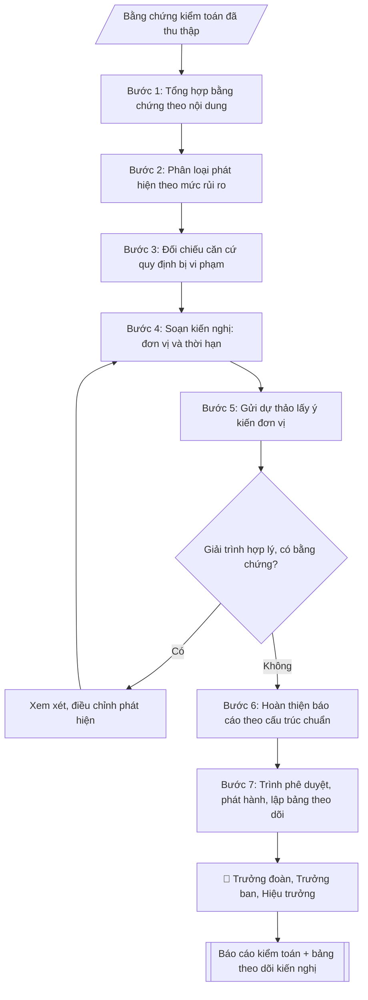

# Soạn báo cáo kiểm toán nội bộ

## Quy cách đầu ra và thông tin thiếu

Đọc [quy cách và cấu trúc sản phẩm](references/quy-cach-dau-ra.md) trước khi soạn/xuất. File giao chỉ gồm văn bản hoặc sản phẩm nghiệp vụ được yêu cầu; kiểm tra nội bộ không xuất kèm. Thiếu thông tin giữ nguyên trường/mục và chỗ điền theo mẫu gốc (dòng dấu chấm, dấu gạch hoặc ô trống); không tự điền dữ liệu mẫu, số 0, mã chờ xác minh hoặc dòng chờ ký. Mẫu chuyên ngành còn áp dụng được ưu tiên về cấu trúc, mã biểu và người ký. Các trường “bắt buộc” là điều kiện hoàn thiện hồ sơ, không ngăn việc soạn bản có chỗ chừa để điền. Mọi chỉ dẫn “để trống” trong skill được hiểu là không điền dữ liệu và giữ cách chừa chỗ của mẫu gốc, không phải xóa dấu chấm của mẫu.


## Kiểm soát áp dụng và phê duyệt

Trước khi chạy quy trình, xác định `ngay_ap_dung`, `loai_hinh_truong`, `quy_che_noi_bo`, `nguon_du_lieu` và `nguoi_kiem_duyet`. Chỉ yêu cầu thông tin có liên quan đến nghiệp vụ; không dùng giá trị giả định thay dữ liệu bắt buộc. Đối chiếu nội bộ hồ sơ có yếu tố pháp lý với văn bản gốc, hiệu lực, điều khoản áp dụng và chuyển tiếp; không tự đính kèm bảng kiểm tra vào file giao.

## Giới hạn và human gate

AI hỗ trợ chuẩn bị và đối chiếu. Cán bộ phụ trách kiểm tra dữ liệu/căn cứ, người có thẩm quyền duyệt và ký. Văn bản soạn chưa được coi là đã ban hành; không tự chèn nhãn trạng thái kiểm duyệt vào file giao; không đánh dấu đã ký, đã duyệt hoặc đã công bố nếu chưa có chứng cứ. Dữ liệu sinh viên, sức khỏe, nhân sự và tài chính phải hạn chế theo mục đích, phân quyền và che thông tin định danh khi dùng ví dụ. Không tải dữ liệu lên dịch vụ ngoài khi chưa có quyền. Kiểm tra Luật 91/2025/QH15 về bảo vệ dữ liệu cá nhân (hiệu lực 01/01/2026) và quy định áp dụng trước xử lý/chia sẻ dữ liệu cá nhân.

## Khi nào dùng
Sau khi kết thúc mỗi cuộc kiểm toán nội bộ, đoàn kiểm toán cần lập báo cáo kết quả để trình
Hiệu trưởng/Hội đồng trường và gửi đơn vị được kiểm toán thực hiện kiến nghị.

## Đầu vào (Input)

| Trường | Mô tả | Bắt buộc |
|---|---|---|
| `ten_cuoc_kiem_toan` | Tên cuộc kiểm toán | Có |
| `don_vi_duoc_kiem_toan` | Đơn vị được kiểm toán | Có |
| `thoi_ky_kiem_toan` | Thời kỳ kiểm toán (VD: 01/2026–12/2026) | Có |
| `phat_hien` | Danh sách phát hiện: nội dung, bằng chứng, mức độ rủi ro (cao/trung bình/thấp) | Có |
| `danh_gia_rui_ro` | Đánh giá rủi ro tổng thể của cuộc kiểm toán | Không |
| `kien_nghi` | Kiến nghị khắc phục: nội dung, đơn vị thực hiện, thời hạn | Có |
| `y_kien_don_vi` | Ý kiến giải trình của đơn vị được kiểm toán | Không |

## Quy trình

**Bước 1. Tổng hợp bằng chứng theo nội dung kiểm toán**
- Làm gì: hệ thống hóa bằng chứng đã thu thập (biên bản kiểm tra, bảng đối chiếu, chứng từ, ảnh...) theo từng nội dung kiểm toán; đánh dấu bằng chứng còn thiếu hoặc chưa đủ độ tin cậy.
- Dùng input: `ten_cuoc_kiem_toan`, `thoi_ky_kiem_toan`, `phat_hien`.
- Vai trò: Chuyên viên Phòng Thanh tra – Pháp chế · AI hỗ trợ: tổng hợp, chuẩn hóa dữ liệu, đối chiếu tự động, cảnh báo sai lệch · ⏱ ~30–60 phút (ước tính)
- Lưu ý nghiệp vụ: chỉ phát hiện nào có bằng chứng đầy đủ mới đưa vào báo cáo; bằng chứng thiếu thì ghi vào phần hạn chế, không suy diễn.
- → Kết quả bước: Bảng bằng chứng theo nội dung kiểm toán.

**Bước 2. Phân loại phát hiện theo mức độ rủi ro**
- Làm gì: với từng phát hiện: xếp mức rủi ro cao / trung bình / thấp dựa trên ảnh hưởng tài chính, mức độ vi phạm tuân thủ, khả năng tái diễn; viết mô tả phát hiện gắn bằng chứng và số hiệu chứng cứ cụ thể.
- Dùng input: `phat_hien`, `danh_gia_rui_ro`.
- Vai trò: Chuyên viên Phòng Thanh tra – Pháp chế · AI hỗ trợ: soạn dự thảo · ⏱ ~30–60 phút (ước tính)
- Lưu ý nghiệp vụ: tiêu chí xếp mức phải nhất quán trong toàn báo cáo; phát hiện rủi ro cao phải được mô tả chi tiết nhất.
- → Kết quả bước: Danh sách phát hiện đã phân loại rủi ro kèm bằng chứng.

**Bước 3. Đối chiếu căn cứ quy định bị vi phạm**
- Làm gì: với từng phát hiện, gắn quy định/quy chế cụ thể bị vi phạm hoặc chưa tuân thủ (tên văn bản, điều/khoản); kiểm tra văn bản viện dẫn còn hiệu lực.
- Dùng input: `phat_hien`.
- Vai trò: Chuyên viên Phòng Thanh tra – Pháp chế · AI hỗ trợ: đối chiếu tự động, cảnh báo sai lệch · ⏱ ~1–2 giờ (ước tính)
- Lưu ý nghiệp vụ: không gắn căn cứ chung chung ("vi phạm quy định"); mỗi phát hiện phải có căn cứ cụ thể, trích dẫn được.
- → Kết quả bước: Bảng phát hiện – căn cứ quy định bị vi phạm.

**Bước 4. Soạn kiến nghị khắc phục**
- Làm gì: với từng phát hiện, viết kiến nghị: nội dung khắc phục cụ thể, đơn vị chịu trách nhiệm, thời hạn hoàn thành; kiến nghị phải khả thi và đo được.
- Dùng input: `kien_nghi`.
- Vai trò: Chuyên viên Phòng Thanh tra – Pháp chế · AI hỗ trợ: soạn dự thảo · ⏱ ~30–60 phút (ước tính)
- Lưu ý nghiệp vụ: một phát hiện có thể có nhiều kiến nghị (khắc phục trước mắt + phòng ngừa lâu dài); thời hạn phải thực tế, phù hợp năng lực đơn vị.
- → Kết quả bước: Danh sách kiến nghị (nội dung – đơn vị thực hiện – thời hạn).

**Bước 5. Lấy ý kiến giải trình của đơn vị được kiểm toán**
- Làm gì: gửi dự thảo phát hiện + kiến nghị cho đơn vị được kiểm toán để giải trình; xem xét giải trình: nếu hợp lý và có bằng chứng thì điều chỉnh phát hiện; nếu không thì giữ nguyên và ghi nhận ý kiến đơn vị vào báo cáo.
- Dùng input: `y_kien_don_vi` (nếu có; nếu chưa có thì thực hiện bước này để thu thập), `don_vi_duoc_kiem_toan`.
- Vai trò: Chuyên viên Phòng Thanh tra – Pháp chế · AI hỗ trợ: soạn dự thảo, chuẩn bị hồ sơ trình đầy đủ · ⏱ ~0,5–1 ngày làm việc (ước tính)
- Lưu ý nghiệp vụ: không để đơn vị gây áp lực thay đổi phát hiện khi không có bằng chứng mới; mọi điều chỉnh phải ghi rõ lý do.
- → Kết quả bước: Ý kiến giải trình đã được xem xét + dự thảo đã điều chỉnh (nếu có).

**Bước 6. Hoàn thiện báo cáo theo cấu trúc chuẩn**
- Làm gì: lắp các bán thành phẩm vào cấu trúc: phần mở đầu (căn cứ thực hiện) → I. Tóm tắt → II. Phát hiện chi tiết → III. Đánh giá rủi ro → IV. Kiến nghị → V. Theo dõi thực hiện → phụ lục bằng chứng; kiểm tra nhất quán số liệu, tên đơn vị, thời kỳ giữa các phần.
- Dùng input: `ten_cuoc_kiem_toan`, `don_vi_duoc_kiem_toan`, `thoi_ky_kiem_toan`, `danh_gia_rui_ro`.
- Vai trò: Chuyên viên Phòng Thanh tra – Pháp chế · AI hỗ trợ: đối chiếu tự động, cảnh báo sai lệch · ⏱ ~1–2 giờ (ước tính)
- Lưu ý nghiệp vụ: phần tóm tắt viết sau cùng, phải phản ánh đúng nội dung chi tiết; số lượng phát hiện ở các phần phải khớp nhau.
- → Kết quả bước: Dự thảo Báo cáo kiểm toán nội bộ.

**Bước 7. Phát hành và lập bảng theo dõi kiến nghị**
- Làm gì: trình phê duyệt theo thứ tự Trưởng đoàn → Trưởng ban → Hiệu trưởng; gửi báo cáo đến đơn vị được kiểm toán và đơn vị liên quan; lập bảng theo dõi thực hiện kiến nghị (kiến nghị – đơn vị – thời hạn – trạng thái) để đôn đốc.
- Dùng input: (kết quả Bước 6).
- Vai trò: Trưởng đoàn kiểm toán (trình phê duyệt theo phân cấp) · AI hỗ trợ: lập bảng biểu, định dạng, chuẩn bị hồ sơ trình đầy đủ · ⏱ ~30–60 phút (ước tính)
- Lưu ý nghiệp vụ: không phát tán báo cáo khi chưa được phê duyệt; bảo mật thông tin kiểm toán; theo dõi đến khi kiến nghị hoàn thành.
- → Kết quả bước: Báo cáo kiểm toán đã phát hành + bảng theo dõi kiến nghị.

## Luồng quy trình (Workflow)


```

## Đầu ra

Sản phẩm nghiệp vụ hoàn chỉnh theo [quy cách và cấu trúc](references/quy-cach-dau-ra.md), giữ các trường chưa có dữ liệu ở trạng thái trống. Không xuất kèm checklist/phụ lục kiểm tra đầu ra.

## Kiểm tra nội bộ trước khi giao

- [ ] Bố cục khớp mẫu áp dụng và cấu trúc tại references/quy-cach-dau-ra.md.
- [ ] Có đầy đủ sản phẩm: Báo cáo kiểm toán nội bộ hoàn chỉnh (markdown)
- [ ] Có đầy đủ sản phẩm: Bảng theo dõi thực hiện kiến nghị (kiến nghị – đơn vị – thời hạn – trạng thái)
- [ ] Mọi số liệu, tên, ngày tháng trong output khớp với Input đã cung cấp (không thêm bớt, không suy đoán)
- [ ] Không bịa đặt số liệu, minh chứng, trích dẫn hay căn cứ
- [ ] Đúng thể thức, định dạng văn bản theo quy định hiện hành
- [ ] Căn cứ pháp lý nêu đầy đủ, còn hiệu lực tại thời điểm lập
- [ ] Đã qua Human gate: người có thẩm quyền đã kiểm tra/ký duyệt trước khi phát hành
- [ ] Chỉ phát hiện nào có bằng chứng đầy đủ mới đưa vào báo cáo
- [ ] Tiêu chí xếp mức phải nhất quán trong toàn báo cáo

> Tiêu chí đạt: tất cả các ô đều được đánh dấu.

## Human gate (người kiểm duyệt)
- Trưởng đoàn kiểm toán chịu trách nhiệm về tính chính xác của phát hiện và bằng chứng.
- Trưởng Ban Thanh tra, Pháp chế và Kiểm toán nội bộ soát xét trước khi trình.
- Hiệu trưởng/Hội đồng trường tiếp nhận báo cáo; đơn vị được kiểm toán xác nhận ý kiến giải trình.

## Giới hạn (guardrails)
- AI không tự kết luận sai phạm khi chưa có đầy đủ bằng chứng kiểm toán.
- AI không suy đoán động cơ cá nhân của người liên quan.
- AI không phát tán báo cáo khi chưa được phê duyệt; bảo mật thông tin kiểm toán.

## Căn cứ & lưu ý
- Quy chế kiểm toán nội bộ của trường (văn bản nội bộ).
- Nghị định 05/2019/NĐ-CP về kiểm toán nội bộ (áp dụng tham khảo nguyên tắc).
- Không dùng tên thật của trường/cá nhân khi mô phỏng.

## Quản trị phiên bản

- Phiên bản gói: `1.2.1`; ngày cập nhật: `2026-10-10`.
- Kho nguồn: https://github.com/phamtruong91/university-skills-framework
- Người duy trì trên GitHub: `phamtruong91` (Phạm Văn Trường). Người phê duyệt nghiệp vụ: **chưa chỉ định**.
- Commit nguồn trước cập nhật: `346719e6b0318ed034b4b016703f79733aa575e7`. Commit chứa phiên bản này xem bằng `git log -1 -- skills/bao-cao-kiem-toan-noi-bo`; không tự gán SHA chưa tạo.
- Giấy phép: theo LICENSE của kho; bản quyền CES Global.
- Lịch sử 1.1.0: bổ sung metadata giao diện, kiểm soát áp dụng, quản trị phiên bản.
- Trạng thái: dự thảo nghiệp vụ; kiểm tra pháp lý trước thực thi. Ngày cập nhật không đồng nghĩa mọi văn bản đã được rà soát toàn văn.
