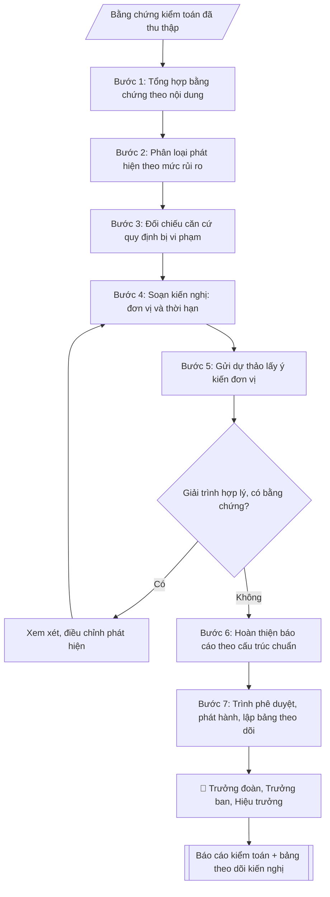

# Skill: Soạn báo cáo kiểm toán nội bộ

## Khi nào dùng
Sau khi kết thúc mỗi cuộc kiểm toán nội bộ, đoàn kiểm toán cần lập báo cáo kết quả để trình
Hiệu trưởng/Hội đồng trường và gửi đơn vị được kiểm toán thực hiện kiến nghị.

## Đầu vào (Input)

| Trường | Mô tả | Bắt buộc |
|---|---|---|
| `ten_cuoc_kiem_toan` | Tên cuộc kiểm toán | Có |
| `don_vi_duoc_kiem_toan` | Đơn vị được kiểm toán | Có |
| `thoi_ky_kiem_toan` | Thời kỳ kiểm toán (VD: 01/2026–12/2026) | Có |
| `phat_hien` | Danh sách phát hiện: nội dung, bằng chứng, mức độ rủi ro (cao/trung bình/thấp) | Có |
| `danh_gia_rui_ro` | Đánh giá rủi ro tổng thể của cuộc kiểm toán | Không |
| `kien_nghi` | Kiến nghị khắc phục: nội dung, đơn vị thực hiện, thời hạn | Có |
| `y_kien_don_vi` | Ý kiến giải trình của đơn vị được kiểm toán | Không |

## Quy trình

**Bước 1. Tổng hợp bằng chứng theo nội dung kiểm toán**
- Làm gì: hệ thống hóa bằng chứng đã thu thập (biên bản kiểm tra, bảng đối chiếu, chứng từ, ảnh...) theo từng nội dung kiểm toán; đánh dấu bằng chứng còn thiếu hoặc chưa đủ độ tin cậy.
- Dùng input: `ten_cuoc_kiem_toan`, `thoi_ky_kiem_toan`, `phat_hien`.
- Vai trò: Chuyên viên Phòng Thanh tra – Pháp chế · AI hỗ trợ: tổng hợp, chuẩn hóa dữ liệu, đối chiếu tự động, cảnh báo sai lệch · ⏱ ~30–60 phút (ước tính)
- Lưu ý nghiệp vụ: chỉ phát hiện nào có bằng chứng đầy đủ mới đưa vào báo cáo; bằng chứng thiếu thì ghi vào phần hạn chế, không suy diễn.
- → Kết quả bước: Bảng bằng chứng theo nội dung kiểm toán.

**Bước 2. Phân loại phát hiện theo mức độ rủi ro**
- Làm gì: với từng phát hiện: xếp mức rủi ro cao / trung bình / thấp dựa trên ảnh hưởng tài chính, mức độ vi phạm tuân thủ, khả năng tái diễn; viết mô tả phát hiện gắn bằng chứng và số hiệu chứng cứ cụ thể.
- Dùng input: `phat_hien`, `danh_gia_rui_ro`.
- Vai trò: Chuyên viên Phòng Thanh tra – Pháp chế · AI hỗ trợ: soạn dự thảo · ⏱ ~30–60 phút (ước tính)
- Lưu ý nghiệp vụ: tiêu chí xếp mức phải nhất quán trong toàn báo cáo; phát hiện rủi ro cao phải được mô tả chi tiết nhất.
- → Kết quả bước: Danh sách phát hiện đã phân loại rủi ro kèm bằng chứng.

**Bước 3. Đối chiếu căn cứ quy định bị vi phạm**
- Làm gì: với từng phát hiện, gắn quy định/quy chế cụ thể bị vi phạm hoặc chưa tuân thủ (tên văn bản, điều/khoản); kiểm tra văn bản viện dẫn còn hiệu lực.
- Dùng input: `phat_hien`.
- Vai trò: Chuyên viên Phòng Thanh tra – Pháp chế · AI hỗ trợ: đối chiếu tự động, cảnh báo sai lệch · ⏱ ~1–2 giờ (ước tính)
- Lưu ý nghiệp vụ: không gắn căn cứ chung chung ("vi phạm quy định"); mỗi phát hiện phải có căn cứ cụ thể, trích dẫn được.
- → Kết quả bước: Bảng phát hiện – căn cứ quy định bị vi phạm.

**Bước 4. Soạn kiến nghị khắc phục**
- Làm gì: với từng phát hiện, viết kiến nghị: nội dung khắc phục cụ thể, đơn vị chịu trách nhiệm, thời hạn hoàn thành; kiến nghị phải khả thi và đo được.
- Dùng input: `kien_nghi`.
- Vai trò: Chuyên viên Phòng Thanh tra – Pháp chế · AI hỗ trợ: soạn dự thảo · ⏱ ~30–60 phút (ước tính)
- Lưu ý nghiệp vụ: một phát hiện có thể có nhiều kiến nghị (khắc phục trước mắt + phòng ngừa lâu dài); thời hạn phải thực tế, phù hợp năng lực đơn vị.
- → Kết quả bước: Danh sách kiến nghị (nội dung – đơn vị thực hiện – thời hạn).

**Bước 5. Lấy ý kiến giải trình của đơn vị được kiểm toán**
- Làm gì: gửi dự thảo phát hiện + kiến nghị cho đơn vị được kiểm toán để giải trình; xem xét giải trình: nếu hợp lý và có bằng chứng thì điều chỉnh phát hiện; nếu không thì giữ nguyên và ghi nhận ý kiến đơn vị vào báo cáo.
- Dùng input: `y_kien_don_vi` (nếu có; nếu chưa có thì thực hiện bước này để thu thập), `don_vi_duoc_kiem_toan`.
- Vai trò: Chuyên viên Phòng Thanh tra – Pháp chế · AI hỗ trợ: soạn dự thảo, chuẩn bị hồ sơ trình đầy đủ · ⏱ ~0,5–1 ngày làm việc (ước tính)
- Lưu ý nghiệp vụ: không để đơn vị gây áp lực thay đổi phát hiện khi không có bằng chứng mới; mọi điều chỉnh phải ghi rõ lý do.
- → Kết quả bước: Ý kiến giải trình đã được xem xét + dự thảo đã điều chỉnh (nếu có).

**Bước 6. Hoàn thiện báo cáo theo cấu trúc chuẩn**
- Làm gì: lắp các bán thành phẩm vào cấu trúc: phần mở đầu (căn cứ thực hiện) → I. Tóm tắt → II. Phát hiện chi tiết → III. Đánh giá rủi ro → IV. Kiến nghị → V. Theo dõi thực hiện → phụ lục bằng chứng; kiểm tra nhất quán số liệu, tên đơn vị, thời kỳ giữa các phần.
- Dùng input: `ten_cuoc_kiem_toan`, `don_vi_duoc_kiem_toan`, `thoi_ky_kiem_toan`, `danh_gia_rui_ro`.
- Vai trò: Chuyên viên Phòng Thanh tra – Pháp chế · AI hỗ trợ: đối chiếu tự động, cảnh báo sai lệch · ⏱ ~1–2 giờ (ước tính)
- Lưu ý nghiệp vụ: phần tóm tắt viết sau cùng, phải phản ánh đúng nội dung chi tiết; số lượng phát hiện ở các phần phải khớp nhau.
- → Kết quả bước: Dự thảo Báo cáo kiểm toán nội bộ.

**Bước 7. Phát hành và lập bảng theo dõi kiến nghị**
- Làm gì: trình phê duyệt theo thứ tự Trưởng đoàn → Trưởng ban → Hiệu trưởng; gửi báo cáo đến đơn vị được kiểm toán và đơn vị liên quan; lập bảng theo dõi thực hiện kiến nghị (kiến nghị – đơn vị – thời hạn – trạng thái) để đôn đốc.
- Dùng input: (kết quả Bước 6).
- Vai trò: Trưởng đoàn kiểm toán (trình phê duyệt theo phân cấp) · AI hỗ trợ: lập bảng biểu, định dạng, chuẩn bị hồ sơ trình đầy đủ · ⏱ ~30–60 phút (ước tính)
- Lưu ý nghiệp vụ: không phát tán báo cáo khi chưa được phê duyệt; bảo mật thông tin kiểm toán; theo dõi đến khi kiến nghị hoàn thành.
- → Kết quả bước: Báo cáo kiểm toán đã phát hành + bảng theo dõi kiến nghị.

## Luồng quy trình (Workflow)


```

## Đầu ra (Output)
- Báo cáo kiểm toán nội bộ hoàn chỉnh (markdown).
- Bảng theo dõi thực hiện kiến nghị (kiến nghị – đơn vị – thời hạn – trạng thái).

**Cấu trúc output chuẩn:** Báo cáo kiểm toán nội bộ gồm các phần bắt buộc theo đúng thứ tự sau:
1. Phần đầu: quốc hiệu – tiêu ngữ, tên ban, số/ký hiệu, địa danh – ngày tháng, tên văn bản "BÁO CÁO" + trích yếu (kết quả kiểm toán ...); dòng "Kính gửi: ...".
2. Phần mở đầu: căn cứ thực hiện (kế hoạch kiểm toán năm), phạm vi cuộc kiểm toán.
3. I. Tóm tắt (số phát hiện theo mức rủi ro, thái độ của đơn vị được kiểm toán).
4. II. Phát hiện chi tiết (từng phát hiện: mức rủi ro, mô tả, bằng chứng, căn cứ vi phạm).
5. III. Đánh giá rủi ro (đánh giá tổng thể của cuộc kiểm toán).
6. IV. Kiến nghị (từng kiến nghị: nội dung, đơn vị thực hiện, thời hạn).
7. V. Theo dõi thực hiện.
8. Phần cuối: nơi nhận, chữ ký Trưởng đoàn kiểm toán.
9. Phụ lục: bảng theo dõi thực hiện kiến nghị.

## Checklist nghiệm thu

- [ ] Đủ các phần theo "Cấu trúc output chuẩn": Phần đầu; Phần mở đầu; I. Tóm tắt (số phát hiện theo mức rủi ro,…; II. Phát hiện chi tiết (từng phát hiện; III. Đánh giá rủi ro (đánh giá tổng thể của…; IV. Kiến nghị (từng kiến nghị; …
- [ ] Có đầy đủ sản phẩm: Báo cáo kiểm toán nội bộ hoàn chỉnh (markdown)
- [ ] Có đầy đủ sản phẩm: Bảng theo dõi thực hiện kiến nghị (kiến nghị – đơn vị – thời hạn – trạng thái)
- [ ] Mọi số liệu, tên, ngày tháng trong output khớp với Input đã cung cấp (không thêm bớt, không suy đoán)
- [ ] Không bịa đặt số liệu, minh chứng, trích dẫn hay căn cứ
- [ ] Đúng thể thức, định dạng văn bản theo quy định hiện hành
- [ ] Căn cứ pháp lý nêu đầy đủ, còn hiệu lực tại thời điểm lập
- [ ] Đã qua Human gate: người có thẩm quyền đã kiểm tra/ký duyệt trước khi phát hành
- [ ] Chỉ phát hiện nào có bằng chứng đầy đủ mới đưa vào báo cáo
- [ ] Tiêu chí xếp mức phải nhất quán trong toàn báo cáo

> Tiêu chí đạt: tất cả các ô đều được đánh dấu.

## Ví dụ mô phỏng (dữ liệu giả lập)

> Tất cả tên trường, cá nhân, số liệu dưới đây đều là **giả lập**, không liên quan tổ chức/cá nhân có thật.

### Input mẫu

| Trường | Giá trị |
|---|---|
| `ten_cuoc_kiem_toan` | Kiểm toán thu, quản lý và sử dụng học phí năm 2026 |
| `don_vi_duoc_kiem_toan` | Phòng Tài chính – Kế toán |
| `thoi_ky_kiem_toan` | 01/2026–12/2026 |
| `phat_hien` | 1. 03 khoản thu học phí chưa xuất biên lai kịp thời (bằng chứng: biên bản kiểm tra ngày 10/3/2027) — rủi ro trung bình. 2. Chênh lệch 12,5 triệu đồng giữa sổ thu và chứng từ nộp ngân sách chưa được giải trình (bằng chứng: bảng đối chiếu số 04) — rủi ro cao. |
| `kien_nghi` | 1. Hoàn thiện xuất biên lai cho 03 khoản thu trong 15 ngày (Phòng TCKT). 2. Đối chiếu, giải trình chênh lệch 12,5 triệu đồng trong 30 ngày (Phòng TCKT). 3. Rà soát quy trình thu – nộp, bổ sung bước đối chiếu hằng tháng (Phòng TCKT, hoàn thành Quý II/2027). |
| `y_kien_don_vi` | Phòng TCKT thống nhất với phát hiện, cam kết khắc phục đúng hạn. |

### Output mẫu

```
TRƯỜNG ĐẠI HỌC A            CỘNG HÒA XÃ HỘI CHỦ NGHĨA VIỆT NAM
BAN THANH TRA, PHÁP CHẾ                                Độc lập – Tự do – Hạnh phúc
VÀ KIỂM TOÁN NỘI BỘ
      Số: 08/BC-ĐHA-TTPCKTNB
                                                 Thành phố C, ngày 28 tháng 3 năm 2027

                    BÁO CÁO
     Kết quả kiểm toán thu, quản lý và sử dụng học phí năm 2026

Kính gửi: Hiệu trưởng Trường Đại học A

Thực hiện Kế hoạch kiểm toán nội bộ năm 2027, Đoàn kiểm toán đã tiến hành kiểm toán
công tác thu, quản lý và sử dụng học phí năm 2026 tại Phòng Tài chính – Kế toán.
Kết quả như sau:

I. TÓM TẮT
Đoàn kiểm toán ghi nhận 02 phát hiện, trong đó 01 phát hiện rủi ro cao và
01 phát hiện rủi ro trung bình. Đơn vị được kiểm toán thống nhất với các phát hiện.

II. PHÁT HIỆN CHI TIẾT
1. [Rủi ro trung bình] 03 khoản thu học phí chưa được xuất biên lai kịp thời
   (Bằng chứng: Biên bản kiểm tra ngày 10/3/2027). Căn cứ: Quy trình thu học phí
   của Trường quy định xuất biên lai trong ngày thu.
2. [Rủi ro cao] Chênh lệch 12,5 triệu đồng giữa sổ thu và chứng từ nộp ngân sách
   chưa được giải trình (Bằng chứng: Bảng đối chiếu số 04 ngày 12/3/2027).

III. ĐÁNH GIÁ RỦI RO
Tồn tại rủi ro thất thoát và sai sót trong khâu đối chiếu thu – nộp; cần chấn chỉnh
kịp thời để bảo đảm tính đầy đủ, chính xác của công tác thu học phí.

IV. KIẾN NGHỊ
1. Phòng Tài chính – Kế toán hoàn thiện xuất biên lai cho 03 khoản thu trong
   15 ngày kể từ ngày nhận báo cáo.
2. Phòng Tài chính – Kế toán đối chiếu, giải trình chênh lệch 12,5 triệu đồng
   trong 30 ngày; báo cáo kết quả về Ban.
3. Phòng Tài chính – Kế toán rà soát, bổ sung bước đối chiếu thu – nộp hằng tháng
   vào quy trình, hoàn thành trong Quý II/2027.

V. THEO DÕI THỰC HIỆN
Ban sẽ theo dõi việc thực hiện các kiến nghị và báo cáo Hiệu trưởng khi hết thời hạn.

Nơi nhận:                                          TRƯỞNG ĐOÀN KIỂM TOÁN
- Hiệu trưởng (để b/c);                                   (đã ký)
- Phòng TCKT (để thực hiện);
- Lưu: VT, TTPCKTNB.
                                                     Ông Trần Văn D

Phụ lục: Bảng theo dõi thực hiện kiến nghị
| STT | Kiến nghị | Đơn vị thực hiện | Thời hạn | Trạng thái |
|-----|-----------|------------------|----------|------------|
| 1 | Hoàn thiện biên lai 03 khoản thu | Phòng TCKT | 15 ngày | Chưa thực hiện |
| 2 | Giải trình chênh lệch 12,5 triệu đồng | Phòng TCKT | 30 ngày | Chưa thực hiện |
| 3 | Bổ sung bước đối chiếu hằng tháng | Phòng TCKT | Quý II/2027 | Chưa thực hiện |
```

## Human gate (người kiểm duyệt)
- Trưởng đoàn kiểm toán chịu trách nhiệm về tính chính xác của phát hiện và bằng chứng.
- Trưởng Ban Thanh tra, Pháp chế và Kiểm toán nội bộ soát xét trước khi trình.
- Hiệu trưởng/Hội đồng trường tiếp nhận báo cáo; đơn vị được kiểm toán xác nhận ý kiến giải trình.

## Giới hạn (guardrails)
- AI không tự kết luận sai phạm khi chưa có đầy đủ bằng chứng kiểm toán.
- AI không suy đoán động cơ cá nhân của người liên quan.
- AI không phát tán báo cáo khi chưa được phê duyệt; bảo mật thông tin kiểm toán.

## Căn cứ & lưu ý
- Quy chế kiểm toán nội bộ của trường (văn bản nội bộ).
- Nghị định 05/2019/NĐ-CP về kiểm toán nội bộ (áp dụng tham khảo nguyên tắc).
- Không dùng tên thật của trường/cá nhân khi mô phỏng.
