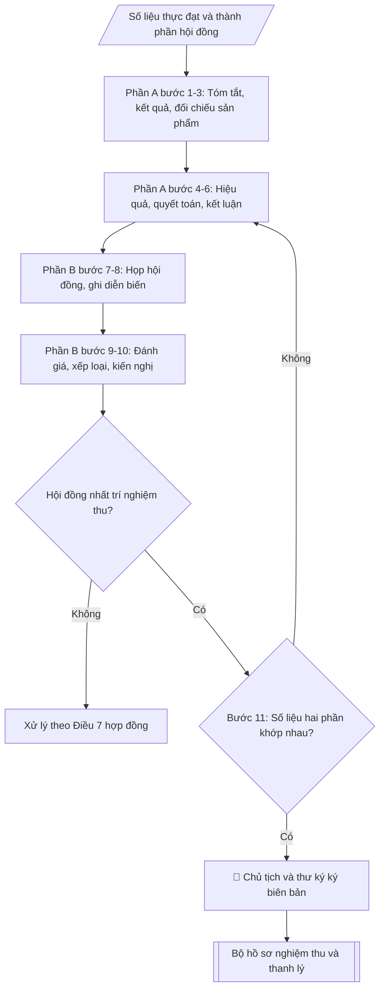

# Skill: Báo cáo nghiệm thu đề tài NCKH (tổng kết + biên bản hội đồng)

## Khi nào dùng
Khi đề tài đã hết thời gian thực hiện (hoặc hoàn thành sớm): chủ nhiệm soạn Báo cáo
tổng kết; Phòng KHCN soạn Biên bản nghiệm thu để Hội đồng họp đánh giá, xếp loại.
Bộ hồ sơ này là căn cứ để thanh lý hợp đồng và quyết toán kinh phí.

## Đầu vào (Input)

| Trường | Mô tả | Bắt buộc |
|---|---|---|
| `ten_de_tai` | Tên đầy đủ của đề tài | Có |
| `ma_so_de_tai` | Mã số đề tài | Có |
| `chu_nhiem` | Họ tên, học hàm/học vị chủ nhiệm | Có |
| `co_quan_chu_tri` | Đơn vị chủ trì | Có |
| `thoi_gian_thuc_hien` | Từ ngày/tháng/năm đến ngày/tháng/năm (thực tế) | Có |
| `tom_tat` | Tóm tắt: đặt vấn đề, mục tiêu, phương pháp (ngắn gọn) | Có |
| `ket_qua_chi_tiet` | Kết quả theo từng nội dung/mục tiêu đã đăng ký | Có |
| `san_pham_doi_chieu` | Bảng đối chiếu sản phẩm đăng ký vs sản phẩm thực đạt | Có |
| `hieu_qua` | Hiệu quả khoa học, kinh tế – xã hội, đào tạo | Có |
| `quyet_toan_kinh_phi` | Bảng đối chiếu dự toán được duyệt vs thực chi theo khoản mục | Có |
| `ket_luan_kien_nghi` | Kết luận, kiến nghị và hướng phát triển tiếp | Không |
| `hoi_dong` | Thành phần hội đồng: Chủ tịch, 02 phản biện, ủy viên, thư ký (họ tên, học hàm/học vị, đơn vị) | Có |
| `ngay_hop` | Ngày họp nghiệm thu | Có |
| `dia_diem` | Địa điểm họp | Có |
| `dien_bien` | Diễn biến chính: trình bày, nhận xét phản biện, thảo luận | Có |
| `ket_qua_danh_gia` | Kết quả bỏ phiếu/xếp loại của từng thành viên và kết luận chung (Xuất sắc/Đạt/Không đạt) | Có |
| `kien_nghi_hoi_dong` | Kiến nghị của hội đồng (chỉnh sửa, bổ sung trước thanh lý) | Không |

## Quy trình

**PHẦN A – Báo cáo tổng kết đề tài** (do chủ nhiệm soạn):

**Bước 1. Viết tóm tắt đề tài**
- Làm gì: từ `tom_tat` viết phần tóm tắt: đặt vấn đề (3–5 dòng), mục tiêu, phương pháp chính — người đọc nắm được toàn bộ đề tài trong 1 trang; điền khối thông tin đề tài: `ten_de_tai`, `ma_so_de_tai`, `chu_nhiem`, `co_quan_chu_tri`, `thoi_gian_thuc_hien` (thực tế).
- Dùng input: `tom_tat`, `ten_de_tai`, `ma_so_de_tai`, `chu_nhiem`, `co_quan_chu_tri`, `thoi_gian_thuc_hien`.
- Vai trò: Chủ nhiệm đề tài · AI hỗ trợ: soạn dự thảo tóm tắt · ⏱ ~30–45 phút (ước tính)
- Lưu ý nghiệp vụ: tóm tắt là phần hội đồng đọc đầu tiên — phải nêu được "làm gì, bằng cách nào, được gì"; tránh sao chép nguyên mục tính cấp thiết của thuyết minh.
- → Kết quả bước: dự thảo mục I – Tóm tắt + khối thông tin đề tài.

**Bước 2. Trình bày kết quả chi tiết**
- Làm gì: từ `ket_qua_chi_tiet` trình bày theo từng nội dung/mục tiêu đã đăng ký trong thuyết minh; mỗi nội dung nêu: đã làm gì, kết quả cụ thể (số liệu), so sánh với mục tiêu đăng ký (đạt/vượt/chưa đạt).
- Dùng input: `ket_qua_chi_tiet`.
- Vai trò: Chủ nhiệm đề tài · AI hỗ trợ: trình bày theo từng nội dung/mục tiêu · ⏱ ~1–1,5 giờ (ước tính)
- Lưu ý nghiệp vụ: mọi con số phải có minh chứng (phụ lục số liệu, biên bản thử nghiệm); nội dung nào chưa đạt mục tiêu phải giải trình trung thực — hội đồng phát hiện dễ dàng khi đối chiếu với thuyết minh.
- → Kết quả bước: dự thảo mục II – Kết quả chi tiết (có đối chiếu mục tiêu đăng ký).

**Bước 3. Lập bảng đối chiếu sản phẩm**
- Làm gì: từ `san_pham_doi_chieu` lập bảng 2 cột "Đăng ký" vs "Thực đạt" cho từng sản phẩm (bài báo, phần mềm, đào tạo...); ghi kết luận tỷ lệ hoàn thành; giải trình nếu có chênh lệch.
- Dùng input: `san_pham_doi_chieu`.
- Vai trò: Chủ nhiệm đề tài · AI hỗ trợ: lập bảng đối chiếu Đăng ký vs Thực đạt và tính tỷ lệ hoàn thành · ⏱ ~20–30 phút (ước tính)
- Lưu ý nghiệp vụ: sản phẩm "thực đạt" phải có minh chứng kèm theo (bài báo: bản in/quyết định đăng; phần mềm: biên bản chạy thử; đào tạo: quyết định công nhận tốt nghiệp).
- → Kết quả bước: bảng đối chiếu sản phẩm đăng ký/thực đạt.

**Bước 4. Đánh giá hiệu quả**
- Làm gì: từ `hieu_qua` viết 3 nhóm: hiệu quả khoa học (đóng góp mới so với tình trạng đã biết); hiệu quả kinh tế – xã hội (khả năng ứng dụng, đối tượng thụ hưởng, số liệu minh họa); hiệu quả đào tạo (thạc sĩ, sinh viên NCKH).
- Dùng input: `hieu_qua`.
- Vai trò: Chủ nhiệm đề tài · AI hỗ trợ: soạn dự thảo 3 nhóm hiệu quả · ⏱ ~30–45 phút (ước tính)
- Lưu ý nghiệp vụ: hiệu quả kinh tế – xã hội cần số liệu cụ thể (VD: giảm 12% chi phí khảo sát), tránh khẩu hiệu chung chung ("góp phần phát triển kinh tế").
- → Kết quả bước: dự thảo mục IV – Hiệu quả (3 nhóm).

**Bước 5. Lập bảng quyết toán kinh phí**
- Làm gì: từ `quyet_toan_kinh_phi` lập bảng đối chiếu dự toán được duyệt vs thực chi theo từng khoản mục; kiểm tra tổng thực chi không vượt tổng dự toán; giải trình các chênh lệch lớn.
- Dùng input: `quyet_toan_kinh_phi`.
- Vai trò: Chủ nhiệm đề tài · AI hỗ trợ: lập bảng đối chiếu và tính chênh lệch · ⏱ ~20–30 phút (ước tính)
- Lưu ý nghiệp vụ: số liệu ở đây phải khớp với hồ sơ quyết toán đã nộp Phòng Tài chính — hội đồng sẽ đối chiếu chéo hai nguồn.
- → Kết quả bước: bảng quyết toán kinh phí (dự toán – thực chi – chênh lệch theo khoản mục).

**Bước 6. Viết kết luận, kiến nghị và hoàn thiện Phần A**
- Làm gì: từ `ket_luan_kien_nghi` viết mức độ hoàn thành mục tiêu, kiến nghị ứng dụng kết quả, hướng nghiên cứu tiếp theo; ráp các kết quả bước 1–5 thành báo cáo tổng kết hoàn chỉnh (I. Tóm tắt → VI. Kết luận và kiến nghị); kiểm tra chính tả, số liệu; trình chủ nhiệm ký.
- Dùng input: `ket_luan_kien_nghi`, kết quả bước 1–5, `chu_nhiem`.
- Vai trò: Chủ nhiệm đề tài · AI hỗ trợ: ráp Phần A hoàn chỉnh · ⏱ ~30–45 phút (ước tính)
- Lưu ý nghiệp vụ: kiến nghị phải khả thi và có địa chỉ thụ hưởng cụ thể (đơn vị nào áp dụng), không kiến nghị chung chung.
- → Kết quả bước: Phần A – Báo cáo tổng kết hoàn chỉnh (đã ký).

**PHẦN B – Biên bản nghiệm thu của Hội đồng** (do thư ký hội đồng ghi):

**Bước 7. Ghi thông tin hội đồng và kiểm tra điều kiện họp**
- Làm gì: ghi quyết định thành lập hội đồng; điền thành phần từ `hoi_dong` (Chủ tịch, 02 phản biện, ủy viên, thư ký — họ tên, học hàm/học vị, đơn vị); ghi `ngay_hop`, `dia_diem`, hình thức họp; kiểm tra tỷ lệ thành viên có mặt — phải đủ theo quy chế mới được tiến hành họp.
- Dùng input: `hoi_dong`, `ngay_hop`, `dia_diem`.
- Vai trò: Thư ký Hội đồng · AI hỗ trợ: chuẩn bị hồ sơ trình ký, nhắc lịch và theo dõi tiến độ · ⏱ ~30 phút (ước tính)
- Lưu ý nghiệp vụ: thành viên vắng mặt không đủ tỷ lệ → cuộc họp không hợp lệ, biên bản vô giá trị; kiểm tra tư cách thành viên (không thuộc nhóm thực hiện đề tài, đủ tiêu chuẩn theo quy chế).
- → Kết quả bước: phần 1 biên bản (thông tin hội đồng, thời gian, địa điểm, tỷ lệ có mặt).

**Bước 8. Ghi diễn biến cuộc họp**
- Làm gì: từ `dien_bien` ghi theo trình tự: chủ nhiệm trình bày tóm tắt kết quả; 02 phản biện đọc nhận xét; các thành viên thảo luận, chất vấn; chủ nhiệm giải trình; ghi ý kiến chính của từng người, không ghi nguyên văn dài dòng.
- Dùng input: `dien_bien`.
- Vai trò: Thư ký Hội đồng · AI hỗ trợ: chuẩn bị tài liệu họp, tổng hợp ý kiến · ⏱ ~theo thời gian họp (ước tính, 1,5–2 giờ)
- Lưu ý nghiệp vụ: phải ghi đầy đủ ý kiến trái chiều (nếu có) và nội dung giải trình — đây là căn cứ khi có khiếu nại về kết quả nghiệm thu.
- → Kết quả bước: phần 2 biên bản (diễn biến cuộc họp).

**Bước 9. Ghi kết quả đánh giá và xếp loại**
- Làm gì: từ `ket_qua_danh_gia` ghi ý kiến từng thành viên, kết quả bỏ phiếu kín (số phiếu theo từng mức), kết luận xếp loại chung của hội đồng (Xuất sắc/Đạt/Không đạt).
- Dùng input: `ket_qua_danh_gia`.
- Vai trò: Hội đồng nghiệm thu · AI hỗ trợ: chuẩn bị tài liệu họp, tổng hợp ý kiến · ⏱ ~20–30 phút (ước tính)
- Lưu ý nghiệp vụ: xếp loại "Không đạt" đồng nghĩa không thanh lý được hợp đồng và phải xử lý theo Điều 7 (thu hồi kinh phí) — phải ghi rõ căn cứ trong biên bản.
- → Kết quả bước: phần 3 biên bản (kết quả đánh giá, xếp loại).

**Bước 10. Ghi kiến nghị của hội đồng**
- Làm gì: từ `kien_nghi_hoi_dong` ghi nội dung cần chỉnh sửa, bổ sung trong báo cáo tổng kết trước khi thanh lý (trường hợp xếp loại Đạt có điều kiện), kèm thời hạn hoàn thành cụ thể.
- Dùng input: `kien_nghi_hoi_dong`.
- Vai trò: Hội đồng nghiệm thu · AI hỗ trợ: rà soát kỹ thuật, tổng hợp và lưu trữ hồ sơ · ⏱ ~15–20 phút (ước tính)
- Lưu ý nghiệp vụ: kiến nghị phải cụ thể, có thời hạn — kiến nghị chung chung ("hoàn thiện thêm") sẽ gây ách tắc khi làm thủ tục thanh lý.
- → Kết quả bước: phần 4 biên bản (kiến nghị + thời hạn hoàn thành).

**Bước 11. Hoàn thiện, ký và kiểm tra nhất quán**
- Làm gì: Chủ tịch, Thư ký và các thành viên ký xác nhận biên bản; kiểm tra số liệu sản phẩm, kinh phí giữa Phần A và Phần B khớp nhau tuyệt đối — nếu lệch thì quay lại sửa Phần A trước khi ký; ghi số bản biên bản và thời điểm thông qua toàn văn tại cuộc họp.
- Dùng input: kết quả bước 1–10.
- Vai trò: Chủ tịch Hội đồng, Thư ký Hội đồng · AI hỗ trợ: kiểm tra nhất quán số liệu hai phần · ⏱ ~30–45 phút (ước tính)
- Lưu ý nghiệp vụ: biên bản phải được thông qua toàn văn tại cuộc họp và ghi rõ giờ kết thúc; số bản lập theo quy định (thường 04 bản).
- → Kết quả bước: bộ hồ sơ nghiệm thu hoàn chỉnh đã ký (Phần A + Phần B).

## Luồng quy trình (Workflow)



## Đầu ra (Output)
- Phần A: Báo cáo tổng kết đề tài hoàn chỉnh.
- Phần B: Biên bản nghiệm thu của Hội đồng hoàn chỉnh.
- Bảng đối chiếu sản phẩm đăng ký/thực đạt + bảng quyết toán kinh phí.

**Cấu trúc output chuẩn:** khung cố định của bộ hồ sơ nghiệm thu (2 văn bản), các phần bắt buộc theo đúng thứ tự xuất hiện:
- Phần A – Báo cáo tổng kết đề tài:
  1. Tiêu đề "BÁO CÁO TỔNG KẾT ĐỀ TÀI NGHIÊN CỨU KHOA HỌC"
  2. Khối thông tin: tên đề tài; mã số – cấp đề tài; chủ nhiệm; cơ quan chủ trì; thời gian thực hiện (thực tế)
  3. Mục I. Tóm tắt (đặt vấn đề, mục tiêu, phương pháp)
  4. Mục II. Kết quả chi tiết (theo từng nội dung/mục tiêu, đối chiếu đăng ký)
  5. Mục III. Sản phẩm đạt được (bảng đăng ký – thực đạt)
  6. Mục IV. Hiệu quả (khoa học – kinh tế xã hội – đào tạo)
  7. Mục V. Quyết toán kinh phí (bảng dự toán – thực chi theo khoản mục)
  8. Mục VI. Kết luận và kiến nghị
  9. Địa danh, ngày tháng năm + chữ ký chủ nhiệm đề tài
- Phần B – Biên bản nghiệm thu của Hội đồng:
  1. Quốc hiệu – Tiêu ngữ
  2. Tiêu đề "BIÊN BẢN NGHIỆM THU ĐỀ TÀI NGHIÊN CỨU KHOA HỌC"
  3. Thông tin đề tài (tên, mã số, chủ nhiệm)
  4. Phần 1. Hội đồng nghiệm thu (quyết định thành lập, thành phần, thời gian, địa điểm, tỷ lệ thành viên có mặt)
  5. Phần 2. Diễn biến cuộc họp (trình bày, nhận xét phản biện, thảo luận/chất vấn, giải trình)
  6. Phần 3. Kết quả đánh giá (ý kiến từng thành viên, kết quả bỏ phiếu, kết luận xếp loại)
  7. Phần 4. Kiến nghị của Hội đồng (nội dung bổ sung + thời hạn hoàn thành)
  8. Số bản biên bản + thời điểm thông qua toàn văn tại cuộc họp
  9. Chữ ký: Chủ tịch hội đồng, Thư ký, các thành viên

## Checklist nghiệm thu

- [ ] Đủ cấu trúc 2 phần theo chuẩn: Phần A 9 phần (tiêu đề → khối thông tin → mục I–VI → chữ ký chủ nhiệm) + Phần B 9 phần (Quốc hiệu – Tiêu ngữ → tiêu đề → thông tin đề tài → phần 1–4 → số bản, thời điểm thông qua → chữ ký hội đồng)
- [ ] Số liệu trong output khớp Input: sản phẩm thực đạt = `san_pham_doi_chieu`; quyết toán kinh phí = `quyet_toan_kinh_phi`; thành phần hội đồng = `hoi_dong`
- [ ] Không bịa đặt diễn biến cuộc họp, kết quả bỏ phiếu, ý kiến phản biện, minh chứng sản phẩm
- [ ] Số liệu sản phẩm và kinh phí giữa Phần A (báo cáo tổng kết) và Phần B (biên bản) khớp nhau tuyệt đối
- [ ] Căn cứ pháp lý đầy đủ, còn hiệu lực (hợp đồng thực hiện đề tài, quyết định thành lập hội đồng nghiệm thu)
- [ ] Mỗi sản phẩm "thực đạt" có minh chứng kèm theo; bảng quyết toán khớp với hồ sơ quyết toán đã nộp Phòng Tài chính
- [ ] Tỷ lệ thành viên hội đồng có mặt đủ theo quy chế; thành viên đủ tư cách (không thuộc nhóm thực hiện đề tài); biên bản ghi đầy đủ ý kiến trái chiều (nếu có) và nội dung giải trình
- [ ] Kiến nghị của hội đồng cụ thể, có thời hạn hoàn thành; biên bản ghi rõ số bản và thời điểm thông qua toàn văn tại cuộc họp
- [ ] Đã qua Human gate: chủ nhiệm ký Phần A; Chủ tịch, Thư ký và các thành viên ký biên bản

Tiêu chí đạt = tất cả các ô được đánh dấu.

## Ví dụ mô phỏng (dữ liệu giả lập)

> Tất cả tên trường, cá nhân, đề tài, số liệu dưới đây đều là **giả lập**, không liên quan tổ chức/cá nhân có thật.

### Input mẫu

| Trường | Giá trị |
|---|---|
| `ten_de_tai` | Nghiên cứu ứng dụng trí tuệ nhân tạo trong dự báo năng suất lúa tại Đồng bằng sông Hồng |
| `ma_so_de_tai` | ĐHA.KHCN.2027.04 (giả lập) |
| `chu_nhiem` | PGS.TS. Trần Văn B – Khoa Công nghệ thông tin |
| `co_quan_chu_tri` | Khoa Công nghệ thông tin, Trường Đại học A |
| `thoi_gian_thuc_hien` | 01/01/2027 – 31/12/2028 |
| `tom_tat` | Đề tài xây dựng mô hình AI dự báo năng suất lúa từ ảnh viễn thám và số liệu đồng ruộng; mục tiêu độ chính xác ≥ 85%; phương pháp học sâu, kiểm chứng chéo |
| `ket_qua_chi_tiet` | Thu thập 5.200 mẫu; mô hình đạt 87,3%; thử nghiệm tại 3 HTX, sai số trung bình 6,1% |
| `san_pham_doi_chieu` | Đăng ký: 02 bài báo / thực đạt 02 bài báo; 01 phần mềm / 01 phần mềm; 02 thạc sĩ / 02 thạc sĩ |
| `hieu_qua` | Khoa học: phương pháp mới cho nông nghiệp thông minh VN. Kinh tế – XH: 3 HTX áp dụng, giảm 12% chi phí khảo sát. Đào tạo: 02 thạc sĩ, 04 sinh viên NCKH |
| `quyet_toan_kinh_phi` | Dự toán 280tr / thực chi 276,5tr (tiết kiệm 3,5tr ở khoản hội thảo) |
| `hoi_dong` | Chủ tịch: GS.TS. Vũ Văn B; Phản biện 1: PGS.TS. Đặng Thị D; Phản biện 2: TS. Bùi Văn D; Ủy viên: TS. Hoàng Thị B; Thư ký: ThS. Ngô Văn D (tất cả hư cấu) |
| `ngay_hop` | 15/01/2029 |
| `dia_diem` | Phòng họp A2, Trường Đại học A |
| `dien_bien` | Chủ nhiệm trình bày 30 phút; 02 phản biện nhất trí đánh giá cao, đề nghị làm rõ thêm phần hiệu chỉnh mô hình; hội đồng thảo luận 45 phút |
| `ket_qua_danh_gia` | 5/5 phiếu mức Xuất sắc → kết luận: nghiệm thu xếp loại Xuất sắc |
| `kien_nghi_hoi_dong` | Bổ sung phụ lục số liệu thử nghiệm tại 3 HTX vào báo cáo tổng kết trước 31/01/2029 |

### Output mẫu — Phần A: Báo cáo tổng kết

```
BÁO CÁO TỔNG KẾT ĐỀ TÀI NGHIÊN CỨU KHOA HỌC

Tên đề tài: Nghiên cứu ứng dụng trí tuệ nhân tạo trong dự báo năng suất lúa
             tại Đồng bằng sông Hồng
Mã số: ĐHA.KHCN.2027.04 – Cấp trường
Chủ nhiệm: PGS.TS. Trần Văn B – Khoa Công nghệ thông tin
Cơ quan chủ trì: Khoa Công nghệ thông tin, Trường Đại học A
Thời gian thực hiện: 01/01/2027 – 31/12/2028

I. TÓM TẮT
Đề tài nghiên cứu xây dựng mô hình trí tuệ nhân tạo dự báo năng suất lúa từ ảnh
viễn thám kết hợp số liệu điều tra đồng ruộng, nhằm khắc phục hạn chế của phương
pháp dự báo thủ công hiện nay. Mục tiêu: mô hình đạt độ chính xác ≥ 85%. Phương pháp:
mạng nơ-ron học sâu, huấn luyện trên 5.200 mẫu, đánh giá bằng kiểm chứng chéo.

II. KẾT QUẢ CHI TIẾT
1. Nội dung 1 – Thu thập dữ liệu: đã thu thập và chuẩn hóa 5.200 mẫu ruộng
(vượt 200 mẫu so với đăng ký), gồm ảnh viễn thám đa thời điểm và số liệu đồng ruộng
2 vụ năm 2027.
2. Nội dung 2 – Xây dựng mô hình: mô hình học sâu đạt độ chính xác 87,3% trên tập
kiểm chứng độc lập (vượt mục tiêu 85%).
3. Nội dung 3 – Thử nghiệm thực tế: triển khai tại 03 hợp tác xã, sai số dự báo trung
bình 6,1%, được các HTX đánh giá cao về tính thực tiễn.

III. SẢN PHẨM ĐẠT ĐƯỢC (đối chiếu đăng ký – thực đạt)
- 02 bài báo tạp chí khoa học trong nước có phản biện: đạt 02/02.
- 01 phần mềm dự báo năng suất lúa (bản thử nghiệm) kèm tài liệu hướng dẫn: đạt.
- 02 học viên cao học bảo vệ thành công luận văn thạc sĩ: đạt 02/02.
- 04 sinh viên tham gia NCKH: đạt.
Kết luận: hoàn thành 100% sản phẩm đăng ký, một số chỉ tiêu vượt mức.

IV. HIỆU QUẢ
- Khoa học: đề xuất được quy trình kết hợp ảnh viễn thám – học sâu phù hợp đặc thù
đồng ruộng Việt Nam, bổ sung phương pháp mới cho lĩnh vực nông nghiệp thông minh.
- Kinh tế – xã hội: 03 hợp tác xã áp dụng thử, giảm khoảng 12% chi phí khảo sát,
đánh giá năng suất trước thu hoạch.
- Đào tạo: 02 thạc sĩ, 04 sinh viên NCKH.

V. QUYẾT TOÁN KINH PHÍ (đồng)
- Thuê khoán nhân công: dự toán 140.000.000 / thực chi 140.000.000
- Vật tư, thiết bị: dự toán 60.000.000 / thực chi 60.000.000
- Hội thảo, công tác phí: dự toán 40.000.000 / thực chi 36.500.000
- Quản lý phí: dự toán 28.000.000 / thực chi 28.000.000
- Dự phòng: dự toán 12.000.000 / thực chi 12.000.000
TỔNG: dự toán 280.000.000 / thực chi 276.500.000 (tiết kiệm 3.500.000 ở khoản hội thảo).

VI. KẾT LUẬN VÀ KIẾN NGHỊ
Đề tài hoàn thành toàn bộ mục tiêu và sản phẩm đăng ký, một số chỉ tiêu vượt mức.
Kiến nghị: nhân rộng mô hình tại các tỉnh Đồng bằng sông Hồng; nghiên cứu tiếp theo
mở rộng dự báo sâu bệnh hại lúa.

Thành phố C, ngày 10 tháng 01 năm 2029
CHỦ NHIỆM ĐỀ TÀI (ký, ghi rõ họ tên)
PGS.TS. Trần Văn B
```

### Output mẫu — Phần B: Biên bản nghiệm thu của Hội đồng

```
CỘNG HÒA XÃ HỘI CHỦ NGHĨA VIỆT NAM
Độc lập – Tự do – Hạnh phúc
---------------

BIÊN BẢN NGHIỆM THU ĐỀ TÀI NGHIÊN CỨU KHOA HỌC

Tên đề tài: Nghiên cứu ứng dụng trí tuệ nhân tạo trong dự báo năng suất lúa
             tại Đồng bằng sông Hồng – Mã số: ĐHA.KHCN.2027.04
Chủ nhiệm: PGS.TS. Trần Văn B

1. Hội đồng nghiệm thu (theo Quyết định số 05/QĐ-ĐHA ngày 05/01/2029 của Hiệu trưởng):
- Chủ tịch: GS.TS. Vũ Văn B
- Phản biện 1: PGS.TS. Đặng Thị D
- Phản biện 2: TS. Bùi Văn D
- Ủy viên: TS. Hoàng Thị B
- Thư ký: ThS. Ngô Văn D
Thời gian: 08h30 ngày 15/01/2029 – Địa điểm: Phòng họp A2, Trường Đại học A.
Số thành viên có mặt: 5/5.

2. Diễn biến cuộc họp:
- Chủ nhiệm đề tài trình bày tóm tắt kết quả thực hiện (30 phút).
- PGS.TS. Đặng Thị D (phản biện 1) và TS. Bùi Văn D (phản biện 2) đọc nhận xét:
nhất trí đánh giá cao kết quả, đề nghị làm rõ thêm phương pháp hiệu chỉnh mô hình
khi thiếu ảnh viễn thám; chủ nhiệm đã giải trình đầy đủ.
- Các thành viên thảo luận, chất vấn trong 45 phút về tính khả thi nhân rộng và
quyền sở hữu phần mềm.

3. Kết quả đánh giá:
- 05/05 phiếu xếp loại Xuất sắc.
- Kết luận của Hội đồng: đề tài hoàn thành đầy đủ mục tiêu, sản phẩm đăng ký
(vượt một số chỉ tiêu), kinh phí sử dụng đúng quy định; NHẤT TRÍ NGHIỆM THU,
xếp loại XUẤT SẮC.

4. Kiến nghị của Hội đồng:
Chủ nhiệm bổ sung phụ lục số liệu thử nghiệm chi tiết tại 03 hợp tác xã vào báo
cáo tổng kết, hoàn thành trước ngày 31/01/2029 để làm thủ tục thanh lý hợp đồng.

Biên bản được lập thành 04 bản, thông qua toàn văn tại cuộc họp lúc 11h00 cùng ngày.

CHỦ TỊCH HỘI ĐỒNG          THƯ KÝ             CÁC THÀNH VIÊN
(đã ký)                    (đã ký)            (đã ký)
GS.TS. Vũ Văn B       ThS. Ngô Văn D    PGS.TS. Đặng Thị D
                                             TS. Bùi Văn D
                                             TS. Hoàng Thị B
```

## Căn cứ & lưu ý
- Hợp đồng thực hiện đề tài; Quyết định thành lập Hội đồng nghiệm thu của Hiệu trưởng.
- Số liệu sản phẩm và kinh phí giữa Báo cáo tổng kết và Biên bản nghiệm thu phải
  khớp nhau tuyệt đối.
- Xếp loại "Không đạt" đồng nghĩa với không thanh lý được hợp đồng và phải xử lý
  theo Điều 7 của hợp đồng (thu hồi kinh phí, xem xét trách nhiệm).
- Không dùng tên thật của trường/cá nhân khi mô phỏng.
