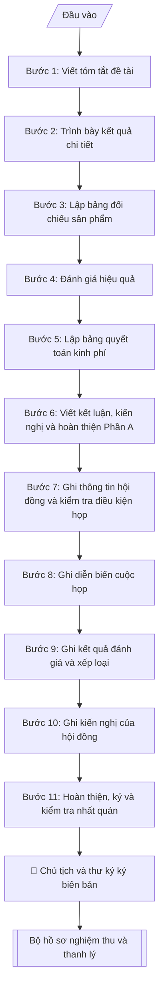

# Báo cáo nghiệm thu đề tài NCKH (tổng kết + biên bản hội đồng)

## Định dạng và file đầu ra
Định dạng đầu ra có thể chọn theo sản phẩm/yêu cầu: .docx, .pdf. Đọc mục “Định dạng bổ sung” trong quy cách đầu ra trước khi chọn.

**Phải tạo file thực tế để tải xuống, không chỉ trả nội dung trong chat.** Định dạng mặc định của skill: **.docx**. Nếu có bảng số liệu nghiệp vụ yêu cầu file bảng tính riêng, tạo thêm Excel theo yêu cầu; không tự tạo file kiểm tra. Không chờ người dùng yêu cầu xuất file lần nữa. Ưu tiên định dạng người dùng chỉ định; đọc quy tắc xuất file tại references/quy-cach-dau-ra.md.

## Quy cách đầu ra và thông tin thiếu
Khi dựng file Word/Excel, áp dụng mục “Thể thức và bảng biểu khi dựng file” trong quy cách đầu ra (cỡ chữ từng thành phần, bảng nhiều trang, số trang, phụ lục). Đọc [quy cách và cấu trúc sản phẩm](references/quy-cach-dau-ra.md) trước khi soạn/xuất. File giao chỉ gồm sản phẩm nghiệp vụ được yêu cầu; kiểm tra nội bộ không xuất kèm. Thiếu thông tin thì giữ nguyên trường/mục và chỗ điền theo mẫu gốc (dòng dấu chấm, dấu gạch hoặc ô trống); không tự điền dữ liệu mẫu, số 0, mã chờ xác minh hay dòng chờ ký. Mẫu chuyên ngành còn áp dụng được ưu tiên về cấu trúc, mã biểu và người ký. Bản đầy đủ: [quy tắc chung](references/quy-tac-chung.md).

## Kiểm soát áp dụng và phê duyệt
Trước khi chạy, xác định `ngay_ap_dung`, `loai_hinh_truong`, `quy_che_noi_bo`, `nguon_du_lieu`, `nguoi_kiem_duyet`; chỉ hỏi thông tin liên quan nghiệp vụ, không dùng giá trị giả định thay dữ liệu bắt buộc. Đối chiếu căn cứ pháp lý với văn bản gốc, hiệu lực, điều khoản áp dụng và chuyển tiếp. Bản đầy đủ: [quy tắc chung](references/quy-tac-chung.md).

Nếu có cập nhật pháp lý dưới đây, đọc [căn cứ và điều kiện áp dụng](references/phap-ly.md) trước khi làm. Quy trình dưới đây giữ nghiệp vụ từ bản gốc; mọi viện dẫn văn bản, mẫu biểu, điều khoản phải theo căn cứ đã chọn trong phap-ly.md, không theo văn bản cũ.

## Giới hạn và human gate
AI hỗ trợ chuẩn bị và đối chiếu; cán bộ phụ trách kiểm tra dữ liệu/căn cứ, người có thẩm quyền duyệt và ký. Không đánh dấu đã ký, đã duyệt, đã công bố khi chưa có chứng cứ. Dữ liệu sinh viên, sức khỏe, nhân sự, tài chính chỉ dùng theo mục đích và phân quyền, che thông tin định danh khi dùng ví dụ (Luật 91/2025/QH15, hiệu lực 01/01/2026); không tải dữ liệu lên dịch vụ ngoài khi chưa có quyền. Bản đầy đủ: [quy tắc chung](references/quy-tac-chung.md).

## Khi nào dùng
Khi đề tài đã hết thời gian thực hiện (hoặc hoàn thành sớm): chủ nhiệm soạn Báo cáo
tổng kết; Phòng KHCN soạn Biên bản nghiệm thu để Hội đồng họp đánh giá, xếp loại.
Bộ hồ sơ này là căn cứ để thanh lý hợp đồng và quyết toán kinh phí.

## Đầu vào (Input)
| Trường | Mô tả | Bắt buộc |
|---|---|---|
| `ten_de_tai` | Tên đầy đủ của đề tài | Có |
| `ma_so_de_tai` | Mã số đề tài | Có |
| `chu_nhiem` | Họ tên, học hàm/học vị chủ nhiệm | Có |
| `co_quan_chu_tri` | Đơn vị chủ trì | Có |
| `thoi_gian_thuc_hien` | Từ ngày/tháng/năm đến ngày/tháng/năm (thực tế) | Có |
| `tom_tat` | Tóm tắt: đặt vấn đề, mục tiêu, phương pháp (ngắn gọn) | Có |
| `ket_qua_chi_tiet` | Kết quả theo từng nội dung/mục tiêu đã đăng ký | Có |
| `san_pham_doi_chieu` | Bảng đối chiếu sản phẩm đăng ký vs sản phẩm thực đạt | Có |
| `hieu_qua` | Hiệu quả khoa học, kinh tế – xã hội, đào tạo | Có |
| `quyet_toan_kinh_phi` | Bảng đối chiếu dự toán được duyệt vs thực chi theo khoản mục | Có |
| `ket_luan_kien_nghi` | Kết luận, kiến nghị và hướng phát triển tiếp | Không |
| `hoi_dong` | Thành phần hội đồng: Chủ tịch, 02 phản biện, ủy viên, thư ký (họ tên, học hàm/học vị, đơn vị) | Có |
| `ngay_hop` | Ngày họp nghiệm thu | Có |
| `dia_diem` | Địa điểm họp | Có |
| `dien_bien` | Diễn biến chính: trình bày, nhận xét phản biện, thảo luận | Có |
| `ket_qua_danh_gia` | Kết quả bỏ phiếu/xếp loại của từng thành viên và kết luận chung (Xuất sắc/Đạt/Không đạt) | Có |
| `kien_nghi_hoi_dong` | Kiến nghị của hội đồng (chỉnh sửa, bổ sung trước thanh lý) | Không |

## Quy trình
**Ràng buộc pháp lý khi thực hiện** (trích references/phap-ly.md; đối chiếu toàn văn và hiệu lực tại ngày nghiệp vụ):
- Luật 93/2025/QH15; Nghị định 265/2025 và 267/2025, hiệu lực 14/10/2025: Yêu cầu cấp nhiệm vụ, nguồn kinh phí, tài trợ/đặt hàng, ngày phê duyệt, quy chế cơ quan tài trợ, phương thức khoán và quyền sử dụng kết quả. Đối chiếu NĐ 265 về tài chính và NĐ 267 về nhiệm vụ; không cố định thang xếp loại hoặc thu hồi toàn bộ kinh phí cho mọi đề tài. Nghiệm thu dựa hợp đồng và tiêu chí được duyệt, hội đồng có thẩm quyền xác nhận.
- Trước Bước 1: chọn căn cứ theo đối tượng, loại hình trường và chuyển tiếp; lập bảng văn bản / điều khoản / lý do áp dụng / bằng chứng. Thiếu văn bản gốc hoặc điều khoản thì ghi nhận nội bộ [CẦN XÁC MINH] (không đưa vào file giao), để trống phần tương ứng, chưa kết luận tuân thủ.
- Các con số, thời hạn, số điều, số mức xếp loại, hệ số và mẫu biểu nêu trong các bước dưới đây được giữ từ quy trình gốc (trước cập nhật pháp lý); chỉ dùng khi đã đối chiếu đúng với căn cứ đã chọn, khác thì theo căn cứ. Danh sách điểm cần đối chiếu: docs/DIEM_CAN_DOI_CHIEU_PHAP_LY.md.

**PHẦN A – Báo cáo tổng kết đề tài** (do chủ nhiệm soạn):

**Bước 1. Viết tóm tắt đề tài**
- Làm gì: từ `tom_tat` viết phần tóm tắt: đặt vấn đề (3–5 dòng), mục tiêu, phương pháp chính — người đọc nắm được toàn bộ đề tài trong 1 trang; điền khối thông tin đề tài: `ten_de_tai`, `ma_so_de_tai`, `chu_nhiem`, `co_quan_chu_tri`, `thoi_gian_thuc_hien` (thực tế).
- Dùng input: `tom_tat`, `ten_de_tai`, `ma_so_de_tai`, `chu_nhiem`, `co_quan_chu_tri`, `thoi_gian_thuc_hien`.
- Vai trò: Chủ nhiệm đề tài · AI hỗ trợ: soạn dự thảo tóm tắt · ⏱ ~30–45 phút (ước tính)
- Lưu ý nghiệp vụ: tóm tắt là phần hội đồng đọc đầu tiên — phải nêu được "làm gì, bằng cách nào, được gì"; tránh sao chép nguyên mục tính cấp thiết của thuyết minh.
- → Kết quả bước: dự thảo mục I – Tóm tắt + khối thông tin đề tài.

**Bước 2. Trình bày kết quả chi tiết**
- Làm gì: từ `ket_qua_chi_tiet` trình bày theo từng nội dung/mục tiêu đã đăng ký trong thuyết minh; mỗi nội dung nêu: đã làm gì, kết quả cụ thể (số liệu), so sánh với mục tiêu đăng ký (đạt/vượt/chưa đạt).
- Dùng input: `ket_qua_chi_tiet`.
- Vai trò: Chủ nhiệm đề tài · AI hỗ trợ: trình bày theo từng nội dung/mục tiêu · ⏱ ~1–1,5 giờ (ước tính)
- Lưu ý nghiệp vụ: mọi con số phải có minh chứng (phụ lục số liệu, biên bản thử nghiệm); nội dung nào chưa đạt mục tiêu phải giải trình trung thực — hội đồng phát hiện dễ dàng khi đối chiếu với thuyết minh.
- → Kết quả bước: dự thảo mục II – Kết quả chi tiết (có đối chiếu mục tiêu đăng ký).

**Bước 3. Lập bảng đối chiếu sản phẩm**
- Làm gì: từ `san_pham_doi_chieu` lập bảng 2 cột "Đăng ký" vs "Thực đạt" cho từng sản phẩm (bài báo, phần mềm, đào tạo...); ghi kết luận tỷ lệ hoàn thành; giải trình nếu có chênh lệch.
- Dùng input: `san_pham_doi_chieu`.
- Vai trò: Chủ nhiệm đề tài · AI hỗ trợ: lập bảng đối chiếu Đăng ký vs Thực đạt và tính tỷ lệ hoàn thành · ⏱ ~20–30 phút (ước tính)
- Lưu ý nghiệp vụ: sản phẩm "thực đạt" phải có minh chứng kèm theo (bài báo: bản in/quyết định đăng; phần mềm: biên bản chạy thử; đào tạo: quyết định công nhận tốt nghiệp).
- → Kết quả bước: bảng đối chiếu sản phẩm đăng ký/thực đạt.

**Bước 4. Đánh giá hiệu quả**
- Làm gì: từ `hieu_qua` viết 3 nhóm: hiệu quả khoa học (đóng góp mới so với tình trạng đã biết); hiệu quả kinh tế – xã hội (khả năng ứng dụng, đối tượng thụ hưởng, số liệu minh họa); hiệu quả đào tạo (thạc sĩ, sinh viên NCKH).
- Dùng input: `hieu_qua`.
- Vai trò: Chủ nhiệm đề tài · AI hỗ trợ: soạn dự thảo 3 nhóm hiệu quả · ⏱ ~30–45 phút (ước tính)
- Lưu ý nghiệp vụ: hiệu quả kinh tế – xã hội cần số liệu cụ thể (VD: giảm 12% chi phí khảo sát), tránh khẩu hiệu chung chung ("góp phần phát triển kinh tế").
- → Kết quả bước: dự thảo mục IV – Hiệu quả (3 nhóm).

**Bước 5. Lập bảng quyết toán kinh phí**
- Làm gì: từ `quyet_toan_kinh_phi` lập bảng đối chiếu dự toán được duyệt vs thực chi theo từng khoản mục; kiểm tra tổng thực chi không vượt tổng dự toán; giải trình các chênh lệch lớn.
- Dùng input: `quyet_toan_kinh_phi`.
- Vai trò: Chủ nhiệm đề tài · AI hỗ trợ: lập bảng đối chiếu và tính chênh lệch · ⏱ ~20–30 phút (ước tính)
- Lưu ý nghiệp vụ: số liệu ở đây phải khớp với hồ sơ quyết toán đã nộp Phòng Tài chính — hội đồng sẽ đối chiếu chéo hai nguồn.
- → Kết quả bước: bảng quyết toán kinh phí (dự toán – thực chi – chênh lệch theo khoản mục).

**Bước 6. Viết kết luận, kiến nghị và hoàn thiện Phần A**
- Làm gì: từ `ket_luan_kien_nghi` viết mức độ hoàn thành mục tiêu, kiến nghị ứng dụng kết quả, hướng nghiên cứu tiếp theo; ráp các kết quả bước 1–5 thành báo cáo tổng kết hoàn chỉnh (I. Tóm tắt → VI. Kết luận và kiến nghị); kiểm tra chính tả, số liệu; trình chủ nhiệm ký.
- Dùng input: `ket_luan_kien_nghi`, kết quả bước 1–5, `chu_nhiem`.
- Vai trò: Chủ nhiệm đề tài · AI hỗ trợ: ráp Phần A hoàn chỉnh · ⏱ ~30–45 phút (ước tính)
- Lưu ý nghiệp vụ: kiến nghị phải khả thi và có địa chỉ thụ hưởng cụ thể (đơn vị nào áp dụng), không kiến nghị chung chung.
- → Kết quả bước: Phần A – Báo cáo tổng kết hoàn chỉnh, sẵn sàng trình ký.

**PHẦN B – Biên bản nghiệm thu của Hội đồng** (do thư ký hội đồng ghi):

**Bước 7. Ghi thông tin hội đồng và kiểm tra điều kiện họp**
- Làm gì: ghi quyết định thành lập hội đồng; điền thành phần từ `hoi_dong` (Chủ tịch, 02 phản biện, ủy viên, thư ký — họ tên, học hàm/học vị, đơn vị); ghi `ngay_hop`, `dia_diem`, hình thức họp; kiểm tra tỷ lệ thành viên có mặt — phải đủ theo quy chế mới được tiến hành họp.
- Dùng input: `hoi_dong`, `ngay_hop`, `dia_diem`.
- Vai trò: Thư ký Hội đồng · AI hỗ trợ: chuẩn bị hồ sơ trình ký, nhắc lịch và theo dõi tiến độ · ⏱ ~30 phút (ước tính)
- Lưu ý nghiệp vụ: thành viên vắng mặt không đủ tỷ lệ → cuộc họp không hợp lệ, biên bản vô giá trị; kiểm tra tư cách thành viên (không thuộc nhóm thực hiện đề tài, đủ tiêu chuẩn theo quy chế).
- → Kết quả bước: phần 1 biên bản (thông tin hội đồng, thời gian, địa điểm, tỷ lệ có mặt).

**Bước 8. Ghi diễn biến cuộc họp**
- Làm gì: từ `dien_bien` ghi theo trình tự: chủ nhiệm trình bày tóm tắt kết quả; 02 phản biện đọc nhận xét; các thành viên thảo luận, chất vấn; chủ nhiệm giải trình; ghi ý kiến chính của từng người, không ghi nguyên văn dài dòng.
- Dùng input: `dien_bien`.
- Vai trò: Thư ký Hội đồng · AI hỗ trợ: chuẩn bị tài liệu họp, tổng hợp ý kiến · ⏱ ~theo thời gian họp (ước tính, 1,5–2 giờ)
- Lưu ý nghiệp vụ: phải ghi đầy đủ ý kiến trái chiều (nếu có) và nội dung giải trình — đây là căn cứ khi có khiếu nại về kết quả nghiệm thu.
- → Kết quả bước: phần 2 biên bản (diễn biến cuộc họp).

**Bước 9. Ghi kết quả đánh giá và xếp loại**
- Làm gì: từ `ket_qua_danh_gia` ghi ý kiến từng thành viên, kết quả bỏ phiếu kín (số phiếu theo từng mức), kết luận xếp loại chung của hội đồng (Xuất sắc/Đạt/Không đạt).
- Dùng input: `ket_qua_danh_gia`.
- Vai trò: Hội đồng nghiệm thu · AI hỗ trợ: chuẩn bị tài liệu họp, tổng hợp ý kiến · ⏱ ~20–30 phút (ước tính)
- Lưu ý nghiệp vụ: xếp loại "Không đạt" đồng nghĩa không thanh lý được hợp đồng và phải xử lý theo Điều 7 (thu hồi kinh phí) — phải ghi rõ căn cứ trong biên bản.
- → Kết quả bước: phần 3 biên bản (kết quả đánh giá, xếp loại).

**Bước 10. Ghi kiến nghị của hội đồng**
- Làm gì: từ `kien_nghi_hoi_dong` ghi nội dung cần chỉnh sửa, bổ sung trong báo cáo tổng kết trước khi thanh lý (trường hợp xếp loại Đạt có điều kiện), kèm thời hạn hoàn thành cụ thể.
- Dùng input: `kien_nghi_hoi_dong`.
- Vai trò: Hội đồng nghiệm thu · AI hỗ trợ: rà soát kỹ thuật, tổng hợp và lưu trữ hồ sơ · ⏱ ~15–20 phút (ước tính)
- Lưu ý nghiệp vụ: kiến nghị phải cụ thể, có thời hạn — kiến nghị chung chung ("hoàn thiện thêm") sẽ gây ách tắc khi làm thủ tục thanh lý.
- → Kết quả bước: phần 4 biên bản (kiến nghị + thời hạn hoàn thành).

**Bước 11. Hoàn thiện, ký và kiểm tra nhất quán**
- Làm gì: Chủ tịch, Thư ký và các thành viên ký xác nhận biên bản; kiểm tra số liệu sản phẩm, kinh phí giữa Phần A và Phần B khớp nhau tuyệt đối — nếu lệch thì quay lại sửa Phần A trước khi ký; ghi số bản biên bản và thời điểm thông qua toàn văn tại cuộc họp.
- Dùng input: kết quả bước 1–10.
- Vai trò: Chủ tịch Hội đồng, Thư ký Hội đồng · AI hỗ trợ: kiểm tra nhất quán số liệu hai phần · ⏱ ~30–45 phút (ước tính)
- Lưu ý nghiệp vụ: biên bản phải được thông qua toàn văn tại cuộc họp và ghi rõ giờ kết thúc; số bản lập theo quy định (thường 04 bản).
- → Kết quả bước: bộ hồ sơ nghiệm thu hoàn chỉnh (Phần A + Phần B), sẵn sàng trình ký.

## Luồng quy trình (Workflow)

## Đầu ra
- Phần A: Báo cáo tổng kết đề tài hoàn chỉnh.
- Phần B: Biên bản nghiệm thu của Hội đồng hoàn chỉnh.
- Bảng đối chiếu sản phẩm đăng ký/thực đạt + bảng quyết toán kinh phí.

File nghiệp vụ thực tế theo định dạng mặc định ở đầu skill hoặc định dạng người dùng yêu cầu, kèm liên kết tải trong phản hồi cuối.

Sản phẩm nghiệp vụ hoàn chỉnh theo [quy cách và cấu trúc](references/quy-cach-dau-ra.md), giữ các trường chưa có dữ liệu ở trạng thái trống. Không xuất kèm checklist/phụ lục kiểm tra đầu ra.

## Kiểm tra nội bộ trước khi giao
Các tiêu chí sau dùng để tự đối chiếu; không sao chép vào file xuất. Mục thiếu dữ liệu được để trống, không đánh dấu đã đạt hoặc đã duyệt.

- [ ] Đủ cấu trúc 2 phần theo chuẩn: Phần A 9 phần (tiêu đề → khối thông tin → mục I–VI → chữ ký chủ nhiệm) + Phần B 9 phần (Quốc hiệu – Tiêu ngữ → tiêu đề → thông tin đề tài → phần 1–4 → số bản, thời điểm thông qua → chữ ký hội đồng)
- [ ] Số liệu trong output khớp Input: sản phẩm thực đạt = `san_pham_doi_chieu`; quyết toán kinh phí = `quyet_toan_kinh_phi`; thành phần hội đồng = `hoi_dong`
- [ ] Không bịa đặt diễn biến cuộc họp, kết quả bỏ phiếu, ý kiến phản biện, minh chứng sản phẩm
- [ ] Số liệu sản phẩm và kinh phí giữa Phần A (báo cáo tổng kết) và Phần B (biên bản) khớp nhau tuyệt đối
- [ ] Căn cứ pháp lý đầy đủ, còn hiệu lực (hợp đồng thực hiện đề tài, quyết định thành lập hội đồng nghiệm thu)
- [ ] Mỗi sản phẩm "thực đạt" có minh chứng kèm theo; bảng quyết toán khớp với hồ sơ quyết toán đã nộp Phòng Tài chính
- [ ] Tỷ lệ thành viên hội đồng có mặt đủ theo quy chế; thành viên đủ tư cách (không thuộc nhóm thực hiện đề tài); biên bản ghi đầy đủ ý kiến trái chiều (nếu có) và nội dung giải trình
- [ ] Kiến nghị của hội đồng cụ thể, có thời hạn hoàn thành; biên bản ghi rõ số bản và thời điểm thông qua toàn văn tại cuộc họp
- [ ] Đã qua Human gate: chủ nhiệm ký Phần A; Chủ tịch, Thư ký và các thành viên ký biên bản

## Căn cứ & lưu ý
- Hợp đồng thực hiện đề tài; Quyết định thành lập Hội đồng nghiệm thu của Hiệu trưởng.
- Số liệu sản phẩm và kinh phí giữa Báo cáo tổng kết và Biên bản nghiệm thu phải
  khớp nhau tuyệt đối.
- Xếp loại "Không đạt" đồng nghĩa với không thanh lý được hợp đồng và phải xử lý
  theo Điều 7 của hợp đồng (thu hồi kinh phí, xem xét trách nhiệm).
- Không dùng tên thật của trường/cá nhân khi mô phỏng.

## Tư liệu đối chiếu
Bản gốc trước cập nhật pháp lý (kèm ví dụ giả lập) lưu tại `references/quy-trinh-lich-su.md`, chỉ để đối chiếu hồ sơ lịch sử; không dùng căn cứ, mẫu hay số liệu trong đó làm chỉ dẫn hiện hành.

## Quản trị phiên bản
- Phiên bản gói `1.3.2` (cập nhật 2026-10-10); hồ sơ đầy đủ tại [references/version.json](references/version.json).
- Người phê duyệt nghiệp vụ: **chưa chỉ định**. Trạng thái: dự thảo nghiệp vụ; kiểm tra pháp lý trước thực thi. Ngày cập nhật không đồng nghĩa mọi văn bản đã được rà soát toàn văn.
- Giấy phép theo LICENSE của kho (bản quyền CES Global). Lịch sử thay đổi: CHANGELOG.md.
