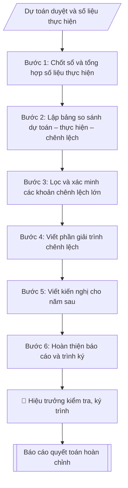

# Soạn báo cáo quyết toán ngân sách năm

## Định dạng và file đầu ra
Định dạng đầu ra có thể chọn theo sản phẩm/yêu cầu: .xlsx, .csv, .pdf. Đọc mục “Định dạng bổ sung” trong quy cách đầu ra trước khi chọn.

**Phải tạo file thực tế để tải xuống, không chỉ trả nội dung trong chat.** Định dạng mặc định của skill: **.xlsx**. Nếu yêu cầu gồm cả báo cáo thuyết minh, tạo thêm file Word cho báo cáo; không ghép báo cáo dài vào bảng tính. Không chờ người dùng yêu cầu xuất file lần nữa. Ưu tiên định dạng người dùng chỉ định; đọc quy tắc xuất file tại references/quy-cach-dau-ra.md.

## Quy cách đầu ra và thông tin thiếu
Khi dựng file Word/Excel, áp dụng mục “Thể thức và bảng biểu khi dựng file” trong quy cách đầu ra (cỡ chữ từng thành phần, bảng nhiều trang, số trang, phụ lục). Đọc [quy cách và cấu trúc sản phẩm](references/quy-cach-dau-ra.md) trước khi soạn/xuất. File giao chỉ gồm sản phẩm nghiệp vụ được yêu cầu; kiểm tra nội bộ không xuất kèm. Thiếu thông tin thì giữ nguyên trường/mục và chỗ điền theo mẫu gốc (dòng dấu chấm, dấu gạch hoặc ô trống); không tự điền dữ liệu mẫu, số 0, mã chờ xác minh hay dòng chờ ký. Mẫu chuyên ngành còn áp dụng được ưu tiên về cấu trúc, mã biểu và người ký. Bản đầy đủ: [quy tắc chung](references/quy-tac-chung.md).

## Kiểm soát áp dụng và phê duyệt
Trước khi chạy, xác định `ngay_ap_dung`, `loai_hinh_truong`, `quy_che_noi_bo`, `nguon_du_lieu`, `nguoi_kiem_duyet`; chỉ hỏi thông tin liên quan nghiệp vụ, không dùng giá trị giả định thay dữ liệu bắt buộc. Đối chiếu căn cứ pháp lý với văn bản gốc, hiệu lực, điều khoản áp dụng và chuyển tiếp. Bản đầy đủ: [quy tắc chung](references/quy-tac-chung.md).

Nếu có cập nhật pháp lý dưới đây, đọc [căn cứ và điều kiện áp dụng](references/phap-ly.md) trước khi làm. Quy trình dưới đây giữ nghiệp vụ từ bản gốc; mọi viện dẫn văn bản, mẫu biểu, điều khoản phải theo căn cứ đã chọn trong phap-ly.md, không theo văn bản cũ.

## Giới hạn và human gate
AI hỗ trợ chuẩn bị và đối chiếu; cán bộ phụ trách kiểm tra dữ liệu/căn cứ, người có thẩm quyền duyệt và ký. Không đánh dấu đã ký, đã duyệt, đã công bố khi chưa có chứng cứ. Dữ liệu sinh viên, sức khỏe, nhân sự, tài chính chỉ dùng theo mục đích và phân quyền, che thông tin định danh khi dùng ví dụ (Luật 91/2025/QH15, hiệu lực 01/01/2026); không tải dữ liệu lên dịch vụ ngoài khi chưa có quyền. Bản đầy đủ: [quy tắc chung](references/quy-tac-chung.md).

## Khi nào dùng
Khi kết thúc năm ngân sách, cần tổng hợp, đối chiếu số liệu thực hiện thu – chi với dự toán
được duyệt, giải trình các khoản chênh lệch lớn và đề xuất kiến nghị cho năm sau.

## Đầu vào (Input)
| Trường | Mô tả | Bắt buộc |
|---|---|---|
| `nam_quyet_toan` | Năm ngân sách quyết toán (vd: 2026) | Có |
| `du_toan` | Dự toán thu – chi đã được phê duyệt (theo từng nguồn thu, nội dung chi) | Có |
| `thuc_hien` | Số liệu thực hiện thu – chi cả năm (từ sổ sách, chứng từ) | Có |
| `nguong_giai_trinh` | Ngưỡng chênh lệch phải giải trình (mặc định: ±10% hoặc ±1.000 triệu đồng) | Không |
| `kien_nghi` | Kiến nghị đề xuất cho năm ngân sách sau | Không |
| `nguoi_ky` | Hiệu trưởng / Phó Hiệu trưởng phụ trách tài chính | Có |
| `don_vi_trinh` | Cấp trình quyết toán (Hội đồng trường / cơ quan chủ quản) | Có |

## Quy trình
**Ràng buộc pháp lý khi thực hiện** (trích references/phap-ly.md; đối chiếu toàn văn và hiệu lực tại ngày nghiệp vụ):
- Thông tư 24/2024/TT-BTC, áp dụng từ năm tài chính 2025; sửa đổi 46/2025: Phân biệt năm tài chính, chế độ kế toán, chứng từ, sổ và báo cáo; dùng hệ thống biểu mẫu của 24/2024 cùng sửa đổi 46/2025 theo thời điểm. Không chuyển mã tài khoản hoặc mẫu cũ cơ học; đối chiếu sổ, số dư đầu/cuối kỳ và xác nhận của kế toán trưởng.
- Luật 89/2025/QH15 và Nghị định 73/2026/NĐ-CP – ngân sách năm 2026: Yêu cầu năm ngân sách, nguồn kinh phí, dự toán được giao và thời điểm nghiệp vụ; áp dụng Luật 89 từ 01/01/2026 và NĐ 73 cho năm ngân sách 2026. Quyết toán 2025 phải kiểm tra chế độ và chuyển tiếp của năm đó, không tự thay toàn bộ căn cứ lịch sử.
- Trước Bước 1: chọn căn cứ theo đối tượng, loại hình trường và chuyển tiếp; lập bảng văn bản / điều khoản / lý do áp dụng / bằng chứng. Thiếu văn bản gốc hoặc điều khoản thì ghi nhận nội bộ [CẦN XÁC MINH] (không đưa vào file giao), để trống phần tương ứng, chưa kết luận tuân thủ.
- Các con số, thời hạn, số điều, số mức xếp loại, hệ số và mẫu biểu nêu trong các bước dưới đây được giữ từ quy trình gốc (trước cập nhật pháp lý); chỉ dùng khi đã đối chiếu đúng với căn cứ đã chọn, khác thì theo căn cứ. Danh sách điểm cần đối chiếu: docs/DIEM_CAN_DOI_CHIEU_PHAP_LY.md.

**Bước 1. Chốt sổ và tổng hợp số liệu thực hiện**
- Làm gì: chốt sổ kế toán năm (`nam_quyet_toan`); tổng hợp thu – chi thực tế cả năm theo đúng
  cơ cấu nguồn thu và nội dung chi của dự toán đã duyệt, để hai bộ số liệu so sánh được
  tương đồng từng dòng.
- Dùng input: `thuc_hien`, `du_toan` (lấy cơ cấu dòng), `nam_quyet_toan`.
- Vai trò: Trưởng phòng Tài chính – Kế toán · AI hỗ trợ: tổng hợp, chuẩn hóa dữ liệu · ⏱ ~1–2 giờ (ước tính)
- Lưu ý nghiệp vụ: số liệu thực hiện phải khớp với sổ kế toán, không dùng số tạm tính hay
  số ước; mọi khoản chi vượt dự toán phải có quyết định điều chỉnh, bổ sung dự toán của cấp
  có thẩm quyền trước khi quyết toán — không hợp thức hóa chứng từ sau.
- → Kết quả bước: bảng số liệu thực hiện thu – chi cả năm, sắp xếp theo đúng cơ cấu dòng
  của dự toán được duyệt.

**Bước 2. Lập bảng so sánh dự toán – thực hiện – chênh lệch**
- Làm gì: với mỗi dòng nguồn thu / nội dung chi, tính chênh lệch tuyệt đối (thực hiện −
  dự toán) và chênh lệch tương đối (%); kiểm tra số học: tổng các dòng thành phần bằng
  dòng tổng cộng.
- Dùng input: `du_toan`, `thuc_hien`, kết quả Bước 1.
- Vai trò: Chuyên viên Phòng TCKT · AI hỗ trợ: đối chiếu tự động, cảnh báo sai lệch, tính toán, phân tích số liệu · ⏱ ~30–60 phút (ước tính)
- Lưu ý nghiệp vụ: kiểm tra kỹ dấu của chênh lệch (vượt/thiếu) và cách làm tròn tỷ lệ %;
  đơn vị tính thống nhất (triệu đồng) trên toàn bảng.
- → Kết quả bước: bảng so sánh đầy đủ 5 cột (dự toán, thực hiện, chênh lệch tuyệt đối,
  tỷ lệ %, ghi chú) cho cả phần thu và phần chi.

**Bước 3. Lọc và xác minh các khoản chênh lệch lớn**
- Làm gì: lọc các dòng vượt `nguong_giai_trinh` (±10% hoặc ±1.000 triệu đồng — điều kiện
  nào đến trước thì áp dụng); với mỗi khoản, xác minh nguyên nhân từ chứng từ, hợp đồng,
  quyết định phát sinh trong năm và kiểm tra có quyết định điều chỉnh dự toán giữa năm
  hay không.
- Dùng input: `nguong_giai_trinh`, kết quả Bước 2.
- Vai trò: Chuyên viên Phòng TCKT · AI hỗ trợ: đối chiếu tự động, cảnh báo sai lệch · ⏱ ~1–2 giờ (ước tính)
- Lưu ý nghiệp vụ: ngưỡng kép (±10% hoặc ±1.000 triệu) giúp bắt cả khoản nhỏ nhưng biến
  động mạnh và khoản lớn biến động nhẹ; ghi rõ nguyên nhân khách quan (chính sách, thị
  trường) hay chủ quan (quản lý) cho từng khoản.
- → Kết quả bước: danh sách các khoản chênh lệch lớn kèm nguyên nhân đã xác minh và
  tình trạng điều chỉnh dự toán giữa năm.

**Bước 4. Viết phần giải trình chênh lệch**
- Làm gì: mỗi khoản chênh lệch lớn một đoạn riêng, nêu: số liệu cụ thể (dự toán, thực hiện,
  chênh lệch), nguyên nhân đã xác minh ở Bước 3, có phải do điều chỉnh dự toán giữa năm
  hay không, và đánh giá tác động (tích cực/tiêu cực) đến cân đối ngân sách.
- Dùng input: kết quả Bước 3.
- Vai trò: Chuyên viên Phòng TCKT · AI hỗ trợ: soạn dự thảo, đối chiếu tự động, cảnh báo sai lệch · ⏱ ~30–60 phút (ước tính)
- Lưu ý nghiệp vụ: giải trình phải trung thực cả chênh lệch bất lợi; không dùng câu chữ
  chung chung kiểu "do khách quan" mà phải nêu sự kiện, con số cụ thể.
- → Kết quả bước: phần giải trình chênh lệch hoàn chỉnh.

**Bước 5. Viết kiến nghị cho năm sau**
- Làm gì: từ các chênh lệch và nguyên nhân ở Bước 3 – 4, đề xuất: điều chỉnh định mức các
  khoản thường xuyên vượt; bổ sung/giải pháp tăng nguồn thu; siết chặt nội dung chi vượt
  dự toán; hoàn thiện quy chế chi tiêu nội bộ.
- Dùng input: `kien_nghi`, kết quả Bước 3 – 4.
- Vai trò: Chuyên viên Phòng TCKT · AI hỗ trợ: soạn dự thảo · ⏱ ~30–60 phút (ước tính)
- Lưu ý nghiệp vụ: mỗi kiến nghị gắn với một vấn đề thực tế đã phát hiện trong năm quyết
  toán, tránh kiến nghị chung chung không gắn số liệu.
- → Kết quả bước: phần kiến nghị hoàn chỉnh.

**Bước 6. Hoàn thiện báo cáo và trình ký**
- Làm gì: ghép báo cáo theo cấu trúc: tiêu đề văn bản (tên trường, số ký hiệu, ngày tháng,
  tên báo cáo, kính gửi) → Phần I: kết quả thu → Phần II: kết quả chi → Phần III: giải trình
  chênh lệch lớn → Phần IV: kiến nghị → biểu số liệu đính kèm → chữ ký (`nguoi_ky`); kiểm tra
  thể thức, số liệu, thẩm quyền ký; trình `don_vi_trinh` xem xét, phê duyệt.
- Dùng input: `nguoi_ky`, `don_vi_trinh`, kết quả Bước 2, 4, 5.
- Vai trò: Chuyên viên Phòng TCKT (chuẩn bị hồ sơ trình); Hiệu trưởng (người ký) ban hành · AI hỗ trợ: đối chiếu tự động, cảnh báo sai lệch, chuẩn bị hồ sơ trình đầy đủ · ⏱ ~1–3 giờ (ước tính)
- Lưu ý nghiệp vụ: số liệu trong các phần I, II phải khớp 100% với biểu đính kèm; người ký
  phải đúng thẩm quyền theo quy định của đơn vị.
- → Kết quả bước: báo cáo quyết toán ngân sách năm hoàn chỉnh, đã ký.

## Luồng quy trình (Workflow)

## Đầu ra
- Báo cáo quyết toán ngân sách năm hoàn chỉnh (văn bản + biểu số liệu).
- Bảng so sánh Dự toán / Thực hiện / Chênh lệch theo từng nguồn thu và nội dung chi.
- Phần giải trình các khoản chênh lệch lớn và kiến nghị.

File nghiệp vụ thực tế theo định dạng mặc định ở đầu skill hoặc định dạng người dùng yêu cầu, kèm liên kết tải trong phản hồi cuối.

Sản phẩm nghiệp vụ hoàn chỉnh theo [quy cách và cấu trúc](references/quy-cach-dau-ra.md), giữ các trường chưa có dữ liệu ở trạng thái trống. Không xuất kèm checklist/phụ lục kiểm tra đầu ra.

## Kiểm tra nội bộ trước khi giao
Các tiêu chí sau dùng để tự đối chiếu; không sao chép vào file xuất. Mục thiếu dữ liệu được để trống, không đánh dấu đã đạt hoặc đã duyệt.

- [ ] Đủ các phần và đúng bố cục theo cấu trúc tại references/quy-cach-dau-ra.md (không theo cấu trúc của bản gốc).
- [ ] Có đầy đủ sản phẩm: Báo cáo quyết toán ngân sách năm hoàn chỉnh (văn bản + biểu số liệu)
- [ ] Có đầy đủ sản phẩm: Bảng so sánh Dự toán / Thực hiện / Chênh lệch theo từng nguồn thu và nội dung chi
- [ ] Mọi số liệu, tên, ngày tháng trong output khớp với Input đã cung cấp (không thêm bớt, không suy đoán)
- [ ] Không bịa đặt số liệu, minh chứng, trích dẫn hay căn cứ
- [ ] Đúng thể thức, định dạng văn bản theo quy định hiện hành
- [ ] Căn cứ pháp lý nêu đầy đủ, còn hiệu lực tại thời điểm lập
- [ ] Đã qua Human gate: người có thẩm quyền đã kiểm tra/ký duyệt trước khi phát hành
- [ ] Số liệu thực hiện phải khớp với sổ kế toán, không dùng số tạm tính hay
- [ ] Kiểm tra kỹ dấu của chênh lệch (vượt/thiếu) và cách làm tròn tỷ lệ %

## Căn cứ & lưu ý
- Căn cứ hiện hành: xem [căn cứ và điều kiện áp dụng](references/phap-ly.md); phải đối chiếu văn bản gốc, hiệu lực và chuyển tiếp tại ngày nghiệp vụ.
- Đơn vị sự nghiệp công lập: quyết toán kinh phí ngân sách nhà nước cấp thực hiện theo
  quy định của cơ quan chủ quản và cơ quan tài chính cùng cấp.
- Mọi khoản chi vượt dự toán phải có quyết định điều chỉnh, bổ sung dự toán của cấp có
  thẩm quyền trước khi quyết toán; không hợp thức hóa chứng từ sau.
- Không dùng tên thật của trường/cá nhân khi mô phỏng.

## Tư liệu đối chiếu
Bản gốc trước cập nhật pháp lý (kèm ví dụ giả lập) lưu tại `references/quy-trinh-lich-su.md`, chỉ để đối chiếu hồ sơ lịch sử; không dùng căn cứ, mẫu hay số liệu trong đó làm chỉ dẫn hiện hành.

## Quản trị phiên bản
- Phiên bản gói `1.3.2` (cập nhật 2026-10-10); hồ sơ đầy đủ tại [references/version.json](references/version.json).
- Người phê duyệt nghiệp vụ: **chưa chỉ định**. Trạng thái: dự thảo nghiệp vụ; kiểm tra pháp lý trước thực thi. Ngày cập nhật không đồng nghĩa mọi văn bản đã được rà soát toàn văn.
- Giấy phép theo LICENSE của kho (bản quyền CES Global). Lịch sử thay đổi: CHANGELOG.md.
