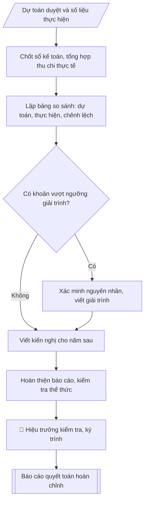

# Tư liệu lịch sử – không phải quy trình hiện hành

Nội dung từ phiên bản nguồn trước 1.1.0, giữ để đối chiếu dữ liệu đầu vào và thay đổi; căn cứ, điều kiện, mẫu và ví dụ có thể đã lỗi thời. Không dùng để thực hiện nghiệp vụ hiện tại.

## Khi nào dùng
Khi kết thúc năm ngân sách, cần tổng hợp, đối chiếu số liệu thực hiện thu – chi với dự toán
được duyệt, giải trình các khoản chênh lệch lớn và đề xuất kiến nghị cho năm sau.

## Đầu vào (Input)

| Trường | Mô tả | Bắt buộc |
|---|---|---|
| `nam_quyet_toan` | Năm ngân sách quyết toán (vd: 2026) | Có |
| `du_toan` | Dự toán thu – chi đã được phê duyệt (theo từng nguồn thu, nội dung chi) | Có |
| `thuc_hien` | Số liệu thực hiện thu – chi cả năm (từ sổ sách, chứng từ) | Có |
| `nguong_giai_trinh` | Ngưỡng chênh lệch phải giải trình (mặc định: ±10% hoặc ±1.000 triệu đồng) | Không |
| `kien_nghi` | Kiến nghị đề xuất cho năm ngân sách sau | Không |
| `nguoi_ky` | Hiệu trưởng / Phó Hiệu trưởng phụ trách tài chính | Có |
| `don_vi_trinh` | Cấp trình quyết toán (Hội đồng trường / cơ quan chủ quản) | Có |

## Quy trình

**Bước 1. Chốt sổ và tổng hợp số liệu thực hiện**
- Làm gì: chốt sổ kế toán năm (`nam_quyet_toan`); tổng hợp thu – chi thực tế cả năm theo đúng
  cơ cấu nguồn thu và nội dung chi của dự toán đã duyệt, để hai bộ số liệu so sánh được
  tương đồng từng dòng.
- Dùng input: `thuc_hien`, `du_toan` (lấy cơ cấu dòng), `nam_quyet_toan`.
- Vai trò: Trưởng phòng Tài chính – Kế toán · AI hỗ trợ: tổng hợp, chuẩn hóa dữ liệu · ⏱ ~1–2 giờ (ước tính)
- Lưu ý nghiệp vụ: số liệu thực hiện phải khớp với sổ kế toán, không dùng số tạm tính hay
  số ước; mọi khoản chi vượt dự toán phải có quyết định điều chỉnh, bổ sung dự toán của cấp
  có thẩm quyền trước khi quyết toán — không hợp thức hóa chứng từ sau.
- → Kết quả bước: bảng số liệu thực hiện thu – chi cả năm, sắp xếp theo đúng cơ cấu dòng
  của dự toán được duyệt.

**Bước 2. Lập bảng so sánh dự toán – thực hiện – chênh lệch**
- Làm gì: với mỗi dòng nguồn thu / nội dung chi, tính chênh lệch tuyệt đối (thực hiện −
  dự toán) và chênh lệch tương đối (%); kiểm tra số học: tổng các dòng thành phần bằng
  dòng tổng cộng.
- Dùng input: `du_toan`, `thuc_hien`, kết quả Bước 1.
- Vai trò: Chuyên viên Phòng TCKT · AI hỗ trợ: đối chiếu tự động, cảnh báo sai lệch, tính toán, phân tích số liệu · ⏱ ~30–60 phút (ước tính)
- Lưu ý nghiệp vụ: kiểm tra kỹ dấu của chênh lệch (vượt/thiếu) và cách làm tròn tỷ lệ %;
  đơn vị tính thống nhất (triệu đồng) trên toàn bảng.
- → Kết quả bước: bảng so sánh đầy đủ 5 cột (dự toán, thực hiện, chênh lệch tuyệt đối,
  tỷ lệ %, ghi chú) cho cả phần thu và phần chi.

**Bước 3. Lọc và xác minh các khoản chênh lệch lớn**
- Làm gì: lọc các dòng vượt `nguong_giai_trinh` (±10% hoặc ±1.000 triệu đồng — điều kiện
  nào đến trước thì áp dụng); với mỗi khoản, xác minh nguyên nhân từ chứng từ, hợp đồng,
  quyết định phát sinh trong năm và kiểm tra có quyết định điều chỉnh dự toán giữa năm
  hay không.
- Dùng input: `nguong_giai_trinh`, kết quả Bước 2.
- Vai trò: Chuyên viên Phòng TCKT · AI hỗ trợ: đối chiếu tự động, cảnh báo sai lệch · ⏱ ~1–2 giờ (ước tính)
- Lưu ý nghiệp vụ: ngưỡng kép (±10% hoặc ±1.000 triệu) giúp bắt cả khoản nhỏ nhưng biến
  động mạnh và khoản lớn biến động nhẹ; ghi rõ nguyên nhân khách quan (chính sách, thị
  trường) hay chủ quan (quản lý) cho từng khoản.
- → Kết quả bước: danh sách các khoản chênh lệch lớn kèm nguyên nhân đã xác minh và
  tình trạng điều chỉnh dự toán giữa năm.

**Bước 4. Viết phần giải trình chênh lệch**
- Làm gì: mỗi khoản chênh lệch lớn một đoạn riêng, nêu: số liệu cụ thể (dự toán, thực hiện,
  chênh lệch), nguyên nhân đã xác minh ở Bước 3, có phải do điều chỉnh dự toán giữa năm
  hay không, và đánh giá tác động (tích cực/tiêu cực) đến cân đối ngân sách.
- Dùng input: kết quả Bước 3.
- Vai trò: Chuyên viên Phòng TCKT · AI hỗ trợ: soạn dự thảo, đối chiếu tự động, cảnh báo sai lệch · ⏱ ~30–60 phút (ước tính)
- Lưu ý nghiệp vụ: giải trình phải trung thực cả chênh lệch bất lợi; không dùng câu chữ
  chung chung kiểu "do khách quan" mà phải nêu sự kiện, con số cụ thể.
- → Kết quả bước: phần giải trình chênh lệch hoàn chỉnh.

**Bước 5. Viết kiến nghị cho năm sau**
- Làm gì: từ các chênh lệch và nguyên nhân ở Bước 3 – 4, đề xuất: điều chỉnh định mức các
  khoản thường xuyên vượt; bổ sung/giải pháp tăng nguồn thu; siết chặt nội dung chi vượt
  dự toán; hoàn thiện quy chế chi tiêu nội bộ.
- Dùng input: `kien_nghi`, kết quả Bước 3 – 4.
- Vai trò: Chuyên viên Phòng TCKT · AI hỗ trợ: soạn dự thảo · ⏱ ~30–60 phút (ước tính)
- Lưu ý nghiệp vụ: mỗi kiến nghị gắn với một vấn đề thực tế đã phát hiện trong năm quyết
  toán, tránh kiến nghị chung chung không gắn số liệu.
- → Kết quả bước: phần kiến nghị hoàn chỉnh.

**Bước 6. Hoàn thiện báo cáo và trình ký**
- Làm gì: ghép báo cáo theo cấu trúc: tiêu đề văn bản (tên trường, số ký hiệu, ngày tháng,
  tên báo cáo, kính gửi) → Phần I: kết quả thu → Phần II: kết quả chi → Phần III: giải trình
  chênh lệch lớn → Phần IV: kiến nghị → biểu số liệu đính kèm → chữ ký (`nguoi_ky`); kiểm tra
  thể thức, số liệu, thẩm quyền ký; trình `don_vi_trinh` xem xét, phê duyệt.
- Dùng input: `nguoi_ky`, `don_vi_trinh`, kết quả Bước 2, 4, 5.
- Vai trò: Chuyên viên Phòng TCKT (chuẩn bị hồ sơ trình); Hiệu trưởng (người ký) ban hành · AI hỗ trợ: đối chiếu tự động, cảnh báo sai lệch, chuẩn bị hồ sơ trình đầy đủ · ⏱ ~1–3 giờ (ước tính)
- Lưu ý nghiệp vụ: số liệu trong các phần I, II phải khớp 100% với biểu đính kèm; người ký
  phải đúng thẩm quyền theo quy định của đơn vị.
- → Kết quả bước: báo cáo quyết toán ngân sách năm hoàn chỉnh, đã ký.

## Luồng quy trình (Workflow)



## Đầu ra (Output)
- Báo cáo quyết toán ngân sách năm hoàn chỉnh (văn bản + biểu số liệu).
- Bảng so sánh Dự toán / Thực hiện / Chênh lệch theo từng nguồn thu và nội dung chi.
- Phần giải trình các khoản chênh lệch lớn và kiến nghị.

**Cấu trúc output chuẩn:** khung mẫu cố định của báo cáo quyết toán, các phần theo đúng
thứ tự xuất hiện:
1. Tiêu đề văn bản (tên đơn vị, số ký hiệu, địa danh ngày tháng, tên báo cáo, kính gửi);
2. Phần I: Kết quả thu ngân sách (bảng: nguồn thu, dự toán, thực hiện, chênh lệch, tỷ lệ);
3. Phần II: Kết quả chi ngân sách (bảng: nội dung chi, dự toán, thực hiện, chênh lệch, tỷ lệ);
4. Phần III: Giải trình các khoản chênh lệch lớn (mỗi khoản một đoạn: số liệu, nguyên nhân,
   có điều chỉnh dự toán giữa năm không, đánh giá tác động);
5. Phần IV: Kiến nghị (định mức, nguồn thu, siết chi, hoàn thiện quy chế);
6. Đoạn kết (trình cấp có thẩm quyền xem xét, phê duyệt);
7. Nơi nhận – chữ ký người có thẩm quyền (ghi rõ họ tên, chức vụ).

## Checklist nghiệm thu

- [ ] Đủ các phần theo "Cấu trúc output chuẩn": Tiêu đề văn bản (tên đơn vị, số ký hiệu, địa…; Phần I; Phần II; Phần III; Phần IV; Đoạn kết (trình cấp có thẩm quyền xem xét,…; …
- [ ] Có đầy đủ sản phẩm: Báo cáo quyết toán ngân sách năm hoàn chỉnh (văn bản + biểu số liệu)
- [ ] Có đầy đủ sản phẩm: Bảng so sánh Dự toán / Thực hiện / Chênh lệch theo từng nguồn thu và nội dung chi
- [ ] Mọi số liệu, tên, ngày tháng trong output khớp với Input đã cung cấp (không thêm bớt, không suy đoán)
- [ ] Không bịa đặt số liệu, minh chứng, trích dẫn hay căn cứ
- [ ] Đúng thể thức, định dạng văn bản theo quy định hiện hành
- [ ] Căn cứ pháp lý nêu đầy đủ, còn hiệu lực tại thời điểm lập
- [ ] Đã qua Human gate: người có thẩm quyền đã kiểm tra/ký duyệt trước khi phát hành
- [ ] Số liệu thực hiện phải khớp với sổ kế toán, không dùng số tạm tính hay
- [ ] Kiểm tra kỹ dấu của chênh lệch (vượt/thiếu) và cách làm tròn tỷ lệ %

> Tiêu chí đạt: tất cả các ô đều được đánh dấu.

## Ví dụ mô phỏng (dữ liệu giả lập)

> Tất cả tên trường, cá nhân, số liệu dưới đây đều là **giả lập**, không liên quan tổ chức/cá nhân có thật.

### Input mẫu

| Trường | Giá trị |
|---|---|
| `nam_quyet_toan` | 2026 |
| `du_toan` | Tổng thu 165.000; tổng chi 165.000 (triệu đồng) |
| `thuc_hien` | Tổng thu 171.500; tổng chi 169.800 (triệu đồng) |
| `nguong_giai_trinh` | ±10% hoặc ±1.000 triệu đồng |
| `kien_nghi` | 1. Bổ sung định mức chi NCKH. 2. Siết chi tiếp khách – hội nghị. 3. Đẩy mạnh thu dịch vụ đào tạo ngắn hạn |
| `nguoi_ky` | Hiệu trưởng |
| `don_vi_trinh` | Hội đồng trường |

### Output mẫu

```
TRƯỜNG ĐẠI HỌC A             CỘNG HÒA XÃ HỘI CHỦ NGHĨA VIỆT NAM
PHÒNG TÀI CHÍNH – KẾ TOÁN                 Độc lập – Tự do – Hạnh phúc
      Số: 78/BC-ĐHA-TCKT
                                                 Thành phố C, ngày 09 tháng 10 năm 2026

BÁO CÁO
Quyết toán ngân sách năm 2026

Kính gửi: Hội đồng trường Đại học A

I. KẾT QUẢ THU NGÂN SÁCH NĂM 2026 (đơn vị: triệu đồng)

| TT | Nguồn thu | Dự toán | Thực hiện | Chênh lệch (+/-) | Tỷ lệ (%) |
|----|-----------|--------:|----------:|-----------------:|----------:|
| 1 | Thu học phí, lệ phí | 90.000 | 93.500 | +3.500 | +3,9% |
| 2 | Ngân sách nhà nước cấp | 45.000 | 45.000 | 0 | 0% |
| 3 | Thu dịch vụ – liên kết đào tạo | 22.000 | 25.200 | +3.200 | +14,5% |
| 4 | Thu khác | 8.000 | 7.800 | -200 | -2,5% |
| | Tổng thu | 165.000 | 171.500 | +6.500 | +3,9% |

II. KẾT QUẢ CHI NGÂN SÁCH NĂM 2026 (đơn vị: triệu đồng)

| TT | Nội dung chi | Dự toán | Thực hiện | Chênh lệch (+/-) | Tỷ lệ (%) |
|----|--------------|--------:|----------:|-----------------:|----------:|
| 1 | Chi lương – phụ cấp | 74.000 | 75.100 | +1.100 | +1,5% |
| 2 | Chi hoạt động thường xuyên | 40.000 | 41.300 | +1.300 | +3,3% |
| 3 | Chi học bổng, hỗ trợ sinh viên | 11.000 | 11.400 | +400 | +3,6% |
| 4 | Chi nghiên cứu khoa học | 13.000 | 14.800 | +1.800 | +13,8% |
| 5 | Chi đầu tư – mua sắm | 24.000 | 24.500 | +500 | +2,1% |
| 6 | Chi dự phòng | 3.000 | 2.700 | -300 | -10,0% |
| | Tổng chi | 165.000 | 169.800 | +4.800 | +2,9% |

III. GIẢI TRÌNH CÁC KHOẢN CHÊNH LỆCH LỚN

1. Thu dịch vụ – liên kết đào tạo vượt dự toán 3.200 triệu đồng (+14,5%):
   trong năm phát sinh 04 hợp đồng đào tạo ngắn hạn cho doanh nghiệp ngoài kế hoạch
   đầu năm (tổng giá trị 3.800 triệu đồng), bù trừ một số hợp đồng tư vấn chậm thanh toán.
   Đây là chênh lệch tích cực, phản ánh năng lực khai thác nguồn thu dịch vụ của Trường.

2. Chi nghiên cứu khoa học vượt dự toán 1.800 triệu đồng (+13,8%): Trường trúng tuyển
   thêm 06 đề tài cấp bộ ngoài chỉ tiêu đầu năm; kinh phí tăng thêm được bổ sung từ nguồn
   thu dịch vụ vượt thu và đã được Hiệu trưởng phê duyệt điều chỉnh dự toán giữa năm
   (Quyết định số 210/QĐ-ĐHA ngày 15/7/2026).

IV. KIẾN NGHỊ

1. Bổ sung định mức chi nghiên cứu khoa học trong dự toán năm 2027, phù hợp với số lượng
   đề tài thực tế trúng tuyển các năm gần đây.
2. Siết chặt chi tiếp khách – hội nghị trong nhóm chi hoạt động thường xuyên, gắn với
   định mức cụ thể trong Quy chế chi tiêu nội bộ sửa đổi.
3. Đẩy mạnh khai thác nguồn thu dịch vụ đào tạo ngắn hạn, tư vấn, chuyển giao công nghệ
   để tăng tỷ trọng thu ngoài ngân sách.

Trên đây là báo cáo quyết toán ngân sách năm 2026, kính trình Hội đồng trường xem xét,
phê duyệt./.

Nơi nhận:                                         HIỆU TRƯỞNG
- Hội đồng trường;                                     [CHỜ KÝ]
- Lưu: VT, TCKT.

                                         PGS.TS. Trần Văn D
```

## Căn cứ & lưu ý
- Luật Ngân sách nhà nước 2015; Nghị định 163/2016/NĐ-CP; chế độ kế toán hành chính
  sự nghiệp theo Thông tư 107/2017/TT-BTC (số liệu quyết toán phải khớp với sổ kế toán).
- Đơn vị sự nghiệp công lập: quyết toán kinh phí ngân sách nhà nước cấp thực hiện theo
  quy định của cơ quan chủ quản và cơ quan tài chính cùng cấp.
- Mọi khoản chi vượt dự toán phải có quyết định điều chỉnh, bổ sung dự toán của cấp có
  thẩm quyền trước khi quyết toán; không hợp thức hóa chứng từ sau.
- Không dùng tên thật của trường/cá nhân khi mô phỏng.
