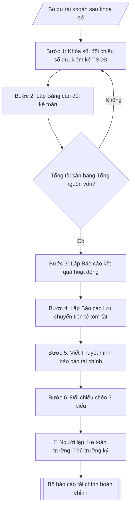

# Lập báo cáo tài chính (chế độ kế toán HCSN)

## Định dạng và file đầu ra
Định dạng đầu ra có thể chọn theo sản phẩm/yêu cầu: .xlsx, .csv, .pdf. Đọc mục “Định dạng bổ sung” trong quy cách đầu ra trước khi chọn.

**Phải tạo file thực tế để tải xuống, không chỉ trả nội dung trong chat.** Định dạng mặc định của skill: **.xlsx**. Nếu yêu cầu gồm cả báo cáo thuyết minh, tạo thêm file Word cho báo cáo; không ghép báo cáo dài vào bảng tính. Không chờ người dùng yêu cầu xuất file lần nữa. Ưu tiên định dạng người dùng chỉ định; đọc quy tắc xuất file tại references/quy-cach-dau-ra.md.

## Quy cách đầu ra và thông tin thiếu
Khi dựng file Word/Excel, áp dụng mục “Thể thức và bảng biểu khi dựng file” trong quy cách đầu ra (cỡ chữ từng thành phần, bảng nhiều trang, số trang, phụ lục). Đọc [quy cách và cấu trúc sản phẩm](references/quy-cach-dau-ra.md) trước khi soạn/xuất. File giao chỉ gồm sản phẩm nghiệp vụ được yêu cầu; kiểm tra nội bộ không xuất kèm. Thiếu thông tin thì giữ nguyên trường/mục và chỗ điền theo mẫu gốc (dòng dấu chấm, dấu gạch hoặc ô trống); không tự điền dữ liệu mẫu, số 0, mã chờ xác minh hay dòng chờ ký. Mẫu chuyên ngành còn áp dụng được ưu tiên về cấu trúc, mã biểu và người ký. Bản đầy đủ: [quy tắc chung](references/quy-tac-chung.md).

Khi báo cáo có số liệu cần so sánh hoặc nêu xu hướng, đọc mục “Biểu đồ và hình trong báo cáo số liệu” trong quy cách đầu ra trước khi vẽ.

## Kiểm soát áp dụng và phê duyệt
Trước khi chạy, xác định `ngay_ap_dung`, `loai_hinh_truong`, `quy_che_noi_bo`, `nguon_du_lieu`, `nguoi_kiem_duyet`; chỉ hỏi thông tin liên quan nghiệp vụ, không dùng giá trị giả định thay dữ liệu bắt buộc. Đối chiếu căn cứ pháp lý với văn bản gốc, hiệu lực, điều khoản áp dụng và chuyển tiếp. Bản đầy đủ: [quy tắc chung](references/quy-tac-chung.md).

Nếu có cập nhật pháp lý dưới đây, đọc [căn cứ và điều kiện áp dụng](references/phap-ly.md) trước khi làm. Quy trình dưới đây giữ nghiệp vụ từ bản gốc; mọi viện dẫn văn bản, mẫu biểu, điều khoản phải theo căn cứ đã chọn trong phap-ly.md, không theo văn bản cũ.

## Giới hạn và human gate
AI hỗ trợ chuẩn bị và đối chiếu; cán bộ phụ trách kiểm tra dữ liệu/căn cứ, người có thẩm quyền duyệt và ký. Không đánh dấu đã ký, đã duyệt, đã công bố khi chưa có chứng cứ. Dữ liệu sinh viên, sức khỏe, nhân sự, tài chính chỉ dùng theo mục đích và phân quyền, che thông tin định danh khi dùng ví dụ (Luật 91/2025/QH15, hiệu lực 01/01/2026); không tải dữ liệu lên dịch vụ ngoài khi chưa có quyền. Bản đầy đủ: [quy tắc chung](references/quy-tac-chung.md).

## Khi nào dùng
Khi kết thúc năm tài chính, cần lập bộ báo cáo tài chính của đơn vị hành chính sự nghiệp
theo văn bản hiện hành nêu tại phap-ly.md: Bảng cân đối kế toán, Báo cáo kết quả hoạt động,
Báo cáo lưu chuyển tiền tệ và Thuyết minh báo cáo tài chính.

## Đầu vào (Input)
| Trường | Mô tả | Bắt buộc |
|---|---|---|
| `nam_tai_chinh` | Năm tài chính lập báo cáo (vd: 2026) | Có |
| `so_du_tai_khoan` | Số dư cuối kỳ các tài khoản kế toán (tài sản, nguồn vốn, thu, chi) sau khi khóa sổ | Có |
| `so_dau_nam` | Số dư đầu năm để lập cột so sánh (Bảng cân đối kế toán) | Có |
| `che_do` | Chế độ kế toán áp dụng (mặc định: văn bản hiện hành nêu tại phap-ly.md) | Không |
| `don_vi_tinh` | Đơn vị tính (mặc định: triệu đồng) | Không |
| `nguoi_lap` | Người lập báo cáo | Có |
| `ke_toan_truong` | Kế toán trưởng | Có |
| `nguoi_ky` | Thủ trưởng đơn vị ký báo cáo | Có |

## Quy trình
**Ràng buộc pháp lý khi thực hiện** (trích references/phap-ly.md; đối chiếu toàn văn và hiệu lực tại ngày nghiệp vụ):
- Thông tư 24/2024/TT-BTC, áp dụng từ năm tài chính 2025; sửa đổi 46/2025: Phân biệt năm tài chính, chế độ kế toán, chứng từ, sổ và báo cáo; dùng hệ thống biểu mẫu của 24/2024 cùng sửa đổi 46/2025 theo thời điểm. Không chuyển mã tài khoản hoặc mẫu cũ cơ học; đối chiếu sổ, số dư đầu/cuối kỳ và xác nhận của kế toán trưởng.
- Trước Bước 1: chọn căn cứ theo đối tượng, loại hình trường và chuyển tiếp; lập bảng văn bản / điều khoản / lý do áp dụng / bằng chứng. Thiếu văn bản gốc hoặc điều khoản thì ghi nhận nội bộ [CẦN XÁC MINH] (không đưa vào file giao), để trống phần tương ứng, chưa kết luận tuân thủ.
- Các con số, thời hạn, số điều, số mức xếp loại, hệ số và mẫu biểu nêu trong các bước dưới đây được giữ từ quy trình gốc (trước cập nhật pháp lý); chỉ dùng khi đã đối chiếu đúng với căn cứ đã chọn, khác thì theo căn cứ. Danh sách điểm cần đối chiếu: docs/DIEM_CAN_DOI_CHIEU_PHAP_LY.md.

**Bước 1. Khóa sổ và đối chiếu số liệu**
- Làm gì: đảm bảo đã hạch toán đầy đủ chứng từ của `nam_tai_chinh`; đối chiếu số dư tiền mặt
  với sổ quỹ, tiền gửi ngân hàng với sao kê; tổ chức kiểm kê tài sản cố định; đối chiếu số
  liệu giữa sổ chi tiết và sổ tổng hợp cho từng tài khoản trong `so_du_tai_khoan`.
- Dùng input: `so_du_tai_khoan`, `so_dau_nam`, `nam_tai_chinh`.
- Vai trò: Chuyên viên Phòng TCKT · AI hỗ trợ: tổng hợp, chuẩn hóa dữ liệu, đối chiếu tự động, cảnh báo sai lệch · ⏱ ~1–2 giờ (ước tính)
- Lưu ý nghiệp vụ: chỉ lập báo cáo khi sổ đã khóa và mọi chênh lệch đối chiếu đã được xử lý;
  số dư đầu năm phải khớp với số cuối năm của báo cáo năm trước đã công bố.
- → Kết quả bước: biên bản khóa sổ (xác nhận số dư các tài khoản đã đối chiếu khớp).

**Bước 2. Lập Bảng cân đối kế toán**
- Làm gì: dựng hai phần của bảng: Phần Tài sản (tiền và tương đương tiền; các khoản phải thu;
  hàng tồn kho; tài sản cố định = nguyên giá − hao mòn lũy kế; tài sản dở dang; đầu tư tài
  chính nếu có) và Phần Nguồn vốn (các khoản phải trả; các quỹ; nguồn kinh phí, nguồn vốn
  khác; thặng dư/thâm hụt lũy kế); lập 2 cột Đầu năm (`so_dau_nam`) – Cuối năm theo
  `don_vi_tinh`; kiểm tra đẳng thức **Tổng tài sản = Tổng nguồn vốn**.
- Dùng input: `so_du_tai_khoan`, `so_dau_nam`, `don_vi_tinh`.
- Vai trò: Chuyên viên Phòng TCKT · AI hỗ trợ: đối chiếu tự động, cảnh báo sai lệch, lập bảng biểu, định dạng · ⏱ ~30–60 phút (ước tính)
- Lưu ý nghiệp vụ: giá trị còn lại TSCĐ = nguyên giá − hao mòn lũy kế, không lấy nguyên giá;
  nếu bảng không cân, quay lại Bước 1 rà soát bút toán — không tự ý điều chỉnh số cho cân.
- → Kết quả bước: Bảng cân đối kế toán đã cân (Tổng tài sản = Tổng nguồn vốn).

**Bước 3. Lập Báo cáo kết quả hoạt động**
- Làm gì: tổng hợp thu hoạt động (thu phí, lệ phí; thu SXKD, dịch vụ; thu NSNN cấp; thu khác)
  và chi hoạt động (chi phí tiền lương; vật tư, công cụ; hao mòn TSCĐ; dịch vụ mua ngoài;
  chi phí bằng tiền khác); tính **thặng dư/thâm hụt = tổng thu − tổng chi**.
- Dùng input: `so_du_tai_khoan` (các tài khoản thu, chi).
- Vai trò: Chuyên viên Phòng TCKT · AI hỗ trợ: tổng hợp, chuẩn hóa dữ liệu, tính toán, phân tích số liệu · ⏱ ~30–60 phút (ước tính)
- Lưu ý nghiệp vụ: chi phí hao mòn TSCĐ là chi phí không bằng tiền — vẫn phải ghi nhận đầy
  đủ; phân biệt chi hoạt động với chi đầu tư (mua sắm TSCĐ không ghi vào chi hoạt động).
- → Kết quả bước: Báo cáo kết quả hoạt động (tổng thu, tổng chi, thặng dư/thâm hụt).

**Bước 4. Lập Báo cáo lưu chuyển tiền tệ (tóm tắt)**
- Làm gì: tổng hợp 3 dòng tiền: hoạt động chính (thu – chi bằng tiền), hoạt động đầu tư
  (mua sắm TSCĐ, XDCB), hoạt động tài chính; tính tăng/giảm tiền thuần trong năm; đối chiếu
  số dư tiền cuối kỳ với chỉ tiêu "Tiền và tương đương tiền" trên Bảng cân đối (Bước 2).
- Dùng input: `so_du_tai_khoan`, kết quả Bước 2.
- Vai trò: Chuyên viên Phòng TCKT · AI hỗ trợ: tổng hợp, chuẩn hóa dữ liệu, đối chiếu tự động, cảnh báo sai lệch · ⏱ ~30–60 phút (ước tính)
- Lưu ý nghiệp vụ: tiền cuối kỳ trên báo cáo lưu chuyển tiền tệ phải khớp tuyệt đối với
  Bảng cân đối — đây là điểm đối chiếu chéo bắt buộc.
- → Kết quả bước: Báo cáo lưu chuyển tiền tệ tóm tắt (tiền cuối kỳ đã khớp Bảng cân đối).

**Bước 5. Viết Thuyết minh báo cáo tài chính (ngắn)**
- Làm gì: trình bày đặc điểm hoạt động của đơn vị; chế độ kế toán áp dụng (`che_do`);
  chính sách kế toán chủ yếu (ghi nhận TSCĐ, trích hao mòn, phân bổ chi phí); giải thích
  các khoản mục biến động lớn so với đầu năm.
- Dùng input: `che_do`, kết quả Bước 2 – 4.
- Vai trò: Chuyên viên Phòng TCKT · AI hỗ trợ: soạn dự thảo, chuẩn bị hồ sơ trình đầy đủ · ⏱ ~30–60 phút (ước tính)
- Lưu ý nghiệp vụ: mọi khoản mục biến động lớn (TSCĐ tăng, quỹ tăng...) đều phải có lời
  giải thích gắn với sự kiện thực tế trong năm (đưa vào sử dụng công trình, trích lập quỹ...).
- → Kết quả bước: Thuyết minh báo cáo tài chính.

**Bước 6. Đối chiếu chéo, ký duyệt và lưu hồ sơ**
- Làm gì: đối chiếu chéo 3 biểu — tiền cuối kỳ (lưu chuyển tiền tệ) = tiền trên Bảng cân đối;
  thặng dư năm (kết quả hoạt động) liên kết với thặng dư lũy kế (Bảng cân đối); lấy đầy đủ
  chữ ký theo thứ tự: người lập → kế toán trưởng → thủ trưởng đơn vị
  (`nguoi_lap` / `ke_toan_truong` / `nguoi_ky`); lưu hồ sơ theo quy định và nộp cho cơ quan
  chủ quản, cơ quan tài chính đúng thời hạn.
- Dùng input: `nguoi_lap`, `ke_toan_truong`, `nguoi_ky`, kết quả Bước 2 – 5.
- Vai trò: Chuyên viên Phòng TCKT (đối chiếu, hoàn thiện); Kế toán trưởng và Thủ trưởng đơn vị ký duyệt · AI hỗ trợ: đối chiếu tự động, cảnh báo sai lệch, lưu trữ hồ sơ · ⏱ ~1–3 giờ (ước tính)
- Lưu ý nghiệp vụ: thiếu một trong ba chữ ký thì bộ báo cáo chưa có giá trị pháp lý để nộp.
- → Kết quả bước: bộ báo cáo tài chính hoàn chỉnh, đã ký duyệt.

## Luồng quy trình (Workflow)

## Đầu ra
- Bảng cân đối kế toán (tài sản / nguồn vốn, cột đầu năm – cuối năm).
- Báo cáo kết quả hoạt động (thu – chi – thặng dư/thâm hụt).
- Báo cáo lưu chuyển tiền tệ (tóm tắt).
- Thuyết minh báo cáo tài chính (ngắn).

File nghiệp vụ thực tế theo định dạng mặc định ở đầu skill hoặc định dạng người dùng yêu cầu, kèm liên kết tải trong phản hồi cuối.

Sản phẩm nghiệp vụ hoàn chỉnh theo [quy cách và cấu trúc](references/quy-cach-dau-ra.md), giữ các trường chưa có dữ liệu ở trạng thái trống. Không xuất kèm checklist/phụ lục kiểm tra đầu ra.

## Kiểm tra nội bộ trước khi giao
Các tiêu chí sau dùng để tự đối chiếu; không sao chép vào file xuất. Mục thiếu dữ liệu được để trống, không đánh dấu đã đạt hoặc đã duyệt.

- [ ] Đủ các phần và đúng bố cục theo cấu trúc tại references/quy-cach-dau-ra.md (không theo cấu trúc của bản gốc).
- [ ] Có đầy đủ sản phẩm: Bảng cân đối kế toán (tài sản / nguồn vốn, cột đầu năm – cuối năm)
- [ ] Có đầy đủ sản phẩm: Báo cáo kết quả hoạt động (thu – chi – thặng dư/thâm hụt)
- [ ] Mọi số liệu, tên, ngày tháng trong output khớp với Input đã cung cấp (không thêm bớt, không suy đoán)
- [ ] Không bịa đặt số liệu, minh chứng, trích dẫn hay căn cứ
- [ ] Đúng thể thức, định dạng văn bản theo quy định hiện hành
- [ ] Căn cứ pháp lý nêu đầy đủ, còn hiệu lực tại thời điểm lập
- [ ] Đã qua Human gate: người có thẩm quyền đã kiểm tra/ký duyệt trước khi phát hành
- [ ] Chỉ lập báo cáo khi sổ đã khóa và mọi chênh lệch đối chiếu đã được xử lý
- [ ] Giá trị còn lại TSCĐ = nguyên giá − hao mòn lũy kế, không lấy nguyên giá

## Căn cứ & lưu ý
- Căn cứ hiện hành: xem [căn cứ và điều kiện áp dụng](references/phap-ly.md); phải đối chiếu văn bản gốc, hiệu lực và chuyển tiếp tại ngày nghiệp vụ.
- Số liệu 3 biểu phải đối chiếu khớp nhau: tiền cuối kỳ (B03) = tiền trên Bảng cân đối;
  thặng dư năm (B02) liên kết với thặng dư lũy kế (B01).
- Báo cáo tài chính năm phải được lập, ký duyệt và nộp cho cơ quan chủ quản, cơ quan
  tài chính theo thời hạn quy định.
- Không dùng tên thật của trường/cá nhân khi mô phỏng.

## Tư liệu đối chiếu
Bản gốc trước cập nhật pháp lý (kèm ví dụ giả lập) lưu tại `references/quy-trinh-lich-su.md`, chỉ để đối chiếu hồ sơ lịch sử; không dùng căn cứ, mẫu hay số liệu trong đó làm chỉ dẫn hiện hành.

## Quản trị phiên bản
- Phiên bản gói `1.3.2` (cập nhật 2026-10-10); hồ sơ đầy đủ tại [references/version.json](references/version.json).
- Người phê duyệt nghiệp vụ: **chưa chỉ định**. Trạng thái: dự thảo nghiệp vụ; kiểm tra pháp lý trước thực thi. Ngày cập nhật không đồng nghĩa mọi văn bản đã được rà soát toàn văn.
- Giấy phép theo LICENSE của kho (bản quyền CES Global). Lịch sử thay đổi: CHANGELOG.md.
