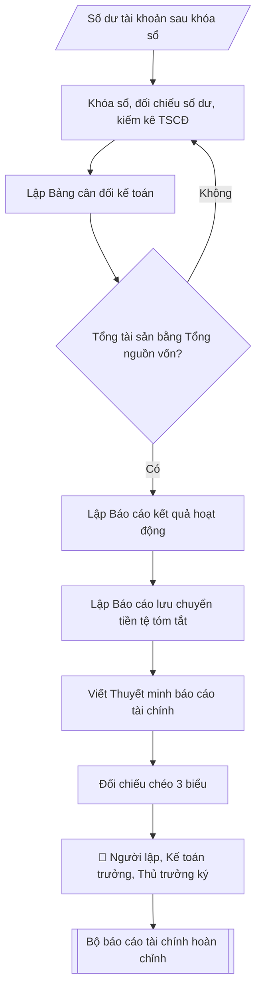

# Tư liệu lịch sử – không phải quy trình hiện hành

Nội dung từ phiên bản nguồn trước 1.1.0, giữ để đối chiếu dữ liệu đầu vào và thay đổi; căn cứ, điều kiện, mẫu và ví dụ có thể đã lỗi thời. Không dùng để thực hiện nghiệp vụ hiện tại.

## Khi nào dùng
Khi kết thúc năm tài chính, cần lập bộ báo cáo tài chính của đơn vị hành chính sự nghiệp
theo Thông tư 107/2017/TT-BTC: Bảng cân đối kế toán, Báo cáo kết quả hoạt động,
Báo cáo lưu chuyển tiền tệ và Thuyết minh báo cáo tài chính.

## Đầu vào (Input)

| Trường | Mô tả | Bắt buộc |
|---|---|---|
| `nam_tai_chinh` | Năm tài chính lập báo cáo (vd: 2026) | Có |
| `so_du_tai_khoan` | Số dư cuối kỳ các tài khoản kế toán (tài sản, nguồn vốn, thu, chi) sau khi khóa sổ | Có |
| `so_dau_nam` | Số dư đầu năm để lập cột so sánh (Bảng cân đối kế toán) | Có |
| `che_do` | Chế độ kế toán áp dụng (mặc định: Thông tư 107/2017/TT-BTC) | Không |
| `don_vi_tinh` | Đơn vị tính (mặc định: triệu đồng) | Không |
| `nguoi_lap` / `ke_toan_truong` / `nguoi_ky` | Người lập, Kế toán trưởng, Thủ trưởng đơn vị ký báo cáo | Có |

## Quy trình

**Bước 1. Khóa sổ và đối chiếu số liệu**
- Làm gì: đảm bảo đã hạch toán đầy đủ chứng từ của `nam_tai_chinh`; đối chiếu số dư tiền mặt
  với sổ quỹ, tiền gửi ngân hàng với sao kê; tổ chức kiểm kê tài sản cố định; đối chiếu số
  liệu giữa sổ chi tiết và sổ tổng hợp cho từng tài khoản trong `so_du_tai_khoan`.
- Dùng input: `so_du_tai_khoan`, `so_dau_nam`, `nam_tai_chinh`.
- Vai trò: Chuyên viên Phòng TCKT · AI hỗ trợ: tổng hợp, chuẩn hóa dữ liệu, đối chiếu tự động, cảnh báo sai lệch · ⏱ ~1–2 giờ (ước tính)
- Lưu ý nghiệp vụ: chỉ lập báo cáo khi sổ đã khóa và mọi chênh lệch đối chiếu đã được xử lý;
  số dư đầu năm phải khớp với số cuối năm của báo cáo năm trước đã công bố.
- → Kết quả bước: biên bản khóa sổ (xác nhận số dư các tài khoản đã đối chiếu khớp).

**Bước 2. Lập Bảng cân đối kế toán**
- Làm gì: dựng hai phần của bảng: Phần Tài sản (tiền và tương đương tiền; các khoản phải thu;
  hàng tồn kho; tài sản cố định = nguyên giá − hao mòn lũy kế; tài sản dở dang; đầu tư tài
  chính nếu có) và Phần Nguồn vốn (các khoản phải trả; các quỹ; nguồn kinh phí, nguồn vốn
  khác; thặng dư/thâm hụt lũy kế); lập 2 cột Đầu năm (`so_dau_nam`) – Cuối năm theo
  `don_vi_tinh`; kiểm tra đẳng thức **Tổng tài sản = Tổng nguồn vốn**.
- Dùng input: `so_du_tai_khoan`, `so_dau_nam`, `don_vi_tinh`.
- Vai trò: Chuyên viên Phòng TCKT · AI hỗ trợ: đối chiếu tự động, cảnh báo sai lệch, lập bảng biểu, định dạng · ⏱ ~30–60 phút (ước tính)
- Lưu ý nghiệp vụ: giá trị còn lại TSCĐ = nguyên giá − hao mòn lũy kế, không lấy nguyên giá;
  nếu bảng không cân, quay lại Bước 1 rà soát bút toán — không tự ý điều chỉnh số cho cân.
- → Kết quả bước: Bảng cân đối kế toán đã cân (Tổng tài sản = Tổng nguồn vốn).

**Bước 3. Lập Báo cáo kết quả hoạt động**
- Làm gì: tổng hợp thu hoạt động (thu phí, lệ phí; thu SXKD, dịch vụ; thu NSNN cấp; thu khác)
  và chi hoạt động (chi phí tiền lương; vật tư, công cụ; hao mòn TSCĐ; dịch vụ mua ngoài;
  chi phí bằng tiền khác); tính **thặng dư/thâm hụt = tổng thu − tổng chi**.
- Dùng input: `so_du_tai_khoan` (các tài khoản thu, chi).
- Vai trò: Chuyên viên Phòng TCKT · AI hỗ trợ: tổng hợp, chuẩn hóa dữ liệu, tính toán, phân tích số liệu · ⏱ ~30–60 phút (ước tính)
- Lưu ý nghiệp vụ: chi phí hao mòn TSCĐ là chi phí không bằng tiền — vẫn phải ghi nhận đầy
  đủ; phân biệt chi hoạt động với chi đầu tư (mua sắm TSCĐ không ghi vào chi hoạt động).
- → Kết quả bước: Báo cáo kết quả hoạt động (tổng thu, tổng chi, thặng dư/thâm hụt).

**Bước 4. Lập Báo cáo lưu chuyển tiền tệ (tóm tắt)**
- Làm gì: tổng hợp 3 dòng tiền: hoạt động chính (thu – chi bằng tiền), hoạt động đầu tư
  (mua sắm TSCĐ, XDCB), hoạt động tài chính; tính tăng/giảm tiền thuần trong năm; đối chiếu
  số dư tiền cuối kỳ với chỉ tiêu "Tiền và tương đương tiền" trên Bảng cân đối (Bước 2).
- Dùng input: `so_du_tai_khoan`, kết quả Bước 2.
- Vai trò: Chuyên viên Phòng TCKT · AI hỗ trợ: tổng hợp, chuẩn hóa dữ liệu, đối chiếu tự động, cảnh báo sai lệch · ⏱ ~30–60 phút (ước tính)
- Lưu ý nghiệp vụ: tiền cuối kỳ trên báo cáo lưu chuyển tiền tệ phải khớp tuyệt đối với
  Bảng cân đối — đây là điểm đối chiếu chéo bắt buộc.
- → Kết quả bước: Báo cáo lưu chuyển tiền tệ tóm tắt (tiền cuối kỳ đã khớp Bảng cân đối).

**Bước 5. Viết Thuyết minh báo cáo tài chính (ngắn)**
- Làm gì: trình bày đặc điểm hoạt động của đơn vị; chế độ kế toán áp dụng (`che_do`);
  chính sách kế toán chủ yếu (ghi nhận TSCĐ, trích hao mòn, phân bổ chi phí); giải thích
  các khoản mục biến động lớn so với đầu năm.
- Dùng input: `che_do`, kết quả Bước 2 – 4.
- Vai trò: Chuyên viên Phòng TCKT · AI hỗ trợ: soạn dự thảo, chuẩn bị hồ sơ trình đầy đủ · ⏱ ~30–60 phút (ước tính)
- Lưu ý nghiệp vụ: mọi khoản mục biến động lớn (TSCĐ tăng, quỹ tăng...) đều phải có lời
  giải thích gắn với sự kiện thực tế trong năm (đưa vào sử dụng công trình, trích lập quỹ...).
- → Kết quả bước: Thuyết minh báo cáo tài chính.

**Bước 6. Đối chiếu chéo, ký duyệt và lưu hồ sơ**
- Làm gì: đối chiếu chéo 3 biểu — tiền cuối kỳ (lưu chuyển tiền tệ) = tiền trên Bảng cân đối;
  thặng dư năm (kết quả hoạt động) liên kết với thặng dư lũy kế (Bảng cân đối); lấy đầy đủ
  chữ ký theo thứ tự: người lập → kế toán trưởng → thủ trưởng đơn vị
  (`nguoi_lap` / `ke_toan_truong` / `nguoi_ky`); lưu hồ sơ theo quy định và nộp cho cơ quan
  chủ quản, cơ quan tài chính đúng thời hạn.
- Dùng input: `nguoi_lap` / `ke_toan_truong` / `nguoi_ky`, kết quả Bước 2 – 5.
- Vai trò: Chuyên viên Phòng TCKT (đối chiếu, hoàn thiện); Kế toán trưởng và Thủ trưởng đơn vị ký duyệt · AI hỗ trợ: đối chiếu tự động, cảnh báo sai lệch, lưu trữ hồ sơ · ⏱ ~1–3 giờ (ước tính)
- Lưu ý nghiệp vụ: thiếu một trong ba chữ ký thì bộ báo cáo chưa có giá trị pháp lý để nộp.
- → Kết quả bước: bộ báo cáo tài chính hoàn chỉnh, đã ký duyệt.

## Luồng quy trình (Workflow)

## Đầu ra (Output)
- Bảng cân đối kế toán (tài sản / nguồn vốn, cột đầu năm – cuối năm).
- Báo cáo kết quả hoạt động (thu – chi – thặng dư/thâm hụt).
- Báo cáo lưu chuyển tiền tệ (tóm tắt).
- Thuyết minh báo cáo tài chính (ngắn).

**Cấu trúc output chuẩn:** khung mẫu cố định của bộ báo cáo tài chính, các phần theo đúng
thứ tự xuất hiện:
1. Tiêu đề bộ báo cáo (tên đơn vị, năm tài chính, đơn vị tính);
2. Biểu 1: Bảng cân đối kế toán (cột: chỉ tiêu, đầu năm, cuối năm; hai phần Tài sản /
   Nguồn vốn; dòng tổng cộng hai bên bằng nhau);
3. Biểu 2: Báo cáo kết quả hoạt động (tổng thu hoạt động chi tiết, tổng chi hoạt động
   chi tiết, thặng dư/thâm hụt = tổng thu − tổng chi);
4. Biểu 3: Báo cáo lưu chuyển tiền tệ tóm tắt (3 dòng tiền, tăng tiền thuần, tiền đầu kỳ,
   tiền cuối kỳ khớp với Bảng cân đối);
5. Thuyết minh báo cáo tài chính (đặc điểm đơn vị, chế độ kế toán, chính sách kế toán,
   giải thích biến động lớn);
6. Chữ ký: người lập, kế toán trưởng, thủ trưởng đơn vị (ký, đóng dấu, ghi rõ họ tên).

## Checklist nghiệm thu

- [ ] Đủ các phần theo "Cấu trúc output chuẩn": Tiêu đề bộ báo cáo (tên đơn vị, năm tài…; Biểu 1; Biểu 2; Biểu 3; Thuyết minh báo cáo tài chính (đặc điểm đơn…; Chữ ký
- [ ] Có đầy đủ sản phẩm: Bảng cân đối kế toán (tài sản / nguồn vốn, cột đầu năm – cuối năm)
- [ ] Có đầy đủ sản phẩm: Báo cáo kết quả hoạt động (thu – chi – thặng dư/thâm hụt)
- [ ] Mọi số liệu, tên, ngày tháng trong output khớp với Input đã cung cấp (không thêm bớt, không suy đoán)
- [ ] Không bịa đặt số liệu, minh chứng, trích dẫn hay căn cứ
- [ ] Đúng thể thức, định dạng văn bản theo quy định hiện hành
- [ ] Căn cứ pháp lý nêu đầy đủ, còn hiệu lực tại thời điểm lập
- [ ] Đã qua Human gate: người có thẩm quyền đã kiểm tra/ký duyệt trước khi phát hành
- [ ] Chỉ lập báo cáo khi sổ đã khóa và mọi chênh lệch đối chiếu đã được xử lý
- [ ] Giá trị còn lại TSCĐ = nguyên giá − hao mòn lũy kế, không lấy nguyên giá

> Tiêu chí đạt: tất cả các ô đều được đánh dấu.

## Ví dụ mô phỏng (dữ liệu giả lập)

> Tất cả tên trường, cá nhân, số liệu dưới đây đều là **giả lập**, không liên quan tổ chức/cá nhân có thật.

### Input mẫu

| Trường | Giá trị |
|---|---|
| `nam_tai_chinh` | 2026 |
| `so_du_tai_khoan` | Xem các biểu Output mẫu (đơn vị: triệu đồng) |
| `so_dau_nam` | Xem cột "Đầu năm" trong Bảng cân đối kế toán |
| `nguoi_lap` | ThS. Lê Thị C |
| `ke_toan_truong` | ThS. Lê Thị A |
| `nguoi_ky` | PGS.TS. Trần Văn D (Hiệu trưởng) |

### Output mẫu

**Đơn vị: Trường Đại học A — Báo cáo tài chính năm 2026** (đơn vị tính: triệu đồng)

**Biểu 1: Bảng cân đối kế toán tại ngày 31/12/2026**

| Chỉ tiêu | Đầu năm | Cuối năm |
|---|---|---:|
| **A. TÀI SẢN** | | |
| I. Tiền và các khoản tương đương tiền | 18.500 | 22.300 |
| II. Các khoản phải thu | 6.200 | 7.100 |
| III. Hàng tồn kho (vật tư, công cụ) | 1.800 | 2.000 |
| IV. Tài sản cố định (giá trị còn lại) | 210.000 | 228.500 |
| V. Tài sản dở dang (XDCB) | 12.000 | 8.400 |
| **TỔNG CỘNG TÀI SẢN** | **248.500** | **268.300** |
| **B. NGUỒN VỐN** | | |
| I. Các khoản phải trả | 9.800 | 10.600 |
| II. Các quỹ (phát triển HĐSN, khen thưởng, phúc lợi...) | 28.700 | 34.200 |
| III. Nguồn kinh phí, nguồn vốn khác | 198.000 | 210.500 |
| IV. Thặng dư lũy kế chưa phân phối | 12.000 | 13.000 |
| **TỔNG CỘNG NGUỒN VỐN** | **248.500** | **268.300** |

**Biểu 2: Báo cáo kết quả hoạt động năm 2026**

| Chỉ tiêu | Năm nay |
|---|---:|
| **I. Tổng thu hoạt động** | **171.500** |
| 1. Thu phí, lệ phí (học phí) | 93.500 |
| 2. Thu hoạt động SXKD, dịch vụ | 25.200 |
| 3. Thu ngân sách nhà nước cấp | 45.000 |
| 4. Thu khác | 7.800 |
| **II. Tổng chi hoạt động** | **168.500** |
| 1. Chi phí tiền lương, phụ cấp | 75.100 |
| 2. Chi phí vật tư, công cụ dụng cụ | 18.400 |
| 3. Chi phí hao mòn tài sản cố định | 21.000 |
| 4. Chi phí dịch vụ mua ngoài | 38.600 |
| 5. Chi phí bằng tiền khác (học bổng, hỗ trợ SV, NCKH...) | 15.400 |
| **III. Thặng dư hoạt động trong năm (I − II)** | **3.000** |

**Biểu 3: Báo cáo lưu chuyển tiền tệ năm 2026 (tóm tắt)**

| Chỉ tiêu | Số tiền |
|---|---:|
| 1. Dòng tiền thuần từ hoạt động chính | +18.600 |
| 2. Dòng tiền thuần từ hoạt động đầu tư (mua sắm TSCĐ, XDCB) | −15.800 |
| 3. Dòng tiền thuần từ hoạt động tài chính | +1.000 |
| **Tăng tiền thuần trong năm** | **+3.800** |
| Tiền và tương đương tiền đầu năm | 18.500 |
| **Tiền và tương đương tiền cuối năm** | **22.300** |

**Thuyết minh báo cáo tài chính (ngắn)**
- Trường Đại học A là đơn vị sự nghiệp công lập tự chủ tài chính, hoạt động chính
  là đào tạo đại học, sau đại học và nghiên cứu khoa học.
- Báo cáo được lập theo chế độ kế toán hành chính sự nghiệp ban hành kèm theo
  Thông tư 107/2017/TT-BTC ngày 10/10/2017 của Bộ Tài chính.
- Tài sản cố định được ghi nhận theo nguyên giá và trích hao mòn theo quy định;
  giá trị còn lại TSCĐ cuối năm tăng 18.500 triệu đồng do đưa vào sử dụng 02 phòng
  thí nghiệm mới và hệ thống máy chủ phục vụ đào tạo.
- Thặng dư hoạt động năm 2026 là 3.000 triệu đồng, được trích lập các quỹ theo Quy chế
  chi tiêu nội bộ và quy định hiện hành.

Người lập: ThS. Lê Thị C — Kế toán trưởng: ThS. Lê Thị A —
Thủ trưởng đơn vị: PGS.TS. Trần Văn D (ký, đóng dấu).

## Căn cứ & lưu ý
- Thông tư 107/2017/TT-BTC ngày 10/10/2017 của Bộ Tài chính hướng dẫn chế độ kế toán
  hành chính, sự nghiệp (mẫu biểu B01-H, B02-H, B03-H, B09-H).
- Số liệu 3 biểu phải đối chiếu khớp nhau: tiền cuối kỳ (B03) = tiền trên Bảng cân đối;
  thặng dư năm (B02) liên kết với thặng dư lũy kế (B01).
- Báo cáo tài chính năm phải được lập, ký duyệt và nộp cho cơ quan chủ quản, cơ quan
  tài chính theo thời hạn quy định.
- Không dùng tên thật của trường/cá nhân khi mô phỏng.
