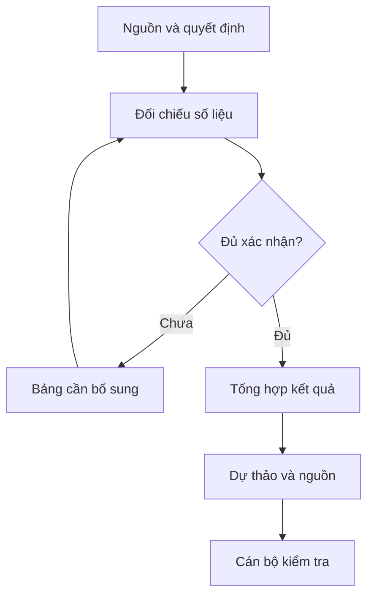

# Báo cáo tổng kết công tác thi đua, khen thưởng

## Khi nào dùng

Tổng hợp kết quả thi đua, khen thưởng đã có quyết định hoặc hồ sơ xác nhận trong kỳ. Chuẩn bị dự thảo báo cáo và bảng đối chiếu để cán bộ phụ trách kiểm tra trước trình lãnh đạo.

## Đầu vào

| Trường | Nội dung | Bắt buộc |
| --- | --- | --- |
| `ky_bao_cao` | Năm học/năm công tác và thời điểm chốt số liệu | Có |
| `quyet_dinh_khen_thuong` | Số, ngày, loại danh hiệu/hình thức, đơn vị và số lượng đã được phê duyệt | Có |
| `bao_cao_don_vi` | Số liệu đã xác nhận của từng đơn vị, nguồn và người xác nhận | Có |
| `ho_so_dang_trinh` | Hồ sơ đang đề nghị; tách khỏi kết quả được tặng | Khi có |
| `so_lieu_ky_truoc` | Số liệu kỳ trước có cùng phạm vi để so sánh | Khi cần so sánh |
| `nhan_xet_da_duyet` | Nhận xét về công tác tổ chức đã được cán bộ phụ trách xác nhận | Không |
| `phuong_huong_da_duyet` | Nhiệm vụ và chỉ tiêu kỳ tới đã được lãnh đạo xác nhận | Khi có |
| `thong_tin_trinh_ky` | Người dự kiến ký, căn cứ thẩm quyền, ngày dự kiến, nơi nhận | Có |

## Kiểm soát áp dụng và phê duyệt

Xác định `ngay_ap_dung`, `loai_hinh_truong`, `quy_che_noi_bo`, `nguon_du_lieu` và `nguoi_kiem_duyet` trong phạm vi nghiệp vụ. Kiểm tra văn bản gốc, hiệu lực và điều khoản áp dụng; thiếu căn cứ ghi [CẦN XÁC MINH]. Không suy ra văn bản còn hiệu lực chỉ từ ngày cập nhật skill.

## Quy trình

1. Kiểm tra kỳ, thời điểm chốt và nguồn của từng dòng. Thiếu quyết định hoặc xác nhận thì ghi [CHƯA XÁC NHẬN], không tính vào kết quả đã ban hành.
2. Đối chiếu số liệu đơn vị với quyết định; lập bảng số liệu nguồn / số liệu báo cáo / chênh lệch / người cần xác nhận. Không tự chọn một nguồn khi có mâu thuẫn.
3. Tổng hợp số lượng theo loại danh hiệu, hình thức khen thưởng và đơn vị; giữ tách biệt tập thể/cá nhân và đã được tặng/đang đề nghị. Tránh đếm trùng người hay hồ sơ; không cộng các đại lượng khác đơn vị tính.
4. Chỉ tính biến động so với kỳ trước khi có dữ liệu cùng phạm vi. Nếu mẫu số bằng 0 hoặc không có dữ liệu, ghi không tính được; không tự đặt tỷ lệ tăng/giảm.
5. Soạn báo cáo gồm kết quả đã xác nhận, vấn đề đối chiếu còn mở và nhiệm vụ kỳ tới đã được cung cấp. Chỉ trình bày nhận xét từ `nhan_xet_da_duyet`, ghi rõ nguồn; không suy đoán nguyên nhân hay thành tích cá nhân.
6. Kiểm tra mỗi số liệu và phát biểu có nguồn truy nguyên. Xuất **DỰ THẢO – CHỜ KIỂM DUYỆT**, bảng đối chiếu và danh sách thiếu dữ liệu. Cán bộ phụ trách xác nhận nội dung; người có thẩm quyền quyết định ký/phát hành.

## Luồng quy trình

## Đầu ra

1. Dự thảo báo cáo: kỳ và phạm vi; kết quả được xác nhận; vấn đề còn mở; phương hướng đã được cung cấp; thông tin trình ký chưa cấp số chính thức.
2. Bảng thống kê và bảng truy nguyên tới quyết định/hồ sơ.
3. Danh sách dữ liệu chưa được cung cấp hoặc chưa được xác nhận.
4. Checklist kiểm tra và người kiểm duyệt dự kiến.

## Giới hạn và human gate

Chỉ hỗ trợ tổng hợp và biên tập thông tin đã được xác nhận. Không chấm điểm, xếp hạng, đề xuất cá nhân được/không được khen thưởng hoặc tự quyết định quyền lợi nhân sự. Các đánh giá và quyết định thuộc cán bộ/hội đồng có thẩm quyền.

Không tự thêm thành tích, tỷ lệ, số phiên họp, quyết định hay nhận xét tuân thủ pháp luật. Không tự gửi báo cáo, công bố, ký hoặc đánh dấu đã duyệt. Hạn chế dữ liệu cá nhân theo mục đích và phân quyền; dùng số liệu tổng hợp khi đủ đáp ứng báo cáo. Kiểm tra Luật 91/2025/QH15 và quy định áp dụng trước xử lý/chia sẻ dữ liệu cá nhân.

## Checklist nghiệm thu

- [ ] Kỳ, phạm vi và thời điểm chốt thống nhất.
- [ ] Mọi số liệu có quyết định/hồ sơ và người xác nhận.
- [ ] Tách đã được tặng và đang đề nghị; không đếm trùng.
- [ ] Không thêm nhận xét, nguyên nhân hoặc tỷ lệ khi thiếu dữ liệu.
- [ ] Báo cáo và bảng thống kê khớp nhau.
- [ ] Những điểm chưa xác minh được ghi riêng.
- [ ] Cán bộ kiểm tra và người có thẩm quyền duyệt trước phát hành.

## Ví dụ mô phỏng

Dữ liệu giả lập: quyết định đã được xác nhận ghi 18 tập thể và 96 cá nhân nhận Giấy khen; 2 hồ sơ Bằng khen đang đề nghị. Không cung cấp số liệu kỳ trước.

Đầu ra: “Trong kỳ, theo quyết định được cung cấp, có 18 tập thể và 96 cá nhân nhận Giấy khen. Có 2 hồ sơ Bằng khen đang đề nghị; chưa tính là đã được tặng. Chưa có số liệu kỳ trước để tính biến động.” Kèm nguồn cho từng con số; không thêm số phiên họp, thành tích hoặc tỷ lệ.

## Căn cứ cần đối chiếu

Luật Thi đua, khen thưởng và văn bản hướng dẫn đang áp dụng; quy chế nội bộ; quyết định và hồ sơ kỳ báo cáo. Thể thức văn bản đối chiếu Nghị định 30/2020/NĐ-CP. Bản skill chưa xác minh toàn văn mọi căn cứ chuyên ngành; cán bộ phụ trách phải chọn điều khoản hiện hành trước thực thi.

## Quản trị phiên bản

- Phiên bản gói: `1.1.1`; ngày cập nhật: `2026-10-09`.
- Kho nguồn: https://github.com/phamtruong91/dh-skills
- Người duy trì trên GitHub: `phamtruong91` (Phạm Văn Trường). Người phê duyệt nghiệp vụ: **chưa chỉ định**.
- Commit nguồn trước cập nhật: `78fd1d51b8acd1a724d9b9af6c488460bc7551ad`. Commit chứa phiên bản này xem bằng `git log -1 -- skills/bao-cao-thi-dua`; không tự gán SHA chưa tạo.
- Giấy phép: theo LICENSE của kho; bản quyền CES Global.
- Lịch sử 1.1.1: giới hạn ở tổng hợp dữ liệu đã được xác nhận; bỏ ví dụ có số liệu tự sinh và nhận xét cá nhân. Lịch sử 1.1.0: bổ sung metadata giao diện, kiểm soát áp dụng, quản trị phiên bản.
- Trạng thái: dự thảo nghiệp vụ; kiểm tra pháp lý trước thực thi. Ngày cập nhật không đồng nghĩa mọi văn bản đã được rà soát toàn văn.
