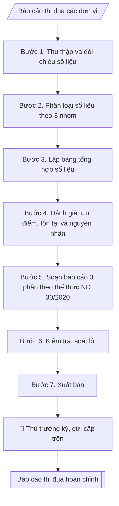

# Skill: Báo cáo tổng kết công tác thi đua, khen thưởng

## Khi nào dùng
Khi cần tổng kết, đánh giá công tác thi đua – khen thưởng của toàn trường trong một năm học
(hoặc năm công tác): tổng hợp số liệu các danh hiệu, hình thức khen thưởng đã thực hiện,
đánh giá ưu điểm – tồn tại, rút kinh nghiệm và đề ra phương hướng năm tiếp theo.
Thường dùng cuối năm học để báo cáo Ban Giám hiệu và gửi cơ quan chủ quản.

## Đầu vào (Input)

| Trường | Mô tả | Bắt buộc |
|---|---|---|
| `ky_bao_cao` | Năm học / năm công tác (VD: năm học 2025–2026) | Có |
| `so_lieu_don_vi` | Số liệu thi đua từng đơn vị: số tập thể/cá nhân đăng ký danh hiệu, kết quả đạt được | Có |
| `danh_hieu_cap_truong` | Số Giấy khen Hiệu trưởng, danh hiệu tập thể/cá nhân cấp trường đã trao | Có |
| `khen_thuong_cap_tren` | Số hồ sơ đề nghị khen thưởng cấp Bộ, cấp Nhà nước (Bằng khen Bộ, Huân chương...) và kết quả | Không |
| `phong_trao_thi_dua` | Các phong trào thi đua đã phát động, đơn vị điển hình, gương tiêu biểu | Không |
| `ton_tai_han_che` | Tồn tại, hạn chế trong công tác thi đua – khen thưởng kỳ báo cáo | Không |
| `phuong_huong` | Phương hướng, nhiệm vụ công tác thi đua – khen thưởng kỳ tới | Có |
| `so_bao_cao` | Số, ký hiệu báo cáo (VD: 96/BC-ĐHA-TCCB) | Có |
| `ngay_ky` | Ngày ký báo cáo | Có |
| `nguoi_ky` | Hiệu trưởng / Phó Hiệu trưởng phụ trách | Có |

## Quy trình

**Bước 1. Thu thập và đối chiếu số liệu**
- Làm gì: thu thập báo cáo thi đua của từng đơn vị (khoa, phòng, trung tâm) trong `ky_bao_cao`;
đối chiếu số liệu từng đơn vị với sổ theo dõi khen thưởng và các quyết định khen thưởng đã
ban hành trong kỳ; lập danh sách các đơn vị chưa gửi báo cáo hoặc số liệu có chênh lệch để
yêu cầu xác minh lại.
- Dùng input: `ky_bao_cao`, `so_lieu_don_vi`.
- Vai trò: Chuyên viên Phòng TCCB (Trưởng phòng kiểm tra lại) · AI hỗ trợ: đối chiếu chéo tự động · ⏱ ~15–30 phút (ước tính)
- Lưu ý nghiệp vụ: số liệu đơn vị tự báo cáo thường cao hơn số quyết định thực tế đã ban hành
— lấy quyết định/sổ theo dõi làm chuẩn đối chiếu; ghi rõ thời hạn chốt số liệu để các đơn vị
gửi bổ sung, tránh báo cáo bị "số liệu đến thời điểm..." mập mờ.
- → Kết quả bước: bộ số liệu thô đã đối chiếu (số liệu đơn vị | số liệu sổ theo dõi |
chênh lệch cần làm rõ).

**Bước 2. Phân loại số liệu theo 3 nhóm**
- Làm gì: phân loại số liệu đã đối chiếu ở Bước 1 thành 3 nhóm: (a) danh hiệu thi đua
(tập thể lao động xuất sắc/tiên tiến, chiến sĩ thi đua cơ sở, lao động tiên tiến...);
(b) hình thức khen thưởng (`danh_hieu_cap_truong`: Giấy khen Hiệu trưởng tập thể/cá nhân;
`khen_thuong_cap_tren`: Bằng khen Bộ, Huân chương... kèm trạng thái đã trao/đang trình);
(c) phong trào thi đua (`phong_trao_thi_dua`: số phong trào phát động, đơn vị hưởng ứng,
điển hình tiên tiến, gương tiêu biểu).
- Dùng input: `so_lieu_don_vi`, `danh_hieu_cap_truong`, `khen_thuong_cap_tren`, `phong_trao_thi_dua`.
- Vai trò: Chuyên viên Phòng TCCB · AI hỗ trợ: đối chiếu chéo tự động · ⏱ ~20–30 phút (ước tính)
- Lưu ý nghiệp vụ: tách bạch "đề nghị" và "được tặng" ở khen thưởng cấp trên (VD: đề nghị 02
Bằng khen Bộ, được 02; Huân chương đang trình xét thì ghi rõ trạng thái, không cộng vào số
đã trao); danh hiệu thi đua (danh hiệu) và hình thức khen thưởng (hiện vật/bằng khen) là hai
khái niệm khác nhau, không gộp chung một dòng.
- → Kết quả bước: số liệu đã phân loại theo 3 nhóm, sẵn sàng lập bảng.

**Bước 3. Lập bảng tổng hợp số liệu**
- Làm gì: trình bày số liệu Bước 2 thành các bảng: bảng tổng hợp danh hiệu/hình thức khen
thưởng theo đơn vị (có dòng tổng cộng); bảng so sánh với kỳ trước (tăng/giảm %); kiểm tra
tổng các dòng chi tiết khớp với tổng cộng, số liệu trong bảng khớp với nội dung chữ sẽ viết
ở Bước 5.
- Dùng input: kết quả Bước 1–2 (tổng hợp từ toàn bộ số liệu input).
- Vai trò: Chuyên viên Phòng TCCB · AI hỗ trợ: lập bảng tính toán · ⏱ ~20–45 phút (ước tính)
- Lưu ý nghiệp vụ: mọi con số xuất hiện trong nội dung chữ của báo cáo đều phải có trong bảng
và ngược lại — đây là lỗi bị cấp trên "soi" nhiều nhất; bảng phải có đơn vị tính rõ ràng
và dòng tổng cộng.
- → Kết quả bước: bộ bảng số liệu tổng hợp (có dòng tổng cộng, có so sánh với kỳ trước).

**Bước 4. Đánh giá kết quả: ưu điểm, tồn tại và nguyên nhân**
- Làm gì: phân tích số liệu Bước 3 để rút ra ưu điểm, kết quả nổi bật (số lượng tăng/giảm so
với kỳ trước, gương điển hình, chất lượng hồ sơ cấp trên); tổng hợp `ton_tai_han_che`,
phân tích nguyên nhân khách quan/chủ quan cho từng tồn tại; đối chiếu với `phuong_huong`
kỳ trước để đánh giá mức độ hoàn thành.
- Dùng input: `ton_tai_han_che`, `phuong_huong` + kết quả Bước 1–3.
- Vai trò: Chuyên viên Phòng TCCB (Trưởng phòng kiểm tra lại) · AI hỗ trợ: xử lý sơ bộ theo quy trình · ⏱ ~15–30 phút (ước tính)
- Lưu ý nghiệp vụ: tồn tại phải đi kèm nguyên nhân cụ thể (không viết chung chung "còn hạn
chế"); nguyên nhân chủ quan phải gắn với giải pháp khắc phục trong phương hướng kỳ tới —
tồn tại nào không có giải pháp tương ứng sẽ bị chất vấn.
- → Kết quả bước: dàn ý đánh giá (ưu điểm | tồn tại + nguyên nhân | đối chiếu phương hướng kỳ trước).

**Bước 5. Soạn báo cáo 3 phần theo thể thức NĐ 30/2020**
- Làm gì: soạn văn bản báo cáo: Quốc hiệu – Tiêu ngữ, tên Phòng Tổ chức – Cán bộ, số/ký hiệu
(`so_bao_cao`), địa danh và `ngay_ky`; tên loại "BÁO CÁO" + trích yếu (tổng kết công tác thi
đua, khen thưởng `ky_bao_cao`); Kính gửi Ban Giám hiệu; phần mở đầu (căn cứ kế hoạch công tác
TĐKT); nội dung 3 phần — I. Kết quả thực hiện (1. công tác lãnh đạo, chỉ đạo; 2. kết quả phong
trào thi đua; 3. kết quả khen thưởng, trình bày kèm bảng số liệu Bước 3); II. Đánh giá chung
(1. ưu điểm; 2. tồn tại, hạn chế và nguyên nhân — từ Bước 4); III. Phương hướng, nhiệm vụ kỳ
tới (đánh số từng nhiệm vụ từ `phuong_huong`, gắn chỉ tiêu cụ thể, có giải pháp cho tồn tại
ở phần II); câu kết trình Ban Giám hiệu xem xét, chỉ đạo; Nơi nhận (Ban Giám hiệu, các đơn vị,
lưu VT/TCCB); `nguoi_ky` ký.
- Dùng input: `ky_bao_cao`, `phuong_huong`, `so_bao_cao`, `ngay_ky`, `nguoi_ky` + kết quả Bước 3–4.
- Vai trò: Chuyên viên Phòng TCCB · AI hỗ trợ: soạn dự thảo đúng thể thức · ⏱ ~20–45 phút (ước tính)
- Lưu ý nghiệp vụ: phần III mỗi nhiệm vụ phải có chỉ tiêu định lượng được (VD: "100% đơn vị
gửi báo cáo đúng hạn", "đề nghị ít nhất 03 Bằng khen cấp Bộ") — phương hướng chung chung
không có chỉ tiêu bị đánh giá là hình thức; số liệu trong chữ phải khớp tuyệt đối với bảng.
- → Kết quả bước: dự thảo báo cáo tổng kết hoàn chỉnh (3 phần + bảng số liệu).

**Bước 6. Kiểm tra, soát lỗi**
- Làm gì: soát toàn văn: thể thức NĐ 30/2020, chính tả; tính nhất quán số liệu giữa các bảng
và nội dung chữ (so từng con số); tồn tại có kèm nguyên nhân, phương hướng có chỉ tiêu cụ thể;
thẩm quyền ký của `nguoi_ky` (Hiệu trưởng hoặc Phó Hiệu trưởng phụ trách — nếu Phó ký thì ghi
"KT. HIỆU TRƯỞNG"); Nơi nhận đầy đủ (cơ quan cấp trên nếu báo cáo gửi lên + lưu).
- Dùng input: toàn bộ input (tổng soát), `nguoi_ky`.
- Vai trò: Chuyên viên Phòng TCCB (Trưởng phòng kiểm tra lại) · AI hỗ trợ: quét lỗi theo checklist · ⏱ ~15–30 phút (ước tính)
- Lưu ý nghiệp vụ: kiểm tra chéo từng con số giữa bảng và chữ là bước tốn thời gian nhất nhưng
bắt buộc; kiểm tra kỳ báo cáo trong trích yếu và trong nội dung thống nhất (năm học vs năm
công tác).
- → Kết quả bước: báo cáo đã soát lỗi + checklist kiểm tra thể thức và số liệu.

**Bước 7. Xuất bản**
- Làm gì: hoàn thiện báo cáo ở định dạng markdown, sẵn sàng trình ký / chuyển sang Word; lưu
kèm bảng tổng hợp chi tiết theo đơn vị (file số liệu gốc) để đối chiếu khi cấp trên chất vấn.
- Dùng input: `nguoi_ky` (trình ký).
- Vai trò: Chuyên viên Phòng TCCB chuẩn bị, Hiệu trưởng phê duyệt · AI hỗ trợ: tổng hợp hồ sơ, soạn phiếu trình/tờ trình đầy đủ · ⏱ ~15–30 phút chuẩn bị + chờ duyệt (ước tính)
- Lưu ý nghiệp vụ: lưu báo cáo kèm bảng tổng hợp chi tiết theo đơn vị — khi cấp trên hỏi sâu
từng đơn vị phải truy xuất được ngay.
- → Kết quả bước: báo cáo tổng kết công tác thi đua, khen thưởng hoàn chỉnh + checklist kiểm tra.

## Luồng quy trình (Workflow)



## Đầu ra (Output)
- Văn bản báo cáo tổng kết công tác thi đua, khen thưởng hoàn chỉnh (kèm bảng số liệu).
- Checklist kiểm tra thể thức và tính khớp số liệu.

**Cấu trúc output chuẩn:** (Báo cáo tổng kết công tác thi đua, khen thưởng — theo thể thức NĐ 30/2020)
1. Quốc hiệu – Tiêu ngữ ("CỘNG HÒA XÃ HỘI CHỦ NGHĨA VIỆT NAM" / "Độc lập – Tự do – Hạnh phúc").
2. Tên cơ quan ban hành (Phòng Tổ chức – Cán bộ).
3. Số, ký hiệu báo cáo.
4. Địa danh, ngày tháng năm ban hành.
5. Tên loại văn bản "BÁO CÁO" + trích yếu ("Tổng kết công tác thi đua, khen thưởng
năm học / năm công tác ...").
6. Kính gửi (Ban Giám hiệu / cơ quan cấp trên).
7. Phần mở đầu: căn cứ kế hoạch công tác thi đua – khen thưởng của kỳ báo cáo.
8. Nội dung chính: I. Kết quả thực hiện (1. công tác lãnh đạo, chỉ đạo; 2. kết quả phong
trào thi đua; 3. kết quả khen thưởng — trình bày kèm bảng số liệu có dòng tổng cộng);
II. Đánh giá chung (1. ưu điểm; 2. tồn tại, hạn chế và nguyên nhân); III. Phương hướng,
nhiệm vụ kỳ tới (đánh số từng nhiệm vụ, gắn chỉ tiêu cụ thể).
9. Câu kết (trình Ban Giám hiệu xem xét, chỉ đạo).
10. Nơi nhận (Ban Giám hiệu / cơ quan cấp trên; các đơn vị; lưu VT, TCCB).
11. Chữ ký (chức danh người ký + họ tên).

## Checklist nghiệm thu

Tiêu chí đạt: tất cả các ô dưới đây được đánh dấu.

- [ ] Đủ các phần theo Cấu trúc output chuẩn: Quốc hiệu – Tiêu ngữ ("CỘNG HÒA XÃ HỘI CHỦ NGHĨA VIỆT NAM" / "Độc l…; Tên cơ quan ban hành (Phòng Tổ chức – Cán bộ).; Số, ký hiệu báo cáo.; Địa danh, ngày tháng năm ban hành.; … (đủ 11 phần)
- [ ] Nội dung và số liệu trong output khớp đúng với Input đã cho (không thêm, bớt hay suy diễn)
- [ ] Không bịa đặt số liệu, minh chứng, trích dẫn hay căn cứ
- [ ] Đúng thể thức và định dạng theo Luật Thi đua, khen thưởng (sửa đổi, bổ sung hiện hành).
- [ ] Căn cứ pháp lý được trích dẫn đầy đủ và còn hiệu lực
- [ ] Đã qua Human gate: người có thẩm quyền đã kiểm tra/duyệt trước khi phát hành
- [ ] Mọi con số xuất hiện trong nội dung chữ của báo cáo đều phải có trong bảng
- [ ] Tồn tại phải đi kèm nguyên nhân cụ thể (không viết chung chung "còn hạn
- [ ] Phần III mỗi nhiệm vụ phải có chỉ tiêu định lượng được (VD: "100% đơn vị

## Ví dụ mô phỏng (dữ liệu giả lập)

> Tất cả tên trường, cá nhân, số liệu dưới đây đều là **giả lập**, không liên quan tổ chức/cá nhân có thật.

### Input mẫu

| Trường | Giá trị |
|---|---|
| `ky_bao_cao` | Năm học 2025–2026 |
| `so_lieu_don_vi` | 12 đơn vị gửi báo cáo; 10/12 đơn vị hoàn thành chỉ tiêu đăng ký danh hiệu |
| `danh_hieu_cap_truong` | Giấy khen Hiệu trưởng: 18 tập thể, 96 cá nhân; Tập thể lao động xuất sắc: 5; Chiến sĩ thi đua cơ sở: 22 |
| `khen_thuong_cap_tren` | Đề nghị 02 Bằng khen Bộ GD&ĐT (được 02); đề nghị 01 Huân chương Lao động hạng Ba (đang xét) |
| `phong_trao_thi_dua` | 03 phong trào: "Dạy tốt – Học tốt", "Đổi mới sáng tạo trong NCKH", "Xây dựng môi trường sư phạm"; gương tiêu biểu: TS. Trần Văn D (Khoa CNTT) |
| `ton_tai_han_che` | 1. Một số đơn vị báo cáo chậm tiến độ. 2. Công tác phát hiện, bồi dưỡng điển hình tiên tiến chưa thường xuyên |
| `phuong_huong` | 1. Phát động thi đua chào mừng kỷ niệm thành lập trường. 2. 100% đơn vị hoàn thành đăng ký danh hiệu đúng hạn. 3. Đề nghị ít nhất 03 Bằng khen cấp Bộ |
| `so_bao_cao` | 96/BC-ĐHA-TCCB |
| `ngay_ky` | 09/10/2026 |
| `nguoi_ky` | Hiệu trưởng |

### Output mẫu

```
TRƯỜNG ĐẠI HỌC A            CỘNG HÒA XÃ HỘI CHỦ NGHĨA VIỆT NAM
PHÒNG TỔ CHỨC – CÁN BỘ                    Độc lập – Tự do – Hạnh phúc
      Số: 96/BC-ĐHA-TCCB
                                                 Thành phố C, ngày 09 tháng 10 năm 2026

              BÁO CÁO
 Tổng kết công tác thi đua, khen thưởng năm học 2025–2026

Kính gửi: Ban Giám hiệu Trường Đại học A

Thực hiện kế hoạch công tác thi đua – khen thưởng năm học 2025–2026,
Phòng Tổ chức – Cán bộ báo cáo tổng kết như sau:

I. KẾT QUẢ THỰC HIỆN

1. Công tác lãnh đạo, chỉ đạo
- Hội đồng thi đua – khen thưởng Trường đã họp 04 phiên, ban hành 38 quyết định
  khen thưởng; 100% quyết định đúng quy trình, thủ tục.
- 12/12 đơn vị trực thuộc đã gửi báo cáo thi đua đúng biểu mẫu quy định.

2. Kết quả phong trào thi đua
- Trong năm học, Nhà trường phát động 03 phong trào thi đua: "Dạy tốt – Học tốt",
  "Đổi mới sáng tạo trong nghiên cứu khoa học", "Xây dựng môi trường sư phạm".
- 10/12 đơn vị hoàn thành chỉ tiêu đăng ký danh hiệu từ đầu năm học.
- Gương điển hình tiêu biểu: TS. Trần Văn D (Khoa Công nghệ thông tin) với
  05 bài báo khoa học quốc tế và 01 sáng kiến được công nhận cấp trường.

3. Kết quả khen thưởng

| TT | Danh hiệu / Hình thức khen thưởng | Số lượng |
|----|----------------------------------|----------|
| 1  | Giấy khen của Hiệu trưởng (tập thể) | 18 |
| 2  | Giấy khen của Hiệu trưởng (cá nhân) | 96 |
| 3  | Tập thể lao động xuất sắc | 5 |
| 4  | Chiến sĩ thi đua cơ sở | 22 |
| 5  | Bằng khen của Bộ GD&ĐT (đề nghị và được tặng) | 2 |
| 6  | Huân chương Lao động hạng Ba (đang trình xét) | 1 |

II. ĐÁNH GIÁ CHUNG

1. Ưu điểm
- Công tác thi đua – khen thưởng được triển khai đồng bộ, đúng quy định; số lượt
  khen thưởng cấp trường tăng 12% so với năm học trước.
- Chất lượng hồ sơ đề nghị khen thưởng cấp trên được nâng lên (02/02 hồ sơ đề nghị
  Bằng khen Bộ GD&ĐT được chấp thuận).

2. Tồn tại, hạn chế và nguyên nhân
- Một số đơn vị gửi báo cáo thi đua chậm so với tiến độ quy định (nguyên nhân chủ
  quan: chưa phân công cán bộ phụ trách theo dõi thường xuyên).
- Công tác phát hiện, bồi dưỡng điển hình tiên tiến chưa được tiến hành thường xuyên,
  chủ yếu dồn vào cuối năm học.

III. PHƯƠNG HƯỚNG, NHIỆM VỤ NĂM HỌC 2026–2027

1. Phát động phong trào thi đua chào mừng kỷ niệm ngày thành lập Trường, gắn với
   các chỉ tiêu cụ thể của từng đơn vị.
2. 100% đơn vị hoàn thành đăng ký danh hiệu thi đua và gửi báo cáo đúng thời hạn quy định.
3. Đề nghị ít nhất 03 Bằng khen cấp Bộ và hoàn thiện hồ sơ trình Huân chương Lao động
   hạng Ba đang xét dở.
4. Tổ chức tập huấn nghiệp vụ công tác thi đua – khen thưởng cho cán bộ phụ trách
   của các đơn vị trong học kỳ I.

Trên đây là báo cáo tổng kết công tác thi đua, khen thưởng năm học 2025–2026,
Phòng Tổ chức – Cán bộ kính trình Ban Giám hiệu xem xét, chỉ đạo./.

Nơi nhận:                                              KT. HIỆU TRƯỞNG
- Ban Giám hiệu (b/c);                             PHÓ HIỆU TRƯỞNG
- Các đơn vị trực thuộc;
- Lưu: VT, TCCB.                                         (đã ký)

                                                     PGS.TS. Trần Văn B
```

### Checklist kiểm tra thể thức và số liệu (output kèm theo)
- [x] Quốc hiệu – Tiêu ngữ đúng vị trí, chữ in hoa
- [x] Số, ký hiệu báo cáo
- [x] Địa danh, ngày tháng năm
- [x] Tên loại văn bản + trích yếu kỳ báo cáo
- [x] Bố cục 3 phần: Kết quả – Đánh giá – Phương hướng
- [x] Bảng số liệu có dòng tổng hợp, số liệu khớp giữa bảng và nội dung chữ
- [x] Tồn tại nêu kèm nguyên nhân; phương hướng có chỉ tiêu cụ thể
- [x] Thẩm quyền ký và nơi nhận đầy đủ

## Căn cứ & lưu ý
- Luật Thi đua, khen thưởng (sửa đổi, bổ sung hiện hành).
- Nghị định 30/2020/NĐ-CP về công tác văn thư (thể thức văn bản).
- Quy chế thi đua – khen thưởng nội bộ của trường; kế hoạch công tác thi đua –
  khen thưởng hằng năm.
- Số liệu báo cáo phải đối chiếu khớp với quyết định khen thưởng đã ban hành
  và hồ sơ đề nghị cấp trên; lưu báo cáo kèm bảng tổng hợp chi tiết theo đơn vị.
- Không dùng tên thật của trường/cá nhân khi mô phỏng.
