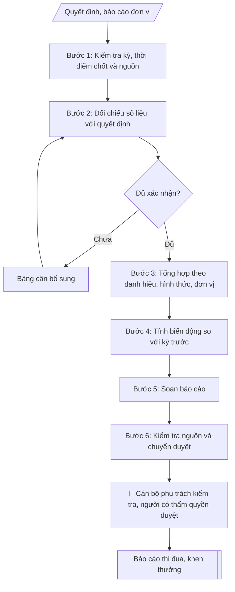

# Báo cáo tổng kết công tác thi đua, khen thưởng

## Định dạng và file đầu ra

Định dạng đầu ra có thể chọn theo sản phẩm/yêu cầu: .docx, .pdf. Đọc mục “Định dạng bổ sung” trong quy cách đầu ra trước khi chọn.

**Phải tạo file thực tế để tải xuống, không chỉ trả nội dung trong chat.** Định dạng mặc định của skill: **.docx**. Nếu có bảng số liệu nghiệp vụ yêu cầu file bảng tính riêng, tạo thêm Excel theo yêu cầu; không tự tạo file kiểm tra. Không chờ người dùng yêu cầu xuất file lần nữa. Ưu tiên định dạng người dùng chỉ định; đọc quy tắc xuất file tại references/quy-cach-dau-ra.md.

## Quy cách đầu ra và thông tin thiếu
Đọc [quy cách và cấu trúc sản phẩm](references/quy-cach-dau-ra.md) trước khi soạn/xuất. File giao chỉ gồm sản phẩm nghiệp vụ được yêu cầu; kiểm tra nội bộ không xuất kèm. Thiếu thông tin thì giữ nguyên trường/mục và chỗ điền theo mẫu gốc (dòng dấu chấm, dấu gạch hoặc ô trống); không tự điền dữ liệu mẫu, số 0, mã chờ xác minh hay dòng chờ ký. Mẫu chuyên ngành còn áp dụng được ưu tiên về cấu trúc, mã biểu và người ký. Bản đầy đủ: [quy tắc chung](references/quy-tac-chung.md).

## Khi nào dùng

Tổng hợp kết quả thi đua, khen thưởng đã có quyết định hoặc hồ sơ xác nhận trong kỳ. Chuẩn bị dự thảo báo cáo và bảng đối chiếu để cán bộ phụ trách kiểm tra trước trình lãnh đạo.

## Đầu vào

| Trường | Nội dung | Bắt buộc |
| --- | --- | --- |
| `ky_bao_cao` | Năm học/năm công tác và thời điểm chốt số liệu | Có |
| `quyet_dinh_khen_thuong` | Số, ngày, loại danh hiệu/hình thức, đơn vị và số lượng đã được phê duyệt | Có |
| `bao_cao_don_vi` | Số liệu đã xác nhận của từng đơn vị, nguồn và người xác nhận | Có |
| `ho_so_dang_trinh` | Hồ sơ đang đề nghị; tách khỏi kết quả được tặng | Khi có |
| `so_lieu_ky_truoc` | Số liệu kỳ trước có cùng phạm vi để so sánh | Khi cần so sánh |
| `nhan_xet_da_duyet` | Nhận xét về công tác tổ chức đã được cán bộ phụ trách xác nhận | Không |
| `phuong_huong_da_duyet` | Nhiệm vụ và chỉ tiêu kỳ tới đã được lãnh đạo xác nhận | Khi có |
| `thong_tin_trinh_ky` | Người dự kiến ký, căn cứ thẩm quyền, ngày dự kiến, nơi nhận | Có |

## Kiểm soát áp dụng và phê duyệt

Xác định `ngay_ap_dung`, `loai_hinh_truong`, `quy_che_noi_bo`, `nguon_du_lieu` và `nguoi_kiem_duyet` trong phạm vi nghiệp vụ. Kiểm tra văn bản gốc, hiệu lực và điều khoản áp dụng; thiếu căn cứ ghi nhận nội bộ [CẦN XÁC MINH], để trống phần tương ứng trong file giao. Không suy ra văn bản còn hiệu lực chỉ từ ngày cập nhật skill.

## Quy trình

**Bước 1. Kiểm tra kỳ, thời điểm chốt và nguồn từng dòng**
- Làm gì: Kiểm tra từng dòng số liệu có kỳ, thời điểm chốt và nguồn; dòng thiếu quyết định hoặc xác nhận thì ghi nhận nội bộ [CHƯA XÁC NHẬN] (không đưa vào file giao) và không tính vào kết quả đã ban hành.
- Dùng input: `ky_bao_cao`, `quyet_dinh_khen_thuong`, `bao_cao_don_vi`.
- Vai trò: Chuyên viên Văn phòng/Phòng Thi đua (đơn vị tổng hợp) · AI hỗ trợ: đối chiếu và tổng hợp số liệu, soạn dự thảo
- Lưu ý nghiệp vụ: Mọi con số phải truy được về quyết định/hồ sơ và người xác nhận.
- → Kết quả bước: Danh sách dòng số liệu hợp lệ + danh sách dòng chưa xác nhận (nội bộ).

**Bước 2. Đối chiếu số liệu đơn vị với quyết định**
- Làm gì: Lập bảng số liệu nguồn / số liệu báo cáo / chênh lệch / người cần xác nhận. Không tự chọn một nguồn khi có mâu thuẫn.
- Dùng input: `quyet_dinh_khen_thuong`, `bao_cao_don_vi`.
- Vai trò: Chuyên viên Văn phòng/Phòng Thi đua (đơn vị tổng hợp) · AI hỗ trợ: đối chiếu và tổng hợp số liệu, soạn dự thảo
- Lưu ý nghiệp vụ: Chênh lệch chưa giải trình được thì giữ ở bảng nội bộ, không đưa vào báo cáo.
- → Kết quả bước: Bảng đối chiếu (nội bộ) + danh sách cần bổ sung.

**Bước 3. Tổng hợp số lượng theo danh hiệu, hình thức và đơn vị**
- Làm gì: Tổng hợp theo loại danh hiệu, hình thức khen thưởng và đơn vị; giữ tách biệt tập thể/cá nhân và đã được tặng/đang đề nghị. Tránh đếm trùng người hay hồ sơ; không cộng các đại lượng khác đơn vị tính.
- Dùng input: kết quả Bước 1–2, `ho_so_dang_trinh`.
- Vai trò: Chuyên viên Văn phòng/Phòng Thi đua (đơn vị tổng hợp) · AI hỗ trợ: đối chiếu và tổng hợp số liệu, soạn dự thảo
- Lưu ý nghiệp vụ: Hồ sơ đang đề nghị không được cộng vào kết quả đã được tặng.
- → Kết quả bước: Bảng thống kê đã tách các nhóm.

**Bước 4. Tính biến động so với kỳ trước**
- Làm gì: Chỉ tính biến động khi có dữ liệu kỳ trước cùng phạm vi. Nếu mẫu số bằng 0 hoặc không có dữ liệu thì để trống, ghi không tính được; không tự đặt tỷ lệ tăng/giảm.
- Dùng input: kết quả Bước 3, `so_lieu_ky_truoc`.
- Vai trò: Chuyên viên Văn phòng/Phòng Thi đua (đơn vị tổng hợp) · AI hỗ trợ: đối chiếu và tổng hợp số liệu, soạn dự thảo
- Lưu ý nghiệp vụ: So sánh khác phạm vi (đơn vị, loại danh hiệu) là so sánh sai.
- → Kết quả bước: Bảng biến động hoặc ghi chú không tính được.

**Bước 5. Soạn báo cáo**
- Làm gì: Soạn báo cáo gồm kết quả đã xác nhận, vấn đề đối chiếu còn mở và nhiệm vụ kỳ tới đã được cung cấp. Chỉ trình bày nhận xét từ `nhan_xet_da_duyet` và phương hướng từ `phuong_huong_da_duyet`, ghi rõ nguồn.
- Dùng input: kết quả Bước 3–4, `nhan_xet_da_duyet`, `phuong_huong_da_duyet`, `thong_tin_trinh_ky`.
- Vai trò: Chuyên viên Văn phòng/Phòng Thi đua (đơn vị tổng hợp) · AI hỗ trợ: đối chiếu và tổng hợp số liệu, soạn dự thảo
- Lưu ý nghiệp vụ: Không suy đoán nguyên nhân hay thành tích cá nhân; không thêm nhận xét khi thiếu dữ liệu.
- → Kết quả bước: Dự thảo báo cáo đúng bố cục.

**Bước 6. Kiểm tra nguồn truy nguyên và chuyển duyệt**
- Làm gì: Kiểm tra mỗi số liệu và phát biểu có nguồn truy nguyên; xuất báo cáo hoàn chỉnh về bố cục, để trống dữ liệu thiếu; bảng đối chiếu và vấn đề cần xác nhận chỉ dùng nội bộ. Cán bộ phụ trách xác nhận nội dung; người có thẩm quyền quyết định ký/phát hành.
- Dùng input: toàn bộ input, `thong_tin_trinh_ky`.
- Vai trò: Chuyên viên Văn phòng/Phòng Thi đua (đơn vị tổng hợp) chuẩn bị; cán bộ phụ trách xác nhận; người có thẩm quyền duyệt · AI hỗ trợ: đối chiếu và tổng hợp số liệu, soạn dự thảo
- Lưu ý nghiệp vụ: Không tự gửi, công bố, ký hoặc đánh dấu đã duyệt.
- → Kết quả bước: Báo cáo hoàn chỉnh, sẵn sàng chuyển cán bộ phụ trách kiểm tra.

## Luồng quy trình

## Đầu ra

File nghiệp vụ thực tế theo định dạng mặc định ở đầu skill hoặc định dạng người dùng yêu cầu, kèm liên kết tải trong phản hồi cuối.

Sản phẩm nghiệp vụ hoàn chỉnh theo [quy cách và cấu trúc](references/quy-cach-dau-ra.md), giữ các trường chưa có dữ liệu ở trạng thái trống. Không xuất kèm checklist/phụ lục kiểm tra đầu ra.

## Giới hạn và human gate

Chỉ hỗ trợ tổng hợp và biên tập thông tin đã được xác nhận. Không chấm điểm, xếp hạng, đề xuất cá nhân được/không được khen thưởng hoặc tự quyết định quyền lợi nhân sự. Các đánh giá và quyết định thuộc cán bộ/hội đồng có thẩm quyền.

Không tự thêm thành tích, tỷ lệ, số phiên họp, quyết định hay nhận xét tuân thủ pháp luật. Không tự gửi báo cáo, công bố, ký hoặc đánh dấu đã duyệt. Hạn chế dữ liệu cá nhân theo mục đích và phân quyền; dùng số liệu tổng hợp khi đủ đáp ứng báo cáo. Kiểm tra Luật 91/2025/QH15 và quy định áp dụng trước xử lý/chia sẻ dữ liệu cá nhân.

## Kiểm tra nội bộ trước khi giao

- [ ] Kỳ, phạm vi và thời điểm chốt thống nhất.
- [ ] Mọi số liệu có quyết định/hồ sơ và người xác nhận.
- [ ] Tách đã được tặng và đang đề nghị; không đếm trùng.
- [ ] Không thêm nhận xét, nguyên nhân hoặc tỷ lệ khi thiếu dữ liệu.
- [ ] Báo cáo và bảng thống kê khớp nhau.
- [ ] Những điểm chưa xác minh được ghi riêng.
- [ ] Cán bộ kiểm tra và người có thẩm quyền duyệt trước phát hành.

## Căn cứ cần đối chiếu

Luật Thi đua, khen thưởng và văn bản hướng dẫn đang áp dụng; quy chế nội bộ; quyết định và hồ sơ kỳ báo cáo. Thể thức văn bản đối chiếu Nghị định 30/2020/NĐ-CP. Bản skill chưa xác minh toàn văn mọi căn cứ chuyên ngành; cán bộ phụ trách phải chọn điều khoản hiện hành trước thực thi.

## Quản trị phiên bản
- Phiên bản gói `1.3.2` (cập nhật 2026-10-10); hồ sơ đầy đủ tại [references/version.json](references/version.json).
- Người phê duyệt nghiệp vụ: **chưa chỉ định**. Trạng thái: dự thảo nghiệp vụ; kiểm tra pháp lý trước thực thi. Ngày cập nhật không đồng nghĩa mọi văn bản đã được rà soát toàn văn.
- Giấy phép theo LICENSE của kho (bản quyền CES Global). Lịch sử thay đổi: CHANGELOG.md.
