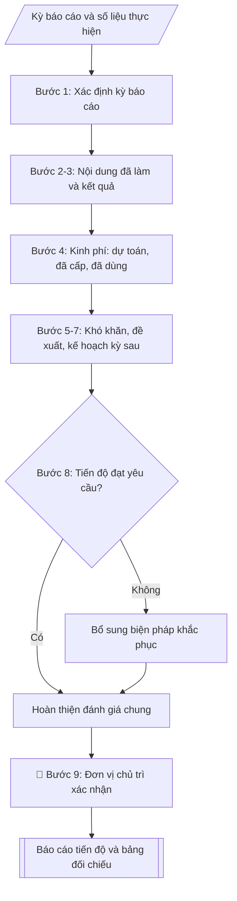

# Skill: Báo cáo tiến độ đề tài NCKH (6 tháng / năm)

## Khi nào dùng
Khi đề tài đang trong quá trình thực hiện và đến kỳ báo cáo định kỳ (6 tháng hoặc
tổng kết năm): chủ nhiệm đề tài soạn báo cáo gửi Phòng KHCN (đề tài cấp trường)
hoặc cơ quan quản lý (đề tài cấp bộ/nhà nước). Báo cáo đạt yêu cầu là điều kiện để
được cấp tiếp kinh phí đợt sau.

## Đầu vào (Input)

| Trường | Mô tả | Bắt buộc |
|---|---|---|
| `ten_de_tai` | Tên đầy đủ của đề tài | Có |
| `ma_so_de_tai` | Mã số đề tài | Có |
| `chu_nhiem` | Họ tên, học hàm/học vị chủ nhiệm | Có |
| `ky_bao_cao` | Kỳ báo cáo (6 tháng đầu/năm 2027, cả năm 2027...) và mốc thời gian cụ thể | Có |
| `noi_dung_da_lam` | Công việc đã thực hiện trong kỳ, theo từng nội dung nghiên cứu | Có |
| `ket_qua_dat_duoc` | Kết quả, sản phẩm đã đạt được trong kỳ | Có |
| `kinh_phi_da_cap` | Tổng kinh phí đã được cấp đến thời điểm báo cáo | Có |
| `kinh_phi_da_dung` | Kinh phí đã sử dụng chi tiết theo khoản mục | Có |
| `kho_khan` | Khó khăn, vướng mắc (khách quan/chủ quan) và nguyên nhân | Không |
| `de_xuat` | Đề xuất, kiến nghị (gia hạn, điều chỉnh nội dung/kinh phí...) | Không |
| `ke_hoach_tiep_theo` | Công việc dự kiến kỳ tiếp theo, gắn mốc thời gian | Có |

## Quy trình

**Bước 1. Xác định kỳ báo cáo**
- Làm gì: đối chiếu hợp đồng và tiến độ đã duyệt để xác định mốc thời gian của kỳ báo cáo từ `ky_bao_cao` (VD: 01/01/2027–30/06/2027); liệt kê các nội dung/sản phẩm theo kế hoạch phải hoàn thành trong kỳ để làm đầu vào cho bước 2.
- Dùng input: `ky_bao_cao`, `ten_de_tai`, `ma_so_de_tai`, `chu_nhiem`.
- Vai trò: Chủ nhiệm đề tài · AI hỗ trợ: đối chiếu hợp đồng để xác định khung kỳ báo cáo · ⏱ ~15–20 phút (ước tính)
- Lưu ý nghiệp vụ: kỳ báo cáo phải khớp mốc trong hợp đồng (Điều 2) — báo cáo sai kỳ sẽ không được dùng làm căn cứ cấp kinh phí đợt tiếp theo.
- → Kết quả bước: khung kỳ báo cáo (mốc thời gian + danh mục công việc theo kế hoạch của kỳ).

**Bước 2. Tổng hợp nội dung đã làm và đánh giá từng nội dung**
- Làm gì: từ `noi_dung_da_lam` liệt kê công việc theo từng nội dung nghiên cứu trong thuyết minh; đối chiếu với kế hoạch của kỳ (kết quả bước 1), đánh giá từng nội dung: hoàn thành / đang thực hiện / chậm tiến độ, ghi rõ % hoàn thành.
- Dùng input: `noi_dung_da_lam`, kết quả bước 1.
- Vai trò: Chủ nhiệm đề tài · AI hỗ trợ: lập bảng đánh giá theo từng nội dung · ⏱ ~30–45 phút (ước tính)
- Lưu ý nghiệp vụ: % hoàn thành phải có căn cứ (khối lượng công việc/sản phẩm cụ thể), không ước lượng cảm tính; nội dung chậm tiến độ phải ghi rõ nguyên nhân sơ bộ (chi tiết ở bước 5).
- → Kết quả bước: bảng đánh giá từng nội dung (kế hoạch – thực hiện – % hoàn thành – trạng thái).

**Bước 3. Liệt kê kết quả đạt được**
- Làm gì: từ `ket_qua_dat_duoc` liệt kê sản phẩm, số liệu, bài báo, mẫu vật... đã có trong kỳ; đối chiếu với sản phẩm dự kiến của cả đề tài để thấy tỷ trọng hoàn thành.
- Dùng input: `ket_qua_dat_duoc`.
- Vai trò: Chủ nhiệm đề tài · AI hỗ trợ: liệt kê và đối chiếu sản phẩm dự kiến · ⏱ ~20–30 phút (ước tính)
- Lưu ý nghiệp vụ: chỉ ghi kết quả đã có minh chứng (báo cáo, dữ liệu, bản thảo bài báo); không ghi kết quả "dự kiến" vào mục này — dự kiến thuộc về kế hoạch kỳ sau (bước 7).
- → Kết quả bước: danh mục kết quả đạt được trong kỳ (có minh chứng kèm theo).

**Bước 4. Tổng hợp và phân tích tình hình sử dụng kinh phí**
- Làm gì: từ `kinh_phi_da_cap` và `kinh_phi_da_dung` lập bảng 3 cột theo từng khoản mục: dự toán được duyệt / đã cấp / đã sử dụng; tính tỷ lệ % đã sử dụng so với đã cấp; giải trình các khoản chi lớn hoặc chênh lệch đáng kể; tính số kinh phí còn lại chuyển sang kỳ sau.
- Dùng input: `kinh_phi_da_cap`, `kinh_phi_da_dung`.
- Vai trò: Kế toán · AI hỗ trợ: lập bảng 3 cột và phân tích tỷ lệ sử dụng · ⏱ ~30–45 phút (ước tính)
- Lưu ý nghiệp vụ: số liệu phải khớp chứng từ, sổ sách kế toán của đề tài; tỷ lệ sử dụng quá thấp (<50% đã cấp) hoặc quá cao (>95%) đều cần giải trình vì ảnh hưởng đến đề nghị cấp kinh phí đợt tiếp theo.
- → Kết quả bước: bảng kinh phí 3 cột (dự toán – đã cấp – đã dùng) + phân tích tỷ lệ sử dụng.

**Bước 5. Nêu khó khăn, vướng mắc**
- Làm gì: từ `kho_khan` phân loại khách quan (thiên tai, dịch bệnh, biến động giá...) và chủ quan (nhân sự, thiết bị...); mỗi khó khăn nêu nguyên nhân và ảnh hưởng cụ thể đến tiến độ/sản phẩm nào.
- Dùng input: `kho_khan`, kết quả bước 2.
- Vai trò: Chủ nhiệm đề tài · AI hỗ trợ: phân loại khách quan/chủ quan · ⏱ ~20–30 phút (ước tính)
- Lưu ý nghiệp vụ: báo cáo trung thực về chậm tiến độ; khó khăn chủ quan cũng phải nêu — che giấu sẽ bị phát hiện khi nghiệm thu và ảnh hưởng đến việc xét duyệt đề tài sau này.
- → Kết quả bước: danh mục khó khăn phân loại khách quan/chủ quan (có nguyên nhân + ảnh hưởng).

**Bước 6. Đề xuất, kiến nghị**
- Làm gì: từ `de_xuat` viết từng đề xuất (gia hạn thời gian, điều chỉnh nội dung/kinh phí, bổ sung nhân sự...); mỗi đề xuất nêu lý do (liên kết với khó khăn ở bước 5) và phương án cụ thể; nếu không có đề xuất thì ghi rõ "Không".
- Dùng input: `de_xuat`, kết quả bước 5.
- Vai trò: Chủ nhiệm đề tài · AI hỗ trợ: rà soát kỹ thuật, tổng hợp và lưu trữ hồ sơ · ⏱ ~30 phút (ước tính)
- Lưu ý nghiệp vụ: đề xuất điều chỉnh nội dung/kinh phí phải trong phạm vi cho phép của quy chế (thường ≤10–20% cần thuyết minh, vượt ngưỡng phải xin điều chỉnh chính thức) — không đề xuất vượt thẩm quyền của cấp quản lý.
- → Kết quả bước: danh mục đề xuất, kiến nghị (mỗi đề xuất có lý do + phương án cụ thể).

**Bước 7. Lập kế hoạch kỳ tiếp theo**
- Làm gì: từ `ke_hoach_tiep_theo` lập kế hoạch chi tiết theo tháng/quý: công việc cụ thể, sản phẩm dự kiến hoàn thành, nhu cầu kinh phí; kế hoạch phải có phương án khắc phục các nội dung chậm tiến độ ở bước 2.
- Dùng input: `ke_hoach_tiep_theo`, kết quả bước 2.
- Vai trò: Chủ nhiệm đề tài · AI hỗ trợ: lập bảng công việc – sản phẩm – nhu cầu kinh phí · ⏱ ~30 phút (ước tính)
- Lưu ý nghiệp vụ: kế hoạch kỳ sau phải "trả nợ" được phần chậm của kỳ này — nếu không bù được thì phải đề xuất gia hạn ở bước 6, không được im lặng bỏ qua.
- → Kết quả bước: kế hoạch kỳ tiếp theo (công việc – sản phẩm – nhu cầu kinh phí).

**Bước 8. Đánh giá chung và hoàn thiện báo cáo**
- Làm gì: tự đánh giá mức độ hoàn thành so với kế hoạch (đúng tiến độ / cơ bản đúng tiến độ / chậm tiến độ); viết cam kết khắc phục; ráp các kết quả bước 1–7 thành báo cáo hoàn chỉnh theo bố cục 7 mục (I. Nội dung đã thực hiện; II. Kết quả đạt được; III. Tình hình sử dụng kinh phí; IV. Khó khăn, vướng mắc; V. Đề xuất, kiến nghị; VI. Kế hoạch kỳ tiếp theo; VII. Đánh giá chung); kiểm tra logic giữa các phần, chính tả.
- Dùng input: kết quả bước 1–7.
- Vai trò: Chủ nhiệm đề tài · AI hỗ trợ: ráp 7 mục và kiểm tra logic giữa các phần · ⏱ ~30–45 phút (ước tính)
- Lưu ý nghiệp vụ: mức tự đánh giá phải nhất quán với bảng ở bước 2 — không thể kết luận "đúng tiến độ" khi có nội dung mới đạt 64%.
- → Kết quả bước: dự thảo báo cáo tiến độ hoàn chỉnh (7 mục).

**Bước 9. Xác nhận và xuất bản**
- Làm gì: trình chủ nhiệm ký, đơn vị chủ trì xác nhận (ký, đóng dấu); xuất báo cáo hoàn chỉnh ở định dạng markdown, sẵn sàng nộp Phòng KHCN.
- Dùng input: kết quả bước 8, `chu_nhiem`.
- Vai trò: Chủ nhiệm đề tài, Đơn vị chủ trì · AI hỗ trợ: chuẩn bị hồ sơ trình ký, nhắc lịch và theo dõi tiến độ · ⏱ ~1 giờ (ước tính, kể cả thời gian chờ ký)
- Lưu ý nghiệp vụ: báo cáo đạt yêu cầu là điều kiện để được cấp tiếp kinh phí đợt sau — nộp đúng thời hạn quy định trong hợp đồng.
- → Kết quả bước: báo cáo tiến độ đã ký xác nhận + bảng đối chiếu kế hoạch/thực hiện.

## Luồng quy trình (Workflow)



## Đầu ra (Output)
- Báo cáo tiến độ hoàn chỉnh (nội dung – kinh phí – khó khăn – kế hoạch).
- Bảng đối chiếu kế hoạch/thực hiện của kỳ báo cáo.

**Cấu trúc output chuẩn:** khung cố định của văn bản Báo cáo tiến độ, các phần bắt buộc theo đúng thứ tự xuất hiện:
1. Tiêu đề "BÁO CÁO TIẾN ĐỘ THỰC HIỆN ĐỀ TÀI NGHIÊN CỨU KHOA HỌC" + kỳ báo cáo
2. Khối thông tin: tên đề tài, mã số đề tài, chủ nhiệm, thời gian thực hiện
3. Mục I. Nội dung đã thực hiện trong kỳ (theo từng nội dung nghiên cứu, có % hoàn thành)
4. Mục II. Kết quả đạt được (sản phẩm, số liệu có minh chứng)
5. Mục III. Tình hình sử dụng kinh phí (kinh phí đã cấp / đã sử dụng / còn lại, chi tiết theo khoản mục)
6. Mục IV. Khó khăn, vướng mắc (phân loại khách quan / chủ quan, có nguyên nhân và ảnh hưởng)
7. Mục V. Đề xuất, kiến nghị (mỗi đề xuất có lý do + phương án)
8. Mục VI. Kế hoạch kỳ tiếp theo (công việc – sản phẩm dự kiến – nhu cầu kinh phí)
9. Mục VII. Đánh giá chung (mức độ hoàn thành so với kế hoạch + cam kết khắc phục)
10. Địa danh, ngày tháng năm + xác nhận của đơn vị chủ trì + chữ ký chủ nhiệm đề tài

## Checklist nghiệm thu

- [ ] Đủ 10 phần theo "Cấu trúc output chuẩn": tiêu đề + kỳ báo cáo → khối thông tin → mục I–VII (nội dung đã làm, kết quả, kinh phí, khó khăn, đề xuất, kế hoạch, đánh giá chung) → xác nhận + chữ ký
- [ ] Số liệu kinh phí trong output khớp Input (`kinh_phi_da_cap`, `kinh_phi_da_dung`) và khớp chứng từ, sổ sách kế toán của đề tài
- [ ] Không bịa đặt kết quả, sản phẩm; chỉ ghi kết quả đã có minh chứng, không ghi kết quả "dự kiến" vào mục kết quả đạt được
- [ ] Đúng bố cục báo cáo 7 mục theo quy định; bảng kinh phí có 3 cột (dự toán – đã cấp – đã dùng)
- [ ] Căn cứ pháp lý đầy đủ (hợp đồng thực hiện đề tài, tiến độ đã duyệt); kỳ báo cáo khớp mốc trong hợp đồng (Điều 2)
- [ ] % hoàn thành từng nội dung có căn cứ khối lượng cụ thể; mức tự đánh giá ở mục VII nhất quán với bảng đánh giá chi tiết
- [ ] Kế hoạch kỳ tiếp theo có phương án khắc phục các nội dung chậm tiến độ; đề xuất điều chỉnh trong phạm vi cho phép của quy chế
- [ ] Đã qua Human gate: chủ nhiệm ký, đơn vị chủ trì xác nhận (ký, đóng dấu); báo cáo nộp đúng thời hạn quy định trong hợp đồng

Tiêu chí đạt = tất cả các ô được đánh dấu.

## Ví dụ mô phỏng (dữ liệu giả lập)

> Tất cả tên trường, cá nhân, đề tài, số liệu dưới đây đều là **giả lập**, không liên quan tổ chức/cá nhân có thật.

### Input mẫu

| Trường | Giá trị |
|---|---|
| `ten_de_tai` | Nghiên cứu ứng dụng trí tuệ nhân tạo trong dự báo năng suất lúa tại Đồng bằng sông Hồng |
| `ma_so_de_tai` | ĐHA.KHCN.2027.04 (giả lập) |
| `chu_nhiem` | PGS.TS. Trần Văn B – Khoa Công nghệ thông tin |
| `ky_bao_cao` | 6 tháng đầu năm 2027 (01/01/2027 – 30/06/2027) |
| `noi_dung_da_lam` | ND1: hoàn thành tổng quan nghiên cứu; thu thập 3.200/5.000 mẫu dữ liệu (64%). ND2: bắt đầu thử nghiệm 2 kiến trúc mô hình |
| `ket_qua_dat_duoc` | Báo cáo tổng quan 120 trang; bộ dữ liệu 3.200 mẫu đã chuẩn hóa; kết quả thử nghiệm sơ bộ độ chính xác 78% |
| `kinh_phi_da_cap` | 112.000.000 đồng (đợt 1: 40%) |
| `kinh_phi_da_dung` | Nhân công 55tr; vật tư, thiết bị 25tr; công tác phí điều tra 18tr → tổng 98tr (87,5% đã cấp) |
| `kho_khan` | Vụ xuân 2027 mưa kéo dài làm chậm điều tra đồng ruộng 3 tuần; giá thuê dịch vụ ảnh viễn thám tăng 15% |
| `de_xuat` | Đề nghị bổ sung 01 cộng tác viên điều tra trong quý 3/2027 |
| `ke_hoach_tiep_theo` | Quý 3/2027: hoàn thành 5.000 mẫu dữ liệu. Quý 4/2027: huấn luyện mô hình chính thức, mục tiêu ≥ 82%. Viết 01 bài báo |

### Output mẫu

```
BÁO CÁO TIẾN ĐỘ THỰC HIỆN ĐỀ TÀI NGHIÊN CỨU KHOA HỌC
(Kỳ báo cáo: 6 tháng đầu năm 2027)

Tên đề tài: Nghiên cứu ứng dụng trí tuệ nhân tạo trong dự báo năng suất lúa
             tại Đồng bằng sông Hồng
Mã số: ĐHA.KHCN.2027.04
Chủ nhiệm: PGS.TS. Trần Văn B – Khoa Công nghệ thông tin
Thời gian thực hiện: 01/01/2027 – 31/12/2028

I. NỘI DUNG ĐÃ THỰC HIỆN TRONG KỲ
1. Nội dung 1 – Tổng quan nghiên cứu và thu thập dữ liệu: hoàn thành 100% phần tổng
quan (báo cáo 120 trang); đã thu thập và chuẩn hóa 3.200/5.000 mẫu dữ liệu, đạt 64%.
2. Nội dung 2 – Xây dựng mô hình AI: đang thực hiện, đã thử nghiệm 02 kiến trúc mô
hình học sâu trên tập dữ liệu hiện có.
3. Nội dung 3 – Thử nghiệm thực tế: chưa đến kế hoạch (dự kiến quý 6–7/2028).

II. KẾT QUẢ ĐẠT ĐƯỢC
- Báo cáo tổng quan nghiên cứu (120 trang);
- Bộ dữ liệu 3.200 mẫu ruộng đã chuẩn hóa (ảnh viễn thám + số liệu đồng ruộng);
- Kết quả thử nghiệm sơ bộ: độ chính xác dự báo đạt 78% (mục tiêu cuối cùng ≥ 85%).

III. TÌNH HÌNH SỬ DỤNG KINH PHÍ (đồng)
- Kinh phí đã cấp (đợt 1): 112.000.000
- Kinh phí đã sử dụng: 98.000.000 (đạt 87,5% số đã cấp), trong đó:
  + Thuê khoán nhân công: 55.000.000
  + Vật tư, thiết bị, thuê dịch vụ: 25.000.000
  + Công tác phí điều tra đồng ruộng: 18.000.000
- Kinh phí còn lại: 14.000.000 (chuyển sang kỳ sau).

IV. KHÓ KHĂN, VƯỚNG MẮC
- Khách quan: vụ xuân 2027 mưa kéo dài khiến công tác điều tra đồng ruộng chậm
03 tuần so với kế hoạch; giá thuê dịch vụ ảnh viễn thám tăng khoảng 15% so với dự toán.
- Chủ quan: thiếu 01 cộng tác viên điều tra trong giai đoạn cao điểm.

V. ĐỀ XUẤT, KIẾN NGHỊ
Đề nghị cho phép bổ sung 01 cộng tác viên điều tra trong quý 3/2027 từ nguồn kinh
phí còn lại của đợt 1 để bù tiến độ thu thập dữ liệu.

VI. KẾ HOẠCH KỲ TIẾP THEO (6 tháng cuối năm 2027)
- Quý 3/2027: hoàn thành thu thập đủ 5.000 mẫu dữ liệu.
- Quý 4/2027: huấn luyện mô hình chính thức, mục tiêu độ chính xác ≥ 82%; hoàn thành
và gửi đăng 01 bài báo khoa học.
- Nhu cầu kinh phí: đề nghị cấp đợt 2 (40%) sau khi báo cáo này được đánh giá đạt yêu cầu.

VII. ĐÁNH GIÁ CHUNG
Đề tài cơ bản đúng tiến độ (khối lượng công việc đạt khoảng 90% kế hoạch kỳ).
Chủ nhiệm cam kết bù tiến độ thu thập dữ liệu trong quý 3/2027.

Thành phố C, ngày 09 tháng 07 năm 2027
XÁC NHẬN CỦA ĐƠN VỊ CHỦ TRÌ        CHỦ NHIỆM ĐỀ TÀI
(ký, đóng dấu)                     (ký, ghi rõ họ tên)
                                   PGS.TS. Trần Văn B
```

### Bảng đối chiếu kế hoạch/thực hiện (output kèm theo)

| Nội dung theo kế hoạch kỳ | Thực hiện | Đánh giá |
|---|---|---|
| Tổng quan nghiên cứu | Hoàn thành (báo cáo 120 trang) | Đạt 100% |
| Thu thập 5.000 mẫu dữ liệu | Đạt 3.200 mẫu (64%) | Chậm ~3 tuần do mưa |
| Bắt đầu xây dựng mô hình | Đã thử nghiệm 02 kiến trúc | Đúng tiến độ |
| Kinh phí sử dụng | 98/112 triệu (87,5% đã cấp) | Hợp lý |

## Căn cứ & lưu ý
- Hợp đồng thực hiện đề tài và tiến độ đã duyệt (báo cáo định kỳ là nghĩa vụ tại Điều 2, Điều 5).
- Số liệu kinh phí phải khớp với chứng từ, sổ sách kế toán của đề tài.
- Báo cáo trung thực về chậm tiến độ; che giấu sẽ bị phát hiện khi nghiệm thu và ảnh
  hưởng đến việc xét duyệt đề tài sau này.
- Không dùng tên thật của trường/cá nhân khi mô phỏng.
