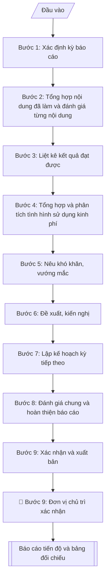

# Báo cáo tiến độ đề tài NCKH (6 tháng / năm)

## Định dạng và file đầu ra
Định dạng đầu ra có thể chọn theo sản phẩm/yêu cầu: .docx, .pdf. Đọc mục “Định dạng bổ sung” trong quy cách đầu ra trước khi chọn.

**Phải tạo file thực tế để tải xuống, không chỉ trả nội dung trong chat.** Định dạng mặc định của skill: **.docx**. Nếu có bảng số liệu nghiệp vụ yêu cầu file bảng tính riêng, tạo thêm Excel theo yêu cầu; không tự tạo file kiểm tra. Không chờ người dùng yêu cầu xuất file lần nữa. Ưu tiên định dạng người dùng chỉ định; đọc quy tắc xuất file tại references/quy-cach-dau-ra.md.

## Quy cách đầu ra và thông tin thiếu
Khi dựng file Word/Excel, áp dụng mục “Thể thức và bảng biểu khi dựng file” trong quy cách đầu ra (cỡ chữ từng thành phần, bảng nhiều trang, số trang, phụ lục). Đọc [quy cách và cấu trúc sản phẩm](references/quy-cach-dau-ra.md) trước khi soạn/xuất. File giao chỉ gồm sản phẩm nghiệp vụ được yêu cầu; kiểm tra nội bộ không xuất kèm. Thiếu thông tin thì giữ nguyên trường/mục và chỗ điền theo mẫu gốc (dòng dấu chấm, dấu gạch hoặc ô trống); không tự điền dữ liệu mẫu, số 0, mã chờ xác minh hay dòng chờ ký. Mẫu chuyên ngành còn áp dụng được ưu tiên về cấu trúc, mã biểu và người ký. Bản đầy đủ: [quy tắc chung](references/quy-tac-chung.md).

Khi người dùng yêu cầu bộ slide (.pptx), đọc mục “Xuất PowerPoint (.pptx) khi được yêu cầu” trong quy cách đầu ra.

Khi báo cáo có số liệu cần so sánh hoặc nêu xu hướng, đọc mục “Biểu đồ và hình trong báo cáo số liệu” trong quy cách đầu ra trước khi vẽ.

## Kiểm soát áp dụng và phê duyệt
Trước khi chạy, xác định `ngay_ap_dung`, `loai_hinh_truong`, `quy_che_noi_bo`, `nguon_du_lieu`, `nguoi_kiem_duyet`; chỉ hỏi thông tin liên quan nghiệp vụ, không dùng giá trị giả định thay dữ liệu bắt buộc. Đối chiếu căn cứ pháp lý với văn bản gốc, hiệu lực, điều khoản áp dụng và chuyển tiếp. Bản đầy đủ: [quy tắc chung](references/quy-tac-chung.md).

Nếu có cập nhật pháp lý dưới đây, đọc [căn cứ và điều kiện áp dụng](references/phap-ly.md) trước khi làm. Quy trình dưới đây giữ nghiệp vụ từ bản gốc; mọi viện dẫn văn bản, mẫu biểu, điều khoản phải theo căn cứ đã chọn trong phap-ly.md, không theo văn bản cũ.

## Giới hạn và human gate
AI hỗ trợ chuẩn bị và đối chiếu; cán bộ phụ trách kiểm tra dữ liệu/căn cứ, người có thẩm quyền duyệt và ký. Không đánh dấu đã ký, đã duyệt, đã công bố khi chưa có chứng cứ. Dữ liệu sinh viên, sức khỏe, nhân sự, tài chính chỉ dùng theo mục đích và phân quyền, che thông tin định danh khi dùng ví dụ (Luật 91/2025/QH15, hiệu lực 01/01/2026); không tải dữ liệu lên dịch vụ ngoài khi chưa có quyền. Bản đầy đủ: [quy tắc chung](references/quy-tac-chung.md).

## Khi nào dùng
Khi đề tài đang trong quá trình thực hiện và đến kỳ báo cáo định kỳ (6 tháng hoặc
tổng kết năm): chủ nhiệm đề tài soạn báo cáo gửi Phòng KHCN (đề tài cấp trường)
hoặc cơ quan quản lý (đề tài cấp bộ/nhà nước). Báo cáo đạt yêu cầu là điều kiện để
được cấp tiếp kinh phí đợt sau.

## Đầu vào (Input)
| Trường | Mô tả | Bắt buộc |
|---|---|---|
| `ten_de_tai` | Tên đầy đủ của đề tài | Có |
| `ma_so_de_tai` | Mã số đề tài | Có |
| `chu_nhiem` | Họ tên, học hàm/học vị chủ nhiệm | Có |
| `ky_bao_cao` | Kỳ báo cáo (6 tháng đầu/năm 2027, cả năm 2027...) và mốc thời gian cụ thể | Có |
| `noi_dung_da_lam` | Công việc đã thực hiện trong kỳ, theo từng nội dung nghiên cứu | Có |
| `ket_qua_dat_duoc` | Kết quả, sản phẩm đã đạt được trong kỳ | Có |
| `kinh_phi_da_cap` | Tổng kinh phí đã được cấp đến thời điểm báo cáo | Có |
| `kinh_phi_da_dung` | Kinh phí đã sử dụng chi tiết theo khoản mục | Có |
| `kho_khan` | Khó khăn, vướng mắc (khách quan/chủ quan) và nguyên nhân | Không |
| `de_xuat` | Đề xuất, kiến nghị (gia hạn, điều chỉnh nội dung/kinh phí...) | Không |
| `ke_hoach_tiep_theo` | Công việc dự kiến kỳ tiếp theo, gắn mốc thời gian | Có |

## Quy trình
**Ràng buộc pháp lý khi thực hiện** (trích references/phap-ly.md; đối chiếu toàn văn và hiệu lực tại ngày nghiệp vụ):
- Luật 93/2025/QH15; Nghị định 265/2025 và 267/2025, hiệu lực 14/10/2025: Yêu cầu cấp nhiệm vụ, nguồn kinh phí, tài trợ/đặt hàng, ngày phê duyệt, quy chế cơ quan tài trợ, phương thức khoán và quyền sử dụng kết quả. Đối chiếu NĐ 265 về tài chính và NĐ 267 về nhiệm vụ; không cố định thang xếp loại hoặc thu hồi toàn bộ kinh phí cho mọi đề tài. Nghiệm thu dựa hợp đồng và tiêu chí được duyệt, hội đồng có thẩm quyền xác nhận.
- Trước Bước 1: chọn căn cứ theo đối tượng, loại hình trường và chuyển tiếp; lập bảng văn bản / điều khoản / lý do áp dụng / bằng chứng. Thiếu văn bản gốc hoặc điều khoản thì ghi nhận nội bộ [CẦN XÁC MINH] (không đưa vào file giao), để trống phần tương ứng, chưa kết luận tuân thủ.
- Các con số, thời hạn, số điều, số mức xếp loại, hệ số và mẫu biểu nêu trong các bước dưới đây được giữ từ quy trình gốc (trước cập nhật pháp lý); chỉ dùng khi đã đối chiếu đúng với căn cứ đã chọn, khác thì theo căn cứ. Danh sách điểm cần đối chiếu: docs/DIEM_CAN_DOI_CHIEU_PHAP_LY.md.

**Bước 1. Xác định kỳ báo cáo**
- Làm gì: đối chiếu hợp đồng và tiến độ đã duyệt để xác định mốc thời gian của kỳ báo cáo từ `ky_bao_cao` (VD: 01/01/2027–30/06/2027); liệt kê các nội dung/sản phẩm theo kế hoạch phải hoàn thành trong kỳ để làm đầu vào cho bước 2.
- Dùng input: `ky_bao_cao`, `ten_de_tai`, `ma_so_de_tai`, `chu_nhiem`.
- Vai trò: Chủ nhiệm đề tài · AI hỗ trợ: đối chiếu hợp đồng để xác định khung kỳ báo cáo · ⏱ ~15–20 phút (ước tính)
- Lưu ý nghiệp vụ: kỳ báo cáo phải khớp mốc trong hợp đồng (Điều 2) — báo cáo sai kỳ sẽ không được dùng làm căn cứ cấp kinh phí đợt tiếp theo.
- → Kết quả bước: khung kỳ báo cáo (mốc thời gian + danh mục công việc theo kế hoạch của kỳ).

**Bước 2. Tổng hợp nội dung đã làm và đánh giá từng nội dung**
- Làm gì: từ `noi_dung_da_lam` liệt kê công việc theo từng nội dung nghiên cứu trong thuyết minh; đối chiếu với kế hoạch của kỳ (kết quả bước 1), đánh giá từng nội dung: hoàn thành / đang thực hiện / chậm tiến độ, ghi rõ % hoàn thành.
- Dùng input: `noi_dung_da_lam`, kết quả bước 1.
- Vai trò: Chủ nhiệm đề tài · AI hỗ trợ: lập bảng đánh giá theo từng nội dung · ⏱ ~30–45 phút (ước tính)
- Lưu ý nghiệp vụ: % hoàn thành phải có căn cứ (khối lượng công việc/sản phẩm cụ thể), không ước lượng cảm tính; nội dung chậm tiến độ phải ghi rõ nguyên nhân sơ bộ (chi tiết ở bước 5).
- → Kết quả bước: bảng đánh giá từng nội dung (kế hoạch – thực hiện – % hoàn thành – trạng thái).

**Bước 3. Liệt kê kết quả đạt được**
- Làm gì: từ `ket_qua_dat_duoc` liệt kê sản phẩm, số liệu, bài báo, mẫu vật... đã có trong kỳ; đối chiếu với sản phẩm dự kiến của cả đề tài để thấy tỷ trọng hoàn thành.
- Dùng input: `ket_qua_dat_duoc`.
- Vai trò: Chủ nhiệm đề tài · AI hỗ trợ: liệt kê và đối chiếu sản phẩm dự kiến · ⏱ ~20–30 phút (ước tính)
- Lưu ý nghiệp vụ: chỉ ghi kết quả đã có minh chứng (báo cáo, dữ liệu, bản thảo bài báo); không ghi kết quả "dự kiến" vào mục này — dự kiến thuộc về kế hoạch kỳ sau (bước 7).
- → Kết quả bước: danh mục kết quả đạt được trong kỳ (có minh chứng kèm theo).

**Bước 4. Tổng hợp và phân tích tình hình sử dụng kinh phí**
- Làm gì: từ `kinh_phi_da_cap` và `kinh_phi_da_dung` lập bảng 3 cột theo từng khoản mục: dự toán được duyệt / đã cấp / đã sử dụng; tính tỷ lệ % đã sử dụng so với đã cấp; giải trình các khoản chi lớn hoặc chênh lệch đáng kể; tính số kinh phí còn lại chuyển sang kỳ sau.
- Dùng input: `kinh_phi_da_cap`, `kinh_phi_da_dung`.
- Vai trò: Kế toán · AI hỗ trợ: lập bảng 3 cột và phân tích tỷ lệ sử dụng · ⏱ ~30–45 phút (ước tính)
- Lưu ý nghiệp vụ: số liệu phải khớp chứng từ, sổ sách kế toán của đề tài; tỷ lệ sử dụng quá thấp (<50% đã cấp) hoặc quá cao (>95%) đều cần giải trình vì ảnh hưởng đến đề nghị cấp kinh phí đợt tiếp theo.
- → Kết quả bước: bảng kinh phí 3 cột (dự toán – đã cấp – đã dùng) + phân tích tỷ lệ sử dụng.

**Bước 5. Nêu khó khăn, vướng mắc**
- Làm gì: từ `kho_khan` phân loại khách quan (thiên tai, dịch bệnh, biến động giá...) và chủ quan (nhân sự, thiết bị...); mỗi khó khăn nêu nguyên nhân và ảnh hưởng cụ thể đến tiến độ/sản phẩm nào.
- Dùng input: `kho_khan`, kết quả bước 2.
- Vai trò: Chủ nhiệm đề tài · AI hỗ trợ: phân loại khách quan/chủ quan · ⏱ ~20–30 phút (ước tính)
- Lưu ý nghiệp vụ: báo cáo trung thực về chậm tiến độ; khó khăn chủ quan cũng phải nêu — che giấu sẽ bị phát hiện khi nghiệm thu và ảnh hưởng đến việc xét duyệt đề tài sau này.
- → Kết quả bước: danh mục khó khăn phân loại khách quan/chủ quan (có nguyên nhân + ảnh hưởng).

**Bước 6. Đề xuất, kiến nghị**
- Làm gì: từ `de_xuat` viết từng đề xuất (gia hạn thời gian, điều chỉnh nội dung/kinh phí, bổ sung nhân sự...); mỗi đề xuất nêu lý do (liên kết với khó khăn ở bước 5) và phương án cụ thể; nếu không có đề xuất thì ghi rõ "Không".
- Dùng input: `de_xuat`, kết quả bước 5.
- Vai trò: Chủ nhiệm đề tài · AI hỗ trợ: rà soát kỹ thuật, tổng hợp và lưu trữ hồ sơ · ⏱ ~30 phút (ước tính)
- Lưu ý nghiệp vụ: đề xuất điều chỉnh nội dung/kinh phí phải trong phạm vi cho phép của quy chế (thường ≤10–20% cần thuyết minh, vượt ngưỡng phải xin điều chỉnh chính thức) — không đề xuất vượt thẩm quyền của cấp quản lý.
- → Kết quả bước: danh mục đề xuất, kiến nghị (mỗi đề xuất có lý do + phương án cụ thể).

**Bước 7. Lập kế hoạch kỳ tiếp theo**
- Làm gì: từ `ke_hoach_tiep_theo` lập kế hoạch chi tiết theo tháng/quý: công việc cụ thể, sản phẩm dự kiến hoàn thành, nhu cầu kinh phí; kế hoạch phải có phương án khắc phục các nội dung chậm tiến độ ở bước 2.
- Dùng input: `ke_hoach_tiep_theo`, kết quả bước 2.
- Vai trò: Chủ nhiệm đề tài · AI hỗ trợ: lập bảng công việc – sản phẩm – nhu cầu kinh phí · ⏱ ~30 phút (ước tính)
- Lưu ý nghiệp vụ: kế hoạch kỳ sau phải "trả nợ" được phần chậm của kỳ này — nếu không bù được thì phải đề xuất gia hạn ở bước 6, không được im lặng bỏ qua.
- → Kết quả bước: kế hoạch kỳ tiếp theo (công việc – sản phẩm – nhu cầu kinh phí).

**Bước 8. Đánh giá chung và hoàn thiện báo cáo**
- Làm gì: tự đánh giá mức độ hoàn thành so với kế hoạch (đúng tiến độ / cơ bản đúng tiến độ / chậm tiến độ); viết cam kết khắc phục; ráp các kết quả bước 1–7 thành báo cáo hoàn chỉnh theo bố cục 7 mục (I. Nội dung đã thực hiện; II. Kết quả đạt được; III. Tình hình sử dụng kinh phí; IV. Khó khăn, vướng mắc; V. Đề xuất, kiến nghị; VI. Kế hoạch kỳ tiếp theo; VII. Đánh giá chung); kiểm tra logic giữa các phần, chính tả.
- Dùng input: kết quả bước 1–7.
- Vai trò: Chủ nhiệm đề tài · AI hỗ trợ: ráp 7 mục và kiểm tra logic giữa các phần · ⏱ ~30–45 phút (ước tính)
- Lưu ý nghiệp vụ: mức tự đánh giá phải nhất quán với bảng ở bước 2 — không thể kết luận "đúng tiến độ" khi có nội dung mới đạt 64%.
- → Kết quả bước: dự thảo báo cáo tiến độ hoàn chỉnh (7 mục).

**Bước 9. Xác nhận và xuất bản**
- Làm gì: trình chủ nhiệm ký, đơn vị chủ trì xác nhận (ký, đóng dấu); xuất báo cáo hoàn chỉnh theo định dạng đầu ra của skill, sẵn sàng nộp Phòng KHCN.
- Dùng input: kết quả bước 8, `chu_nhiem`.
- Vai trò: Chủ nhiệm đề tài, Đơn vị chủ trì · AI hỗ trợ: chuẩn bị hồ sơ trình ký, nhắc lịch và theo dõi tiến độ · ⏱ ~1 giờ (ước tính, kể cả thời gian chờ ký)
- Lưu ý nghiệp vụ: báo cáo đạt yêu cầu là điều kiện để được cấp tiếp kinh phí đợt sau — nộp đúng thời hạn quy định trong hợp đồng.
- → Kết quả bước: báo cáo tiến độ đã ký xác nhận + bảng đối chiếu kế hoạch/thực hiện.

## Luồng quy trình (Workflow)

## Đầu ra
- Báo cáo tiến độ hoàn chỉnh (nội dung – kinh phí – khó khăn – kế hoạch).
- Bảng đối chiếu kế hoạch/thực hiện của kỳ báo cáo.

File nghiệp vụ thực tế theo định dạng mặc định ở đầu skill hoặc định dạng người dùng yêu cầu, kèm liên kết tải trong phản hồi cuối.

Sản phẩm nghiệp vụ hoàn chỉnh theo [quy cách và cấu trúc](references/quy-cach-dau-ra.md), giữ các trường chưa có dữ liệu ở trạng thái trống. Không xuất kèm checklist/phụ lục kiểm tra đầu ra.

## Kiểm tra nội bộ trước khi giao
Các tiêu chí sau dùng để tự đối chiếu; không sao chép vào file xuất. Mục thiếu dữ liệu được để trống, không đánh dấu đã đạt hoặc đã duyệt.

- [ ] Đủ các phần và đúng bố cục theo cấu trúc tại references/quy-cach-dau-ra.md (không theo cấu trúc của bản gốc).
- [ ] Số liệu kinh phí trong output khớp Input (`kinh_phi_da_cap`, `kinh_phi_da_dung`) và khớp chứng từ, sổ sách kế toán của đề tài
- [ ] Không bịa đặt kết quả, sản phẩm; chỉ ghi kết quả đã có minh chứng, không ghi kết quả "dự kiến" vào mục kết quả đạt được
- [ ] Đúng bố cục báo cáo 7 mục theo quy định; bảng kinh phí có 3 cột (dự toán – đã cấp – đã dùng)
- [ ] Căn cứ pháp lý đầy đủ (hợp đồng thực hiện đề tài, tiến độ đã duyệt); kỳ báo cáo khớp mốc trong hợp đồng (Điều 2)
- [ ] % hoàn thành từng nội dung có căn cứ khối lượng cụ thể; mức tự đánh giá ở mục VII nhất quán với bảng đánh giá chi tiết
- [ ] Kế hoạch kỳ tiếp theo có phương án khắc phục các nội dung chậm tiến độ; đề xuất điều chỉnh trong phạm vi cho phép của quy chế
- [ ] Đã qua Human gate: chủ nhiệm ký, đơn vị chủ trì xác nhận (ký, đóng dấu); báo cáo nộp đúng thời hạn quy định trong hợp đồng

## Căn cứ & lưu ý
- Hợp đồng thực hiện đề tài và tiến độ đã duyệt (báo cáo định kỳ là nghĩa vụ tại Điều 2, Điều 5).
- Số liệu kinh phí phải khớp với chứng từ, sổ sách kế toán của đề tài.
- Báo cáo trung thực về chậm tiến độ; che giấu sẽ bị phát hiện khi nghiệm thu và ảnh
  hưởng đến việc xét duyệt đề tài sau này.
- Không dùng tên thật của trường/cá nhân khi mô phỏng.

## Tư liệu đối chiếu
Bản gốc trước cập nhật pháp lý (kèm ví dụ giả lập) lưu tại `references/quy-trinh-lich-su.md`, chỉ để đối chiếu hồ sơ lịch sử; không dùng căn cứ, mẫu hay số liệu trong đó làm chỉ dẫn hiện hành.

## Quản trị phiên bản
- Phiên bản gói `1.3.2` (cập nhật 2026-10-10); hồ sơ đầy đủ tại [references/version.json](references/version.json).
- Người phê duyệt nghiệp vụ: **chưa chỉ định**. Trạng thái: dự thảo nghiệp vụ; kiểm tra pháp lý trước thực thi. Ngày cập nhật không đồng nghĩa mọi văn bản đã được rà soát toàn văn.
- Giấy phép theo LICENSE của kho (bản quyền CES Global). Lịch sử thay đổi: CHANGELOG.md.
