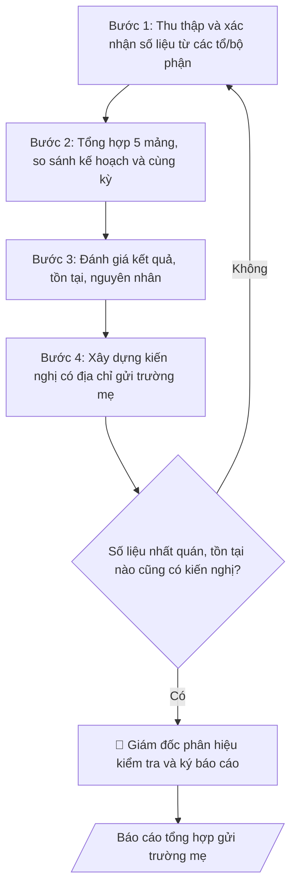

# Soạn báo cáo tổng hợp phân hiệu

## Quy cách đầu ra và thông tin thiếu

Đọc [quy cách và cấu trúc sản phẩm](references/quy-cach-dau-ra.md) trước khi soạn/xuất. File giao chỉ gồm văn bản hoặc sản phẩm nghiệp vụ được yêu cầu; kiểm tra nội bộ không xuất kèm. Thiếu thông tin giữ nguyên trường/mục và chỗ điền theo mẫu gốc (dòng dấu chấm, dấu gạch hoặc ô trống); không tự điền dữ liệu mẫu, số 0, mã chờ xác minh hoặc dòng chờ ký. Mẫu chuyên ngành còn áp dụng được ưu tiên về cấu trúc, mã biểu và người ký. Các trường “bắt buộc” là điều kiện hoàn thiện hồ sơ, không ngăn việc soạn bản có chỗ chừa để điền. Mọi chỉ dẫn “để trống” trong skill được hiểu là không điền dữ liệu và giữ cách chừa chỗ của mẫu gốc, không phải xóa dấu chấm của mẫu.

## Kiểm soát áp dụng và phê duyệt

Trước khi chạy quy trình, xác định `ngay_ap_dung`, `loai_hinh_truong`, `quy_che_noi_bo`, `nguon_du_lieu` và `nguoi_kiem_duyet`. Chỉ yêu cầu thông tin có liên quan đến nghiệp vụ; không dùng giá trị giả định thay dữ liệu bắt buộc. Đối chiếu nội bộ hồ sơ có yếu tố pháp lý với văn bản gốc, hiệu lực, điều khoản áp dụng và chuyển tiếp; không tự đính kèm bảng kiểm tra vào file giao.

## Giới hạn và human gate

AI hỗ trợ chuẩn bị và đối chiếu. Cán bộ phụ trách kiểm tra dữ liệu/căn cứ, người có thẩm quyền duyệt và ký. Văn bản soạn chưa được coi là đã ban hành; không tự chèn nhãn trạng thái kiểm duyệt vào file giao; không đánh dấu đã ký, đã duyệt hoặc đã công bố nếu chưa có chứng cứ. Dữ liệu sinh viên, sức khỏe, nhân sự và tài chính phải hạn chế theo mục đích, phân quyền và che thông tin định danh khi dùng ví dụ. Không tải dữ liệu lên dịch vụ ngoài khi chưa có quyền. Kiểm tra Luật 91/2025/QH15 về bảo vệ dữ liệu cá nhân (hiệu lực 01/01/2026) và quy định áp dụng trước xử lý/chia sẻ dữ liệu cá nhân.

## Khi nào dùng
Khi Phân hiệu cần báo cáo định kỳ (học kỳ, năm học) hoặc đột xuất gửi Ban Giám hiệu trường mẹ,
tổng hợp toàn diện tình hình hoạt động của phân hiệu.

## Đầu vào (Input)

| Trường | Mô tả | Bắt buộc |
|---|---|---|
| `ky_bao_cao` | Học kỳ / Năm học / Đột xuất + thời gian | Có |
| `so_lieu_dao_tao` | Tuyển sinh, quy mô SV, tốt nghiệp, kiểm định | Có |
| `so_lieu_ctsv` | Học bổng, rèn luyện, KTX, việc làm SV | Có |
| `so_lieu_khcn` | Đề tài, bài báo, hội thảo của phân hiệu | Không |
| `so_lieu_tai_chinh` | Thu – chi theo phân cấp | Có |
| `so_lieu_csvc` | Hiện trạng, bảo trì, mua sắm CSVC | Có |
| `ton_tai_kien_nghi` | Tồn tại và kiến nghị với trường mẹ | Có |

## Quy trình

**Bước 1. Thu thập và xác nhận số liệu từ các tổ/bộ phận**
- Làm gì: gửi đề cương và biểu mẫu thu thập số liệu cho từng tổ/bộ phận thuộc phân hiệu theo đúng `ky_bao_cao` (học kỳ / năm học / đột xuất + thời gian); yêu cầu trưởng từng tổ ký xác nhận số liệu mảng mình phụ trách; khi có chênh lệch, đối chiếu lại với sổ sách gốc (sổ đào tạo, sổ thu chi) trước khi nhận số liệu.
- Dùng input: `ky_bao_cao`, `so_lieu_dao_tao`, `so_lieu_ctsv`, `so_lieu_khcn`, `so_lieu_tai_chinh`, `so_lieu_csvc`.
- Vai trò: Giám đốc Phân hiệu · AI hỗ trợ: soạn dự thảo văn bản trình ký, kiểm tra thể thức · ⏱ 3–5 ngày làm việc (ước tính)
- Lưu ý nghiệp vụ: chỉ dùng số liệu đã được đơn vị phụ trách xác nhận — số liệu ước tính phải ghi chú rõ "ước tính", không gộp lẫn với số liệu thực tế. Bẫy: các tổ gửi số liệu theo kỳ khác nhau (tài chính theo quý, đào tạo theo học kỳ) — phải quy về cùng kỳ báo cáo trước khi tổng hợp.
- → Kết quả bước: bộ số liệu thô đã được từng tổ xác nhận, quy về cùng kỳ báo cáo.

**Bước 2. Tổng hợp số liệu theo 5 mảng và đối chiếu**
- Làm gì: sắp xếp số liệu vào 5 mảng (đào tạo – CTSV – KHCN – tài chính – CSVC); với mỗi chỉ tiêu, tính thêm 2 cột so sánh: so với kế hoạch năm (đạt bao nhiêu %) và so với cùng kỳ năm trước (nếu có); đánh dấu các chỉ tiêu lệch lớn (±20% trở lên) để phân tích ở Bước 3; kiểm tra tính nhất quán giữa các mảng (VD: số SV tốt nghiệp ở mảng đào tạo phải khớp số SV ra trường ở mảng CTSV; tổng chi ở mảng tài chính phải bao quát chi cho CSVC).
- Dùng input: bộ số liệu ở Bước 1 (+ `ky_bao_cao`).
- Vai trò: Cán bộ Phân hiệu · AI hỗ trợ: tổng hợp số liệu 5 mảng, tính cột so sánh kế hoạch/cùng kỳ, đánh dấu chỉ tiêu lệch lớn · ⏱ 2–3 giờ (ước tính)
- Lưu ý nghiệp vụ: phát hiện mâu thuẫn số liệu giữa các mảng thì quay lại Bước 1 xác minh với tổ phụ trách — tuyệt đối không tự "chế" số cho khớp.
- → Kết quả bước: bảng số liệu tổng hợp 5 mảng kèm cột so sánh kế hoạch/cùng kỳ + danh sách chỉ tiêu lệch cần giải trình.

**Bước 3. Đánh giá kết quả, tồn tại và nguyên nhân**
- Làm gì: với từng mảng, viết đánh giá gồm: kết quả nổi bật (gắn với nhiệm vụ trọng tâm trong kế hoạch năm), tồn tại/hạn chế, phân tích nguyên nhân khách quan và chủ quan; nguyên nhân chủ quan phải gắn với trách nhiệm cụ thể, không viết chung chung.
- Dùng input: bảng tổng hợp ở Bước 2, `ton_tai_kien_nghi` (phần tồn tại).
- Vai trò: Cán bộ Phân hiệu · AI hỗ trợ: soạn dự thảo đánh giá 5 mảng, lãnh đạo phân hiệu chốt tồn tại, nguyên nhân và trách nhiệm · ⏱ 2–3 giờ (ước tính)
- Lưu ý nghiệp vụ: đánh giá phải cân bằng — không chỉ kể thành tích, không chỉ kể khó khăn. Mỗi tồn tại nêu ra ở đây phải có kiến nghị tương ứng ở Bước 4, không để tồn tại "treo" không hướng xử lý.
- → Kết quả bước: dự thảo phần đánh giá 5 mảng (kết quả – tồn tại – nguyên nhân).

**Bước 4. Xây dựng kiến nghị gửi trường mẹ**
- Làm gì: từ các tồn tại ở Bước 3 và `ton_tai_kien_nghi`, viết từng kiến nghị theo công thức: vấn đề → đề xuất cụ thể → đơn vị của trường mẹ có thẩm quyền giải quyết → thời hạn mong muốn; phân loại kiến nghị: trong phân cấp (phân hiệu tự làm, chỉ báo cáo) và vượt phân cấp (đề nghị trường mẹ quyết định/hỗ trợ).
- Dùng input: `ton_tai_kien_nghi` (+ dự thảo đánh giá ở Bước 3).
- Vai trò: Cán bộ Phân hiệu · AI hỗ trợ: viết kiến nghị theo công thức và phân loại thẩm quyền, lãnh đạo phân hiệu rà soát địa chỉ · ⏱ 1–2 giờ (ước tính)
- Lưu ý nghiệp vụ: kiến nghị vượt phân cấp không được viết như "đã quyết định" — phải dùng ngôn ngữ trình xin ý kiến ("đề nghị", "kính mong"). Mỗi kiến nghị phải có địa chỉ rõ (VD: "đề nghị Phòng TCCB hỗ trợ tuyển dụng" chứ không phải "đề nghị nhà trường quan tâm").
- → Kết quả bước: danh sách kiến nghị có địa chỉ rõ ràng, phân loại theo thẩm quyền.

**Bước 5. Kiểm tra chéo và hoàn thiện dự thảo báo cáo**
- Làm gì: kiểm tra 3 điểm: (1) số liệu nhất quán giữa 5 mảng và giữa bảng tổng hợp với phần text đánh giá; (2) tồn tại nào cũng có kiến nghị tương ứng; (3) kiến nghị nào cũng có địa chỉ; lắp ráp thành văn bản báo cáo theo cấu trúc chuẩn; gửi dự thảo cho các tổ đối chiếu lần cuối trước khi trình ký.
- Dùng input: toàn bộ kết quả các Bước 1–4.
- Vai trò: Giám đốc Phân hiệu · AI hỗ trợ: kiểm tra nhất quán số liệu giữa bảng và text, các tổ đối chiếu dự thảo lần cuối · ⏱ 2–3 giờ (ước tính)
- Lưu ý nghiệp vụ: lỗi phổ biến là con số trong phần đánh giá khác con số trong bảng tổng hợp (do sửa bảng mà quên sửa text) — phải đối chiếu từng con số trước khi trình ký.
- → Kết quả bước: dự thảo báo cáo hoàn chỉnh, sẵn sàng trình ký.

**Bước 6. Trình ký và gửi trường mẹ**
- Làm gì: trình Giám đốc phân hiệu kiểm tra và ký báo cáo (human gate); gửi chính thức cho Ban Giám hiệu trường mẹ; lưu hồ sơ báo cáo kèm bộ số liệu gốc đã xác nhận.
- Dùng input: `ky_bao_cao`.
- Vai trò: Giám đốc Phân hiệu · AI hỗ trợ: soạn dự thảo văn bản trình ký, kiểm tra thể thức · ⏱ 1–2 ngày làm việc (ước tính)
- Lưu ý nghiệp vụ: báo cáo đột xuất phải ghi rõ lý do đột xuất và thời điểm phát sinh sự việc. Giữ số hiệu văn bản liên tục với hệ thống văn thư của phân hiệu.
- → Kết quả bước: báo cáo tổng hợp đã ký gửi trường mẹ + hồ sơ lưu (báo cáo + bộ số liệu gốc).

## Luồng quy trình (Workflow)

## Đầu ra

Sản phẩm nghiệp vụ hoàn chỉnh theo [quy cách và cấu trúc](references/quy-cach-dau-ra.md), giữ các trường chưa có dữ liệu ở trạng thái trống. Không xuất kèm checklist/phụ lục kiểm tra đầu ra.

## Kiểm tra nội bộ trước khi giao

- [ ] Bố cục khớp mẫu áp dụng và cấu trúc tại references/quy-cach-dau-ra.md.
- [ ] Số liệu trong output khớp với Input đã cho (5 mảng số liệu và tồn tại/kiến nghị).
- [ ] Không bịa đặt số liệu, minh chứng, trích dẫn; không tự "chế" số cho khớp khi phát hiện mâu thuẫn.
- [ ] Đúng thể thức văn bản hành chính; số liệu các mảng quy về cùng kỳ báo cáo.
- [ ] Căn cứ pháp lý đầy đủ, còn hiệu lực (quy chế tổ chức và hoạt động, quy định phân cấp, chế độ báo cáo).
- [ ] Đã qua Human gate: các tổ/bộ phận xác nhận số liệu mảng mình phụ trách; Giám đốc phân hiệu kiểm tra và ký báo cáo.
- [ ] Chỉ dùng số liệu đã được đơn vị phụ trách xác nhận; số liệu ước tính ghi chú rõ "ước tính", không gộp lẫn số liệu thực tế.
- [ ] Mỗi tồn tại có kiến nghị tương ứng; mỗi kiến nghị có địa chỉ rõ (đơn vị trường mẹ có thẩm quyền giải quyết).
- [ ] Kiến nghị vượt phân cấp viết dưới dạng trình xin ý kiến ("đề nghị", "kính mong"), không viết như "đã quyết định".

Tiêu chí đạt = tất cả các ô được đánh dấu.

## Human gate (người kiểm duyệt)
- Các tổ/bộ phận của phân hiệu xác nhận số liệu mảng mình phụ trách.
- Giám đốc phân hiệu kiểm tra, ký báo cáo trước khi gửi trường mẹ.

## Giới hạn (guardrails)
- Không báo cáo số liệu chưa được đơn vị phụ trách xác nhận; không gộp số liệu ước tính
  lẫn với số liệu thực tế mà không ghi chú rõ.
- Không kiến nghị nội dung vượt phân cấp dưới dạng "đã quyết định" — phải trình xin ý kiến.
- Mọi số liệu trong ví dụ đều giả lập.

## Căn cứ & lưu ý
- Quy chế tổ chức và hoạt động của trường; quy định phân cấp cho phân hiệu; chế độ báo cáo.
- Không dùng tên thật của trường/cá nhân khi mô phỏng.

## Quản trị phiên bản

- Phiên bản gói: `1.2.1`; ngày cập nhật: `2026-10-10`.
- Kho nguồn: https://github.com/phamtruong91/university-skills-framework
- Người duy trì trên GitHub: `phamtruong91` (Phạm Văn Trường). Người phê duyệt nghiệp vụ: **chưa chỉ định**.
- Commit nguồn trước cập nhật: `346719e6b0318ed034b4b016703f79733aa575e7`. Commit chứa phiên bản này xem bằng `git log -1 -- skills/bao-cao-tong-hop-phan-hieu`; không tự gán SHA chưa tạo.
- Giấy phép: theo LICENSE của kho; bản quyền CES Global.
- Lịch sử 1.1.0: bổ sung metadata giao diện, kiểm soát áp dụng, quản trị phiên bản.
- Trạng thái: dự thảo nghiệp vụ; kiểm tra pháp lý trước thực thi. Ngày cập nhật không đồng nghĩa mọi văn bản đã được rà soát toàn văn.
