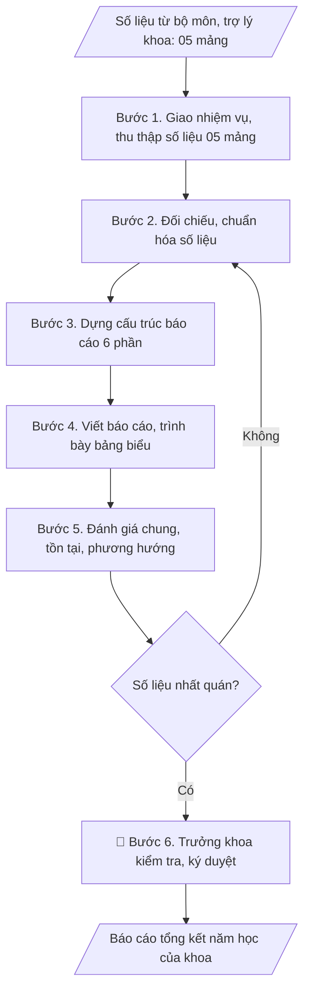

# Skill: Báo cáo tổng kết năm học của khoa

## Khi nào dùng
Khi kết thúc năm học, khoa cần tổng hợp toàn bộ hoạt động (đào tạo, NCKH, CTSV,
đội ngũ, CSVC) thành báo cáo gửi Ban Giám hiệu.

## Đầu vào (Input)

| Trường | Mô tả | Bắt buộc |
|---|---|---|
| `khoa` | Tên khoa | Có |
| `nam_hoc` | Năm học báo cáo | Có |
| `so_lieu_dao_tao` | Số ngành/CTĐT, số SV, tỷ lệ tốt nghiệp, kết quả học tập | Có |
| `so_lieu_nckh` | Số đề tài, bài báo, hội thảo, giáo trình | Có |
| `so_lieu_doi_ngu` | Số GV, trình độ (TS/ThS), biến động nhân sự | Có |
| `so_lieu_ctsv` | Học bổng, rèn luyện, kỷ luật, việc làm SV tốt nghiệp | Không |
| `ton_tai_phuong_huong` | Tồn tại và phương hướng năm tới | Không |

## Quy trình

**Bước 1. Giao nhiệm vụ và thu thập số liệu**
- Làm gì: Trưởng khoa giao nhiệm vụ tổng kết; gửi văn bản/phiếu yêu cầu số liệu đến
  các bộ môn và trợ lý khoa kèm biểu mẫu thống nhất và thời hạn nộp; đôn đốc và thu
  thập số liệu thô theo 05 mảng: đào tạo, NCKH, CTSV, đội ngũ, CSVC – tài chính; lập
  bảng theo dõi tiến độ nộp của từng đơn vị.
- Dùng input: `khoa`, `nam_hoc`
- Vai trò: Trưởng khoa · AI hỗ trợ: soạn văn bản yêu cầu số liệu và biểu mẫu thống nhất, Trưởng khoa giao nhiệm vụ · ⏱ 2–3 ngày làm việc (ước tính)
- Lưu ý nghiệp vụ: Biểu mẫu thu thập phải thống nhất đơn vị tính (số lượng, tỷ lệ %,
  mốc thời gian) ngay từ đầu — số liệu gửi về với đơn vị tính khác nhau là nguyên nhân
  số 1 gây mất thời gian chuẩn hóa; ấn định thời hạn nộp trước ít nhất 10 ngày so với
  hạn báo cáo của trường.
- → Kết quả bước: Bộ số liệu thô 05 mảng + bảng theo dõi tiến độ nộp của các bộ môn.

**Bước 2. Đối chiếu và chuẩn hóa số liệu**
- Làm gì: Kiểm tra tính đầy đủ của số liệu từng mảng; đối chiếu chéo với số liệu các
  phòng chức năng đã báo cáo (Đào tạo, KHCN, CTSV...) để phát hiện chênh lệch; chuẩn
  hóa đơn vị tính, quy về cùng mốc thời gian; lập bảng so sánh với năm học trước
  (tăng/giảm, % thay đổi).
- Dùng input: `so_lieu_dao_tao`, `so_lieu_nckh`, `so_lieu_doi_ngu`, `so_lieu_ctsv`
- Vai trò: Trợ lý Khoa · AI hỗ trợ: đối chiếu chéo, chuẩn hóa đơn vị tính và lập bảng so sánh năm trước · ⏱ 1–2 ngày làm việc (ước tính)
- Lưu ý nghiệp vụ: Số liệu khoa phải khớp với số liệu đã báo cáo của các phòng chức
  năng — chênh lệch là điểm kiểm tra đầu tiên của Ban Giám hiệu; mọi con số trong
  báo cáo đều phải truy được nguồn (bộ môn nào cung cấp); số liệu thiếu thì ghi rõ
  "chưa có số liệu" thay vì bịa.
- → Kết quả bước: Bảng số liệu chuẩn hóa 05 mảng (đã đối chiếu nhất quán, có cột so
  sánh với năm học trước).

**Bước 3. Dựng cấu trúc báo cáo 6 phần**
- Làm gì: Dựng dàn ý chi tiết theo 6 phần cố định: Phần 1 Khái quát; Phần 2 Công tác
  đào tạo; Phần 3 NCKH; Phần 4 Công tác sinh viên; Phần 5 Đội ngũ và CSVC; Phần 6
  Đánh giá chung và phương hướng; phân bổ số liệu chuẩn hóa vào từng phần; xác định
  các bảng biểu cần vẽ cho từng phần.
- Dùng input: `nam_hoc`, `khoa`
- Vai trò: Trưởng khoa · AI hỗ trợ: dựng dàn ý 6 phần và phân bổ số liệu, Trưởng khoa/bộ phận duyệt khung cấu trúc · ⏱ 2–3 giờ (ước tính)
- Lưu ý nghiệp vụ: Giữ nguyên thứ tự 6 phần qua các năm để Ban Giám hiệu dễ đối
  chiếu; Phần 1 chỉ tóm tắt quy mô đầu năm, không dồn hết số liệu vào đây.
- → Kết quả bước: Khung báo cáo 6 phần (dàn ý chi tiết + danh sách bảng biểu).

**Bước 4. Viết báo cáo và trình bày bảng biểu**
- Làm gì: Viết đầy đủ 6 phần theo dàn ý; trình bày số liệu bằng bảng biểu, kèm so
  sánh với năm học trước (tăng/giảm, %); nêu các kết quả nổi bật, điểm sáng của khoa
  bằng gạch đầu dòng cụ thể, có số liệu minh chứng; rà soát văn phong hành chính,
  chính tả.
- Dùng input: (xử lý trên số liệu chuẩn hóa từ Bước 2 và dàn ý từ Bước 3)
- Vai trò: Trợ lý Khoa · AI hỗ trợ: viết dự thảo 6 phần theo dàn ý kèm bảng biểu · ⏱ 1–2 ngày làm việc (ước tính)
- Lưu ý nghiệp vụ: Mỗi nhận định "tăng/giảm/tốt" phải có số liệu đi kèm — tránh nhận
  định chung chung không chứng cứ; bảng biểu phải có tiêu đề, đơn vị tính, nguồn số
  liệu; không đưa số liệu chưa được đối chiếu vào báo cáo chính thức.
- → Kết quả bước: Bản thảo báo cáo đầy đủ 6 phần với bảng biểu so sánh năm trước.

**Bước 5. Đánh giá chung, tồn tại và phương hướng**
- Làm gì: Tổng hợp ưu điểm nổi bật của năm học; xác định tồn tại, hạn chế (đối chiếu
  với mục tiêu/kế hoạch đầu năm); phân tích nguyên nhân khách quan/chủ quan; xây dựng
  phương hướng năm học tới: mục tiêu cụ thể, giải pháp, đơn vị thực hiện.
- Dùng input: `ton_tai_phuong_huong`
- Vai trò: Trưởng khoa · AI hỗ trợ: đề xuất dự thảo tồn tại và phương hướng từ đối chiếu kế hoạch, Trưởng khoa quyết định nội dung chính · ⏱ 3–5 giờ (ước tính)
- Lưu ý nghiệp vụ: Tồn tại phải nói thẳng, không né tránh — báo cáo "toàn ưu điểm"
  mất uy tín khi đối chiếu thực tế; mỗi tồn tại nên gắn với nguyên nhân và giải pháp
  tương ứng trong phương hướng; phương hướng phải có chỉ tiêu đo lường được, tránh
  chung chung.
- → Kết quả bước: Phần VI hoàn chỉnh (đánh giá chung – tồn tại – nguyên nhân –
  phương hướng năm học tới).

**Bước 6. Kiểm tra nhất quán và trình Trưởng khoa ký duyệt**
- Làm gì: Kiểm tra lần cuối: số liệu trong văn bản khớp với bảng biểu; tổng các bộ
  phận khớp với tổng toàn khoa; chính tả, thể thức văn bản; trình Trưởng khoa kiểm
  tra, ký duyệt; gửi báo cáo cho Ban Giám hiệu và lưu hồ sơ khoa.
- Dùng input: (kiểm tra trên bản thảo từ Bước 4–5)
- Vai trò: Trưởng khoa · AI hỗ trợ: tổng hợp, đối chiếu và trình bày số liệu · ⏱ 1–2 ngày làm việc (ước tính)
- Lưu ý nghiệp vụ: Lỗi hay gặp nhất ở bước này là số liệu trong văn bản và trong
  bảng không khớp nhau sau khi sửa; kiểm tra số ký hiệu văn bản, ngày tháng trước khi
  ký — báo cáo ký sai thể thức sẽ bị trả về.
- → Kết quả bước: Báo cáo tổng kết năm học của khoa đã ký duyệt + hồ sơ lưu.

## Luồng quy trình (Workflow)


## Đầu ra (Output)
- Báo cáo tổng kết năm học của khoa hoàn chỉnh.

**Cấu trúc output chuẩn** (sản phẩm chính: Báo cáo tổng kết năm học của khoa) — các
phần bắt buộc theo đúng thứ tự:
1. Tên trường (dòng trên), tên khoa (dòng dưới).
2. Số ký hiệu văn bản.
3. Địa danh, ngày tháng năm ban hành.
4. Tiêu đề: BÁO CÁO / Tổng kết năm học ...
5. Phần I. KHÁI QUÁT (quy mô đào tạo, đội ngũ đầu năm).
6. Phần II. CÔNG TÁC ĐÀO TẠO (tuyển sinh, giảng dạy, tốt nghiệp, kiểm định CTĐT).
7. Phần III. NGHIÊN CỨU KHOA HỌC (đề tài, bài báo, hội thảo, giáo trình).
8. Phần IV. CÔNG TÁC SINH VIÊN (học bổng, rèn luyện, kỷ luật, việc làm).
9. Phần V. ĐỘI NGŨ VÀ CƠ SỞ VẬT CHẤT.
10. Phần VI. ĐÁNH GIÁ CHUNG VÀ PHƯƠNG HƯỚNG (ưu điểm – tồn tại – phương hướng
    năm học tới).
11. Nơi nhận – Lưu.
12. Chữ ký Trưởng khoa (họ tên, học hàm/học vị).

## Checklist nghiệm thu

- [ ] Đủ 12 phần của "Cấu trúc output chuẩn": từ tiêu đề hành chính đến chữ ký Trưởng khoa.
- [ ] Số liệu trong văn bản khớp 100% với bảng biểu; tổng các bộ phận khớp với tổng toàn khoa.
- [ ] Số liệu khớp với số liệu đã báo cáo của các phòng chức năng (Đào tạo, KHCN, CTSV...).
- [ ] Không bịa đặt số liệu; số liệu thiếu được ghi rõ "chưa có số liệu" thay vì tự điền.
- [ ] Mỗi nhận định tăng/giảm/tốt đều có số liệu minh chứng đi kèm; bảng biểu có tiêu đề, đơn vị tính, nguồn số liệu.
- [ ] Đúng thể thức: số ký hiệu văn bản, ngày tháng, nơi nhận, chữ ký Trưởng khoa (họ tên, học hàm/học vị).
- [ ] Phần VI: tồn tại nêu thẳng với nguyên nhân; phương hướng có chỉ tiêu đo lường được và giải pháp tương ứng từng tồn tại.
- [ ] Đã qua Human gate: Trưởng khoa đã ký duyệt; báo cáo đã gửi Ban Giám hiệu.

Tiêu chí đạt = tất cả các ô được đánh dấu.

## Ví dụ mô phỏng (dữ liệu giả lập)

> Tất cả tên trường, cá nhân, số liệu dưới đây đều là **giả lập**, không liên quan tổ chức/cá nhân có thật.

### Input mẫu

| Trường | Giá trị |
|---|---|
| `khoa` | Khoa Công nghệ thông tin |
| `nam_hoc` | 2026–2027 |
| `so_lieu_dao_tao` | 03 ngành; 1.850 SV; tỷ lệ tốt nghiệp đúng hạn 72% |
| `so_lieu_nckh` | 06 đề tài (02 cấp bộ, 04 cấp trường); 18 bài báo (08 quốc tế); 01 hội thảo cấp trường |
| `so_lieu_doi_ngu` | 42 GV (12 TS, 28 ThS, 02 cử nhân); tuyển mới 03 TS |

### Output mẫu

```
TRƯỜNG ĐẠI HỌC A
KHOA CÔNG NGHỆ THÔNG TIN
      Số: 32/BC-ĐHA-CNTT
                                                 Thành phố C, ngày 09 tháng 10 năm 2026

BÁO CÁO
Tổng kết năm học 2026–2027

I. KHÁI QUÁT
Khoa đào tạo 03 ngành (CNTT, Kỹ thuật phần mềm, Trí tuệ nhân tạo) với 1.850 sinh viên;
đội ngũ 42 giảng viên (12 tiến sĩ, 28 thạc sĩ, 02 cử nhân).

II. CÔNG TÁC ĐÀO TẠO
- Tuyển sinh: đạt 105% chỉ tiêu (630/600).
- Tốt nghiệp: 420 SV, tỷ lệ tốt nghiệp đúng hạn 72% (+4% so với năm trước).
- Hoàn thành báo cáo tự đánh giá CTĐT ngành CNTT; 01 CTĐT được công nhận kiểm định.
- 100% học phần có đề cương chi tiết; ngân hàng đề thi cập nhật 25% câu hỏi mới.

III. NGHIÊN CỨU KHOA HỌC
- 06 đề tài (02 cấp bộ, 04 cấp trường), 100% nghiệm thu đạt.
- 18 bài báo khoa học (08 quốc tế, 10 trong nước).
- Tổ chức 01 hội thảo khoa học cấp trường với 45 báo cáo.
- Nghiệm thu 02 giáo trình.

IV. CÔNG TÁC SINH VIÊN
- 185 SV đạt học bổng khuyến khích học tập; 0 trường hợp kỷ luật từ cảnh cáo trở lên.
- 81% SV tốt nghiệp có việc làm trong 6 tháng.

V. ĐỘI NGŨ VÀ CƠ SỞ VẬT CHẤT
- Tuyển mới 03 tiến sĩ; 04 giảng viên đang học nghiên cứu sinh.
- Đưa vào sử dụng 01 phòng thí nghiệm AI (30 máy trạm).

VI. ĐÁNH GIÁ CHUNG VÀ PHƯƠNG HƯỚNG
1. Ưu điểm: tuyển sinh vượt chỉ tiêu; NCKH tăng trưởng (bài báo quốc tế +3).
2. Tồn tại: tỷ lệ giảng viên tiến sĩ mới đạt 28,6%; tỷ lệ tốt nghiệp đúng hạn
   chưa đạt mục tiêu 75%.
3. Phương hướng 2027–2028: tuyển thêm 02 TS; tăng cường cố vấn học tập;
   hoàn thành tự đánh giá CTĐT ngành Kỹ thuật phần mềm.

Nơi nhận:                                        TRƯỞNG KHOA
- Ban Giám hiệu (báo cáo);                            (đã ký)
- Lưu: VT khoa.

                                              TS. Phạm Văn B
```

## Căn cứ & lưu ý
- Quy chế tổ chức và hoạt động của Trường Đại học A (giả lập).
- Báo cáo khoa là đầu vào cho báo cáo tổng kết năm học toàn trường và báo cáo 3 công khai.
- Số liệu phải khớp với số liệu đã báo cáo của các phòng chức năng (đào tạo, KHCN, CTSV...).
- Không dùng tên thật của trường/cá nhân khi mô phỏng.
